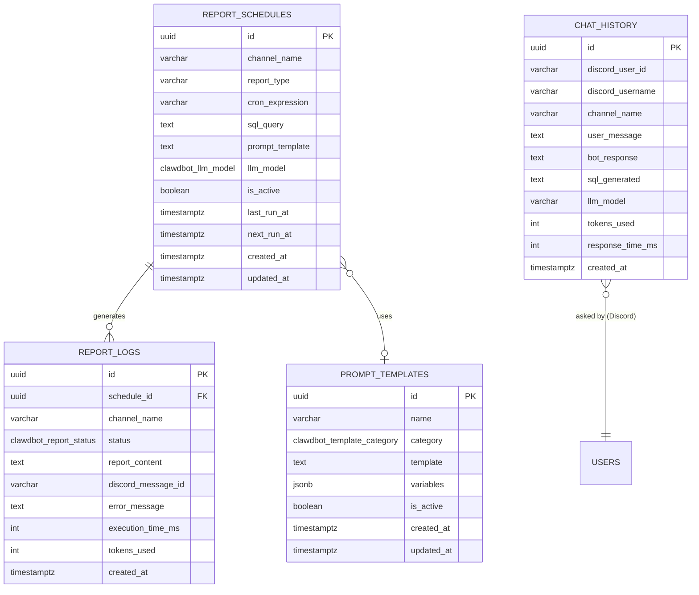

> ⚠️ **DEPRECATED** — Este módulo foi absorvido pelo **Astro** (v2.0, abril 2026).
> Conteúdo preservado para referência histórica. Use [astro.md](../intelligence/astro.md) como fonte de verdade.
> Schema `clawdbot` renomeado para `astro` no novo spec.

---

# Pulse — Discord Bot [DEPRECADO]

> **Module:** Pulse (Discord Bot)
> **Schema:** `clawdbot`
> **Route prefix:** `/api/v1/clawdbot`
> **Admin UI route group:** `(admin)/clawdbot/*`
> **Version:** 2.0
> **Date:** April 2026
> **Status:** Approved
> **Replaces:** None (new capability; previously no structured internal reporting)
> **References:** [DATABASE.md](../../architecture/DATABASE.md), [API.md](../../architecture/API.md), [AUTH.md](../../architecture/AUTH.md), [NOTIFICATIONS.md](../../platform/NOTIFICATIONS.md), [GLOSSARY.md](../../dev/GLOSSARY.md), [Dashboard spec](../intelligence/dashboard.md), [Astro spec](../intelligence/astro.md)

---

## 1. Purpose & Scope

Pulse is the **internal Discord bot and structured reporting engine** of Ambaril. It operates across 9 granular Discord channels, delivering automated data reports on a cron schedule and providing an interactive AI chat interface for ad-hoc data queries. Pulse is NOT a general-purpose AI assistant — it is a focused data retrieval and reporting tool that surfaces Ambaril operational, financial, and growth metrics directly inside the team's Discord workspace. Pulse is the "mouth" (Discord interface) — Astro is the "brain" (AI processing). Pulse uses Astro as its intelligence layer for AI-powered responses.

**LLM routing strategy:**

| Model             | Use Case                                           | Why                                                                                                                                                                      |
| ----------------- | -------------------------------------------------- | ------------------------------------------------------------------------------------------------------------------------------------------------------------------------ |
| **Claude Haiku**  | Structured scheduled reports (#report-\* channels) | Fast, cheap. Reports use pre-written SQL — Haiku only formats the results into human-readable pt-BR text. Token cost is minimal per report.                              |
| **Claude Sonnet** | Interactive chat (#geral-ia channel)               | Smarter. Chat requires SQL generation from natural language, context understanding, and nuanced pt-BR responses. Higher cost per message justified by interactive value. |

**Core responsibilities:**

| Capability                    | Description                                                                                                                                                                                                                      |
| ----------------------------- | -------------------------------------------------------------------------------------------------------------------------------------------------------------------------------------------------------------------------------- |
| **Scheduled reports**         | 8 scheduled reports across 7 #report-\* channels with cron-based timing (08:00 to 09:30 BRT). Pre-written SQL queries executed against the database, results formatted by Claude Haiku into Discord embed messages.              |
| **Real-time alerts**          | #alertas channel receives events from the Flare notification system. Stock critical, PLM delays, conversion drops, system errors — all pushed in real-time with severity-coded embeds.                                           |
| **Interactive AI chat**       | #geral-ia channel where any team member asks a question in natural language. Pulse uses Astro (Claude Sonnet) to understand the question, generate a read-only SQL query (if data-related), execute it, and format the response. |
| **Bot personality (SOUL.md)** | Pulse has a defined personality loaded as system prompt: direto (direct), dados primeiro (data-first), pt-BR informal but professional, no emoji except for trend indicators (arrows).                                           |
| **Admin UI**                  | Configuration interface within Ambaril admin for managing report schedules, viewing logs, browsing chat history, editing prompt templates, and monitoring bot settings.                                                          |

**Primary users:**

| User         | Role         | Usage Pattern                                                                                                       |
| ------------ | ------------ | ------------------------------------------------------------------------------------------------------------------- |
| **Marcus**   | `admin`      | Reads daily sales and financial reports in Discord. Asks strategic questions in #geral-ia. Configures bot settings. |
| **Caio**     | `pm`         | Reads marketing and commercial reports. Asks campaign performance questions in #geral-ia.                           |
| **Tavares**  | `operations` | Reads production and inventory reports. Receives PLM alerts in #alertas.                                            |
| **Pedro**    | `finance`    | Reads financial report. Asks margin and DRE questions in #geral-ia.                                                 |
| **All team** | various      | Receive real-time alerts in #alertas.                                                                               |

**Out of scope:** Pulse does NOT modify any data in Ambaril — it is strictly read-only. It does NOT handle customer-facing communication (owned by Mensageria). It does NOT generate dashboards or charts (owned by Dashboard / Beacon). It does NOT replace the admin UI for operational tasks — it surfaces data summaries in Discord for quick team consumption. AI intelligence features (Brand Brain, Module Context, Insight Cache, Rate Limiting, AI Feedback) are owned by the Astro module.

---

## 2. User Stories

### 2.1 Report Consumer Stories

| #     | As a...  | I want to...                                                                                                              | So that...                                                                                          | Acceptance Criteria                                                                                                                                                                                                                                                |
| ----- | -------- | ------------------------------------------------------------------------------------------------------------------------- | --------------------------------------------------------------------------------------------------- | ------------------------------------------------------------------------------------------------------------------------------------------------------------------------------------------------------------------------------------------------------------------ |
| US-01 | Marcus   | Receive a daily sales report at 08:00 in #report-vendas with total revenue, order count, average ticket, and top products | I can assess yesterday's sales performance before the day starts                                    | Report appears as Discord embed at 08:00 BRT sharp. Green embed color. Contains: total revenue (R$), order count, avg ticket, top 5 products by revenue, top 5 SKUs by units sold, revenue by payment method, comparison with previous day (% change with arrows). |
| US-02 | Marcus   | Receive a weekly sales summary every Monday in #report-vendas                                                             | I can review the full week's performance and compare with the previous week                         | Weekly embed appears Monday at 08:00. Contains all daily metrics aggregated plus week-over-week comparison. Title includes date range.                                                                                                                             |
| US-03 | Pedro    | Receive a daily financial report at 08:30 in #report-financeiro                                                           | I can monitor Mercado Pago balance, approval rates, and chargebacks without opening the admin panel | Report embed at 08:30 BRT. Blue color. Contains: MP balance, approval rate %, pending settlements, chargeback count + total amount, fees paid in the period.                                                                                                       |
| US-04 | Tavares  | Receive a daily inventory report at 08:15 in #report-estoque                                                              | I can immediately see which SKUs need attention before the production meeting                       | Report embed at 08:15 BRT. Yellow or red based on critical count. Contains: SKUs at reorder point, SKUs at critical (<=5 units), SKUs at zero, top 5 fastest depleting SKUs by velocity, total inventory value (R$).                                               |
| US-05 | Tavares  | Receive a daily production report at 08:45 in #report-producao                                                            | I can track production order progress and identify delays at a glance                               | Report embed at 08:45 BRT. Orange color. Contains: active production orders count, stages overdue (count + list), stages completing today, supplier delays, rework orders pending.                                                                                 |
| US-06 | Caio     | Receive a daily marketing report at 09:00 in #report-marketing                                                            | I can track campaign performance, creator program metrics, and social engagement daily              | Report embed at 09:00 BRT. Purple color. Contains: Instagram followers + engagement rate, new UGC detected (count), top UGC by engagement, creator program stats (new sales count, top creator by revenue), ad spend, ROAS, CPA.                                   |
| US-07 | Caio     | Receive a weekly commercial report on Monday at 09:30 in #report-comercial                                                | I can review B2B order volume and pipeline status for the week                                      | Report embed Monday 09:30 BRT. Teal color. Contains: B2B orders this week, total B2B revenue, top retailers by revenue, pipeline (pending approvals count), new retailer inquiries.                                                                                |
| US-08 | All team | Receive a weekly support report on Friday at 17:00 in #report-suporte                                                     | We can review customer support metrics before the weekend                                           | Report embed Friday 17:00 BRT. Gray color. Contains: tickets opened/resolved, avg first response time, avg resolution time, top topics by tag, SLA breaches, open exchange requests.                                                                               |

### 2.2 Alert Stories

| #     | As a...  | I want to...                                                                                                 | So that...                                                                 | Acceptance Criteria                                                                                                                                                                                                          |
| ----- | -------- | ------------------------------------------------------------------------------------------------------------ | -------------------------------------------------------------------------- | ---------------------------------------------------------------------------------------------------------------------------------------------------------------------------------------------------------------------------- |
| US-09 | Tavares  | Receive a real-time alert in #alertas when a SKU reaches critical stock during business hours                | I can take immediate action to prevent stockouts                           | Embed appears within 10 seconds of Flare event. Red color for critical, yellow for warning. Contains SKU code, product name, current quantity, depletion velocity, estimated days to zero. @mentions Tavares's Discord user. |
| US-10 | All team | Receive a real-time alert in #alertas when an external API goes down (Focus NFe, Melhor Envio, Mercado Pago) | We know immediately when integrations are broken and can adjust operations | Embed appears within 10 seconds. Red color. Contains API name, error type, timestamp, affected operations.                                                                                                                   |
| US-11 | Marcus   | Receive a real-time alert when conversion rate drops below threshold                                         | I can investigate and intervene on checkout issues immediately             | Embed appears when conversion drops below configured threshold. Yellow color. Contains current conversion rate, comparison with 24h average, session count, time window.                                                     |
| US-12 | Marcus   | Receive a real-time alert when a sales spike is detected during a drop                                       | I can monitor drop performance in real-time                                | Embed appears when sales rate exceeds 2x normal rate. Blue (info) color. Contains sales count in last 10 min, revenue, comparison with normal rate.                                                                          |

### 2.3 Interactive Chat Stories

| #     | As a...         | I want to...                                                                        | So that...                                                                 | Acceptance Criteria                                                                                                                                                                                     |
| ----- | --------------- | ----------------------------------------------------------------------------------- | -------------------------------------------------------------------------- | ------------------------------------------------------------------------------------------------------------------------------------------------------------------------------------------------------- |
| US-13 | Caio            | Ask "qual foi o ROAS da ultima campanha?" in #geral-ia and get a data-driven answer | I get instant campaign performance data without navigating the admin panel | Bot responds within 10 seconds. Generates SQL against marketing tables. Returns ROAS value, ad spend, revenue attributed, time period. Response in pt-BR informal.                                      |
| US-14 | Marcus          | Ask "quais os top 10 produtos por margem esse mes?" in #geral-ia                    | I can quickly identify our most profitable products                        | Bot generates SQL joining erp.skus + erp.margin_calculations. Returns ranked table with product name, SKU, margin %. Response formatted as Discord code block or embed.                                 |
| US-15 | Pedro           | Ask "quanto tivemos de chargeback nos ultimos 30 dias?" in #geral-ia                | I can get financial data instantly without running manual queries          | Bot generates SQL against erp.financial_transactions. Returns chargeback count, total amount, comparison with previous 30 days.                                                                         |
| US-16 | Tavares         | Ask "quais ordens de producao estao atrasadas?" in #geral-ia                        | I can get a quick list without opening the PLM module                      | Bot generates SQL against pcp.production_orders + pcp.production_stages. Returns list with order name, expected date, days overdue.                                                                     |
| US-17 | Any team member | Ask a non-data question like "como funciona o calculo de RFM?" in #geral-ia         | I can get a general knowledge answer from the bot                          | Bot detects this is not a data query. Responds with general knowledge using Claude Sonnet. Response is informative but concise. Bot clarifies it cannot access external data for this type of question. |

### 2.4 Admin Stories

| #     | As a... | I want to...                                   | So that...                                                                            | Acceptance Criteria                                                                                                                                     |
| ----- | ------- | ---------------------------------------------- | ------------------------------------------------------------------------------------- | ------------------------------------------------------------------------------------------------------------------------------------------------------- |
| US-18 | Marcus  | View and edit report schedules in the admin UI | I can adjust timing, enable/disable reports, and modify queries without touching code | Table of all 9 channel schedules with toggle, cron expression, last run status, next run time. Edit modal with query editor and prompt template editor. |
| US-19 | Marcus  | View report execution logs with full content   | I can audit what was sent to Discord and debug failures                               | Chronological log list filterable by channel, status (success/failed/partial), date range. Click to view full report content and error messages if any. |
| US-20 | Caio    | Search chat history in #geral-ia               | I can find previous answers and track what the team has been asking                   | Searchable log with discord username, question text, bot response, SQL generated (if any), timestamp. Filterable by user and date.                      |
| US-21 | Marcus  | Edit prompt templates used by Pulse            | I can refine the bot's output formatting and personality without code changes         | List of templates by category (report/chat/alert). Edit view with template text, variable placeholders preview, and test button.                        |
| US-22 | Marcus  | Manually trigger a report for any channel      | I can force a report outside its scheduled time for testing or on-demand needs        | "Run Now" button on each schedule row. Executes the report immediately and sends to Discord. Logged as manual run.                                      |

---

## 3. Data Model

### 3.1 Entity Relationship Diagram



**Cross-schema references:**

```
clawdbot reads from ALL schemas (read-only):
    checkout.orders           -- sales reports, chat queries
    checkout.order_items      -- product-level sales data
    checkout.carts            -- conversion data
    checkout.conversion_events -- funnel data
    erp.skus                  -- inventory, margin reports
    erp.inventory             -- stock reports
    erp.financial_transactions -- financial report
    erp.margin_calculations   -- margin queries
    erp.income_statements     -- DRE queries
    erp.nfe_documents         -- NF-e status
    erp.shipping_labels       -- shipping data
    pcp.production_orders     -- production report
    pcp.production_stages     -- stage status
    pcp.rework_orders         -- rework data
    crm.contacts              -- customer queries
    crm.rfm_scores            -- RFM queries
    marketing.ugc_posts       -- UGC report
    marketing.campaign_metrics -- marketing report
    creators.sales_attributions -- creator report
    creators.profiles         -- creator data
    b2b.b2b_orders            -- commercial report
    b2b.retailers             -- retailer data
    inbox.tickets             -- support report
    inbox.metrics_daily       -- support metrics
    trocas.exchange_requests  -- exchange data
    global.notifications      -- alert routing
```

### 3.2 Enums

```sql
CREATE TYPE clawdbot.llm_model AS ENUM ('haiku', 'sonnet');
CREATE TYPE clawdbot.report_status AS ENUM ('success', 'failed', 'partial');
CREATE TYPE clawdbot.template_category AS ENUM ('report', 'chat', 'alert');
```

### 3.3 clawdbot.report_schedules

| Column          | Type               | Constraints                   | Description                                                                                                          |
| --------------- | ------------------ | ----------------------------- | -------------------------------------------------------------------------------------------------------------------- |
| id              | UUID               | PK, DEFAULT gen_random_uuid() | UUID v7                                                                                                              |
| channel_name    | VARCHAR(50)        | NOT NULL                      | Discord channel name (e.g., "report-vendas", "report-financeiro")                                                    |
| report_type     | VARCHAR(50)        | NOT NULL                      | Report identifier (e.g., "daily_sales", "weekly_sales", "daily_financial")                                           |
| cron_expression | VARCHAR(50)        | NOT NULL                      | Cron schedule in BRT timezone (e.g., "0 8 \* \* \*" for daily 08:00)                                                 |
| sql_query       | TEXT               | NOT NULL                      | Pre-written SQL query to execute. May contain date placeholders like `{{period_start}}` and `{{period_end}}`.        |
| prompt_template | TEXT               | NOT NULL                      | LLM prompt template. Includes `{{data}}` placeholder for SQL results and `{{period}}` for human-readable date range. |
| llm_model       | clawdbot.llm_model | NOT NULL DEFAULT 'haiku'      | Which Claude model to use for formatting. Reports always use Haiku.                                                  |
| is_active       | BOOLEAN            | NOT NULL DEFAULT TRUE         | Toggle to enable/disable this report without deleting the schedule.                                                  |
| last_run_at     | TIMESTAMPTZ        | NULL                          | Timestamp of the last successful execution. NULL if never run.                                                       |
| next_run_at     | TIMESTAMPTZ        | NULL                          | Pre-computed next execution time based on cron expression. Updated after each run.                                   |
| created_at      | TIMESTAMPTZ        | NOT NULL DEFAULT NOW()        |                                                                                                                      |
| updated_at      | TIMESTAMPTZ        | NOT NULL DEFAULT NOW()        |                                                                                                                      |

**Indexes:**

```sql
CREATE INDEX idx_schedules_channel ON clawdbot.report_schedules (channel_name);
CREATE INDEX idx_schedules_active ON clawdbot.report_schedules (is_active) WHERE is_active = TRUE;
CREATE INDEX idx_schedules_next_run ON clawdbot.report_schedules (next_run_at ASC) WHERE is_active = TRUE;
CREATE UNIQUE INDEX idx_schedules_type ON clawdbot.report_schedules (report_type);
```

### 3.4 clawdbot.report_logs

| Column             | Type                   | Constraints                                | Description                                                                                         |
| ------------------ | ---------------------- | ------------------------------------------ | --------------------------------------------------------------------------------------------------- |
| id                 | UUID                   | PK, DEFAULT gen_random_uuid()              | UUID v7                                                                                             |
| schedule_id        | UUID                   | NOT NULL, FK clawdbot.report_schedules(id) | Which schedule generated this log                                                                   |
| channel_name       | VARCHAR(50)            | NOT NULL                                   | Discord channel name (denormalized for query efficiency)                                            |
| status             | clawdbot.report_status | NOT NULL                                   | success = sent to Discord, failed = error occurred, partial = SQL succeeded but Discord send failed |
| report_content     | TEXT                   | NOT NULL                                   | Full formatted report text that was (or would have been) sent to Discord                            |
| discord_message_id | VARCHAR(50)            | NULL                                       | Discord message ID if successfully sent. NULL on failure.                                           |
| error_message      | TEXT                   | NULL                                       | Error details if status is failed or partial                                                        |
| execution_time_ms  | INTEGER                | NOT NULL                                   | Total time from SQL execution to Discord send (or error)                                            |
| tokens_used        | INTEGER                | NULL                                       | Claude API tokens consumed for formatting. NULL if LLM call was skipped or failed.                  |
| created_at         | TIMESTAMPTZ            | NOT NULL DEFAULT NOW()                     | Immutable — append-only log                                                                         |

> **Immutability:** Report logs are append-only. Failed reports create a new log entry on retry, they do not update the original.

**Indexes:**

```sql
CREATE INDEX idx_logs_schedule ON clawdbot.report_logs (schedule_id);
CREATE INDEX idx_logs_channel ON clawdbot.report_logs (channel_name);
CREATE INDEX idx_logs_status ON clawdbot.report_logs (status);
CREATE INDEX idx_logs_created ON clawdbot.report_logs (created_at DESC);
CREATE INDEX idx_logs_channel_created ON clawdbot.report_logs (channel_name, created_at DESC);
```

### 3.5 clawdbot.chat_history

| Column           | Type         | Constraints                   | Description                                                                                                |
| ---------------- | ------------ | ----------------------------- | ---------------------------------------------------------------------------------------------------------- |
| id               | UUID         | PK, DEFAULT gen_random_uuid() | UUID v7                                                                                                    |
| discord_user_id  | VARCHAR(50)  | NOT NULL                      | Discord user snowflake ID                                                                                  |
| discord_username | VARCHAR(100) | NOT NULL                      | Discord display name at the time of the message (for readability in admin logs)                            |
| channel_name     | VARCHAR(50)  | NOT NULL DEFAULT 'geral-ia'   | Always "geral-ia" — bot only responds to chat in this channel                                              |
| user_message     | TEXT         | NOT NULL                      | The question asked by the team member                                                                      |
| bot_response     | TEXT         | NOT NULL                      | Pulse's full response                                                                                      |
| sql_generated    | TEXT         | NULL                          | The SQL query generated by Sonnet, if the question was data-related. NULL for general knowledge questions. |
| llm_model        | VARCHAR(20)  | NOT NULL DEFAULT 'sonnet'     | Always "sonnet" for chat. Stored for cost tracking consistency.                                            |
| tokens_used      | INTEGER      | NOT NULL                      | Total Claude API tokens consumed (prompt + completion)                                                     |
| response_time_ms | INTEGER      | NOT NULL                      | Time from receiving the Discord message to posting the response                                            |
| created_at       | TIMESTAMPTZ  | NOT NULL DEFAULT NOW()        | Immutable — append-only log                                                                                |

> **Immutability:** Chat history is append-only. Edits or deletions of Discord messages are not tracked — the original exchange is preserved.

**Indexes:**

```sql
CREATE INDEX idx_chat_user ON clawdbot.chat_history (discord_user_id);
CREATE INDEX idx_chat_username ON clawdbot.chat_history (discord_username);
CREATE INDEX idx_chat_created ON clawdbot.chat_history (created_at DESC);
CREATE INDEX idx_chat_message_search ON clawdbot.chat_history USING GIN (to_tsvector('portuguese', user_message));
CREATE INDEX idx_chat_response_search ON clawdbot.chat_history USING GIN (to_tsvector('portuguese', bot_response));
```

### 3.6 clawdbot.prompt_templates

| Column     | Type                       | Constraints                   | Description                                                                                                          |
| ---------- | -------------------------- | ----------------------------- | -------------------------------------------------------------------------------------------------------------------- |
| id         | UUID                       | PK, DEFAULT gen_random_uuid() | UUID v7                                                                                                              |
| name       | VARCHAR(100)               | NOT NULL, UNIQUE              | Template identifier (e.g., "sales_report_daily", "chat_system_prompt", "alert_stock_critical")                       |
| category   | clawdbot.template_category | NOT NULL                      | report, chat, or alert                                                                                               |
| template   | TEXT                       | NOT NULL                      | The prompt template text with `{{variable}}` placeholders                                                            |
| variables  | JSONB                      | NOT NULL DEFAULT '{}'         | Schema of available variables: `{ "data": "SQL query results as JSON", "period": "Human-readable date range", ... }` |
| is_active  | BOOLEAN                    | NOT NULL DEFAULT TRUE         | Toggle to enable/disable. Only one template per name can be active.                                                  |
| created_at | TIMESTAMPTZ                | NOT NULL DEFAULT NOW()        |                                                                                                                      |
| updated_at | TIMESTAMPTZ                | NOT NULL DEFAULT NOW()        |                                                                                                                      |

**Indexes:**

```sql
CREATE UNIQUE INDEX idx_templates_name ON clawdbot.prompt_templates (name) WHERE is_active = TRUE;
CREATE INDEX idx_templates_category ON clawdbot.prompt_templates (category);
```

---

## 4. Screens & Wireframes

### 4.1 Report Schedule Manager

```
+-----------------------------------------------------------------------------+
|  Pulse > Agendamentos                                    [+ Novo Schedule]|
+-----------------------------------------------------------------------------+
|                                                                               |
|  +------+------------------+------------------+--------+---------+---------+ |
|  | Ativo| Canal            | Tipo             | Cron   | Ultimo  | Proximo | |
|  +------+------------------+------------------+--------+---------+---------+ |
|  | [ON] | #report-vendas   | daily_sales      | 08:00d | 17/03 OK| 18/03   | |
|  | [ON] | #report-vendas   | weekly_sales     | Seg 08 | 10/03 OK| 17/03   | |
|  | [ON] | #report-estoque  | daily_inventory  | 08:15d | 17/03 OK| 18/03   | |
|  | [ON] | #report-financ.  | daily_financial  | 08:30d | 17/03 OK| 18/03   | |
|  | [ON] | #report-producao | daily_production | 08:45d | 17/03 OK| 18/03   | |
|  | [ON] | #report-marketing| daily_marketing  | 09:00d | 17/03 OK| 18/03   | |
|  | [ON] | #report-marketing| weekly_marketing | Seg 09 | 10/03 OK| 17/03   | |
|  | [ON] | #report-comercial| weekly_commercial| Seg 930| 10/03 OK| 17/03   | |
|  | [ON] | #report-suporte  | weekly_support   | Sex 17 | 14/03 OK| 21/03   | |
|  +------+------------------+------------------+--------+---------+---------+ |
|                                                                               |
|  Legenda: OK = sucesso, ERRO = falha, -- = nunca executado                   |
|                                                                               |
|  [Selecionar agendamento para editar ou clicar "Executar Agora"]             |
+-----------------------------------------------------------------------------+
```

### 4.2 Schedule Edit Modal

```
+---------------------------------------------------------------+
|  Editar Agendamento: daily_sales                   [X Fechar]  |
+---------------------------------------------------------------+
|                                                                 |
|  Canal:    [#report-vendas        v]                           |
|  Tipo:     [daily_sales           v]                           |
|  Cron:     [0 8 * * *             ]  (08:00 BRT diario)       |
|  Modelo:   [Haiku v]                                           |
|  Ativo:    [ON]                                                |
|                                                                 |
|  --- SQL Query ---                                             |
|  +-----------------------------------------------------------+|
|  | SELECT                                                      ||
|  |   SUM(o.total) as revenue,                                  ||
|  |   COUNT(o.id) as order_count,                               ||
|  |   AVG(o.total) as avg_ticket,                               ||
|  |   ...                                                       ||
|  | FROM checkout.orders o                                      ||
|  | JOIN checkout.order_items oi ON ...                          ||
|  | WHERE o.created_at >= '{{period_start}}'                    ||
|  |   AND o.created_at < '{{period_end}}'                       ||
|  +-----------------------------------------------------------+|
|                                                                 |
|  --- Prompt Template ---                                       |
|  +-----------------------------------------------------------+|
|  | Voce e o Pulse, assistente de dados da {tenant.name}.     ||
|  | Formate os dados a seguir como relatorio de vendas.         ||
|  | Dados: {{data}}                                             ||
|  | Periodo: {{period}}                                         ||
|  | Use pt-BR informal. Inclua comparacao com periodo anterior. ||
|  +-----------------------------------------------------------+|
|                                                                 |
|  [Testar Query]  [Testar Prompt]  [Salvar]  [Executar Agora]  |
+---------------------------------------------------------------+
```

### 4.3 Report Log Viewer

```
+-----------------------------------------------------------------------------+
|  Pulse > Logs de Relatorios            [Canal: Todos v] [Status: Todos v]|
|                                           [De: ____] [Ate: ____] [Filtrar]  |
+-----------------------------------------------------------------------------+
|                                                                               |
|  +----------+-----------------+--------+--------+--------+----------------+ |
|  | Data/Hora| Canal           | Tipo   | Status | Tempo  | Tokens         | |
|  +----------+-----------------+--------+--------+--------+----------------+ |
|  | 17/03 08 | #report-vendas  | daily  | [OK]   | 2.3s   | 487            | |
|  | 17/03 815| #report-estoque | daily  | [OK]   | 1.8s   | 312            | |
|  | 17/03 830| #report-financ. | daily  | [OK]   | 2.1s   | 401            | |
|  | 17/03 845| #report-producao| daily  | [ERRO] | 5.2s   | --             | |
|  | 17/03 900| #report-market. | daily  | [OK]   | 3.1s   | 623            | |
|  +----------+-----------------+--------+--------+--------+----------------+ |
|                                                                               |
|  Clique em uma linha para ver conteudo completo e detalhes de erro.          |
+-----------------------------------------------------------------------------+
```

### 4.4 Chat History

```
+-----------------------------------------------------------------------------+
|  Pulse > Historico de Chat (#geral-ia)      [Buscar: ________________]   |
|                                           [Usuario: Todos v] [Filtrar]      |
+-----------------------------------------------------------------------------+
|                                                                               |
|  +----------+----------+----------------------------+--------+--------+     |
|  | Data/Hora| Usuario  | Pergunta                   | SQL?   | Tempo  |     |
|  +----------+----------+----------------------------+--------+--------+     |
|  | 17/03 14 | Caio     | qual foi o ROAS da ultima  | Sim    | 4.2s   |     |
|  |          |          | campanha?                   |        |        |     |
|  | 17/03 11 | Marcus   | top 10 produtos por margem | Sim    | 3.8s   |     |
|  | 17/03 10 | Pedro    | quanto de chargeback nos    | Sim    | 2.9s   |     |
|  |          |          | ultimos 30 dias?            |        |        |     |
|  | 16/03 16 | Tavares  | como funciona o calculo     | Nao    | 1.5s   |     |
|  |          |          | de RFM?                     |        |        |     |
|  +----------+----------+----------------------------+--------+--------+     |
|                                                                               |
|  Clique para ver pergunta completa, resposta, e SQL gerado.                  |
+-----------------------------------------------------------------------------+
```

### 4.5 Prompt Template Editor

```
+-----------------------------------------------------------------------------+
|  Pulse > Templates de Prompt                            [+ Novo Template] |
+-----------------------------------------------------------------------------+
|                                                                               |
|  +--------+---------------------------+----------+--------+                  |
|  | Cat.   | Nome                      | Ativo    | Vars   |                  |
|  +--------+---------------------------+----------+--------+                  |
|  | report | sales_report_daily        | [ON]     | 3      |                  |
|  | report | sales_report_weekly       | [ON]     | 3      |                  |
|  | report | financial_report_daily    | [ON]     | 3      |                  |
|  | report | inventory_report_daily    | [ON]     | 3      |                  |
|  | report | production_report_daily   | [ON]     | 3      |                  |
|  | report | marketing_report_daily    | [ON]     | 3      |                  |
|  | report | commercial_report_weekly  | [ON]     | 3      |                  |
|  | report | support_report_weekly     | [ON]     | 3      |                  |
|  | chat   | chat_system_prompt        | [ON]     | 1      |                  |
|  | alert  | alert_stock_critical      | [ON]     | 5      |                  |
|  | alert  | alert_pcp_overdue         | [ON]     | 4      |                  |
|  | alert  | alert_conversion_drop     | [ON]     | 3      |                  |
|  | alert  | alert_api_down            | [ON]     | 3      |                  |
|  +--------+---------------------------+----------+--------+                  |
+-----------------------------------------------------------------------------+
```

### 4.6 Bot Settings

```
+-----------------------------------------------------------------------------+
|  Pulse > Configuracoes do Bot                                             |
+-----------------------------------------------------------------------------+
|                                                                               |
|  --- Conexao Discord ---                                                     |
|  Status:     [Conectado] (verde)                                             |
|  Bot Token:  [••••••••••••••••] [Mostrar]                                   |
|  Server ID:  [123456789012345678]                                            |
|  Ultimo ping: 17/03 14:32:01 (latencia 42ms)                                |
|                                                                               |
|  --- Modelos LLM ---                                                         |
|  Reports:    [Claude Haiku    v]                                             |
|  Chat:       [Claude Sonnet   v]                                             |
|  API Key:    [••••••••••••••••] [Mostrar]                                   |
|                                                                               |
|  --- Rate Limits ---                                                         |
|  Chat msgs/usuario/hora:  [20]                                               |
|  SQL timeout (segundos):  [10]                                               |
|  Max linhas resultado:    [1000]                                             |
|                                                                               |
|  --- @Mention Mapping ---                                                    |
|  +------------------+---------------------------+                            |
|  | Nome {tenant.name} | Discord User ID           |                            |
|  +------------------+---------------------------+                            |
|  | Marcus           | 111111111111111111        |                            |
|  | Caio             | 222222222222222222        |                            |
|  | Tavares          | 333333333333333333        |                            |
|  | Pedro            | 444444444444444444        |                            |
|  | Ana Clara        | 555555555555555555        |                            |
|  | Slimgust         | 666666666666666666        |                            |
|  +------------------+---------------------------+                            |
|  [+ Adicionar]                                                               |
|                                                                               |
|  [Salvar Configuracoes]                                                      |
+-----------------------------------------------------------------------------+
```

---

## 5. Channel Specifications

### 5.1 #report-vendas (Sales Report)

**Schedule:** Daily at 08:00 BRT + Weekly on Monday at 08:00 BRT

**Daily Metrics:**

| Metric                    | SQL Source                                                                              | Format                                    |
| ------------------------- | --------------------------------------------------------------------------------------- | ----------------------------------------- |
| Total revenue             | `SUM(checkout.orders.total) WHERE status NOT IN ('cancelled') AND created_at IN period` | R$ with thousands separator               |
| Order count               | `COUNT(checkout.orders.id) WHERE status NOT IN ('cancelled') AND created_at IN period`  | Integer                                   |
| Average ticket            | `AVG(checkout.orders.total) WHERE status NOT IN ('cancelled') AND created_at IN period` | R$ with 2 decimals                        |
| Top 5 products by revenue | `SUM(oi.total_price) GROUP BY oi.product_name ORDER BY SUM DESC LIMIT 5`                | Ranked list with R$                       |
| Top 5 SKUs by units       | `SUM(oi.quantity) GROUP BY oi.sku_code ORDER BY SUM DESC LIMIT 5`                       | Ranked list with unit count               |
| Revenue by payment method | `SUM(o.total) GROUP BY o.payment_method`                                                | PIX / Cartao / Boleto with R$ and % share |
| Period comparison         | Same metrics for previous day/week                                                      | % change with arrows                      |

**Discord Embed:**

```
+---------------------------------------------------------------+
| Relatorio de Vendas — 17/03/2026 (Segunda)          [verde]   |
+---------------------------------------------------------------+
|                                                                 |
| Faturamento:  R$ 8.432,50 (+12,3% vs ontem)                   |
| Pedidos:      38 (+5 vs ontem)                                 |
| Ticket Medio: R$ 221,91 (+3,1%)                               |
|                                                                 |
| Top 5 Produtos (Revenue):                                     |
| 1. Moletom Oversized Preto     R$ 2.156,00                    |
| 2. Camiseta Basic Off-White    R$ 1.423,50                    |
| 3. Calca Cargo Cinza           R$ 1.089,90                    |
| 4. Bone Aba Reta Preto         R$   567,60                    |
| 5. Meia Pack x3 Preta          R$   389,70                    |
|                                                                 |
| Top 5 SKUs (Unidades):                                        |
| 1. SKU-0412-M-PRETO    14 un                                  |
| 2. SKU-0301-G-OFF       9 un                                  |
| 3. SKU-0412-G-PRETO     8 un                                  |
| 4. SKU-0505-M-CINZA     7 un                                  |
| 5. SKU-0201-UN-PRETO    6 un                                  |
|                                                                 |
| Pagamento:                                                     |
| PIX       R$ 4.216,25 (50%)                                   |
| Cartao    R$ 3.374,00 (40%)                                   |
| Boleto    R$   842,25 (10%)                                   |
|                                                                 |
| vs 16/03: Receita +12,3% | Pedidos +15,2% | Ticket -2,5%     |
+---------------------------------------------------------------+
```

### 5.2 #report-financeiro (Financial Report)

**Schedule:** Daily at 08:30 BRT

**Metrics:**

| Metric               | SQL Source                                                                                                                                 | Format     |
| -------------------- | ------------------------------------------------------------------------------------------------------------------------------------------ | ---------- |
| Mercado Pago balance | `SUM(amount) FROM erp.financial_transactions WHERE status = 'settled' AND type = 'sale' - SUM WHERE type IN ('refund','chargeback','fee')` | R$         |
| Approval rate        | `COUNT(WHERE payment_status = 'approved') / COUNT(total payments) * 100`                                                                   | Percentage |
| Pending settlements  | `SUM(amount) FROM erp.financial_transactions WHERE status = 'pending' AND type = 'sale'`                                                   | R$         |
| Chargebacks          | `COUNT + SUM(amount) FROM erp.financial_transactions WHERE type = 'chargeback' AND created_at IN period`                                   | Count + R$ |
| Fees paid            | `SUM(ABS(amount)) FROM erp.financial_transactions WHERE type = 'fee' AND created_at IN period`                                             | R$         |

**Discord Embed:** Blue color (#3498db). Title: "Relatorio Financeiro — {date}".

### 5.3 #report-estoque (Inventory Report)

**Schedule:** Daily at 08:15 BRT

**Metrics:**

| Metric                  | SQL Source                                                                                                                                                                                            | Format                           |
| ----------------------- | ----------------------------------------------------------------------------------------------------------------------------------------------------------------------------------------------------- | -------------------------------- |
| SKUs at reorder point   | `COUNT FROM erp.inventory WHERE quantity_available <= reorder_point AND quantity_available > 0`                                                                                                       | Integer + list                   |
| SKUs at critical (<=5)  | `COUNT FROM erp.inventory i JOIN erp.skus s ON ... WHERE i.quantity_available <= 5 AND i.quantity_available > 0`                                                                                      | Integer + list                   |
| SKUs at zero            | `COUNT FROM erp.inventory WHERE quantity_available = 0`                                                                                                                                               | Integer + list                   |
| Top 5 fastest depleting | `SELECT s.sku_code, i.depletion_velocity, i.quantity_available / NULLIF(i.depletion_velocity, 0) as days_to_zero FROM erp.inventory i JOIN erp.skus s ... ORDER BY i.depletion_velocity DESC LIMIT 5` | Ranked list with velocity + days |
| Total inventory value   | `SUM(i.quantity_available * s.price) FROM erp.inventory i JOIN erp.skus s ...`                                                                                                                        | R$                               |

**Additional sections (SKU Tier Analysis):**

| Section                    | Content                                                                 | Detail                                                                                                                                                                                                |
| -------------------------- | ----------------------------------------------------------------------- | ----------------------------------------------------------------------------------------------------------------------------------------------------------------------------------------------------- |
| Tier breakdown             | "Classificacao: {n_gold} Ouro \| {n_silver} Prata \| {n_bronze} Bronze" | Count of SKUs per tier based on revenue contribution and depletion velocity. Gold = top 20% revenue contributors, Silver = next 30%, Bronze = bottom 50%.                                             |
| Gold SKUs at risk          | "SKUs Ouro em Risco:"                                                   | Lists Gold-tier SKUs where `days_to_zero < 14`. Format: `SKU code — {days_to_zero} dias restantes, velocidade {velocity} un/dia`. These represent highest revenue impact if stockout occurs.          |
| Bronze SKUs to discontinue | "SKUs Bronze para Descontinuar:"                                        | Lists Bronze-tier SKUs with zero sales in the last 60+ days. Format: `SKU code — 0 vendas em {days} dias, estoque: {qty} un`. These represent dead stock candidates for clearance or discontinuation. |

**Discord Embed:** Yellow (#f1c40f) if critical count <= 3, Red (#e74c3c) if critical count > 3. Title: "Relatorio de Estoque — {date}".

**Extended embed example with tier analysis:**

```
+---------------------------------------------------------------+
| Relatorio de Estoque — 26/03/2026 (Quarta)          [amarelo] |
+---------------------------------------------------------------+
|                                                                 |
| SKUs no ponto de reposicao: 8                                  |
| SKUs criticos (<=5 un): 3                                      |
| SKUs zerados: 5                                                |
| Valor total em estoque: R$ 234.567,00                          |
|                                                                 |
| Top 5 Depletacao Rapida:                                       |
| 1. SKU-0412-M-PRETO   4.2 un/dia  (~3 dias restantes)        |
| 2. SKU-0301-G-OFF     3.1 un/dia  (~8 dias restantes)        |
| 3. SKU-0505-M-CINZA   2.8 un/dia  (~12 dias restantes)       |
| 4. SKU-0412-G-PRETO   2.3 un/dia  (~15 dias restantes)       |
| 5. SKU-0201-UN-PRETO  1.9 un/dia  (~22 dias restantes)       |
|                                                                 |
| Classificacao: 18 Ouro | 34 Prata | 90 Bronze                 |
|                                                                 |
| SKUs Ouro em Risco (dias restantes < 14):                      |
| - SKU-0412-M-PRETO — 3 dias, vel. 4.2 un/dia                 |
| - SKU-0301-G-OFF — 8 dias, vel. 3.1 un/dia                   |
| - SKU-0505-M-CINZA — 12 dias, vel. 2.8 un/dia                |
|                                                                 |
| SKUs Bronze para Descontinuar (0 vendas 60+ dias):            |
| - SKU-0892-P-VERDE — 0 vendas em 94 dias, estoque: 23 un     |
| - SKU-0344-GG-BEGE — 0 vendas em 78 dias, estoque: 15 un     |
| - SKU-0211-M-ROXO — 0 vendas em 67 dias, estoque: 8 un       |
|                                                                 |
| vs 25/03: Criticos +1 | Zerados = | Valor -0.8%              |
+---------------------------------------------------------------+
```

### 5.4 #report-producao (Production Report)

**Schedule:** Daily at 08:45 BRT

**Metrics:**

| Metric                   | SQL Source                                                                                           | Format                                                            |
| ------------------------ | ---------------------------------------------------------------------------------------------------- | ----------------------------------------------------------------- |
| Active production orders | `COUNT FROM pcp.production_orders WHERE status IN ('in_production', 'planning')`                     | Integer                                                           |
| Stages overdue           | `COUNT FROM pcp.production_stages WHERE status != 'completed' AND estimated_end_date < NOW()`        | Integer + list of overdue stages with order name and days overdue |
| Stages completing today  | `COUNT FROM pcp.production_stages WHERE estimated_end_date = CURRENT_DATE AND status != 'completed'` | Integer + list                                                    |
| Supplier delays          | `COUNT FROM pcp.production_stages WHERE stage_type = 'supplier' AND status = 'delayed'`              | Integer + supplier names                                          |
| Rework orders pending    | `COUNT FROM pcp.rework_orders WHERE status = 'pending'`                                              | Integer                                                           |

**Discord Embed:** Orange (#e67e22). Title: "Relatorio de Producao — {date}".

### 5.5 #report-marketing (Marketing Report)

**Schedule:** Daily at 09:00 BRT + Weekly on Monday at 09:00 BRT

**Metrics:**

| Metric                         | SQL Source                                                                                                                                          | Format               |
| ------------------------------ | --------------------------------------------------------------------------------------------------------------------------------------------------- | -------------------- |
| Instagram followers/engagement | `SELECT followers, engagement_rate FROM marketing.social_metrics ORDER BY date DESC LIMIT 1`                                                        | Count + %            |
| UGC detected (new)             | `COUNT FROM marketing.ugc_posts WHERE detected_at >= {{period_start}}`                                                                              | Integer              |
| Top UGC by engagement          | `SELECT username, engagement, post_url FROM marketing.ugc_posts ORDER BY engagement DESC LIMIT 3`                                                   | Ranked list          |
| Creator program: new sales     | `COUNT FROM creators.sales_attributions WHERE confirmed_at >= {{period_start}}`                                                                     | Integer              |
| Creator program: top creator   | `SELECT c.name, SUM(sa.commission_amount) FROM creators.profiles c JOIN creators.sales_attributions sa ... GROUP BY c.id ORDER BY SUM DESC LIMIT 1` | Name + R$ commission |
| Ad spend                       | `SUM(spend) FROM marketing.campaign_metrics WHERE date >= {{period_start}}`                                                                         | R$                   |
| ROAS                           | `SUM(revenue) / NULLIF(SUM(spend), 0) FROM marketing.campaign_metrics WHERE date >= {{period_start}}`                                               | Decimal (e.g., 3.2x) |
| CPA                            | `SUM(spend) / NULLIF(COUNT(conversions), 0) FROM marketing.campaign_metrics WHERE date >= {{period_start}}`                                         | R$                   |

**Discord Embed:** Purple (#9b59b6). Title: "Relatorio de Marketing — {date}".

### 5.6 #report-comercial (Commercial / B2B Report)

**Schedule:** Weekly on Monday at 09:30 BRT

**Metrics:**

| Metric                 | SQL Source                                                                                                                   | Format              |
| ---------------------- | ---------------------------------------------------------------------------------------------------------------------------- | ------------------- |
| B2B orders this week   | `COUNT FROM b2b.b2b_orders WHERE created_at >= {{period_start}}`                                                             | Integer             |
| B2B revenue            | `SUM(total) FROM b2b.b2b_orders WHERE created_at >= {{period_start}} AND status NOT IN ('cancelled')`                        | R$                  |
| Top retailers          | `SELECT r.company_name, SUM(o.total) FROM b2b.b2b_orders o JOIN b2b.retailers r ... GROUP BY r.id ORDER BY SUM DESC LIMIT 5` | Ranked list with R$ |
| Pipeline (pending)     | `COUNT FROM b2b.b2b_orders WHERE status = 'pending_approval'`                                                                | Integer             |
| New retailer inquiries | `COUNT FROM b2b.retailers WHERE created_at >= {{period_start}} AND status = 'pending'`                                       | Integer             |

**Discord Embed:** Teal (#1abc9c). Title: "Relatorio Comercial — Semana {week_number}".

### 5.7 #report-suporte (Support Report)

**Schedule:** Weekly on Friday at 17:00 BRT

**Metrics:**

| Metric                  | SQL Source                                                                                           | Format          |
| ----------------------- | ---------------------------------------------------------------------------------------------------- | --------------- |
| Tickets opened          | `COUNT FROM inbox.tickets WHERE created_at >= {{period_start}}`                                      | Integer         |
| Tickets resolved        | `COUNT FROM inbox.tickets WHERE resolved_at >= {{period_start}}`                                     | Integer         |
| Avg first response time | `AVG(first_response_at - created_at) FROM inbox.tickets WHERE first_response_at >= {{period_start}}` | Hours + minutes |
| Avg resolution time     | `AVG(resolved_at - created_at) FROM inbox.tickets WHERE resolved_at >= {{period_start}}`             | Hours + minutes |
| Top topics by tag       | `SELECT tag, COUNT(*) FROM inbox.ticket_tags GROUP BY tag ORDER BY COUNT DESC LIMIT 5`               | Ranked list     |
| SLA breaches            | `COUNT FROM inbox.tickets WHERE sla_breached = TRUE AND created_at >= {{period_start}}`              | Integer         |
| Open exchange requests  | `COUNT FROM trocas.exchange_requests WHERE status IN ('pending', 'in_progress')`                     | Integer         |

**Discord Embed:** Gray (#95a5a6). Title: "Relatorio de Suporte — Semana {week_number}".

### 5.8 #alertas (Real-time Alerts)

**Schedule:** None — event-driven via Flare notification system.

**Supported Alert Events:**

| Event Key                          | Source    | Embed Color      | @Mention         | Content                                                                                                                                                                                                                                                 |
| ---------------------------------- | --------- | ---------------- | ---------------- | ------------------------------------------------------------------------------------------------------------------------------------------------------------------------------------------------------------------------------------------------------- |
| `stock.critical`                   | ERP       | Red (#e74c3c)    | @Tavares         | SKU code, product name, quantity remaining, depletion velocity, estimated days to zero                                                                                                                                                                  |
| `stock.low`                        | ERP       | Yellow (#f1c40f) | --               | SKU code, product name, quantity, reorder point                                                                                                                                                                                                         |
| `pcp.stage.overdue`                | PLM       | Orange (#e67e22) | @Tavares         | Production order name, stage name, expected date, days overdue                                                                                                                                                                                          |
| `conversion.dropped`               | Dashboard | Yellow (#f1c40f) | @Caio            | Current conversion rate, 24h average, drop magnitude, session count                                                                                                                                                                                     |
| `sales.spike`                      | Dashboard | Blue (#3498db)   | @Marcus          | Sales in last 10 min, revenue, comparison with normal rate                                                                                                                                                                                              |
| `system.external_api_down`         | Platform  | Red (#e74c3c)    | @Marcus          | API name (Focus NFe / Melhor Envio / Mercado Pago / Meta), error type, affected operations                                                                                                                                                              |
| `chargeback.received`              | ERP       | Red (#e74c3c)    | @Marcus @Pedro   | Order number, amount, customer CPF (masked), payment method                                                                                                                                                                                             |
| `nfe.rejected`                     | ERP       | Red (#e74c3c)    | @Tavares         | Order number, NF-e error message, retry count                                                                                                                                                                                                           |
| `order.high_value`                 | Checkout  | Blue (#3498db)   | @Marcus          | Order number, total (when > R$ 500), product list                                                                                                                                                                                                       |
| `inventory.revenue_leak_threshold` | ERP       | Yellow (#f1c40f) | @Tavares @Marcus | SKU code, product name, days out of stock, estimated revenue loss (R$), action: evaluate urgent restock. Fires when cumulative revenue leak for a single SKU exceeds R$ 500 (configurable threshold). Ref: Pandora96 revenue leak monitoring principle. |
| `inventory.restock_suggestion`     | ERP       | Blue (#3498db)   | @Tavares         | SKU code, product name, current days-to-zero, SKU tier (Gold/Silver/Bronze), suggested production order quantity. Fires daily for Gold-tier SKUs with days-to-zero < 10. Proactive restock recommendation based on depletion velocity.                  |

**Embed Format:**

```
+---------------------------------------------------------------+
| [CRITICO] Estoque Zerado — SKU-0412-P-PRETO         [vermelho]|
+---------------------------------------------------------------+
| Produto: Camiseta Oversized Preto (P)                         |
| Quantidade: 0 un                                               |
| Velocidade de depletacao: 2.3 un/dia                           |
| Producao pendente: 50 un (PO-2026-047)                         |
|                                                                 |
| @Tavares acao necessaria.                                      |
| 17/03/2026 14:32 BRT                                           |
+---------------------------------------------------------------+
```

**Revenue Leak Alert embed:**

```
+---------------------------------------------------------------+
| [ALERTA] Revenue Leak — SKU-0412-P-PRETO            [amarelo] |
+---------------------------------------------------------------+
| ⚠️ SKU SKU-0412-P-PRETO (Camiseta Oversized Preto P)          |
| sem estoque ha 12 dias.                                        |
| Perda estimada: R$ 1.840,00                                    |
| (baseado em velocidade de depletacao × preco medio)            |
|                                                                 |
| Acao: avaliar reposicao urgente.                               |
|                                                                 |
| @Tavares @Marcus acao necessaria.                              |
| 26/03/2026 08:15 BRT                                           |
+---------------------------------------------------------------+
```

**Restock Suggestion Alert embed:**

```
+---------------------------------------------------------------+
| [INFO] Sugestao de Reposicao — SKU-0301-G-OFF        [azul]   |
+---------------------------------------------------------------+
| 🔄 SKU SKU-0301-G-OFF (Camiseta Basic Off-White G)             |
| Cobertura: 8 dias                                               |
| Tier: Ouro                                                      |
| Velocidade de depletacao: 3.1 un/dia                            |
| Sugestao: gerar OP de 93 unidades                               |
| (baseado em velocidade de depletacao × 30 dias)                 |
|                                                                 |
| @Tavares avaliar abertura de ordem de producao.                |
| 26/03/2026 08:15 BRT                                           |
+---------------------------------------------------------------+
```

### 5.9 #geral-ia (Interactive AI Chat)

**Schedule:** None — on-demand, triggered by team messages in the channel.

**Flow:**

```
1. Team member sends message in #geral-ia
2. Bot receives message via Discord API (bot token, message event)
3. Bot checks rate limit (20 msgs/user/hour)
4. If rate limited: respond with "Calma, tu ja mandou 20 perguntas nessa hora. Tenta de novo em {minutes}."
5. Bot sends user_message + SOUL.md system prompt + schema context to Claude Sonnet
6. Sonnet classifies: data query or general question?
7. If data query:
   a. Sonnet generates SELECT query
   b. Bot validates: only SELECT allowed (regex check for INSERT/UPDATE/DELETE/DROP/ALTER/TRUNCATE/CREATE)
   c. Bot executes query with 10-second timeout and 1000-row limit
   d. If query fails: respond with error explanation (not raw SQL error)
   e. If query succeeds: send results + original question to Sonnet for formatting
   f. Sonnet formats response in pt-BR with the data
8. If general question:
   a. Sonnet responds with general knowledge, staying in character (SOUL.md personality)
9. Bot posts response to #geral-ia
10. Bot logs the exchange to `clawdbot.chat_history`
```

**Safety Rails:**

| Rail                   | Implementation                                                                                                                                                                                                      |
| ---------------------- | ------------------------------------------------------------------------------------------------------------------------------------------------------------------------------------------------------------------- |
| Read-only queries only | Regex validation: reject any query containing `INSERT`, `UPDATE`, `DELETE`, `DROP`, `ALTER`, `TRUNCATE`, `CREATE`, `GRANT`, `REVOKE`. Case-insensitive. Also reject `INTO` after `SELECT` (prevents `SELECT INTO`). |
| Query timeout          | PostgreSQL `statement_timeout` set to 10 seconds for the chat query connection. If exceeded, return: "Query demorou demais. Tenta reformular a pergunta de forma mais especifica."                                  |
| Result limit           | `LIMIT 1000` appended to all generated queries. If query already has LIMIT, use the smaller value.                                                                                                                  |
| Schema context         | Sonnet receives the Ambaril database schema (table names, column names, types) as context. Does NOT receive actual data as context — only schema structure.                                                         |
| Error handling         | SQL errors are NOT shown to the user. Bot responds with a human-readable message: "Nao consegui gerar uma query valida pra essa pergunta. Tenta reformular?"                                                        |
| No mutations           | Database connection uses a read-only PostgreSQL role (`pulse_readonly`) with SELECT-only grants on all schemas.                                                                                                     |

**SOUL.md Personality (loaded as system prompt):**

```
Voce e o Pulse, assistente de dados da {tenant.name} ({tenant.description}).
Estilo: direto, dados primeiro, sem enrolacao.
Idioma: pt-BR informal mas profissional. Pode usar giria leve (tipo "mano", "tlgd").
Nao use emoji exceto para indicar tendencias: (cima) e (baixo).
Quando tiver dados, sempre lidere com o numero antes da explicacao.
Se nao souber a resposta com certeza, diga que nao sabe.
Nunca invente dados. Se a query nao retornar resultado, diga "sem dados pra esse periodo".
Voce conhece o schema completo do Ambaril e pode consultar qualquer tabela.
```

---

## 6. API Endpoints

All endpoints follow the patterns defined in [API.md](../../architecture/API.md). Module prefix: `/api/v1/clawdbot`.

### 6.1 Report Schedules

| Method | Path                                 | Auth     | Description                                                            | Request Body / Query                                                                                 | Response                                                            |
| ------ | ------------------------------------ | -------- | ---------------------------------------------------------------------- | ---------------------------------------------------------------------------------------------------- | ------------------------------------------------------------------- |
| GET    | `/schedules`                         | Internal | List all report schedules                                              | `?channel=&isActive=&sort=nextRunAt`                                                                 | `{ data: Schedule[] }`                                              |
| GET    | `/schedules/:id`                     | Internal | Get schedule detail                                                    | --                                                                                                   | `{ data: Schedule }`                                                |
| POST   | `/schedules`                         | Internal | Create new schedule                                                    | `{ channel_name, report_type, cron_expression, sql_query, prompt_template, llm_model?, is_active? }` | `201 { data: Schedule }`                                            |
| PATCH  | `/schedules/:id`                     | Internal | Update schedule                                                        | `{ channel_name?, cron_expression?, sql_query?, prompt_template?, llm_model?, is_active? }`          | `{ data: Schedule }`                                                |
| DELETE | `/schedules/:id`                     | Internal | Delete schedule                                                        | --                                                                                                   | `204`                                                               |
| POST   | `/schedules/:id/actions/run-now`     | Internal | Manually trigger report execution                                      | --                                                                                                   | `{ data: ReportLog }`                                               |
| POST   | `/schedules/:id/actions/test-query`  | Internal | Execute SQL query and return raw results (no Discord send)             | --                                                                                                   | `{ data: { rows: any[], row_count: int, execution_time_ms: int } }` |
| POST   | `/schedules/:id/actions/test-prompt` | Internal | Execute SQL + format with LLM, return formatted text (no Discord send) | --                                                                                                   | `{ data: { formatted_text: string, tokens_used: int } }`            |

### 6.2 Report Logs

| Method | Path        | Auth     | Description                      | Request Body / Query                                               | Response                                  |
| ------ | ----------- | -------- | -------------------------------- | ------------------------------------------------------------------ | ----------------------------------------- |
| GET    | `/logs`     | Internal | List report logs (paginated)     | `?channel=&status=&dateFrom=&dateTo=&scheduleId=&cursor=&limit=25` | `{ data: ReportLog[], meta: Pagination }` |
| GET    | `/logs/:id` | Internal | Get log detail with full content | --                                                                 | `{ data: ReportLog }`                     |

### 6.3 Chat History

| Method | Path                  | Auth     | Description                        | Request Body / Query                                                                  | Response                                                                                                                                                 |
| ------ | --------------------- | -------- | ---------------------------------- | ------------------------------------------------------------------------------------- | -------------------------------------------------------------------------------------------------------------------------------------------------------- |
| GET    | `/chat-history`       | Internal | List chat interactions (paginated) | `?discordUserId=&discordUsername=&search=&dateFrom=&dateTo=&hasSql=&cursor=&limit=25` | `{ data: ChatEntry[], meta: Pagination }`                                                                                                                |
| GET    | `/chat-history/:id`   | Internal | Get chat entry detail              | --                                                                                    | `{ data: ChatEntry }`                                                                                                                                    |
| GET    | `/chat-history/stats` | Internal | Get chat usage stats               | `?dateFrom=&dateTo=`                                                                  | `{ data: { total_messages: int, unique_users: int, avg_response_time_ms: int, total_tokens: int, sql_queries_count: int, general_queries_count: int } }` |

### 6.4 Prompt Templates

| Method | Path                             | Auth     | Description                           | Request Body / Query                                   | Response                              |
| ------ | -------------------------------- | -------- | ------------------------------------- | ------------------------------------------------------ | ------------------------------------- |
| GET    | `/templates`                     | Internal | List all prompt templates             | `?category=&isActive=`                                 | `{ data: Template[] }`                |
| GET    | `/templates/:id`                 | Internal | Get template detail                   | --                                                     | `{ data: Template }`                  |
| POST   | `/templates`                     | Internal | Create new template                   | `{ name, category, template, variables?, is_active? }` | `201 { data: Template }`              |
| PATCH  | `/templates/:id`                 | Internal | Update template                       | `{ template?, variables?, is_active? }`                | `{ data: Template }`                  |
| DELETE | `/templates/:id`                 | Internal | Delete template                       | --                                                     | `204`                                 |
| POST   | `/templates/:id/actions/preview` | Internal | Render template with sample variables | `{ sample_variables: { key: value, ... } }`            | `{ data: { rendered_text: string } }` |

### 6.5 Bot Settings

| Method | Path               | Auth     | Description                        | Request Body / Query                                                                                                                                       | Response                                                                                                                                               |
| ------ | ------------------ | -------- | ---------------------------------- | ---------------------------------------------------------------------------------------------------------------------------------------------------------- | ------------------------------------------------------------------------------------------------------------------------------------------------------ |
| GET    | `/settings`        | Internal | Get bot settings (API keys masked) | --                                                                                                                                                         | `{ data: BotSettings }`                                                                                                                                |
| PATCH  | `/settings`        | Internal | Update bot settings                | `{ discord_bot_token?, claude_api_key?, report_llm_model?, chat_llm_model?, chat_rate_limit?, sql_timeout_seconds?, sql_result_limit?, mention_mapping? }` | `{ data: BotSettings }`                                                                                                                                |
| GET    | `/settings/health` | Internal | Get bot health status              | --                                                                                                                                                         | `{ data: { discord_connected: bool, discord_latency_ms: int, claude_api_reachable: bool, last_heartbeat: timestamptz, active_schedules_count: int } }` |

---

## 7. Business Rules

### 7.1 LLM Routing Rules

| #   | Rule                         | Detail                                                                                                                                                                                                                                                                                                    |
| --- | ---------------------------- | --------------------------------------------------------------------------------------------------------------------------------------------------------------------------------------------------------------------------------------------------------------------------------------------------------- |
| R1  | **Reports use Claude Haiku** | All scheduled reports (#report-\* channels) use Claude Haiku for formatting. Haiku receives pre-formatted SQL results as JSON and a prompt template. It formats the data into human-readable pt-BR text. Haiku does NOT generate SQL — the SQL is pre-written and stored in `report_schedules.sql_query`. |
| R2  | **Chat uses Claude Sonnet**  | All interactive chat (#geral-ia) uses Claude Sonnet. Sonnet receives the user's natural language question, the Ambaril database schema, and the SOUL.md system prompt. It generates SQL (if data query), analyzes results, and formats the response.                                                      |
| R3  | **SOUL.md identity**         | Both Haiku and Sonnet receive the SOUL.md personality definition as part of the system prompt. This ensures consistent tone and style across all bot outputs: direto, dados primeiro, pt-BR informal but professional.                                                                                    |

### 7.2 Report Execution Rules

| #   | Rule                                         | Detail                                                                                                                                                                                                                                                                                                                                                          |
| --- | -------------------------------------------- | --------------------------------------------------------------------------------------------------------------------------------------------------------------------------------------------------------------------------------------------------------------------------------------------------------------------------------------------------------------- |
| R4  | **Sequential execution within time window**  | Reports run sequentially in their scheduled order (08:00, 08:15, 08:30, 08:45, 09:00, 09:30) to avoid overloading the database with concurrent analytical queries. Each report waits for the previous one to complete before starting. If a report takes longer than expected, subsequent reports shift but maintain order.                                     |
| R5  | **Report failure retry**                     | If a report fails (SQL error, LLM error, or Discord send error), the system retries once after 5 minutes. If the retry also fails, the system logs the error with status `failed`, creates a `report_logs` entry, and sends a meta-alert to #alertas: "Relatorio {report_type} falhou apos retry. Erro: {error_message}".                                       |
| R6  | **Partial success**                          | If the SQL query and LLM formatting succeed but the Discord send fails (e.g., Discord API down), the log is recorded with status `partial`. The formatted content is preserved in `report_content` and can be manually re-sent via the admin UI.                                                                                                                |
| R7  | **Date placeholders in SQL**                 | SQL queries in `report_schedules.sql_query` use `{{period_start}}` and `{{period_end}}` placeholders. For daily reports: `period_start = yesterday 00:00 BRT`, `period_end = today 00:00 BRT`. For weekly reports: `period_start = last Monday 00:00 BRT`, `period_end = this Monday 00:00 BRT`. Placeholders are replaced at execution time by the job runner. |
| R8  | **Weekly reports include period comparison** | All weekly reports automatically include a comparison with the previous week. The SQL query returns both current week and previous week data. The LLM prompt instructs Haiku to calculate and display % change with directional indicators.                                                                                                                     |

### 7.3 Chat Rules

| #   | Rule                                  | Detail                                                                                                                                                                                                                                                                                                                                             |
| --- | ------------------------------------- | -------------------------------------------------------------------------------------------------------------------------------------------------------------------------------------------------------------------------------------------------------------------------------------------------------------------------------------------------- |
| R9  | **Chat rate limit**                   | Each Discord user is limited to 20 messages per hour in #geral-ia. Rate limit is tracked per `discord_user_id` using a PostgreSQL-based sliding window counter (row per user in `clawdbot.rate_limits` table with timestamp array). When exceeded, the bot responds with the remaining wait time. Rate limit resets on a rolling 60-minute window. |
| R10 | **Read-only SQL enforcement**         | Chat-generated SQL is validated at two levels: (1) Application-level regex rejection of mutation keywords (INSERT, UPDATE, DELETE, DROP, ALTER, TRUNCATE, CREATE, GRANT, REVOKE, INTO after SELECT). (2) Database-level read-only role (`clawdbot_readonly`) with only SELECT privileges on all schemas. Both layers must pass.                    |
| R11 | **Query timeout**                     | Chat SQL queries execute with a PostgreSQL `statement_timeout` of 10 seconds. If exceeded, the connection is terminated and the bot responds with a user-friendly timeout message suggesting the user reformulate the question more specifically.                                                                                                  |
| R12 | **Result row limit**                  | All chat-generated queries are limited to 1000 rows. The system appends `LIMIT 1000` to queries that don't already have a LIMIT clause. If the query already has LIMIT, the system uses `MIN(existing_limit, 1000)`.                                                                                                                               |
| R13 | **Bot responds only in #geral-ia**    | The bot processes chat messages ONLY in the #geral-ia channel. Messages from team members in other channels (#report-\*, #alertas) are ignored. Reports and alerts are output-only in their respective channels.                                                                                                                                   |
| R14 | **Schema context for SQL generation** | Sonnet receives the full Ambaril database schema (table names, column names, types, relationships) as context. This schema is loaded once on bot startup and refreshed daily at 04:00 BRT. The schema context does NOT include actual data — only structure.                                                                                       |

### 7.4 Alert Rules

| #   | Rule                           | Detail                                                                                                                                                                                                                                                                                                                  |
| --- | ------------------------------ | ----------------------------------------------------------------------------------------------------------------------------------------------------------------------------------------------------------------------------------------------------------------------------------------------------------------------- |
| R15 | **Alert deduplication**        | Same alert type + same `resource_id` (e.g., same SKU ID for stock alerts) within a 30-minute window are deduplicated. The first alert is sent; subsequent identical alerts within 30 minutes are silently dropped. This prevents alert spam during cascading issues (e.g., multiple stock checks hitting the same SKU). |
| R16 | **@mention mapping**           | Alerts can @mention specific Discord users based on the alert type. The mapping is configured in bot settings: `mention_mapping = { "Tavares": "333...", "Marcus": "111...", ... }`. Alert templates reference team names, which are resolved to Discord user IDs at send time.                                         |
| R17 | **Severity-based embed color** | Alert embeds use color to indicate severity: Red (#e74c3c) = critical (requires immediate action), Yellow (#f1c40f) = warning (attention needed), Blue (#3498db) = info (awareness only). Severity is inherited from the Flare event priority.                                                                          |

### 7.5 Inventory Intelligence Rules

| #   | Rule                               | Detail                                                                                                                                                                                                                                                                                                                                                                                                                                                                                                                                                           |
| --- | ---------------------------------- | ---------------------------------------------------------------------------------------------------------------------------------------------------------------------------------------------------------------------------------------------------------------------------------------------------------------------------------------------------------------------------------------------------------------------------------------------------------------------------------------------------------------------------------------------------------------- |
| R20 | **Revenue leak alert threshold**   | When a SKU has `quantity_available = 0` for consecutive days, the system calculates cumulative estimated revenue loss as `days_out_of_stock × depletion_velocity × average_selling_price`. When this cumulative loss exceeds R$ 500 (configurable via `REVENUE_LEAK_THRESHOLD_BRL` environment variable), emit `inventory.revenue_leak_threshold` Flare event. The alert fires once per SKU per threshold crossing — subsequent daily checks do not re-fire until the SKU is restocked and goes to zero again. Ref: Pandora96 revenue leak monitoring principle. |
| R21 | **Restock suggestion calculation** | Restock suggestion quantity = `depletion_velocity × 30` (30 days = one month of coverage). This provides a data-driven recommended quantity for production orders. The formula uses the rolling 30-day average depletion velocity from `erp.inventory.depletion_velocity`.                                                                                                                                                                                                                                                                                       |
| R22 | **Restock suggestion trigger**     | Daily check at 08:10 BRT (before the inventory report at 08:15). For each Gold-tier SKU with `days_to_zero < 10`: emit `inventory.restock_suggestion` Flare event with SKU details, current coverage, tier, and suggested quantity. Gold tier is determined by revenue contribution ranking (top 20% of SKUs by revenue in the last 90 days).                                                                                                                                                                                                                    |
| R23 | **SKU tier classification**        | SKUs are classified into tiers based on cumulative revenue contribution over the last 90 days (Pareto principle): **Ouro (Gold)** = top 20% of SKUs by revenue (typically ~80% of total revenue), **Prata (Silver)** = next 30% of SKUs by revenue, **Bronze** = bottom 50% of SKUs by revenue. Tier is recalculated daily at 05:00 BRT. SKUs with zero sales in 90 days are always Bronze.                                                                                                                                                                      |

### 7.6 Token & Cost Tracking

| #   | Rule                               | Detail                                                                                                                                                                                                                                   |
| --- | ---------------------------------- | ---------------------------------------------------------------------------------------------------------------------------------------------------------------------------------------------------------------------------------------- |
| R18 | **Token tracking per interaction** | Every LLM API call logs `tokens_used` (prompt + completion tokens combined) in the corresponding log table (`report_logs.tokens_used` for reports, `chat_history.tokens_used` for chat). This enables cost monitoring and budget alerts. |
| R19 | **Execution time tracking**        | Every report and chat interaction logs total execution time in milliseconds (`execution_time_ms` / `response_time_ms`). This includes SQL execution, LLM API call, and Discord send. Used for performance monitoring and SLA tracking.   |

---

## 8. Integrations

### 8.1 Inbound (data sources Pulse reads FROM)

| Source Module | Data Read                                                                                                                                                                            | Purpose                                                           |
| ------------- | ------------------------------------------------------------------------------------------------------------------------------------------------------------------------------------ | ----------------------------------------------------------------- |
| **Checkout**  | `checkout.orders`, `checkout.order_items`, `checkout.carts`, `checkout.conversion_events`                                                                                            | Sales reports, conversion analytics, chat queries about orders    |
| **ERP**       | `erp.skus`, `erp.inventory`, `erp.inventory_movements`, `erp.financial_transactions`, `erp.margin_calculations`, `erp.income_statements`, `erp.nfe_documents`, `erp.shipping_labels` | Inventory reports, financial reports, margin queries, DRE queries |
| **PLM**       | `pcp.production_orders`, `pcp.production_stages`, `pcp.rework_orders`                                                                                                                | Production reports, PLM chat queries                              |
| **CRM**       | `crm.contacts`, `crm.rfm_scores`, `crm.segments`, `crm.cohorts`                                                                                                                      | Customer analytics queries                                        |
| **Marketing** | `marketing.ugc_posts`, `marketing.campaign_metrics`, `marketing.social_metrics`                                                                                                      | Marketing reports, campaign performance queries                   |
| **Creators**  | `creators.profiles`, `creators.sales_attributions`, `creators.commissions`                                                                                                           | Creator program reports, chat queries                             |
| **B2B**       | `b2b.b2b_orders`, `b2b.retailers`                                                                                                                                                    | Commercial reports                                                |
| **Inbox**     | `inbox.tickets`, `inbox.metrics_daily`, `inbox.ticket_tags`                                                                                                                          | Support reports                                                   |
| **Trocas**    | `trocas.exchange_requests`                                                                                                                                                           | Exchange data for support reports                                 |
| **Flare**     | Notification events (via event bus)                                                                                                                                                  | Real-time alerts for #alertas channel                             |

### 8.2 Outbound (Pulse sends TO)

| Target         | Data / Action                                        | Trigger                                          |
| -------------- | ---------------------------------------------------- | ------------------------------------------------ |
| **Discord**    | Embed messages (reports, alerts, chat responses)     | Scheduled cron, Flare events, user chat messages |
| **Claude API** | LLM prompts for formatting (Haiku) and chat (Sonnet) | On every report execution and chat interaction   |

### 8.3 External Services

| Service                  | Purpose                                                                                                           | Integration Pattern                                                                                                                             |
| ------------------------ | ----------------------------------------------------------------------------------------------------------------- | ----------------------------------------------------------------------------------------------------------------------------------------------- |
| **Discord API**          | Bot token authentication. Send embed messages to channels. Receive message events from #geral-ia. @mention users. | WebSocket connection (Gateway) for receiving messages. REST API for sending messages and embeds. Bot token stored in environment variables.     |
| **Anthropic Claude API** | LLM inference for report formatting (Haiku) and interactive chat (Sonnet)                                         | REST API. API key auth. `packages/integrations/anthropic/client.ts`. Timeout: 30s for Haiku, 60s for Sonnet. Retry: 2 attempts with 2s backoff. |

### 8.4 Integration Diagram

```
                          +------------------+
                          |   Discord API    |
                          | (Bot + Gateway)  |
                          +--------+---------+
                                   |
                                   | WebSocket + REST
                                   |
+------------------+       +-------+--------+       +------------------+
|  Flare Events    |------>|                |------>|  Anthropic API   |
|  (all modules)   | event |    Pulse       | REST  |  (Haiku/Sonnet)  |
+------------------+       |   (Pulse)      |       +------------------+
                           |                |
                           +-------+--------+
                                   |
                                   | READ-ONLY SQL
                                   |
            +----------------------+------------------------+
            |              |               |                |
     +------+----+  +------+-----+  +------+-----+  +------+------+
     | Checkout  |  |    ERP     |  |    PLM     |  |    CRM      |
     | (orders)  |  | (inventory |  | (production|  | (contacts   |
     |           |  |  finance)  |  |  stages)   |  |  segments)  |
     +-----------+  +------------+  +------------+  +-------------+
            |              |               |                |
     +------+----+  +------+-----+  +------+-----+  +------+------+
     | Marketing |  |  Creators  |  |    B2B     |  |   Inbox     |
     | (UGC, ads)|  | (sales,    |  | (orders,   |  | (tickets,   |
     |           |  |  commiss.) |  |  retailers)|  |  metrics)   |
     +-----------+  +------------+  +------------+  +-------------+
                                          |
                                   +------+------+
                                   |   Trocas    |
                                   | (exchanges) |
                                   +-------------+
```

---

## 9. Background Jobs

All jobs run via PostgreSQL job queue (`FOR UPDATE SKIP LOCKED`) + Vercel Cron. No Redis/BullMQ.

| Job Name                           | Queue      | Schedule / Trigger      | Priority | Description                                                                                                                                 |
| ---------------------------------- | ---------- | ----------------------- | -------- | ------------------------------------------------------------------------------------------------------------------------------------------- |
| `clawdbot:report-vendas-daily`     | `clawdbot` | Daily 08:00 BRT         | High     | Execute daily sales report SQL, format with Haiku, send embed to #report-vendas.                                                            |
| `clawdbot:report-vendas-weekly`    | `clawdbot` | Monday 08:00 BRT        | High     | Execute weekly sales report SQL (includes comparison), format with Haiku, send embed to #report-vendas.                                     |
| `clawdbot:report-estoque-daily`    | `clawdbot` | Daily 08:15 BRT         | High     | Execute inventory report SQL, format with Haiku, send embed to #report-estoque.                                                             |
| `clawdbot:report-financeiro-daily` | `clawdbot` | Daily 08:30 BRT         | High     | Execute financial report SQL, format with Haiku, send embed to #report-financeiro.                                                          |
| `clawdbot:report-producao-daily`   | `clawdbot` | Daily 08:45 BRT         | High     | Execute production report SQL, format with Haiku, send embed to #report-producao.                                                           |
| `clawdbot:report-marketing-daily`  | `clawdbot` | Daily 09:00 BRT         | Medium   | Execute marketing report SQL, format with Haiku, send embed to #report-marketing.                                                           |
| `clawdbot:report-marketing-weekly` | `clawdbot` | Monday 09:00 BRT        | Medium   | Execute weekly marketing report SQL (includes comparison), format with Haiku, send embed to #report-marketing.                              |
| `clawdbot:report-comercial-weekly` | `clawdbot` | Monday 09:30 BRT        | Medium   | Execute commercial report SQL, format with Haiku, send embed to #report-comercial.                                                          |
| `clawdbot:report-suporte-weekly`   | `clawdbot` | Friday 17:00 BRT        | Low      | Execute support report SQL, format with Haiku, send embed to #report-suporte.                                                               |
| `clawdbot:alert-dispatcher`        | `clawdbot` | On-demand (Flare event) | Critical | Receive Flare notification event, format alert embed, check deduplication (30-min window), resolve @mentions, send to #alertas.             |
| `clawdbot:schema-refresh`          | `clawdbot` | Daily 04:00 BRT         | Low      | Refresh the database schema context used by Sonnet for SQL generation. Introspects all Ambaril schemas and caches table/column definitions. |
| `clawdbot:rate-limit-cleanup`      | `clawdbot` | Hourly                  | Low      | Clean up expired rate limit rows from `clawdbot.rate_limits`. Removes entries with no timestamps within the last 2 hours.                   |

---

## 10. Permissions

From [AUTH.md](../../architecture/AUTH.md). Pulse has two access contexts: **Discord** (team members interact via Discord channels) and **Admin UI** (authenticated internal users manage bot configuration).

### 10.1 Discord Access

Discord channel access is managed via Discord server roles, NOT via Ambaril permissions. All team members with the Discord server role can see and interact with #geral-ia. Report channels are visible to all team members. No Ambaril auth required for Discord interaction.

### 10.2 Admin UI Permissions

Format: `{module}:{resource}:{action}`

| Permission                   | admin | pm  | creative | operations | support | finance | commercial | b2b | creator |
| ---------------------------- | ----- | --- | -------- | ---------- | ------- | ------- | ---------- | --- | ------- |
| `clawdbot:schedules:read`    | Y     | Y   | --       | --         | --      | --      | --         | --  | --      |
| `clawdbot:schedules:write`   | Y     | --  | --       | --         | --      | --      | --         | --  | --      |
| `clawdbot:schedules:admin`   | Y     | --  | --       | --         | --      | --      | --         | --  | --      |
| `clawdbot:logs:read`         | Y     | Y   | --       | --         | --      | --      | --         | --  | --      |
| `clawdbot:chat-history:read` | Y     | Y   | --       | --         | --      | --      | --         | --  | --      |
| `clawdbot:templates:read`    | Y     | Y   | --       | --         | --      | --      | --         | --  | --      |
| `clawdbot:templates:write`   | Y     | --  | --       | --         | --      | --      | --         | --  | --      |
| `clawdbot:settings:read`     | Y     | --  | --       | --         | --      | --      | --         | --  | --      |
| `clawdbot:settings:write`    | Y     | --  | --       | --         | --      | --      | --         | --  | --      |

**Notes:**

- `admin` (Marcus) has full access to all Pulse configuration, logs, and settings. Only admin can modify schedules, templates, and bot settings.
- `pm` (Caio) has read access to schedules, logs, chat history, and templates for monitoring purposes. No write access.
- All other roles have no access to the Pulse admin UI. They interact with Pulse exclusively through Discord.
- External roles (`b2b_retailer`, `creator`) have zero Pulse access.
- The database read-only role (`clawdbot_readonly`) is a PostgreSQL-level grant, not a Ambaril permission. It has SELECT-only access to all schemas.

---

## 11. Notifications (Flare Events)

Pulse is primarily a **consumer** of Flare events (for #alertas), not an emitter. However, it emits a small set of meta-events for its own monitoring.

### 11.1 Events Consumed (for #alertas dispatch)

Pulse subscribes to ALL Flare events configured with `discord` as a delivery channel. See [NOTIFICATIONS.md](../../platform/NOTIFICATIONS.md) for the complete event catalog. Key events:

- `stock.critical`, `stock.low` (ERP)
- `inventory.revenue_leak_threshold` (ERP) — revenue leak when SKU out of stock exceeds R$ threshold
- `inventory.restock_suggestion` (ERP) — proactive restock recommendation for Gold-tier SKUs
- `pcp.stage.overdue` (PLM)
- `nfe.rejected` (ERP)
- `chargeback.received` (ERP)
- `conversion.dropped` (Dashboard)
- `sales.spike` (Dashboard)
- `system.external_api_down` (Platform)

### 11.2 Events Emitted (meta-monitoring)

| Event Key                         | Trigger                                                          | Channels                 | Recipients                   | Priority |
| --------------------------------- | ---------------------------------------------------------------- | ------------------------ | ---------------------------- | -------- |
| `clawdbot.report.failed`          | Report fails after retry                                         | In-app, Discord #alertas | `admin`                      | High     |
| `clawdbot.discord.disconnected`   | Discord WebSocket connection lost for > 60 seconds               | In-app                   | `admin`                      | Critical |
| `clawdbot.claude.api_error`       | Claude API returns error or timeout on 3 consecutive calls       | In-app                   | `admin`                      | High     |
| `clawdbot.rate_limit.approaching` | A user has used 18/20 messages in the current hour (pre-warning) | --                       | _(internal monitoring only)_ | Low      |

---

## 12. Error Handling

All errors follow the standard envelope from [API.md](../../architecture/API.md) and error codes from [ERROR-HANDLING.md](../../platform/ERROR-HANDLING.md).

### 12.1 API Errors (Admin UI)

| Error Code                         | HTTP | When                                             | User-facing Message                                                    |
| ---------------------------------- | ---- | ------------------------------------------------ | ---------------------------------------------------------------------- |
| `CLAWDBOT_SCHEDULE_NOT_FOUND`      | 404  | Schedule ID does not exist                       | "Agendamento nao encontrado."                                          |
| `CLAWDBOT_SCHEDULE_TYPE_DUPLICATE` | 409  | Creating schedule with existing report_type      | "Ja existe um agendamento com este tipo de relatorio."                 |
| `CLAWDBOT_TEMPLATE_NOT_FOUND`      | 404  | Template ID does not exist                       | "Template nao encontrado."                                             |
| `CLAWDBOT_TEMPLATE_NAME_DUPLICATE` | 409  | Creating template with existing name             | "Ja existe um template com este nome."                                 |
| `CLAWDBOT_LOG_NOT_FOUND`           | 404  | Log ID does not exist                            | "Log de relatorio nao encontrado."                                     |
| `CLAWDBOT_CHAT_NOT_FOUND`          | 404  | Chat history ID does not exist                   | "Registro de chat nao encontrado."                                     |
| `CLAWDBOT_SQL_INVALID`             | 422  | SQL query in schedule contains mutation keywords | "Query SQL contem comandos nao permitidos. Apenas SELECT e permitido." |
| `CLAWDBOT_CRON_INVALID`            | 422  | Invalid cron expression                          | "Expressao cron invalida: {expression}."                               |
| `CLAWDBOT_DISCORD_SEND_FAILED`     | 502  | Discord API rejected the message send            | "Falha ao enviar mensagem para o Discord: {error}."                    |
| `CLAWDBOT_CLAUDE_API_FAILED`       | 502  | Claude API returned error or timeout             | "Falha na API do Claude: {error}."                                     |

### 12.2 Discord-side Errors (shown in Discord, not API)

| Situation                  | Bot Response in Discord                                                                                           |
| -------------------------- | ----------------------------------------------------------------------------------------------------------------- |
| Rate limit exceeded        | "Calma, {username}. Tu ja mandou 20 perguntas nessa hora. Tenta de novo em {minutes} min."                        |
| SQL generation failed      | "Nao consegui gerar uma query valida pra essa pergunta. Tenta reformular?"                                        |
| SQL query timeout          | "Query demorou demais (>10s). Tenta uma pergunta mais especifica ou com periodo menor."                           |
| SQL query error            | "Deu um erro na consulta. Pode ser que essa tabela nao exista ou os campos estejam diferentes. Tenta reformular." |
| Empty results              | "Sem dados pra esse periodo/filtro. Verifica se o periodo ta certo."                                              |
| Claude API down            | "To com problema pra processar agora. Tenta de novo em alguns minutos."                                           |
| Non-data question detected | _(Responds with general knowledge, no error)_                                                                     |

---

## 13. Testing Checklist

Following the testing strategy from [TESTING.md](../../platform/TESTING.md).

### 13.1 Unit Tests

- [ ] SQL placeholder replacement: `{{period_start}}` and `{{period_end}}` correctly resolved for daily and weekly periods
- [ ] Cron expression parsing and next-run calculation
- [ ] Rate limit counter: increment, check, expiry (sliding window)
- [ ] SQL mutation keyword detection (regex validation for INSERT, UPDATE, DELETE, DROP, etc.)
- [ ] SQL LIMIT injection: queries without LIMIT get `LIMIT 1000` appended; queries with LIMIT use MIN
- [ ] Alert deduplication: same event_type + resource_id within 30 min suppressed; after 30 min allowed
- [ ] @mention mapping resolution: team name -> Discord user ID
- [ ] Embed color selection based on severity (critical=red, warning=yellow, info=blue)
- [ ] Discord embed construction: title, color, fields, footer, timestamp
- [ ] SOUL.md system prompt construction (Haiku vs Sonnet context differences)
- [ ] Token counting accuracy (prompt + completion)
- [ ] Report status classification: success vs partial vs failed

### 13.2 Integration Tests

- [ ] Report execution end-to-end: SQL -> Haiku formatting -> Discord embed send -> log creation
- [ ] Report failure + retry: SQL error -> 5 min wait -> retry -> if still fails, #alertas alert + failed log
- [ ] Chat end-to-end: Discord message -> Sonnet SQL generation -> query execution -> format response -> Discord reply -> chat_history log
- [ ] Chat with non-data question: detected correctly, general knowledge response returned
- [ ] Chat rate limiting: 20 messages within 1 hour -> 21st rejected with wait time
- [ ] Chat SQL safety: mutation keyword in generated SQL rejected at application level
- [ ] Chat SQL timeout: slow query (>10s) terminated with user-friendly message
- [ ] Alert dispatch: Flare event -> deduplication check -> embed formatting -> Discord send
- [ ] Alert deduplication: same stock.critical for same SKU within 30 min -> second alert suppressed
- [ ] Admin API: CRUD schedules, verify database state
- [ ] Admin API: CRUD templates, verify uniqueness constraint
- [ ] Admin API: manual trigger report, verify execution and log
- [ ] Admin API: test-query returns raw SQL results
- [ ] Admin API: test-prompt returns formatted text with token count
- [ ] Schema refresh job: verify schema context updated at 04:00

### 13.3 E2E Tests

- [ ] Full morning report sequence: 08:00 sales -> 08:15 inventory -> 08:30 financial -> 08:45 production -> 09:00 marketing (all appear in correct Discord channels in order)
- [ ] Monday additional reports: weekly sales, weekly marketing, commercial all fire alongside daily reports
- [ ] Friday support report at 17:00
- [ ] Interactive chat flow: ask data question -> receive answer with SQL-backed data -> verify chat_history log
- [ ] Interactive chat flow: ask general question -> receive knowledge-based answer -> verify no SQL generated
- [ ] Alert flow: trigger stock.critical event -> verify #alertas embed appears with @Tavares mention
- [ ] Admin schedule toggle: disable a report -> verify it does not fire at scheduled time -> re-enable -> verify it fires
- [ ] Admin manual trigger: click "Executar Agora" -> verify report sent to Discord immediately

### 13.4 Performance Tests

- [ ] Report SQL queries complete within 5 seconds each (against production-sized dataset)
- [ ] Haiku formatting completes within 3 seconds per report
- [ ] Full report pipeline (SQL + Haiku + Discord send) completes within 10 seconds per report
- [ ] Morning report window (08:00-09:30) completes all 5-6 reports within the window
- [ ] Chat response time: question -> Discord reply within 10 seconds p95
- [ ] Chat SQL generation: Sonnet generates valid SQL within 5 seconds p95
- [ ] Alert dispatch: Flare event -> #alertas embed within 5 seconds p95
- [ ] Concurrent chat messages: 5 simultaneous users asking questions -> all responses within 15 seconds
- [ ] Schema refresh job: completes within 30 seconds for full schema introspection

---

## Appendix A: Seed Data — Default Report Schedules

The following 9 schedules are created on initial deployment:

| report_type         | channel_name      | cron_expression        | llm_model |
| ------------------- | ----------------- | ---------------------- | --------- |
| `daily_sales`       | report-vendas     | `0 8 * * *`            | haiku     |
| `weekly_sales`      | report-vendas     | `0 8 * * 1`            | haiku     |
| `daily_inventory`   | report-estoque    | `0 8 15 * * *` (08:15) | haiku     |
| `daily_financial`   | report-financeiro | `0 8 30 * * *` (08:30) | haiku     |
| `daily_production`  | report-producao   | `0 8 45 * * *` (08:45) | haiku     |
| `daily_marketing`   | report-marketing  | `0 9 * * *`            | haiku     |
| `weekly_marketing`  | report-marketing  | `0 9 * * 1`            | haiku     |
| `weekly_commercial` | report-comercial  | `30 9 * * 1`           | haiku     |
| `weekly_support`    | report-suporte    | `0 17 * * 5`           | haiku     |

---

## Appendix B: Open Questions

| #    | Question                                                                                                                          | Owner          | Status | Notes                                                                                                                                                                                |
| ---- | --------------------------------------------------------------------------------------------------------------------------------- | -------------- | ------ | ------------------------------------------------------------------------------------------------------------------------------------------------------------------------------------ |
| OQ-1 | Should Pulse support thread replies in Discord, or always post as top-level messages in the channel?                              | Marcus         | Open   | Threads could reduce channel noise for reports but add UI complexity. Alerts should always be top-level.                                                                             |
| OQ-2 | Should the chat (#geral-ia) have context memory across multiple messages from the same user, or treat each message independently? | Caio           | Open   | Context memory would enable follow-up questions ("e no mes passado?") but increases token cost and complexity. V1: independent messages. V2: sliding context window.                 |
| OQ-3 | Should we add a "daily digest" summary report that combines key metrics from all channels into a single morning message?          | Marcus         | Open   | Could reduce channel-hopping. Risk: duplicate information.                                                                                                                           |
| OQ-4 | What is the monthly Claude API budget for Pulse? Need to set alerting thresholds for token usage.                                 | Marcus / Pedro | Open   | Estimate: ~$50/month for Haiku reports (9 reports/day _ 500 tokens avg _ 30 days) + ~$100/month for Sonnet chat (20 queries/day avg _ 2000 tokens avg _ 30 days). Total ~$150/month. |
| OQ-5 | Should #alertas have an "acknowledge" reaction feature where team members can react to an alert to indicate they are handling it? | Marcus         | Open   | Would help avoid duplicate responses to the same alert. Could track acknowledgement in the database.                                                                                 |
| OQ-6 | Should Pulse support scheduled DM messages to specific team members (e.g., Pedro receives DRE reminder on the 10th)?              | Caio           | Open   | Useful for role-specific reminders but adds complexity to the notification routing.                                                                                                  |
| OQ-7 | Should we expose a read-only SQL playground in the admin UI for testing queries before deploying them in report schedules?        | Marcus         | Open   | Would help non-technical users (Caio) test queries safely. Could reuse the `test-query` endpoint.                                                                                    |
| OQ-8 | Should Pulse log all SQL queries generated by Sonnet for security audit purposes, even if they fail validation?                   | Marcus         | Open   | Currently only successful queries are logged in `chat_history.sql_generated`. Rejected mutation queries should also be logged for security monitoring.                               |

---

_This module spec is the source of truth for Pulse implementation. All development, review, and QA should reference this document. Changes require review from Marcus (admin)._

---

## AI Intelligence Features (Moved to Astro)

AI intelligence features (Brand Brain, Module Context, Insight Cache, Rate Limiting, AI Feedback) have been moved to the Astro module. Pulse uses Astro as its intelligence layer — Pulse is the "mouth" (Discord interface), Astro is the "brain" (AI processing). See [Astro spec](../intelligence/astro.md) for full details.
