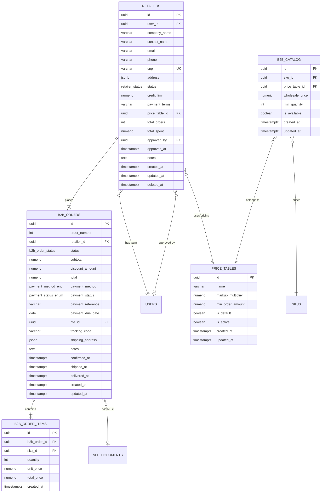

# Portal B2B / Atacado — Module Spec

> **Module:** Portal B2B / Atacado
> **Schema:** `b2b`
> **Route prefix (portal):** `/api/v1/b2b/portal`
> **Route prefix (admin):** `/api/v1/b2b`
> **Admin UI route group:** `(admin)/b2b/*`
> **Portal UI route group:** `(b2b)/*`
> **Version:** 1.0
> **Date:** March 2026
> **Status:** Approved
> **Replaces:** None (new capability — previously managed via WhatsApp conversations and manual invoicing)
> **References:** [DATABASE.md](../../architecture/DATABASE.md), [API.md](../../architecture/API.md), [AUTH.md](../../architecture/AUTH.md), [LGPD.md](../../platform/LGPD.md), [NOTIFICATIONS.md](../../platform/NOTIFICATIONS.md), [GLOSSARY.md](../../dev/GLOSSARY.md), [ERP spec](../operations/erp.md), [CRM spec](../growth/crm.md), [Checkout spec](./checkout.md)

---

## 1. Purpose & Scope

The Portal B2B / Atacado module is the **wholesale channel** of Ambaril. It provides a self-service portal for approved retailers to browse the wholesale catalog, place orders with markup pricing (2x-2.5x DTC price), and reorder from their history. The module enforces strict business rules: minimum order R$ 2-3k (configurable per price table), PIX/boleto only (a vista — no credit card, no installments), and accounts created exclusively by Guilherme (commercial role). Inventory is shared with DTC via the same `erp.inventory` system.

**Core responsibilities:**

| Capability | Description |
|-----------|-------------|
| **Retailer account management** | Admin-only account creation and approval. CNPJ validation. Status lifecycle: `pending` -> `approved` -> `suspended` / `inactive`. No self-registration. |
| **Wholesale catalog** | Separate price layer on top of `erp.skus`. Markup multiplier per price table (default 2x DTC). Per-SKU availability toggle. Shared inventory with DTC storefront. |
| **Price tables** | Configurable markup rules. Multiple price tables for different retailer tiers (standard, premium). Minimum order amount per table. |
| **B2B order flow** | Cart -> min order validation -> checkout (PIX or boleto only) -> payment confirmation -> separation -> shipping -> delivery. Same fulfillment pipeline as DTC via ERP. |
| **Reorder** | "Repetir pedido" copies items from a previous order into a new cart, with current stock validation. Streamlines repeat purchases for regular retailers. |
| **NF-e emission** | Same fiscal flow as DTC: NF-e emitted via ERP Focus NFe integration on order separation. |
| **Payment enforcement** | PIX (30 min expiry) and boleto bancario (5 business days expiry) ONLY. No credit card. No installments. A vista (full payment upfront). Auto-cancel on expiry. |

**Primary users:**

| User | Role | Usage Pattern |
|------|------|---------------|
| **Guilherme** | `commercial` | Creates retailer accounts, approves/suspends, manages catalog pricing, monitors B2B dashboard. Desktop. |
| **Retailers** | `b2b_retailer` | Browse catalog, place orders, reorder, track order status, manage account. Desktop (primarily). |
| **Marcus** | `admin` | Full access. Strategic B2B channel oversight. |
| **Ana Clara** | `operations` | Processes B2B orders in ERP pipeline (same as DTC orders). |

**Out of scope:** This module does NOT handle DTC (direct-to-consumer) orders — those are owned by the Checkout module. It does NOT own inventory — shared with ERP. It does NOT own shipping — Melhor Envio integration is via ERP. It does NOT handle B2B-specific returns — B2B returns follow the same Trocas module flow as DTC (future: may need B2B-specific return policies).

---

## 2. User Stories

### 2.1 Commercial Stories (Guilherme)

| # | As a... | I want to... | So that... | Acceptance Criteria |
|---|---------|-------------|-----------|-------------------|
| US-01 | Commercial (Guilherme) | Create a new retailer account with company info, CNPJ, and contact details | I can onboard a new wholesale customer into the platform | Form with fields: company_name, contact_name, email, phone, CNPJ (validated), address, notes. On save, retailer created with `status = 'pending'`. Login credentials generated and emailed on approval. |
| US-02 | Commercial (Guilherme) | Approve a pending retailer account so they can access the portal | Verified retailers can start browsing and ordering | "Aprovar" button on retailer detail sets `status = 'approved'`, records `approved_by` and `approved_at`. System generates user credentials and sends welcome email with portal URL and login instructions. |
| US-03 | Commercial (Guilherme) | Suspend a retailer account (e.g., overdue payments, policy violation) | A problematic retailer is blocked from placing new orders | "Suspender" button sets `status = 'suspended'`. Suspended retailer cannot login to the portal. Existing pending orders are NOT cancelled (manual decision). |
| US-04 | Commercial (Guilherme) | View the B2B dashboard with revenue, order pipeline, and top retailers | I can monitor the wholesale channel performance at a glance | Dashboard with: total B2B revenue (period), order pipeline funnel (pending -> confirmed -> shipped -> delivered), top 10 retailers by spend, avg order value, number of active retailers. |
| US-05 | Commercial (Guilherme) | Configure the wholesale catalog (toggle SKU availability, set custom prices) | I control which products are available at what prices for B2B | Catalog manager: list of all `erp.skus` with toggle for B2B availability, wholesale price (auto-calculated from markup or manual override), min quantity per SKU. Bulk enable/disable by product. |
| US-06 | Commercial (Guilherme) | Create and manage price tables with different markup multipliers | I can offer tiered pricing to different retailer segments | Price table CRUD: name, markup_multiplier (e.g., 2.0x, 2.5x), min_order_amount (e.g., R$ 2.000, R$ 3.000), is_default flag. Assign price table to retailer on creation/edit. |

### 2.2 Retailer Stories (B2B Portal)

| # | As a... | I want to... | So that... | Acceptance Criteria |
|---|---------|-------------|-----------|-------------------|
| US-07 | Retailer | Login to the B2B portal with my credentials | I can access the wholesale catalog and place orders | Login page with email + password. Only `status = 'approved'` retailers can login. Suspended/inactive/pending accounts see: "Sua conta nao esta ativa. Entre em contato com o comercial." |
| US-08 | Retailer | Browse the wholesale catalog with product images, prices, and available quantities | I can see what is available and at what wholesale price | Catalog grid with product cards: image, name, wholesale price (per unit), available quantity, "Adicionar ao carrinho" button. Filter by category. Search by product name/SKU. |
| US-09 | Retailer | Add items to my cart and see the running total with minimum order validation | I know if my order meets the minimum threshold before checking out | Cart page with item list (product, qty, unit price, line total), subtotal. If `subtotal < price_table.min_order_amount`, checkout button is disabled with message: "Pedido minimo: R$ 2.000,00. Faltam R$ X,XX." |
| US-10 | Retailer | Complete checkout choosing PIX or boleto as payment | I can pay for my wholesale order using available payment methods | Checkout page with two payment tabs: PIX (QR code + copy-paste code, 30 min expiry) and Boleto (barcode + copy-paste line, 5 business days expiry). No credit card option. No installment option. |
| US-11 | Retailer | View my order history with status tracking | I can monitor the progress of current and past orders | Order history table: order_number, date, total, payment_status, order_status, tracking_code. Click-through to order detail with item list and timeline. |
| US-12 | Retailer | Reorder from a previous order with one click | I can quickly place a repeat order for the same items without rebuilding the cart | "Repetir pedido" button on order detail. Copies items to new cart with current prices and stock check. If any SKU is out of stock, show warning: "SKU X nao disponivel. Removido do carrinho." |
| US-13 | Retailer | Update my account details (contact info, address) | My information stays current for shipping and invoicing | Account settings page with editable fields: contact_name, email, phone, address. CNPJ and company_name are read-only (changes require contacting commercial). |

### 2.3 System Stories

| # | As a... | I want to... | So that... | Acceptance Criteria |
|---|---------|-------------|-----------|-------------------|
| US-14 | System | Auto-cancel B2B orders where PIX payment was not received within 30 minutes | Unpaid PIX orders do not block inventory indefinitely | Background job checks every 5 minutes: orders with `payment_method = 'pix'` AND `payment_status = 'pending'` AND `created_at + 30 min < NOW()`. Auto-cancel: set `status = 'cancelled'`, release reserved inventory, notify retailer via email. |
| US-15 | System | Auto-cancel B2B orders where boleto was not paid within 5 business days | Unpaid boleto orders do not block inventory indefinitely | Background job checks every hour: orders with `payment_method = 'bank_slip'` AND `payment_status = 'pending'` AND `payment_due_date < NOW()`. Auto-cancel: same as PIX flow. |
| US-16 | System | Update retailer lifetime stats on order completion | B2B dashboard and retailer profiles show accurate totals | On order `status = 'delivered'`, increment `b2b.retailers.total_orders` and add order total to `total_spent`. |

---

## 3. Data Model

### 3.1 Entity Relationship Diagram



### 3.2 Enums

```sql
CREATE TYPE b2b.retailer_status AS ENUM (
    'pending', 'approved', 'suspended', 'inactive'
);

CREATE TYPE b2b.b2b_order_status AS ENUM (
    'pending', 'confirmed', 'separating',
    'shipped', 'delivered', 'cancelled'
);

CREATE TYPE b2b.b2b_payment_method AS ENUM (
    'pix', 'bank_slip'
);

CREATE TYPE b2b.b2b_payment_status AS ENUM (
    'pending', 'paid', 'overdue', 'cancelled'
);
```

### 3.3 Table Definitions

#### 3.3.1 b2b.retailers

| Column | Type | Constraints | Description |
|--------|------|-------------|-------------|
| id | UUID | PK, DEFAULT gen_random_uuid() | UUID v7 |
| user_id | UUID | NOT NULL, FK global.users(id), UNIQUE | Login user account for this retailer. Created on approval. One user per retailer. |
| company_name | VARCHAR(200) | NOT NULL | Legal company name (razao social). Displayed on NF-e and invoices. |
| contact_name | VARCHAR(150) | NOT NULL | Primary contact person name at the retailer. Used for communication. |
| email | VARCHAR(255) | NOT NULL | Primary email for login, notifications, and invoices. |
| phone | VARCHAR(20) | NOT NULL | Primary phone for WhatsApp communication. Format: `+5511999998888`. |
| cnpj | VARCHAR(14) | NOT NULL, UNIQUE | Brazilian CNPJ (14 digits, no formatting). Validated with check digit algorithm (R15). Used for NF-e emission. |
| address | JSONB | NOT NULL | Shipping and billing address: `{ street, number, complement, neighborhood, city, state, zip }`. Used for shipping label generation and NF-e. |
| status | b2b.retailer_status | NOT NULL DEFAULT 'pending' | Account lifecycle: `pending` (created, awaiting approval), `approved` (active, can login and order), `suspended` (blocked, cannot login), `inactive` (permanently deactivated). |
| credit_limit | NUMERIC(12,2) | NULL | Future: credit limit for net-terms payments. Currently NULL (all orders are a vista). Reserved for future payment terms feature. |
| payment_terms | VARCHAR(100) | NULL | Future: payment terms description (e.g., "30/60/90 dias"). Currently NULL (a vista only). |
| price_table_id | UUID | NOT NULL, FK b2b.price_tables(id) | Which price table this retailer uses. Determines markup and minimum order. Default: the `is_default = true` price table. |
| total_orders | INTEGER | NOT NULL DEFAULT 0 | Lifetime count of completed (delivered) orders. Updated on order delivery (R13). |
| total_spent | NUMERIC(12,2) | NOT NULL DEFAULT 0 | Lifetime total spent in BRL. Updated on order delivery (R13). |
| approved_by | UUID | NULL, FK global.users(id) | User who approved this retailer account. NULL if still pending. |
| approved_at | TIMESTAMPTZ | NULL | When the account was approved. NULL if still pending. |
| notes | TEXT | NULL | Internal notes about this retailer (visible to commercial team only). |
| created_at | TIMESTAMPTZ | NOT NULL DEFAULT NOW() | |
| updated_at | TIMESTAMPTZ | NOT NULL DEFAULT NOW() | |
| deleted_at | TIMESTAMPTZ | NULL | Soft delete timestamp. Non-NULL means logically deleted. |

**Address JSONB structure:**

```json
{
  "street": "Rua Augusta",
  "number": "1234",
  "complement": "Loja 5",
  "neighborhood": "Consolacao",
  "city": "Sao Paulo",
  "state": "SP",
  "zip": "01304001"
}
```

**Indexes:**

```sql
CREATE UNIQUE INDEX idx_retailers_cnpj ON b2b.retailers (cnpj) WHERE deleted_at IS NULL;
CREATE UNIQUE INDEX idx_retailers_user ON b2b.retailers (user_id) WHERE deleted_at IS NULL;
CREATE INDEX idx_retailers_status ON b2b.retailers (status);
CREATE INDEX idx_retailers_email ON b2b.retailers (email);
CREATE INDEX idx_retailers_price_table ON b2b.retailers (price_table_id);
CREATE INDEX idx_retailers_created ON b2b.retailers (created_at DESC);
CREATE INDEX idx_retailers_active ON b2b.retailers (status, total_spent DESC) WHERE status = 'approved' AND deleted_at IS NULL;
```

#### 3.3.2 b2b.b2b_catalog

| Column | Type | Constraints | Description |
|--------|------|-------------|-------------|
| id | UUID | PK, DEFAULT gen_random_uuid() | UUID v7 |
| sku_id | UUID | NOT NULL, FK erp.skus(id) | Reference to the ERP SKU. Wholesale catalog is a pricing/availability overlay on top of the ERP product catalog. |
| price_table_id | UUID | NOT NULL, FK b2b.price_tables(id) | Which price table this catalog entry belongs to. A SKU can have different wholesale prices in different price tables. |
| wholesale_price | NUMERIC(12,2) | NOT NULL, CHECK (wholesale_price > 0) | Wholesale unit price in BRL. Auto-calculated as `erp.skus.price * price_table.markup_multiplier` on creation, but can be manually overridden (R5). |
| min_quantity | INTEGER | NOT NULL DEFAULT 1, CHECK (min_quantity > 0) | Minimum order quantity for this SKU. Default 1. Can be set higher for specific products (e.g., min 6 units for socks). |
| is_available | BOOLEAN | NOT NULL DEFAULT TRUE | Whether this SKU is available in the B2B catalog. FALSE = hidden from portal browse. Toggled by commercial. |
| created_at | TIMESTAMPTZ | NOT NULL DEFAULT NOW() | |
| updated_at | TIMESTAMPTZ | NOT NULL DEFAULT NOW() | |

**Indexes:**

```sql
CREATE UNIQUE INDEX idx_b2b_catalog_sku_table ON b2b.b2b_catalog (sku_id, price_table_id);
CREATE INDEX idx_b2b_catalog_price_table ON b2b.b2b_catalog (price_table_id);
CREATE INDEX idx_b2b_catalog_available ON b2b.b2b_catalog (is_available, price_table_id) WHERE is_available = TRUE;
```

#### 3.3.3 b2b.b2b_orders

| Column | Type | Constraints | Description |
|--------|------|-------------|-------------|
| id | UUID | PK, DEFAULT gen_random_uuid() | UUID v7 |
| order_number | SERIAL | NOT NULL, UNIQUE | Auto-incrementing B2B order number. Displayed as `B2B-{order_number}` (e.g., `B2B-0001`). Separate sequence from DTC orders. |
| retailer_id | UUID | NOT NULL, FK b2b.retailers(id) | Retailer who placed this order. |
| status | b2b.b2b_order_status | NOT NULL DEFAULT 'pending' | Order lifecycle: `pending` (created, awaiting payment), `confirmed` (paid), `separating` (being picked), `shipped` (dispatched), `delivered`, `cancelled`. |
| subtotal | NUMERIC(12,2) | NOT NULL, CHECK (subtotal > 0) | Sum of all item `total_price` values before discount. |
| discount_amount | NUMERIC(12,2) | NOT NULL DEFAULT 0 | Discount applied (if any). Currently always 0 — no B2B coupon system. Reserved for future volume discounts. |
| total | NUMERIC(12,2) | NOT NULL, CHECK (total > 0) | `subtotal - discount_amount`. Final amount to be paid. |
| payment_method | b2b.b2b_payment_method | NOT NULL | Payment method: `pix` or `bank_slip`. No credit card. No installments. |
| payment_status | b2b.b2b_payment_status | NOT NULL DEFAULT 'pending' | Payment lifecycle: `pending` (awaiting payment), `paid` (confirmed by Mercado Pago), `overdue` (past due date, before cancellation), `cancelled` (auto-cancelled on expiry). |
| payment_reference | VARCHAR(200) | NULL | Mercado Pago payment ID or boleto barcode. Used for reconciliation. |
| payment_due_date | DATE | NULL | For boleto: expiry date (creation date + 5 business days). For PIX: NULL (30 min expiry tracked by timestamp). |
| nfe_id | UUID | NULL, FK erp.nfe_documents(id) | Link to the emitted NF-e in ERP. Set when NF-e is generated on order separation. |
| tracking_code | VARCHAR(100) | NULL | Shipping tracking code from Melhor Envio. Set when shipping label is generated. |
| shipping_address | JSONB | NOT NULL | Delivery address for this order. Copied from `b2b.retailers.address` at order creation (snapshot — retailer may change address later). Same structure as retailer address. |
| notes | TEXT | NULL | Retailer notes for this order (e.g., "Entregar no periodo da manha"). |
| confirmed_at | TIMESTAMPTZ | NULL | When payment was confirmed. |
| shipped_at | TIMESTAMPTZ | NULL | When order was dispatched. |
| delivered_at | TIMESTAMPTZ | NULL | When order was delivered. |
| created_at | TIMESTAMPTZ | NOT NULL DEFAULT NOW() | |
| updated_at | TIMESTAMPTZ | NOT NULL DEFAULT NOW() | |

**Shipping address JSONB structure:**

```json
{
  "street": "Rua Augusta",
  "number": "1234",
  "complement": "Loja 5",
  "neighborhood": "Consolacao",
  "city": "Sao Paulo",
  "state": "SP",
  "zip": "01304001"
}
```

**Indexes:**

```sql
CREATE UNIQUE INDEX idx_b2b_orders_number ON b2b.b2b_orders (order_number);
CREATE INDEX idx_b2b_orders_retailer ON b2b.b2b_orders (retailer_id);
CREATE INDEX idx_b2b_orders_status ON b2b.b2b_orders (status);
CREATE INDEX idx_b2b_orders_payment_status ON b2b.b2b_orders (payment_status);
CREATE INDEX idx_b2b_orders_payment_due ON b2b.b2b_orders (payment_due_date) WHERE payment_status = 'pending' AND payment_method = 'bank_slip';
CREATE INDEX idx_b2b_orders_pix_pending ON b2b.b2b_orders (created_at) WHERE payment_status = 'pending' AND payment_method = 'pix';
CREATE INDEX idx_b2b_orders_created ON b2b.b2b_orders (created_at DESC);
CREATE INDEX idx_b2b_orders_active ON b2b.b2b_orders (status, created_at DESC) WHERE status IN ('pending', 'confirmed', 'separating', 'shipped');
```

#### 3.3.4 b2b.b2b_order_items

| Column | Type | Constraints | Description |
|--------|------|-------------|-------------|
| id | UUID | PK, DEFAULT gen_random_uuid() | UUID v7 |
| b2b_order_id | UUID | NOT NULL, FK b2b.b2b_orders(id) ON DELETE CASCADE | Parent order |
| sku_id | UUID | NOT NULL, FK erp.skus(id) | SKU being ordered. References ERP catalog. |
| quantity | INTEGER | NOT NULL, CHECK (quantity > 0) | Number of units ordered. Must meet `b2b_catalog.min_quantity` for this SKU. |
| unit_price | NUMERIC(12,2) | NOT NULL, CHECK (unit_price > 0) | Wholesale unit price at time of order (snapshot from `b2b_catalog.wholesale_price`). Immutable after order creation. |
| total_price | NUMERIC(12,2) | NOT NULL, CHECK (total_price > 0) | `quantity * unit_price`. Line item total. |
| created_at | TIMESTAMPTZ | NOT NULL DEFAULT NOW() | |

**Indexes:**

```sql
CREATE INDEX idx_b2b_order_items_order ON b2b.b2b_order_items (b2b_order_id);
CREATE INDEX idx_b2b_order_items_sku ON b2b.b2b_order_items (sku_id);
```

#### 3.3.5 b2b.price_tables

| Column | Type | Constraints | Description |
|--------|------|-------------|-------------|
| id | UUID | PK, DEFAULT gen_random_uuid() | UUID v7 |
| name | VARCHAR(100) | NOT NULL | Display name for the price table (e.g., "Padrao B2B", "Premium B2B", "Lancamento"). |
| markup_multiplier | NUMERIC(4,2) | NOT NULL DEFAULT 2.00, CHECK (markup_multiplier >= 1.0) | Wholesale price = DTC price * multiplier. Default 2.0x (wholesale = double DTC cost). Range: 1.0x (at cost, for strategic partners) to 3.0x (premium markup). |
| min_order_amount | NUMERIC(12,2) | NOT NULL DEFAULT 2000.00, CHECK (min_order_amount >= 0) | Minimum order subtotal in BRL for this price table. Cart checkout blocked if subtotal < this value. Default R$ 2.000. |
| is_default | BOOLEAN | NOT NULL DEFAULT FALSE | Whether this is the default price table assigned to new retailers. Only one price table should be default at a time. |
| is_active | BOOLEAN | NOT NULL DEFAULT TRUE | Whether this price table is active. Inactive tables cannot be assigned to new retailers. Existing retailers on inactive tables continue to use them until reassigned. |
| created_at | TIMESTAMPTZ | NOT NULL DEFAULT NOW() | |
| updated_at | TIMESTAMPTZ | NOT NULL DEFAULT NOW() | |

**Indexes:**

```sql
CREATE INDEX idx_price_tables_active ON b2b.price_tables (is_active) WHERE is_active = TRUE;
CREATE UNIQUE INDEX idx_price_tables_default ON b2b.price_tables (is_default) WHERE is_default = TRUE;
```

---

## 4. Screens & Wireframes

All screens follow the Ambaril Design System (DS.md): dark mode default, DM Sans, HeroUI components, Lucide React. B2B admin screens use teal accent to visually distinguish from DTC admin. B2B portal uses the same dark-mode system with the CIENA brand identity.

### 4.1 B2B Portal — Catalog Grid

```
+-----------------------------------------------------------------------+
|  CIENA B2B                          [Carrinho (3)] [Pedidos] [Conta]  |
+-----------------------------------------------------------------------+
|                                                                       |
|  Catalogo Atacado                                                     |
|  [Categoria v] [Buscar produto...]                                   |
|                                                                       |
|  +------------------+  +------------------+  +------------------+     |
|  |  [    IMAGE    ] |  |  [    IMAGE    ] |  |  [    IMAGE    ] |     |
|  |                  |  |                  |  |                  |     |
|  |  Camiseta Preta  |  |  Calca Cargo     |  |  Moletom Over-   |     |
|  |  Basic           |  |  Streetwear      |  |  size            |     |
|  |                  |  |                  |  |                  |     |
|  |  R$ 299,80/un    |  |  R$ 459,80/un    |  |  R$ 599,80/un    |     |
|  |  DTC: R$ 149,90  |  |  DTC: R$ 229,90  |  |  DTC: R$ 299,90  |     |
|  |                  |  |                  |  |                  |     |
|  |  Disponivel: 45  |  |  Disponivel: 22  |  |  Disponivel: 18  |     |
|  |                  |  |                  |  |                  |     |
|  |  Tam: [P][M][G]  |  |  Tam: [38][40]   |  |  Tam: [M][G][GG] |     |
|  |       [GG][XG]   |  |       [42][44]   |  |       [XG]       |     |
|  |                  |  |                  |  |                  |     |
|  |  Qtd: [1___]     |  |  Qtd: [1___]     |  |  Qtd: [1___]     |     |
|  |  [+ Adicionar]   |  |  [+ Adicionar]   |  |  [+ Adicionar]   |     |
|  +------------------+  +------------------+  +------------------+     |
|                                                                       |
|  +------------------+  +------------------+  +------------------+     |
|  |  [    IMAGE    ] |  |  [    IMAGE    ] |  |  [    IMAGE    ] |     |
|  |  Meia Crew CIENA |  |  Bone Trucker    |  |  Jaqueta Corta-  |     |
|  |                  |  |  CIENA           |  |  vento           |     |
|  |  R$ 59,80/un     |  |  R$ 159,80/un    |  |  R$ 699,80/un    |     |
|  |  Min: 6 un       |  |  Disponivel: 30  |  |  Disponivel: 8   |     |
|  |  Disponivel: 120 |  |                  |  |                  |     |
|  |  Qtd: [6___]     |  |  Qtd: [1___]     |  |  Qtd: [1___]     |     |
|  |  [+ Adicionar]   |  |  [+ Adicionar]   |  |  [+ Adicionar]   |     |
|  +------------------+  +------------------+  +------------------+     |
|                                                                       |
|  Mostrando 1-12 de 34 produtos       [< Anterior] [Proximo >]        |
+-----------------------------------------------------------------------+
```

### 4.2 B2B Portal — Cart & Minimum Order Validation

```
+-----------------------------------------------------------------------+
|  CIENA B2B > Carrinho                                                 |
+-----------------------------------------------------------------------+
|                                                                       |
|  +---+-------------------------+------+----------+-----------+------+ |
|  | # | Produto                 | Tam  | Qtd      | Preco un  | Total| |
|  +---+-------------------------+------+----------+-----------+------+ |
|  |   | Camiseta Preta Basic    | G    | [-][2][+]| R$ 299,80 | R$   | |
|  |   |                         |      |          |           | 599  | |
|  |   |                         |      |          |           | ,60  | |
|  +---+-------------------------+------+----------+-----------+------+ |
|  |   | Calca Cargo Streetwear  | 42   | [-][1][+]| R$ 459,80 | R$   | |
|  |   |                         |      |          |           | 459  | |
|  |   |                         |      |          |           | ,80  | |
|  +---+-------------------------+------+----------+-----------+------+ |
|  |   | Meia Crew CIENA         | U    | [-][6][+]| R$ 59,80  | R$   | |
|  |   | (min: 6 un)             |      |          |           | 358  | |
|  |   |                         |      |          |           | ,80  | |
|  +---+-------------------------+------+----------+-----------+------+ |
|                                                                       |
|                                          Subtotal: R$ 1.418,20       |
|                                                                       |
|  +---------------------------------------------------------------+   |
|  | (!) PEDIDO MINIMO NAO ATINGIDO                                 |   |
|  |                                                                 |   |
|  | Pedido minimo para sua tabela de precos: R$ 2.000,00           |   |
|  | Subtotal atual: R$ 1.418,20                                    |   |
|  | Faltam: R$ 581,80                                              |   |
|  |                                                                 |   |
|  | [Continuar comprando]                                          |   |
|  +---------------------------------------------------------------+   |
|                                                                       |
|  [Continuar comprando]             [Finalizar compra] (desabilitado) |
+-----------------------------------------------------------------------+
```

### 4.3 B2B Portal — Checkout (PIX/Boleto)

```
+-----------------------------------------------------------------------+
|  CIENA B2B > Checkout                                                 |
+-----------------------------------------------------------------------+
|                                                                       |
|  RESUMO DO PEDIDO                                                     |
|  +------------------------------------------------------+            |
|  | Camiseta Preta Basic G x2        R$ 599,60           |            |
|  | Calca Cargo Streetwear 42 x1     R$ 459,80           |            |
|  | Meia Crew CIENA U x6             R$ 358,80           |            |
|  | Bone Trucker CIENA U x2          R$ 319,60           |            |
|  +------------------------------------------------------+            |
|  | Subtotal                         R$ 1.737,80          |            |
|  | Desconto                         R$ 0,00              |            |
|  +------------------------------------------------------+            |
|  | TOTAL                            R$ 2.137,80          |            |
|  +------------------------------------------------------+            |
|                                                                       |
|  ENDERECO DE ENTREGA                                                  |
|  Rua Augusta, 1234 - Loja 5                                          |
|  Consolacao, Sao Paulo - SP | CEP: 01304-001                         |
|  [Alterar endereco]                                                   |
|                                                                       |
|  FORMA DE PAGAMENTO                                                   |
|  +-----------------------------+-----------------------------+        |
|  |       [ PIX ]              |       [ BOLETO ]            |        |
|  +-----------------------------+-----------------------------+        |
|  |                                                           |        |
|  |  [Selected: PIX]                                          |        |
|  |                                                           |        |
|  |  +---------------------+                                  |        |
|  |  |                     |  Valor: R$ 2.137,80              |        |
|  |  |    [QR CODE PIX]    |                                  |        |
|  |  |                     |  Chave PIX:                      |        |
|  |  |                     |  [00020126580014br.gov.b...]     |        |
|  |  |                     |  [Copiar codigo]                 |        |
|  |  +---------------------+                                  |        |
|  |                                                           |        |
|  |  Expira em: 29:45                                         |        |
|  |  Pagamento a vista. Sem parcelamento.                     |        |
|  |                                                           |        |
|  +-----------------------------------------------------------+        |
|                                                                       |
|  Observacoes: [_________________________________________]             |
|                                                                       |
|  [Voltar ao carrinho]                    [Confirmar pedido]           |
+-----------------------------------------------------------------------+
```

### 4.4 B2B Portal — Order History

```
+-----------------------------------------------------------------------+
|  CIENA B2B > Meus Pedidos                                             |
+-----------------------------------------------------------------------+
|                                                                       |
|  +------+----------+-----------+----------+----------+------+-------+ |
|  | #    | Data     | Total     | Pgto     | Status   | Rastr| Acao  | |
|  +------+----------+-----------+----------+----------+------+-------+ |
|  | B2B- | 17/03    | R$ 3.247  | PIX      |[Confirm.]|      |[Repet]| |
|  | 0045 | 10:30    |           | Pago     |          |      |[ir   ]| |
|  +------+----------+-----------+----------+----------+------+-------+ |
|  | B2B- | 10/03    | R$ 2.180  | Boleto   |[Enviado ]| ME12 |[Repet]| |
|  | 0042 | 14:20    |           | Pago     |          | 3456 |[ir   ]| |
|  +------+----------+-----------+----------+----------+------+-------+ |
|  | B2B- | 01/03    | R$ 4.560  | PIX      |[Entregue]| ME78 |[Repet]| |
|  | 0038 | 09:00    |           | Pago     |          | 9012 |[ir   ]| |
|  +------+----------+-----------+----------+----------+------+-------+ |
|  | B2B- | 15/02    | R$ 2.890  | Boleto   |[Entregue]| ME34 |[Repet]| |
|  | 0031 | 11:45    |           | Pago     |          | 5678 |[ir   ]| |
|  +------+----------+-----------+----------+----------+------+-------+ |
|                                                                       |
|  Status badges:                                                       |
|  [Pendente] = yellow  [Confirmado] = blue  [Separando] = purple     |
|  [Enviado] = blue  [Entregue] = green  [Cancelado] = red            |
|                                                                       |
|  Mostrando 1-10 de 12              [< Anterior] [Proximo >]          |
+-----------------------------------------------------------------------+
```

### 4.5 Admin — Retailer List

```
+-----------------------------------------------------------------------+
|  Ambaril Admin > B2B > Lojistas                    [+ Novo Lojista]      |
+-----------------------------------------------------------------------+
|                                                                       |
|  Filtros: [Status v] [Buscar empresa/CNPJ...]                       |
|                                                                       |
|  +---+-----------------+-----------------+--------+------+---------+ |
|  | # | Empresa          | CNPJ           | Status | Ped. | Gasto   | |
|  +---+-----------------+-----------------+--------+------+---------+ |
|  |   | Street Culture    | 12.345.678/    |[Aprov.]| 12   | R$ 28k  | |
|  |   | Ltda              | 0001-90        |        |      |         | |
|  +---+-----------------+-----------------+--------+------+---------+ |
|  |   | Urban Wear SP     | 23.456.789/    |[Aprov.]| 8    | R$ 18k  | |
|  |   | ME                | 0001-23        |        |      |         | |
|  +---+-----------------+-----------------+--------+------+---------+ |
|  |   | Moda Rua Store    | 34.567.890/    |[Pend. ]| 0    | R$ 0    | |
|  |   |                   | 0001-56        |        |      |         | |
|  +---+-----------------+-----------------+--------+------+---------+ |
|  |   | Conceito Street   | 45.678.901/    |[Susp. ]| 5    | R$ 12k  | |
|  |   | EIRELI            | 0001-89        |        |      |         | |
|  +---+-----------------+-----------------+--------+------+---------+ |
|                                                                       |
|  Status badges:                                                       |
|  [Aprovado] = green  [Pendente] = yellow                             |
|  [Suspenso] = red  [Inativo] = gray                                 |
|                                                                       |
|  Mostrando 1-15 de 15                                                 |
+-----------------------------------------------------------------------+
```

### 4.6 Admin — Retailer Detail

```
+-----------------------------------------------------------------------+
|  Ambaril Admin > B2B > Lojistas > Street Culture Ltda                    |
+-----------------------------------------------------------------------+
|                                                                       |
|  +----------------------------------+-------------------------------+ |
|  |  DADOS DO LOJISTA                |  RESUMO                       | |
|  +----------------------------------+-------------------------------+ |
|  |                                  |                               | |
|  |  Empresa: Street Culture Ltda    | Total pedidos: 12             | |
|  |  CNPJ: 12.345.678/0001-90       | Total gasto: R$ 28.450,00    | |
|  |  Contato: Ricardo Mendes         | Ticket medio: R$ 2.370,83    | |
|  |  Email: ricardo@streetculture.br | Ultimo pedido: 10/03/2026    | |
|  |  Telefone: (11) 98888-7777      |                               | |
|  |  Status: [Aprovado]             | Tabela de preco: Padrao B2B  | |
|  |  Aprovado por: Guilherme         | Markup: 2.0x                  | |
|  |  Aprovado em: 15/01/2026        | Pedido minimo: R$ 2.000      | |
|  |                                  |                               | |
|  |  Endereco:                       |                               | |
|  |  Rua Augusta, 1234 - Loja 5     |                               | |
|  |  Consolacao, Sao Paulo - SP      |                               | |
|  |  CEP: 01304-001                  |                               | |
|  |                                  |                               | |
|  |  Notas: "Loja na Augusta, bom    |                               | |
|  |  movimento. Pedidos mensais."    |                               | |
|  |                                  |                               | |
|  +----------------------------------+-------------------------------+ |
|                                                                       |
|  HISTORICO DE PEDIDOS                                                  |
|  +------+----------+-----------+----------+----------+              |
|  | #    | Data     | Total     | Status   | Pgto     |              |
|  +------+----------+-----------+----------+----------+              |
|  | B2B- | 10/03    | R$ 2.180  |[Enviado ]| PIX Pago |              |
|  | 0042 |          |           |          |          |              |
|  +------+----------+-----------+----------+----------+              |
|  | B2B- | 01/03    | R$ 4.560  |[Entregue]| Boleto   |              |
|  | 0038 |          |           |          | Pago     |              |
|  +------+----------+-----------+----------+----------+              |
|  | ...mais 10 pedidos...                             |              |
|  +---------------------------------------------------+              |
|                                                                       |
|  Acoes: [Editar] [Suspender] [Inativar]                              |
|         [Alterar tabela de preco]                                     |
+-----------------------------------------------------------------------+
```

### 4.7 Admin — B2B Dashboard

```
+-----------------------------------------------------------------------+
|  Ambaril Admin > B2B > Dashboard                  Periodo: [Mar 2026 v] |
+-----------------------------------------------------------------------+
|                                                                       |
|  +---------------+  +---------------+  +---------------+              |
|  | Receita B2B   |  | Pedidos (mes) |  | Ticket medio  |              |
|  |               |  |               |  |               |              |
|  |  R$ 32.450    |  |      14       |  |  R$ 2.318     |              |
|  |  (+22% mes)   |  |  (+3 mes)     |  |  (-R$ 82 mes) |              |
|  +---------------+  +---------------+  +---------------+              |
|                                                                       |
|  +---------------+  +---------------+  +---------------+              |
|  | Lojistas      |  | Taxa convers. |  | Pgto pendente |              |
|  | ativos        |  | (visitou->    |  |               |              |
|  |               |  |  comprou)     |  |               |              |
|  |      12       |  |    68%        |  |  R$ 4.560     |              |
|  |  (+2 mes)     |  |               |  |  (2 pedidos)  |              |
|  +---------------+  +---------------+  +---------------+              |
|                                                                       |
|  +---------------------------------------+                            |
|  | RECEITA B2B (ultimos 6 meses)          |                            |
|  |                                        |                            |
|  | 40k|                             *     |                            |
|  | 30k|                    *              |                            |
|  | 20k|           *  *                    |                            |
|  | 10k|  *  *                             |                            |
|  |  0k+--+--+--+--+--+--                  |                            |
|  |   Out Nov Dez Jan Fev Mar              |                            |
|  +---------------------------------------+                            |
|                                                                       |
|  TOP 10 LOJISTAS (por gasto)                                         |
|  +---+-----------------+------+---------+----------+                 |
|  | # | Empresa          | Ped. | Gasto   | Ult.ped. |                 |
|  +---+-----------------+------+---------+----------+                 |
|  | 1 | Street Culture    | 12   | R$ 28k  | 10/03    |                 |
|  | 2 | Urban Wear SP     | 8    | R$ 18k  | 07/03    |                 |
|  | 3 | Moda Rua Store    | 6    | R$ 14k  | 28/02    |                 |
|  | 4 | Griffe Street     | 5    | R$ 11k  | 05/03    |                 |
|  | 5 | Conceito Urban    | 4    | R$ 9k   | 01/03    |                 |
|  +---+-----------------+------+---------+----------+                 |
|                                                                       |
|  PIPELINE DE PEDIDOS                                                  |
|  [Pendente: 2] -> [Confirmado: 3] -> [Separando: 1] ->              |
|  [Enviado: 4] -> [Entregue: 142]                                     |
|                                                                       |
+-----------------------------------------------------------------------+
```

### 4.8 Admin — Catalog Manager

```
+-----------------------------------------------------------------------+
|  Ambaril Admin > B2B > Catalogo                                          |
+-----------------------------------------------------------------------+
|                                                                       |
|  Tabela de preco: [Padrao B2B (2.0x) v]                              |
|  Filtros: [Categoria v] [Disponibilidade v] [Buscar SKU...]          |
|                                                                       |
|  +---+-----------+--------+------+--------+--------+------+--------+ |
|  |   | Produto   | SKU    | Tam  | DTC    | B2B    | Min  | Disp.  | |
|  +---+-----------+--------+------+--------+--------+------+--------+ |
|  |   | Camiseta  | CAM-   | M    | R$ 149 | R$ 299 | 1    | [x]    | |
|  |   | Preta     | PRETA  |      | ,90    | ,80    |      |        | |
|  |   | Basic     | -M     |      |        |        |      |        | |
|  +---+-----------+--------+------+--------+--------+------+--------+ |
|  |   | Camiseta  | CAM-   | G    | R$ 149 | R$ 299 | 1    | [x]    | |
|  |   | Preta     | PRETA  |      | ,90    | ,80    |      |        | |
|  |   | Basic     | -G     |      |        |        |      |        | |
|  +---+-----------+--------+------+--------+--------+------+--------+ |
|  |   | Meia Crew | MEIA-  | U    | R$ 29  | R$ 59  | 6    | [x]    | |
|  |   | CIENA     | CREW   |      | ,90    | ,80    |      |        | |
|  |   |           | -U     |      |        |        |      |        | |
|  +---+-----------+--------+------+--------+--------+------+--------+ |
|  |   | Jaqueta   | JAQ-   | G    | R$ 349 | R$ 699 | 1    | [ ]    | |
|  |   | Corta-    | CORTA  |      | ,90    | ,80    |      | (off)  | |
|  |   | vento     | -G     |      |        |        |      |        | |
|  +---+-----------+--------+------+--------+--------+------+--------+ |
|                                                                       |
|  B2B = DTC x Markup (2.0x). Clique no preco B2B para override.      |
|  [x] = Disponivel no portal  [ ] = Oculto no portal                 |
|                                                                       |
|  Mostrando 1-25 de 87 SKUs           [< Anterior] [Proximo >]        |
+-----------------------------------------------------------------------+
```

### 4.9 Admin — Price Table Configuration

```
+-----------------------------------------------------------------------+
|  Ambaril Admin > B2B > Tabelas de Preco                [+ Nova Tabela]   |
+-----------------------------------------------------------------------+
|                                                                       |
|  +---+------------------+---------+--------+---------+------+-------+ |
|  | # | Nome             | Markup  | Ped.   | Lojist. | Pad. | Acao  | |
|  |   |                  |         | minimo | atrib.  |      |       | |
|  +---+------------------+---------+--------+---------+------+-------+ |
|  |   | Padrao B2B       | 2.0x    | R$ 2k  | 10      | (*)  |[E][X]| |
|  +---+------------------+---------+--------+---------+------+-------+ |
|  |   | Premium B2B      | 2.5x    | R$ 3k  | 3       |      |[E][X]| |
|  +---+------------------+---------+--------+---------+------+-------+ |
|  |   | Lancamento       | 2.2x    | R$ 2k  | 2       |      |[E][X]| |
|  +---+------------------+---------+--------+---------+------+-------+ |
|                                                                       |
|  (*) = Tabela padrao (atribuida a novos lojistas)                    |
|  [E] = Editar  [X] = Desativar                                       |
|                                                                       |
|  +---------------------------------------------------------------+   |
|  |  EDITAR TABELA: Premium B2B                                    |   |
|  +---------------------------------------------------------------+   |
|  |                                                               |   |
|  |  Nome: [Premium B2B______________]                            |   |
|  |  Markup: [2.5_]x (preco DTC x markup = preco B2B)            |   |
|  |  Pedido minimo: [3000__] BRL                                  |   |
|  |  Tabela padrao: [ ] (marcar como padrao para novos lojistas)  |   |
|  |  Ativa: [x]                                                   |   |
|  |                                                               |   |
|  |  Simulacao: Camiseta DTC R$ 149,90 -> B2B R$ 374,75          |   |
|  |                                                               |   |
|  |  [Cancelar]                                        [Salvar]   |   |
|  +---------------------------------------------------------------+   |
+-----------------------------------------------------------------------+
```

---

## 5. API Endpoints

All endpoints follow the patterns defined in [API.md](../../architecture/API.md). Money values in BRL as NUMERIC (2 decimal places). Dates in ISO 8601.

### 5.1 Portal Endpoints (Auth: b2b_retailer)

Route prefix: `/api/v1/b2b/portal`

#### 5.1.1 Catalog

| Method | Path | Auth | Description | Request Body / Query | Response |
|--------|------|------|-------------|---------------------|----------|
| GET | `/catalog` | b2b_retailer | Browse wholesale catalog (uses retailer's price table) | `?cursor=&limit=24&category=&search=&sort=name|price` | `{ data: CatalogItem[], meta: Pagination }` |
| GET | `/catalog/:sku_id` | b2b_retailer | Get catalog item detail with stock and pricing | — | `{ data: CatalogItem }` |

#### 5.1.2 Cart & Checkout

| Method | Path | Auth | Description | Request Body / Query | Response |
|--------|------|------|-------------|---------------------|----------|
| GET | `/cart` | b2b_retailer | Get current cart | — | `{ data: Cart }` |
| POST | `/cart/items` | b2b_retailer | Add item to cart | `{ sku_id, quantity }` | `{ data: Cart }` |
| PATCH | `/cart/items/:sku_id` | b2b_retailer | Update item quantity | `{ quantity }` | `{ data: Cart }` |
| DELETE | `/cart/items/:sku_id` | b2b_retailer | Remove item from cart | — | `{ data: Cart }` |
| POST | `/cart/validate` | b2b_retailer | Validate cart (stock check, min order, min quantity) | — | `{ data: { valid, errors: string[] } }` |
| POST | `/checkout` | b2b_retailer | Place order (create order from cart) | `{ payment_method: 'pix' | 'bank_slip', shipping_address?, notes? }` | `201 { data: B2BOrder }` (includes payment_reference for PIX/boleto) |

#### 5.1.3 Orders

| Method | Path | Auth | Description | Request Body / Query | Response |
|--------|------|------|-------------|---------------------|----------|
| GET | `/orders` | b2b_retailer | List retailer's orders (paginated) | `?cursor=&limit=25&status=&dateFrom=&dateTo=` | `{ data: B2BOrder[], meta: Pagination }` |
| GET | `/orders/:id` | b2b_retailer | Get order detail with items and timeline | — | `{ data: B2BOrder }` |
| POST | `/orders/:id/reorder` | b2b_retailer | Copy order items to new cart (reorder) | — | `{ data: Cart, warnings: string[] }` (warnings for out-of-stock items) |

#### 5.1.4 Account

| Method | Path | Auth | Description | Request Body / Query | Response |
|--------|------|------|-------------|---------------------|----------|
| GET | `/account` | b2b_retailer | Get retailer profile | — | `{ data: Retailer }` |
| PATCH | `/account` | b2b_retailer | Update contact info and address | `{ contact_name?, email?, phone?, address? }` | `{ data: Retailer }` |

### 5.2 Admin Endpoints (Auth: commercial/admin)

Route prefix: `/api/v1/b2b`

#### 5.2.1 Retailers

| Method | Path | Auth | Description | Request Body / Query | Response |
|--------|------|------|-------------|---------------------|----------|
| GET | `/retailers` | Internal | List all retailers (paginated, filterable) | `?cursor=&limit=25&status=&search=&sort=total_spent|created_at` | `{ data: Retailer[], meta: Pagination }` |
| GET | `/retailers/:id` | Internal | Get retailer detail with order history | `?include=orders,stats` | `{ data: Retailer }` |
| POST | `/retailers` | Internal | Create new retailer account | `{ company_name, contact_name, email, phone, cnpj, address, price_table_id?, notes? }` | `201 { data: Retailer }` (status = pending) |
| PATCH | `/retailers/:id` | Internal | Update retailer info | `{ company_name?, contact_name?, email?, phone?, address?, price_table_id?, notes? }` | `{ data: Retailer }` |
| POST | `/retailers/:id/actions/approve` | Internal | Approve retailer (generate credentials, send welcome email) | `{ notes? }` | `{ data: Retailer }` (status -> approved) |
| POST | `/retailers/:id/actions/suspend` | Internal | Suspend retailer | `{ reason }` | `{ data: Retailer }` (status -> suspended) |
| POST | `/retailers/:id/actions/reactivate` | Internal | Reactivate a suspended retailer | — | `{ data: Retailer }` (status -> approved) |
| POST | `/retailers/:id/actions/deactivate` | Internal | Permanently deactivate retailer | — | `{ data: Retailer }` (status -> inactive) |

#### 5.2.2 Orders

| Method | Path | Auth | Description | Request Body / Query | Response |
|--------|------|------|-------------|---------------------|----------|
| GET | `/orders` | Internal | List all B2B orders (paginated, filterable) | `?cursor=&limit=25&status=&payment_status=&retailer_id=&dateFrom=&dateTo=&search=` | `{ data: B2BOrder[], meta: Pagination }` |
| GET | `/orders/:id` | Internal | Get B2B order detail with items | `?include=items,retailer` | `{ data: B2BOrder }` |
| POST | `/orders/:id/actions/confirm` | Internal | Manually confirm order (if payment was verified outside system) | — | `{ data: B2BOrder }` (status -> confirmed) |
| POST | `/orders/:id/actions/cancel` | Internal | Manually cancel order | `{ reason }` | `{ data: B2BOrder }` (status -> cancelled, inventory released) |

#### 5.2.3 Catalog

| Method | Path | Auth | Description | Request Body / Query | Response |
|--------|------|------|-------------|---------------------|----------|
| GET | `/catalog` | Internal | List all catalog entries (admin view) | `?price_table_id=&is_available=&search=&cursor=&limit=50` | `{ data: CatalogItem[], meta: Pagination }` |
| POST | `/catalog` | Internal | Add SKU to B2B catalog | `{ sku_id, price_table_id, wholesale_price?, min_quantity?, is_available? }` | `201 { data: CatalogItem }` |
| PATCH | `/catalog/:id` | Internal | Update catalog entry | `{ wholesale_price?, min_quantity?, is_available? }` | `{ data: CatalogItem }` |
| POST | `/catalog/bulk-toggle` | Internal | Bulk enable/disable SKUs in catalog | `{ sku_ids: UUID[], is_available: boolean, price_table_id }` | `{ data: { updated: number } }` |
| POST | `/catalog/sync-prices` | Internal | Recalculate all wholesale prices from DTC price * markup | `{ price_table_id }` | `{ data: { updated: number } }` |

#### 5.2.4 Price Tables

| Method | Path | Auth | Description | Request Body / Query | Response |
|--------|------|------|-------------|---------------------|----------|
| GET | `/price-tables` | Internal | List all price tables | — | `{ data: PriceTable[] }` |
| GET | `/price-tables/:id` | Internal | Get price table detail | — | `{ data: PriceTable }` |
| POST | `/price-tables` | Internal | Create new price table | `{ name, markup_multiplier, min_order_amount, is_default? }` | `201 { data: PriceTable }` |
| PATCH | `/price-tables/:id` | Internal | Update price table | `{ name?, markup_multiplier?, min_order_amount?, is_default?, is_active? }` | `{ data: PriceTable }` |

#### 5.2.5 Dashboard

| Method | Path | Auth | Description | Request Body / Query | Response |
|--------|------|------|-------------|---------------------|----------|
| GET | `/dashboard` | Internal | Get B2B dashboard metrics | `?dateFrom=&dateTo=` | `{ data: { total_revenue, order_count, avg_order_value, active_retailers, order_pipeline, top_retailers, payment_pending_total } }` |

### 5.3 Webhook Endpoints

Route prefix: `/api/v1/webhooks`

| Method | Path | Description | Request Body / Query | Response |
|--------|------|-------------|---------------------|----------|
| POST | `/mercado-pago/b2b` | Mercado Pago payment notification for B2B orders | Mercado Pago IPN payload | `200` |

---

## 6. Business Rules

### 6.1 Account Management Rules

| # | Rule | Detail |
|---|------|--------|
| R1 | **No self-registration** | Retailer accounts can ONLY be created by users with the `commercial` or `admin` role via the admin API `POST /retailers`. The B2B portal has no sign-up page. The login page displays: "Nao tem conta? Entre em contato com nosso comercial: guilherme@ciena.com.br" |
| R2 | **Approved retailers only** | Only retailers with `status = 'approved'` can login to the portal and access catalog/ordering features. Login attempts by `pending`, `suspended`, or `inactive` retailers return 403 with message: "Sua conta nao esta ativa. Entre em contato com o comercial." |
| R3 | **CNPJ validation** | On retailer creation, the system validates the CNPJ using the Brazilian check digit algorithm (2 verification digits, similar to CPF but with 14 digits and different weights). Invalid CNPJs are rejected with error: "CNPJ invalido. Verifique os digitos." CNPJ must be unique — duplicates rejected with: "CNPJ ja cadastrado." |
| R4 | **Suspended retailer behavior** | A suspended retailer (`status = 'suspended'`): (1) cannot login to the portal, (2) cannot place new orders, (3) existing pending (unpaid) orders are NOT auto-cancelled (commercial makes manual decision), (4) existing confirmed orders in pipeline continue to be processed normally (not cancelled mid-fulfillment). |

### 6.2 Pricing & Catalog Rules

| # | Rule | Detail |
|---|------|--------|
| R5 | **Wholesale price calculation** | Wholesale price = `erp.skus.price * b2b.price_tables.markup_multiplier`. Default multiplier is 2.0x (wholesale = double DTC). Custom override: if `b2b_catalog.wholesale_price` is manually set, it overrides the calculated price. The "sync prices" admin action recalculates all auto-priced items from current DTC prices (does NOT overwrite manual overrides unless explicitly requested). |
| R6 | **Inventory shared with DTC** | B2B orders draw from the SAME inventory pool as DTC orders (`erp.inventory`). There is NO separate B2B inventory. The `erp.inventory.available` quantity shown in the B2B catalog is the same available quantity visible in the DTC checkout. This means a B2B order can compete with DTC orders for the same stock. |
| R7 | **Catalog availability toggle** | Each SKU has an `is_available` flag in `b2b.b2b_catalog`. Setting `is_available = false` hides the SKU from the portal catalog browse. It does NOT affect DTC availability. Commercial (Guilherme) controls which products are offered wholesale independently of the DTC storefront. |

### 6.3 Order & Payment Rules

| # | Rule | Detail |
|---|------|--------|
| R8 | **Minimum order enforcement** | Cart checkout is blocked if `cart.subtotal < price_table.min_order_amount`. The checkout API returns 422 with error: "Pedido minimo nao atingido. Minimo: R$ {min}. Subtotal atual: R$ {subtotal}." Default minimum: R$ 2.000 (configurable per price table). Validation occurs both client-side (disabled button) and server-side (API check). |
| R9 | **Payment: PIX or boleto ONLY** | B2B orders accept ONLY `pix` or `bank_slip` payment methods. No credit card. No installments. No parcelamento. All payments are "a vista" (full upfront). Attempting to submit with any other payment method returns 422: "Metodo de pagamento invalido. Apenas PIX ou Boleto." |
| R10 | **PIX expiry: 30 minutes** | PIX payment QR code / copy-paste code expires 30 minutes after order creation. If payment is not received within 30 min: order `payment_status` -> `cancelled`, order `status` -> `cancelled`, reserved inventory released. Retailer notified via email: "Seu pedido B2B-{number} foi cancelado. O PIX expirou." |
| R11 | **Boleto expiry: 5 business days** | Boleto payment expires in 5 business days from order creation. `payment_due_date` is calculated excluding weekends and holidays (basic: weekends only; holidays: future enhancement). If not paid by due date: order `payment_status` -> `overdue` (warning state), then 24h grace period, then `cancelled`. Inventory released on cancellation. |
| R12 | **Order confirmed -> inventory reserved** | When a B2B order is confirmed (payment received), the system reserves inventory: `erp.inventory.quantity_reserved += item.quantity` for each order item. Same reservation mechanism as DTC orders (via ERP internal API). Reservation prevents overselling. |
| R13 | **Order shipped -> inventory movements** | When a B2B order transitions to `shipped`, the system creates ERP inventory movements: `{ sku_id, quantity: -item.quantity, movement_type: 'sale_b2b', reference_id: b2b_order.id }`. Same movement pattern as DTC, with `movement_type` distinguishing the channel. |
| R14 | **NF-e emission** | B2B orders follow the same NF-e emission flow as DTC: on order separation (`status = 'separating'`), the system triggers NF-e emission via ERP Focus NFe integration. B2B NF-e includes the retailer's CNPJ as the recipient (vs. CPF for DTC). The `nfe_id` is stored on the B2B order record. |

### 6.4 Reorder Rules

| # | Rule | Detail |
|---|------|--------|
| R15 | **Reorder copies with current stock check** | "Repetir pedido" action copies items from a past order into a new cart. For each item: (1) check if SKU is still in `b2b_catalog` with `is_available = true`, (2) check current stock availability, (3) use current wholesale price (NOT the historical price). If a SKU is unavailable or out of stock, it is excluded from the new cart with a warning: "SKU {code} nao disponivel. Removido do carrinho." The cart is created even if some items are excluded. |

### 6.5 Retailer Stats Rules

| # | Rule | Detail |
|---|------|--------|
| R16 | **Lifetime stats updated on delivery** | When a B2B order reaches `status = 'delivered'`, the system updates: `retailer.total_orders += 1` and `retailer.total_spent += order.total`. These are denormalized counters for dashboard performance. If the counts drift (due to cancelled orders, edge cases), a reconciliation job can recalculate from actual order data. |

### 6.6 Insert Kit Rules

| # | Rule | Detail |
|---|------|--------|
| R-INSERT.1 | **Physical Insert Kit for retailers** | CIENA provides a physical "Insert Kit" to approved B2B retailers — a branded flyer/card designed to be included in the retailer's consumer orders. The kit reinforces the CIENA brand and captures end-customer leads that would otherwise be invisible to CIENA. |
| R-INSERT.2 | **QR code with UTM tracking** | Each insert contains a QR code linking to a CIENA landing page with UTM parameters: `utm_source=b2b&utm_medium=insert&utm_campaign={retailer_slug}`. The `{retailer_slug}` is a URL-safe version of the retailer's company name (e.g., `street-culture-ltda`), enabling per-retailer attribution of leads captured via inserts. |
| R-INSERT.3 | **Landing page with lead capture** | The landing page presents a special offer: "Ganhe 10% off na sua primeira compra direto com a CIENA". The form captures: email + WhatsApp number. On submit, creates a CRM contact with the special offer coupon auto-applied. |
| R-INSERT.4 | **CRM contact attribution** | Leads captured via the insert landing page are created in `crm.contacts` with `acquisition_source = 'marketplace'` and `acquisition_detail = 'b2b_insert:{retailer_slug}'`. This allows tracking which retailers generate the most DTC leads. The retailer reference enables ROI analysis per B2B partner. |
| R-INSERT.5 | **Strategic goal: B2B-to-DTC conversion** | The Insert Kit's goal is to convert B2B end-customers (people who buy CIENA at retail stores) into direct DTC customers. These consumers are already CIENA buyers but their data is invisible to the brand. The insert captures their lead data and brings them into the CIENA ecosystem for future direct sales, reducing dependency on wholesale margins. |

**Ref:** Pandora96 uses insert kits to capture marketplace/retail customers into their direct ecosystem.

### 6.7 CNPJ Validation Rules

| # | Rule | Detail |
|---|------|--------|
| R17 | **CNPJ check digit algorithm** | CNPJ validation follows the standard Brazilian algorithm: 14 digits, positions 1-12 are the base number, position 13 is the first check digit (calculated with weights 5,4,3,2,9,8,7,6,5,4,3,2), position 14 is the second check digit (weights 6,5,4,3,2,9,8,7,6,5,4,3,2). The sum of (digit * weight) mod 11 determines each check digit: if remainder < 2, digit = 0; otherwise digit = 11 - remainder. Reject if check digits do not match. |

---

## 7. Integrations

### 7.1 ERP Module (Inventory, NF-e, Shipping)

| Interaction | Direction | Mechanism | Description |
|------------|-----------|-----------|-------------|
| Stock check | B2B -> ERP | DB query on `erp.sku_stock` or Internal API | Portal catalog shows real-time available quantity from shared ERP inventory |
| Inventory reservation | B2B -> ERP | Internal API `/internal/inventory/reserve` | On order confirmation, reserve quantities for each order item |
| Inventory movement | B2B -> ERP | Internal API `/internal/inventory/movement` | On order shipped, create `sale_b2b` movements to decrement stock |
| Inventory release | B2B -> ERP | Internal API `/internal/inventory/release` | On order cancellation, release reserved quantities |
| NF-e emission | B2B -> ERP | Internal API `/internal/nfe/emit` | On order separation, trigger NF-e emission with retailer CNPJ |
| Shipping label | B2B -> ERP | Internal API `/internal/shipping/generate-label` | Generate Melhor Envio shipping label for B2B order |
| Tracking sync | ERP -> B2B | Flare event `order.tracking_updated` or webhook | Delivery tracking status updates flow from ERP (Melhor Envio) to B2B order |

### 7.2 CRM Module (Retailer as Contact)

| Interaction | Direction | Mechanism | Description |
|------------|-----------|-----------|-------------|
| Contact creation | B2B -> CRM | Internal API `POST /internal/contacts` | On retailer approval, create a CRM contact with `type = 'b2b'`, `cnpj`, `company_name`. Allows B2B customers to appear in CRM analytics. |
| Order attribution | B2B -> CRM | Flare event `b2b_order.confirmed` | CRM records the B2B order for contact enrichment (total_orders, total_spent, last_purchase_at). Channel attribution: `acquisition_source = 'b2b_portal'`. |

### 7.3 Mercado Pago (PIX & Boleto for B2B)

| Property | Value |
|----------|-------|
| **Purpose** | Process PIX and boleto payments for B2B orders |
| **Integration pattern** | `packages/integrations/mercado-pago/client.ts` (shared with Checkout DTC) |
| **Auth** | OAuth2 Bearer token (stored in env vars). Same Mercado Pago account as DTC. |
| **PIX flow** | `POST /v1/payments` with `payment_method_id: 'pix'` -> returns `point_of_interaction.transaction_data.qr_code` and `qr_code_base64`. Expire in 30 min. |
| **Boleto flow** | `POST /v1/payments` with `payment_method_id: 'bolbradesco'` -> returns barcode and `external_resource_url` (boleto PDF). Expire in `payment_due_date`. |
| **Webhook** | `/api/v1/webhooks/mercado-pago/b2b` receives IPN notifications. On `payment.approved`: update order `payment_status = 'paid'`, `status = 'confirmed'`, set `confirmed_at`. |
| **Retry** | Exponential backoff (2s, 4s, 8s), max 3 retries on API failure. |
| **Idempotency** | Mercado Pago `X-Idempotency-Key` header set to `b2b_order.id` to prevent double charges. |

### 7.4 Insert Kit (Physical Material Production)

| Property | Value |
|----------|-------|
| **Purpose** | Physical branded flyer/card included in B2B retailer consumer orders to capture DTC leads |
| **Design** | Produced by Sick (designer) using CIENA brand guidelines from DAM |
| **Print** | Printed externally (graphic supplier). Not managed in Ambaril — manual procurement process. |
| **Distribution** | Shipped with B2B orders or sent as a separate batch to approved retailers. Guilherme (commercial) coordinates distribution. |
| **QR code generation** | Each retailer gets a unique QR code pointing to `ciena.com.br/descubra?utm_source=b2b&utm_medium=insert&utm_campaign={retailer_slug}`. QR codes generated via API or static tool — one per retailer, reusable across prints. |
| **Landing page** | Managed by the Checkout/Marketing module. Simple form: email + WhatsApp + 10% off coupon. Lead flows to CRM on submit. |
| **Analytics** | UTM parameters tracked in CRM contact attribution. Dashboard can report leads-per-retailer from insert campaigns. |

### 7.5 ClawdBot (Weekly B2B Report)

| Property | Value |
|----------|-------|
| **Purpose** | Automated weekly B2B sales report posted to Discord |
| **Schedule** | Every Monday at 09:30 BRT |
| **Channel** | Discord `#report-comercial` |
| **Data source** | B2B dashboard API `/dashboard` |
| **Report format** | Total B2B revenue (week), order count, top 3 retailers by spend, new retailers approved, pending payments total, week-over-week delta. |

### 7.6 Dashboard Module (B2B Panel)

| Interaction | Direction | Mechanism | Description |
|------------|-----------|-----------|-------------|
| B2B metrics | Dashboard -> B2B | B2B dashboard API `/dashboard` | Main Ambaril dashboard includes a B2B panel with revenue, order count, and active retailers. |

### 7.7 Flare (Notification Events)

Events emitted by the B2B module to the Flare notification system. See [NOTIFICATIONS.md](../../platform/NOTIFICATIONS.md).

| Event Key | Trigger | Channels | Recipients | Priority |
|-----------|---------|----------|------------|----------|
| `b2b_order.created` | New B2B order placed (pending payment) | In-app | `commercial`, `admin` | Medium |
| `b2b_order.confirmed` | B2B order payment confirmed | In-app, Email (to retailer) | In-app: `commercial`, `operations`; Email: retailer | High |
| `b2b_order.shipped` | B2B order dispatched | In-app, Email (to retailer) | In-app: `operations`; Email: retailer with tracking | Medium |
| `b2b_order.cancelled` | B2B order cancelled (payment expiry or manual) | In-app, Email (to retailer) | In-app: `commercial`; Email: retailer | Medium |
| `b2b_retailer.approved` | Retailer account approved | In-app, Email (to retailer) | In-app: `commercial`, `admin`; Email: retailer with credentials | High |
| `b2b_retailer.suspended` | Retailer account suspended | In-app | `commercial`, `admin` | Medium |
| `b2b_payment.overdue` | Boleto payment past due date | In-app, Discord `#alertas` | `commercial`, `finance` | High |

---

## 8. Background Jobs

All jobs run via PostgreSQL job queue (`FOR UPDATE SKIP LOCKED`) + Vercel Cron. No Redis/BullMQ.

| Job Name | Queue | Schedule / Trigger | Priority | Description |
|----------|-------|--------------------|----------|-------------|
| `b2b:pix-expiry-check` | `b2b` | Every 5 minutes | High | Find B2B orders with `payment_method = 'pix'` AND `payment_status = 'pending'` AND `created_at + 30 min < NOW()`. Auto-cancel: set `payment_status = 'cancelled'`, `status = 'cancelled'`, release reserved inventory via ERP internal API. Send cancellation email to retailer. |
| `b2b:boleto-expiry-check` | `b2b` | Every 1 hour | High | Find B2B orders with `payment_method = 'bank_slip'` AND `payment_status = 'pending'` AND `payment_due_date < NOW()`. First: set `payment_status = 'overdue'`, emit `b2b_payment.overdue` Flare event. After 24h grace: auto-cancel same as PIX flow. Release inventory. |
| `b2b:weekly-report` | `b2b` | Every Monday 09:30 BRT | Low | Trigger ClawdBot to query B2B dashboard metrics for the previous week (Mon-Sun) and post formatted report to Discord #report-comercial. |
| `b2b:retailer-stats-reconcile` | `b2b` | Monthly, 1st day 02:00 BRT | Low | Recalculate `total_orders` and `total_spent` for all retailers from actual `b2b_orders` data (status = delivered). Corrects any drift in denormalized counters. Log discrepancies for investigation. |
| `b2b:catalog-price-sync` | `b2b` | On trigger (when DTC prices change) | Medium | When ERP emits `sku.price_updated` Flare event, recalculate wholesale prices for affected SKUs: `new_wholesale = new_dtc_price * markup_multiplier`. Only updates auto-priced entries (not manual overrides). |

---

## 9. Permissions

From [AUTH.md](../../architecture/AUTH.md).

Format: `{module}:{resource}:{action}`

| Permission | admin | pm | creative | operations | support | finance | commercial | b2b_retailer | creator |
|-----------|-------|-----|----------|-----------|---------|---------|-----------|-------------|---------|
| `b2b:retailers:read` | Y | Y | -- | -- | -- | -- | Y | -- | -- |
| `b2b:retailers:write` | Y | -- | -- | -- | -- | -- | Y | -- | -- |
| `b2b:retailers:approve` | Y | -- | -- | -- | -- | -- | Y | -- | -- |
| `b2b:orders:read` | Y | Y | -- | Y | -- | Y | Y | -- | -- |
| `b2b:orders:write` | Y | -- | -- | -- | -- | -- | Y | -- | -- |
| `b2b:catalog:read` | Y | Y | -- | -- | -- | -- | Y | -- | -- |
| `b2b:catalog:write` | Y | -- | -- | -- | -- | -- | Y | -- | -- |
| `b2b:price-tables:read` | Y | Y | -- | -- | -- | -- | Y | -- | -- |
| `b2b:price-tables:write` | Y | -- | -- | -- | -- | -- | -- | -- | -- |
| `b2b:dashboard:read` | Y | Y | -- | -- | -- | Y | Y | -- | -- |
| `b2b:portal:access` | -- | -- | -- | -- | -- | -- | -- | Y | -- |
| `b2b:portal:orders` | -- | -- | -- | -- | -- | -- | -- | Y | -- |

**Notes:**
- `commercial` (Guilherme) has full read/write access to retailers, orders, and catalog. He is the primary B2B channel operator. He can create, approve, and suspend retailers.
- Only `admin` can write price tables (strategic pricing decisions). Commercial can read them to understand pricing but cannot change multipliers.
- `operations` (Ana Clara) has read access to B2B orders because she processes them in the ERP pipeline alongside DTC orders.
- `finance` (Pedro) has read access to orders and dashboard for revenue reporting.
- `b2b_retailer` role has access ONLY to portal endpoints (catalog, cart, orders, account). Zero admin access.
- `pm` (Caio) has read-only access for monitoring and analytics.
- `support`, `creative`, `creator` have zero B2B access.

---

## 10. Testing Checklist

Following the testing strategy from [TESTING.md](../../platform/TESTING.md).

### 10.1 Unit Tests

- [ ] CNPJ check digit validation (valid CNPJ accepted, invalid rejected)
- [ ] CNPJ uniqueness check
- [ ] Wholesale price calculation (`dtc_price * markup_multiplier`)
- [ ] Wholesale price with manual override (override takes precedence)
- [ ] Minimum order validation (`subtotal >= min_order_amount`)
- [ ] Minimum quantity per SKU validation
- [ ] Cart total calculation (sum of `quantity * unit_price` per item)
- [ ] PIX expiry check (30 min from creation)
- [ ] Boleto expiry check (5 business days from creation, weekends excluded)
- [ ] Retailer status FSM (valid transitions: pending->approved, approved->suspended, suspended->approved, approved->inactive)
- [ ] B2B order status FSM (valid transitions, invalid rejected)
- [ ] Reorder item availability check (SKU in catalog, stock available)
- [ ] Reorder with current price (not historical price)
- [ ] Payment method validation (only pix/bank_slip accepted)
- [ ] Retailer lifetime stats update on order delivery

### 10.2 Integration Tests

- [ ] Create retailer via API, verify database state, user NOT created yet
- [ ] Approve retailer, verify: user credentials generated, welcome email sent (mock), status updated
- [ ] Suspend retailer, verify: login blocked (403), existing pipeline orders unaffected
- [ ] Retailer login with approved status, verify: JWT issued with `b2b_retailer` role
- [ ] Retailer login with pending/suspended/inactive status, verify: 403
- [ ] Catalog browse as retailer, verify: only `is_available = true` items shown, prices match retailer's price table
- [ ] Add to cart, verify: stock validated, min quantity enforced
- [ ] Checkout with subtotal below minimum, verify: 422 rejection
- [ ] Checkout with PIX, verify: Mercado Pago API called (mock), QR code returned, order created with `payment_status = pending`
- [ ] Checkout with boleto, verify: Mercado Pago API called (mock), barcode returned, `payment_due_date` set
- [ ] Mercado Pago webhook: payment approved, verify: order `payment_status = 'paid'`, `status = 'confirmed'`, inventory reserved
- [ ] PIX expiry: order created 31 min ago with no payment, verify: auto-cancelled, inventory released
- [ ] Boleto expiry: order past `payment_due_date`, verify: marked overdue, then cancelled after grace period
- [ ] Reorder from past order, verify: new cart created with current prices, out-of-stock items excluded with warnings
- [ ] NF-e emission on B2B order separation, verify: ERP NFe API called with retailer CNPJ (mock)
- [ ] Retailer stats updated on order delivery (total_orders, total_spent)
- [ ] Catalog price sync: DTC price updated, verify: wholesale price recalculated for auto-priced items, manual overrides untouched

### 10.3 E2E Tests (Critical Path)

- [ ] **B2B order happy path (PIX):** Guilherme creates retailer -> approves -> retailer logs in -> browses catalog -> adds items -> checkout with PIX -> payment confirmed (mock webhook) -> order confirmed -> separated -> NF-e emitted -> shipped -> delivered -> retailer stats updated
- [ ] **B2B order happy path (Boleto):** Same as above but with boleto payment, verify `payment_due_date` and payment confirmation flow
- [ ] **Reorder flow:** Retailer has past delivered order -> clicks "Repetir pedido" -> cart populated -> adjusts quantities -> checkout -> payment -> confirmed
- [ ] **PIX expiry auto-cancel:** Retailer places order with PIX -> does not pay -> 30 min passes -> order auto-cancelled -> inventory released -> retailer notified
- [ ] **Boleto expiry auto-cancel:** Same with boleto, 5 business days + 24h grace period
- [ ] **Suspended retailer:** Guilherme suspends retailer -> retailer cannot login -> Guilherme reactivates -> retailer can login again

### 10.4 Performance Tests

- [ ] Catalog browse (24 items per page): < 500ms
- [ ] Cart validation (stock check for 10 items): < 300ms
- [ ] Checkout (payment creation): < 3 seconds (Mercado Pago API latency)
- [ ] Order history (25 per page): < 500ms
- [ ] Dashboard metrics query: < 1 second
- [ ] PIX expiry check job (50 pending orders): < 10 seconds
- [ ] Catalog price sync (100 SKUs): < 15 seconds

### 10.5 Security Tests

- [ ] Retailer can only access their own orders (verify 403 on other retailer's orders)
- [ ] Retailer cannot access admin endpoints (verify 403)
- [ ] Mercado Pago webhook signature verification
- [ ] CNPJ not exposed in public endpoints (only portal authenticated endpoints)
- [ ] Rate limiting on login endpoint (prevent brute force)
- [ ] Cart manipulation: cannot add items with `is_available = false` (verify 422)
- [ ] Price tampering: order total validated server-side, not trusting client-submitted prices

---

## 11. Migration Path

### 11.1 Current State

There is no existing B2B tool. Wholesale orders are currently managed via WhatsApp conversations between Guilherme and retailers. Orders are tracked manually in a spreadsheet. NF-e is emitted manually via ERP. There is no self-service portal.

### 11.2 Migration Plan

| Phase | Action | Timeline | Risk |
|-------|--------|----------|------|
| 1. Build | Develop B2B portal and admin features | Weeks 1-4 | None (parallel to current manual process) |
| 2. Seed retailers | Guilherme enters existing retailer contacts into the system | Week 4 | Low — manual data entry, ~15 retailers |
| 3. Pilot | Invite 3-5 top retailers to test the portal with real orders | Week 5 | Low — small volume, closely monitored |
| 4. Full rollout | Migrate all B2B ordering to the portal, retire spreadsheet | Week 6 | Low — manual fallback always available |

### 11.3 Data Migration

| Data | Source | Target | Method |
|------|--------|--------|--------|
| Retailer contacts | Spreadsheet / WhatsApp contacts | `b2b.retailers` | Manual entry by Guilherme. ~15 retailers. Each entered via admin UI with CNPJ validation. |
| Historical orders | Spreadsheet | NOT migrated | Historical B2B orders are not migrated. Reporting starts fresh from portal launch. Historical data remains in the spreadsheet for reference. |
| Products / Catalog | ERP products already in system | `b2b.b2b_catalog` | Admin bulk-enables relevant SKUs for B2B with default price table markup. |

### 11.4 Rollback Plan

If the B2B portal has critical issues:
1. Retailers revert to WhatsApp ordering with Guilherme
2. Guilherme processes orders manually in ERP (as before)
3. Risk is low — B2B volume is ~10-15 orders/month, fully manageable manually
4. No data loss — retailer accounts remain in the system for re-activation

---

## 12. Open Questions

| # | Question | Owner | Status | Notes |
|---|----------|-------|--------|-------|
| OQ-1 | Should we support net-terms payment (prazo) for established retailers in the future? | Marcus / Guilherme | Open | Current spec: all a vista (PIX/boleto). Some retailers may expect 30/60/90 day payment terms. Would require credit limit management, receivables tracking, and dunning workflows. `credit_limit` and `payment_terms` fields are reserved in the schema. |
| OQ-2 | Should B2B have its own coupon/discount system separate from DTC? | Guilherme | Open | Current spec: no B2B coupons. Volume discounts could incentivize larger orders. Could be tiered: 5% off orders > R$ 5k, 10% off > R$ 10k. |
| OQ-3 | Should B2B orders have a separate fulfillment pipeline or share with DTC? | Ana Clara / Marcus | Open | Current spec: shared pipeline in ERP. Pros: single workflow for Ana Clara. Cons: B2B orders are typically larger (heavier, more items) and may need different packaging/labeling. Could add a `channel` flag to ERP orders for differentiation without separate pipelines. |
| OQ-4 | Should we implement a B2B-specific return policy (different from DTC Trocas)? | Marcus | Open | Current spec: B2B returns follow the standard Trocas module flow. B2B may need different policies (restocking fees, different return windows, exchange-only-no-refund). |
| OQ-5 | Should the B2B portal show real-time DTC stock or a "B2B allocated" subset? | Guilherme / Tavares | Open | Current spec: shared inventory. Risk: DTC and B2B compete for same stock. Alternative: allocate a portion of inventory to B2B (e.g., 30% of production reserved for wholesale). Adds inventory management complexity. |
| OQ-6 | Should retailers be able to see their purchase analytics (spend over time, popular items, savings vs DTC)? | Guilherme | Open | A retailer dashboard could increase engagement and justify wholesale pricing. Low priority for MVP. |

---

*This module spec is the source of truth for Portal B2B / Atacado implementation. All development, review, and QA should reference this document. Changes require review from Marcus (admin) or Guilherme (commercial).*
