# Checkout — Module Spec

> **Module:** Checkout
> **Schema:** `checkout`
> **Route prefix (public):** `/api/v1/public/checkout`
> **Route prefix (admin):** `/api/v1/checkout`
> **Admin UI route group:** `(admin)/checkout/*`
> **Public UI route group:** `(checkout)/*`
> **Version:** 1.0
> **Date:** March 2026
> **Status:** Approved
> **Replaces:** Yever (R$ 3.060/mes savings = 1.8% of R$ 170k revenue)
> **References:** [DATABASE.md](../../architecture/DATABASE.md), [API.md](../../architecture/API.md), [AUTH.md](../../architecture/AUTH.md), [LGPD.md](../../platform/LGPD.md), [NOTIFICATIONS.md](../../platform/NOTIFICATIONS.md), [GLOSSARY.md](../../dev/GLOSSARY.md), [CRM spec](../growth/crm.md)

---

## 1. Purpose & Scope

The Checkout module is the **public-facing storefront and purchase flow** of Ambaril. It is the only customer-facing module that requires zero authentication — any visitor can browse, add to cart, and complete a purchase without creating an account. The module replaces Yever (R$ 3.060/mes) and is purpose-built for the Brazilian streetwear market: CPF identification, CEP-based address lookup via ViaCEP, Mercado Pago payments (credit card with parcelamento, PIX with automatic discount, and boleto bancario).

**Core responsibilities:**

| Capability | Description |
|-----------|-------------|
| **Step-by-step checkout flow** | Cart -> Identification (CPF) -> Shipping (CEP/ViaCEP) -> Payment (Card/PIX/Boleto) -> Confirmation |
| **Order bump** | Single-product upsell offer displayed in the cart page before checkout (e.g., "Adicione uma meia por +R$ 29,90") |
| **Post-purchase upsell** | One-time product offer on the confirmation page after successful payment |
| **Abandoned cart recovery** | 3-step automated recovery sequence (30min, 2h, 24h) via CRM automations triggered by cart inactivity |
| **A/B testing** | Split-test checkout variants (layout, copy, payment order, discount strategies) with statistical significance tracking |
| **Cloud Estoque / Split Delivery** | Support for items fulfilled from Cloud Estoque (pre-production / virtual stock) with separate delivery timelines |
| **VIP Whitelist gate** | Time-limited exclusive access window for VIP customers during drop launches (first 24h) |
| **Anti-fraud for Creators** | Prevent creators from purchasing with their own coupon (creator CPF != buyer CPF) |
| **Conversion funnel analytics** | Track every step of the funnel (page_view -> add_to_cart -> start_checkout -> payment_attempted -> order_confirmed) with drop-off rates |
| **UTM attribution** | Capture utm_source, utm_medium, utm_campaign, utm_content on first page load for CRM channel attribution |

**Out of scope:** This module does NOT handle post-sale operations. Order fulfillment (separating, shipping, tracking, delivery) is owned by the ERP module. Exchanges and returns are owned by the Trocas module. Customer relationship management (contact creation, segments, automations) is owned by the CRM module — Checkout emits events that CRM consumes.

---

## 2. User Stories

### 2.1 Customer Stories

| # | As a... | I want to... | So that... | Acceptance Criteria |
|---|---------|-------------|-----------|-------------------|
| US-01 | Customer | Complete a purchase using PIX and receive an automatic discount | I save money by choosing an instant payment method | PIX tab shows QR code + copy-paste code; discount badge displays "5% off no PIX"; order total recalculated with discount; payment confirmed via Mercado Pago webhook |
| US-02 | Customer | Apply a coupon code at checkout | I get the discount promised by a creator or campaign | Coupon input field validates in real-time; invalid/expired coupons show error; valid coupon applies discount to subtotal; coupon code stored on order for attribution |
| US-03 | VIP customer | Access a drop during the exclusive 24h VIP window | I can purchase limited items before the general public | VIP gate page checks `crm.contacts.is_vip`; if VIP and within window, proceed to cart; if not VIP, show "Este drop e exclusivo para membros VIP nas primeiras 24h" with countdown timer |
| US-04 | Customer | Purchase a Cloud Estoque item alongside regular stock items | I can buy pre-production items and understand the split delivery timeline | Cart shows Cloud Estoque badge on eligible items; shipping step displays split delivery info with two ETAs; order confirmation shows both delivery groups |
| US-05 | Returning customer | Have my information auto-filled when I enter my CPF | I complete checkout faster on repeat purchases | CPF input triggers lookup against `crm.contacts`; if match found, auto-fill name, email, phone, and last shipping address; customer can edit any field |
| US-06 | Customer | Enter my CEP and have my address auto-completed | I do not have to manually type my full address | CEP input with 8-digit mask; on blur or complete, call ViaCEP API; auto-fill street, neighborhood, city, state; customer fills number + complement; fallback to manual entry if ViaCEP fails |
| US-07 | Customer | Pay with credit card in installments (parcelamento) | I can afford higher-value purchases by spreading payments | Card tab shows installment selector (1x-12x); each option shows installment value and total with interest; minimum installment R$ 30,00 enforced |
| US-08 | Customer | Pay with boleto bancario | I can pay without a card or PIX | Boleto tab generates a boleto via Mercado Pago; display barcode + copy-paste line; boleto expires in 3 business days; order stays pending until payment confirmed |
| US-09 | Customer | See an order bump offer in my cart | I discover a complementary product I may want to add | Order bump card rendered below cart items; single "Adicionar" button; product added to cart with one click; order bump appears only once per session |
| US-10 | Customer | See an upsell offer after completing my purchase | I can take advantage of a post-purchase deal | Confirmation page shows upsell card below order summary; single "Adicionar ao pedido" button; if accepted, creates a linked follow-up order with same shipping/payment |
| US-11 | Customer | Receive a WhatsApp/email reminder if I abandon my cart | I am reminded to complete a purchase I was interested in | After 30 min of inactivity, CRM triggers step 1 recovery; link in message restores exact cart state; if purchase is completed, recovery sequence stops |

### 2.2 Admin Stories

| # | As a... | I want to... | So that... | Acceptance Criteria |
|---|---------|-------------|-----------|-------------------|
| US-12 | Admin | View abandoned carts with recovery status and manually trigger recovery messages | I can intervene on high-value abandoned carts | Table lists all abandoned carts with contact info, cart value, recovery step (1/2/3), and recovered status; "Enviar recuperacao" button triggers next step manually |
| US-13 | Admin | Configure and run A/B tests on the checkout | I can optimize conversion rates with data-driven decisions | Create test with name, variant A/B configs (JSONB), traffic split %; view results with conversion rates per variant, sample sizes, and statistical significance indicator |
| US-14 | Admin | View the conversion funnel with drop-off percentages | I understand where customers are dropping out of the purchase flow | Funnel chart showing visits -> carts -> checkouts -> payments -> confirmed with absolute numbers and drop-off % between each step; filterable by date range |
| US-15 | Admin/PM | Configure checkout settings (payment methods, PIX discount %, installment rules, order bump product, upsell product) | I can tune the checkout without code changes | Settings page with toggles for each payment method; numeric input for PIX discount %; installment rules (max installments, minimum per installment); product selector for order bump and upsell |
| US-16 | Admin | View all orders with status, payment method, and coupon attribution | I can track sales performance and creator attribution | Orders table with filters for status, payment method, date range, coupon code; sortable by total, date; click-through to order detail |
| US-17 | PM | Analyze A/B test results and declare a winner | I can roll out the winning variant to 100% of traffic | A/B test detail page shows per-variant metrics (sessions, conversions, rate, revenue); "Declarar vencedor" button sets winner and ends test |

---

## 3. Data Model

### 3.1 Entity Relationship Diagram

```mermaid
erDiagram
    CARTS ||--o| ORDERS : "converts to"
    CARTS ||--o| ABANDONED_CARTS : "triggers"
    CARTS }o--o| COUPONS : "applies"
    ORDERS ||--|{ ORDER_ITEMS : "contains"
    ORDERS }o--|| CONTACTS : "placed by"
    ORDERS }o--o| COUPONS : "used"
    ABANDONED_CARTS }o--o| ORDERS : "recovered as"
    CONVERSION_EVENTS }o--|| CARTS : "tracks"
    VIP_DROP_ACCESS }o--|| DROPS : "gates"

    CARTS {
        uuid id PK
        varchar session_id UK
        uuid contact_id FK
        jsonb items
        numeric subtotal
        uuid coupon_id FK
        numeric discount_amount
        varchar utm_source
        varchar utm_medium
        varchar utm_campaign
        varchar utm_content
        inet ip_address
        text user_agent
        timestamptz last_activity_at
        timestamptz expires_at
        timestamptz created_at
        timestamptz updated_at
    }

    ORDERS {
        uuid id PK
        varchar order_number UK
        uuid cart_id FK
        uuid contact_id FK
        order_status status
        numeric subtotal
        numeric discount_amount
        numeric shipping_cost
        numeric total
        payment_method payment_method
        varchar payment_id
        payment_status payment_status
        int installments
        boolean pix_discount_applied
        uuid coupon_id FK
        varchar coupon_code
        jsonb shipping_address
        varchar billing_cpf
        varchar billing_name
        uuid nfe_id FK
        varchar tracking_code
        boolean order_bump_added
        boolean upsell_added
        boolean is_cloud_delivery
        date estimated_delivery_date
        text notes
        timestamptz shipped_at
        timestamptz delivered_at
        timestamptz cancelled_at
        timestamptz created_at
        timestamptz updated_at
    }

    ORDER_ITEMS {
        uuid id PK
        uuid order_id FK
        uuid sku_id FK
        varchar product_name
        varchar sku_code
        varchar size
        varchar color
        int quantity
        numeric unit_price
        numeric total_price
        boolean is_cloud_item
        date estimated_availability
        timestamptz created_at
    }

    ABANDONED_CARTS {
        uuid id PK
        uuid cart_id FK
        varchar contact_email
        varchar contact_phone
        varchar contact_name
        int recovery_step
        timestamptz step1_sent_at
        timestamptz step2_sent_at
        timestamptz step3_sent_at
        boolean recovered
        uuid recovered_order_id FK
        timestamptz created_at
        timestamptz updated_at
    }

    AB_TESTS {
        uuid id PK
        varchar name
        text description
        jsonb variant_a_config
        jsonb variant_b_config
        int traffic_split_percent
        ab_test_status status
        timestamptz started_at
        timestamptz ended_at
        varchar winner
        jsonb results
        timestamptz created_at
        timestamptz updated_at
    }

    CONVERSION_EVENTS {
        uuid id PK
        varchar session_id
        conversion_event_type event_type
        jsonb metadata
        timestamptz created_at
    }

    VIP_DROP_ACCESS {
        uuid id PK
        uuid drop_id FK
        timestamptz starts_at
        timestamptz ends_at
        boolean is_active
        timestamptz created_at
    }
```



### 3.2 Enums

```sql
CREATE TYPE checkout.order_status AS ENUM (
    'pending', 'paid', 'separating', 'shipped',
    'delivered', 'cancelled', 'returned'
);

CREATE TYPE checkout.payment_method AS ENUM (
    'credit_card', 'pix', 'bank_slip'
);

CREATE TYPE checkout.payment_status AS ENUM (
    'pending', 'approved', 'rejected', 'refunded'
);

CREATE TYPE checkout.ab_test_status AS ENUM (
    'draft', 'running', 'completed'
);

CREATE TYPE checkout.conversion_event_type AS ENUM (
    'page_view', 'add_to_cart', 'start_checkout',
    'payment_attempted', 'order_confirmed'
);
```

---

## 3.3 Table Definitions

### 3.3.1 checkout.carts

| Column | Type | Constraints | Description |
|--------|------|-------------|-------------|
| id | UUID | PK, DEFAULT gen_random_uuid() | UUID v7 |
| session_id | VARCHAR(128) | NOT NULL, UNIQUE | Anonymous browser session identifier (cookie-based) |
| contact_id | UUID | NULL, FK crm.contacts(id) | Linked after CPF identification step; NULL for anonymous carts |
| items | JSONB | NOT NULL DEFAULT '[]' | Array of `{ sku_id, quantity, unit_price_cents, product_name, sku_code, size, color, image_url, is_cloud_item }` |
| subtotal_cents | INTEGER | NOT NULL DEFAULT 0 | Sum of (unit_price_cents * quantity) for all items, in centavos |
| coupon_id | UUID | NULL, FK creators.coupons(id) | Applied coupon (if any) |
| discount_amount_cents | INTEGER | NOT NULL DEFAULT 0 | Total discount from coupon, in centavos |
| utm_source | VARCHAR(255) | NULL | Captured on first page load |
| utm_medium | VARCHAR(255) | NULL | Captured on first page load |
| utm_campaign | VARCHAR(255) | NULL | Captured on first page load |
| utm_content | VARCHAR(255) | NULL | Captured on first page load |
| ip_address | INET | NULL | Client IP at cart creation |
| user_agent | TEXT | NULL | Client User-Agent at cart creation |
| last_activity_at | TIMESTAMPTZ | NOT NULL DEFAULT NOW() | Updated on every cart interaction (add, remove, update quantity) |
| expires_at | TIMESTAMPTZ | NOT NULL DEFAULT NOW() + INTERVAL '72 hours' | Cart auto-expires after 72h of inactivity |
| created_at | TIMESTAMPTZ | NOT NULL DEFAULT NOW() | |
| updated_at | TIMESTAMPTZ | NOT NULL DEFAULT NOW() | |

**Items JSONB structure:**

```json
[
  {
    "sku_id": "01961a2b-3c4d-7e8f-9a0b-1c2d3e4f5a6b",
    "quantity": 2,
    "unit_price_cents": 14990,
    "product_name": "Camiseta Preta Basic",
    "sku_code": "CAM-PRETA-P",
    "size": "P",
    "color": "Preto",
    "image_url": "/products/cam-preta-basic-thumb.webp",
    "is_cloud_item": false
  }
]
```

**Indexes:**

```sql
CREATE UNIQUE INDEX idx_carts_session ON checkout.carts (session_id);
CREATE INDEX idx_carts_contact ON checkout.carts (contact_id) WHERE contact_id IS NOT NULL;
CREATE INDEX idx_carts_expires ON checkout.carts (expires_at) WHERE expires_at > NOW();
CREATE INDEX idx_carts_last_activity ON checkout.carts (last_activity_at DESC);
CREATE INDEX idx_carts_coupon ON checkout.carts (coupon_id) WHERE coupon_id IS NOT NULL;
CREATE INDEX idx_carts_utm_source ON checkout.carts (utm_source) WHERE utm_source IS NOT NULL;
```

### 3.3.2 checkout.orders

| Column | Type | Constraints | Description |
|--------|------|-------------|-------------|
| id | UUID | PK, DEFAULT gen_random_uuid() | UUID v7 |
| order_number | VARCHAR(30) | NOT NULL, UNIQUE | Human-readable: `CIENA-YYYYMMDD-NNNN` (daily sequential) |
| cart_id | UUID | NOT NULL, FK checkout.carts(id) | Source cart |
| contact_id | UUID | NOT NULL, FK crm.contacts(id) | Customer who placed the order (created/linked during identification step) |
| status | checkout.order_status | NOT NULL DEFAULT 'pending' | Current order lifecycle status |
| subtotal_cents | INTEGER | NOT NULL | Sum of item totals before discount and shipping, in centavos |
| discount_amount_cents | INTEGER | NOT NULL DEFAULT 0 | Discount from coupon and/or PIX, in centavos |
| shipping_cost_cents | INTEGER | NOT NULL DEFAULT 0 | Shipping cost, in centavos |
| total_cents | INTEGER | NOT NULL | subtotal - discount + shipping, in centavos |
| payment_method | checkout.payment_method | NOT NULL | credit_card, pix, or bank_slip |
| payment_id | VARCHAR(255) | NULL | Mercado Pago payment ID (set after payment creation) |
| payment_status | checkout.payment_status | NOT NULL DEFAULT 'pending' | Mercado Pago payment status |
| installments | INTEGER | NOT NULL DEFAULT 1 | Number of installments (1 for PIX/boleto; 1-12 for card) |
| pix_discount_applied | BOOLEAN | NOT NULL DEFAULT FALSE | TRUE if PIX automatic discount was applied |
| coupon_id | UUID | NULL, FK creators.coupons(id) | Applied coupon reference |
| coupon_code | VARCHAR(50) | NULL | Denormalized coupon code string for display/reporting |
| shipping_address | JSONB | NOT NULL | `{ cep, street, number, complement, neighborhood, city, state, country }` |
| billing_cpf | VARCHAR(11) | NOT NULL | CPF (digits only, no formatting) used for this order |
| billing_name | VARCHAR(255) | NOT NULL | Full name for billing |
| nfe_id | UUID | NULL, FK erp.nfe(id) | NF-e reference (set after emission by ERP) |
| tracking_code | VARCHAR(100) | NULL | Shipping tracking code (set by ERP after shipment) |
| order_bump_added | BOOLEAN | NOT NULL DEFAULT FALSE | TRUE if the order bump product was added during checkout |
| upsell_added | BOOLEAN | NOT NULL DEFAULT FALSE | TRUE if the post-purchase upsell was accepted |
| is_cloud_delivery | BOOLEAN | NOT NULL DEFAULT FALSE | TRUE if any item in the order is a Cloud Estoque item |
| estimated_delivery_date | DATE | NULL | Estimated delivery date (earliest of all item ETAs) |
| notes | TEXT | NULL | Internal notes (admin-editable) |
| shipped_at | TIMESTAMPTZ | NULL | Timestamp when order was shipped (set by ERP) |
| delivered_at | TIMESTAMPTZ | NULL | Timestamp when order was delivered (set by ERP) |
| cancelled_at | TIMESTAMPTZ | NULL | Timestamp of cancellation (if applicable) |
| created_at | TIMESTAMPTZ | NOT NULL DEFAULT NOW() | |
| updated_at | TIMESTAMPTZ | NOT NULL DEFAULT NOW() | |

**Shipping address JSONB structure:**

```json
{
  "cep": "01305100",
  "street": "Rua Augusta",
  "number": "123",
  "complement": "Apto 42",
  "neighborhood": "Consolacao",
  "city": "Sao Paulo",
  "state": "SP",
  "country": "BR"
}
```

**Indexes:**

```sql
CREATE UNIQUE INDEX idx_orders_number ON checkout.orders (order_number);
CREATE INDEX idx_orders_contact ON checkout.orders (contact_id);
CREATE INDEX idx_orders_status ON checkout.orders (status);
CREATE INDEX idx_orders_payment_status ON checkout.orders (payment_status);
CREATE INDEX idx_orders_payment_id ON checkout.orders (payment_id) WHERE payment_id IS NOT NULL;
CREATE INDEX idx_orders_cart ON checkout.orders (cart_id);
CREATE INDEX idx_orders_created ON checkout.orders (created_at DESC);
CREATE INDEX idx_orders_coupon ON checkout.orders (coupon_id) WHERE coupon_id IS NOT NULL;
CREATE INDEX idx_orders_billing_cpf ON checkout.orders (billing_cpf);
CREATE INDEX idx_orders_tracking ON checkout.orders (tracking_code) WHERE tracking_code IS NOT NULL;
CREATE INDEX idx_orders_cloud ON checkout.orders (is_cloud_delivery) WHERE is_cloud_delivery = TRUE;
```

### 3.3.3 checkout.order_items

| Column | Type | Constraints | Description |
|--------|------|-------------|-------------|
| id | UUID | PK, DEFAULT gen_random_uuid() | UUID v7 |
| order_id | UUID | NOT NULL, FK checkout.orders(id) ON DELETE CASCADE | Parent order |
| sku_id | UUID | NOT NULL, FK erp.skus(id) | Product SKU reference |
| product_name | VARCHAR(255) | NOT NULL | Denormalized product name at time of purchase |
| sku_code | VARCHAR(50) | NOT NULL | Denormalized SKU code (e.g., "CAM-PRETA-P") |
| size | VARCHAR(20) | NOT NULL | Size at time of purchase |
| color | VARCHAR(50) | NOT NULL | Color at time of purchase |
| quantity | INTEGER | NOT NULL, CHECK (quantity > 0) | Quantity ordered |
| unit_price_cents | INTEGER | NOT NULL | Price per unit in centavos at time of purchase |
| total_price_cents | INTEGER | NOT NULL | quantity * unit_price_cents |
| is_cloud_item | BOOLEAN | NOT NULL DEFAULT FALSE | TRUE if fulfilled from Cloud Estoque (virtual stock) |
| estimated_availability | DATE | NULL | Expected date item becomes available (Cloud Estoque items only) |
| created_at | TIMESTAMPTZ | NOT NULL DEFAULT NOW() | |

**Indexes:**

```sql
CREATE INDEX idx_order_items_order ON checkout.order_items (order_id);
CREATE INDEX idx_order_items_sku ON checkout.order_items (sku_id);
CREATE INDEX idx_order_items_cloud ON checkout.order_items (is_cloud_item) WHERE is_cloud_item = TRUE;
```

### 3.3.4 checkout.abandoned_carts

| Column | Type | Constraints | Description |
|--------|------|-------------|-------------|
| id | UUID | PK, DEFAULT gen_random_uuid() | UUID v7 |
| cart_id | UUID | NOT NULL, FK checkout.carts(id), UNIQUE | One abandoned record per cart |
| contact_email | VARCHAR(255) | NULL | Email captured before abandonment (for recovery) |
| contact_phone | VARCHAR(20) | NULL | Phone captured before abandonment (for WhatsApp recovery) |
| contact_name | VARCHAR(255) | NULL | Name if captured |
| recovery_step | INTEGER | NOT NULL DEFAULT 0, CHECK (recovery_step BETWEEN 0 AND 3) | 0=not started, 1=first msg sent, 2=second sent, 3=final sent |
| step1_sent_at | TIMESTAMPTZ | NULL | When step 1 recovery was sent (30 min after abandonment) |
| step2_sent_at | TIMESTAMPTZ | NULL | When step 2 recovery was sent (2h after abandonment) |
| step3_sent_at | TIMESTAMPTZ | NULL | When step 3 recovery was sent (24h after abandonment) |
| recovered | BOOLEAN | NOT NULL DEFAULT FALSE | TRUE if customer completed purchase after recovery |
| recovered_order_id | UUID | NULL, FK checkout.orders(id) | The order created from recovery (if any) |
| created_at | TIMESTAMPTZ | NOT NULL DEFAULT NOW() | |
| updated_at | TIMESTAMPTZ | NOT NULL DEFAULT NOW() | |

**Indexes:**

```sql
CREATE UNIQUE INDEX idx_abandoned_carts_cart ON checkout.abandoned_carts (cart_id);
CREATE INDEX idx_abandoned_carts_recovered ON checkout.abandoned_carts (recovered) WHERE recovered = FALSE;
CREATE INDEX idx_abandoned_carts_step ON checkout.abandoned_carts (recovery_step) WHERE recovered = FALSE;
CREATE INDEX idx_abandoned_carts_email ON checkout.abandoned_carts (contact_email) WHERE contact_email IS NOT NULL;
CREATE INDEX idx_abandoned_carts_created ON checkout.abandoned_carts (created_at DESC);
```

### 3.3.5 checkout.ab_tests

| Column | Type | Constraints | Description |
|--------|------|-------------|-------------|
| id | UUID | PK, DEFAULT gen_random_uuid() | UUID v7 |
| name | VARCHAR(255) | NOT NULL | Test display name (e.g., "PIX badge position test") |
| description | TEXT | NULL | Internal notes about hypothesis |
| variant_a_config | JSONB | NOT NULL | Configuration for variant A (control) — see structure below |
| variant_b_config | JSONB | NOT NULL | Configuration for variant B (treatment) |
| traffic_split_percent | INTEGER | NOT NULL DEFAULT 50, CHECK (traffic_split_percent BETWEEN 1 AND 99) | Percentage of traffic sent to variant B |
| status | checkout.ab_test_status | NOT NULL DEFAULT 'draft' | draft, running, completed |
| started_at | TIMESTAMPTZ | NULL | When the test was activated |
| ended_at | TIMESTAMPTZ | NULL | When the test was concluded |
| winner | VARCHAR(1) | NULL, CHECK (winner IN ('A', 'B')) | Declared winner (NULL while running) |
| results | JSONB | NULL | Aggregated results: `{ variant_a: { sessions, conversions, rate, revenue_cents }, variant_b: { ... }, significance_level }` |
| created_at | TIMESTAMPTZ | NOT NULL DEFAULT NOW() | |
| updated_at | TIMESTAMPTZ | NOT NULL DEFAULT NOW() | |

**Variant config JSONB structure:**

```json
{
  "label": "Control - PIX badge top",
  "checkout_layout": "default",
  "pix_badge_position": "above_total",
  "payment_tab_order": ["pix", "credit_card", "bank_slip"],
  "show_installment_preview": true,
  "order_bump_enabled": true,
  "custom_css_class": null
}
```

**Indexes:**

```sql
CREATE INDEX idx_ab_tests_status ON checkout.ab_tests (status);
CREATE INDEX idx_ab_tests_running ON checkout.ab_tests (id) WHERE status = 'running';
```

### 3.3.6 checkout.conversion_events

| Column | Type | Constraints | Description |
|--------|------|-------------|-------------|
| id | UUID | PK, DEFAULT gen_random_uuid() | UUID v7 |
| session_id | VARCHAR(128) | NOT NULL | Browser session ID (matches checkout.carts.session_id) |
| event_type | checkout.conversion_event_type | NOT NULL | page_view, add_to_cart, start_checkout, payment_attempted, order_confirmed |
| ab_test_id | UUID | NULL, FK checkout.ab_tests(id) | A/B test the session was enrolled in (if any) |
| ab_variant | VARCHAR(1) | NULL, CHECK (ab_variant IN ('A', 'B')) | Which variant this session saw |
| metadata | JSONB | NULL | Event-specific data (e.g., `{ sku_id, payment_method, error_code }`) |
| created_at | TIMESTAMPTZ | NOT NULL DEFAULT NOW() | |

**Indexes:**

```sql
CREATE INDEX idx_conversion_events_session ON checkout.conversion_events (session_id);
CREATE INDEX idx_conversion_events_type ON checkout.conversion_events (event_type);
CREATE INDEX idx_conversion_events_created ON checkout.conversion_events (created_at DESC);
CREATE INDEX idx_conversion_events_ab ON checkout.conversion_events (ab_test_id, ab_variant) WHERE ab_test_id IS NOT NULL;
```

### 3.3.7 checkout.vip_drop_access

| Column | Type | Constraints | Description |
|--------|------|-------------|-------------|
| id | UUID | PK, DEFAULT gen_random_uuid() | UUID v7 |
| drop_id | UUID | NOT NULL, FK pcp.drops(id) | The drop this VIP window applies to |
| starts_at | TIMESTAMPTZ | NOT NULL | When VIP-only access begins |
| ends_at | TIMESTAMPTZ | NOT NULL | When VIP-only access ends (typically +24h) |
| is_active | BOOLEAN | NOT NULL DEFAULT TRUE | Manual kill switch |
| created_at | TIMESTAMPTZ | NOT NULL DEFAULT NOW() | |

**Indexes:**

```sql
CREATE UNIQUE INDEX idx_vip_drop_access_drop ON checkout.vip_drop_access (drop_id);
CREATE INDEX idx_vip_drop_access_active ON checkout.vip_drop_access (is_active, starts_at, ends_at) WHERE is_active = TRUE;
```

---

## 4. Screens & Wireframes

All screens follow the Ambaril Design System (DS.md): light mode default (dark opt-in), DM Sans, shadcn/ui components, Lucide React. The checkout is a **full-width, single-column layout** optimized for mobile-first (Ana Clara tests on mobile). No sidebar. Minimal navigation. Progress indicator at top.

### 4.1 Cart Page

```
+-----------------------------------------------------------------------+
|  Ambaril                                              [Sacola (3)]       |
+-----------------------------------------------------------------------+
|                                                                       |
|  PROGRESS:  [1. Sacola] --- 2. Dados --- 3. Entrega --- 4. Pagamento |
|                                                                       |
|  +-----------------------------------------------------------------+  |
|  |  SACOLA DE COMPRAS                                              |  |
|  +-----------------------------------------------------------------+  |
|  |                                                                 |  |
|  |  +---+  Camiseta Preta Basic                                   |  |
|  |  |img|  Tamanho: P | Cor: Preto                                |  |
|  |  |   |  SKU: CAM-PRETA-P                                       |  |
|  |  +---+                                                          |  |
|  |         [-] 2 [+]                    R$ 299,80    [X Remover]   |  |
|  |                                                                 |  |
|  |  -  -  -  -  -  -  -  -  -  -  -  -  -  -  -  -  -  -  -  -   |  |
|  |                                                                 |  |
|  |  +---+  Moletom Drop 9 Oversized                               |  |
|  |  |img|  Tamanho: M | Cor: Cinza                                |  |
|  |  |   |  SKU: MOL-DROP9-M                                       |  |
|  |  +---+  [CLOUD ESTOQUE] Disponivel a partir de 15/04           |  |
|  |         [-] 1 [+]                    R$ 389,90    [X Remover]   |  |
|  |                                                                 |  |
|  +-----------------------------------------------------------------+  |
|                                                                       |
|  +-----------------------------------------------------------------+  |
|  |  APROVEITE! Adicione uma Meia CIENA por apenas +R$ 29,90       |  |
|  |  +---+                                                          |  |
|  |  |img|  Meia CIENA Crew - Preto/Branco                         |  |
|  |  +---+  De R$ 39,90 por R$ 29,90       [+ Adicionar a sacola]  |  |
|  +-----------------------------------------------------------------+  |
|                                                                       |
|  +-----------------------------------------------------------------+  |
|  |  Cupom de desconto                                              |  |
|  |  [_________________________] [Aplicar]                          |  |
|  |  (v) Cupom JOAO10 aplicado: -10%                               |  |
|  +-----------------------------------------------------------------+  |
|                                                                       |
|  +-----------------------------------------------------------------+  |
|  |  Subtotal:                                    R$ 689,70         |  |
|  |  Desconto (JOAO10 -10%):                     -R$ 68,97         |  |
|  |  Frete:                            Calculado na proxima etapa   |  |
|  |  -  -  -  -  -  -  -  -  -  -  -  -  -  -  -  -  -  -  -  -   |  |
|  |  TOTAL:                                       R$ 620,73         |  |
|  +-----------------------------------------------------------------+  |
|                                                                       |
|  +===============================================================+   |
|  ||               FINALIZAR COMPRA  ->                           ||   |
|  +===============================================================+   |
|                                                                       |
|  Pagamento seguro via Mercado Pago. Seus dados estao protegidos.     |
+-----------------------------------------------------------------------+
```

### 4.2 Identification Step (CPF / Dados Pessoais)

```
+-----------------------------------------------------------------------+
|  Ambaril                                              [Sacola (3)]       |
+-----------------------------------------------------------------------+
|                                                                       |
|  PROGRESS:  1. Sacola --- [2. Dados] --- 3. Entrega --- 4. Pagamento |
|                                                                       |
|  +-----------------------------------------------------------------+  |
|  |  SEUS DADOS                                                     |  |
|  +-----------------------------------------------------------------+  |
|  |                                                                 |  |
|  |  CPF *                                                          |  |
|  |  [___.___.___-__]                                               |  |
|  |  (i) Ao digitar seu CPF, preenchemos seus dados automaticamente |  |
|  |                                                                 |  |
|  |  -  -  -  -  -  -  -  -  -  -  -  -  -  -  -  -  -  -  -  -   |  |
|  |                                                                 |  |
|  |  Nome completo *                                                |  |
|  |  [Joao da Silva________________________]  <-- auto-filled       |  |
|  |                                                                 |  |
|  |  E-mail *                                                       |  |
|  |  [joao@email.com_______________________]  <-- auto-filled       |  |
|  |                                                                 |  |
|  |  Telefone (WhatsApp) *                                          |  |
|  |  [(__) _____-____]                        <-- auto-filled       |  |
|  |                                                                 |  |
|  |  [ ] Aceito receber novidades e ofertas por WhatsApp            |  |
|  |  [ ] Aceito receber novidades e ofertas por E-mail              |  |
|  |                                                                 |  |
|  +-----------------------------------------------------------------+  |
|                                                                       |
|  [<- Voltar]                              [Continuar para entrega ->] |
+-----------------------------------------------------------------------+
```

### 4.3 Shipping Step (CEP / Endereco)

```
+-----------------------------------------------------------------------+
|  Ambaril                                              [Sacola (3)]       |
+-----------------------------------------------------------------------+
|                                                                       |
|  PROGRESS:  1. Sacola --- 2. Dados --- [3. Entrega] --- 4. Pagamento |
|                                                                       |
|  +-----------------------------------------------------------------+  |
|  |  ENDERECO DE ENTREGA                                            |  |
|  +-----------------------------------------------------------------+  |
|  |                                                                 |  |
|  |  CEP *                                                          |  |
|  |  [01305-100]   [Buscar]                                         |  |
|  |  (v) Endereco encontrado                                        |  |
|  |                                                                 |  |
|  |  Rua *                               Numero *                   |  |
|  |  [Rua Augusta________________]       [123_____]                 |  |
|  |                                                                 |  |
|  |  Complemento                          Bairro *                  |  |
|  |  [Apto 42___________________]        [Consolacao___]            |  |
|  |                                                                 |  |
|  |  Cidade *                             Estado *                  |  |
|  |  [Sao Paulo_________________]        [SP__]                     |  |
|  |                                                                 |  |
|  +-----------------------------------------------------------------+  |
|                                                                       |
|  +-----------------------------------------------------------------+  |
|  |  OPCOES DE ENVIO                                                |  |
|  +-----------------------------------------------------------------+  |
|  |                                                                 |  |
|  |  ( ) PAC - Correios                                             |  |
|  |      R$ 18,90 | 8-12 dias uteis                                |  |
|  |                                                                 |  |
|  |  (o) SEDEX - Correios                                           |  |
|  |      R$ 32,50 | 3-5 dias uteis                                 |  |
|  |                                                                 |  |
|  |  ( ) Transportadora Express                                     |  |
|  |      R$ 45,00 | 2-3 dias uteis                                 |  |
|  |                                                                 |  |
|  +-----------------------------------------------------------------+  |
|                                                                       |
|  +-----------------------------------------------------------------+  |
|  |  (!) ENTREGA DIVIDIDA                                           |  |
|  |  Seu pedido contem itens de Cloud Estoque. A entrega sera       |  |
|  |  dividida em 2 envios:                                          |  |
|  |                                                                 |  |
|  |  Envio 1 - Estoque pronto:                                     |  |
|  |    Camiseta Preta Basic P x2                                    |  |
|  |    Previsao: 3-5 dias uteis apos pagamento                     |  |
|  |                                                                 |  |
|  |  Envio 2 - Cloud Estoque:                                      |  |
|  |    Moletom Drop 9 Oversized M x1                                |  |
|  |    Disponivel a partir de 15/04/2026                            |  |
|  |    Previsao: 3-5 dias uteis apos disponibilidade               |  |
|  +-----------------------------------------------------------------+  |
|                                                                       |
|  [<- Voltar]                            [Continuar para pagamento ->] |
+-----------------------------------------------------------------------+
```

### 4.4 Payment Step (Cartao / PIX / Boleto)

```
+-----------------------------------------------------------------------+
|  Ambaril                                              [Sacola (3)]       |
+-----------------------------------------------------------------------+
|                                                                       |
|  PROGRESS:  1. Sacola --- 2. Dados --- 3. Entrega --- [4. Pagamento] |
|                                                                       |
|  +-----------------------------------------------------------------+  |
|  |  RESUMO DO PEDIDO                                               |  |
|  |  Subtotal: R$ 689,70 | Desconto: -R$ 68,97 | Frete: R$ 32,50  |  |
|  |  TOTAL: R$ 653,23                                               |  |
|  +-----------------------------------------------------------------+  |
|                                                                       |
|  +-----------------------------------------------------------------+  |
|  |  FORMA DE PAGAMENTO                                             |  |
|  +-----------------------------------------------------------------+  |
|  |                                                                 |  |
|  |  [  Cartao  ] [   PIX   ] [  Boleto  ]    <-- tabs             |  |
|  |                                                                 |  |
|  |  === CARTAO DE CREDITO (selected) ===                           |  |
|  |                                                                 |  |
|  |  Numero do cartao *                                             |  |
|  |  [____ ____ ____ ____]                                          |  |
|  |                                                                 |  |
|  |  Nome no cartao *                                               |  |
|  |  [_______________________________]                              |  |
|  |                                                                 |  |
|  |  Validade *              CVV *                                  |  |
|  |  [__/__]                 [___]                                  |  |
|  |                                                                 |  |
|  |  Parcelas *                                                     |  |
|  |  [  Selecione as parcelas                              v  ]     |  |
|  |  +----------------------------------------------------------+   |  |
|  |  | 1x de R$ 653,23 (sem juros)                              |   |  |
|  |  | 2x de R$ 326,62 (sem juros)                              |   |  |
|  |  | 3x de R$ 217,74 (sem juros)                              |   |  |
|  |  | 4x de R$ 168,83 (com juros) - Total: R$ 675,32           |   |  |
|  |  | ...                                                       |   |  |
|  |  | 10x de R$ 72,58 (com juros) - Total: R$ 725,80           |   |  |
|  |  +----------------------------------------------------------+   |  |
|  |                                                                 |  |
|  +-----------------------------------------------------------------+  |
|                                                                       |
|  |  === PIX (if selected) ===                                      |  |
|  |                                                                 |  |
|  |  +-----------------------------------------------------------+ |  |
|  |  | +-------+  PAGUE COM PIX E GANHE 5% DE DESCONTO!          | |  |
|  |  | |  QR   |                                                  | |  |
|  |  | | CODE  |  Valor com desconto: R$ 620,57                   | |  |
|  |  | |       |  Economia: R$ 32,66                              | |  |
|  |  | +-------+                                                  | |  |
|  |  |                                                            | |  |
|  |  |  Codigo PIX (copie e cole):                                | |  |
|  |  |  [00020126580014br.gov.bcb.pix...___] [Copiar]             | |  |
|  |  |                                                            | |  |
|  |  |  Expira em: 29:45  (countdown)                             | |  |
|  |  +-----------------------------------------------------------+ |  |
|  |                                                                 |  |
|  |  === BOLETO (if selected) ===                                   |  |
|  |                                                                 |  |
|  |  +-----------------------------------------------------------+ |  |
|  |  |  Valor: R$ 653,23                                          | |  |
|  |  |  Vencimento: 20/03/2026 (3 dias uteis)                     | |  |
|  |  |                                                            | |  |
|  |  |  [        Gerar Boleto        ]                            | |  |
|  |  |                                                            | |  |
|  |  |  Apos gerar, voce recebera o boleto por email.             | |  |
|  |  |  O pedido sera confirmado apos a compensacao (1-3 dias).   | |  |
|  |  +-----------------------------------------------------------+ |  |
|                                                                       |
|  [<- Voltar]                                   [Finalizar pedido ->]  |
|                                                                       |
|  Pagamento processado por Mercado Pago. Ambiente seguro.             |
+-----------------------------------------------------------------------+
```

### 4.5 Confirmation Page

```
+-----------------------------------------------------------------------+
|  Ambaril                                                                 |
+-----------------------------------------------------------------------+
|                                                                       |
|  +===============================================================+   |
|  ||             (v)  PEDIDO CONFIRMADO!                          ||   |
|  ||                                                              ||   |
|  ||  Pedido #CIENA-20260317-0042                                 ||   |
|  ||  Obrigado, Joao! Seu pedido foi recebido com sucesso.       ||   |
|  +===============================================================+   |
|                                                                       |
|  +-----------------------------------------------------------------+  |
|  |  RESUMO DO PEDIDO                                               |  |
|  +-----------------------------------------------------------------+  |
|  |  Camiseta Preta Basic P x2                         R$ 299,80   |  |
|  |  Moletom Drop 9 Oversized M x1 [CLOUD]            R$ 389,90   |  |
|  |  Meia CIENA Crew [ORDER BUMP]                      R$ 29,90    |  |
|  |  -  -  -  -  -  -  -  -  -  -  -  -  -  -  -  -  -  -  -  -  |  |
|  |  Subtotal:                                         R$ 719,60   |  |
|  |  Desconto (JOAO10 -10%):                          -R$ 68,97    |  |
|  |  Desconto PIX (5%):                               -R$ 32,53    |  |
|  |  Frete (SEDEX):                                    R$ 32,50    |  |
|  |  =  =  =  =  =  =  =  =  =  =  =  =  =  =  =  =  =  =  =   |  |
|  |  TOTAL PAGO:                                      R$ 650,60    |  |
|  |  Pago via PIX (1x)                                             |  |
|  +-----------------------------------------------------------------+  |
|                                                                       |
|  +-----------------------------------------------------------------+  |
|  |  PREVISAO DE ENTREGA                                            |  |
|  +-----------------------------------------------------------------+  |
|  |  Envio 1 - Estoque pronto (SEDEX):                             |  |
|  |    Camiseta Preta Basic P x2 + Meia CIENA Crew                 |  |
|  |    Previsao: 20/03 - 22/03/2026                                |  |
|  |                                                                 |  |
|  |  Envio 2 - Cloud Estoque:                                      |  |
|  |    Moletom Drop 9 Oversized M x1                                |  |
|  |    Disponivel: 15/04/2026 | Envio: 18/04 - 20/04/2026         |  |
|  |                                                                 |  |
|  |  [Acompanhar pedido ->]                                         |  |
|  +-----------------------------------------------------------------+  |
|                                                                       |
|  +-----------------------------------------------------------------+  |
|  |  OFERTA EXCLUSIVA POS-COMPRA!                                   |  |
|  |  +---+                                                          |  |
|  |  |img|  Bone CIENA 5-Panel - Preto                              |  |
|  |  +---+  De R$ 129,90 por R$ 89,90 (apenas agora!)              |  |
|  |                                                                 |  |
|  |  [+ Adicionar ao pedido por R$ 89,90]                           |  |
|  |                                                                 |  |
|  |  Sera enviado junto com seu pedido. Mesmo frete.                |  |
|  +-----------------------------------------------------------------+  |
|                                                                       |
|  Voce recebera a confirmacao por WhatsApp e email.                   |
|  Duvidas? Fale conosco pelo WhatsApp.                                |
+-----------------------------------------------------------------------+
```

### 4.6 VIP Gate Page

```
+-----------------------------------------------------------------------+
|  Ambaril                                                                 |
+-----------------------------------------------------------------------+
|                                                                       |
|          +---------------------------------------------------+        |
|          |                                                   |        |
|          |              [LOCK ICON]                           |        |
|          |                                                   |        |
|          |   ESTE DROP E EXCLUSIVO PARA                      |        |
|          |   MEMBROS VIP NAS PRIMEIRAS 24H                   |        |
|          |                                                   |        |
|          |   Drop 10 - "Nocturne"                            |        |
|          |   Acesso geral em: 23h 45m 12s                    |        |
|          |                                                   |        |
|          |   -  -  -  -  -  -  -  -  -  -  -  -  -  -  -    |        |
|          |                                                   |        |
|          |   Ja e membro VIP? Insira seu CPF:                |        |
|          |   [___.___.___-__]                                |        |
|          |                                                   |        |
|          |   [  Verificar acesso VIP  ]                      |        |
|          |                                                   |        |
|          |   (!) CPF nao encontrado na lista VIP.            |        |
|          |   Fale com nosso time no WhatsApp para            |        |
|          |   saber como se tornar VIP.                       |        |
|          |                                                   |        |
|          +---------------------------------------------------+        |
|                                                                       |
+-----------------------------------------------------------------------+
```

### 4.7 Admin: Abandoned Carts

```
+-----------------------------------------------------------------------+
|  Ambaril Admin > Checkout > Carrinhos Abandonados                        |
+-----------------------------------------------------------------------+
|                                                                       |
|  Filtros: [Periodo v] [Status v] [Valor minimo: ____]  [Buscar]      |
|                                                                       |
|  Metricas rapidas:                                                    |
|  [  Abandonados: 234  ] [  Recuperados: 19 (8.1%)  ] [ Receita       |
|                                                        recuperada:    |
|                                                        R$ 3.420  ]    |
|                                                                       |
|  +---+------------------+--------+-----------+------+--------+------+ |
|  |   | Contato          | Valor  | Produtos  | Step | Status | Acao | |
|  +---+------------------+--------+-----------+------+--------+------+ |
|  |   | Maria Santos     | R$ 459 | Moletom   | 2/3  | Aguard | [>>] | |
|  |   | maria@email.com  |        | Drop 9 M  |      |        |      | |
|  |   | +55 11 98765...  |        |           |      |        |      | |
|  +---+------------------+--------+-----------+------+--------+------+ |
|  |   | Pedro Oliveira   | R$ 149 | Camiseta  | 1/3  | Aguard | [>>] | |
|  |   | pedro@email.com  |        | Basic P   |      |        |      | |
|  +---+------------------+--------+-----------+------+--------+------+ |
|  | v | Ana Costa        | R$ 289 | 2 itens   | 3/3  | Recup. |  --  | |
|  |   | ana@email.com    |        |           |      | #4519  |      | |
|  +---+------------------+--------+-----------+------+--------+------+ |
|                                                                       |
|  [>>] = Enviar proxima etapa de recuperacao manualmente               |
|                                                                       |
|  Mostrando 1-25 de 234              [< Anterior] [Proximo >]         |
+-----------------------------------------------------------------------+
```

### 4.8 Admin: A/B Tests

```
+-----------------------------------------------------------------------+
|  Ambaril Admin > Checkout > Testes A/B                   [+ Novo Teste]  |
+-----------------------------------------------------------------------+
|                                                                       |
|  +--------------+------------------+---------+---------+--------+---+ |
|  | Nome         | Descricao        | Split   | Status  | Winner | * | |
|  +--------------+------------------+---------+---------+--------+---+ |
|  | PIX badge    | Testar posicao   | 50/50   | Running |   --   |[v]| |
|  |  position    | do badge PIX     |         |         |        |   | |
|  +--------------+------------------+---------+---------+--------+---+ |
|  | Payment tab  | Ordem dos tabs   | 60/40   | Complet | A      |[v]| |
|  |  order       | de pagamento     |         |         |        |   | |
|  +--------------+------------------+---------+---------+--------+---+ |
|                                                                       |
|  DETALHES DO TESTE (expandido):                                       |
|  +-----------------------------------------------------------------+  |
|  |  PIX badge position test                  Status: Em execucao   |  |
|  |  Inicio: 01/03/2026 | 16 dias rodando | Split: 50/50           |  |
|  |                                                                 |  |
|  |  +---------------------+-----------+-----------+                |  |
|  |  | Metrica             | Variante A| Variante B|                |  |
|  |  +---------------------+-----------+-----------+                |  |
|  |  | Sessoes             | 1.234     | 1.198     |                |  |
|  |  | Conversoes          | 89        | 112       |                |  |
|  |  | Taxa de conversao   | 7.21%     | 9.35%     |                |  |
|  |  | Receita total       | R$ 15.8k  | R$ 20.1k  |                |  |
|  |  | AOV                 | R$ 177    | R$ 179    |                |  |
|  |  +---------------------+-----------+-----------+                |  |
|  |  Significancia estatistica: 94% (minimo: 95%)                   |  |
|  |  Amostra minima restante: ~80 sessoes por variante              |  |
|  |                                                                 |  |
|  |  [Encerrar teste]    [Declarar vencedor: Variante B]            |  |
|  +-----------------------------------------------------------------+  |
+-----------------------------------------------------------------------+
```

### 4.9 Admin: Checkout Config

```
+-----------------------------------------------------------------------+
|  Ambaril Admin > Checkout > Configuracoes                                |
+-----------------------------------------------------------------------+
|                                                                       |
|  +-----------------------------------------------------------------+  |
|  |  METODOS DE PAGAMENTO                                           |  |
|  +-----------------------------------------------------------------+  |
|  |                                                                 |  |
|  |  Cartao de credito:    [ON/OFF toggle: ON ]                     |  |
|  |  PIX:                  [ON/OFF toggle: ON ]                     |  |
|  |  Boleto bancario:      [ON/OFF toggle: ON ]                     |  |
|  |                                                                 |  |
|  +-----------------------------------------------------------------+  |
|                                                                       |
|  +-----------------------------------------------------------------+  |
|  |  DESCONTO PIX                                                   |  |
|  +-----------------------------------------------------------------+  |
|  |                                                                 |  |
|  |  Desconto automatico PIX (%): [5___]                            |  |
|  |  Desconto ativo:              [ON/OFF toggle: ON ]              |  |
|  |                                                                 |  |
|  +-----------------------------------------------------------------+  |
|                                                                       |
|  +-----------------------------------------------------------------+  |
|  |  PARCELAMENTO                                                   |  |
|  +-----------------------------------------------------------------+  |
|  |                                                                 |  |
|  |  Maximo de parcelas:             [10_]                          |  |
|  |  Parcelas sem juros:             [3__]                          |  |
|  |  Valor minimo por parcela (R$):  [30,00]                        |  |
|  |  Taxa de juros ao mes (%):       [1,99]                         |  |
|  |                                                                 |  |
|  +-----------------------------------------------------------------+  |
|                                                                       |
|  +-----------------------------------------------------------------+  |
|  |  ORDER BUMP                                                     |  |
|  +-----------------------------------------------------------------+  |
|  |                                                                 |  |
|  |  Order bump ativo:     [ON/OFF toggle: ON ]                     |  |
|  |  Produto:              [Meia CIENA Crew - Preto/Branco   v]     |  |
|  |  Preco promocional:    [R$ 29,90]                               |  |
|  |  Mensagem:             [Aproveite! Adicione uma Meia...]        |  |
|  |                                                                 |  |
|  +-----------------------------------------------------------------+  |
|                                                                       |
|  +-----------------------------------------------------------------+  |
|  |  UPSELL POS-COMPRA                                              |  |
|  +-----------------------------------------------------------------+  |
|  |                                                                 |  |
|  |  Upsell ativo:         [ON/OFF toggle: ON ]                     |  |
|  |  Produto:              [Bone CIENA 5-Panel - Preto       v]     |  |
|  |  Preco promocional:    [R$ 89,90]                               |  |
|  |  Mensagem:             [Oferta exclusiva pos-compra!...]        |  |
|  |                                                                 |  |
|  +-----------------------------------------------------------------+  |
|                                                                       |
|  +-----------------------------------------------------------------+  |
|  |  EXPIRACAO DE CARRINHO                                          |  |
|  +-----------------------------------------------------------------+  |
|  |                                                                 |  |
|  |  Tempo de expiracao (horas):                [72_]               |  |
|  |  Tempo para abandono (minutos):             [30_]               |  |
|  |                                                                 |  |
|  +-----------------------------------------------------------------+  |
|                                                                       |
|  [Salvar configuracoes]                                               |
+-----------------------------------------------------------------------+
```

**Note:** The coupon editor (accessed from the Creators module coupon management screen or from the checkout coupon list) includes an additional field for time-based coupon configuration:

```
+-----------------------------------------------------------------------+
|  CUPOM: MADRUGADA                                                     |
+-----------------------------------------------------------------------+
|  ...                                                                  |
|  +-----------------------------------------------------------------+  |
|  |  HORARIO DE VALIDADE (opcional)                                 |  |
|  +-----------------------------------------------------------------+  |
|  |                                                                 |  |
|  |  Restringir horario:         [ON/OFF toggle: OFF]               |  |
|  |  Inicio (BRT):               [23:00  v]                         |  |
|  |  Fim (BRT):                  [05:00  v]                         |  |
|  |                                                                 |  |
|  |  (i) Deixe desativado para que o cupom funcione a qualquer      |  |
|  |      horario dentro do periodo de validade. Quando ativado,     |  |
|  |      o cupom so sera aceito entre o horario de inicio e fim     |  |
|  |      (fuso BRT). Periodos que cruzam meia-noite sao            |  |
|  |      suportados (ex: 23h-5h).                                   |  |
|  |                                                                 |  |
|  +-----------------------------------------------------------------+  |
|  ...                                                                  |
+-----------------------------------------------------------------------+
```

### 4.10 Admin: Conversion Funnel

```
+-----------------------------------------------------------------------+
|  Ambaril Admin > Checkout > Funil de Conversao                           |
+-----------------------------------------------------------------------+
|                                                                       |
|  Periodo: [01/03/2026] a [17/03/2026]         [Filtrar]              |
|                                                                       |
|  +-----------------------------------------------------------------+  |
|  |                                                                 |  |
|  |  FUNIL DE CONVERSAO                                             |  |
|  |                                                                 |  |
|  |  Visualizacoes da pagina                                        |  |
|  |  |======================================================| 8.432 |  |
|  |  |                                              100.0%  |       |  |
|  |  |                                                      |       |  |
|  |  Adicionaram ao carrinho                  -62.3%        |       |  |
|  |  |================================|             3.178   |       |  |
|  |  |                        37.7%   |                     |       |  |
|  |  |                                |                     |       |  |
|  |  Iniciaram checkout               -41.8%                |       |  |
|  |  |===================|                          1.849   |       |  |
|  |  |           21.9%   |                                  |       |  |
|  |  |                   |                                  |       |  |
|  |  Tentaram pagamento               -18.7%                |       |  |
|  |  |===============|                              1.503   |       |  |
|  |  |       17.8%   |                                      |       |  |
|  |  |               |                                      |       |  |
|  |  Pedido confirmado                -34.8%                |       |  |
|  |  |=========|                                      980   |       |  |
|  |  |  11.6%  |                                            |       |  |
|  |                                                                 |  |
|  +-----------------------------------------------------------------+  |
|                                                                       |
|  +-----------------------------------------------------------------+  |
|  |  METRICAS DO PERIODO                                            |  |
|  +-----------------------------------------------------------------+  |
|  |                                                                 |  |
|  |  [Taxa de          [Pedidos        [Receita         [Ticket     |  |
|  |   conversao         confirmados     total            medio      |  |
|  |   11.6%]            980]            R$ 175.4k]       R$ 179]    |  |
|  |                                                                 |  |
|  |  [PIX: 52%]  [Cartao: 41%]  [Boleto: 7%]                       |  |
|  |                                                                 |  |
|  |  [Order bump     [Upsell          [Cupom            [Carrinho   |  |
|  |   aceito: 18%]    aceito: 6%]      utilizado: 31%]   abandonado |  |
|  |                                                       taxa: 42%]|  |
|  +-----------------------------------------------------------------+  |
+-----------------------------------------------------------------------+
```

---

## 5. API Endpoints

All endpoints follow the patterns defined in [API.md](../../architecture/API.md). Money values are in **integer centavos** (BRL). Dates in ISO 8601.

### 5.1 Public Endpoints (No Auth Required)

Route prefix: `/api/v1/public/checkout`

#### 5.1.1 Cart Operations

| Method | Path | Description | Request Body / Query | Response |
|--------|------|-------------|---------------------|----------|
| POST | `/carts` | Create a new cart (or return existing by session) | `{ session_id }` | `201 { data: Cart }` |
| GET | `/carts/:session_id` | Get cart by session ID | — | `{ data: Cart }` |
| POST | `/carts/:session_id/items` | Add item to cart | `{ sku_id, quantity }` | `{ data: Cart }` |
| PATCH | `/carts/:session_id/items/:sku_id` | Update item quantity | `{ quantity }` | `{ data: Cart }` |
| DELETE | `/carts/:session_id/items/:sku_id` | Remove item from cart | — | `{ data: Cart }` |
| POST | `/carts/:session_id/coupon` | Apply coupon to cart | `{ coupon_code }` | `{ data: Cart }` |
| DELETE | `/carts/:session_id/coupon` | Remove coupon from cart | — | `{ data: Cart }` |
| POST | `/carts/:session_id/order-bump` | Add order bump product to cart | — | `{ data: Cart }` |

#### 5.1.2 Checkout Flow

| Method | Path | Description | Request Body / Query | Response |
|--------|------|-------------|---------------------|----------|
| POST | `/checkout/identify` | CPF identification step — look up or create contact | `{ session_id, cpf, name, email, phone, consent_whatsapp, consent_email }` | `{ data: { contact_id, is_returning, auto_filled_fields } }` |
| POST | `/checkout/shipping` | Submit shipping address and calculate options | `{ session_id, address: { cep, street, number, complement, neighborhood, city, state } }` | `{ data: { shipping_options: [{ carrier, service, price_cents, estimated_days_min, estimated_days_max }], split_delivery: { groups: [...] } } }` |
| POST | `/checkout/shipping/select` | Select a shipping option | `{ session_id, carrier, service }` | `{ data: { shipping_cost_cents, estimated_delivery_date } }` |
| POST | `/checkout/payment` | Submit payment and create order | `{ session_id, payment_method, card_token?, installments?, shipping_option }` | `{ data: Order }` |
| POST | `/checkout/upsell/:order_id` | Accept post-purchase upsell | `{ session_id }` | `{ data: Order }` (updated with upsell item) |

#### 5.1.3 Address Lookup

| Method | Path | Description | Request Body / Query | Response |
|--------|------|-------------|---------------------|----------|
| GET | `/address/:cep` | Look up address by CEP via ViaCEP | — | `{ data: { cep, street, neighborhood, city, state } }` |

#### 5.1.4 VIP Gate

| Method | Path | Description | Request Body / Query | Response |
|--------|------|-------------|---------------------|----------|
| GET | `/vip-gate/:drop_id` | Check if drop has active VIP window | — | `{ data: { is_active, starts_at, ends_at, is_vip_window_open } }` |
| POST | `/vip-gate/:drop_id/verify` | Verify CPF against VIP whitelist | `{ cpf }` | `{ data: { is_vip, access_granted } }` |

#### 5.1.5 Conversion Tracking

| Method | Path | Description | Request Body / Query | Response |
|--------|------|-------------|---------------------|----------|
| POST | `/events` | Track a conversion event | `{ session_id, event_type, metadata? }` | `201` (no body) |

### 5.2 Webhook Endpoints

Route prefix: `/api/v1/webhooks`

| Method | Path | Description | Request Body / Query | Response |
|--------|------|-------------|---------------------|----------|
| POST | `/mercado-pago` | Mercado Pago payment notification webhook | MP webhook payload (signature verified) | `200` |

### 5.3 Admin Endpoints (Auth Required)

Route prefix: `/api/v1/checkout`

#### 5.3.1 Orders (Admin View)

| Method | Path | Auth | Description | Request Body / Query | Response |
|--------|------|------|-------------|---------------------|----------|
| GET | `/orders` | Internal | List orders (paginated, filterable) | `?cursor=&limit=25&status=&paymentMethod=&couponCode=&dateFrom=&dateTo=&search=` | `{ data: Order[], meta: Pagination }` |
| GET | `/orders/:id` | Internal | Get order detail with items | `?include=items,contact` | `{ data: Order }` |
| PATCH | `/orders/:id` | Internal | Update order (notes, status for manual override) | `{ notes?, status? }` | `{ data: Order }` |

#### 5.3.2 Abandoned Carts

| Method | Path | Auth | Description | Request Body / Query | Response |
|--------|------|------|-------------|---------------------|----------|
| GET | `/abandoned-carts` | Internal | List abandoned carts | `?cursor=&limit=25&recovered=false&minValue=&step=` | `{ data: AbandonedCart[], meta: Pagination }` |
| GET | `/abandoned-carts/:id` | Internal | Get abandoned cart detail | — | `{ data: AbandonedCart }` |
| POST | `/abandoned-carts/:id/actions/send-recovery` | Internal | Manually trigger next recovery step | — | `{ data: AbandonedCart }` |

#### 5.3.3 A/B Tests

| Method | Path | Auth | Description | Request Body / Query | Response |
|--------|------|------|-------------|---------------------|----------|
| GET | `/ab-tests` | Internal | List A/B tests | `?status=&cursor=&limit=25` | `{ data: AbTest[], meta: Pagination }` |
| GET | `/ab-tests/:id` | Internal | Get A/B test detail + results | — | `{ data: AbTest }` |
| POST | `/ab-tests` | Internal | Create new A/B test | `{ name, description?, variant_a_config, variant_b_config, traffic_split_percent? }` | `201 { data: AbTest }` |
| PATCH | `/ab-tests/:id` | Internal | Update A/B test | `{ name?, description?, variant_a_config?, variant_b_config?, traffic_split_percent? }` | `{ data: AbTest }` |
| POST | `/ab-tests/:id/actions/start` | Internal | Start A/B test (set status to running) | — | `{ data: AbTest }` |
| POST | `/ab-tests/:id/actions/end` | Internal | End A/B test (set status to completed) | `{ winner: "A" or "B" }` | `{ data: AbTest }` |
| DELETE | `/ab-tests/:id` | Internal | Delete A/B test (only if draft) | — | `204` |

#### 5.3.4 Checkout Config

| Method | Path | Auth | Description | Request Body / Query | Response |
|--------|------|------|-------------|---------------------|----------|
| GET | `/config` | Internal | Get checkout configuration | — | `{ data: CheckoutConfig }` |
| PATCH | `/config` | Internal | Update checkout configuration | `{ payment_methods?, pix_discount_percent?, installment_rules?, order_bump_config?, upsell_config?, cart_expiry_hours?, cart_abandonment_minutes? }` | `{ data: CheckoutConfig }` |

#### 5.3.5 Conversion Analytics

| Method | Path | Auth | Description | Request Body / Query | Response |
|--------|------|------|-------------|---------------------|----------|
| GET | `/analytics/funnel` | Internal | Get conversion funnel data | `?dateFrom=&dateTo=` | `{ data: { steps: [{ event_type, count, percentage, drop_off_percent }] } }` |
| GET | `/analytics/overview` | Internal | Checkout overview metrics | `?dateFrom=&dateTo=` | `{ data: { total_orders, total_revenue_cents, conversion_rate, avg_order_value_cents, payment_method_distribution, coupon_usage_rate, order_bump_rate, upsell_rate, cart_abandonment_rate } }` |

#### 5.3.6 VIP Drop Access

| Method | Path | Auth | Description | Request Body / Query | Response |
|--------|------|------|-------------|---------------------|----------|
| GET | `/vip-access` | Internal | List VIP drop access windows | — | `{ data: VipDropAccess[] }` |
| POST | `/vip-access` | Internal | Create VIP access window for a drop | `{ drop_id, starts_at, ends_at }` | `201 { data: VipDropAccess }` |
| PATCH | `/vip-access/:id` | Internal | Update VIP access window | `{ starts_at?, ends_at?, is_active? }` | `{ data: VipDropAccess }` |
| DELETE | `/vip-access/:id` | Internal | Delete VIP access window | — | `204` |

---

## 6. Business Rules

### 6.1 Cart Rules

| # | Rule | Detail |
|---|------|--------|
| R1 | **Cart expires after 72 hours** | Carts are soft-expired after 72 hours of inactivity (`last_activity_at + 72h`). Expired carts are not deleted but become inaccessible. A background job purges expired carts older than 30 days. The 72h window is configurable via admin checkout config. |
| R2 | **Cart is abandoned after 30 minutes** | If a cart has items and the customer has provided at least an email or phone, and `last_activity_at` is older than 30 minutes, the cart is marked as abandoned. This triggers the CRM cart recovery automation. The 30-minute threshold is configurable via admin. |
| R3 | **Inventory soft-reserve on add-to-cart** | When an item is added to the cart, the system performs a real-time stock check against `erp.sku_stock`. If insufficient stock, the add fails with a clear error ("Estoque insuficiente. Apenas X unidades disponiveis."). No hard reservation is made at this point — stock is only reserved on order creation (payment step). |
| R4 | **Cart quantity limits** | Maximum 10 units per SKU per cart. Maximum 20 total items per cart. These limits prevent abuse and are enforced at the API level. |
| R5 | **Cart recalculation on every mutation** | Every add, remove, quantity change, or coupon apply/remove triggers a full recalculation of `subtotal_cents` and `discount_amount_cents`. The client never calculates totals — the server is the source of truth. |

### 6.2 Payment Rules

| # | Rule | Detail |
|---|------|--------|
| R6 | **PIX automatic discount** | When payment_method is `pix`, a configurable discount (default 5%) is automatically applied to the order total. The discount is calculated on `(subtotal - coupon_discount + shipping)`. The `pix_discount_applied` flag is set to TRUE. PIX discount and coupon discount stack (both apply). |
| R7 | **Installment minimum R$ 30** | For credit card payments, the minimum installment value is R$ 30,00 (3000 centavos). The number of available installments is calculated as `min(max_installments, floor(total / 3000))`. Installments up to `interest_free_installments` (configurable, default 3) have no interest. Beyond that, a monthly interest rate (configurable, default 1.99%) is applied. |
| R8 | **Mercado Pago webhook confirms payment** | Order status transitions from `pending` to `paid` ONLY via the Mercado Pago webhook callback. The frontend polls order status every 3 seconds for PIX (waiting for instant confirmation) and shows a "Pagamento pendente" state for boleto. The webhook handler: (1) verifies the signature, (2) fetches payment details from MP API, (3) updates `payment_status` and `status`, (4) emits `order.paid` event to Flare. |
| R9 | **PIX QR code expiration** | PIX payments have a 30-minute expiration window. A countdown timer is displayed on the payment page. After expiration, the QR code becomes invalid and the customer must generate a new one. |
| R10 | **Boleto expiration** | Boleto payments expire in 3 business days. If not paid within this window, the order is automatically cancelled by a background job. |
| R11 | **Payment idempotency** | Each order can have at most one successful payment. If the Mercado Pago webhook fires multiple times for the same payment_id, only the first successful callback updates the order. Subsequent callbacks are logged but ignored. |
| R11b | **Idempotency keys** | Each payment attempt generates a UUID v7 idempotency key sent to Mercado Pago. If the same key is sent twice, MP returns the original response without charging again. Key format: `{order_id}_{attempt_number}`. Stored in `checkout.orders.idempotency_key` column. Prevents double charges from network retries or client timeouts. |
| R11c | **PIX recovery flow** | When a PIX payment expires (30min timeout): (1) DO NOT auto-cancel the order immediately. (2) Emit `checkout.pix_expired` event. (3) CRM triggers IMMEDIATE WA message (higher priority than cart recovery): "Seu PIX expirou! Geramos um novo link para você finalizar sua compra: {new_pix_link}. Válido por 15min." (4) Generate new PIX QR code with 15min expiration. (5) If second PIX also expires: cancel order and release inventory. (6) Recovery message sent within 60 seconds of expiration (real-time, not batched). |
| R11d | **Soft decline retry** | For credit card `payment_status = 'rejected'` with soft decline codes (insufficient funds, processing error — NOT fraud/stolen card): (1) Offer retry with same card: "Tente novamente — às vezes o banco precisa de uma segunda tentativa." (2) If retry fails: offer PIX as alternative: "Que tal pagar por PIX? É instantâneo e tem {pix_discount}% de desconto!" (3) Maximum 2 retry attempts per order. Hard decline codes (fraud, stolen, blocked) do NOT allow retry — show: "Pagamento não autorizado. Tente outro cartão ou PIX." |

### 6.3 Validation Rules

| # | Rule | Detail |
|---|------|--------|
| R12 | **CPF check-digit validation** | CPF must pass the Brazilian check-digit algorithm (modulo-11 with two verification digits). The Zod schema validates both the algorithm and rejects known invalid CPFs (e.g., all same digits: 111.111.111-11). CPF is stored as 11 digits (no formatting). |
| R13 | **CEP 8-digit + ViaCEP lookup** | CEP must be exactly 8 digits. On submission, the system calls the ViaCEP API (`https://viacep.com.br/ws/{cep}/json/`). If ViaCEP returns a valid address, the fields are auto-filled. If ViaCEP returns `{ "erro": true }`, the system shows "CEP nao encontrado". |
| R14 | **Fallback to manual address entry** | If ViaCEP is down (timeout after 5 seconds) or returns an error, the address fields become fully editable for manual entry. A warning message is displayed: "Nao foi possivel buscar o endereco automaticamente. Preencha manualmente." The system retries ViaCEP up to 2 times with 1-second backoff. |
| R15 | **Email format validation** | Email is validated with a standard regex pattern. No MX record check (would add latency to checkout). |
| R16 | **Phone format validation** | Phone must be a valid Brazilian mobile number: 11 digits (2-digit DDD + 9-digit number starting with 9). Stored in E.164 format: `+55{ddd}{number}`. |
| R16b | **Address validation hardening** | After ViaCEP lookup, validate: (1) number field is not empty, (2) number is numeric or valid format (e.g., "123A", "S/N"), (3) complement is not just generic text ("casa", "apt", "apartamento" — require specific number). If validation fails: show confirmation modal "Confirme seu endereço completo antes de finalizar" with all address fields highlighted. |
| R16c | **FOMO address validation (drops)** | During active VIP drop windows (`vip_drop_access.is_active = TRUE`): display an additional address confirmation modal before payment step: "Confirme seu endereço antes de finalizar — entregas com erro não podem ser reenviadas durante drops." This prevents rush-purchase address errors during high-demand drops. |

### 6.4 Feature Rules

| # | Rule | Detail |
|---|------|--------|
| R17 | **Order bump appears once per session** | The order bump card is displayed on the cart page. Once the customer clicks "Adicionar" or explicitly dismisses it, it does not reappear for that session. The order bump product and price are configured in admin checkout config. Only one order bump product is active at a time. |
| R18 | **Upsell conditions** | The post-purchase upsell offer appears on the confirmation page ONLY if: (1) upsell is enabled in config, (2) the upsell product has stock available, (3) the customer has not already purchased the upsell product in this order or recently. If the customer accepts, a supplementary line item is added to the existing order (not a new order). Same shipping address is used. If payment was PIX/boleto, the upsell generates a separate payment for the upsell amount only. |
| R19 | **VIP whitelist check** | During a VIP drop window (`checkout.vip_drop_access.is_active = TRUE AND NOW() BETWEEN starts_at AND ends_at`), the checkout verifies the customer's CPF against `crm.contacts.is_vip`. If `is_vip = TRUE`, access is granted. If `is_vip = FALSE` or CPF not found, access is denied with a message and countdown to general access. After the VIP window ends, the drop is accessible to all customers. |
| R20 | **Cloud Estoque item eligibility** | Items with `is_cloud_item = TRUE` in the ERP are products that have been planned in PCP but are not yet physically in stock. They can be purchased, but the customer is clearly informed of the estimated availability date and split delivery. Cloud items are identified by `erp.skus.stock_type = 'cloud'`. |
| R21 | **Split delivery grouping** | If an order contains both regular stock and Cloud Estoque items, the shipping step displays two delivery groups: (1) Regular items — shipped immediately after payment, (2) Cloud items — shipped after `estimated_availability` date. Each group has its own ETA. A single shipping cost is charged (calculated on the total weight/dimensions of all items). |
| R22 | **Time-based coupons** | Coupons can have an optional `active_hours` configuration (`start_hour`, `end_hour` in BRT, both integers 0-23) that restricts the time window when the coupon is valid. When a customer applies a coupon with `active_hours` set, the system checks the current BRT time against the window. If outside the window, the coupon is rejected with: "Cupom valido apenas entre {start_hour}h e {end_hour}h." Windows that cross midnight are supported (e.g., `start_hour: 23, end_hour: 5` means valid from 23:00 to 04:59 BRT). If `active_hours` is NULL, the coupon has no time restriction (always valid within its date range). Example: coupon "MADRUGADA" active only between 23:00-05:00 BRT. Integrates with CRM automation TB1 "Night Owl" which triggers sending the coupon during the active window. |

### 6.5 Anti-Fraud Rules

| # | Rule | Detail |
|---|------|--------|
| R23 | **Creator CPF != buyer CPF** | When a coupon linked to a creator is applied, the system validates that the `billing_cpf` entered at the identification step does NOT match the `creators.profiles.cpf` of the coupon owner. If they match, the coupon is rejected with the message: "Este cupom nao pode ser utilizado pelo(a) proprio(a) criador(a)." This prevents creators from generating commissions on their own purchases. |
| R24 | **Duplicate order detection** | If a customer attempts to place a second order with the same CPF, same items, and same total within a 10-minute window, the system returns the existing pending order instead of creating a duplicate. This prevents accidental double-purchases from button double-clicks or page refreshes. |
| R25 | **Rate limiting on checkout endpoints** | Public checkout endpoints are rate-limited per IP: cart operations (60 req/min), checkout flow steps (20 req/min), payment submission (5 req/min). Exceeding limits returns `429 Too Many Requests`. |

### 6.6 Attribution Rules

| # | Rule | Detail |
|---|------|--------|
| R26 | **UTM capture on first load** | When a customer first visits the checkout (cart page), the system extracts `utm_source`, `utm_medium`, `utm_campaign`, `utm_content` from the URL query parameters and stores them on the cart. These UTMs are preserved through the entire checkout flow and copied to the order on creation. UTMs are captured only on the first visit — subsequent page loads do not overwrite existing UTM data. |
| R27 | **Coupon attribution override** | If a creator coupon is applied, the order attribution is overridden regardless of UTM parameters. The CRM module reads the coupon code and attributes the order to the creator. This is the only case where UTM attribution is overridden. See CRM spec R28. |

### 6.7 Conversion Tracking Rules

| # | Rule | Detail |
|---|------|--------|
| R28 | **Events tracked at each funnel step** | The following conversion events are tracked: `page_view` (checkout page loaded), `add_to_cart` (item added), `start_checkout` ("Finalizar compra" clicked), `payment_attempted` (payment form submitted), `order_confirmed` (payment approved). Each event includes the `session_id` for funnel reconstruction. |
| R29 | **A/B variant assignment is sticky per session** | When a session first encounters a running A/B test, the variant is assigned based on the `traffic_split_percent` and stored in the session cookie. All subsequent interactions for that session use the same variant. The assignment is logged in `conversion_events.ab_variant`. |
| R30 | **Minimum sample size for statistical significance** | A/B test results display a significance level calculated using a two-proportion z-test. The admin is warned if the sample size is below the minimum required for 95% confidence (approximately 385 per variant for detecting a 5% absolute difference). The "Declarar vencedor" button is disabled if significance is below 95%. |
| R31 | **Only one A/B test runs at a time** | To prevent interaction effects, only one A/B test can have `status = 'running'` at any given time. Attempting to start a second test returns an error: "Ja existe um teste A/B em execucao. Encerre o teste atual antes de iniciar um novo." |

### 6.8 Stability & Audit Rules

| # | Rule | Detail |
|---|------|--------|
| R32 | **Retry with exponential backoff** | All external API calls (Mercado Pago, ViaCEP, Shopify, Focus NFe, Melhor Envio) use exponential backoff: 1s, 2s, 4s, max 3 retries. Jitter added (random 0-500ms) to prevent thundering herd. Circuit breaker opens after 5 consecutive failures per integration. |
| R33 | **Audit trail** | Every checkout step is logged to `global.audit_logs`: cart creation, item add/remove, CPF identification, address entry, coupon applied, payment attempted, payment result, order confirmed. Each log includes: `user_id` (or session_id for anonymous), `action`, `resource_type`, `resource_id`, `request_data` (sanitized — no full card numbers), `response_status`, `ip_address`, `timestamp`. |
| R34 | **Data consistency (ACID)** | Order creation (payment confirmed → order status update → inventory reservation → CRM contact upsert) runs in a PostgreSQL transaction. If ANY step fails, the entire transaction rolls back — no partially created orders. Inventory is only reserved within the transaction. |
| R35 | **No partial orders** | An order is either fully created (all items, payment reference, contact linked, inventory reserved) or not created at all. There is no intermediate state visible to the customer or admin. The `order.paid` event is only emitted AFTER the transaction commits. |

---

## 7. Integrations

### 7.1 Mercado Pago (Payments)

| Property | Value |
|----------|-------|
| **Purpose** | Process credit card, PIX, and boleto payments |
| **Integration pattern** | `packages/integrations/mercado-pago/client.ts` |
| **Auth** | OAuth2 + Access Token (stored in env vars) |
| **API version** | v1 |
| **Webhook** | `/api/v1/webhooks/mercado-pago` — signature verified with `x-signature` header |
| **Rate limits** | 1000 req/min |
| **Retry** | Exponential backoff (1s, 2s, 4s), max 3 retries |
| **Circuit breaker** | YES — opens after 5 consecutive failures, half-open after 30s |

**Flows:**

| Flow | Description |
|------|-------------|
| **Credit card payment** | Frontend tokenizes card via MP.js SDK -> sends `card_token` to backend -> backend calls `POST /v1/payments` with `payment_method_id`, `token`, `installments`, `transaction_amount` -> MP returns payment status -> if `approved`, emit `order.paid` |
| **PIX payment** | Backend calls `POST /v1/payments` with `payment_method_id: "pix"` -> MP returns `point_of_interaction.transaction_data.qr_code` and `qr_code_base64` -> display to customer -> MP webhook fires on payment -> update order status |
| **Boleto payment** | Backend calls `POST /v1/payments` with `payment_method_id: "bolbradesco"` -> MP returns `barcode.content` and `external_resource_url` (PDF) -> display to customer -> MP webhook fires when boleto is compensated (1-3 days) |

### 7.2 ViaCEP (Address Lookup)

| Property | Value |
|----------|-------|
| **Purpose** | Auto-complete Brazilian addresses from CEP (postal code) |
| **Integration pattern** | `packages/integrations/viacep/client.ts` |
| **Auth** | None (public API) |
| **Endpoint** | `GET https://viacep.com.br/ws/{cep}/json/` |
| **Rate limits** | No official limit (respect fair use) |
| **Timeout** | 5 seconds |
| **Retry** | 2 retries with 1s backoff |
| **Fallback** | Manual address entry if API fails |

### 7.3 CRM Module (Contact Creation / UTM / Recovery)

| Interaction | Direction | Mechanism | Description |
|------------|-----------|-----------|-------------|
| Contact upsert | Checkout -> CRM | Event `order.paid` -> CRM internal endpoint `/internal/contacts/upsert-from-order` | On payment confirmation, create or update CRM contact by CPF. Passes name, email, phone, address, UTM data, consent flags. |
| Financial update | Checkout -> CRM | Event `order.paid` -> CRM internal endpoint `/internal/contacts/update-financials` | Update `total_orders`, `total_spent`, `last_purchase_at` on the contact. |
| Cart abandonment | Checkout -> CRM | Event `cart.abandoned` -> CRM internal endpoint `/internal/automations/trigger` | Trigger the 3-step cart recovery automation in CRM. Passes cart items, contact info, cart link. |
| VIP check | Checkout -> CRM | Direct DB query on `crm.contacts.is_vip` | During VIP gate verification, checkout reads the VIP status of the contact. |

### 7.4 ERP Module (Order Creation / Inventory)

| Interaction | Direction | Mechanism | Description |
|------------|-----------|-----------|-------------|
| Inventory check | Checkout -> ERP | Direct DB query on `erp.sku_stock` | On add-to-cart and on order creation, verify available stock. |
| Inventory reservation | Checkout -> ERP | Event `order.created` -> ERP processes reservation | On order creation, ERP reserves inventory for the ordered SKUs. |
| Order handoff | Checkout -> ERP | Event `order.paid` -> ERP creates fulfillment workflow | On payment confirmation, ERP takes over for separating, shipping, delivery. |
| Shipping calculation | Checkout -> ERP | Internal API call to ERP shipping service | During shipping step, Checkout calls ERP's shipping calculator (which proxies to Melhor Envio) to get carrier options and prices. |

### 7.5 Creators Module (Coupon Validation / Commission Attribution)

| Interaction | Direction | Mechanism | Description |
|------------|-----------|-----------|-------------|
| Coupon validation | Checkout -> Creators | DB query on `creators.coupons` | When a coupon is applied, validate: (1) coupon exists, (2) is active, (3) not expired, (4) usage limit not reached, (5) creator CPF != buyer CPF. |
| Commission attribution | Checkout -> Creators | Event `order.paid` with `coupon_id` | On payment, Creators module receives the event and attributes the sale to the creator for commission calculation. |

### 7.6 WhatsApp Engine (Order Confirmation / Cart Recovery)

| Interaction | Direction | Mechanism | Description |
|------------|-----------|-----------|-------------|
| Order confirmation | Checkout -> CRM -> WhatsApp | Event chain: `order.paid` -> CRM automation -> WhatsApp template `wa_order_confirmed` | Customer receives WhatsApp confirmation with order number, items, total, and tracking link. |
| Cart recovery | Checkout -> CRM -> WhatsApp | Event chain: `cart.abandoned` -> CRM automation -> WhatsApp template `wa_cart_recovery_*` | Customer receives cart recovery messages at configured intervals. |

### 7.7 Flare (Notification Events)

Events emitted by the Checkout module to the Flare notification system. See [NOTIFICATIONS.md](../../platform/NOTIFICATIONS.md).

| Event Key | Trigger | Channels | Recipients | Priority |
|-----------|---------|----------|------------|----------|
| `order.created` | New order placed (pending payment) | In-app | `operations` roles | Medium |
| `order.paid` | Payment confirmed via MP webhook | In-app, WhatsApp, Email | In-app: `operations`; WA/Email: customer | High |
| `cart.abandoned` | Cart inactive for 30+ min with contact info | — (triggers CRM automation, not direct notification) | — | Medium |
| `checkout.payment_failed` | Payment rejected by Mercado Pago | In-app | `admin` role | Medium |
| `checkout.high_value_order` | Order total > R$ 500 confirmed | In-app, Discord `#vendas` | `admin`, `pm`, `operations` | High |
| `checkout.vip_access_started` | VIP drop window opened | In-app | `admin`, `pm` | Low |
| `checkout.pix_expired` | PIX payment expired (30min timeout) | WhatsApp (recovery) | Customer (via CRM) | High |

### 7.8 Meta Conversions API (CAPI)

| Property | Value |
|----------|-------|
| **Purpose** | Server-to-server conversion tracking for Meta Ads optimization |
| **Integration pattern** | `packages/integrations/meta-capi/client.ts` (shared with CRM) |
| **Auth** | System User Access Token (permanent, stored in env) |
| **API version** | v21.0 |
| **Webhook** | N/A (outbound only) |
| **Rate limits** | 2,000 events/second per pixel |
| **Retry** | Exponential backoff (1s, 2s, 4s), max 3 retries |

**Events sent from Checkout:**

| Event | Trigger | Data Sent (hashed where PII) |
|-------|---------|------------------------------|
| `PageView` | Checkout page loaded | ip, user_agent, fbp cookie, fbc cookie |
| `AddToCart` | `cart.item_added` | + content_ids[], content_type, value, currency |
| `InitiateCheckout` | CPF identification step completed | + hashed email, hashed phone |
| `Purchase` | `order.paid` | + hashed email, hashed phone, value, currency, order_id, content_ids[] |

**Deduplication:** `event_id = {session_id}_{event_name}_{timestamp_ms}` ensures no double-counting with browser Meta Pixel.

**Consent:** Events only sent if visitor has tracking consent. Checked via `consent_tracking` cookie or `crm.contacts.consent_tracking`.

### 7.9 GA4 Measurement Protocol

| Property | Value |
|----------|-------|
| **Purpose** | Server-side e-commerce event tracking for Google Analytics 4 |
| **Integration pattern** | `packages/integrations/ga4/client.ts` (shared with CRM) |
| **Auth** | API Secret + Measurement ID (stored in env) |
| **Endpoint** | `POST https://www.google-analytics.com/mp/collect` |

**Events sent from Checkout:**

| Event | Trigger | Parameters |
|-------|---------|-----------|
| `add_to_cart` | Item added to cart | items[], value, currency |
| `begin_checkout` | Checkout started | items[], value, currency, coupon |
| `purchase` | `order.paid` | transaction_id, value, currency, items[], coupon, shipping |

**Enhanced Conversions:** Purchase events include hashed email and phone for cross-device matching (requires `consent_tracking = TRUE`).

---

## 8. Background Jobs

All jobs run via PostgreSQL job queue (`FOR UPDATE SKIP LOCKED`) + Vercel Cron. No Redis/BullMQ.

| Job Name | Queue | Schedule / Trigger | Priority | Description |
|----------|-------|--------------------|----------|-------------|
| `checkout:cart-expiry-cleanup` | `checkout` | Daily 02:00 BRT | Low | Purge carts where `expires_at < NOW() - 30 days`. Removes cart data for LGPD compliance. Carts between expiry and 30 days are soft-expired (inaccessible but retained for analytics). |
| `checkout:cart-abandonment-scan` | `checkout` | Every 5 minutes (poll) | Medium | Scan carts where `last_activity_at < NOW() - {abandonment_minutes}` AND cart has items AND contact info is available AND no existing `abandoned_carts` record exists. Create `abandoned_carts` row and emit `cart.abandoned` event to CRM. |
| `checkout:boleto-expiry-check` | `checkout` | Daily 09:00 BRT | Medium | Find orders with `payment_method = 'bank_slip'` AND `payment_status = 'pending'` AND `created_at < NOW() - 3 business days`. Cancel these orders (set `status = 'cancelled'`, `cancelled_at = NOW()`). Release reserved inventory back to ERP. |
| `checkout:ab-test-results-update` | `checkout` | Hourly | Low | For each running A/B test, aggregate `conversion_events` by variant, calculate conversion rates and revenue, compute statistical significance, update `ab_tests.results` JSONB. |
| `checkout:pix-expiry-check` | `checkout` | Every 5 minutes | Medium | Find orders with `payment_method = 'pix'` AND `payment_status = 'pending'` AND `created_at < NOW() - 30 minutes`. Cancel these orders and release reserved inventory. |
| `checkout:order-number-daily-reset` | `checkout` | Daily 00:00 BRT | Low | Reset the daily sequential counter used for `order_number` generation. The counter is stored in a PostgreSQL sequence table: `checkout.order_seq` with `date` and `counter` columns. |
| `checkout:conversion-events-archive` | `checkout` | Monthly 1st 03:00 BRT | Low | Archive conversion events older than 90 days to cold storage. Retain aggregated data for historical funnel analysis. |

---

## 9. Permissions

From [AUTH.md](../../architecture/AUTH.md). The checkout is split into two access contexts: **public** (no auth) and **admin** (authenticated internal users).

### 9.1 Public Checkout (No Auth)

All public endpoints under `/api/v1/public/checkout/*` require NO authentication. The checkout flow is completely anonymous until the CPF identification step, at which point the contact is linked (or created) in the CRM.

Session management: Anonymous session cookie (`checkout_session_id`) is set on first visit. This cookie persists the cart across page loads but contains no auth data. It is a random UUID, not a JWT.

### 9.2 Admin Permissions

Format: `{module}:{resource}:{action}`

| Permission | admin | pm | creative | operations | support | finance | commercial | b2b | creator |
|-----------|-------|-----|----------|-----------|---------|---------|-----------|-----|---------|
| `checkout:orders:read` | Y | Y | -- | Y | Y | Y | -- | -- | -- |
| `checkout:orders:write` | Y | Y | -- | Y | -- | -- | -- | -- | -- |
| `checkout:abandoned-carts:read` | Y | Y | -- | Y | -- | -- | -- | -- | -- |
| `checkout:abandoned-carts:write` | Y | Y | -- | -- | -- | -- | -- | -- | -- |
| `checkout:ab-tests:read` | Y | Y | -- | -- | -- | -- | -- | -- | -- |
| `checkout:ab-tests:write` | Y | Y | -- | -- | -- | -- | -- | -- | -- |
| `checkout:config:read` | Y | Y | -- | -- | -- | -- | -- | -- | -- |
| `checkout:config:write` | Y | Y | -- | -- | -- | -- | -- | -- | -- |
| `checkout:analytics:read` | Y | Y | -- | Y | -- | -- | -- | -- | -- |
| `checkout:vip-access:read` | Y | Y | -- | -- | -- | -- | -- | -- | -- |
| `checkout:vip-access:write` | Y | Y | -- | -- | -- | -- | -- | -- | -- |

**Notes:**
- `operations` can read orders, abandoned carts, and analytics to manage fulfillment and understand order flow. They can write orders for status updates (e.g., marking notes). They cannot configure checkout settings or A/B tests.
- `support` can read orders to assist customers with order inquiries. No write access.
- `finance` can read orders for revenue reporting. No write access.
- `pm` (Caio) has full read/write access to manage checkout optimization (A/B tests, config, analytics).
- Only `admin` (Marcus) and `pm` have access to A/B tests and checkout configuration.
- External roles (`b2b_retailer`, `creator`) have zero checkout admin access.

---

## 10. Testing Checklist

Following the testing strategy from [TESTING.md](../../platform/TESTING.md). **Checkout is the highest-priority module for E2E testing** — it directly handles revenue.

### 10.1 Unit Tests

- [ ] CPF check-digit validation (valid CPFs, invalid CPFs, all-same-digits rejection, formatted vs. unformatted input)
- [ ] CEP format validation (8 digits, with/without hyphen)
- [ ] Cart total recalculation (items only, with coupon, with PIX discount, with both)
- [ ] Installment calculation (interest-free, with interest, minimum R$ 30 enforcement, edge cases at boundary)
- [ ] Order number generation (daily sequential format `CIENA-YYYYMMDD-NNNN`)
- [ ] PIX discount calculation (percentage of total, stacking with coupon)
- [ ] Creator anti-fraud CPF comparison (matching CPFs, non-matching, formatted vs. unformatted)
- [ ] Duplicate order detection logic (same CPF + items + total within 10-min window)
- [ ] UTM extraction from URL query parameters (all 4 params, partial params, no params, malformed)
- [ ] Cart expiration check (`last_activity_at + 72h < NOW()`)
- [ ] Cart abandonment check (items present, contact info present, activity older than 30 min)
- [ ] Shipping address JSONB structure validation
- [ ] A/B variant assignment probability (50/50, 60/40, edge cases)
- [ ] Statistical significance calculation (z-test for two proportions)

### 10.2 Integration Tests

- [ ] Create cart via API, add items, verify cart state in database
- [ ] Add item with insufficient stock, verify error response
- [ ] Apply valid coupon, verify discount recalculation
- [ ] Apply expired coupon, verify rejection
- [ ] Apply creator coupon with matching CPF (anti-fraud), verify rejection
- [ ] CPF identification step — new customer creates CRM contact
- [ ] CPF identification step — returning customer auto-fills data
- [ ] CEP lookup via ViaCEP — valid CEP returns address
- [ ] CEP lookup via ViaCEP — invalid CEP returns error
- [ ] CEP lookup via ViaCEP — timeout triggers manual fallback
- [ ] Submit credit card payment, verify Mercado Pago API call and order creation
- [ ] Submit PIX payment, verify QR code returned and order in pending state
- [ ] Mercado Pago webhook handler — valid signature, payment approved, order transitions to paid
- [ ] Mercado Pago webhook handler — invalid signature, request rejected with 401
- [ ] Mercado Pago webhook handler — duplicate callback, verify idempotency
- [ ] Order creation emits `order.created` event to Flare
- [ ] Payment confirmation emits `order.paid` event to Flare and CRM
- [ ] Cart abandonment scan creates `abandoned_carts` record and emits `cart.abandoned` event
- [ ] Boleto expiry job cancels overdue orders and releases inventory
- [ ] PIX expiry job cancels expired PIX orders
- [ ] VIP gate — VIP customer during VIP window, access granted
- [ ] VIP gate — non-VIP customer during VIP window, access denied
- [ ] VIP gate — any customer after VIP window, access granted
- [ ] A/B test variant assignment persists across session
- [ ] Conversion event tracking at each funnel step

### 10.3 E2E Tests (Critical Path)

- [ ] **Happy path: Credit card purchase** — Visit cart page -> add item -> proceed to checkout -> enter CPF -> enter CEP -> select shipping -> enter card details -> select 3x installments -> confirm -> verify confirmation page shows order number, items, totals
- [ ] **Happy path: PIX purchase with discount** — Add item -> checkout -> PIX tab -> verify discount badge shows -> copy PIX code -> simulate webhook payment -> verify confirmation page
- [ ] **Happy path: Boleto purchase** — Add item -> checkout -> boleto tab -> generate boleto -> verify pending state -> simulate webhook payment -> verify status update
- [ ] **Coupon flow** — Add item -> apply coupon -> verify discount in cart -> complete checkout -> verify coupon attribution on order
- [ ] **Order bump flow** — Visit cart -> verify order bump offer displayed -> click add -> verify item added to cart -> complete checkout -> verify order_bump_added=true
- [ ] **Upsell flow** — Complete checkout -> verify upsell offer on confirmation -> accept upsell -> verify item added to order
- [ ] **Returning customer auto-fill** — Complete first purchase -> start new cart -> enter same CPF -> verify name/email/phone/address auto-filled
- [ ] **Abandoned cart recovery** — Add items -> enter email -> wait 30 min (or fast-forward) -> verify abandoned_carts record created -> verify CRM automation triggered
- [ ] **VIP gate flow** — Configure VIP drop window -> access drop as VIP (access granted) -> access as non-VIP (blocked) -> wait for window to end (access granted for all)
- [ ] **Cloud Estoque split delivery** — Add regular + cloud item -> verify split delivery info in shipping step -> verify two delivery groups on confirmation page
- [ ] **Mobile responsive** — All checkout steps render correctly on 375px width (iPhone SE) and 390px width (iPhone 14)

### 10.4 Performance Tests

- [ ] Cart add-to-cart latency: < 200ms p95
- [ ] Cart page load with 10 items: < 500ms p95
- [ ] CEP lookup (ViaCEP + render): < 1 second p95
- [ ] Payment submission to Mercado Pago response: < 3 seconds p95
- [ ] Mercado Pago webhook processing: < 500ms p95
- [ ] Checkout page (any step) LCP: < 2.5 seconds
- [ ] Conversion funnel analytics query (30-day window): < 2 seconds
- [ ] Abandoned cart scan job (10,000 carts): < 30 seconds
- [ ] Simultaneous 50 checkouts (drop launch simulation): all complete within 30 seconds

### 10.5 Security Tests

- [ ] Mercado Pago webhook signature verification rejects tampered payloads
- [ ] Rate limiting on public endpoints enforced correctly
- [ ] SQL injection attempt on coupon_code field is safely handled
- [ ] XSS attempt in cart item names (from URL params) is sanitized
- [ ] Session cookie is httpOnly, Secure, SameSite=Lax
- [ ] Price manipulation: client-sent prices are ignored; server recalculates from database

---

## 11. Migration from Yever

### 11.1 Current State (Yever)

| Aspect | Yever | Ambaril Checkout |
|--------|-------|-------------------|
| Cost | R$ 3.060/mes (1.8% of R$ 170k revenue) | R$ 0 (built-in) |
| Payment gateway | Yever-managed (opaque) | Mercado Pago direct integration (transparent) |
| Customization | Limited templates | Full control (code-level) |
| A/B testing | None | Built-in |
| Abandoned cart | Basic email only | 3-step multi-channel (WhatsApp + Email) via CRM |
| Analytics | Basic dashboard | Full funnel with conversion events |
| Order bump / upsell | Paid add-on | Built-in |
| Cloud Estoque | Not supported | Built-in |
| VIP drops | Not supported | Built-in |
| Creator anti-fraud | Manual checks | Automated CPF validation |

### 11.2 Migration Plan

| Phase | Action | Timeline | Risk |
|-------|--------|----------|------|
| 1. Build | Develop Checkout module in Ambaril with all features | Weeks 1-6 | None (parallel to Yever) |
| 2. Shadow mode | Run Ambaril checkout in shadow mode — process test orders internally, compare with Yever results | Weeks 7-8 | Low |
| 3. Soft launch | Route 10% of traffic to new checkout (A/B test Yever vs. Ambaril) | Week 9 | Medium — monitor conversion rates closely |
| 4. Ramp up | If conversion rate is within 5% of Yever or better, ramp to 50%, then 100% | Weeks 10-11 | Medium |
| 5. Decommission | Cancel Yever subscription, redirect all traffic | Week 12 | Low (rollback plan: re-enable Yever DNS) |

### 11.3 Data Migration

| Data | Source | Target | Method |
|------|--------|--------|--------|
| Historical orders | Yever CSV export | `checkout.orders` + `checkout.order_items` | One-time import script. Map Yever order fields to Ambaril schema. Historical orders are imported with `status = 'delivered'` (or actual status if available). |
| Customer data | Yever contacts | `crm.contacts` | Handled by CRM import. Deduplicate by CPF. |
| Active carts | N/A | N/A | Not migrated. Customers with active Yever carts will start fresh on Ambaril. |

### 11.4 Rollback Plan

If the new checkout shows a conversion rate drop > 10% compared to Yever after 7 days at 100% traffic:
1. Revert DNS to point back to Yever
2. Yever subscription remains active for 30 days post-migration as safety net
3. Investigate and fix issues in Ambaril checkout
4. Re-attempt migration

---

## 12. Open Questions

| # | Question | Owner | Status | Notes |
|---|----------|-------|--------|-------|
| OQ-1 | Should the PIX discount stack with creator coupon discounts, or should the total discount be capped? | Marcus / Caio | Open | Current spec: PIX and coupon discounts stack (both apply). Risk: large combined discounts on high-value orders. |
| OQ-2 | What is the maximum installment count? Yever allowed up to 12x. Should Ambaril match or reduce? | Marcus | Open | Default: 10x. Mercado Pago supports up to 12x. Interest rates need to be configured per Mercado Pago agreement. |
| OQ-3 | Should the upsell offer create a separate order or add to the existing order? | Caio | Open | Current spec: adds to existing order. Alternative: create a linked follow-up order with separate payment. The latter is simpler for PIX/boleto but creates two orders in ERP. |
| OQ-4 | How should Cloud Estoque shipping costs be handled — single charge for both shipments or charge separately? | Marcus / Caio | Open | Current spec: single shipping charge. Alternative: charge shipping per shipment (customer pays twice). Single charge is better UX but reduces margin. |
| OQ-5 | Do we need CAPTCHA on the checkout to prevent bot purchases during drops? | Marcus | Open | During drop launches, bots could snipe limited stock. reCAPTCHA v3 (invisible) could be added to the payment step. Risk: adds latency and potential friction. |
| OQ-6 | Should we support multiple coupons per order? | Caio | Open | Current spec: one coupon per order. Some competitors allow stacking (e.g., creator coupon + seasonal promo). |
| OQ-7 | What is the specific interest rate table for installments beyond the interest-free window? | Marcus | Open | Depends on Mercado Pago contract. Need to configure per their seller agreement. Placeholder: 1.99%/month. |
| OQ-8 | Should abandoned cart recovery messages include a discount incentive in step 3? | Caio | Open | Step 3 (24h) could include a small discount (e.g., 5%) to incentivize conversion. Risk: customers may learn to abandon carts to get discounts. |
| OQ-9 | Future integration: CRO tools (heatmap, scroll tracking, session replay) via Microsoft Clarity (free) or Hotjar | Caio / Marcus | Phase 3+ | Provides click maps and conversion funnel visualization for checkout optimization. Microsoft Clarity is free and privacy-compliant; Hotjar offers more advanced features at cost. Enables data-driven checkout UX improvements: identify where users hesitate, which form fields cause friction, and where scroll depth drops. Phase 3+ consideration — requires script injection on public checkout pages and LGPD consent for session recording. Ref: Pandora96 uses CRO tooling to optimize conversion at every step. |

---

---

## Princípios de UX

> Referência: `DS.md` seções 4 (ICP & Filosofia), 5 (Componentes), 6 (Formulários)

### Cupom como Recompensa Comportamental
- **Campo recolhido (DS.md 6.8):** input de cupom recolhido por padrão ("Tem cupom?"), não input fixo visível. Evita que o cliente saia do checkout para buscar cupons.
- **Recompensa contextual:** se o cliente é creator ou VIP, o cupom aparece pré-preenchido com badge de benefício.

### Paste Nativo Obrigatório
- **Nunca bloquear paste (DS.md 6.2):** em CPF, endereço, cartão, CEP — paste SEMPRE habilitado. Bloquear paste = atrito desnecessário = abandono.

### Steps Progressivos
- **3 etapas claras (DS.md 6.1):** Endereço → Pagamento → Confirmação. Barra de progresso visível no topo.
- **Inversão de sequência (DS.md 6.6):** mostrar resumo do pedido + prazo de entrega + frete ANTES de pedir dados de pagamento. O cliente vê o valor total antes de preencher o cartão.

### CTA Único Primário
- **Botão "Finalizar compra" (DS.md 5):** como único primário na tela de confirmação. Shadow-sm, hierarquia primária. Tudo mais é ghost/terciário.
- **Nunca 2 primários (DS.md 5):** "Voltar" e "Continuar comprando" são terciários/ghost. Não competem visualmente.

### Explicação Inline para Dados Sensíveis
- **CPF (DS.md 6.3):** tooltip inline "Necessário para emissão da NF-e". Aumenta taxa de preenchimento vs campo sem explicação.
- **Dados de pagamento:** ícone de cadeado + "Seus dados são criptografados" abaixo do formulário de cartão.

### Padrões Especiais
- **VIP Whitelist Drop Access:** durante as primeiras 24h, UI clara de "acesso exclusivo" — não parecer erro 403.
- **Split Delivery:** separação de remessas com timeline visual. "Remessa 1: chega dia X" / "Remessa 2: chega dia Y".
- **Order Bump:** card compacto com CTA secundário, nunca modal bloqueante. Não atrapalhar o fluxo de checkout.

*This module spec is the source of truth for Checkout implementation. All development, review, and QA should reference this document. Changes require review from Marcus (admin) or Caio (pm).*
