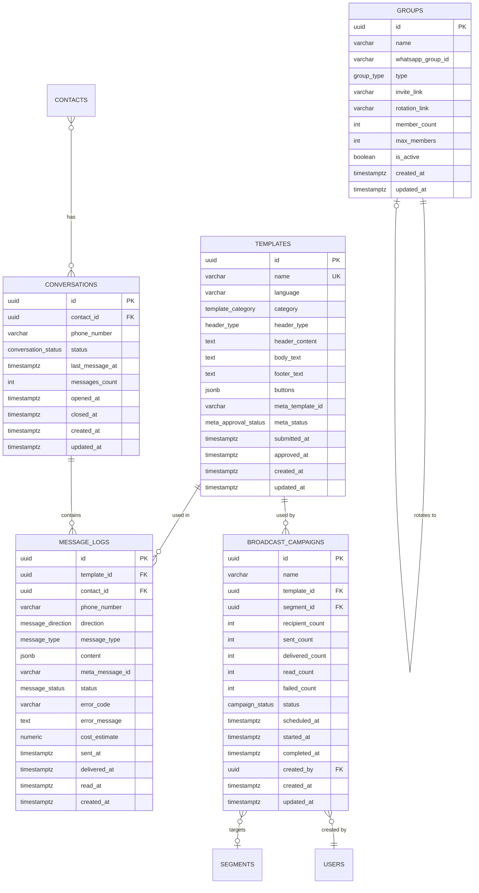

# Mensageria — Unified Messaging (WhatsApp + Email + Inbox)

> **Module:** Mensageria
> **Schema:** `whatsapp` (WhatsApp transport), `inbox` (unified inbox)
> **Route prefix:** `/api/v1/whatsapp`, `/api/v1/inbox`
> **Admin UI route group:** `(admin)/whatsapp/*`, `(admin)/inbox/*`
> **Webhook route:** `/api/v1/webhooks/meta-whatsapp`
> **Version:** 2.0
> **Date:** April 2026
> **Status:** Approved
> **Replaces:** Chatwoot + manual WhatsApp Business
> **References:** [DATABASE.md](../../architecture/DATABASE.md), [API.md](../../architecture/API.md), [AUTH.md](../../architecture/AUTH.md), [LGPD.md](../../platform/LGPD.md), [NOTIFICATIONS.md](../../platform/NOTIFICATIONS.md), [GLOSSARY.md](../../dev/GLOSSARY.md), [CRM spec](../growth/crm.md), [Checkout spec](../commerce/checkout.md)

---

## 1. Purpose & Scope

Mensageria is the **unified messaging and customer support module** of Ambaril. It combines WhatsApp transport (direct Meta Cloud API integration), email transport (Resend), and a unified inbox into a single module. It owns all outbound communication — transactional (order confirmation, shipping, tracking), marketing (campaigns from CRM segments), cart recovery (triggered by CRM automations), creator notifications (sale/tier/payout alerts), VIP group management, and unified customer support. The WhatsApp integration is **direct to Meta Cloud API** (no BSP intermediary), which eliminates per-message markup fees and gives full control over template submission, webhook handling, and conversation billing.

**Core responsibilities:**

| Capability                   | Description                                                                                                                                                                    |
| ---------------------------- | ------------------------------------------------------------------------------------------------------------------------------------------------------------------------------ |
| **Template Management**      | Create, submit to Meta for approval, and manage WhatsApp message templates with `{{1}}` placeholder variables, headers (text/image/document), footers, and interactive buttons |
| **Transactional Messages**   | Automated messages triggered by system events: order confirmation, shipping notification, tracking update, delivery confirmation, exchange approval, creator sale notification |
| **Marketing Campaigns**      | Broadcast campaigns to CRM segments using pre-approved marketing templates. Campaign builder with preview, scheduling, and analytics                                           |
| **Cart Recovery**            | 3-step recovery sequence (30min, 2h, 24h) dispatched via CRM automation triggers, using dedicated recovery templates                                                           |
| **VIP Group Management**     | Track WhatsApp groups (VIP/general), manage invite links, auto-rotate when groups reach member capacity                                                                        |
| **Unified Inbox**            | Single threaded view for WhatsApp and email conversations, CRM profile sidebar, ticket lifecycle management, tags, quick replies, support metrics                              |
| **Creator Notifications**    | Sale alerts, tier progression updates, payout confirmations sent to creator WhatsApp numbers                                                                                   |
| **LGPD Consent Enforcement** | Marketing messages blocked unless `consent_whatsapp = true` on the CRM contact. "SAIR" opt-out keyword processing                                                              |
| **Cost Tracking**            | Per-message cost estimation for conversation-based billing reporting                                                                                                           |

**Primary users:**

- **System (automated):** Sends transactional messages triggered by Flare events (order.paid, order.shipped, etc.)
- **Caio (PM):** Creates and schedules marketing campaigns via the Campaign Builder UI
- **Slimgust (Support):** Sends and receives messages via the Inbox module (which routes through this engine)
- **CRM Automations:** Trigger cart recovery, reactivation, and lifecycle messaging sequences

**Out of scope:** This module does NOT own AI intelligence — that is handled by the Astro module. Mensageria may use Astro for AI draft replies and self-service bot capabilities.

---

## 2. User Stories

### 2.1 Automated / System Stories

| #     | As a...        | I want to...                                                                 | So that...                                                                       | Acceptance Criteria                                                                                                                                                                                                                                                        |
| ----- | -------------- | ---------------------------------------------------------------------------- | -------------------------------------------------------------------------------- | -------------------------------------------------------------------------------------------------------------------------------------------------------------------------------------------------------------------------------------------------------------------------- |
| US-01 | System         | Send an order confirmation via WhatsApp when payment is confirmed            | The customer receives immediate purchase confirmation on their preferred channel | On `order.paid` event, system resolves contact phone, selects `wa_order_confirmed` template, fills placeholders (order_number, items_summary, total, tracking_link), dispatches via Meta Cloud API; message_log created with status `queued` -> `sent` -> `delivered`      |
| US-02 | System         | Send a shipping notification when the order is dispatched                    | The customer knows their order is on the way with a tracking link                | On `order.shipped` event, system sends `wa_order_shipped` template with tracking_code and carrier name; includes clickable tracking URL button                                                                                                                             |
| US-03 | System         | Send a tracking update when delivery status changes                          | The customer is proactively informed of delivery progress                        | On `order.in_transit` and `order.out_for_delivery` events, system sends `wa_tracking_update` template with current status and estimated delivery date                                                                                                                      |
| US-04 | System         | Send a delivery confirmation when the order arrives                          | The customer is prompted to confirm receipt and rate their experience            | On `order.delivered` event, system sends `wa_order_delivered` template with "Confirmar recebimento" button                                                                                                                                                                 |
| US-05 | CRM Automation | Send cart recovery messages at 30min, 2h, and 24h intervals                  | Abandoned carts are recovered through a multi-touch WhatsApp sequence            | CRM automation triggers `wa_cart_recovery_1`, `wa_cart_recovery_2`, `wa_cart_recovery_3` templates at configured intervals; each message includes cart items summary and "Voltar para sacola" button with cart restore link; sequence stops if customer completes purchase |
| US-06 | System         | Send a creator sale notification when a coupon-attributed order is confirmed | Creators are instantly notified of sales generated by their coupon               | On `creator.sale` event, system sends `wa_creator_sale` template with order value, commission amount, and running total for the period                                                                                                                                     |
| US-07 | System         | Process the "SAIR" opt-out keyword from inbound messages                     | LGPD compliance is maintained by immediately revoking marketing consent          | Inbound message containing "SAIR" (case-insensitive) triggers: (1) update `crm.contacts.consent_whatsapp = false`, (2) send confirmation `wa_optout_confirmed` template (transactional, no consent required), (3) log consent revocation in audit trail                    |

### 2.2 Admin / PM Stories

| #     | As a...   | I want to...                                                                        | So that...                                                                   | Acceptance Criteria                                                                                                                                                                                                                                                |
| ----- | --------- | ----------------------------------------------------------------------------------- | ---------------------------------------------------------------------------- | ------------------------------------------------------------------------------------------------------------------------------------------------------------------------------------------------------------------------------------------------------------------ |
| US-08 | PM (Caio) | Create a new WhatsApp template with placeholders and submit it to Meta for approval | I can use the template in campaigns once Meta approves it                    | Template creation form with name, category (transactional/marketing/utility), language (default pt_BR), header type, body with `{{1}}` placeholders, footer, buttons; "Submit to Meta" button calls Meta Cloud API; status tracked as pending -> approved/rejected |
| US-09 | PM (Caio) | Build and schedule a marketing campaign targeting a CRM segment                     | I can reach specific customer groups with targeted messages at optimal times | Campaign builder: (1) select CRM segment, (2) select approved marketing template, (3) fill template variables, (4) preview rendered message, (5) choose send now or schedule; campaign queued via PostgreSQL job queue; progress tracked in real-time              |
| US-10 | PM (Caio) | View campaign analytics (sent, delivered, read, failed rates)                       | I can measure campaign effectiveness and optimize future campaigns           | Campaign detail page shows: total recipients, sent count, delivered count, read count, failed count with error breakdown; delivery rate %, read rate %; timeline chart of delivery progression                                                                     |
| US-11 | PM (Caio) | Cancel a scheduled or in-progress campaign                                          | I can stop a campaign if I discover an error or need to adjust targeting     | "Cancelar campanha" button on campaign detail; if `scheduled`, removes from queue; if `sending`, stops dispatch of remaining messages (already-sent messages cannot be recalled)                                                                                   |
| US-12 | Admin     | View the full message log with search and filters                                   | I can audit all WhatsApp communication and troubleshoot delivery issues      | Message log table with filters: direction (inbound/outbound), status, template, date range, phone number search; click-through to message detail with full Meta API response                                                                                       |

### 2.3 VIP Group Stories

| #     | As a... | I want to...                                                      | So that...                                                            | Acceptance Criteria                                                                                                                                        |
| ----- | ------- | ----------------------------------------------------------------- | --------------------------------------------------------------------- | ---------------------------------------------------------------------------------------------------------------------------------------------------------- |
| US-13 | Admin   | Manage VIP WhatsApp groups with member tracking                   | I can organize VIP customers into managed groups                      | Group manager screen lists all groups with name, type, member count, max members, invite link status; CRUD operations on groups                            |
| US-14 | System  | Auto-create a new VIP group when the current one reaches capacity | VIP customers always have a group to join without manual intervention | When `member_count >= max_members` (default 256), system creates a new group entry, generates new invite link, updates rotation link to point to new group |
| US-15 | Admin   | Rotate group invite links on demand                               | I can invalidate old links and generate fresh ones for security       | "Rotacionar link" button on group detail; updates `invite_link` and `rotation_link` fields; old link becomes invalid                                       |

### 2.4 Inbox Integration Stories

| #     | As a...            | I want to...                                                           | So that...                                                   | Acceptance Criteria                                                                                                                                                                                                           |
| ----- | ------------------ | ---------------------------------------------------------------------- | ------------------------------------------------------------ | ----------------------------------------------------------------------------------------------------------------------------------------------------------------------------------------------------------------------------- |
| US-16 | Support (Slimgust) | Send a WhatsApp message to a customer from the Inbox conversation view | I can respond to customers without leaving the unified inbox | Inbox sends message payload to WhatsApp Engine API; engine dispatches via Meta Cloud API; message_log created and linked to inbox ticket; delivery status updated via webhook                                                 |
| US-17 | System             | Route inbound WhatsApp messages to the Inbox module                    | Customer messages appear in the unified support inbox        | Meta webhook delivers inbound message to WhatsApp Engine; engine creates message_log record, resolves contact by phone number, emits `whatsapp.message.inbound` event; Inbox module consumes event and creates/updates ticket |

---

## 3. Data Model

### 3.1 Entity Relationship Diagram



### 3.2 Enums

```sql
CREATE TYPE whatsapp.template_category AS ENUM (
    'transactional', 'marketing', 'utility'
);

CREATE TYPE whatsapp.header_type AS ENUM (
    'none', 'text', 'image', 'document'
);

CREATE TYPE whatsapp.meta_approval_status AS ENUM (
    'pending', 'approved', 'rejected'
);

CREATE TYPE whatsapp.message_direction AS ENUM (
    'outbound', 'inbound'
);

CREATE TYPE whatsapp.message_type AS ENUM (
    'template', 'text', 'image', 'interactive'
);

CREATE TYPE whatsapp.message_status AS ENUM (
    'queued', 'sent', 'delivered', 'read', 'failed'
);

CREATE TYPE whatsapp.conversation_status AS ENUM (
    'active', 'closed'
);

CREATE TYPE whatsapp.group_type AS ENUM (
    'vip', 'general'
);

CREATE TYPE whatsapp.campaign_status AS ENUM (
    'draft', 'scheduled', 'sending', 'completed', 'cancelled'
);
```

### 3.3 Table Definitions

#### 3.3.1 whatsapp.templates

| Column           | Type                          | Constraints                   | Description                                                                                                                                                    |
| ---------------- | ----------------------------- | ----------------------------- | -------------------------------------------------------------------------------------------------------------------------------------------------------------- | ----- | -------------------------------------------------------------------------------------------------- |
| id               | UUID                          | PK, DEFAULT gen_random_uuid() | UUID v7                                                                                                                                                        |
| name             | VARCHAR(128)                  | NOT NULL, UNIQUE              | Template name (snake_case, e.g., `wa_order_confirmed`). Must match Meta's naming rules: lowercase, alphanumeric + underscores only                             |
| language         | VARCHAR(10)                   | NOT NULL DEFAULT 'pt_BR'      | BCP 47 language code. CIENA operates in pt_BR only                                                                                                             |
| category         | whatsapp.template_category    | NOT NULL                      | `transactional` (order events), `marketing` (campaigns), `utility` (OTP, opt-out confirmation)                                                                 |
| header_type      | whatsapp.header_type          | NOT NULL DEFAULT 'none'       | Type of header component. `none` = no header, `text` = text header with optional `{{1}}` variable, `image` = media header (URL), `document` = PDF header (URL) |
| header_content   | TEXT                          | NULL                          | Header text (if `header_type = text`), media URL (if `image`/`document`). NULL when `header_type = none`                                                       |
| body_text        | TEXT                          | NOT NULL                      | Template body with `{{1}}`, `{{2}}`, etc. placeholder variables. Max 1024 characters per Meta spec                                                             |
| footer_text      | TEXT                          | NULL                          | Optional footer text (max 60 characters). Typically used for "CIENA - Streetwear de Rua" branding                                                              |
| buttons          | JSONB                         | NULL                          | Array of button objects: `[{ type: "QUICK_REPLY"                                                                                                               | "URL" | "PHONE_NUMBER", text: string, url?: string, phone_number?: string }]`. Max 3 buttons per Meta spec |
| meta_template_id | VARCHAR(255)                  | NULL, UNIQUE                  | Meta's template ID returned after submission. NULL if not yet submitted                                                                                        |
| meta_status      | whatsapp.meta_approval_status | NOT NULL DEFAULT 'pending'    | Meta review status. Only `approved` templates can be used in outbound messages                                                                                 |
| submitted_at     | TIMESTAMPTZ                   | NULL                          | When the template was submitted to Meta for review                                                                                                             |
| approved_at      | TIMESTAMPTZ                   | NULL                          | When Meta approved the template (NULL if still pending or rejected)                                                                                            |
| created_at       | TIMESTAMPTZ                   | NOT NULL DEFAULT NOW()        |                                                                                                                                                                |
| updated_at       | TIMESTAMPTZ                   | NOT NULL DEFAULT NOW()        |                                                                                                                                                                |

**Buttons JSONB structure:**

```json
[
  {
    "type": "URL",
    "text": "Acompanhar pedido",
    "url": "https://ciena.com.br/pedido/{{1}}"
  },
  {
    "type": "QUICK_REPLY",
    "text": "Preciso de ajuda"
  }
]
```

**Indexes:**

```sql
CREATE UNIQUE INDEX idx_templates_name ON whatsapp.templates (name);
CREATE INDEX idx_templates_category ON whatsapp.templates (category);
CREATE INDEX idx_templates_meta_status ON whatsapp.templates (meta_status);
CREATE UNIQUE INDEX idx_templates_meta_id ON whatsapp.templates (meta_template_id) WHERE meta_template_id IS NOT NULL;
```

#### 3.3.2 whatsapp.message_logs

| Column          | Type                       | Constraints                     | Description                                                                                                                                                                                        |
| --------------- | -------------------------- | ------------------------------- | -------------------------------------------------------------------------------------------------------------------------------------------------------------------------------------------------- |
| id              | UUID                       | PK, DEFAULT gen_random_uuid()   | UUID v7                                                                                                                                                                                            |
| template_id     | UUID                       | NULL, FK whatsapp.templates(id) | Template used for outbound template messages. NULL for freeform text/inbound                                                                                                                       |
| contact_id      | UUID                       | NULL, FK crm.contacts(id)       | CRM contact reference. Resolved by phone number lookup. NULL if phone not matched                                                                                                                  |
| phone_number    | VARCHAR(20)                | NOT NULL                        | E.164 format (e.g., `+5511987654321`). Always present regardless of contact resolution                                                                                                             |
| direction       | whatsapp.message_direction | NOT NULL                        | `outbound` = sent by system/agent, `inbound` = received from customer                                                                                                                              |
| message_type    | whatsapp.message_type      | NOT NULL                        | `template` = approved template message, `text` = freeform text, `image` = media message, `interactive` = button/list message                                                                       |
| content         | JSONB                      | NOT NULL                        | Message content. Structure varies by type: template = `{ template_name, variables: [...] }`, text = `{ body: "..." }`, image = `{ url, caption }`, interactive = `{ type, header, body, buttons }` |
| meta_message_id | VARCHAR(255)               | NULL                            | Meta's message ID from the API response. Used for webhook status correlation                                                                                                                       |
| status          | whatsapp.message_status    | NOT NULL DEFAULT 'queued'       | Lifecycle: `queued` -> `sent` -> `delivered` -> `read` or `queued` -> `failed`                                                                                                                     |
| error_code      | VARCHAR(50)                | NULL                            | Meta error code (e.g., `131026` = rate limit, `131047` = template not found). NULL on success                                                                                                      |
| error_message   | TEXT                       | NULL                            | Human-readable error description from Meta API                                                                                                                                                     |
| cost_estimate   | NUMERIC(10,4)              | NULL                            | Estimated cost in BRL based on Meta conversation pricing. Calculated per message category and conversation window                                                                                  |
| sent_at         | TIMESTAMPTZ                | NULL                            | When Meta accepted the message (API 200 response)                                                                                                                                                  |
| delivered_at    | TIMESTAMPTZ                | NULL                            | When Meta confirmed delivery to device (webhook `delivered` status)                                                                                                                                |
| read_at         | TIMESTAMPTZ                | NULL                            | When the customer read the message (webhook `read` status, requires read receipts)                                                                                                                 |
| created_at      | TIMESTAMPTZ                | NOT NULL DEFAULT NOW()          |                                                                                                                                                                                                    |

**Content JSONB examples:**

Template message (outbound):

```json
{
  "template_name": "wa_order_confirmed",
  "variables": [
    "CIENA-20260317-0042",
    "Camiseta Preta Basic P x2, Moletom Drop 9 M x1",
    "R$ 650,60"
  ],
  "header_variables": [],
  "button_variables": ["CIENA-20260317-0042"]
}
```

Freeform text (inbound):

```json
{
  "body": "Oi, meu pedido ainda nao chegou. Numero CIENA-20260315-0039."
}
```

**Indexes:**

```sql
CREATE INDEX idx_message_logs_contact ON whatsapp.message_logs (contact_id) WHERE contact_id IS NOT NULL;
CREATE INDEX idx_message_logs_phone ON whatsapp.message_logs (phone_number);
CREATE INDEX idx_message_logs_direction ON whatsapp.message_logs (direction);
CREATE INDEX idx_message_logs_status ON whatsapp.message_logs (status);
CREATE INDEX idx_message_logs_template ON whatsapp.message_logs (template_id) WHERE template_id IS NOT NULL;
CREATE INDEX idx_message_logs_meta_id ON whatsapp.message_logs (meta_message_id) WHERE meta_message_id IS NOT NULL;
CREATE INDEX idx_message_logs_created ON whatsapp.message_logs (created_at DESC);
CREATE INDEX idx_message_logs_sent ON whatsapp.message_logs (sent_at DESC) WHERE sent_at IS NOT NULL;
```

#### 3.3.3 whatsapp.conversations

| Column          | Type                         | Constraints                   | Description                                                                        |
| --------------- | ---------------------------- | ----------------------------- | ---------------------------------------------------------------------------------- |
| id              | UUID                         | PK, DEFAULT gen_random_uuid() | UUID v7                                                                            |
| contact_id      | UUID                         | NOT NULL, FK crm.contacts(id) | CRM contact who owns this conversation                                             |
| phone_number    | VARCHAR(20)                  | NOT NULL                      | E.164 format. Denormalized for quick lookup without joining CRM                    |
| status          | whatsapp.conversation_status | NOT NULL DEFAULT 'active'     | `active` = ongoing conversation within 24h window, `closed` = no activity for 24h+ |
| last_message_at | TIMESTAMPTZ                  | NOT NULL DEFAULT NOW()        | Timestamp of the most recent message (inbound or outbound)                         |
| messages_count  | INTEGER                      | NOT NULL DEFAULT 0            | Total messages in this conversation thread                                         |
| opened_at       | TIMESTAMPTZ                  | NOT NULL DEFAULT NOW()        | When the conversation was first opened (first message)                             |
| closed_at       | TIMESTAMPTZ                  | NULL                          | When the conversation was closed (24h inactivity or manual close)                  |
| created_at      | TIMESTAMPTZ                  | NOT NULL DEFAULT NOW()        |                                                                                    |
| updated_at      | TIMESTAMPTZ                  | NOT NULL DEFAULT NOW()        |                                                                                    |

**Indexes:**

```sql
CREATE INDEX idx_conversations_contact ON whatsapp.conversations (contact_id);
CREATE INDEX idx_conversations_phone ON whatsapp.conversations (phone_number);
CREATE INDEX idx_conversations_status ON whatsapp.conversations (status);
CREATE INDEX idx_conversations_last_message ON whatsapp.conversations (last_message_at DESC);
CREATE INDEX idx_conversations_active ON whatsapp.conversations (status, last_message_at DESC) WHERE status = 'active';
```

#### 3.3.4 whatsapp.groups

| Column            | Type                | Constraints                   | Description                                                                                                                           |
| ----------------- | ------------------- | ----------------------------- | ------------------------------------------------------------------------------------------------------------------------------------- |
| id                | UUID                | PK, DEFAULT gen_random_uuid() | UUID v7                                                                                                                               |
| name              | VARCHAR(255)        | NOT NULL                      | Group display name (e.g., "CIENA VIP #3")                                                                                             |
| whatsapp_group_id | VARCHAR(255)        | NULL, UNIQUE                  | WhatsApp's internal group JID. Set after group is created on WhatsApp. NULL if managed externally                                     |
| type              | whatsapp.group_type | NOT NULL                      | `vip` = exclusive VIP customer group, `general` = open community group                                                                |
| invite_link       | VARCHAR(512)        | NULL                          | Current active WhatsApp group invite link (`https://chat.whatsapp.com/...`)                                                           |
| rotation_link     | VARCHAR(512)        | NULL                          | Stable redirect URL that always points to the latest active invite link. Used in public-facing materials so the link never goes stale |
| member_count      | INTEGER             | NOT NULL DEFAULT 0            | Tracked via periodic sync or manual update                                                                                            |
| max_members       | INTEGER             | NOT NULL DEFAULT 256          | WhatsApp group member cap. When reached, triggers new group creation                                                                  |
| is_active         | BOOLEAN             | NOT NULL DEFAULT TRUE         | FALSE = archived group (full, deprecated, or deactivated)                                                                             |
| created_at        | TIMESTAMPTZ         | NOT NULL DEFAULT NOW()        |                                                                                                                                       |
| updated_at        | TIMESTAMPTZ         | NOT NULL DEFAULT NOW()        |                                                                                                                                       |

**Indexes:**

```sql
CREATE UNIQUE INDEX idx_groups_whatsapp_id ON whatsapp.groups (whatsapp_group_id) WHERE whatsapp_group_id IS NOT NULL;
CREATE INDEX idx_groups_type ON whatsapp.groups (type);
CREATE INDEX idx_groups_active ON whatsapp.groups (is_active, type) WHERE is_active = TRUE;
```

#### 3.3.5 whatsapp.broadcast_campaigns

| Column          | Type                     | Constraints                         | Description                                                                        |
| --------------- | ------------------------ | ----------------------------------- | ---------------------------------------------------------------------------------- | ------------------------ | ----------- |
| id              | UUID                     | PK, DEFAULT gen_random_uuid()       | UUID v7                                                                            |
| name            | VARCHAR(255)             | NOT NULL                            | Campaign display name (e.g., "Lancamento Drop 10 - Nocturne")                      |
| template_id     | UUID                     | NOT NULL, FK whatsapp.templates(id) | Template to use. Must have `meta_status = 'approved'` and `category = 'marketing'` |
| segment_id      | UUID                     | NULL, FK crm.segments(id)           | CRM segment to target. NULL if recipient list is manually provided                 |
| recipient_count | INTEGER                  | NOT NULL DEFAULT 0                  | Total contacts in segment at campaign creation time (snapshot)                     |
| sent_count      | INTEGER                  | NOT NULL DEFAULT 0                  | Messages successfully accepted by Meta API                                         |
| delivered_count | INTEGER                  | NOT NULL DEFAULT 0                  | Messages confirmed delivered to device                                             |
| read_count      | INTEGER                  | NOT NULL DEFAULT 0                  | Messages confirmed read by recipient                                               |
| failed_count    | INTEGER                  | NOT NULL DEFAULT 0                  | Messages that failed to send (error from Meta API)                                 |
| status          | whatsapp.campaign_status | NOT NULL DEFAULT 'draft'            | FSM: `draft` -> `scheduled`                                                        | `sending` -> `completed` | `cancelled` |
| scheduled_at    | TIMESTAMPTZ              | NULL                                | When the campaign is scheduled to begin sending. NULL for immediate send           |
| started_at      | TIMESTAMPTZ              | NULL                                | When the campaign actually began dispatching messages                              |
| completed_at    | TIMESTAMPTZ              | NULL                                | When all messages have been dispatched (sent or failed)                            |
| created_by      | UUID                     | NOT NULL, FK users(id)              | User who created the campaign                                                      |
| created_at      | TIMESTAMPTZ              | NOT NULL DEFAULT NOW()              |                                                                                    |
| updated_at      | TIMESTAMPTZ              | NOT NULL DEFAULT NOW()              |                                                                                    |

**Indexes:**

```sql
CREATE INDEX idx_campaigns_status ON whatsapp.broadcast_campaigns (status);
CREATE INDEX idx_campaigns_template ON whatsapp.broadcast_campaigns (template_id);
CREATE INDEX idx_campaigns_segment ON whatsapp.broadcast_campaigns (segment_id) WHERE segment_id IS NOT NULL;
CREATE INDEX idx_campaigns_scheduled ON whatsapp.broadcast_campaigns (scheduled_at) WHERE status = 'scheduled';
CREATE INDEX idx_campaigns_created ON whatsapp.broadcast_campaigns (created_at DESC);
CREATE INDEX idx_campaigns_created_by ON whatsapp.broadcast_campaigns (created_by);
```

---

## 4. Screens & Wireframes

All screens follow the Ambaril Design System (DS.md): light mode default (dark opt-in), DM Sans, shadcn/ui components, Lucide React. WhatsApp screens use green accent (`#25D366`) for WhatsApp-specific status indicators.

### 4.1 Template Manager — List

```
+-----------------------------------------------------------------------+
|  Ambaril Admin > WhatsApp > Templates                  [+ Novo Template]  |
+-----------------------------------------------------------------------+
|                                                                       |
|  Filtros: [Categoria v] [Status Meta v] [Buscar por nome...]         |
|                                                                       |
|  +-------+---------------------------+-------+----------+------+----+ |
|  | Nome  | Body (preview)            | Cat.  | Meta     | Lang | *  | |
|  +-------+---------------------------+-------+----------+------+----+ |
|  | wa_   | Oi {{1}}! Seu pedido      | Trans | Approved | ptBR |[v]| |
|  | order | #{{2}} foi confirmado...  |       | (check)  |      |   | |
|  | _conf |                           |       |          |      |   | |
|  +-------+---------------------------+-------+----------+------+----+ |
|  | wa_   | Seu pedido #{{1}} foi     | Trans | Approved | ptBR |[v]| |
|  | order | enviado! Rastreie: {{2}}  |       | (check)  |      |   | |
|  | _ship |                           |       |          |      |   | |
|  +-------+---------------------------+-------+----------+------+----+ |
|  | wa_   | Oi {{1}}! Voce esqueceu   | Mktg  | Approved | ptBR |[v]| |
|  | cart_ | alguns itens no carrinho..|       | (check)  |      |   | |
|  | rec_1 |                           |       |          |      |   | |
|  +-------+---------------------------+-------+----------+------+----+ |
|  | wa_   | Lancamento exclusivo!     | Mktg  | Pending  | ptBR |[v]| |
|  | drop_ | Drop 10 Nocturne chega..  |       | (clock)  |      |   | |
|  | launch|                           |       |          |      |   | |
|  +-------+---------------------------+-------+----------+------+----+ |
|  | wa_   | Sua troca #{{1}} foi      | Trans | Rejected | ptBR |[v]| |
|  | troca | aprovada! Etiqueta de...  |       | (x)      |      |   | |
|  | _appr |                           |       |          |      |   | |
|  +-------+---------------------------+-------+----------+------+----+ |
|                                                                       |
|  Mostrando 1-5 de 14                   [< Anterior] [Proximo >]      |
+-----------------------------------------------------------------------+
```

### 4.2 Template Manager — Create/Edit with Preview

```
+-----------------------------------------------------------------------+
|  Ambaril Admin > WhatsApp > Templates > Novo Template                    |
+-----------------------------------------------------------------------+
|                                                                       |
|  +-------------------------------+  +-------------------------------+ |
|  |  CONFIGURACAO DO TEMPLATE     |  |  PREVIEW (WhatsApp)           | |
|  +-------------------------------+  +-------------------------------+ |
|  |                               |  |                               | |
|  |  Nome *                       |  |  +-------------------------+  | |
|  |  [wa_drop_launch____________] |  |  | +55 11 CIENA            |  | |
|  |                               |  |  | Empresa                 |  | |
|  |  Categoria *                  |  |  +-------------------------+  | |
|  |  ( ) Transacional             |  |  |                         |  | |
|  |  (o) Marketing                |  |  | [img] Header image      |  | |
|  |  ( ) Utilidade                |  |  |                         |  | |
|  |                               |  |  | Lancamento exclusivo!   |  | |
|  |  Idioma: [pt_BR v]           |  |  | Drop 10 Nocturne chega  |  | |
|  |                               |  |  | dia 25/03. Pecas        |  | |
|  |  -  -  -  -  -  -  -  -  -   |  |  | limitadas.              |  | |
|  |                               |  |  |                         |  | |
|  |  HEADER                       |  |  | CIENA - Streetwear      |  | |
|  |  Tipo: [Imagem v]            |  |  |                         |  | |
|  |  URL: [https://cdn.ciena...]  |  |  | [Comprar agora]         |  | |
|  |                               |  |  | [Nao tenho interesse]   |  | |
|  |  BODY *                       |  |  |                         |  | |
|  |  [Lancamento exclusivo!     ] |  |  +-------------------------+  | |
|  |  [Drop 10 Nocturne chega   ] |  |  |                         |  | |
|  |  [dia {{1}}. Pecas          ] |  |  |  Variaveis:             |  | |
|  |  [limitadas.                ] |  |  |  {{1}} = "25/03"        |  | |
|  |  Caracteres: 89/1024          |  |  |                         |  | |
|  |                               |  |  +-------------------------+  | |
|  |  Variaveis: {{1}}             |  |                               | |
|  |  [1]: Exemplo [25/03_______]  |  |                               | |
|  |                               |  |                               | |
|  |  FOOTER                       |  |                               | |
|  |  [CIENA - Streetwear________] |  |                               | |
|  |                               |  |                               | |
|  |  BOTOES (max 3)               |  |                               | |
|  |  [1] URL: [Comprar agora]     |  |                               | |
|  |      URL: [https://ciena...]  |  |                               | |
|  |  [2] Quick Reply:             |  |                               | |
|  |      [Nao tenho interesse]    |  |                               | |
|  |  [+ Adicionar botao]          |  |                               | |
|  |                               |  |                               | |
|  +-------------------------------+  +-------------------------------+ |
|                                                                       |
|  [Salvar rascunho]     [Submeter ao Meta para aprovacao ->]          |
+-----------------------------------------------------------------------+
```

**Funnel Templates (Social Selling Sequences)**

In addition to single templates, the template manager supports a `funnel` type — multi-step message sequences designed for social selling conversion. Unlike single templates, funnels define a sequence of 3-5 messages with configurable timing rules between steps. Each individual message in the funnel is itself a Meta-approved template.

The funnel editor adds a "Tipo" selector at the top: `( ) Mensagem unica  (o) Funil (sequencia)`. When "Funil" is selected, the editor expands to show a step-based builder:

```
+-----------------------------------------------------------------------+
|  Ambaril Admin > WhatsApp > Templates > Novo Funil                       |
+-----------------------------------------------------------------------+
|                                                                       |
|  Nome do funil *: [sf_nurture______________________________]          |
|  Descricao:       [Sequencia de nurture para social selling]          |
|                                                                       |
|  +-----------------------------------------------------------------+  |
|  |  ETAPA 1 de 3                              [Remover etapa]       |  |
|  +-----------------------------------------------------------------+  |
|  |  Template *:  [wa_product_highlight   v] (deve estar aprovado)  |  |
|  |  Delay apos etapa anterior:  [0] dias [0] horas (imediato)      |  |
|  +-----------------------------------------------------------------+  |
|                                                                       |
|  +-----------------------------------------------------------------+  |
|  |  ETAPA 2 de 3                              [Remover etapa]       |  |
|  +-----------------------------------------------------------------+  |
|  |  Template *:  [wa_social_proof         v] (deve estar aprovado)  |  |
|  |  Delay apos etapa anterior:  [1] dias [0] horas                  |  |
|  +-----------------------------------------------------------------+  |
|                                                                       |
|  +-----------------------------------------------------------------+  |
|  |  ETAPA 3 de 3                              [Remover etapa]       |  |
|  +-----------------------------------------------------------------+  |
|  |  Template *:  [wa_limited_offer        v] (deve estar aprovado)  |  |
|  |  Delay apos etapa anterior:  [1] dias [0] horas                  |  |
|  +-----------------------------------------------------------------+  |
|                                                                       |
|  [+ Adicionar etapa] (max 5)                                         |
|                                                                       |
|  (i) Cada template individual deve ser aprovado pelo Meta antes       |
|      de ativar o funil. Se o contato converter (comprar) durante      |
|      a sequencia, as etapas restantes sao canceladas.                 |
|                                                                       |
|  [Salvar funil]                                                       |
+-----------------------------------------------------------------------+
```

**Pre-built funnels (seeded):**

| Funnel ID | Name         | Steps                                                                                  | Description                                                                     |
| --------- | ------------ | -------------------------------------------------------------------------------------- | ------------------------------------------------------------------------------- |
| SF1       | Nurture      | Day 0: product highlight -> Day 1: social proof/review -> Day 2: limited-time offer    | Standard social selling nurture sequence for warm leads                         |
| SF2       | Reengagement | Trigger: link clicked but no purchase -> +24h: "Vimos que voce se interessou por X..." | Re-engage contacts who showed intent but did not convert                        |
| SF3       | VIP Preview  | Trigger: VIP segment -> -24h before public launch: early drop access message           | VIP customers get exclusive early access to drops 24h before the general public |

### 4.3 Campaign Builder

```
+-----------------------------------------------------------------------+
|  Ambaril Admin > WhatsApp > Campanhas > Nova Campanha                    |
+-----------------------------------------------------------------------+
|                                                                       |
|  ETAPA 1 de 4: SEGMENTO                                              |
|  [1. Segmento] --- 2. Template --- 3. Preview --- 4. Envio           |
|                                                                       |
|  +-----------------------------------------------------------------+  |
|  |  SELECIONE O SEGMENTO                                           |  |
|  +-----------------------------------------------------------------+  |
|  |                                                                 |  |
|  |  Nome da campanha *                                             |  |
|  |  [Lancamento Drop 10 - Nocturne___________________________]    |  |
|  |                                                                 |  |
|  |  Segmento alvo *                                                |  |
|  |  +-----------------------------------------------------------+ |  |
|  |  | ( ) Todos os contatos (8.432)                              | |  |
|  |  | (o) VIP Customers (234)                                    | |  |
|  |  | ( ) Compraram nos ultimos 90 dias (1.847)                  | |  |
|  |  | ( ) Dormentes 90+ dias (3.201)                             | |  |
|  |  | ( ) Compraram Drop 9 (412)                                 | |  |
|  |  +-----------------------------------------------------------+ |  |
|  |                                                                 |  |
|  |  Contatos no segmento: 234                                      |  |
|  |  Com consent_whatsapp = true: 219 (93.6%)                      |  |
|  |  Destinatarios efetivos: 219                                    |  |
|  |                                                                 |  |
|  +-----------------------------------------------------------------+  |
|                                                                       |
|  [Cancelar]                                    [Proximo: Template ->] |
+-----------------------------------------------------------------------+

- - - - - - - - - - - - - - - - - - - - - - - - - - - - - - - - - - - -

|  ETAPA 3 de 4: PREVIEW                                                |
|  1. Segmento --- 2. Template --- [3. Preview] --- 4. Envio           |
|                                                                       |
|  +-----------------------------------------------------------------+  |
|  |  PREVIEW DA MENSAGEM                                            |  |
|  +-----------------------------------------------------------------+  |
|  |                                                                 |  |
|  |  +-------------------------+   Campanha: Lancamento Drop 10     |  |
|  |  | [img] Drop Nocturne     |   Segmento: VIP Customers (219)   |  |
|  |  |                         |   Template: wa_drop_launch         |  |
|  |  | Lancamento exclusivo!   |   Custo estimado: ~R$ 43,80       |  |
|  |  | Drop 10 Nocturne chega  |   (219 msgs x ~R$ 0,20)           |  |
|  |  | dia 25/03. Pecas        |                                    |  |
|  |  | limitadas.              |   (!) Lembrete: mensagens          |  |
|  |  |                         |   marketing so serao enviadas      |  |
|  |  | CIENA - Streetwear      |   para contatos com                 |  |
|  |  |                         |   consent_whatsapp = true           |  |
|  |  | [Comprar agora]         |                                    |  |
|  |  | [Nao tenho interesse]   |                                    |  |
|  |  +-------------------------+                                    |  |
|  |                                                                 |  |
|  +-----------------------------------------------------------------+  |
|                                                                       |
|  [<- Voltar]                                    [Proximo: Envio ->]   |
+-----------------------------------------------------------------------+

- - - - - - - - - - - - - - - - - - - - - - - - - - - - - - - - - - - -

|  ETAPA 4 de 4: ENVIO                                                  |
|  1. Segmento --- 2. Template --- 3. Preview --- [4. Envio]           |
|                                                                       |
|  +-----------------------------------------------------------------+  |
|  |  QUANDO ENVIAR?                                                 |  |
|  +-----------------------------------------------------------------+  |
|  |                                                                 |  |
|  |  (o) Enviar agora                                               |  |
|  |  ( ) Agendar para:                                              |  |
|  |      Data: [__/__/____]  Hora: [__:__] (BRT)                   |  |
|  |                                                                 |  |
|  |  (!) Horario recomendado: 10:00-12:00 ou 18:00-20:00 BRT       |  |
|  |      (maiores taxas de abertura)                                |  |
|  |                                                                 |  |
|  +-----------------------------------------------------------------+  |
|                                                                       |
|  +===============================================================+   |
|  ||              ENVIAR CAMPANHA (219 mensagens)                 ||   |
|  +===============================================================+   |
|                                                                       |
|  Ao enviar, as mensagens serao enfileiradas e disparadas              |
|  respeitando o rate limit do Meta Cloud API (80 msg/s).               |
+-----------------------------------------------------------------------+
```

### 4.4 Campaign Analytics

```
+-----------------------------------------------------------------------+
|  Ambaril Admin > WhatsApp > Campanhas > Lancamento Drop 10               |
+-----------------------------------------------------------------------+
|                                                                       |
|  Status: Concluida | Enviada em: 17/03/2026 10:30 BRT                |
|  Duracao do envio: 3 segundos (219 mensagens)                         |
|                                                                       |
|  +-----------------------------------------------------------------+  |
|  |  METRICAS DA CAMPANHA                                           |  |
|  +-----------------------------------------------------------------+  |
|  |                                                                 |  |
|  |  [Enviados      [Entregues     [Lidos         [Falhos          |  |
|  |   219            214            187            5                |  |
|  |   100%]          97.7%]         85.4%]         2.3%]           |  |
|  |                                                                 |  |
|  +-----------------------------------------------------------------+  |
|                                                                       |
|  +-----------------------------------------------------------------+  |
|  |  PROGRESSAO DE ENTREGA (timeline)                               |  |
|  +-----------------------------------------------------------------+  |
|  |                                                                 |  |
|  |  Enviados   |========================================| 219      |  |
|  |  Entregues  |======================================  | 214      |  |
|  |  Lidos      |================================        | 187      |  |
|  |  Falhos     |==                                      | 5        |  |
|  |                                                                 |  |
|  |  Timeline: 10:30 ---- 10:35 ---- 11:00 ---- 12:00 ---- 18:00  |  |
|  |            sent       delivered   reads peak  reads    reads    |  |
|  |            peak       peak        taper off   slow     final    |  |
|  |                                                                 |  |
|  +-----------------------------------------------------------------+  |
|                                                                       |
|  +-----------------------------------------------------------------+  |
|  |  ERROS (5 falhos)                                               |  |
|  +-----------------------------------------------------------------+  |
|  |                                                                 |  |
|  |  +-------------+-------+--------------------------------------+ |  |
|  |  | Telefone    | Erro  | Descricao                            | |  |
|  |  +-------------+-------+--------------------------------------+ |  |
|  |  | +5511...234 | 131049| Numero nao registrado no WhatsApp    | |  |
|  |  | +5521...891 | 131049| Numero nao registrado no WhatsApp    | |  |
|  |  | +5511...567 | 131026| Rate limit atingido (retry failed)   | |  |
|  |  | +5548...012 | 131047| Template nao encontrado (sync issue) | |  |
|  |  | +5511...345 | 131053| Conta WhatsApp Business bloqueada    | |  |
|  |  +-------------+-------+--------------------------------------+ |  |
|  |                                                                 |  |
|  +-----------------------------------------------------------------+  |
|                                                                       |
|  Custo estimado: R$ 42,80 (214 conversas x R$ 0,20 medio)           |
+-----------------------------------------------------------------------+
```

### 4.5 Message Log

```
+-----------------------------------------------------------------------+
|  Ambaril Admin > WhatsApp > Mensagens                                    |
+-----------------------------------------------------------------------+
|                                                                       |
|  Filtros: [Direcao v] [Status v] [Template v] [Periodo v]            |
|           [Buscar por telefone ou nome...]                            |
|                                                                       |
|  +---+------+----------+--------+----------+--------+------+-------+ |
|  |Dir| Tel  | Contato  |Template| Conteudo | Status | Custo| Data  | |
|  +---+------+----------+--------+----------+--------+------+-------+ |
|  | > | ...34| Maria    | wa_ord | Pedido   | Read   | 0.18 | 17/03 | |
|  |   |      | Santos   | _conf  | #0042    | (vv)   |      | 10:32 | |
|  +---+------+----------+--------+----------+--------+------+-------+ |
|  | > | ...91| Pedro    | wa_ord | Pedido   | Deliv  | 0.18 | 17/03 | |
|  |   |      | Oliveira | _ship  | #0041    | (v)    |      | 10:15 | |
|  +---+------+----------+--------+----------+--------+------+-------+ |
|  | < | ...34| Maria    | --     | "Oi, meu | --     | --   | 17/03 | |
|  |   |      | Santos   |        | pedido.."| inbound|      | 10:45 | |
|  +---+------+----------+--------+----------+--------+------+-------+ |
|  | > | ...67| --       | wa_cart| Voce     | Failed | --   | 17/03 | |
|  |   |      | (unknown)| _rec_1 | esqueceu | (x)    |      | 09:30 | |
|  +---+------+----------+--------+----------+--------+------+-------+ |
|                                                                       |
|  > = outbound, < = inbound                                           |
|  Mostrando 1-25 de 12.847           [< Anterior] [Proximo >]        |
+-----------------------------------------------------------------------+
```

### 4.6 Group Manager

```
+-----------------------------------------------------------------------+
|  Ambaril Admin > WhatsApp > Grupos                          [+ Novo Grupo]|
+-----------------------------------------------------------------------+
|                                                                       |
|  +-----------+---------+---------+------+---------+---------+-------+ |
|  | Nome      | Tipo    | Membros | Max  | Link    | Status  | Acoes | |
|  +-----------+---------+---------+------+---------+---------+-------+ |
|  | CIENA VIP | VIP     | 243/256 |  256 | Ativo   | Ativo   | [...]| |
|  |  #1       |         |         |      |         |         |      | |
|  +-----------+---------+---------+------+---------+---------+-------+ |
|  | CIENA VIP | VIP     | 87/256  |  256 | Ativo   | Ativo   | [...]| |
|  |  #2       |         |         |      |         |         |      | |
|  +-----------+---------+---------+------+---------+---------+-------+ |
|  | CIENA     | General | 198/256 |  256 | Ativo   | Ativo   | [...]| |
|  |  Community|         |         |      |         |         |      | |
|  +-----------+---------+---------+------+---------+---------+-------+ |
|                                                                       |
|  (!) CIENA VIP #1 esta com 95% da capacidade.                        |
|      Novo grupo sera criado automaticamente ao atingir 256 membros.   |
|                                                                       |
|  DETALHES (expandido): CIENA VIP #1                                   |
|  +-----------------------------------------------------------------+  |
|  |  Tipo: VIP | Criado: 01/01/2026 | Membros: 243/256              |  |
|  |                                                                 |  |
|  |  Link de convite:                                               |  |
|  |  https://chat.whatsapp.com/abc123...              [Copiar]      |  |
|  |                                                                 |  |
|  |  Link de rotacao (publico):                                     |  |
|  |  https://ciena.com.br/vip/whatsapp                [Copiar]      |  |
|  |                                                                 |  |
|  |  [Rotacionar link]  [Atualizar membros]  [Desativar grupo]      |  |
|  +-----------------------------------------------------------------+  |
+-----------------------------------------------------------------------+
```

---

## 5. API Endpoints

All endpoints follow the patterns defined in [API.md](../../architecture/API.md). Dates in ISO 8601.

### 5.1 Admin Endpoints (Auth Required)

Route prefix: `/api/v1/whatsapp`

#### 5.1.1 Templates

| Method | Path                                    | Auth     | Description                                        | Request Body / Query                                                                             | Response                                          |
| ------ | --------------------------------------- | -------- | -------------------------------------------------- | ------------------------------------------------------------------------------------------------ | ------------------------------------------------- |
| GET    | `/templates`                            | Internal | List all templates                                 | `?category=&meta_status=&search=&cursor=&limit=25`                                               | `{ data: Template[], meta: Pagination }`          |
| GET    | `/templates/:id`                        | Internal | Get template detail                                | —                                                                                                | `{ data: Template }`                              |
| POST   | `/templates`                            | Internal | Create new template (draft)                        | `{ name, category, language?, header_type, header_content?, body_text, footer_text?, buttons? }` | `201 { data: Template }`                          |
| PATCH  | `/templates/:id`                        | Internal | Update template (only if meta_status != approved)  | `{ name?, header_type?, header_content?, body_text?, footer_text?, buttons? }`                   | `{ data: Template }`                              |
| DELETE | `/templates/:id`                        | Internal | Delete template (only if not used in any campaign) | —                                                                                                | `204`                                             |
| POST   | `/templates/:id/actions/submit-to-meta` | Internal | Submit template to Meta for approval               | —                                                                                                | `{ data: Template }` (meta_status set to pending) |
| POST   | `/templates/:id/actions/sync-status`    | Internal | Force sync template status from Meta               | —                                                                                                | `{ data: Template }`                              |

#### 5.1.2 Campaigns

| Method | Path                              | Auth     | Description                              | Request Body / Query                   | Response                                   |
| ------ | --------------------------------- | -------- | ---------------------------------------- | -------------------------------------- | ------------------------------------------ |
| GET    | `/campaigns`                      | Internal | List campaigns                           | `?status=&cursor=&limit=25`            | `{ data: Campaign[], meta: Pagination }`   |
| GET    | `/campaigns/:id`                  | Internal | Get campaign detail + analytics          | —                                      | `{ data: Campaign }`                       |
| POST   | `/campaigns`                      | Internal | Create campaign (draft)                  | `{ name, template_id, segment_id? }`   | `201 { data: Campaign }`                   |
| PATCH  | `/campaigns/:id`                  | Internal | Update campaign (only if draft)          | `{ name?, template_id?, segment_id? }` | `{ data: Campaign }`                       |
| DELETE | `/campaigns/:id`                  | Internal | Delete campaign (only if draft)          | —                                      | `204`                                      |
| POST   | `/campaigns/:id/actions/send`     | Internal | Send campaign immediately                | —                                      | `{ data: Campaign }` (status -> sending)   |
| POST   | `/campaigns/:id/actions/schedule` | Internal | Schedule campaign for future send        | `{ scheduled_at }`                     | `{ data: Campaign }` (status -> scheduled) |
| POST   | `/campaigns/:id/actions/cancel`   | Internal | Cancel scheduled or in-progress campaign | —                                      | `{ data: Campaign }` (status -> cancelled) |

#### 5.1.3 Message Logs

| Method | Path            | Auth     | Description                                       | Request Body / Query                                                         | Response                                   |
| ------ | --------------- | -------- | ------------------------------------------------- | ---------------------------------------------------------------------------- | ------------------------------------------ |
| GET    | `/messages`     | Internal | Query message logs                                | `?direction=&status=&template_id=&phone=&dateFrom=&dateTo=&cursor=&limit=25` | `{ data: MessageLog[], meta: Pagination }` |
| GET    | `/messages/:id` | Internal | Get message detail (full content + Meta response) | —                                                                            | `{ data: MessageLog }`                     |

#### 5.1.4 Groups

| Method | Path                               | Auth     | Description                                       | Request Body / Query                                             | Response              |
| ------ | ---------------------------------- | -------- | ------------------------------------------------- | ---------------------------------------------------------------- | --------------------- |
| GET    | `/groups`                          | Internal | List all groups                                   | `?type=&is_active=`                                              | `{ data: Group[] }`   |
| GET    | `/groups/:id`                      | Internal | Get group detail                                  | —                                                                | `{ data: Group }`     |
| POST   | `/groups`                          | Internal | Create group entry                                | `{ name, type, whatsapp_group_id?, invite_link?, max_members? }` | `201 { data: Group }` |
| PATCH  | `/groups/:id`                      | Internal | Update group                                      | `{ name?, invite_link?, member_count?, is_active? }`             | `{ data: Group }`     |
| DELETE | `/groups/:id`                      | Internal | Delete group (soft: set is_active = false)        | —                                                                | `{ data: Group }`     |
| POST   | `/groups/:id/actions/rotate-link`  | Internal | Generate new invite link and update rotation link | —                                                                | `{ data: Group }`     |
| POST   | `/groups/:id/actions/sync-members` | Internal | Sync member count from WhatsApp                   | —                                                                | `{ data: Group }`     |

### 5.2 Internal Endpoints (Module-to-Module)

Route prefix: `/api/v1/whatsapp/internal`

| Method | Path             | Auth    | Description                                      | Request Body / Query                                                                            | Response                                    |
| ------ | ---------------- | ------- | ------------------------------------------------ | ----------------------------------------------------------------------------------------------- | ------------------------------------------- |
| POST   | `/send-template` | Service | Send a template message to a phone number        | `{ phone_number, template_name, variables, header_variables?, button_variables?, contact_id? }` | `{ data: { message_id, meta_message_id } }` |
| POST   | `/send-text`     | Service | Send a freeform text message (within 24h window) | `{ phone_number, body, contact_id? }`                                                           | `{ data: { message_id, meta_message_id } }` |
| POST   | `/send-image`    | Service | Send an image message (within 24h window)        | `{ phone_number, image_url, caption?, contact_id? }`                                            | `{ data: { message_id, meta_message_id } }` |

### 5.3 Webhook Endpoints

Route prefix: `/api/v1/webhooks`

| Method | Path             | Description                                         | Request Body / Query                                                | Response                       |
| ------ | ---------------- | --------------------------------------------------- | ------------------------------------------------------------------- | ------------------------------ |
| GET    | `/meta-whatsapp` | Meta webhook verification (hub.challenge)           | `?hub.mode=subscribe&hub.verify_token=&hub.challenge=`              | Returns `hub.challenge` string |
| POST   | `/meta-whatsapp` | Meta webhook for status updates + incoming messages | Meta webhook payload (signature verified via `x-hub-signature-256`) | `200`                          |

---

## 6. Business Rules

### 6.1 Consent & Compliance Rules

| #   | Rule                                                      | Detail                                                                                                                                                                                                                                                                                                                                                                                                                                  |
| --- | --------------------------------------------------------- | --------------------------------------------------------------------------------------------------------------------------------------------------------------------------------------------------------------------------------------------------------------------------------------------------------------------------------------------------------------------------------------------------------------------------------------- |
| R1  | **Marketing messages require LGPD consent**               | All outbound messages with `template.category = 'marketing'` require `crm.contacts.consent_whatsapp = true`. The system checks consent at dispatch time (not at campaign creation). If consent is revoked between campaign creation and dispatch, that message is skipped and logged as `failed` with error_code `CONSENT_MISSING`.                                                                                                     |
| R2  | **Transactional messages bypass marketing consent**       | Messages with `template.category = 'transactional'` do NOT require `consent_whatsapp`. Legal basis: contract execution (LGPD Art. 7, V). This covers order confirmation, shipping, tracking, delivery, and exchange notifications.                                                                                                                                                                                                      |
| R3  | **"SAIR" keyword triggers opt-out**                       | Any inbound message containing the exact word "SAIR" (case-insensitive, including in longer messages like "quero sair da lista") triggers: (1) `crm.contacts.consent_whatsapp = false`, (2) `crm.contacts.consent_whatsapp_revoked_at = NOW()`, (3) send `wa_optout_confirmed` template (utility category, no consent required), (4) log consent change in `crm.consent_log`. All future marketing messages to this number are blocked. |
| R4  | **Debounce: max 1 marketing message per contact per 24h** | Before dispatching a marketing message, the system checks if a marketing message was sent to this phone number in the last 24 hours. If yes, the message is skipped and logged as `failed` with error_code `DEBOUNCE_24H`. This prevents customer fatigue from overlapping campaigns or automation triggers. Transactional messages are exempt from debounce.                                                                           |

### 6.2 Template & Meta API Rules

| #      | Rule                                                  | Detail                                                                                                                                                                                                                                                                                                                                                                                                                                                                                                         |
| ------ | ----------------------------------------------------- | -------------------------------------------------------------------------------------------------------------------------------------------------------------------------------------------------------------------------------------------------------------------------------------------------------------------------------------------------------------------------------------------------------------------------------------------------------------------------------------------------------------- |
| R5     | **Template must be Meta-approved before use**         | Only templates with `meta_status = 'approved'` can be used in campaigns or triggered sends. Attempting to send with a pending/rejected template returns a 400 error: "Template nao aprovado pelo Meta. Status atual: {status}."                                                                                                                                                                                                                                                                                |
| R6     | **Template name format enforcement**                  | Template names must be lowercase, alphanumeric with underscores only, prefixed with `wa_` (e.g., `wa_order_confirmed`). This convention ensures consistency and matches Meta's naming requirements. Validated by Zod schema at creation.                                                                                                                                                                                                                                                                       |
| R7     | **Approved templates cannot be edited**               | Once a template has `meta_status = 'approved'`, it cannot be edited via the Ambaril API. To change an approved template, the user must create a new version (e.g., `wa_order_confirmed_v2`) and submit it for approval. This prevents desync between Ambaril and Meta's template registry.                                                                                                                                                                                                                     |
| R8     | **Funnel templates require individual Meta approval** | Funnel templates (`type = 'funnel'`) are multi-step sequences where each step references an individual template. Every individual template in the funnel sequence must have `meta_status = 'approved'` before the funnel can be activated. If any template in the sequence is pending or rejected, the funnel status is set to `inactive` and cannot be used in campaigns. The system validates all step templates on funnel save and on campaign creation.                                                    |
| R-TONE | **Tone of voice guideline**                           | All WhatsApp templates must follow CIENA's humanized communication guidelines: write as a person, not a brand. Use first person ("a gente", "nos"), casual but respectful tone, avoid corporate language. Every template should feel like a message from a friend who happens to work at CIENA. Templates that use overly formal or robotic language (e.g., "Prezado cliente", "Informamos que") should be revised before Meta submission. Ref: Pandora96 principle — "comunique como pessoa, nao como marca." |

### 6.3 Rate Limiting & Delivery Rules

| #   | Rule                                                    | Detail                                                                                                                                                                                                                                                                                                                                                                                                                                                                                                                                                                                                                                                                                                                                                                                                                                                 |
| --- | ------------------------------------------------------- | ------------------------------------------------------------------------------------------------------------------------------------------------------------------------------------------------------------------------------------------------------------------------------------------------------------------------------------------------------------------------------------------------------------------------------------------------------------------------------------------------------------------------------------------------------------------------------------------------------------------------------------------------------------------------------------------------------------------------------------------------------------------------------------------------------------------------------------------------------ |
| R9  | **Meta rate limit: 80 msg/s (tier 1)**                  | The Meta Cloud API enforces a messaging rate limit based on the WhatsApp Business Account quality rating. CIENA starts at Tier 1 (80 messages/second). The campaign dispatch worker throttles to 70 msg/s (87.5% of limit) to maintain headroom for transactional messages. Rate limit tier scales automatically as quality rating improves.                                                                                                                                                                                                                                                                                                                                                                                                                                                                                                           |
| R10 | **Campaign sends are queued via PostgreSQL job queue**  | Campaigns are NEVER sent synchronously. When a campaign is triggered (send/schedule), each recipient is enqueued as an individual job row in the `whatsapp:campaign-dispatch` queue (PostgreSQL table, claimed via `FOR UPDATE SKIP LOCKED`). Jobs are processed with concurrency=10 and rate-limited to 70 msg/s. This ensures transactional messages (which use a separate `whatsapp:transactional` queue with higher priority) are never blocked by campaign sends.                                                                                                                                                                                                                                                                                                                                                                                 |
| R11 | **Failed messages retried 3x with exponential backoff** | If a Meta API call fails with a retryable error (rate limit 131026, temporary server error 131000), the message is retried 3 times with exponential backoff (5s, 15s, 45s). After 3 failures, the message is logged as `status = 'failed'` with the last error code. Non-retryable errors (invalid number 131049, blocked account 131053) are immediately marked as failed with no retry.                                                                                                                                                                                                                                                                                                                                                                                                                                                              |
| R12 | **Message cost tracked per message**                    | Each outbound message receives a `cost_estimate` based on Meta's conversation-based pricing. Costs are calculated from the conversation category (marketing ~R$ 0.25, utility ~R$ 0.12, service ~R$ 0.05 per 24h window). The first message in a category opens a 24h billing window; subsequent messages in the same window are free. Cost tracking is informational (for reporting) — actual billing comes from Meta.                                                                                                                                                                                                                                                                                                                                                                                                                                |
| R13 | **Smart Send Time**                                     | For marketing messages, the system can optionally optimize send time per contact based on their engagement history. Algorithm: track message open/click timestamps per contact over the last 90 days, calculate peak engagement hour (rounded to nearest hour), store as `crm.contacts.optimal_send_hour` (nullable INT 0-23). When a marketing campaign has "Envio Inteligente" enabled, instead of sending all messages at the scheduled time, each message is queued for the contact's `optimal_send_hour` on the scheduled date. Contacts without enough engagement data (< 5 data points) receive messages at the campaign's default scheduled time. Transactional messages are NEVER affected by Smart Send Time — they always send immediately. The `calculate_optimal_send_times` background job updates the `optimal_send_hour` field weekly. |

### 6.4 VIP Group Rules

| #   | Rule                                   | Detail                                                                                                                                                                                                                                                                                                                                                   |
| --- | -------------------------------------- | -------------------------------------------------------------------------------------------------------------------------------------------------------------------------------------------------------------------------------------------------------------------------------------------------------------------------------------------------------- |
| R14 | **Auto-create new group on capacity**  | When `whatsapp.groups.member_count >= max_members` (default 256, WhatsApp limit), the system: (1) creates a new group entry with name `{base_name} #{next_number}`, (2) marks the old group as `is_active = false`, (3) updates the `rotation_link` to point to the new group's `invite_link`. This ensures the public-facing rotation URL always works. |
| R15 | **Rotation link is a stable redirect** | The `rotation_link` (e.g., `https://ciena.com.br/vip/whatsapp`) is a server-managed redirect that always points to the latest active VIP group's invite link. This URL is used in printed materials, social media bios, and email signatures so it never goes stale even when groups rotate.                                                             |

### 6.5 Conversation & Inbox Rules

| #   | Rule                                             | Detail                                                                                                                                                                                                                                                                                                                                                                                                                           |
| --- | ------------------------------------------------ | -------------------------------------------------------------------------------------------------------------------------------------------------------------------------------------------------------------------------------------------------------------------------------------------------------------------------------------------------------------------------------------------------------------------------------- |
| R16 | **Inbound messages create/update conversations** | Every inbound WhatsApp message: (1) looks up or creates a `whatsapp.conversations` record by phone number, (2) updates `last_message_at` and increments `messages_count`, (3) emits `whatsapp.message.inbound` event consumed by Inbox module. If the conversation was `closed`, it is reopened (status -> `active`).                                                                                                            |
| R17 | **24-hour customer service window**              | Per Meta policy, freeform text/image messages can only be sent within 24 hours of the customer's last inbound message. Outside this window, only pre-approved template messages can be sent. The system enforces this by checking `whatsapp.conversations.last_message_at` before sending freeform messages. If outside the window, the send attempt is rejected with error: "Janela de 24h expirada. Use um template aprovado." |

### 6.6 System & Operations Rules

| #   | Rule                                         | Detail                                                                                                                                                                                                                                                                                                                                                                          |
| --- | -------------------------------------------- | ------------------------------------------------------------------------------------------------------------------------------------------------------------------------------------------------------------------------------------------------------------------------------------------------------------------------------------------------------------------------------- |
| R18 | **Webhook signature verification**           | All Meta webhook callbacks are verified using the `x-hub-signature-256` header with HMAC-SHA256 against the app secret. Invalid signatures are rejected with `401` and logged as security events. This prevents spoofed webhook calls.                                                                                                                                          |
| R19 | **Status webhook updates message lifecycle** | Meta sends status webhooks for: `sent` (accepted by server), `delivered` (arrived on device), `read` (opened by user), `failed` (delivery failed). Each status update is matched to `whatsapp.message_logs` by `meta_message_id` and updates the corresponding status and timestamp fields. Status updates are idempotent — duplicate webhooks for the same status are ignored. |
| R20 | **Phone number normalization**               | All phone numbers are stored in E.164 format (`+5511987654321`). Inbound numbers from Meta webhook are already E.164. Outbound numbers are normalized at input: strip spaces, dashes, parentheses; prepend `+55` if missing country code; validate Brazilian mobile format (13 digits total: +55 + 2-digit DDD + 9-digit number starting with 9).                               |

---

## 7. Integrations

### 7.1 Meta Cloud API (WhatsApp Business)

| Property                | Value                                                                 |
| ----------------------- | --------------------------------------------------------------------- |
| **Purpose**             | Send/receive WhatsApp messages, manage templates                      |
| **Integration pattern** | `packages/integrations/meta-whatsapp/client.ts`                       |
| **Auth**                | System User Access Token (long-lived, stored in env vars)             |
| **API version**         | v19.0 (Meta Graph API)                                                |
| **Base URL**            | `https://graph.facebook.com/v19.0/{phone_number_id}/messages`         |
| **Webhook**             | `/api/v1/webhooks/meta-whatsapp` — HMAC-SHA256 signature verification |
| **Rate limits**         | 80 msg/s (Tier 1), scales with quality rating                         |
| **Retry**               | Exponential backoff (5s, 15s, 45s), max 3 retries                     |
| **Circuit breaker**     | YES — opens after 10 consecutive failures, half-open after 60s        |

**Flows:**

| Flow                      | Description                                                                                                                                |
| ------------------------- | ------------------------------------------------------------------------------------------------------------------------------------------ |
| **Send template message** | `POST /{phone_number_id}/messages` with `type: "template"`, template name, language, and components (header, body, buttons with variables) |
| **Send freeform text**    | `POST /{phone_number_id}/messages` with `type: "text"` and body. Only within 24h window.                                                   |
| **Send media**            | `POST /{phone_number_id}/messages` with `type: "image"` and media URL                                                                      |
| **Submit template**       | `POST /{waba_id}/message_templates` with template definition                                                                               |
| **Check template status** | `GET /{waba_id}/message_templates?name={name}`                                                                                             |
| **Receive inbound**       | Meta webhook `POST` with `messages` array containing sender info and content                                                               |
| **Receive status update** | Meta webhook `POST` with `statuses` array containing message_id and status                                                                 |

### 7.2 CRM Module (Contacts, Segments, Consent)

| Interaction             | Direction       | Mechanism                                                                                                     | Description                                                                     |
| ----------------------- | --------------- | ------------------------------------------------------------------------------------------------------------- | ------------------------------------------------------------------------------- |
| Contact lookup by phone | WhatsApp -> CRM | DB query on `crm.contacts.phone`                                                                              | Resolve inbound phone number to CRM contact for linking messages to profiles    |
| Consent check           | WhatsApp -> CRM | DB query on `crm.contacts.consent_whatsapp`                                                                   | Before marketing dispatch, verify LGPD consent status                           |
| Consent revocation      | WhatsApp -> CRM | Internal API call `/internal/contacts/revoke-consent`                                                         | On "SAIR" keyword, update consent status and log change                         |
| Segment resolution      | WhatsApp -> CRM | Internal API call `/internal/segments/:id/contacts`                                                           | At campaign dispatch, fetch list of phone numbers in the target segment         |
| Cart recovery trigger   | CRM -> WhatsApp | Flare event `cart.abandoned` -> CRM automation -> WhatsApp Engine internal endpoint `/internal/send-template` | CRM automation triggers WhatsApp cart recovery sequence at configured intervals |

### 7.3 Checkout Module (Order Events)

| Interaction           | Direction                     | Mechanism               | Description                                                                    |
| --------------------- | ----------------------------- | ----------------------- | ------------------------------------------------------------------------------ |
| Order confirmation    | Checkout -> Flare -> WhatsApp | Event `order.paid`      | Triggers `wa_order_confirmed` template with order number, items summary, total |
| Shipping notification | ERP -> Flare -> WhatsApp      | Event `order.shipped`   | Triggers `wa_order_shipped` template with tracking code and carrier            |
| Delivery update       | ERP -> Flare -> WhatsApp      | Event `order.delivered` | Triggers `wa_order_delivered` template with delivery confirmation              |

### 7.4 ERP Module (Shipping/Delivery Events)

| Interaction           | Direction                | Mechanism                      | Description                                                         |
| --------------------- | ------------------------ | ------------------------------ | ------------------------------------------------------------------- |
| Tracking update       | ERP -> Flare -> WhatsApp | Event `order.tracking_updated` | Triggers `wa_tracking_update` template with current tracking status |
| Delivery confirmation | ERP -> Flare -> WhatsApp | Event `order.delivered`        | Triggers `wa_order_delivered` template                              |

### 7.5 Trocas Module (Exchange Events)

| Interaction        | Direction                   | Mechanism                  | Description                                                                                                              |
| ------------------ | --------------------------- | -------------------------- | ------------------------------------------------------------------------------------------------------------------------ |
| Exchange approved  | Trocas -> Flare -> WhatsApp | Event `exchange.approved`  | Triggers `wa_exchange_approved` template with exchange ID and return label instructions                                  |
| Exchange completed | Trocas -> Flare -> WhatsApp | Event `exchange.completed` | Triggers `wa_exchange_completed` template with resolution (new product shipped / store credit issued / refund processed) |

### 7.6 Creators Module (Creator Notifications)

| Interaction          | Direction                     | Mechanism                    | Description                                                                           |
| -------------------- | ----------------------------- | ---------------------------- | ------------------------------------------------------------------------------------- |
| Creator sale alert   | Creators -> Flare -> WhatsApp | Event `creator.sale`         | Triggers `wa_creator_sale` template with sale value, commission amount, running total |
| Creator tier upgrade | Creators -> Flare -> WhatsApp | Event `creator.tier_changed` | Triggers `wa_creator_tier_upgrade` template with new tier name and benefits           |
| Creator payout sent  | Creators -> Flare -> WhatsApp | Event `creator.payout_sent`  | Triggers `wa_creator_payout` template with payout amount and PIX confirmation         |

### 7.7 Inbox Module (Bidirectional Messages)

| Interaction               | Direction         | Mechanism                                                            | Description                                                              |
| ------------------------- | ----------------- | -------------------------------------------------------------------- | ------------------------------------------------------------------------ |
| Outbound message dispatch | Inbox -> WhatsApp | Internal API call `/internal/send-text` or `/internal/send-template` | Inbox sends agent replies through WhatsApp Engine for delivery           |
| Inbound message routing   | WhatsApp -> Inbox | Flare event `whatsapp.message.inbound`                               | Inbound customer messages are routed to Inbox for ticket creation/update |

### 7.8 Flare (Notification Events)

Events emitted by the WhatsApp Engine to the Flare notification system. See [NOTIFICATIONS.md](../../platform/NOTIFICATIONS.md).

| Event Key                      | Trigger                                    | Channels                   | Recipients                | Priority |
| ------------------------------ | ------------------------------------------ | -------------------------- | ------------------------- | -------- |
| `whatsapp.message.inbound`     | Customer sends a WhatsApp message          | In-app (Inbox)             | `support` role            | High     |
| `whatsapp.campaign.completed`  | Campaign finishes dispatching all messages | In-app                     | Campaign creator          | Medium   |
| `whatsapp.campaign.failed`     | Campaign has > 10% failure rate            | In-app                     | `admin`, `pm`             | High     |
| `whatsapp.template.approved`   | Meta approves a template submission        | In-app                     | Template creator          | Medium   |
| `whatsapp.template.rejected`   | Meta rejects a template submission         | In-app                     | Template creator, `admin` | High     |
| `whatsapp.optout`              | Customer sends "SAIR" opt-out              | In-app                     | `admin`                   | Low      |
| `whatsapp.quality_rating_drop` | Meta quality rating drops below "Medium"   | In-app, Discord `#alertas` | `admin`, `pm`             | Critical |

---

## 8. Background Jobs

All jobs run via PostgreSQL job queue (`FOR UPDATE SKIP LOCKED`) + Vercel Cron. No Redis/BullMQ.

| Job Name                                | Queue               | Schedule / Trigger                               | Priority | Description                                                                                                                                                                                                                                                                                                                                                                                                                                                                                                                              |
| --------------------------------------- | ------------------- | ------------------------------------------------ | -------- | ---------------------------------------------------------------------------------------------------------------------------------------------------------------------------------------------------------------------------------------------------------------------------------------------------------------------------------------------------------------------------------------------------------------------------------------------------------------------------------------------------------------------------------------- |
| `whatsapp:campaign-dispatch`            | `whatsapp`          | On campaign send/schedule trigger                | Medium   | Processes individual message jobs from a campaign. Rate-limited to 70 msg/s. Each job: resolve template, check consent, call Meta API, create message_log, update campaign counters. Concurrency=10.                                                                                                                                                                                                                                                                                                                                     |
| `whatsapp:transactional-send`           | `whatsapp-priority` | On Flare event (order.paid, order.shipped, etc.) | High     | Processes transactional message sends. Higher priority queue than campaigns. Concurrency=5. No rate limit (transactional volume is low).                                                                                                                                                                                                                                                                                                                                                                                                 |
| `whatsapp:status-webhook-process`       | `whatsapp`          | On Meta webhook receipt                          | Medium   | Processes status update webhooks. Updates message_log status and timestamps. Batched for efficiency (Meta sends batched status updates).                                                                                                                                                                                                                                                                                                                                                                                                 |
| `whatsapp:conversation-close`           | `whatsapp`          | Hourly                                           | Low      | Find conversations where `last_message_at < NOW() - 24h` AND `status = 'active'`. Set `status = 'closed'` and `closed_at = NOW()`. This aligns with Meta's 24h conversation window.                                                                                                                                                                                                                                                                                                                                                      |
| `whatsapp:template-status-sync`         | `whatsapp`          | Every 6 hours                                    | Low      | Sync template approval statuses from Meta API. Checks all templates with `meta_status = 'pending'` against Meta's template API. Updates to `approved` or `rejected` as appropriate.                                                                                                                                                                                                                                                                                                                                                      |
| `whatsapp:campaign-scheduled-check`     | `whatsapp`          | Every minute                                     | Medium   | Check for campaigns with `status = 'scheduled'` AND `scheduled_at <= NOW()`. Transitions matching campaigns to `sending` status and enqueues message dispatch jobs.                                                                                                                                                                                                                                                                                                                                                                      |
| `whatsapp:message-log-archive`          | `whatsapp`          | Monthly 1st 03:00 BRT                            | Low      | Archive message logs older than 180 days to cold storage. Retain aggregated statistics for historical reporting. Required for LGPD data minimization.                                                                                                                                                                                                                                                                                                                                                                                    |
| `whatsapp:cost-report-daily`            | `whatsapp`          | Daily 01:00 BRT                                  | Low      | Aggregate daily message costs by category (marketing/transactional/utility) and store in a reporting table. Used for cost monitoring and budget alerts.                                                                                                                                                                                                                                                                                                                                                                                  |
| `whatsapp:calculate-optimal-send-times` | `whatsapp`          | Weekly (Sunday 04:00 BRT)                        | Low      | Analyzes engagement data (delivered_at, read_at timestamps) per contact over the last 90 days from `whatsapp.message_logs`. For contacts with >= 5 data points, calculates the peak engagement hour (mode of read_at hours, BRT) and updates `crm.contacts.optimal_send_hour` (nullable INT 0-23). Contacts with < 5 data points have `optimal_send_hour` set to NULL. Used by marketing campaigns with "Envio Inteligente" enabled — messages are queued for each contact's optimal hour instead of the campaign's fixed schedule time. |

---

## 9. Permissions

From [AUTH.md](../../architecture/AUTH.md).

Format: `{module}:{resource}:{action}`

| Permission                 | admin | pm  | creative | operations | support | finance | commercial | b2b | creator |
| -------------------------- | ----- | --- | -------- | ---------- | ------- | ------- | ---------- | --- | ------- |
| `whatsapp:templates:read`  | Y     | Y   | --       | --         | --      | --      | --         | --  | --      |
| `whatsapp:templates:write` | Y     | Y   | --       | --         | --      | --      | --         | --  | --      |
| `whatsapp:campaigns:read`  | Y     | Y   | --       | --         | --      | --      | --         | --  | --      |
| `whatsapp:campaigns:write` | Y     | Y   | --       | --         | --      | --      | --         | --  | --      |
| `whatsapp:messages:read`   | Y     | Y   | --       | --         | Y       | --      | --         | --  | --      |
| `whatsapp:groups:read`     | Y     | Y   | --       | --         | --      | --      | --         | --  | --      |
| `whatsapp:groups:write`    | Y     | --  | --       | --         | --      | --      | --         | --  | --      |
| `whatsapp:internal:send`   | Y     | Y   | --       | --         | Y       | --      | --         | --  | --      |

**Notes:**

- `pm` (Caio) has full read/write on templates and campaigns — he is the primary campaign operator.
- `support` (Slimgust) can read message logs for troubleshooting and send messages via Inbox (uses `whatsapp:internal:send`). Cannot manage templates, campaigns, or groups.
- `admin` (Marcus) is the only role that can manage groups (write). Groups involve invite link rotation which is a security-sensitive operation.
- External roles (`b2b_retailer`, `creator`) have zero WhatsApp admin access.
- The Inbox module uses `whatsapp:internal:send` permission when agents reply to customers.

---

## 10. Testing Checklist

Following the testing strategy from [TESTING.md](../../platform/TESTING.md).

### 10.1 Unit Tests

- [ ] Template name validation (lowercase, underscores, `wa_` prefix)
- [ ] Phone number E.164 normalization (various input formats -> canonical output)
- [ ] Phone number Brazilian mobile validation (DDD + 9-digit starting with 9)
- [ ] Message content JSONB structure validation (template, text, image, interactive)
- [ ] Cost estimation calculation (by category, conversation window deduplication)
- [ ] Button JSONB validation (max 3 buttons, valid types, required fields per type)
- [ ] Template body placeholder extraction (`{{1}}`, `{{2}}` count and order)
- [ ] Body character count (max 1024)
- [ ] Footer character count (max 60)
- [ ] "SAIR" keyword detection (case-insensitive, substring match, unicode normalization)
- [ ] Debounce check logic (last marketing message timestamp comparison)
- [ ] Campaign recipient count calculation (segment size minus consent-revoked contacts)

### 10.2 Integration Tests

- [ ] Create template via API, verify database state
- [ ] Submit template to Meta (mock Meta API), verify meta_status transitions
- [ ] Send template message via internal API (mock Meta API), verify message_log created with correct status
- [ ] Send freeform text within 24h window, verify success
- [ ] Send freeform text outside 24h window, verify rejection with error
- [ ] Process Meta webhook: status=sent, verify message_log updated
- [ ] Process Meta webhook: status=delivered, verify delivered_at set
- [ ] Process Meta webhook: status=read, verify read_at set
- [ ] Process Meta webhook: status=failed, verify error_code stored
- [ ] Process Meta webhook: invalid signature, verify 401 rejection
- [ ] Process Meta webhook: duplicate status update, verify idempotency
- [ ] Process inbound message webhook, verify message_log created and `whatsapp.message.inbound` event emitted
- [ ] Create campaign, send to segment (mock), verify all message_logs created
- [ ] Campaign with consent-revoked contacts, verify those are skipped
- [ ] Campaign debounce: contact received marketing < 24h ago, verify skip
- [ ] Campaign cancel while sending, verify remaining messages not dispatched
- [ ] "SAIR" inbound message, verify consent revoked in CRM and confirmation sent
- [ ] Group CRUD operations, verify database state
- [ ] Group rotation: max capacity reached, verify new group created and rotation link updated
- [ ] Template deletion: template used in campaign, verify deletion blocked

### 10.3 E2E Tests (Critical Path)

- [ ] **Order confirmation flow:** Create order -> trigger `order.paid` event -> verify WhatsApp message sent with correct template and variables -> verify message_log records delivery status
- [ ] **Cart recovery flow:** Abandon cart -> CRM triggers recovery -> verify 3 WhatsApp messages sent at correct intervals -> complete purchase -> verify sequence stops
- [ ] **Campaign flow:** Create template -> submit to Meta (mock approval) -> create campaign -> select segment -> send -> verify all recipients receive message -> verify analytics
- [ ] **Opt-out flow:** Send marketing message -> customer replies "SAIR" -> verify consent revoked -> attempt another marketing message -> verify blocked
- [ ] **Inbox reply flow:** Customer sends WhatsApp message -> appears in Inbox -> agent replies -> verify WhatsApp message sent to customer

### 10.4 Performance Tests

- [ ] Campaign dispatch throughput: 1000 messages dispatched in < 15 seconds (70 msg/s target)
- [ ] Transactional message latency: < 500ms from event to Meta API call (p95)
- [ ] Webhook processing: < 200ms per status update (p95)
- [ ] Message log query with filters (30-day window): < 1 second
- [ ] Template list page load: < 500ms
- [ ] Campaign analytics page load: < 1 second

### 10.5 Security Tests

- [ ] Meta webhook signature verification rejects tampered payloads
- [ ] System User Access Token not exposed in API responses or logs
- [ ] Rate limiting on internal send endpoints prevents abuse
- [ ] LGPD: consent check enforced at dispatch time, not just creation time

---

## 11. Migration

No migration required. WhatsApp Engine is a new capability in Ambaril. Previously, the team sent WhatsApp messages manually via WhatsApp Business (Slimgust) or did not have programmatic messaging.

**Template seeding:** The initial set of 12-15 templates (order confirmation, shipping, tracking, delivery, cart recovery x3, exchange approval, exchange completion, creator sale, creator tier, creator payout, opt-out confirmation) will be submitted to Meta during the development phase. Approval typically takes 24-48 hours. Templates are seeded via a database migration script.

**WhatsApp Business Account setup:**

1. Meta Business Manager account already exists
2. Register WhatsApp Business API phone number (new dedicated number, not the existing manual number)
3. Generate System User Access Token with messaging permissions
4. Configure webhook URL in Meta Developer Dashboard
5. Request messaging tier upgrade after initial quality period

---

## 12. Open Questions

| #    | Question                                                                                                             | Owner         | Status | Notes                                                                                                                                                                                                                                    |
| ---- | -------------------------------------------------------------------------------------------------------------------- | ------------- | ------ | ---------------------------------------------------------------------------------------------------------------------------------------------------------------------------------------------------------------------------------------- |
| OQ-1 | Should we support WhatsApp Flows (interactive forms) for NPS/feedback collection?                                    | Caio          | Open   | Meta Flows allow multi-step interactive forms within WhatsApp. Could be used for post-delivery NPS. Adds complexity but improves response rates vs. external links.                                                                      |
| OQ-2 | What is the budget cap for monthly WhatsApp messaging costs? At ~R$ 0.20/msg average, 10k messages/month = R$ 2.000. | Marcus        | Open   | Need to set a monthly budget alert threshold. Campaigns are the primary cost driver — transactional volume is predictable.                                                                                                               |
| OQ-3 | Should the "SAIR" opt-out also remove the contact from VIP WhatsApp groups?                                          | Marcus / Caio | Open   | Current spec: "SAIR" only revokes marketing consent for 1:1 messages. Group membership is separate. But for full LGPD compliance, we may need to also handle group removal.                                                              |
| OQ-4 | Do we need a dedicated phone number for support vs. marketing?                                                       | Marcus        | Open   | Some brands use separate numbers: one for transactional/support, one for marketing. This separates Meta quality ratings and prevents marketing spam reports from affecting transactional deliverability. Cost: additional Meta WABA fee. |
| OQ-5 | Should we implement read receipt tracking for transactional messages?                                                | Caio          | Open   | Read receipts are optional per Meta API. Enabling them provides better analytics but may have privacy implications. Current spec: track read status for all message types.                                                               |
| OQ-6 | What is the fallback if Meta Cloud API is down?                                                                      | Marcus        | Open   | Options: (1) queue messages and retry when API recovers, (2) fallback to Resend email for critical transactional messages, (3) accept delay. Current spec: queue + retry only. Email fallback adds complexity.                           |

---

_This module spec is the source of truth for Mensageria implementation. All development, review, and QA should reference this document. Changes require review from Marcus (admin) or Caio (pm)._

---

## Inbox Features

The Mensageria module includes a unified inbox that consolidates WhatsApp and email conversations into a single workspace.

### Unified Thread View (WA + Email)

Single threaded view for WhatsApp and email conversations. New inbound messages auto-create or append to existing tickets. Channel-agnostic workflow with channel icon (WhatsApp/email) displayed on each row.

### CRM Profile Sidebar

Right-side panel showing CRM profile (name, CPF masked, segment, LTV, total orders), last 5 orders with status, and active exchanges from Trocas module — visible alongside every conversation.

### Ticket Lifecycle

Status FSM: `open` -> `pending` -> `resolved` -> `closed`. Auto-transitions on agent reply and customer message. Auto-close after 48h of inactivity on resolved tickets.

### Tags and Status Management

Free-form tags on tickets for categorization (e.g., `troca`, `rastreio`, `defeito`, `duvida-produto`). Tag-based analytics in metrics dashboard. Status filters with badge counts.

### Quick Replies with Shortcuts

Library of pre-written responses with keyboard shortcuts. Type `/` in the composer to autocomplete. Usage tracking per template.

### Trocas Integration

"Abrir troca" action directly from a conversation creates a `trocas.exchange_request` linked to the ticket via `related_exchange_id`. Exchange status visible in the context panel.

### Support Metrics

Daily aggregated metrics: response time (avg first response, avg resolution), volume (new/resolved/open), resolution rate, breakdown by channel and tag. SLA monitoring: first response target < 2 hours during business hours (08:00-18:00 BRT Mon-Fri). SLA breach triggers Flare event to Discord #alertas.

---

### WhatsApp Group Manager

28 VIP groups currently managed manually. Features: auto-rotate members when group hits limit (256), broadcast to groups, smart rotation links, CRM segment → auto-add to group. Integration with CRM VIP segments for automatic member management.

---

## SMS Channel

> SMS is the third outbound channel in Mensageria (alongside WhatsApp and Email). It is used primarily for review requests, order status fallback, and time-sensitive promotions to contacts who have SMS consent but not WhatsApp consent.

### Architecture

SMS follows the same provider abstraction pattern as other channels. Ambaril calls the `SmsProvider` capability interface — never the vendor SDK directly. Primary provider: **Zenvia** (Brazilian market leader, competitive per-message pricing, LGPD-compliant, bulk SMS API). Fallback: Twilio (if Zenvia degraded).

```
packages/shared/src/integrations/providers/
  zenvia.ts          — implements SmsProvider
  twilio-sms.ts      — implements SmsProvider (fallback)
```

**SmsProvider capability interface:**

```typescript
interface SmsProvider {
  sendSms(params: {
    to: string; // E.164 format: +5511999999999
    body: string; // max 160 chars for single SMS, 306 for concatenated
    from?: string; // sender ID (if provider supports alphanumeric sender)
  }): Promise<{ messageId: string; status: "queued" | "sent" | "failed" }>;
  getDeliveryStatus(messageId: string): Promise<SmsDeliveryStatus>;
}
```

Tenant configures SMS provider and API key in `/admin/settings/integrations`. Credentials encrypted via `@/lib/crypto`.

### SMS Consent

SMS requires explicit `consent_sms = true` on `crm.contacts`. Separate from WhatsApp and email consent. Added to LGPD consent tracking:

```sql
ALTER TABLE crm.contacts ADD COLUMN consent_sms BOOLEAN NOT NULL DEFAULT FALSE;
-- 'sms' added to crm.consents.consent_type CHECK constraint
```

Opt-out: inbound SMS containing "SAIR" or "STOP" → set `consent_sms = false` + log revocation in audit trail + send confirmation SMS (transactional — always allowed).

### SMS Use Cases

| Use Case                            | Trigger                           | Template Variable          |
| ----------------------------------- | --------------------------------- | -------------------------- |
| Solicitação de avaliação de loja    | `order.delivered` +7d             | `*\|SHOP_REVIEW_URL\|*`    |
| Solicitação de avaliação de produto | `order.delivered` +10d            | `*\|PRODUCT_REVIEW_URL\|*` |
| Confirmação de pedido (fallback)    | `order.paid` (sem consent WA)     | Número do pedido, total    |
| Atualização de rastreio (fallback)  | `order.shipped` (sem consent WA)  | Link de rastreio           |
| Campanha de marketing               | Manual (PM schedule)              | Variável livre             |
| Cart recovery (fallback)            | `cart.abandoned` (sem consent WA) | Link do carrinho           |

SMS is **not a replacement for WhatsApp** — it is a fallback for contacts without WA consent and a complementary channel for review collection (SMS shows higher review response rates than email alone).

### Message Length

- **Single SMS:** 160 chars (GSM-7) or 70 chars (Unicode/emojis — billed at 2x)
- **Concatenated SMS:** up to 918 chars (6 segments) — billed per segment
- Campaign builder shows live character counter. Warning at >160: "Este SMS será enviado como X segmentos (~R$ Y por destinatário)."

### SMS Templates

Unlike WhatsApp (Meta pre-approval), SMS templates are stored locally. No external approval required. Template body uses `{{variable}}` placeholders (Handlebars-style), same pattern as email.

Templates managed at: `(admin)/mensageria/sms/templates`

Initial template set:

- `sms_shop_review_request` — Solicitar avaliação da loja
- `sms_product_review_request` — Solicitar avaliação dos produtos
- `sms_order_confirmed` — Confirmação de pedido
- `sms_order_shipped` — Pedido enviado
- `sms_cart_recovery` — Recuperação de carrinho

### SMS Campaign Builder

Same flow as WhatsApp campaigns:

1. Select CRM segment (only contacts with `consent_sms = true` included — count shown)
2. Select SMS template + fill variables
3. Preview rendered SMS with char count and segment count
4. Schedule or send immediately
5. Analytics: sent, delivered, failed, opt-out rate, estimated cost

### Business Rules

| #     | Rule                                                                                              |
| ----- | ------------------------------------------------------------------------------------------------- |
| SMS-1 | Never send marketing SMS without `consent_sms = true` on the contact                              |
| SMS-2 | Respect ANATEL quiet hours: no SMS between 22:00 and 08:00 BRT, even if scheduled for that window |
| SMS-3 | Max 1 marketing SMS per contact per day                                                           |
| SMS-4 | "SAIR" or "STOP" inbound → immediate consent revocation + confirmation SMS                        |
| SMS-5 | SMS opt-in collected via Onsite popup or explicit checkout opt-in (checkbox)                      |
| SMS-6 | Phone number validated in E.164 format via libphonenumber-js before storing                       |

### Open Question

**OQ-7:** Should we support alpha sender IDs (e.g., "CIENA" instead of a phone number) for marketing SMS? Zenvia supports this. Improves brand recognition but requires ANATEL registration + additional monthly fee. → Marcus to decide.

---

## Content Calendar

> Note: The WhatsApp Content Calendar functionality now lives in the Tarefas Universal Calendar with tag `marketing`.

WhatsApp broadcast scheduling is handled via the campaign builder (section 4.3). For calendar visualization of planned messages alongside other marketing activities, use the Tarefas Universal Calendar.

Anti-spam rule: max 1 broadcast per day per segment.

---

## Broadcast FSM (Quality Sprint 2026-04-24)

### States and valid transitions

| State       | Valid next states                  | Guard conditions                                 |
| ----------- | ---------------------------------- | ------------------------------------------------ |
| `draft`     | `scheduled`, `cancelled`           | Template approved, audience resolved             |
| `scheduled` | `running`, `cancelled`             | `scheduled_at <= now()` and worker lock acquired |
| `running`   | `paused`, `completed`, `cancelled` | Worker heartbeat alive and batches still pending |
| `paused`    | `running`, `cancelled`             | Explicit resume by operator or recovery job      |
| `completed` | —                                  | Terminal state                                   |
| `cancelled` | —                                  | Terminal state                                   |

### Required broadcast fields

Add these fields to `whatsapp.broadcast_campaigns` or the broadcast execution table used by the worker:

- `current_batch_index INT NOT NULL DEFAULT 0`
- `total_recipients INT NOT NULL DEFAULT 0`
- `batch_size INT NOT NULL DEFAULT 100`
- `worker_heartbeat_at TIMESTAMPTZ NULL`
- `last_transition_at TIMESTAMPTZ NOT NULL DEFAULT NOW()`
- `paused_at TIMESTAMPTZ NULL`
- `resumed_at TIMESTAMPTZ NULL`
- `failure_reason TEXT NULL`
- `daily_messages_sent INT NOT NULL DEFAULT 0`

### Pause / resume behavior

- Worker writes `current_batch_index` before each batch dispatch.
- After every batch, worker re-reads the broadcast row. If status changed to `paused` or `cancelled`, it stops immediately.
- Recovery cron marks `running -> paused` when `worker_heartbeat_at` is stale for more than 5 minutes.
- Resume restarts from `current_batch_index`, which gives at-least-once semantics. If exact-once delivery becomes mandatory, add a per-recipient send ledger.

### Kill switch endpoint

- `POST /api/v1/whatsapp/broadcasts/{id}/pause`
- `404` if the broadcast does not exist
- `409` if the broadcast is not currently `running`
- `200` returns the updated broadcast with `status = 'paused'`

### Additional enforcement

- Track Meta rate limits with `daily_messages_sent` per tenant per day and block sends above the tenant tier allowance.
- If any inbound reply matches an opt-out keyword, immediately set `crm.contacts.whatsapp_opted_out = true` and prevent future marketing sends.

---

## Consolidated Features

### Inbox Unificado (absorvido do antigo módulo Inbox)

- Thread view unificada (WA + Email) — uma conversa, independente do canal
- CRM profile sidebar (perfil do cliente, histórico de pedidos, LTV, segmentos)
- Ticket lifecycle: open → pending → resolved → closed
- Tags e status management
- Quick replies com atalhos (`/` shortcuts)
- Integração Trocas (abrir troca direto da conversa)
- Métricas: tempo de resposta, volume, taxa de resolução, SLA monitoring

### WhatsApp Group Manager

28 VIP groups currently managed manually. Features: auto-rotate members when group hits limit (256), broadcast to groups, smart rotation links, CRM segment → auto-add to group. Integration with CRM VIP segments for automatic member management.
