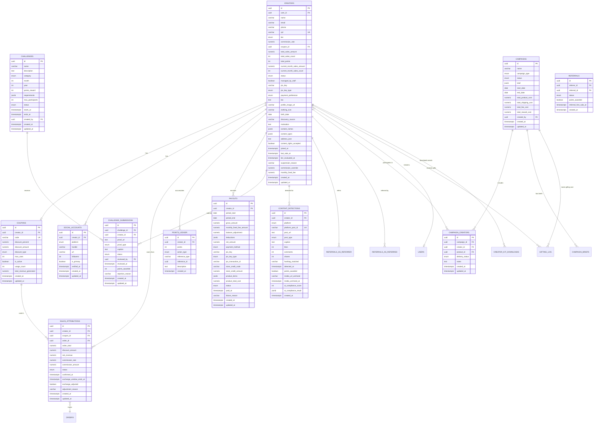

# Creators — Module Spec

> **STATUS: ACTIVE** — Reativado na Sessão 33. Inbazz contratado como provider externo coexistente (não substituto).
> Implementação: Tier 4 (após ERP, PLM, CRM, Mensageria).

> **Module:** Creators (Influencer Program — Nano to Mega)
> **Schema:** `creators`
> **Route prefix (portal):** `/api/v1/portal/creators`
> **Route prefix (admin):** `/api/v1/creators`
> **Route prefix (public):** `/api/v1/public/creators`
> **Admin UI route group:** `(admin)/creators/*`
> **Portal UI route group:** `(portal)/creators/*`
> **Public UI route:** `/creators/apply`
> **Version:** 1.2
> **Date:** March 2026 (revised)
> **Status:** Approved
> **Replaces:** Moneri (bridge first 60-90 days, then full migration), BixGrow (Shopify affiliate app)
> **References:** [DATABASE.md](../../architecture/DATABASE.md), [API.md](../../architecture/API.md), [AUTH.md](../../architecture/AUTH.md), [LGPD.md](../../platform/LGPD.md), [NOTIFICATIONS.md](../../platform/NOTIFICATIONS.md), [GLOSSARY.md](../../dev/GLOSSARY.md), [Checkout spec](../commerce/checkout.md), [CRM spec](./crm.md), [Trocas spec](../operations/trocas.md)

---

## 1. Purpose & Scope

The Creators module is the **influencer partnership engine** of Ambaril. It manages a tiered commission program where influencers (from nano 1k followers to mega/artists) promote CIENA products via personalized coupon codes and earn commission on attributed sales. The module owns creator onboarding (public form + white-glove), coupon management, sale attribution (coupon-only), commission calculation, multi-method payouts (PIX, store credit, products), a gamification layer (CIENA Points), monthly challenges, multi-platform social tracking (Instagram, TikTok, YouTube, Pinterest, Twitter), campaign ROI tracking, and comprehensive anti-fraud controls.

The program includes a massive **Ambassador** tier (tier 0) designed to scale to thousands of brand representatives with zero operational overhead. Ambassadors are not affiliates — they are _representatives of the movement_, earning exclusive discounts and recognition rather than commission. The promotion path from Ambassador to SEED (the first commissioned tier) is automated based on sales thresholds.

> **Portal copy guidelines:** All portal-facing copy uses belonging language ("voce faz parte", "nossa comunidade", "representante do movimento") rather than transactional language ("ganhe comissao", "programa de afiliados"). Ambassadors are referred to as "Representante CIENA" and the program is framed as "fazer parte do movimento" and "comunidade CIENA", never as "programa de afiliados".

This is the **most rule-heavy module** in Ambaril due to the intersection of financial calculations (commission, payouts), gamification (points, tiers, challenges), external API integration (Instagram Graph API, TikTok v1.1), fraud prevention (self-purchase blocking, monthly caps, coupon site monitoring), and dual interfaces (staff admin + creator portal).

**Core responsibilities:**

| Capability                                | Description                                                                                                                                                                                           |
| ----------------------------------------- | ----------------------------------------------------------------------------------------------------------------------------------------------------------------------------------------------------- |
| **5-tier system**                         | AMBASSADOR (0% commission, discount-only), SEED (8%), GROW (10%), BLOOM (12%), CORE (15%) — commission on net revenue after discount. Ambassador tier scales to thousands with zero operational cost. |
| **Coupon management**                     | Each creator receives a unique coupon code granting discount to the buyer                                                                                                                             |
| **Sale attribution (coupon-only)**        | Orders with a creator coupon are attributed to that creator. Links UTM are analytics-only (track which network/campaign works best), not for attribution. No cookie-based tracking.                   |
| **CIENA Points**                          | Gamification system rewarding sales, social engagement, challenge participation, referrals, and tier progression                                                                                      |
| **Monthly challenges**                    | Admin-curated challenges (drop, style, community, viral, surprise) with points rewards and proof submission                                                                                           |
| **Multi-method payouts**                  | PIX, store credit (Shopify coupon), or products. Monthly cycle (calculated day 10, paid by day 15) with R$ 50 minimum                                                                                 |
| **Multi-platform social tracking**        | Instagram Graph API polling + hashtag tracking (`#cienax{nome}{desconto}`). TikTok planned for v1.1                                                                                                   |
| **Campaign ROI tracking**                 | Each seeding/paid/gifting/reward campaign tracks costs (products, shipping, fees, rewards) and calculates ROI vs GMV generated                                                                        |
| **Anti-fraud controls**                   | Self-purchase CPF blocking, monthly R$ 3.000 revenue cap, coupon site monitoring, device fingerprint flagging                                                                                         |
| **Creator self-service portal (8 pages)** | Dashboard, coupons & links, sales, earnings, ranking, challenges, profile, products catalog                                                                                                           |
| **White-glove mode**                      | PM/admin manages everything on behalf of creators who never log in (artists, mega-influencers). Flag `managed_by_staff`                                                                               |
| **Public application form**               | 3-step form at `/creators/apply` (no auth): personal data, social networks, about. Includes content rights waiver                                                                                     |
| **Referral program**                      | Creators earn points for referring other creators who make their first confirmed sale                                                                                                                 |
| **Post-purchase creator invite**          | WA message after purchase inviting customers to apply as creators                                                                                                                                     |

**Primary users:**

- **Caio (PM):** Full management of creator program — approvals, challenges, payouts, analytics, **white-glove management for artists**
- **Marcus (Admin):** Full access, anti-fraud review, program configuration
- **Creators (external):** Self-service portal — dashboard, coupon sharing, challenge participation, payout tracking, ranking, product catalog
- **Staff-managed creators:** Artists/mega-influencers who never log in — PM performs all actions on their behalf
- **System (automated):** Tier evaluation, sale confirmation, payout calculation, social polling, hashtag tracking

**Out of scope:** This module does NOT handle the checkout coupon validation UX (owned by Checkout — Checkout calls Creators to validate coupon and check anti-fraud). It does NOT own the customer communication flow (owned by Mensageria). It does NOT manage ad spend or campaign performance (owned by Marketing). Creator contact records also exist in CRM for customer-facing purposes.

---

## 2. User Stories

### 2.1 Creator Stories

| #       | As a...                | I want to...                                                                    | So that...                                                      | Acceptance Criteria                                                                                                                                                                                                                                                                                                                                                                                                                                                                             |
| ------- | ---------------------- | ------------------------------------------------------------------------------- | --------------------------------------------------------------- | ----------------------------------------------------------------------------------------------------------------------------------------------------------------------------------------------------------------------------------------------------------------------------------------------------------------------------------------------------------------------------------------------------------------------------------------------------------------------------------------------- |
| US-01   | Prospective creator    | Register for the CIENA Creators program via the public 3-step form              | I can apply to become a brand partner                           | 3-step form at `/creators/apply`: (1) personal data (name, email, WhatsApp, CPF, city/state, birth date), (2) social networks (Instagram + TikTok required, YouTube/Pinterest/Twitter optional), (3) about (bio, motivation, niches, content types, clothing size, address, content rights waiver, terms). Creates `creators.creators` with `status=pending` + `creators.social_accounts` rows. WA confirmation "Recebemos sua solicitação! Avaliamos em até 48h." Instagram validated via API. |
| US-02   | Pending creator        | Receive notification when my application is approved                            | I know I can start promoting and earning                        | On admin approval: `status` changes to `active`, `tier` set to SEED, coupon auto-generated (format: `CREATOR_FIRSTNAME` uppercase), WhatsApp notification with coupon code and portal link                                                                                                                                                                                                                                                                                                      |
| US-03   | Active creator         | Share my personalized coupon link via WhatsApp and Instagram                    | My followers get a 10% discount and I earn commission           | Portal shows coupon code in large font with copy button; share buttons generate pre-formatted links for WhatsApp ("Use meu cupom JOAO e ganhe 10% de desconto na CIENA!") and Instagram (link in bio format); QR code generated for offline sharing                                                                                                                                                                                                                                             |
| US-04   | Active creator         | See my dashboard with sales, earnings, points, and tier progress                | I stay motivated and track my performance                       | Dashboard shows: tier badge with progress bar to next tier, total earnings this month (gross and confirmed), total CIENA Points, recent sales table (last 10), active challenges card with deadline countdown                                                                                                                                                                                                                                                                                   |
| US-05   | Active creator         | View my complete sales history with commission details                          | I can verify my earnings are accurate                           | Sales history table: date, order number, customer name (masked: "J*** S***"), order total, discount amount, net revenue, commission rate, commission amount, status (pending/confirmed/adjusted/cancelled)                                                                                                                                                                                                                                                                                      |
| US-06   | Active creator         | See when a sale is detected from my Instagram post                              | I know my content is being tracked and rewarded                 | Portal notification: "Detectamos seu post no Instagram! +50 CIENA Points"; Instagram posts section shows all detected posts with likes, comments, and points status                                                                                                                                                                                                                                                                                                                             |
| US-07   | Active creator         | Participate in a monthly challenge                                              | I can earn bonus points and engage with the brand community     | Challenges page shows active challenges with requirements, deadline, points reward; "Enviar prova" button opens submission form (proof URL, type, caption)                                                                                                                                                                                                                                                                                                                                      |
| US-08   | Active creator         | Submit proof for a challenge                                                    | I can claim my challenge completion points                      | Submission form: paste Instagram/TikTok URL, select proof type (instagram_post, instagram_story, tiktok, other), add optional caption; on submit creates `challenge_submissions` row with `status=pending`                                                                                                                                                                                                                                                                                      |
| US-09   | Active creator         | Receive notification when I reach a new tier                                    | I feel recognized for my growth as a creator                    | On tier upgrade: WhatsApp notification "Parabens! Voce subiu para o tier {TIER_NAME}! Sua nova comissao e {RATE}%"; portal shows celebratory banner; tier bonus points auto-credited                                                                                                                                                                                                                                                                                                            |
| US-10   | Active creator         | Check my payout history and current balance                                     | I know when I will be paid and how much                         | Payouts page: current unpaid balance card (gross amount, deductions, net amount), payout history table (period, gross, deductions, net, status, paid date, PIX transaction ID)                                                                                                                                                                                                                                                                                                                  |
| US-11   | Active creator         | Update my profile, social networks, and PIX key                                 | My info is always current                                       | Profile page: edit name, bio, social accounts (IG, TikTok, YouTube, Pinterest, Twitter), PIX key, PIX key type, clothing size, address, profile image, payment preference (PIX/store credit/product)                                                                                                                                                                                                                                                                                            |
| US-12   | Active creator         | Refer another creator to the program                                            | I earn bonus points when they make their first sale             | Referral link/code available in portal; when referred creator registers, referral tracked; when referred creator's first sale is confirmed, referrer earns +100 points                                                                                                                                                                                                                                                                                                                          |
| US-13   | Active creator         | Understand why my tier was downgraded                                           | I know what I need to do to regain my previous tier             | Downgrade notification includes: previous tier, new tier, new commission rate, reason ("Suas vendas confirmadas nos ultimos 90 dias ficaram abaixo do minimo para {PREVIOUS_TIER}"), requirements to regain tier                                                                                                                                                                                                                                                                                |
| US-14a  | Active creator         | See a ranking of top creators                                                   | I feel motivated to compete and climb the leaderboard           | Ranking page at `/portal/ranking`: top 20 creators by GMV this month, my position, tier distribution chart, "Creator do Mês" spotlight with badge + 500 bonus CIENA Points. Visible to all creators logged in (not public).                                                                                                                                                                                                                                                                     |
| US-14b  | Active creator         | Browse CIENA product catalog                                                    | I know which products to promote and see commission per product | Products page at `/portal/products`: browse catalog, mark favorites, see which products generate the most commission via creator coupons                                                                                                                                                                                                                                                                                                                                                        |
| US-14c  | Active creator         | Access pre-formatted share templates                                            | I can quickly share my coupon on WhatsApp and Instagram Stories | Share templates: pre-formatted WA message ("Usa meu cupom {CODE} e ganha {DISCOUNT}% off na @cienalab!"), IG Story template, QR code generator for offline sharing (events)                                                                                                                                                                                                                                                                                                                     |
| US-14d  | Active creator         | See content I posted that was detected by the system                            | I know my posts are being tracked and rewarded                  | Content Gallery in portal: feed of all detected posts (Instagram/TikTok) with likes, comments, points status, platform icon                                                                                                                                                                                                                                                                                                                                                                     |
| US-14e  | Active creator         | Download brand assets                                                           | I have professional materials for my content                    | Assets page: CIENA logos, product photos, content guidelines, brand kit for download                                                                                                                                                                                                                                                                                                                                                                                                            |
| US-NEW1 | Prospective ambassador | Apply via the public form and get auto-approved if I meet minimum criteria      | I can start sharing immediately                                 | Public form at `/creators/apply` with ambassador option. If IG follower count >= configurable threshold (default: 500), auto-approve with `tier=ambassador`, generate discount-only coupon, send WA welcome. No PM approval needed.                                                                                                                                                                                                                                                             |
| US-NEW2 | Active ambassador      | Share my discount code and climb the ranking without needing commission payouts | I feel part of the CIENA movement                               | Ambassador portal shows: personalized coupon (discount-only, no commission), ranking position, active challenges, Creator Kit access. No earnings page. Promotion banner: "Faltam X vendas confirmadas para subir para SEED e comecar a ganhar comissao!"                                                                                                                                                                                                                                       |
| US-NEW3 | Caio (PM)              | Send campaign briefs to targeted creators with guidelines and deadlines         | Content is aligned with brand strategy                          | Brief editor at `/creators/campaigns/:id/brief`: markdown editor, hashtag field, deadline picker, example upload (images/videos), creator/tier targeting. Creators see briefs in portal at `/portal/briefings`.                                                                                                                                                                                                                                                                                 |
| US-NEW4 | Caio (PM)              | Have the system suggest top creators for monthly gifting                        | I can reward performers without manual tracking                 | Monthly gifting suggestions screen: ranked list of creators by confirmed sales + points + challenge completions. Configure budget and product pool. Review and approve. Approved items trigger internal ERP order + WA notification.                                                                                                                                                                                                                                                            |
| US-NEW5 | Active creator         | Download brand assets (logos, photos, guidelines) from the portal               | I can create professional content                               | Materiais page at `/portal/materials`: grid of downloadable assets from DAM `creator_kit` collection, organized by category (Logos, Fotos, Guidelines). Filter by campaign or browse all. Downloads tracked.                                                                                                                                                                                                                                                                                    |

### 2.2 Admin Stories

| #       | As a...  | I want to...                                                                  | So that...                                                                         | Acceptance Criteria                                                                                                                                                                                                                                                                                                                                                                                                                    |
| ------- | -------- | ----------------------------------------------------------------------------- | ---------------------------------------------------------------------------------- | -------------------------------------------------------------------------------------------------------------------------------------------------------------------------------------------------------------------------------------------------------------------------------------------------------------------------------------------------------------------------------------------------------------------------------------- |
| US-14   | Admin/PM | Review and approve pending creator applications                               | I can onboard quality creators who fit the brand                                   | Creator list filtered by `status=pending`; detail view shows Instagram profile link, bio, follower count (if available); "Aprovar" button sets status=active, generates coupon, sends notification; "Rejeitar" button with reason field                                                                                                                                                                                                |
| US-15   | Admin/PM | Manage monthly challenges (create, edit, activate, complete)                  | I can keep the creator community engaged with fresh content challenges             | Challenge manager: list view of all challenges by month/year; create form (name, description, category, points reward, requirements JSONB, max participants, start/end dates); status transitions: draft -> active -> judging -> completed                                                                                                                                                                                             |
| US-16   | Admin/PM | Review challenge submissions and approve/reject                               | I can verify creators actually completed challenges                                | Submissions review queue: shows pending submissions grouped by challenge; each submission shows proof URL (embedded preview if Instagram), creator name, caption; "Aprovar" awards points, "Rejeitar" requires reason                                                                                                                                                                                                                  |
| US-17   | Admin/PM | Process monthly payouts (calculate, review, approve, process via PIX)         | Creators are paid accurately and on time                                           | Payout manager: "Calcular pagamentos" button runs calculation for previous month; review table shows each creator's gross/deductions/net; bulk approve; "Processar PIX" initiates payments; status tracking (calculating -> pending -> processing -> paid/failed)                                                                                                                                                                      |
| US-18   | Admin/PM | Monitor anti-fraud flags and take action                                      | I can protect the program from abuse                                               | Anti-fraud monitor: flagged creators list with flag type (cap_exceeded, coupon_site_detected, self_purchase_suspected, same_address, same_device); detail view with evidence; "Suspender" button with reason; "Liberar" button to clear flag                                                                                                                                                                                           |
| US-19   | Admin/PM | View creator analytics dashboard                                              | I can measure ROI and optimize the creator program                                 | Analytics: total GMV through creators (this month, last month, trend), top 10 performers (by sales count, by revenue, by points), CAC per creator, ROAS calculation, product mix chart (which products sell most through creator coupons), tier distribution pie chart                                                                                                                                                                 |
| US-20   | Admin    | Suspend a creator with reason                                                 | I can remove bad actors from the program                                           | "Suspender" sets `status=suspended`, stores `suspension_reason`; creator loses portal access; pending payouts are held; WhatsApp notification with reason sent                                                                                                                                                                                                                                                                         |
| US-21   | Admin    | Reactivate a suspended creator                                                | I can reinstate creators after investigation clears them                           | "Reativar" sets `status=active`; portal access restored; held payouts released to next cycle; WhatsApp notification sent                                                                                                                                                                                                                                                                                                               |
| US-22   | Admin/PM | Manually adjust a creator's points with a reason                              | I can correct errors or award special bonuses                                      | Points adjustment form: creator selector, points amount (+/-), reason text (required); creates `points_ledger` entry with `action_type=manual_adjustment`                                                                                                                                                                                                                                                                              |
| US-23   | Admin/PM | Create and manage a creator in white-glove mode                               | I can manage artists/mega-influencers who will never log in                        | Create creator via `/creators/new` (manual form, all fields including social accounts); flag `managed_by_staff=true`; PM can generate coupons, create UTM links, view dashboard, process payouts, edit profile — all on behalf of the creator. Creator does NOT receive "access your portal" emails.                                                                                                                                   |
| US-24   | Admin/PM | Generate UTM links for a creator                                              | I can track which social network or campaign drives the most traffic for a creator | Link generator in creator profile: select platform (IG, TikTok, YouTube, etc.) + campaign name → generates UTM link. UTM links are **analytics only** — they do NOT attribute sales. Only coupons attribute sales.                                                                                                                                                                                                                     |
| US-25   | Admin/PM | Create and track campaigns with ROI                                           | I can measure the return on investment of each seeding, paid, or gifting campaign  | Campaign types: seeding, paid, gifting, reward. Each campaign tracks: product cost, shipping cost, fee cost, reward cost. System calculates total_gmv (from creator coupons during campaign period) and ROI = (GMV - total_cost) / total_cost × 100. Campaign detail shows cost breakdown, GMV, ROI chart, per-creator performance, detected content, delivery status.                                                                 |
| US-26   | Admin/PM | Choose payment method for creator payout                                      | I can pay creators via PIX, store credit, or products                              | Payout method options: (1) PIX — transfer to creator's key, (2) store_credit — auto-generate Shopify coupon (e.g., `CREDIT-IGUIN-250`), (3) product — select products from catalog, mark as payout-via-product. Creator can indicate preference in portal, but PM has final decision.                                                                                                                                                  |
| US-27   | Admin/PM | Invite customers to become creators via post-purchase WA                      | I can recruit new creators from our customer base                                  | Post-purchase WA template sent after delivery: "Gostou? Seja creator CIENA e ganhe comissão indicando nossos produtos!" with link to `/creators/apply`. Triggered by Mensageria, configured in Creators settings.                                                                                                                                                                                                                      |
| US-CX01 | Admin/PM | Set a custom commission rate for a specific creator (override tier rate)      | I can negotiate individual deals with mega-influencers or special partnerships     | Creator detail page shows "Comissao personalizada" toggle. When enabled, input field for custom rate (0-50%). Overrides tier rate for all future sales. Shows warning: "Esta taxa sobrescreve a comissao do tier ({TIER_RATE}%)". Clear override button restores tier-based rate. **[CX01 — Inbazz B1]**                                                                                                                               |
| US-CX02 | Admin/PM | Configure a monthly fixed fee for a specific creator                          | I can compensate contracted influencers with a guaranteed monthly payment          | Creator detail page shows "Fee fixo mensal" field (R$). When > 0, fee is automatically included in monthly payout calculation. Fee is paid even if creator has zero sales. Fee appears as separate line item in payout breakdown. Included in campaign ROI calculation. **[CX02 — Inbazz B3]**                                                                                                                                         |
| US-CX03 | Admin/PM | Download archived media from detected creator posts (original quality)        | I can use creator content for paid ads and marketing materials                     | Content gallery in admin shows "Baixar Original" button for archived posts. Stories (which disappear after 24h on Instagram) are preserved permanently. Bulk download as ZIP for campaign content packages. Non-archived posts show platform URL with warning "Midia nao arquivada — pode ter expirado." **[CX03 — Inbazz C4, C5]**                                                                                                    |
| US-CX04 | Admin/PM | See AI compliance analysis for creator posts against campaign briefs          | I can quickly identify creators who are not following brand guidelines             | Content detection detail shows compliance score badge (green >= 80, yellow 50-79, red < 50). Expandable panel shows: matched dos, violated don'ts, missing requirements, AI recommendations. Filter content gallery by compliance score range. Dashboard shows compliance trend per campaign. **[CX04 — Inbazz C9, C10]**                                                                                                              |
| US-CX05 | Admin/PM | Publish a landing page for the creator program (pre-form)                     | I can attract and inform potential creators before they fill the application form  | Public page at `/creators` (distinct from `/creators/apply`). Shows: program benefits by tier, how it works (3 steps), testimonials/spotlights from existing creators, expected earnings calculator, CTA button "Quero ser Creator" linking to `/creators/apply`. Content configurable by tenant. **[CX06 — Inbazz A1]**                                                                                                               |
| US-CX06 | Admin/PM | Configure ranking visibility (show or hide GMV values of other creators)      | I can control competitive dynamics among creators                                  | Settings > Creators > "Visibilidade do Ranking": (1) Completa — posicao + nome + GMV, (2) Posicao apenas — posicao + nome, GMV oculto, (3) Anonimo — so posicao propria. Default: "Posicao apenas". Creator's own values always visible. **[CX07 — Inbazz D8]**                                                                                                                                                                        |
| US-CX07 | Admin/PM | View a geographic map of creators and sales by state                          | I can understand where my creators and their audiences are concentrated            | Analytics dashboard > new "Mapa" tab. Two visualizations: (1) "De onde sao seus creators" — choropleth map colored by creator count per state, (2) "De onde vem as vendas" — choropleth colored by GMV per state (from shipping address of attributed orders). Filter by period, tier, campaign. **[CX08 — Inbazz G4]**                                                                                                                |
| US-CX08 | Admin/PM | Create a campaign with a temporary leaderboard competition and prize          | I can run time-limited sales competitions among creators                           | Campaign creation form gains optional "Competicao" toggle. When enabled: leaderboard metric (sales count or GMV), prize description (text), winner count (top N). During campaign period, a temporary leaderboard shows ranking of participating creators by the selected metric. At campaign end, winners are highlighted and PM is notified to distribute prizes. **[CX14 — Inbazz E3]**                                             |
| US-CX09 | Admin/PM | Generate product vouchers for creator seeding (creator chooses piece on site) | I can let creators pick their own product instead of choosing for them             | Seeding flow gains "Voucher" option alongside direct product selection. Admin selects creators + voucher value (R$) → system generates single-use Shopify discount codes (one per creator, fixed amount, 30-day expiry) → creators receive WA with voucher code + link to shop. Voucher cost tracked as `campaign.total_product_cost`. Distinct from payout `store_credit` (this is seeding, not compensation). **[CX15 — Inbazz F5]** |
| US-CX10 | Admin/PM | Bulk-approve multiple pending creator applications                            | I can efficiently process a batch of applications at once                          | Pending creators list gains checkbox per row + "Aprovar selecionados" button at top. Selecting multiple pending creators and clicking approve: applies standard approval flow (R34) to each — sets active, generates coupon, creates user account, sends WA. Progress indicator shows: "Aprovando 12 de 15..." Errors for individual creators shown in summary. **[CX17 — Inbazz A9]**                                                 |

### 2.3 Competitive Gap Stories (Creator-facing)

| #       | As a...        | I want to...                                                                    | So that...                                                                                    | Acceptance Criteria                                                                                                                                                                                                                                                                                                                                                                                                                         |
| ------- | -------------- | ------------------------------------------------------------------------------- | --------------------------------------------------------------------------------------------- | ------------------------------------------------------------------------------------------------------------------------------------------------------------------------------------------------------------------------------------------------------------------------------------------------------------------------------------------------------------------------------------------------------------------------------------------- |
| US-CX11 | Active creator | Request a payout withdrawal when my balance meets the minimum                   | I don't have to wait for the monthly payout cycle — I can access my earnings when I need them | Earnings page shows "Solicitar Saque" button when: (1) tenant has `auto_payout_enabled = true` in settings, (2) creator's available balance >= R$ 50 minimum. On click: confirmation modal shows balance and estimated net after deductions. On confirm: creates payout record with `status=pending` for PM approval. PM receives Flare notification. Creator sees "Saque solicitado — aguardando aprovacao" status. **[CX09 — Inbazz H7]** |
| US-CX12 | Active creator | See which products sell most through my coupon                                  | I can focus my content on the products my audience loves                                      | Portal dashboard gains "Seus produtos mais vendidos" card showing top 5 products by quantity sold via creator's coupon. Each product shows: product name, image thumbnail, units sold, total revenue generated. Admin creator detail page also shows "Produtos mais vendidos por este creator" section. **[CX12 — Inbazz G7, H4]**                                                                                                          |
| US-CX13 | Active creator | Choose between receiving individual sale notifications or a daily batch summary | I can control notification volume without missing important updates                           | Profile > Notificacoes section: (1) "Individual" — WA notification per sale (current default), (2) "Resumo diario" — single WA at 09:00 BRT with yesterday's sales summary (count, total commission, top product). Setting stored per creator. Batch job `creators:daily-notification-batch` processes at 09:00 BRT for creators with batch preference. **[CX16 — Inbazz H8]**                                                              |

---

## 3. Data Model

### 3.1 Entity Relationship Diagram



### 3.2 Enums

```sql
CREATE TYPE creators.creator_tier AS ENUM ('ambassador', 'seed', 'grow', 'bloom', 'core');
CREATE TYPE creators.creator_status AS ENUM ('pending', 'active', 'suspended', 'inactive');
CREATE TYPE creators.discount_type AS ENUM ('percent', 'fixed');
CREATE TYPE creators.pix_key_type AS ENUM ('cpf', 'email', 'phone', 'random');
CREATE TYPE creators.payment_method AS ENUM ('pix', 'store_credit', 'product');
CREATE TYPE creators.payment_preference AS ENUM ('pix', 'store_credit', 'product');
CREATE TYPE creators.attribution_status AS ENUM ('pending', 'confirmed', 'adjusted', 'cancelled');
CREATE TYPE creators.points_action AS ENUM (
    'sale', 'post_detected', 'challenge_completed', 'referral',
    'engagement', 'manual_adjustment', 'tier_bonus', 'hashtag_detected',
    'creator_of_month', 'product_redemption'
);
CREATE TYPE creators.challenge_category AS ENUM ('drop', 'style', 'community', 'viral', 'surprise');
CREATE TYPE creators.challenge_status AS ENUM ('draft', 'active', 'judging', 'completed', 'cancelled');
CREATE TYPE creators.submission_status AS ENUM ('pending', 'approved', 'rejected');
CREATE TYPE creators.proof_type AS ENUM ('instagram_post', 'instagram_story', 'tiktok', 'youtube', 'other');
CREATE TYPE creators.payout_status AS ENUM ('calculating', 'pending', 'processing', 'paid', 'failed');
CREATE TYPE creators.referral_status AS ENUM ('pending', 'active', 'expired');
CREATE TYPE creators.social_platform AS ENUM ('instagram', 'tiktok', 'youtube', 'pinterest', 'twitter', 'other');
CREATE TYPE creators.content_post_type AS ENUM ('image', 'video', 'carousel', 'story', 'reel', 'short');
CREATE TYPE creators.campaign_type AS ENUM ('seeding', 'paid', 'gifting', 'reward');
CREATE TYPE creators.campaign_status AS ENUM ('draft', 'active', 'completed', 'cancelled');
CREATE TYPE creators.delivery_status AS ENUM ('pending', 'shipped', 'delivered', 'content_posted');
CREATE TYPE creators.taxpayer_type AS ENUM ('pf', 'mei', 'pj');
CREATE TYPE creators.fiscal_doc_type AS ENUM ('rpa', 'nfse', 'none');
```

---

### 3.3 Database Schema (Full Column Reference)

All tables live in the `creators` PostgreSQL schema. Full column definitions are in [DATABASE.md](../../architecture/DATABASE.md) section 4.x. Below is the **complete reference** with all columns, types, and constraints.

#### 3.3.1 creators.creators

| Column                     | Type                        | Constraints                   | Description                                                                                                                                                                                       |
| -------------------------- | --------------------------- | ----------------------------- | ------------------------------------------------------------------------------------------------------------------------------------------------------------------------------------------------- |
| id                         | UUID                        | PK, DEFAULT gen_random_uuid() | UUID v7                                                                                                                                                                                           |
| user_id                    | UUID                        | NULL, FK global.users(id)     | Linked platform user account (created on approval). NULL for managed_by_staff creators.                                                                                                           |
| name                       | VARCHAR(255)                | NOT NULL                      | Full name                                                                                                                                                                                         |
| email                      | VARCHAR(255)                | NOT NULL                      | Contact email                                                                                                                                                                                     |
| phone                      | VARCHAR(20)                 | NOT NULL                      | Brazilian format: +5511999999999                                                                                                                                                                  |
| cpf                        | VARCHAR(11)                 | NOT NULL, UNIQUE              | Brazilian tax ID (digits only, no formatting)                                                                                                                                                     |
| tier                       | creators.creator_tier       | NOT NULL DEFAULT 'ambassador' | Current tier: ambassador, seed, grow, bloom, core                                                                                                                                                 |
| commission_rate            | NUMERIC(4,2)                | NOT NULL DEFAULT 0.00         | Current commission percentage (mirrors tier). Ambassador = 0%.                                                                                                                                    |
| coupon_id                  | UUID                        | NULL, FK creators.coupons(id) | Active coupon for this creator                                                                                                                                                                    |
| total_sales_amount         | NUMERIC(12,2)               | NOT NULL DEFAULT 0            | Denormalized: lifetime confirmed net revenue                                                                                                                                                      |
| total_sales_count          | INTEGER                     | NOT NULL DEFAULT 0            | Denormalized: lifetime confirmed sale count                                                                                                                                                       |
| total_points               | INTEGER                     | NOT NULL DEFAULT 0            | Denormalized: lifetime accumulated CIENA Points                                                                                                                                                   |
| current_month_sales_amount | NUMERIC(12,2)               | NOT NULL DEFAULT 0            | Denormalized: current month net revenue (reset day 1)                                                                                                                                             |
| current_month_sales_count  | INTEGER                     | NOT NULL DEFAULT 0            | Denormalized: current month confirmed sales (reset day 1)                                                                                                                                         |
| status                     | creators.creator_status     | NOT NULL DEFAULT 'pending'    | pending, active, suspended, inactive                                                                                                                                                              |
| managed_by_staff           | BOOLEAN                     | NOT NULL DEFAULT FALSE        | White-glove mode: PM/admin manages everything for this creator. Creator never logs in (artists, mega-influencers).                                                                                |
| pix_key                    | VARCHAR(255)                | NULL                          | PIX key for payouts                                                                                                                                                                               |
| pix_key_type               | creators.pix_key_type       | NULL                          | Type of PIX key: cpf, email, phone, random                                                                                                                                                        |
| payment_preference         | creators.payment_preference | NULL                          | Creator's preferred payment method (PM has final say)                                                                                                                                             |
| bio                        | TEXT                        | NULL                          | Creator bio / description                                                                                                                                                                         |
| profile_image_url          | VARCHAR(500)                | NULL                          | URL to profile image                                                                                                                                                                              |
| clothing_size              | VARCHAR(5)                  | NULL                          | PP, P, M, G, GG — for product seeding                                                                                                                                                             |
| birth_date                 | DATE                        | NULL                          | Creator's date of birth                                                                                                                                                                           |
| discovery_source           | VARCHAR(100)                | NULL                          | How creator discovered CIENA (Instagram, TikTok, amigo, evento, outro)                                                                                                                            |
| motivation                 | TEXT                        | NULL                          | "Por que quer representar a CIENA?" (from application form)                                                                                                                                       |
| content_niches             | JSONB                       | NULL                          | Selected niches: ["streetwear", "lifestyle", "musica", ...]                                                                                                                                       |
| content_types              | JSONB                       | NULL                          | Preferred content types: ["reels", "stories", "tiktok", ...]                                                                                                                                      |
| address                    | JSONB                       | NULL                          | Full address: { street, number, complement, neighborhood, city, state, zip }                                                                                                                      |
| content_rights_accepted    | BOOLEAN                     | NOT NULL DEFAULT FALSE        | Whether creator accepted content rights waiver at registration                                                                                                                                    |
| joined_at                  | TIMESTAMPTZ                 | NULL                          | Timestamp when status changed to active                                                                                                                                                           |
| last_sale_at               | TIMESTAMPTZ                 | NULL                          | Timestamp of most recent attributed sale                                                                                                                                                          |
| tier_evaluated_at          | TIMESTAMPTZ                 | NULL                          | Timestamp of last tier evaluation                                                                                                                                                                 |
| suspension_reason          | VARCHAR(500)                | NULL                          | Reason for suspension (if status = suspended)                                                                                                                                                     |
| commission_override        | NUMERIC(5,2)                | NULL                          | Custom commission rate for this specific creator. If NOT NULL, overrides the tier-based `commission_rate`. Used for mega-influencer deals or special agreements. NULL = use tier rate. **[CX01]** |
| monthly_fixed_fee          | NUMERIC(12,2)               | NULL                          | Monthly fixed fee paid to this creator regardless of sales (e.g., R$ 500/month for contracted influencers). NULL = no fixed fee. Included in payout calculation and campaign ROI. **[CX02]**      |
| created_at                 | TIMESTAMPTZ                 | NOT NULL DEFAULT NOW()        |                                                                                                                                                                                                   |
| updated_at                 | TIMESTAMPTZ                 | NOT NULL DEFAULT NOW()        |                                                                                                                                                                                                   |

**Indexes:**

```sql
CREATE UNIQUE INDEX idx_creators_cpf ON creators.creators (cpf);
CREATE INDEX idx_creators_status ON creators.creators (status);
CREATE INDEX idx_creators_tier ON creators.creators (tier);
CREATE INDEX idx_creators_user_id ON creators.creators (user_id) WHERE user_id IS NOT NULL;
CREATE INDEX idx_creators_total_sales ON creators.creators (total_sales_count DESC);
CREATE INDEX idx_creators_total_points ON creators.creators (total_points DESC);
CREATE INDEX idx_creators_current_month_sales ON creators.creators (current_month_sales_amount DESC);
CREATE INDEX idx_creators_managed ON creators.creators (managed_by_staff) WHERE managed_by_staff = TRUE;
CREATE INDEX idx_creators_commission_override ON creators.creators (commission_override) WHERE commission_override IS NOT NULL;
CREATE INDEX idx_creators_monthly_fee ON creators.creators (monthly_fixed_fee) WHERE monthly_fixed_fee IS NOT NULL;
```

#### 3.3.2 creators.coupons

| Column                  | Type                   | Constraints                        | Description                                                         |
| ----------------------- | ---------------------- | ---------------------------------- | ------------------------------------------------------------------- |
| id                      | UUID                   | PK, DEFAULT gen_random_uuid()      |                                                                     |
| creator_id              | UUID                   | NOT NULL, FK creators.creators(id) | Owning creator                                                      |
| code                    | VARCHAR(50)            | NOT NULL, UNIQUE                   | Uppercase coupon code (e.g., JOAO, IGUIN10)                         |
| discount_percent        | NUMERIC(4,2)           | NULL                               | Discount percentage given to buyer (when discount_type = 'percent') |
| discount_amount         | NUMERIC(12,2)          | NULL                               | Fixed discount amount (when discount_type = 'fixed')                |
| discount_type           | creators.discount_type | NOT NULL DEFAULT 'percent'         | percent or fixed                                                    |
| max_uses                | INTEGER                | NULL                               | NULL = unlimited uses                                               |
| is_active               | BOOLEAN                | NOT NULL DEFAULT TRUE              | Whether coupon can be used                                          |
| usage_count             | INTEGER                | NOT NULL DEFAULT 0                 | Denormalized: number of times used                                  |
| total_revenue_generated | NUMERIC(12,2)          | NOT NULL DEFAULT 0                 | Denormalized: total order revenue via this coupon                   |
| created_at              | TIMESTAMPTZ            | NOT NULL DEFAULT NOW()             |                                                                     |
| updated_at              | TIMESTAMPTZ            | NOT NULL DEFAULT NOW()             |                                                                     |

**Indexes:**

```sql
CREATE UNIQUE INDEX idx_coupons_code ON creators.coupons (code);
CREATE INDEX idx_coupons_creator ON creators.coupons (creator_id);
CREATE INDEX idx_coupons_active ON creators.coupons (is_active) WHERE is_active = TRUE;
```

#### 3.3.3 creators.sales_attributions

| Column                  | Type                        | Constraints                        | Description                                   |
| ----------------------- | --------------------------- | ---------------------------------- | --------------------------------------------- |
| id                      | UUID                        | PK, DEFAULT gen_random_uuid()      |                                               |
| creator_id              | UUID                        | NOT NULL, FK creators.creators(id) | Attributed creator                            |
| coupon_id               | UUID                        | NOT NULL, FK creators.coupons(id)  | Coupon used in the order                      |
| order_id                | UUID                        | NOT NULL, FK checkout.orders(id)   | The Checkout order                            |
| order_total             | NUMERIC(12,2)               | NOT NULL                           | Original order total before discount          |
| discount_amount         | NUMERIC(12,2)               | NOT NULL                           | Discount applied via creator coupon           |
| net_revenue             | NUMERIC(12,2)               | NOT NULL                           | order_total - discount_amount                 |
| commission_rate         | NUMERIC(4,2)                | NOT NULL                           | Creator's commission rate at time of sale     |
| commission_amount       | NUMERIC(12,2)               | NOT NULL                           | net_revenue \* commission_rate / 100          |
| status                  | creators.attribution_status | NOT NULL DEFAULT 'pending'         | pending, confirmed, adjusted, cancelled       |
| confirmed_at            | TIMESTAMPTZ                 | NULL                               | When status changed to confirmed              |
| exchange_window_ends_at | TIMESTAMPTZ                 | NOT NULL                           | order.created_at + 7 days                     |
| exchange_adjusted       | BOOLEAN                     | NOT NULL DEFAULT FALSE             | Whether an exchange affected this attribution |
| adjustment_reason       | VARCHAR(500)                | NULL                               | Reason for adjustment (if exchange_adjusted)  |
| created_at              | TIMESTAMPTZ                 | NOT NULL DEFAULT NOW()             |                                               |
| updated_at              | TIMESTAMPTZ                 | NOT NULL DEFAULT NOW()             |                                               |

**Indexes:**

```sql
CREATE UNIQUE INDEX idx_attributions_order ON creators.sales_attributions (order_id);
CREATE INDEX idx_attributions_creator ON creators.sales_attributions (creator_id);
CREATE INDEX idx_attributions_status ON creators.sales_attributions (status);
CREATE INDEX idx_attributions_pending_window ON creators.sales_attributions (exchange_window_ends_at)
    WHERE status = 'pending';
CREATE INDEX idx_attributions_creator_month ON creators.sales_attributions (creator_id, created_at DESC);
```

#### 3.3.4 creators.points_ledger

| Column         | Type                   | Constraints                        | Description                                                                                     |
| -------------- | ---------------------- | ---------------------------------- | ----------------------------------------------------------------------------------------------- |
| id             | UUID                   | PK, DEFAULT gen_random_uuid()      |                                                                                                 |
| creator_id     | UUID                   | NOT NULL, FK creators.creators(id) |                                                                                                 |
| points         | INTEGER                | NOT NULL                           | Points earned (positive) or deducted (negative)                                                 |
| action_type    | creators.points_action | NOT NULL                           | sale, post_detected, challenge_completed, referral, engagement, manual_adjustment, tier_bonus   |
| reference_type | VARCHAR(100)           | NULL                               | Type of referenced entity (e.g., 'sales_attribution', 'challenge_submission', 'instagram_post') |
| reference_id   | UUID                   | NULL                               | ID of the referenced entity                                                                     |
| description    | TEXT                   | NOT NULL                           | Human-readable description of the points action                                                 |
| created_at     | TIMESTAMPTZ            | NOT NULL DEFAULT NOW()             | Immutable — append-only ledger                                                                  |

> **Append-only:** This table is an immutable ledger. Points are never updated or deleted. The current balance for a creator is derived from `SUM(points) WHERE creator_id = ?`. The denormalized `creators.total_points` is kept in sync by the application layer.

**Indexes:**

```sql
CREATE INDEX idx_points_creator ON creators.points_ledger (creator_id);
CREATE INDEX idx_points_action ON creators.points_ledger (action_type);
CREATE INDEX idx_points_reference ON creators.points_ledger (reference_type, reference_id);
CREATE INDEX idx_points_created ON creators.points_ledger (created_at DESC);
```

#### 3.3.5 creators.challenges

| Column           | Type                        | Constraints                                        | Description                                  |
| ---------------- | --------------------------- | -------------------------------------------------- | -------------------------------------------- |
| id               | UUID                        | PK, DEFAULT gen_random_uuid()                      |                                              |
| name             | VARCHAR(255)                | NOT NULL                                           | Challenge display name                       |
| description      | TEXT                        | NOT NULL                                           | Full challenge description and rules         |
| category         | creators.challenge_category | NOT NULL                                           | drop, style, community, viral, surprise      |
| month            | INTEGER                     | NOT NULL, CHECK (month BETWEEN 1 AND 12)           | Month this challenge belongs to              |
| year             | INTEGER                     | NOT NULL, CHECK (year >= 2026)                     | Year this challenge belongs to               |
| points_reward    | INTEGER                     | NOT NULL, CHECK (points_reward BETWEEN 50 AND 500) | Points awarded on completion                 |
| requirements     | JSONB                       | NOT NULL                                           | Structured requirements (see section 3.5.1)  |
| max_participants | INTEGER                     | NULL                                               | NULL = unlimited                             |
| status           | creators.challenge_status   | NOT NULL DEFAULT 'draft'                           | draft, active, judging, completed, cancelled |
| starts_at        | TIMESTAMPTZ                 | NOT NULL                                           | Challenge start timestamp                    |
| ends_at          | TIMESTAMPTZ                 | NOT NULL                                           | Challenge deadline timestamp                 |
| created_by       | UUID                        | NOT NULL, FK global.users(id)                      | Admin/PM who created the challenge           |
| created_at       | TIMESTAMPTZ                 | NOT NULL DEFAULT NOW()                             |                                              |
| updated_at       | TIMESTAMPTZ                 | NOT NULL DEFAULT NOW()                             |                                              |

**Challenge Requirements JSONB Structure:**

```json
{
  "type": "instagram_post",
  "description": "Poste uma foto usando uma peca do Drop 10 com a tag @cienalab",
  "rules": [
    "Foto deve mostrar a peca claramente",
    "Deve marcar @cienalab na foto (nao apenas na legenda)",
    "Post deve permanecer ativo por pelo menos 7 dias"
  ],
  "hashtags_required": ["#cienalab", "#drop10"],
  "minimum_likes": 50,
  "proof_type": "instagram_post"
}
```

**Indexes:**

```sql
CREATE INDEX idx_challenges_status ON creators.challenges (status);
CREATE INDEX idx_challenges_month_year ON creators.challenges (year, month);
CREATE INDEX idx_challenges_active ON creators.challenges (starts_at, ends_at) WHERE status = 'active';
```

#### 3.3.6 creators.challenge_submissions

| Column           | Type                       | Constraints                          | Description                                                           |
| ---------------- | -------------------------- | ------------------------------------ | --------------------------------------------------------------------- |
| id               | UUID                       | PK, DEFAULT gen_random_uuid()        |                                                                       |
| challenge_id     | UUID                       | NOT NULL, FK creators.challenges(id) |                                                                       |
| creator_id       | UUID                       | NOT NULL, FK creators.creators(id)   |                                                                       |
| proof_url        | TEXT                       | NOT NULL                             | URL to proof (Instagram post, TikTok, etc.)                           |
| proof_type       | creators.proof_type        | NOT NULL                             | instagram_post, instagram_story, tiktok, other                        |
| caption          | TEXT                       | NULL                                 | Optional caption / note from creator                                  |
| status           | creators.submission_status | NOT NULL DEFAULT 'pending'           | pending, approved, rejected                                           |
| reviewed_by      | UUID                       | NULL, FK global.users(id)            | Admin/PM who reviewed                                                 |
| reviewed_at      | TIMESTAMPTZ                | NULL                                 | When the review happened                                              |
| points_awarded   | INTEGER                    | NULL                                 | Points actually awarded (may differ from challenge default for bonus) |
| rejection_reason | VARCHAR(500)               | NULL                                 | Reason for rejection                                                  |
| created_at       | TIMESTAMPTZ                | NOT NULL DEFAULT NOW()               |                                                                       |
| updated_at       | TIMESTAMPTZ                | NOT NULL DEFAULT NOW()               |                                                                       |

**Indexes:**

```sql
CREATE UNIQUE INDEX idx_submissions_unique ON creators.challenge_submissions (challenge_id, creator_id);
CREATE INDEX idx_submissions_challenge ON creators.challenge_submissions (challenge_id);
CREATE INDEX idx_submissions_creator ON creators.challenge_submissions (creator_id);
CREATE INDEX idx_submissions_status ON creators.challenge_submissions (status) WHERE status = 'pending';
```

#### 3.3.7 creators.payouts

| Column                   | Type                     | Constraints                        | Description                                                                                                                        |
| ------------------------ | ------------------------ | ---------------------------------- | ---------------------------------------------------------------------------------------------------------------------------------- |
| id                       | UUID                     | PK, DEFAULT gen_random_uuid()      |                                                                                                                                    |
| creator_id               | UUID                     | NOT NULL, FK creators.creators(id) |                                                                                                                                    |
| period_start             | DATE                     | NOT NULL                           | Start of payout period (1st of previous month)                                                                                     |
| period_end               | DATE                     | NOT NULL                           | End of payout period (last day of previous month)                                                                                  |
| gross_amount             | NUMERIC(12,2)            | NOT NULL                           | Total confirmed commission for the period + monthly_fixed_fee_amount                                                               |
| monthly_fixed_fee_amount | NUMERIC(12,2)            | NOT NULL DEFAULT 0                 | Fixed monthly fee included in this payout (from `creators.monthly_fixed_fee`). Included in gross_amount. **[CX02]**                |
| balance_adjustment       | NUMERIC(12,2)            | NOT NULL DEFAULT 0                 | Negative balance carry-over from post-confirmation cancellations. Subtracted from gross. Negative value = creator owes. **[CX19]** |
| deductions               | JSONB                    | NULL                               | Any deductions: `{ "reason": "...", "amount": 0.00 }[]`                                                                            |
| net_amount               | NUMERIC(12,2)            | NOT NULL                           | gross_amount + balance_adjustment - irrf_withheld - iss_withheld - sum(deductions)                                                 |
| irrf_withheld            | NUMERIC(12,2)            | NOT NULL DEFAULT 0                 | IRRF amount withheld (for PF/MEI above threshold)                                                                                  |
| iss_withheld             | NUMERIC(12,2)            | NOT NULL DEFAULT 0                 | ISS amount withheld                                                                                                                |
| fiscal_doc_type          | creators.fiscal_doc_type | NOT NULL DEFAULT 'none'            | rpa, nfse, or none                                                                                                                 |
| fiscal_doc_id            | VARCHAR(255)             | NULL                               | RPA number or NF-e key                                                                                                             |
| fiscal_doc_verified      | BOOLEAN                  | NOT NULL DEFAULT FALSE             | Whether fiscal document was verified                                                                                               |
| payment_method           | creators.payment_method  | NOT NULL DEFAULT 'pix'             | pix, store_credit, or product                                                                                                      |
| pix_key                  | VARCHAR(255)             | NULL                               | PIX key snapshot (only if payment_method = 'pix')                                                                                  |
| pix_key_type             | creators.pix_key_type    | NULL                               | PIX key type snapshot                                                                                                              |
| pix_transaction_id       | VARCHAR(255)             | NULL                               | PIX transaction reference (only if payment_method = 'pix')                                                                         |
| store_credit_code        | VARCHAR(100)             | NULL                               | Generated Shopify coupon code (only if payment_method = 'store_credit')                                                            |
| store_credit_amount      | NUMERIC(12,2)            | NULL                               | Store credit value                                                                                                                 |
| product_items            | JSONB                    | NULL                               | Products given as payment: `[{ product_id, variant_id, name, qty, cost }]` (only if payment_method = 'product')                    |
| product_total_cost       | NUMERIC(12,2)            | NULL                               | Total cost of products given                                                                                                       |
| status                   | creators.payout_status   | NOT NULL DEFAULT 'calculating'     | calculating, pending, processing, paid, failed                                                                                     |
| paid_at                  | TIMESTAMPTZ              | NULL                               | When payment was actually processed                                                                                                |
| failure_reason           | VARCHAR(500)             | NULL                               | Reason if status = failed                                                                                                          |
| created_at               | TIMESTAMPTZ              | NOT NULL DEFAULT NOW()             |                                                                                                                                    |
| updated_at               | TIMESTAMPTZ              | NOT NULL DEFAULT NOW()             |                                                                                                                                    |

**Indexes:**

```sql
CREATE INDEX idx_payouts_creator ON creators.payouts (creator_id);
CREATE INDEX idx_payouts_status ON creators.payouts (status);
CREATE INDEX idx_payouts_period ON creators.payouts (period_start, period_end);
CREATE INDEX idx_payouts_method ON creators.payouts (payment_method);
CREATE UNIQUE INDEX idx_payouts_creator_period ON creators.payouts (creator_id, period_start, period_end);
```

#### 3.3.7b creators.tax_profiles

| Column            | Type                   | Constraints                                | Description                                   |
| ----------------- | ---------------------- | ------------------------------------------ | --------------------------------------------- |
| id                | UUID                   | PK, DEFAULT gen_random_uuid()              |                                               |
| creator_id        | UUID                   | NOT NULL, UNIQUE, FK creators.creators(id) | One tax profile per creator                   |
| taxpayer_type     | creators.taxpayer_type | NOT NULL DEFAULT 'pf'                      | pf (CPF), mei (MEI), pj (CNPJ)                |
| cpf               | VARCHAR(14)            | NOT NULL                                   | Brazilian CPF (same as creators.creators.cpf) |
| cnpj              | VARCHAR(18)            | NULL                                       | CNPJ for MEI or PJ creators                   |
| mei_active        | BOOLEAN                | NULL                                       | Last MEI validation result                    |
| mei_validated_at  | TIMESTAMPTZ            | NULL                                       | Last MEI validation timestamp                 |
| municipality_code | VARCHAR(10)            | NULL                                       | IBGE municipality code for ISS                |
| municipality_name | VARCHAR(255)           | NULL                                       | Municipality name                             |
| iss_rate          | NUMERIC(5,2)           | NULL                                       | ISS rate for this municipality (2-5%)         |
| has_nf_capability | BOOLEAN                | NOT NULL DEFAULT FALSE                     | Whether creator can issue NF-e de servico     |
| created_at        | TIMESTAMPTZ            | NOT NULL DEFAULT NOW()                     |                                               |
| updated_at        | TIMESTAMPTZ            | NOT NULL DEFAULT NOW()                     |                                               |

**Indexes:**

```sql
CREATE UNIQUE INDEX idx_tax_profiles_creator ON creators.tax_profiles (creator_id);
CREATE INDEX idx_tax_profiles_type ON creators.tax_profiles (taxpayer_type);
CREATE INDEX idx_tax_profiles_cnpj ON creators.tax_profiles (cnpj) WHERE cnpj IS NOT NULL;
```

#### 3.3.8 creators.referrals

| Column                 | Type                     | Constraints                        | Description                                               |
| ---------------------- | ------------------------ | ---------------------------------- | --------------------------------------------------------- |
| id                     | UUID                     | PK, DEFAULT gen_random_uuid()      |                                                           |
| referrer_id            | UUID                     | NOT NULL, FK creators.creators(id) | Creator who made the referral                             |
| referred_id            | UUID                     | NOT NULL, FK creators.creators(id) | Creator who was referred                                  |
| status                 | creators.referral_status | NOT NULL DEFAULT 'pending'         | pending, active, expired                                  |
| points_awarded         | BOOLEAN                  | NOT NULL DEFAULT FALSE             | Whether referrer received +100 points                     |
| referred_first_sale_at | TIMESTAMPTZ              | NULL                               | When the referred creator made their first confirmed sale |
| created_at             | TIMESTAMPTZ              | NOT NULL DEFAULT NOW()             |                                                           |

**Indexes:**

```sql
CREATE UNIQUE INDEX idx_referrals_pair ON creators.referrals (referrer_id, referred_id);
CREATE INDEX idx_referrals_referrer ON creators.referrals (referrer_id);
CREATE INDEX idx_referrals_referred ON creators.referrals (referred_id);
CREATE INDEX idx_referrals_pending ON creators.referrals (status) WHERE status = 'pending';
```

#### 3.3.9 creators.content_detections

Replaces the previous `instagram_posts` table. Now supports multi-platform detection (Instagram, TikTok, YouTube, etc.) and hashtag tracking.

| Column               | Type                       | Constraints                        | Description                                                                                                                                                                     |
| -------------------- | -------------------------- | ---------------------------------- | ------------------------------------------------------------------------------------------------------------------------------------------------------------------------------- |
| id                   | UUID                       | PK, DEFAULT gen_random_uuid()      |                                                                                                                                                                                 |
| creator_id           | UUID                       | NOT NULL, FK creators.creators(id) | Matched creator                                                                                                                                                                 |
| platform             | creators.social_platform   | NOT NULL                           | instagram, tiktok, youtube, etc.                                                                                                                                                |
| platform_post_id     | VARCHAR(200)               | NOT NULL, UNIQUE                   | Platform-native post ID (deduplication key)                                                                                                                                     |
| post_url             | TEXT                       | NOT NULL                           | Full URL to the post                                                                                                                                                            |
| post_type            | creators.content_post_type | NOT NULL                           | image, video, carousel, story, reel, short                                                                                                                                      |
| caption              | TEXT                       | NULL                               | Post caption text                                                                                                                                                               |
| likes                | INTEGER                    | NOT NULL DEFAULT 0                 | Like count at detection time                                                                                                                                                    |
| comments             | INTEGER                    | NOT NULL DEFAULT 0                 | Comment count at detection time                                                                                                                                                 |
| shares               | INTEGER                    | NOT NULL DEFAULT 0                 | Share/repost count at detection time                                                                                                                                            |
| hashtag_matched      | VARCHAR(100)               | NULL                               | Which hashtag triggered detection (e.g., `#cienaxiguin10`). NULL if detected via @mention/tag.                                                                                  |
| detected_at          | TIMESTAMPTZ                | NOT NULL                           | When the system first detected this post                                                                                                                                        |
| points_awarded       | BOOLEAN                    | NOT NULL DEFAULT FALSE             | Whether points have been credited                                                                                                                                               |
| media_url_archived   | VARCHAR(500)               | NULL                               | R2 URL of archived media file (original quality). NULL until `creators:archive-media` job completes download. Especially critical for stories (24h TTL on platform). **[CX03]** |
| media_archived_at    | TIMESTAMPTZ                | NULL                               | When media was successfully archived to R2. NULL if not yet archived or archival failed. **[CX03]**                                                                             |
| ai_compliance_score  | INTEGER                    | NULL                               | AI-generated compliance score (0-100) comparing post content against campaign brief dos/donts. NULL if no campaign brief or analysis not yet run. **[CX04]**                    |
| ai_compliance_result | JSONB                      | NULL                               | Structured AI analysis result: `{ score, matched_dos: [], violated_donts: [], recommendations: [], analyzed_at }`. **[CX04]**                                                   |
| created_at           | TIMESTAMPTZ                | NOT NULL DEFAULT NOW()             |                                                                                                                                                                                 |

**Indexes:**

```sql
CREATE UNIQUE INDEX idx_content_detections_platform_id ON creators.content_detections (platform_post_id);
CREATE INDEX idx_content_detections_creator ON creators.content_detections (creator_id);
CREATE INDEX idx_content_detections_platform ON creators.content_detections (platform);
CREATE INDEX idx_content_detections_detected ON creators.content_detections (detected_at DESC);
CREATE INDEX idx_content_detections_hashtag ON creators.content_detections (hashtag_matched) WHERE hashtag_matched IS NOT NULL;
CREATE INDEX idx_content_detections_unarchived ON creators.content_detections (detected_at DESC) WHERE media_url_archived IS NULL;
CREATE INDEX idx_content_detections_compliance ON creators.content_detections (ai_compliance_score) WHERE ai_compliance_score IS NOT NULL;
```

#### 3.3.10 creators.social_accounts

Multi-platform social network profiles for each creator. Replaces the previous `instagram_handle` column on `creators.creators`.

| Column      | Type                     | Constraints                        | Description                                           |
| ----------- | ------------------------ | ---------------------------------- | ----------------------------------------------------- |
| id          | UUID                     | PK, DEFAULT gen_random_uuid()      |                                                       |
| creator_id  | UUID                     | NOT NULL, FK creators.creators(id) |                                                       |
| platform    | creators.social_platform | NOT NULL                           | instagram, tiktok, youtube, pinterest, twitter, other |
| handle      | VARCHAR(100)             | NOT NULL                           | @username (without @) or channel URL for YouTube      |
| url         | VARCHAR(500)             | NULL                               | Full profile/channel URL                              |
| followers   | INTEGER                  | NULL                               | Follower count (updated by sync job)                  |
| is_primary  | BOOLEAN                  | NOT NULL DEFAULT FALSE             | Creator's primary platform                            |
| verified_at | TIMESTAMPTZ              | NULL                               | When we last validated this account via API           |
| created_at  | TIMESTAMPTZ              | NOT NULL DEFAULT NOW()             |                                                       |
| updated_at  | TIMESTAMPTZ              | NOT NULL DEFAULT NOW()             |                                                       |

**Indexes:**

```sql
CREATE INDEX idx_social_accounts_creator ON creators.social_accounts (creator_id);
CREATE UNIQUE INDEX idx_social_accounts_platform_handle ON creators.social_accounts (platform, handle);
CREATE INDEX idx_social_accounts_platform ON creators.social_accounts (platform);
```

#### 3.3.11 creators.campaigns

Campaign as cost center for ROI tracking. Types: seeding (product send), paid (contracted influencer), gifting (product gift at event), reward (CIENA Points prize).

| Column              | Type                     | Constraints                   | Description                                                       |
| ------------------- | ------------------------ | ----------------------------- | ----------------------------------------------------------------- |
| id                  | UUID                     | PK, DEFAULT gen_random_uuid() |                                                                   |
| name                | VARCHAR(255)             | NOT NULL                      | Campaign display name                                             |
| campaign_type       | creators.campaign_type   | NOT NULL                      | seeding, paid, gifting, reward                                    |
| status              | creators.campaign_status | NOT NULL DEFAULT 'draft'      | draft, active, completed, cancelled                               |
| brief               | JSONB                    | NULL                          | Campaign brief: { deadline, format, hashtags, dos, donts, notes } |
| start_date          | DATE                     | NOT NULL                      | Campaign start                                                    |
| end_date            | DATE                     | NULL                          | Campaign end (NULL = ongoing)                                     |
| total_product_cost  | NUMERIC(12,2)            | NOT NULL DEFAULT 0            | Cost of products sent/gifted                                      |
| total_shipping_cost | NUMERIC(12,2)            | NOT NULL DEFAULT 0            | Shipping costs                                                    |
| total_fee_cost      | NUMERIC(12,2)            | NOT NULL DEFAULT 0            | Fee paid to influencer (for paid campaigns)                       |
| total_reward_cost   | NUMERIC(12,2)            | NOT NULL DEFAULT 0            | Value of rewards/prizes                                           |
| created_by          | UUID                     | NOT NULL, FK global.users(id) | PM/admin who created                                              |
| created_at          | TIMESTAMPTZ              | NOT NULL DEFAULT NOW()        |                                                                   |
| updated_at          | TIMESTAMPTZ              | NOT NULL DEFAULT NOW()        |                                                                   |

> **Computed fields (application layer):**
>
> - `total_cost = total_product_cost + total_shipping_cost + total_fee_cost + total_reward_cost`
> - `total_gmv = SUM(sales_attributions.net_revenue) WHERE creator IN campaign_creators AND created_at BETWEEN start_date AND end_date`
> - `roi = (total_gmv - total_cost) / total_cost * 100`

**Indexes:**

```sql
CREATE INDEX idx_campaigns_status ON creators.campaigns (status);
CREATE INDEX idx_campaigns_type ON creators.campaigns (campaign_type);
CREATE INDEX idx_campaigns_dates ON creators.campaigns (start_date, end_date);
```

#### 3.3.12 creators.campaign_creators

Join table linking creators to campaigns. Tracks product seeding delivery status.

| Column          | Type                     | Constraints                         | Description                                            |
| --------------- | ------------------------ | ----------------------------------- | ------------------------------------------------------ |
| id              | UUID                     | PK, DEFAULT gen_random_uuid()       |                                                        |
| campaign_id     | UUID                     | NOT NULL, FK creators.campaigns(id) |                                                        |
| creator_id      | UUID                     | NOT NULL, FK creators.creators(id)  |                                                        |
| product_id      | UUID                     | NULL, FK erp.products(id)           | Product sent for seeding (if applicable)               |
| delivery_status | creators.delivery_status | NULL                                | pending, shipped, delivered, content_posted            |
| product_cost    | NUMERIC(12,2)            | NULL                                | Cost of product sent to this creator                   |
| shipping_cost   | NUMERIC(12,2)            | NULL                                | Shipping cost for this creator                         |
| fee_amount      | NUMERIC(12,2)            | NULL                                | Fee paid to this specific creator (for paid campaigns) |
| notes           | TEXT                     | NULL                                | Internal notes                                         |
| created_at      | TIMESTAMPTZ              | NOT NULL DEFAULT NOW()              |                                                        |
| updated_at      | TIMESTAMPTZ              | NOT NULL DEFAULT NOW()              |                                                        |

**Indexes:**

```sql
CREATE UNIQUE INDEX idx_campaign_creators_pair ON creators.campaign_creators (campaign_id, creator_id);
CREATE INDEX idx_campaign_creators_campaign ON creators.campaign_creators (campaign_id);
CREATE INDEX idx_campaign_creators_creator ON creators.campaign_creators (creator_id);
```

#### 3.3.13 creators.campaign_briefs

Campaign briefs provide structured content guidelines for creators participating in a campaign.

| Column        | Type                    | Constraints                         | Description                                                             |
| ------------- | ----------------------- | ----------------------------------- | ----------------------------------------------------------------------- | ------------------------------------------- |
| id            | UUID                    | PK, DEFAULT gen_random_uuid()       | UUID v7                                                                 |
| campaign_id   | UUID                    | NOT NULL, FK creators.campaigns(id) | Parent campaign                                                         |
| title         | VARCHAR(255)            | NOT NULL                            | Brief display title                                                     |
| content_md    | TEXT                    | NOT NULL                            | Full brief content in Markdown format (guidelines, dos/donts, examples) |
| hashtags      | TEXT[]                  | NULL                                | Required hashtags for this brief (e.g., `{"#cienalab", "#drop11"}`)     |
| deadline      | TIMESTAMPTZ             | NULL                                | Content submission deadline                                             |
| examples_json | JSONB                   | NULL                                | Example content references: `[{ "type": "image"                         | "video", "url": "...", "caption": "..." }]` |
| target_tiers  | creators.creator_tier[] | NULL                                | Which tiers receive this brief (NULL = all tiers)                       |
| created_by    | UUID                    | NOT NULL, FK global.users(id)       | PM/admin who created the brief                                          |
| created_at    | TIMESTAMPTZ             | NOT NULL DEFAULT NOW()              |                                                                         |
| updated_at    | TIMESTAMPTZ             | NOT NULL DEFAULT NOW()              |                                                                         |

**Indexes:**

```sql
CREATE INDEX idx_campaign_briefs_campaign ON creators.campaign_briefs (campaign_id);
CREATE INDEX idx_campaign_briefs_deadline ON creators.campaign_briefs (deadline) WHERE deadline IS NOT NULL;
```

#### 3.3.14 creators.gifting_log

Tracks gifting decisions and deliveries. Each row represents a single gifting action for one creator.

| Column        | Type          | Constraints                        | Description                                                         |
| ------------- | ------------- | ---------------------------------- | ------------------------------------------------------------------- |
| id            | UUID          | PK, DEFAULT gen_random_uuid()      | UUID v7                                                             |
| creator_id    | UUID          | NOT NULL, FK creators.creators(id) | Recipient creator                                                   |
| campaign_id   | UUID          | NULL, FK creators.campaigns(id)    | Associated gifting campaign (for ROI tracking)                      |
| product_id    | UUID          | NULL, FK erp.products(id)          | Gifted product                                                      |
| product_name  | VARCHAR(255)  | NOT NULL                           | Snapshot of product name at time of gifting                         |
| product_cost  | NUMERIC(12,2) | NOT NULL                           | Product cost for ROI calculation                                    |
| shipping_cost | NUMERIC(12,2) | NOT NULL DEFAULT 0                 | Shipping cost                                                       |
| reason        | TEXT          | NOT NULL                           | Why this creator was selected (e.g., "Top 3 em vendas confirmadas") |
| status        | VARCHAR(50)   | NOT NULL DEFAULT 'suggested'       | suggested, approved, rejected, ordered, shipped, delivered          |
| erp_order_id  | UUID          | NULL, FK erp.orders(id)            | Internal ERP order created on approval                              |
| approved_by   | UUID          | NULL, FK global.users(id)          | PM who approved                                                     |
| approved_at   | TIMESTAMPTZ   | NULL                               | Approval timestamp                                                  |
| created_at    | TIMESTAMPTZ   | NOT NULL DEFAULT NOW()             |                                                                     |
| updated_at    | TIMESTAMPTZ   | NOT NULL DEFAULT NOW()             |                                                                     |

**Indexes:**

```sql
CREATE INDEX idx_gifting_log_creator ON creators.gifting_log (creator_id);
CREATE INDEX idx_gifting_log_campaign ON creators.gifting_log (campaign_id) WHERE campaign_id IS NOT NULL;
CREATE INDEX idx_gifting_log_status ON creators.gifting_log (status);
CREATE INDEX idx_gifting_log_created ON creators.gifting_log (created_at DESC);
```

#### 3.3.15 creators.creator_kit_downloads

Tracks asset downloads from the Creator Kit (DAM integration).

| Column        | Type         | Constraints                        | Description                                  |
| ------------- | ------------ | ---------------------------------- | -------------------------------------------- |
| id            | UUID         | PK, DEFAULT gen_random_uuid()      | UUID v7                                      |
| creator_id    | UUID         | NOT NULL, FK creators.creators(id) | Creator who downloaded                       |
| asset_id      | UUID         | NOT NULL                           | DAM asset ID (FK to future dam.assets table) |
| asset_name    | VARCHAR(255) | NOT NULL                           | Snapshot of asset name at download time      |
| downloaded_at | TIMESTAMPTZ  | NOT NULL DEFAULT NOW()             | When the download occurred                   |

**Indexes:**

```sql
CREATE INDEX idx_creator_kit_downloads_creator ON creators.creator_kit_downloads (creator_id);
CREATE INDEX idx_creator_kit_downloads_asset ON creators.creator_kit_downloads (asset_id);
CREATE INDEX idx_creator_kit_downloads_date ON creators.creator_kit_downloads (downloaded_at DESC);
```

---

## 4. Business Rules

### 4.1 Tier System

| #   | Rule                                                    | Detail                                                                                                                                                                                                                                                                                                                                                                                                                                                                  |
| --- | ------------------------------------------------------- | ----------------------------------------------------------------------------------------------------------------------------------------------------------------------------------------------------------------------------------------------------------------------------------------------------------------------------------------------------------------------------------------------------------------------------------------------------------------------- |
| R0  | **AMBASSADOR tier (tier 0 — movement representatives)** | Requirements: none (entry level for mass onboarding). Commission rate: **0%** (no commission). Ambassador receives: personalized coupon with exclusive discount (5-8%, configurable) for their followers, access to ranking, challenges, Creator Kit, and limited portal (dashboard, ranking, challenges, profile, materials). No payout cycle. Goal: scale to thousands without operational cost. Self-service onboarding via public form with optional auto-approval. |
| R0a | **Ambassador → SEED promotion**                         | When an ambassador reaches a configurable sales threshold (default: **10 confirmed sales in 60 days**), the system auto-promotes them to SEED tier. Promotion triggers: set `tier=seed`, set `commission_rate=8.00`, send WA celebration ("Parabens! Voce agora e Creator SEED e comeca a ganhar comissao de 8%!"), award +100 bonus points, emit `creator.tier_upgraded` Flare event. PM is notified.                                                                  |
| R1  | **SEED tier (first commissioned tier)**                 | Requirements: 0-4 confirmed sales OR 0-499 total points (for creators who were directly approved as SEED), OR promotion from Ambassador tier. Commission rate: 8%.                                                                                                                                                                                                                                                                                                      |
| R2  | **GROW tier**                                           | Requirements: 5-14 confirmed sales in last 90 days AND 500+ total lifetime points. Commission rate: 10%.                                                                                                                                                                                                                                                                                                                                                                |
| R3  | **BLOOM tier**                                          | Requirements: 15-29 confirmed sales in last 90 days AND 1.500+ total lifetime points. Commission rate: 12%.                                                                                                                                                                                                                                                                                                                                                             |
| R4  | **CORE tier (top tier)**                                | Requirements: 30+ confirmed sales in last 90 days AND 3.000+ total lifetime points. Commission rate: 15%.                                                                                                                                                                                                                                                                                                                                                               |
| R5  | **Tier evaluation schedule**                            | Runs monthly on day 1 at 03:00 BRT via Vercel Cron. Evaluates each active creator against last 90 days of confirmed sales data and lifetime points.                                                                                                                                                                                                                                                                                                                     |
| R6  | **Tier progression (upgrade)**                          | If creator meets criteria for a higher tier: auto-upgrade tier, update `commission_rate`, set `tier_evaluated_at`, send WhatsApp notification ("Parabens! Voce subiu para {TIER}! Nova comissao: {RATE}%"), award tier bonus points (GROW: +200, BLOOM: +500, CORE: +1.000), emit `creator.tier_upgraded` Flare event.                                                                                                                                                  |
| R7  | **Tier regression (downgrade)**                         | If creator fails to meet current tier criteria for **2 consecutive** monthly evaluations: downgrade one tier (not skip tiers), update `commission_rate`, send WhatsApp notification with reason and guidance, emit `creator.tier_downgraded` Flare event. First failure: flag internally but do NOT downgrade (grace period).                                                                                                                                           |
| R8  | **New creator default**                                 | Public form applicants start at AMBASSADOR tier (0% commission) by default. PM-approved or white-glove creators start at SEED tier (8% commission). Ambassadors who meet promotion threshold auto-upgrade to SEED.                                                                                                                                                                                                                                                      |

### 4.2 Commission Calculation

| #      | Rule                                                    | Detail                                                                                                                                                                                                                                                                                                                                                                                                                                                                                                                                                                                                                    |
| ------ | ------------------------------------------------------- | ------------------------------------------------------------------------------------------------------------------------------------------------------------------------------------------------------------------------------------------------------------------------------------------------------------------------------------------------------------------------------------------------------------------------------------------------------------------------------------------------------------------------------------------------------------------------------------------------------------------------- |
| R9     | **Attribution on order**                                | When Checkout processes an order with a creator coupon (`order.paid` event): create `sales_attributions` row with `status=pending`, record the creator's current `commission_rate` at the moment of sale (rate is locked in at sale time, not payout time).                                                                                                                                                                                                                                                                                                                                                               |
| R10    | **Commission formula**                                  | `commission_amount = net_revenue * (commission_rate / 100)`. Where `net_revenue = order_total - discount_amount`. Example: order R$ 200, 10% discount = R$ 20, net = R$ 180, creator at GROW (10%) = R$ 18 commission.                                                                                                                                                                                                                                                                                                                                                                                                    |
| R11    | **Exchange window**                                     | `exchange_window_ends_at = order.created_at + 7 days`. This is the cooling-off period during which the attribution remains `pending`.                                                                                                                                                                                                                                                                                                                                                                                                                                                                                     |
| R12    | **Sale confirmation**                                   | Sale transitions to `status=confirmed` only AFTER `exchange_window_ends_at` passes with no exchange request filed against the order. Confirmation is processed by the daily `creators:confirm-sales` background job at 04:00 BRT.                                                                                                                                                                                                                                                                                                                                                                                         |
| R13    | **Exchange within window (partial)**                    | If a `trocas.exchange_request` is created during the 7-day window for a partial exchange (not full refund): recalculate `net_revenue` on the adjusted order total, recalculate `commission_amount`, set `exchange_adjusted=true`, store `adjustment_reason`. Attribution may still confirm with adjusted amounts.                                                                                                                                                                                                                                                                                                         |
| R14    | **Exchange within window (full refund)**                | If the order receives a full refund during the 7-day window: cancel the attribution entirely (`status=cancelled`). Commission = R$ 0.                                                                                                                                                                                                                                                                                                                                                                                                                                                                                     |
| R15    | **Monthly payout calculation**                          | Payout calculation runs on day 10 of each month, covering the previous calendar month's confirmed sales (i.e., attributions where `confirmed_at` falls within the previous month).                                                                                                                                                                                                                                                                                                                                                                                                                                        |
| R16    | **PIX payout processing**                               | Payouts are processed (PIX transfer initiated) by day 15 of the current month. Admin must approve payouts before processing.                                                                                                                                                                                                                                                                                                                                                                                                                                                                                              |
| R17    | **Minimum payout threshold**                            | Minimum payout amount: R$ 50,00. If a creator's net payout for the period is below R$ 50, the amount rolls over to the next month's calculation (accumulated in the next period's `gross_amount`).                                                                                                                                                                                                                                                                                                                                                                                                                        |
| R18    | **Monthly revenue cap (anti-fraud)**                    | Monthly net revenue cap per creator: R$ 3.000,00. If `current_month_sales_amount >= 3000`: flag creator for anti-fraud review, send admin notification, pause further commission accrual for the remainder of the month (new attributions still created but marked with a cap flag). Sales above cap are NOT retroactively removed — they are flagged for human review.                                                                                                                                                                                                                                                   |
| R-CX01 | **Commission override (individual rate)**               | If `creators.commission_override IS NOT NULL`, use this value instead of the tier-based `commission_rate` when recording commission at sale attribution time (R9). The override is applied at the `sales_attributions.commission_rate` snapshot. Admin can set/clear via `PATCH /:id/commission-override`. Use cases: mega-influencer deals, special agreements, temporary rate boosts. When override is active, tier upgrades/downgrades still update the base `commission_rate` but the override takes precedence. Admin dashboard shows creators with active overrides in a distinct indicator. **[CX01 — Inbazz B1]** |
| R-CX02 | **Monthly fixed fee**                                   | If `creators.monthly_fixed_fee > 0`, the fixed fee is included in the payout calculation (R15): `payout.gross_amount = sum(confirmed_commissions) + monthly_fixed_fee`. The fixed fee is recorded in `payouts.monthly_fixed_fee_amount`. Fixed fee is paid regardless of sales performance (even if commission = R$ 0). Fixed fee is included in campaign ROI calculation when the creator participates in a campaign: `campaign.total_fee_cost += creator.monthly_fixed_fee * (campaign_months_overlap)`. Admin configures per creator via `PATCH /:id/monthly-fixed-fee`. **[CX02 — Inbazz B3]**                        |
| R-CX03 | **Configurable payout cycle**                           | Tenant-level setting `payout_cycle_days` (default: 30, options: 15, 30, 60). When set to 15: payout calculation runs on day 5 and day 20 of each month, covering the previous 15-day window. When set to 60: payout calculation runs every 2 months. Setting stored in `global.settings`. Payout calculation job (`creators:payout-calculation`) reads this setting to determine period boundaries. **[CX18 — Inbazz B6]**                                                                                                                                                                                                |
| R-CX04 | **Balance adjustment (post-confirmation cancellation)** | If an order is cancelled/refunded AFTER the attribution was already confirmed AND included in a paid payout: the commission amount becomes a negative `balance_adjustment` on the creator's next payout. `next_payout.balance_adjustment = -1 * refunded_commission_amount`. The `net_amount` formula becomes: `gross_amount + balance_adjustment - irrf - iss - deductions`. If `net_amount < 0` after adjustment, carry over to the following month. Creator portal shows the adjustment with reason. **[CX19 — Inbazz B9]**                                                                                            |

### 4.3 CIENA Points System

| #    | Rule                                | Detail                                                                                                                                                                                                                                                                                                                                                                                                                                                                                                                                                                                                                                                                                                                         |
| ---- | ----------------------------------- | ------------------------------------------------------------------------------------------------------------------------------------------------------------------------------------------------------------------------------------------------------------------------------------------------------------------------------------------------------------------------------------------------------------------------------------------------------------------------------------------------------------------------------------------------------------------------------------------------------------------------------------------------------------------------------------------------------------------------------ |
| R19  | **Points for confirmed sale**       | +10 points per confirmed sale (when `sales_attributions.status` transitions to `confirmed`). Points ledger entry: `action_type=sale`, `reference_type='sales_attribution'`, `reference_id={attribution_id}`.                                                                                                                                                                                                                                                                                                                                                                                                                                                                                                                   |
| R20  | **Points for Instagram post**       | +50 points when an Instagram post is detected mentioning/tagging @cienalab and matched to a creator. Maximum 1 award per unique `instagram_post_id`. Points ledger entry: `action_type=post_detected`, `reference_type='instagram_post'`, `reference_id={post_id}`.                                                                                                                                                                                                                                                                                                                                                                                                                                                            |
| R21  | **Points for challenge completion** | +`challenge.points_reward` points when a challenge submission is approved. Points vary from 50 to 500 depending on the challenge. Points ledger entry: `action_type=challenge_completed`, `reference_type='challenge_submission'`, `reference_id={submission_id}`.                                                                                                                                                                                                                                                                                                                                                                                                                                                             |
| R22  | **Points for referral**             | +100 points when a referred creator makes their first confirmed sale. The referrer receives the points, not the referred. Points ledger entry: `action_type=referral`, `reference_type='referral'`, `reference_id={referral_id}`.                                                                                                                                                                                                                                                                                                                                                                                                                                                                                              |
| R23  | **Tier upgrade bonus points**       | On tier upgrade: SEED->GROW: +200 points. GROW->BLOOM: +500 points. BLOOM->CORE: +1.000 points. Points ledger entry: `action_type=tier_bonus`, `description='Bonus por upgrade para {TIER}'`.                                                                                                                                                                                                                                                                                                                                                                                                                                                                                                                                  |
| R24  | **Manual adjustment**               | Admin/PM can add or subtract points with a mandatory reason text. Points ledger entry: `action_type=manual_adjustment`, `description={admin_reason}`. Used for corrections, special event bonuses, or penalty deductions.                                                                                                                                                                                                                                                                                                                                                                                                                                                                                                      |
| R24a | **Exclusive product rewards**       | New reward type: `exclusive_product`. Specific SKUs are configured as visible only in the creator portal catalog, redeemable with CIENA Points or as tier milestone rewards. Exclusive products can be linked to challenges (e.g., "Complete 3 desafios → unlock exclusive tee") or tier milestones (e.g., "Reach GROW tier → unlock exclusive hoodie"). The portal Products page gains a filter "Exclusivos" showing products available only to creators. Admin configures: select SKU, set points cost OR milestone trigger, set availability scope (all creators / specific tiers / specific campaigns). Redemptions create `creators.points_ledger` entry with `action_type=product_redemption` and an internal ERP order. |

### 4.4 Anti-Fraud Controls

| #   | Rule                               | Detail                                                                                                                                                                                                                                                                                                                                                                           |
| --- | ---------------------------------- | -------------------------------------------------------------------------------------------------------------------------------------------------------------------------------------------------------------------------------------------------------------------------------------------------------------------------------------------------------------------------------- |
| R25 | **Self-purchase CPF block**        | At checkout coupon application: compare the buyer's CPF (from `checkout.carts` identification step) with `creators.creators.cpf` for the coupon's creator. If match: reject coupon with user-facing message "Este cupom nao pode ser usado nesta compra." Internal log: `fraud_check_failed: self_purchase_cpf_match`.                                                           |
| R26 | **Monthly revenue cap flag**       | If `creators.creators.current_month_sales_amount >= R$ 3.000` after a new attribution is created: (1) set anti-fraud flag on creator, (2) send in-app + Discord `#alertas` notification to admin/pm, (3) pause commission accrual for remaining month (new attributions created with `status=pending` but flagged). Does NOT auto-suspend the creator.                           |
| R27 | **Coupon site monitoring**         | Periodic manual check (not automated) by admin/PM. If a creator's coupon code is found on a coupon aggregator site (e.g., Cuponomia, Pelando): admin can suspend the creator with `suspension_reason='Cupom encontrado em site de cupons'`. Not automated because false positives are likely.                                                                                    |
| R28 | **Self-purchase signal detection** | Additional signals checked per attributed sale: (1) buyer shipping address matches creator's known address (if available), (2) same device fingerprint (from `checkout.carts.user_agent` + IP) seen in creator portal sessions in last 30 days. If either signal fires: flag for human review (NOT auto-suspend). Anti-fraud monitor shows flagged records with evidence detail. |

### 4.5 Creator Evaluation Scoring

| #         | Rule                                | Detail                                                                                                                                                                                                                                                                                                                                                                                                                                                                                                                                                                                                                                                    |
| --------- | ----------------------------------- | --------------------------------------------------------------------------------------------------------------------------------------------------------------------------------------------------------------------------------------------------------------------------------------------------------------------------------------------------------------------------------------------------------------------------------------------------------------------------------------------------------------------------------------------------------------------------------------------------------------------------------------------------------- |
| R-SCORING | **Brand Fit > Reach scoring model** | Creator evaluation scoring weights brand fit and conversion over follower count. Scoring weights: **Conversion rate** (confirmed sales / total visits via coupon): weight **0.35**. **Content quality score** (admin rating 1-5): weight **0.25**. **Engagement rate** (likes+comments / followers): weight **0.20**. **Brand alignment** (admin rating 1-5): weight **0.15**. **Follower count**: weight **0.05**. Formula: `composite_score = (conversion * 0.35) + (content_quality_normalized * 0.25) + (engagement_rate * 0.20) + (brand_alignment_normalized * 0.15) + (follower_count_normalized * 0.05)`. All sub-scores normalized to 0-1 scale. |

> **Pandora96 principle:** A nano-creator with high conversion and brand alignment scores higher than a mega-influencer with low engagement. This reflects the Pandora96 principle: **brand fit > reach**. The scoring model intentionally weights follower count at only 5% — the lowest factor. Conversion and content quality together account for 60% of the score.

### 4.6 Auto-Gifting Rules (R-GIFTING)

| #           | Rule                               | Detail                                                                                                                                                                                                                                                                                         |
| ----------- | ---------------------------------- | ---------------------------------------------------------------------------------------------------------------------------------------------------------------------------------------------------------------------------------------------------------------------------------------------- |
| R-GIFTING.1 | **Monthly gifting identification** | Monthly background job (`monthly_gifting_suggestions`) identifies the top N creators/ambassadors eligible for gifting based on: confirmed sales count (weight 0.5), CIENA Points earned in period (weight 0.3), challenge completions in period (weight 0.2). N is configurable (default: 10). |
| R-GIFTING.2 | **Gifting budget configuration**   | Admin configures monthly gifting budget (total R$ cap) and product pool (specific SKUs or product categories eligible for gifting). Configuration stored in `global.settings`.                                                                                                                 |
| R-GIFTING.3 | **Gifting suggestions**            | System generates ranked gifting suggestions: creator name, suggested product (based on their audience/niche match and clothing size), reason for selection (e.g., "Top 3 em vendas confirmadas", "Completou 4 desafios este mes"). Suggestions presented in admin UI for review.               |
| R-GIFTING.4 | **PM review and approval**         | PM reviews gifting suggestion list and approves/rejects each item. Approved items create `creators.gifting_log` entries with status `approved` and trigger an internal ERP order (internal order, no payment, flagged as `order_type=gifting`).                                                |
| R-GIFTING.5 | **Creator notification**           | On gifting approval, creator receives WhatsApp notification: "Temos um presente pra voce! Confira seu portal para detalhes." Portal shows gifting history with product name, status (processing/shipped/delivered), and tracking info.                                                         |
| R-GIFTING.6 | **Gifting as campaign cost**       | Gifting costs (product cost + shipping) are tracked as campaign expenses for ROI calculation. Each gifting batch can be associated with a campaign of type `gifting`.                                                                                                                          |

### 4.7 Campaign Playbook Rules (R-PLAYBOOK)

| #            | Rule                       | Detail                                                                                                                                                                                                                                                                                           |
| ------------ | -------------------------- | ------------------------------------------------------------------------------------------------------------------------------------------------------------------------------------------------------------------------------------------------------------------------------------------------ |
| R-PLAYBOOK.1 | **Campaign playbook**      | Each campaign can have a playbook — a structured checklist tracking the full campaign cycle: **Captacao** (creator recruitment) → **Briefing** (brief sent to creators) → **Envio de Produto** (product shipment) → **Publicacao** (content publication) → **Mensuracao** (results measurement). |
| R-PLAYBOOK.2 | **Step structure**         | Each playbook step has: assignee (user_id), deadline (TIMESTAMPTZ), status (`pending`, `in_progress`, `done`), notes (TEXT). Steps are ordered and can have dependencies.                                                                                                                        |
| R-PLAYBOOK.3 | **Playbook templates**     | Admin can create reusable playbook templates with pre-defined steps, default deadlines (relative, e.g., "+7 days from campaign start"), and default assignees. Templates are applied when creating a new campaign, pre-populating the playbook.                                                  |
| R-PLAYBOOK.4 | **Auto-advance on events** | System auto-advances playbook steps based on module events: gifting shipped → "Envio de Produto" marked `done`; first content detected for campaign creator → "Publicacao" marked `done`; campaign end_date reached → "Mensuracao" set to `in_progress`. PM notified on each auto-advance.       |

### 4.8 Social Platform Integration

| #      | Rule                                  | Detail                                                                                                                                                                                                                                                                                                                                                                                                                                                                                                                                                                                                                                                                                                                                          |
| ------ | ------------------------------------- | ----------------------------------------------------------------------------------------------------------------------------------------------------------------------------------------------------------------------------------------------------------------------------------------------------------------------------------------------------------------------------------------------------------------------------------------------------------------------------------------------------------------------------------------------------------------------------------------------------------------------------------------------------------------------------------------------------------------------------------------------- |
| R29    | **Instagram polling schedule**        | Background job polls Instagram Graph API every 15 minutes for recent posts and stories mentioning @cienalab or tagging the @cienalab account. Uses Instagram Graph API `ig_mention` and `ig_tagged` endpoints.                                                                                                                                                                                                                                                                                                                                                                                                                                                                                                                                  |
| R29a   | **Hashtag tracking**                  | Daily cron job searches for branded hashtags: `#cienax{handle}{discount}` (e.g., `#cienaxiguin10`) and campaign hashtags (e.g., `#cienadropverao26`). Match hashtag to creator via `social_accounts.handle`. Detected posts create `content_detections` row with `hashtag_matched` populated. Awards CIENA Points for awareness (does NOT attribute sales — only coupons attribute sales).                                                                                                                                                                                                                                                                                                                                                      |
| R30    | **Post-to-creator matching**          | When a post is detected, extract the author's `username`. Match against `creators.social_accounts` (platform=instagram, case-insensitive handle). If match found, the post is attributed to that creator. If no match, the post is still stored (may be UGC from non-creators — also consumed by Marketing module).                                                                                                                                                                                                                                                                                                                                                                                                                             |
| R31    | **Points award on detection**         | If a matching creator is found AND the post is not already in `creators.content_detections` (checked by `platform_post_id`): create record, award +50 points via points ledger, send WhatsApp notification to creator ("Detectamos seu post no Instagram! +50 CIENA Points adicionados."). For hashtag detections: award +25 points.                                                                                                                                                                                                                                                                                                                                                                                                            |
| R32    | **Deduplication**                     | Unique constraint on `creators.content_detections.platform_post_id` prevents duplicate processing. If the polling job encounters a post that already exists, it is silently skipped.                                                                                                                                                                                                                                                                                                                                                                                                                                                                                                                                                            |
| R32a   | **Multi-platform support**            | v1.0: Instagram Graph API (polling + hashtag). v1.1: TikTok API integration (requires Business Account approval). All detections stored in `content_detections` with `platform` field. Creator matching uses `social_accounts` table (1:N per creator).                                                                                                                                                                                                                                                                                                                                                                                                                                                                                         |
| R32b   | **UTM links (analytics only)**        | Links UTM generated for creators track which social network/campaign drives traffic. UTM parameters: `utm_source=creator`, `utm_medium={handle}`, `utm_campaign={campaign_name}`. UTM data is logged for analytics (traffic by network/campaign). UTM links do NOT attribute sales — **only coupons attribute sales**.                                                                                                                                                                                                                                                                                                                                                                                                                          |
| R-CX05 | **Content archival (media storage)**  | On content detection (R29, R29a, R30), enqueue async job `creators:archive-media` to download original media (image/video) from the platform and store in Cloudflare R2 via DAM integration. R2 path: `creators/{creator_id}/content/{platform_post_id}.{ext}`. On success: set `content_detections.media_url_archived` to the R2 URL and `media_archived_at` to NOW(). Archive priority: **stories = HIGHEST** (24h TTL on Instagram — must download within hours), reels/videos = HIGH, feed posts/carousels = NORMAL. If download fails (post deleted, private account), retry 3x with exponential backoff, then mark as `media_url_archived = 'FAILED'`. Admin can download original-quality content via portal. **[CX03 — Inbazz C4, C5]** |
| R-CX06 | **Content archival — admin download** | Admin portal at `/creators/:id/content` shows all detected posts with a "Baixar Midia Original" button for archived posts. Button streams the file from R2. For non-archived posts (FAILED or pending), shows the original platform URL. Bulk download as ZIP available for campaign content. **[CX03]**                                                                                                                                                                                                                                                                                                                                                                                                                                        |

### 4.9 Creator Lifecycle

| #    | Rule                              | Detail                                                                                                                                                                                                                                                                                                                                                                                                                                                                                                                                                                                                                                                                     |
| ---- | --------------------------------- | -------------------------------------------------------------------------------------------------------------------------------------------------------------------------------------------------------------------------------------------------------------------------------------------------------------------------------------------------------------------------------------------------------------------------------------------------------------------------------------------------------------------------------------------------------------------------------------------------------------------------------------------------------------------------- |
| R33  | **Public registration flow**      | Prospective creator fills 3-step form at `/creators/apply` (no auth). Step 1: personal data (name, email, phone, CPF, city/state, birth_date). Step 2: social networks (Instagram + TikTok required; YouTube/Pinterest/Twitter optional; "other" free text). Step 3: about (bio, motivation, niches, content_types, clothing_size, address, content_rights_waiver, terms). System validates: CPF format + uniqueness, Instagram handle uniqueness (via `social_accounts`), IG account exists + is public (API check), email format. On success: create `creators.creators` + `creators.social_accounts` rows with `status=pending`, emit `creator.registered` Flare event. |
| R33a | **White-glove registration**      | PM/admin can register a creator manually via `/creators/new` (staff-only). Same fields as public form but PM fills everything. Sets `managed_by_staff=true`. Skips IG API validation (PM knows the artist). Does NOT create `global.users` account (creator never logs in). PM manages all actions on behalf of this creator.                                                                                                                                                                                                                                                                                                                                              |
| R34  | **Approval flow (SEED+ tiers)**   | Admin/PM reviews pending creator and clicks "Aprovar": set `status=active`, set `tier=seed`, set `commission_rate=8.00`, set `joined_at=NOW()`, auto-generate coupon code (uppercase first name + discount, check uniqueness, append number if conflict), create `global.users` account with `role=creator` (skip if `managed_by_staff=true`), send WhatsApp with coupon + portal link (skip portal link if `managed_by_staff`), emit `creator.approved` event.                                                                                                                                                                                                            |
| R34a | **Ambassador auto-approval flow** | When a public form applicant selects ambassador tier and their primary IG follower count >= configurable threshold (default: 500): auto-set `status=active`, set `tier=ambassador`, set `commission_rate=0.00`, set `joined_at=NOW()`, generate discount-only coupon (no commission tracking), send WA welcome using `wa_ambassador_welcome` template. No PM approval needed. If follower count < threshold, falls into standard PM review queue. Emit `creator.ambassador_auto_approved` event.                                                                                                                                                                           |
| R35  | **Suspension flow**               | Admin clicks "Suspender" with reason: set `status=suspended`, set `suspension_reason`, deactivate coupon (`is_active=false`), hold all pending payouts, revoke portal access (user account deactivated), send WhatsApp with reason, emit `creator.suspended` event.                                                                                                                                                                                                                                                                                                                                                                                                        |
| R36  | **Reactivation flow**             | Admin clicks "Reativar": set `status=active`, clear `suspension_reason`, reactivate coupon, restore portal access, release held payouts to next cycle, send WhatsApp, emit `creator.reactivated` event.                                                                                                                                                                                                                                                                                                                                                                                                                                                                    |
| R37  | **Post-purchase creator invite**  | After order delivery confirmation, Mensageria sends template `wa_creator_invite_post_purchase`: "Gostou da sua compra? Seja creator CIENA e ganhe comissão indicando nossos produtos!" with link to `/creators/apply`. Configurable in Creators settings (enable/disable, delay after delivery).                                                                                                                                                                                                                                                                                                                                                                           |

#### 4.9.1 Onboarding Automation

Full automated onboarding flow reduces PM workload. Each step is tracked in the creator timeline (`creators.creator_timeline` — append-only event log).

**Non-Ambassador Onboarding (SEED+ tiers):**

| Step                   | Trigger                                    | Action                                                                                         | Auto?  |
| ---------------------- | ------------------------------------------ | ---------------------------------------------------------------------------------------------- | ------ |
| 1. Application         | Creator submits public form                | Create `creators.creators` with `status=pending`                                               | Yes    |
| 2. IG Validation       | On form submit                             | Check Instagram account exists + is public via API. Store follower count in `social_accounts`. | Yes    |
| 3. PM Approval         | PM reviews in admin queue                  | Set `status=active`, `tier=seed`, generate coupon. Create `global.users` account.              | Manual |
| 4. Welcome WA+Email    | On approval                                | Send WA with coupon + portal link. Send welcome email with program overview.                   | Yes    |
| 5. First Briefing      | On approval (if active campaigns)          | Auto-assign the creator's first campaign brief based on tier targeting.                        | Yes    |
| 6. Content Reminder    | 7 days after approval, if no post detected | Send WA: "Ainda nao detectamos nenhum post seu! Compartilhe seu cupom e comece a ganhar."      | Yes    |
| 7. First Post Detected | Content detection matches creator          | Send WA celebration: "Seu primeiro post foi detectado! +50 CIENA Points. Continue assim!"      | Yes    |
| 8. Activation          | First confirmed sale                       | Send WA: "Sua primeira venda foi confirmada! Voce esta oficialmente ativo como Creator CIENA." | Yes    |

**Ambassador Onboarding (simplified, no PM approval needed):**

| Step                | Trigger                                         | Action                                                                                                                                                                      | Auto? |
| ------------------- | ----------------------------------------------- | --------------------------------------------------------------------------------------------------------------------------------------------------------------------------- | ----- |
| 1. Application      | Creator submits public form (ambassador option) | Create `creators.creators` with `status=pending`                                                                                                                            | Yes   |
| 2. IG Validation    | On form submit                                  | Check IG exists + is public. If follower count >= configurable threshold (default: 500), **auto-approve**.                                                                  | Yes   |
| 3. Auto-Approval    | Follower count meets threshold                  | Set `status=active`, `tier=ambassador`, `commission_rate=0.00`, generate discount-only coupon. No `global.users` portal account initially (creates on first login attempt). | Yes   |
| 4. Welcome WA       | On auto-approval                                | Send WA: "Bem-vindo(a) a comunidade CIENA! Voce agora e Representante CIENA. Seu cupom de desconto exclusivo: {CODE}. Compartilhe com seus seguidores!"                     | Yes   |
| 5. Content Reminder | 7 days if no post detected                      | Send WA: "Compartilhe seu cupom {CODE} com seus seguidores e comece a subir no ranking!"                                                                                    | Yes   |
| 6. Promotion Nudge  | At 7/10 confirmed sales toward SEED threshold   | Send WA: "Faltam apenas {N} vendas para voce se tornar Creator SEED e comecar a ganhar comissao!"                                                                           | Yes   |

> **PM workload reduction:** For ambassadors, the only manual intervention is if the auto-approval threshold is not met (low follower count), in which case the application goes to the standard PM review queue. This allows the ambassador tier to scale to thousands while PM focus remains on SEED+ creator quality.

### 4.10 Fiscal Compliance

> **Phase:** v1.0 — mandatory before first payout

| #           | Rule                                     | Detail                                                                                                                                                                                                                                                                                                                                                                                                                              |
| ----------- | ---------------------------------------- | ----------------------------------------------------------------------------------------------------------------------------------------------------------------------------------------------------------------------------------------------------------------------------------------------------------------------------------------------------------------------------------------------------------------------------------- |
| R-FISCAL.1  | **Taxpayer classification**              | Every creator must have a `tax_profiles` record before receiving their first payout. Classification: PF (pessoa fisica, CPF only), MEI (microempreendedor individual, CNPJ), PJ (pessoa juridica, CNPJ). Creators fill this during onboarding step 1 or later in profile settings.                                                                                                                                                  |
| R-FISCAL.2  | **MEI validation**                       | For creators declaring MEI: validate CNPJ via public API (ReceitaWS or similar). Check that CNPJ is active and registered as MEI. Store validation result and timestamp. Re-validate monthly. If MEI is inactive, downgrade to PF classification and notify creator.                                                                                                                                                                |
| R-FISCAL.3  | **IRRF calculation (PF only)**           | For PF creators (no MEI/PJ), withhold IRRF on payouts above the monthly exemption limit (R$ 2.259,20 as of 2026 — configurable). Progressive table: up to R$ 2.259,20 = exempt; R$ 2.259,21 – R$ 2.826,65 = 7.5%; R$ 2.826,66 – R$ 3.751,05 = 15%; R$ 3.751,06 – R$ 4.664,68 = 22.5%; above R$ 4.664,68 = 27.5%. Deduction per dependent: R$ 189,59. IRRF table values are configurable by tenant (updated annually by government). |
| R-FISCAL.4  | **ISS calculation**                      | ISS (Imposto Sobre Servicos) applies to all payout types. Rate varies by municipality (2-5%, stored in `tax_profiles.iss_rate`). Default: 5% (Sao Paulo). ISS is withheld at source by the contracting company (tenant).                                                                                                                                                                                                            |
| R-FISCAL.5  | **RPA emission (PF without MEI)**        | For PF creators: the tenant must emit an RPA (Recibo de Pagamento Autonomo) for each payout. RPA includes: creator name, CPF, service description ("Servicos de divulgacao e marketing digital"), gross amount, IRRF withheld, ISS withheld, INSS (11% capped at ceiling — configurable), net amount. RPA generation is automated via template. `fiscal_doc_type = 'rpa'`, `fiscal_doc_id = RPA number`.                            |
| R-FISCAL.6  | **NF-e de servico requirement (PJ/MEI)** | For PJ and MEI creators: they must submit a NF-e de servico BEFORE the payout is released. Payout status stays at `pending` until NF-e is verified. Creator uploads NF-e PDF in portal (or sends via WA). PM verifies: NF-e CNPJ matches creator CNPJ, service description matches, value matches gross_amount. On verification: `fiscal_doc_verified = true`, payout advances to `processing`.                                     |
| R-FISCAL.7  | **Payout net amount calculation**        | `net_amount = gross_amount - irrf_withheld - iss_withheld - sum(deductions)`. All fiscal withholdings are calculated BEFORE the payout is finalized. Creator portal shows breakdown: gross → IRRF → ISS → deductions → net.                                                                                                                                                                                                         |
| R-FISCAL.8  | **Annual income report**                 | System generates annual summary per creator for tax declaration: total gross earnings, total IRRF withheld, total ISS withheld, payout count. Available in portal > Earnings > "Informe de Rendimentos {year}" (PDF download). Tenant must provide this by end of February for previous year.                                                                                                                                       |
| R-FISCAL.9  | **Fiscal doc types per taxpayer**        | PF: RPA emitted by tenant (automatic). MEI: NF-e de servico emitted by creator (upload required). PJ: NF-e de servico emitted by creator (upload required).                                                                                                                                                                                                                                                                         |
| R-FISCAL.10 | **Tax profile incomplete blocks payout** | If a creator's `tax_profiles` record is missing or incomplete (missing municipality for ISS, missing CNPJ for MEI/PJ), payouts are blocked with status `pending_fiscal_data`. Creator receives WA notification: "Complete seus dados fiscais para receber seu pagamento."                                                                                                                                                           |

> **[CX05] Nota sobre pagamento centralizado:** O modelo atual (marca paga diretamente cada creator, com RPA ou NF-e individual) é operacionalmente mais pesado que intermediários como Inbazz, que absorvem a complexidade fiscal emitindo uma NF única para a marca. Para v1, mantemos o modelo direto por compliance e transparência. Como evolução futura, avaliar parceria com gateway de pagamento a creators (e.g., plataforma tipo Husky, Payoneer) que centralize emissão fiscal. Isso reduziria a carga operacional para tenants com 100+ creators. **Decisão adiada para v2 — não bloqueia v1.** **[CX05 — Inbazz B8]**

### 4.11 AI Content Analysis (Compliance Check)

> **Phase:** v1.0 — runs after content detection, requires active campaign with brief
> **Dependency:** Astro (AI Brain module) — uses Claude API for content analysis
> **Related roadmap item:** Section 18 — C2 (AI Content Coach). This section covers compliance checking; C2 covers proactive suggestions. They share the Astro pipeline.

| #      | Rule                            | Detail                                                                                                                                                                                                                                                                                                                                                                                                                                                                                                                                                                                                                                           |
| ------ | ------------------------------- | ------------------------------------------------------------------------------------------------------------------------------------------------------------------------------------------------------------------------------------------------------------------------------------------------------------------------------------------------------------------------------------------------------------------------------------------------------------------------------------------------------------------------------------------------------------------------------------------------------------------------------------------------ |
| R-CX07 | **AI compliance pipeline**      | When a `content_detections` row is created for a creator who participates in an active campaign with a `campaign_briefs` record: trigger async Astro AI analysis. The pipeline: (1) fetch post content (caption, media type, hashtags) from `content_detections`, (2) fetch campaign brief (dos, donts, hashtags, guidelines) from `campaign_briefs`, (3) send to Claude API (Haiku for cost efficiency) with structured prompt comparing post vs brief, (4) receive compliance score (0-100) and structured result, (5) store in `content_detections.ai_compliance_score` and `content_detections.ai_compliance_result`. **[CX04 — Inbazz C9]** |
| R-CX08 | **Compliance result structure** | `ai_compliance_result` JSONB format: `{ "score": 85, "matched_dos": ["Mostrou etiqueta", "Cenario ao ar livre"], "violated_donts": [], "missing_requirements": ["Faltou hashtag #drop11"], "recommendations": ["Adicionar hashtag do drop no proximo post"], "analyzed_at": "2026-03-15T10:30:00Z" }`. Score calculation: starts at 100, -20 for each violated don't, -10 for each missing required hashtag, -5 for each missing do. Minimum score: 0. **[CX04]**                                                                                                                                                                                |
| R-CX09 | **Auto-flag low compliance**    | If `ai_compliance_score < configurable threshold` (default: 50, stored in `global.settings` key `creators_compliance_threshold`): auto-flag for PM review. PM receives Flare notification `creator.compliance_flag` with creator name, post URL, score, and violated don'ts. PM can: (1) acknowledge (no action), (2) send WA to creator with feedback, (3) flag as serious violation. Flag does NOT auto-suspend — human review required. **[CX04 — Inbazz C10]**                                                                                                                                                                               |
| R-CX10 | **Compliance analytics**        | Admin analytics dashboard shows: average compliance score per creator (trend), campaign compliance distribution (histogram), top violated don'ts across all creators, creators with consistently low scores (< 50 for 3+ posts). **[CX04]**                                                                                                                                                                                                                                                                                                                                                                                                      |

### 4.12 Additional Competitive Gap Rules

| #      | Rule                                 | Detail                                                                                                                                                                                                                                                                                                                                                                                                                                                 |
| ------ | ------------------------------------ | ------------------------------------------------------------------------------------------------------------------------------------------------------------------------------------------------------------------------------------------------------------------------------------------------------------------------------------------------------------------------------------------------------------------------------------------------------ |
| R-CX11 | **Minimum purchases filter**         | Configurable per tenant: `global.settings` key `creators_min_previous_purchases` (default: 0 = no requirement). At application time (R33), if value > 0: query CRM for confirmed orders by the applicant's CPF. If order count < threshold, reject with message "Voce precisa ter pelo menos {N} compras confirmadas para se inscrever no programa." Applied at both public form (auto-check) and PM approval (shown as info). **[CX10 — Inbazz J10]** |
| R-CX12 | **Multiple coupon code patterns**    | Tenant-configurable coupon code template stored in `global.settings` key `creators_coupon_template` (default: `{FIRSTNAME}{DISCOUNT}`). Available variables: `{FIRSTNAME}`, `{FULLNAME}`, `{HANDLE}`, `{DISCOUNT}`, `{TENANT}`. Examples: `CIENAJOAO`, `CREATOR_JOAO`, `JOAO10`. Template applied at coupon generation time (R34). Uniqueness check and conflict resolution (append `-2`, `-3`) still applies. **[CX11 — Inbazz A10]**                 |
| R-CX13 | **Ranking visibility configuration** | Tenant-configurable setting `creators_ranking_visibility` with options: `full` (show position + GMV + name), `position_only` (show position + name, hide GMV values of others), `anonymous` (show position only, no names except own). Default: `position_only`. Creator's own values are always visible regardless of setting. Applied in the ranking portal endpoint response. **[CX07 — Inbazz D8]**                                                |

---

## 5. UI Screens & Wireframes

### 5.1 Creator Portal — Dashboard

```
┌─────────────────────────────────────────────────────────────────────────────┐
│  CIENA Creators                                     Ola, Joao!  [Perfil]  │
├─────────────────────────────────────────────────────────────────────────────┤
│                                                                             │
│  ┌─────────────────────────────────────────────────────────────────────┐    │
│  │  TIER: GROW                                                        │    │
│  │  ████████████████████░░░░░░░░░░  67% para BLOOM                   │    │
│  │  Comissao atual: 10%    |    Vendas (90d): 10/15    |    Pts: 890 │    │
│  └─────────────────────────────────────────────────────────────────────┘    │
│                                                                             │
│  ┌──────────────────┐  ┌──────────────────┐  ┌──────────────────────┐      │
│  │  GANHOS ESTE MES  │  │  VENDAS ESTE MES  │  │  CIENA POINTS       │      │
│  │  ──────────────── │  │  ──────────────── │  │  ──────────────────  │      │
│  │  R$ 234,50        │  │  8 vendas         │  │  890 pontos          │      │
│  │  (confirmados)    │  │  R$ 2.345 receita │  │  +120 este mes       │      │
│  └──────────────────┘  └──────────────────┘  └──────────────────────┘      │
│                                                                             │
│  VENDAS RECENTES                                                           │
│  ┌───────────┬────────────┬──────────┬──────────┬────────┬──────────────┐  │
│  │ Data      │ Pedido     │ Cliente  │ Valor    │ Comiss.│ Status       │  │
│  ├───────────┼────────────┼──────────┼──────────┼────────┼──────────────┤  │
│  │ 15/03     │ #4521      │ J*** S** │ R$ 180   │ R$ 18  │ Confirmado   │  │
│  │ 14/03     │ #4498      │ M*** O** │ R$ 270   │ R$ 27  │ Pendente     │  │
│  │ 12/03     │ #4456      │ P*** R** │ R$ 162   │ R$ 16  │ Confirmado   │  │
│  │ 10/03     │ #4412      │ A*** L** │ R$ 90    │ R$ 9   │ Ajustado     │  │
│  │ 08/03     │ #4389      │ C*** F** │ R$ 360   │ R$ 36  │ Confirmado   │  │
│  │ ...       │            │          │          │        │              │  │
│  └───────────┴────────────┴──────────┴──────────┴────────┴──────────────┘  │
│                                                                             │
│  DESAFIOS ATIVOS                                                           │
│  ┌─────────────────────────────────────────────────────────────────────┐    │
│  │  Drop 10 Style Challenge                     +200 pts  |  8d left │    │
│  │  Poste um look completo com pecas do Drop 10 no Instagram          │    │
│  │  [Enviar Prova]                                                    │    │
│  ├─────────────────────────────────────────────────────────────────────┤    │
│  │  Community Vibes                              +100 pts  |  15d left│    │
│  │  Indique 3 amigos para seguirem @cienalab                          │    │
│  │  [Enviar Prova]                                                    │    │
│  └─────────────────────────────────────────────────────────────────────┘    │
│                                                                             │
│  [Home] [Cupons] [Vendas] [Ganhos] [Ranking] [Desafios] [Briefings]       │
│  [Produtos] [Materiais] [Perfil]                                          │
└─────────────────────────────────────────────────────────────────────────────┘
```

### 5.2 Creator Portal — Coupons & Links

```
┌─────────────────────────────────────────────────────────────────────────────┐
│  CIENA Creators > Meus Cupons & Links                                      │
├─────────────────────────────────────────────────────────────────────────────┤
│                                                                             │
│  [Cupons]  [Links UTM]  [QR Codes]                                        │
│                                                                             │
│  ┌─────────────────────────────────────────────────────────────────────┐    │
│  │                         ╔═══════════════╗                           │    │
│  │                         ║   IGUIN10     ║                           │    │
│  │                         ╚═══════════════╝                           │    │
│  │                      10% de desconto                                │    │
│  │               [████  Copiar Codigo  ████]                           │    │
│  └─────────────────────────────────────────────────────────────────────┘    │
│                                                                             │
│  METRICAS DO CUPOM                                                         │
│  ┌───────────────┐  ┌───────────────┐  ┌───────────────┐  ┌────────────┐  │
│  │ Pedidos       │  │ GMV gerado    │  │ Comissao      │  │ Ticket     │  │
│  │ 47 atribuidos │  │ R$ 8.460      │  │ R$ 846        │  │ R$ 180     │  │
│  │ +3 este mes   │  │ +R$ 540 mes   │  │ R$ 234 pend.  │  │ medio      │  │
│  └───────────────┘  └───────────────┘  └───────────────┘  └────────────┘  │
│  Status: Ativo  |  Ultimo uso: 15/03/2026                                 │
│                                                                             │
│  COMPARTILHAR (share templates)                                            │
│  ┌──────────────────┐  ┌──────────────────┐  ┌──────────────────────┐      │
│  │  WhatsApp         │  │  Instagram        │  │  QR Code             │      │
│  │  ────────────     │  │  ────────────     │  │  ──────────────────  │      │
│  │  Olha so! Use meu│  │  Texto pronto     │  │  ┌──────────────┐   │      │
│  │  cupom IGUIN10 e │  │  p/ bio/stories:  │  │  │ ██ ██ ██ ██  │   │      │
│  │  ganhe 10% de    │  │  Use IGUIN10 p/   │  │  │ ██    ██ ██  │   │      │
│  │  desconto na     │  │  10% off na       │  │  │ ██ ██    ██  │   │      │
│  │  @cienalab!      │  │  @cienalab        │  │  │ ██ ██ ██ ██  │   │      │
│  │  #cienaxiguin10  │  │  #cienaxiguin10   │  │  └──────────────┘   │      │
│  │  [Enviar via WA] │  │  [Copiar Texto]   │  │  [Baixar PNG]       │      │
│  └──────────────────┘  └──────────────────┘  └──────────────────────┘      │
│                                                                             │
│  LINKS UTM (analytics — nao atribuem vendas)                               │
│  ┌──────────────────────────────────────────────────────────────────────┐   │
│  │ Instagram: ciena.com.br/?utm_source=ig&utm_medium=creator&utm_...  │   │
│  │            Cliques: 234                              [Copiar]      │   │
│  │ TikTok:    ciena.com.br/?utm_source=tiktok&utm_medium=creator&...  │   │
│  │            Cliques: 89                               [Copiar]      │   │
│  └──────────────────────────────────────────────────────────────────────┘   │
│                                                                             │
└─────────────────────────────────────────────────────────────────────────────┘
```

### 5.3 Creator Portal — Sales History

```
┌─────────────────────────────────────────────────────────────────────────────┐
│  CIENA Creators > Vendas                                                   │
├─────────────────────────────────────────────────────────────────────────────┤
│                                                                             │
│  Periodo: [01/03/2026] a [17/03/2026]    Status: [Todos ▼]                │
│                                                                             │
│  ┌───────┬────────┬──────────┬──────────┬──────────┬────────┬────────┬────────────┐│
│  │ Data  │ Pedido │ Cliente  │ Total    │ Desconto │ Liquido│ Comiss.│ Status     ││
│  ├───────┼────────┼──────────┼──────────┼──────────┼────────┼────────┼────────────┤│
│  │ 15/03 │ #4521  │ J*** S** │ R$ 200   │ R$ 20    │ R$ 180 │ R$ 18  │ Confirmado ││
│  │ 14/03 │ #4498  │ M*** O** │ R$ 300   │ R$ 30    │ R$ 270 │ R$ 27  │ Pendente   ││
│  │ 12/03 │ #4456  │ P*** R** │ R$ 180   │ R$ 18    │ R$ 162 │ R$ 16  │ Confirmado ││
│  │ 10/03 │ #4412  │ A*** L** │ R$ 150   │ R$ 15    │ R$ 90  │ R$ 9   │ Ajustado   ││
│  │       │        │          │          │          │        │        │ (troca)    ││
│  │ 08/03 │ #4389  │ C*** F** │ R$ 400   │ R$ 40    │ R$ 360 │ R$ 36  │ Confirmado ││
│  │ 05/03 │ #4334  │ L*** M** │ R$ 250   │ R$ 25    │ R$ 225 │ R$ 22  │ Confirmado ││
│  │ 02/03 │ #4289  │ R*** A** │ R$ 189   │ R$ 19    │ R$ 170 │ R$ 0   │ Cancelado  ││
│  │       │        │          │          │          │        │        │ (reembolso)││
│  └───────┴────────┴──────────┴──────────┴──────────┴────────┴────────┴────────────┘│
│                                                                             │
│  RESUMO DO PERIODO                                                         │
│  ┌─────────────────────────────────────────────────────────────────────┐    │
│  │  Vendas: 7  |  Confirmadas: 4  |  Receita liquida: R$ 1.457       │    │
│  │  Comissao total: R$ 128,50  |  Pendente: R$ 27,00                 │    │
│  └─────────────────────────────────────────────────────────────────────┘    │
│                                                                             │
│  Mostrando 1-7 de 47 vendas                          [Anterior] [Proximo]  │
└─────────────────────────────────────────────────────────────────────────────┘
```

### 5.4 Creator Portal — Challenges

```
┌─────────────────────────────────────────────────────────────────────────────┐
│  CIENA Creators > Desafios                                                 │
├─────────────────────────────────────────────────────────────────────────────┤
│                                                                             │
│  DESAFIOS ATIVOS (Marco 2026)                                              │
│                                                                             │
│  ┌─────────────────────────────────────────────────────────────────────┐    │
│  │  DROP 10 STYLE CHALLENGE                           Categoria: Drop │    │
│  │  ─────────────────────────────                                     │    │
│  │  Poste um look completo usando pelo menos 2 pecas do Drop 10      │    │
│  │  no seu Instagram com a tag @cienalab.                             │    │
│  │                                                                     │    │
│  │  Requisitos:                                                        │    │
│  │  - Foto deve mostrar as pecas claramente                           │    │
│  │  - Deve marcar @cienalab na foto (nao apenas legenda)              │    │
│  │  - Usar #cienalab e #drop10                                        │    │
│  │  - Post deve permanecer ativo por 7 dias                           │    │
│  │                                                                     │    │
│  │  Recompensa: +200 CIENA Points                                     │    │
│  │  Prazo: 25/03/2026 (8 dias restantes)                             │    │
│  │  Participantes: 12/50                                               │    │
│  │                                                                     │    │
│  │  [Enviar Prova]                                                    │    │
│  └─────────────────────────────────────────────────────────────────────┘    │
│                                                                             │
│  ┌─────────────────────────────────────────────────────────────────────┐    │
│  │  COMMUNITY VIBES                              Categoria: Community │    │
│  │  ─────────────────────────────                                     │    │
│  │  Indique 3 amigos para seguirem @cienalab e poste um story         │    │
│  │  mostrando que eles seguem.                                        │    │
│  │                                                                     │    │
│  │  Recompensa: +100 CIENA Points                                     │    │
│  │  Prazo: 31/03/2026 (14 dias restantes)                            │    │
│  │  Participantes: 6/ilimitado                                        │    │
│  │                                                                     │    │
│  │  [Enviar Prova]                                                    │    │
│  └─────────────────────────────────────────────────────────────────────┘    │
│                                                                             │
│  MEUS ENVIOS                                                               │
│  ┌──────────────────────┬──────────────┬──────────┬──────────────────────┐  │
│  │ Desafio              │ Enviado em   │ Status   │ Pontos               │  │
│  ├──────────────────────┼──────────────┼──────────┼──────────────────────┤  │
│  │ Viral Reel Feb       │ 22/02/2026   │ Aprovado │ +300                 │  │
│  │ Style Drop 9         │ 10/02/2026   │ Aprovado │ +200                 │  │
│  │ Surprise Valentine   │ 14/02/2026   │ Rejeitado│ — (foto sem produto) │  │
│  └──────────────────────┴──────────────┴──────────┴──────────────────────┘  │
└─────────────────────────────────────────────────────────────────────────────┘
```

### 5.5 Creator Portal — Challenge Submission

```
┌─────────────────────────────────────────────────────────────────────────────┐
│  CIENA Creators > Desafios > Enviar Prova                          [X]    │
├─────────────────────────────────────────────────────────────────────────────┤
│                                                                             │
│  Desafio: Drop 10 Style Challenge                                          │
│  Recompensa: +200 CIENA Points                                             │
│                                                                             │
│  LINK DA PROVA                                                             │
│  ─────────────────                                                          │
│  [https://www.instagram.com/p/ABC123...                              ]     │
│                                                                             │
│  TIPO DE PROVA                                                             │
│  ─────────────────                                                          │
│  (●) Post no Instagram                                                     │
│  ( ) Story no Instagram                                                    │
│  ( ) TikTok                                                                │
│  ( ) Outro                                                                 │
│                                                                             │
│  COMENTARIO (opcional)                                                     │
│  ─────────────────                                                          │
│  ┌─────────────────────────────────────────────────────────────────────┐    │
│  │ Look completo com camiseta e bone do Drop 10. Marquei na foto     │    │
│  │ e usei as hashtags pedidas.                                        │    │
│  └─────────────────────────────────────────────────────────────────────┘    │
│                                                                             │
│  [Cancelar]                                             [Enviar Prova]    │
└─────────────────────────────────────────────────────────────────────────────┘
```

### 5.6 Creator Portal — Earnings

```
┌─────────────────────────────────────────────────────────────────────────────┐
│  CIENA Creators > Meus Ganhos                                              │
├─────────────────────────────────────────────────────────────────────────────┤
│                                                                             │
│  SALDO ATUAL                                                               │
│  ┌─────────────────────────────────────────────────────────────────────┐    │
│  │  Comissoes confirmadas (marco): R$ 234,50                          │    │
│  │  Saldo acumulado (meses anteriores): R$ 42,00                     │    │
│  │  ──────────────────────────────────────────                        │    │
│  │  Total a receber: R$ 276,50                                       │    │
│  │                                                                     │    │
│  │  Proximo pagamento: 15/04/2026 (calculo em 10/04)                 │    │
│  │  Preferencia de pagamento: PIX (***@email.com)                    │    │
│  └─────────────────────────────────────────────────────────────────────┘    │
│                                                                             │
│  PREFERENCIA DE PAGAMENTO                                                  │
│  (●) PIX — transferencia para chave PIX                                   │
│  ( ) Credito na loja — cupom de valor para usar na CIENA                  │
│  ( ) Produtos — selecionar pecas no catalogo                              │
│                                                                             │
│  HISTORICO DE PAGAMENTOS                                                   │
│  ┌────────────────────┬──────────┬───────────┬────────────┬──────────────┐  │
│  │ Periodo            │ Bruto    │ Metodo    │ Liquido    │ Status       │  │
│  ├────────────────────┼──────────┼───────────┼────────────┼──────────────┤  │
│  │ 01/02 - 28/02/2026 │ R$ 312   │ PIX       │ R$ 312,00  │ Pago 15/03  │  │
│  │ 01/01 - 31/01/2026 │ R$ 189   │ Credito   │ R$ 189,00  │ Pago 15/02  │  │
│  │ 01/12 - 31/12/2025 │ R$ 456   │ PIX       │ R$ 456,00  │ Pago 15/01  │  │
│  │ 01/11 - 30/11/2025 │ R$ 42    │ —         │ R$ 42,00   │ Abaixo min. │  │
│  └────────────────────┴──────────┴───────────┴────────────┴──────────────┘  │
│                                                                             │
│  * Pagamento minimo: R$ 50,00. Valores abaixo acumulam para proximo mes.  │
│  * Metodo final definido pelo PM. Sua preferencia e considerada.           │
└─────────────────────────────────────────────────────────────────────────────┘
```

### 5.7 Creator Portal — Profile

```
┌─────────────────────────────────────────────────────────────────────────────┐
│  CIENA Creators > Meu Perfil                                      [Salvar] │
├─────────────────────────────────────────────────────────────────────────────┤
│                                                                             │
│  INFORMACOES PESSOAIS                                                      │
│  ─────────────────────                                                      │
│  Nome:              [Joao da Silva                                 ]       │
│  Bio:               ┌─────────────────────────────────────────────┐        │
│                     │ Creator de streetwear em SP. Apaixonado por │        │
│                     │ moda urbana e cultura de rua.               │        │
│                     └─────────────────────────────────────────────┘        │
│  Foto de perfil:    [https://...                         ] [Upload]        │
│  Tamanho de roupa:  [M ▼]                                                 │
│                                                                             │
│  REDES SOCIAIS                                                             │
│  ─────────────────────                                                      │
│  Instagram* (principal):  [@iguindasilva                           ]       │
│  TikTok*:                 [@iguindasilva                           ]       │
│  YouTube:                 [youtube.com/@iguin                      ]       │
│  Pinterest:               [@iguindasilva                           ]       │
│  Twitter/X:               [                                        ]       │
│  * obrigatorio                                                             │
│                                                                             │
│  DADOS PARA PAGAMENTO                                                      │
│  ──────────────────────────                                                 │
│  Preferencia:      (●) PIX  ( ) Credito na loja  ( ) Produtos             │
│  Tipo de chave:    (●) CPF  ( ) Email  ( ) Telefone  ( ) Chave aleatoria  │
│  Chave PIX:        [123.456.789-09                                ]        │
│                                                                             │
│  ENDERECO                                                                  │
│  ─────────────────────                                                      │
│  CEP: [01310-100   ] [Buscar]                                              │
│  Rua: [Av Paulista                          ] Numero: [1000]               │
│  Complemento: [Apto 42                      ]                              │
│  Bairro: [Bela Vista] Cidade: [Sao Paulo] Estado: [SP]                    │
│                                                                             │
│  INFORMACOES DA CONTA (nao editavel)                                       │
│  ─────────────────────                                                      │
│  CPF: 123.456.789-09  |  Email: joao@email.com                            │
│  Telefone: +55 11 99999-9999  |  Membro desde: 15/09/2025                 │
│  Tier atual: GROW (10%)                                                    │
│                                                                             │
│  [Cancelar]                                                      [Salvar] │
└─────────────────────────────────────────────────────────────────────────────┘
```

### 5.8 Creator Portal — Ranking

```
┌─────────────────────────────────────────────────────────────────────────────┐
│  CIENA Creators > Ranking                                                  │
├─────────────────────────────────────────────────────────────────────────────┤
│                                                                             │
│  CREATOR DO MES: @anacosta                                    500 pts      │
│  ┌─────────────────────────────────────────────────────────────────────┐    │
│  │  Ana Costa — CORE — R$ 7.200 GMV em marco                          │    │
│  └─────────────────────────────────────────────────────────────────────┘    │
│                                                                             │
│  TOP 20 — GMV MENSAL (Marco 2026)                                         │
│  ┌───┬──────────────────┬────────┬──────────┬──────────────────────────┐    │
│  │ # │ Creator          │ Tier   │ GMV      │                          │    │
│  ├───┼──────────────────┼────────┼──────────┼──────────────────────────┤    │
│  │ 1 │ Ana Costa        │ CORE   │ R$ 7.200 │ ████████████████████████ │    │
│  │ 2 │ Maria Santos     │ BLOOM  │ R$ 4.100 │ █████████████░░░░░░░░░░ │    │
│  │ 3 │ Joao da Silva    │ GROW   │ R$ 2.800 │ █████████░░░░░░░░░░░░░░ │    │
│  │ 4 │ Felipe Moura     │ GROW   │ R$ 2.100 │ ██████░░░░░░░░░░░░░░░░░ │    │
│  │ 5 │ Bruna Lima       │ GROW   │ R$ 1.800 │ █████░░░░░░░░░░░░░░░░░░ │    │
│  │...│ ...              │ ...    │ ...      │ ...                      │    │
│  │20 │ Carla Dias       │ SEED   │ R$ 340   │ █░░░░░░░░░░░░░░░░░░░░░░ │    │
│  └───┴──────────────────┴────────┴──────────┴──────────────────────────┘    │
│                                                                             │
│  ┌─────────────────────────────────────────────────────────────────────┐    │
│  │  Sua posicao: #3  |  GMV: R$ 2.800  |  Faltam R$ 1.300 para #2   │    │
│  └─────────────────────────────────────────────────────────────────────┘    │
│                                                                             │
└─────────────────────────────────────────────────────────────────────────────┘
```

> **[CX07] Ranking visibility note:** The GMV column in the ranking table is conditionally rendered based on tenant setting `creators_ranking_visibility`. When set to `position_only` (default), the GMV column is hidden for other creators — only the logged-in creator's own GMV is shown. When set to `anonymous`, even names are hidden (show as "Creator #N"). See R-CX13 for configuration details.

### 5.9 Creator Portal — Products

```
┌─────────────────────────────────────────────────────────────────────────────┐
│  CIENA Creators > Produtos                                                 │
├─────────────────────────────────────────────────────────────────────────────┤
│                                                                             │
│  Buscar: [______________]  Categoria: [Todos ▼]  [Exclusivos]              │
│                                                                             │
│  ┌──────────────────┐  ┌──────────────────┐  ┌──────────────────┐          │
│  │  [  Foto Prod  ] │  │  [  Foto Prod  ] │  │  [  Foto Prod  ] │          │
│  │  Camiseta Drop10 │  │  Moletom CIENA   │  │  Bone Classic    │          │
│  │  R$ 189,90       │  │  R$ 349,90       │  │  R$ 129,90       │          │
│  │  Sua comissao:   │  │  Sua comissao:   │  │  Sua comissao:   │          │
│  │  ~R$ 17,10 (10%) │  │  ~R$ 31,50 (10%) │  │  ~R$ 11,70 (10%) │          │
│  │  [♡ Favoritar]   │  │  [♥ Favoritado]  │  │  [♡ Favoritar]   │          │
│  └──────────────────┘  └──────────────────┘  └──────────────────┘          │
│                                                                             │
│  ┌──────────────────┐  ┌──────────────────┐  ┌──────────────────┐          │
│  │  [  Foto Prod  ] │  │  [  Foto Prod  ] │  │  [  Foto Prod  ] │          │
│  │  Calca Cargo     │  │  Bucket Hat      │  │  Camiseta Collab │          │
│  │  R$ 279,90       │  │  R$ 149,90       │  │  R$ 199,90       │          │
│  │  Sua comissao:   │  │  Sua comissao:   │  │  Sua comissao:   │          │
│  │  ~R$ 25,20 (10%) │  │  ~R$ 13,50 (10%) │  │  ~R$ 18,00 (10%) │          │
│  │  [♡ Favoritar]   │  │  [♡ Favoritar]   │  │  [♡ Favoritar]   │          │
│  └──────────────────┘  └──────────────────┘  └──────────────────┘          │
│                                                                             │
│  Mostrando 1-6 de 135 produtos                       [Anterior] [Proximo] │
└─────────────────────────────────────────────────────────────────────────────┘
```

### 5.10 Creator Portal — Briefings

```
┌─────────────────────────────────────────────────────────────────────────────┐
│  CIENA Creators > Briefings                                                │
├─────────────────────────────────────────────────────────────────────────────┤
│                                                                             │
│  BRIEFINGS ATIVOS                                                          │
│                                                                             │
│  ┌─────────────────────────────────────────────────────────────────────┐    │
│  │  DROP 11 — LANCAMENTO VERAO                  Prazo: 15/04/2026    │    │
│  │  ─────────────────────────────                                     │    │
│  │  Campanha: Drop 11 Summer Launch                                   │    │
│  │                                                                     │    │
│  │  Diretrizes:                                                        │    │
│  │  - Foco em looks completos com pelo menos 2 pecas do Drop 11      │    │
│  │  - Cenario ao ar livre (praia, parque, urbano)                    │    │
│  │  - Mostrar etiqueta da peca em pelo menos 1 foto/video            │    │
│  │                                                                     │    │
│  │  Hashtags obrigatorias: #cienalab #drop11 #cienaxverao            │    │
│  │                                                                     │    │
│  │  Exemplos de conteudo:                                             │    │
│  │  [Foto 1] [Foto 2] [Video Ref]                                   │    │
│  │                                                                     │    │
│  │  Checklist de entregaveis:                                         │    │
│  │  □ 1 post no feed (foto ou carousel)                              │    │
│  │  □ 2 stories mostrando a peca                                     │    │
│  │  □ 1 reels (min. 15 segundos)                                     │    │
│  │                                                                     │    │
│  │  [Ver Briefing Completo]                                           │    │
│  └─────────────────────────────────────────────────────────────────────┘    │
│                                                                             │
│  BRIEFINGS ANTERIORES                                                      │
│  ┌────────────────────────────┬────────────────┬──────────────────────────┐ │
│  │ Campanha                   │ Prazo          │ Status                   │ │
│  ├────────────────────────────┼────────────────┼──────────────────────────┤ │
│  │ Drop 10 Winter Collab      │ 01/03/2026     │ Concluido                │ │
│  │ Valentine's Special        │ 14/02/2026     │ Concluido                │ │
│  └────────────────────────────┴────────────────┴──────────────────────────┘ │
└─────────────────────────────────────────────────────────────────────────────┘
```

### 5.11 Creator Portal — Materiais (Creator Kit)

```
┌─────────────────────────────────────────────────────────────────────────────┐
│  CIENA Creators > Materiais                                                │
├─────────────────────────────────────────────────────────────────────────────┤
│                                                                             │
│  Filtrar: [Todos ▼]  [Campanha: Todas ▼]  Buscar: [______________]        │
│                                                                             │
│  LOGOS                                                                      │
│  ┌──────────────────┐  ┌──────────────────┐  ┌──────────────────┐          │
│  │  [  Logo Dark   ] │  │  [  Logo Light  ] │  │  [  Logo Icon   ] │          │
│  │  CIENA Logo Dark  │  │  CIENA Logo Light │  │  CIENA Icon      │          │
│  │  PNG + SVG         │  │  PNG + SVG         │  │  PNG + SVG       │          │
│  │  [Baixar]          │  │  [Baixar]          │  │  [Baixar]        │          │
│  └──────────────────┘  └──────────────────┘  └──────────────────┘          │
│                                                                             │
│  FOTOS DE PRODUTO                                                          │
│  ┌──────────────────┐  ┌──────────────────┐  ┌──────────────────┐          │
│  │  [  Produto 1   ] │  │  [  Produto 2   ] │  │  [  Produto 3   ] │          │
│  │  Drop 11 Camiseta │  │  Drop 11 Moletom  │  │  Drop 11 Bone    │          │
│  │  6 fotos (Hi-Res) │  │  4 fotos (Hi-Res) │  │  3 fotos (Hi-Res)│          │
│  │  [Baixar Todas]   │  │  [Baixar Todas]   │  │  [Baixar Todas]  │          │
│  └──────────────────┘  └──────────────────┘  └──────────────────┘          │
│                                                                             │
│  GUIDELINES                                                                │
│  ┌─────────────────────────────────────────────────────────────────────┐    │
│  │  [PDF] Brand Guidelines CIENA — O que fazer e nao fazer           │    │
│  │  [PDF] Guia de Conteudo para Creators                             │    │
│  │  [Baixar]                                              [Baixar]   │    │
│  └─────────────────────────────────────────────────────────────────────┘    │
│                                                                             │
│  Mostrando 9 de 42 materiais                            [Anterior] [Proximo]│
└─────────────────────────────────────────────────────────────────────────────┘
```

### 5.12 Admin — Campaign Detail with Playbook

```
┌─────────────────────────────────────────────────────────────────────────────┐
│  Creators > Campanhas > Drop 11 Summer Launch            [Editar] [Voltar] │
├──────────────────────────────────────┬──────────────────────────────────────┤
│                                      │                                      │
│  DETALHES DA CAMPANHA                │  PLAYBOOK                           │
│  ──────────────────────              │  ──────────────────                  │
│  Tipo: Seeding                       │                                      │
│  Status: Ativo                       │  ● Captacao          Done    05/03  │
│  Inicio: 01/03/2026                  │    Responsavel: Caio               │
│  Fim: 30/04/2026                     │                                      │
│  Creators: 8                         │  ● Briefing           Done    08/03  │
│                                      │    Responsavel: Caio               │
│  CUSTOS                              │                                      │
│  ──────────────────────              │  ● Envio de Produto   In Progress   │
│  Produtos:  R$ 2.400                 │    Responsavel: Ana Clara          │
│  Frete:     R$ 320                   │    Prazo: 20/03/2026              │
│  Fee:       R$ 0                     │    5/8 entregues                   │
│  Premiacao: R$ 200                   │                                      │
│  TOTAL:     R$ 2.920                 │  ○ Publicacao         Pending       │
│  GMV:       R$ 8.600                 │    Prazo: 15/04/2026              │
│  ROI:       +195%                    │    0/8 posts detectados            │
│                                      │                                      │
│  BRIEFING                            │  ○ Mensuracao         Pending       │
│  ──────────────────────              │    Prazo: 30/04/2026              │
│  [Ver Briefing Completo]             │                                      │
│  [Editar Briefing]                   │  [Usar Template: Seeding Padrao ▼] │
│                                      │                                      │
└──────────────────────────────────────┴──────────────────────────────────────┘
```

### 5.13a Public — Creator Program Landing Page **[CX06]**

```
┌─────────────────────────────────────────────────────────────────────────────┐
│  CIENA Creators — Faca Parte do Movimento                                  │
├─────────────────────────────────────────────────────────────────────────────┤
│                                                                             │
│  ┌─────────────────────────────────────────────────────────────────────┐    │
│  │  HERO SECTION                                                       │    │
│  │                                                                     │    │
│  │  "Transforme sua paixao por moda em renda."                        │    │
│  │  Ganhe comissao, acesse produtos exclusivos, e cresca com a CIENA. │    │
│  │                                                                     │    │
│  │  [████████  Quero ser Creator  ████████]                            │    │
│  │                                                                     │    │
│  │  +150 creators  ·  R$ 42k GMV/mes  ·  5 tiers de comissao         │    │
│  └─────────────────────────────────────────────────────────────────────┘    │
│                                                                             │
│  COMO FUNCIONA                                                             │
│  ┌──────────────────┐  ┌──────────────────┐  ┌──────────────────┐          │
│  │  1. Inscreva-se   │  │  2. Compartilhe   │  │  3. Ganhe        │          │
│  │  Preencha o form  │  │  Seu cupom unico  │  │  Comissao por    │          │
│  │  em 2 minutos     │  │  com desconto     │  │  cada venda      │          │
│  └──────────────────┘  └──────────────────┘  └──────────────────┘          │
│                                                                             │
│  TIERS & BENEFICIOS                                                        │
│  ┌────────────┬────────────┬────────────┬────────────┬────────────┐        │
│  │ AMBASSADOR │ SEED       │ GROW       │ BLOOM      │ CORE       │        │
│  │ Desconto   │ 8% comiss. │ 10% comiss.│ 12% comiss.│ 15% comiss.│        │
│  │ exclusivo  │ + desconto │ + desconto │ + desconto │ + desconto │        │
│  │ + ranking  │ + ranking  │ + ranking  │ + gifting  │ + gifting  │        │
│  │            │ + desafios │ + desafios │ + exclus.  │ + VIP      │        │
│  └────────────┴────────────┴────────────┴────────────┴────────────┘        │
│                                                                             │
│  DEPOIMENTOS                                                               │
│  ┌─────────────────────────────────────────────────────────────────────┐    │
│  │  [Avatar]  "Comecei como SEED e em 3 meses ja era GROW."          │    │
│  │            — @anacosta, CORE                                        │    │
│  └─────────────────────────────────────────────────────────────────────┘    │
│                                                                             │
│  [████████████████  Quero ser Creator  ████████████████]                    │
│                                                                             │
└─────────────────────────────────────────────────────────────────────────────┘
```

> **Route:** `/creators` (public, no auth). Distinct from the application form at `/creators/apply`. The CTA button links to `/creators/apply`. Content (hero text, testimonials, stats) is configurable by tenant via admin settings. Landing page is optional — if not configured, `/creators` redirects to `/creators/apply`.

### 5.13 Public — Creator Application Form

```
┌─────────────────────────────────────────────────────────────────────────────┐
│  CIENA Creators — Seja um Creator                                          │
├─────────────────────────────────────────────────────────────────────────────┤
│                                                                             │
│  Etapa 1 de 3: Dados Pessoais    ●───────○───────○                         │
│                                                                             │
│  Nome completo*:    [                                              ]       │
│  Email*:            [                                              ]       │
│  WhatsApp*:         [(11) 99999-9999                               ]       │
│  CPF*:              [000.000.000-00                                 ]       │
│  Data de nasc.*:    [dd/mm/aaaa                                    ]       │
│  Cidade*:           [Sao Paulo ▼]    Estado*: [SP ▼]                      │
│                                                                             │
│  ──────────────────────────────────────────────────                         │
│  Etapa 2 de 3: Redes Sociais     ○───────●───────○                         │
│                                                                             │
│  Instagram (@)*:    [@                                             ]       │
│  TikTok (@)*:       [@                                             ]       │
│  YouTube (URL):     [                                              ]       │
│  Pinterest (@):     [                                              ]       │
│  Twitter/X (@):     [                                              ]       │
│  Outra rede:        Nome: [         ]  Link: [                     ]       │
│                                                                             │
│  ──────────────────────────────────────────────────                         │
│  Etapa 3 de 3: Sobre Voce        ○───────○───────●                         │
│                                                                             │
│  Bio curta*:        ┌──────────────────────────────────────────────┐       │
│  (max 280 chars)    │                                              │       │
│                     └──────────────────────────────────────────────┘       │
│  Por que quer       ┌──────────────────────────────────────────────┐       │
│  representar a      │                                              │       │
│  CIENA?*            └──────────────────────────────────────────────┘       │
│  Marcas anteriores: [                                              ]       │
│  Nicho/estilo*:     □ Streetwear □ Lifestyle □ Musica □ Skate □ Arte      │
│  Conteudo*:         □ Reels □ Stories □ Feed □ TikTok □ YouTube □ Live    │
│  Conheceu CIENA*:   [Instagram ▼]                                          │
│  Tam. de roupa*:    [M ▼]                                                 │
│  Endereco completo: CEP [       ] Rua [              ] N [    ]           │
│                                                                             │
│  ☑ Autorizo o uso da minha imagem pela CIENA Lab... [ler termos]          │
│  ☑ Li e aceito os termos do programa de creators.   [ler termos]          │
│                                                                             │
│  [Voltar]                                               [Enviar Cadastro] │
└─────────────────────────────────────────────────────────────────────────────┘
```

### 5.14 Admin — Creator List

```
┌─────────────────────────────────────────────────────────────────────────────┐
│  Creators > Lista                          [+ Novo Creator]  [+ Convidar]  │
├─────────────────────────────────────────────────────────────────────────────┤
│                                                                             │
│  Buscar: [______________] Status:[Todos ▼] Tier:[Todos ▼] Gestao:[Todos ▼]│
│                                                                             │
│  ┌──────────────────┬──────────┬────────┬────────┬────────┬────────┬───────┐│
│  │ Nome             │ @handle  │ Tier   │ Status │ Vendas │ GMV    │ Acoes ││
│  ├──────────────────┼──────────┼────────┼────────┼────────┼────────┼───────┤│
│  │ Joao da Silva    │ @iguin   │ GROW   │ Ativo  │ 47     │ R$ 8.4k│ [Ver] ││
│  │ Maria Santos     │ @mariast │ BLOOM  │ Ativo  │ 89     │ R$ 16k │ [Ver] ││
│  │ Pedro Lima       │ @pedrol  │ SEED   │ Ativo  │ 3      │ R$ 540 │ [Ver] ││
│  │ Ana Costa        │ @anacost │ CORE   │ Ativo  │ 156    │ R$ 28k │ [Ver] ││
│  │ Lucas Mendes     │ @lucasm  │ SEED   │ Pend.  │ —      │ —      │[Aprov]││
│  │ DJ Artista [WG]  │ @djart   │ BLOOM  │ Ativo  │ 34     │ R$ 6.2k│ [Ver] ││
│  │ Carlos Souza     │ @carlhos │ GROW   │ Susp.  │ 23     │ R$ 4.1k│ [Ver] ││
│  └──────────────────┴──────────┴────────┴────────┴────────┴────────┴───────┘│
│  [WG] = White-glove (gerenciado pelo PM)                                   │
│  Mostrando 1-7 de 34 creators                        [Anterior] [Proximo]  │
│                                                                             │
│  RESUMO                                                                    │
│  ┌───────────────────────────────────────────────────────────────────┐      │
│  │  Total: 34  |  Ativos: 28  |  Pendentes: 3  |  Suspensos: 2    │      │
│  │  SEED: 12  |  GROW: 10  |  BLOOM: 4  |  CORE: 2                │      │
│  │  White-glove: 5  |  Self-service: 29                            │      │
│  └───────────────────────────────────────────────────────────────────┘      │
└─────────────────────────────────────────────────────────────────────────────┘
```

### 5.15 Admin — Creator Detail

```
┌─────────────────────────────────────────────────────────────────────────────┐
│  Creators > Joao da Silva  [WG]          [Suspender] [Editar] [Voltar]     │
├──────────────────────────────────┬──────────────────────────────────────────┤
│                                  │                                          │
│  PERFIL                          │  VENDAS RECENTES                        │
│  ─────────────────────           │  ──────────────────                     │
│  Nome: Joao da Silva             │  #4521 — J. Silva — R$ 180 — Confirm.  │
│  Email: joao@email.com           │  #4498 — M. Oliveira — R$ 270 — Pend.  │
│  Tel: +55 11 99999-9999          │  #4456 — P. Rocha — R$ 162 — Confirm.  │
│  CPF: 123.456.789-09             │  ...                                    │
│  Gestao: White-glove (PM)        │                                          │
│  Tamanho: M                      ├──────────────────────────────────────────┤
│  Status: Ativo                   │                                          │
│  Membro desde: 15/09/2025        │  REDES SOCIAIS                         │
│                                  │  ──────────────────                     │
│  TIER & METRICAS                 │  IG: @iguin (12.4k) ★ principal        │
│  ─────────────────────           │  TikTok: @iguin (8.2k)                 │
│  Tier: GROW (10%)                │  YouTube: /iguin (1.1k)                │
│  Vendas (90d): 10                │  [Editar Redes]                        │
│  Vendas (total): 47              │                                          │
│  GMV total: R$ 8.460            ├──────────────────────────────────────────┤
│  Comissao total: R$ 846         │                                          │
│  Pontos: 890                     │  CUPONS                                 │
│                                  │  ──────────────────                     │
│  PAGAMENTO                       │  IGUIN10 — 10% — Ativo — 47 usos      │
│  ─────────────────────           │  [Desativar] [Gerar Novo]              │
│  Preferencia: PIX                │                                          │
│  Chave: 123.456.789-09 (CPF)    ├──────────────────────────────────────────┤
│  Metodo (PM): [PIX ▼]           │                                          │
│                                  │  CAMPANHAS                             │
│  ANTI-FRAUDE FLAGS               │  ──────────────────                     │
│  ─────────────────────           │  Drop 10 Seeding — Ativo — R$ 180 GMV │
│  Nenhum flag ativo               │  Summer '26 Paid — Concluido — R$ 1.2k │
│                                  │  [Associar a Campanha]                  │
│  [Ajustar Pontos]                │                                          │
│  [Gerar Link UTM]                ├──────────────────────────────────────────┤
│                                  │                                          │
│                                  │  PAGAMENTOS                            │
│                                  │  ──────────────────                     │
│                                  │  02/2026: R$ 312 PIX — Pago 15/03     │
│                                  │  01/2026: R$ 189 Credito — Pago 15/02  │
│                                  │  12/2025: R$ 456 PIX — Pago 15/01     │
│                                  │                                          │
└──────────────────────────────────┴──────────────────────────────────────────┘
```

### 5.16 Admin — Challenge Manager

```
┌─────────────────────────────────────────────────────────────────────────────┐
│  Creators > Desafios                                   [+ Novo Desafio]    │
├─────────────────────────────────────────────────────────────────────────────┤
│                                                                             │
│  Mes: [Marco 2026 ▼]                                                      │
│                                                                             │
│  ┌────────────────────────┬──────────┬────────┬────────────┬───────┬──────┐│
│  │ Nome                   │ Categoria│ Pontos │ Prazo      │ Envios│Status││
│  ├────────────────────────┼──────────┼────────┼────────────┼───────┼──────┤│
│  │ Drop 10 Style          │ Drop     │ 200    │ 25/03/2026 │ 12/50 │Ativo ││
│  │ Community Vibes         │ Community│ 100    │ 31/03/2026 │ 6/--  │Ativo ││
│  │ Viral Reel Marco       │ Viral    │ 300    │ 28/03/2026 │ 0/20  │Draft ││
│  └────────────────────────┴──────────┴────────┴────────────┴───────┴──────┘│
│                                                                             │
│  FILA DE REVISAO (envios pendentes)                                        │
│  ┌────────────────────┬──────────────────┬───────────┬──────────────────┐  │
│  │ Desafio            │ Creator          │ Enviado em│ Acoes            │  │
│  ├────────────────────┼──────────────────┼───────────┼──────────────────┤  │
│  │ Drop 10 Style      │ @joaodasilva     │ 16/03     │ [Ver] [Aprovar] │  │
│  │                    │                  │           │ [Rejeitar]       │  │
│  │ Community Vibes    │ @mariast         │ 15/03     │ [Ver] [Aprovar] │  │
│  │                    │                  │           │ [Rejeitar]       │  │
│  └────────────────────┴──────────────────┴───────────┴──────────────────┘  │
└─────────────────────────────────────────────────────────────────────────────┘
```

### 5.17 Admin — Payout Manager

```
┌─────────────────────────────────────────────────────────────────────────────┐
│  Creators > Pagamentos                                                     │
├─────────────────────────────────────────────────────────────────────────────┤
│                                                                             │
│  Periodo: Fevereiro 2026           [Calcular Pagamentos]  [Processar]      │
│  Status: Pendente                                                          │
│                                                                             │
│  ┌──────────────────┬──────────┬──────────┬──────────┬──────────┬────────┐  │
│  │ Creator          │ Bruto    │ Metodo   │ Liquido  │ Status   │ Acoes  │  │
│  ├──────────────────┼──────────┼──────────┼──────────┼──────────┼────────┤  │
│  │ □ Ana Costa      │ R$ 890   │ PIX      │ R$ 890   │ Pendente │ [Met.] │  │
│  │ □ Maria Santos   │ R$ 456   │ Credito  │ R$ 456   │ Pendente │ [Met.] │  │
│  │ □ Joao da Silva  │ R$ 312   │ PIX      │ R$ 312   │ Pendente │ [Met.] │  │
│  │ □ Carlos Souza   │ R$ 189   │ Produto  │ R$ 189   │ Pendente │ [Met.] │  │
│  │   Pedro Lima     │ R$ 42    │ —        │ R$ 42    │ Abx min. │        │  │
│  ├──────────────────┼──────────┼──────────┼──────────┼──────────┼────────┤  │
│  │ TOTAL            │ R$ 1.889 │          │ R$ 1.847 │          │        │  │
│  └──────────────────┴──────────┴──────────┴──────────┴──────────┴────────┘  │
│                                                                             │
│  [Met.] = Alterar metodo de pagamento (PIX / Credito na loja / Produto)   │
│  □ Selecionar todos elegiveis (4)                                          │
│  [Aprovar Selecionados]                                  [Exportar CSV]    │
│                                                                             │
│  * Pedro Lima: R$ 42 abaixo do minimo (R$ 50). Acumulado p/ proximo mes.  │
│  * Credito gera cupom Shopify automatico. Produto requer selecao de itens. │
└─────────────────────────────────────────────────────────────────────────────┘
```

### 5.18 Admin — Anti-Fraud Monitor

```
┌─────────────────────────────────────────────────────────────────────────────┐
│  Creators > Anti-Fraude                                                    │
├─────────────────────────────────────────────────────────────────────────────┤
│                                                                             │
│  FLAGS ATIVOS                                                              │
│                                                                             │
│  ┌──────────────────┬──────────────────┬──────────┬──────────────────────┐  │
│  │ Creator          │ Tipo             │ Data     │ Detalhes             │  │
│  ├──────────────────┼──────────────────┼──────────┼──────────────────────┤  │
│  │ @carlinhos       │ Cap excedido     │ 12/03    │ R$ 3.240 (cap:      │  │
│  │                  │                  │          │ R$ 3.000). 8 vendas  │  │
│  │                  │                  │          │ acima do cap.        │  │
│  │                  │                  │          │ [Ver Detalhes]       │  │
│  │                  │                  │          │ [Suspender] [Liberar]│  │
│  ├──────────────────┼──────────────────┼──────────┼──────────────────────┤  │
│  │ @pedrolima       │ Mesmo endereco   │ 10/03    │ Pedido #4412:       │  │
│  │                  │                  │          │ endereco do comprador│  │
│  │                  │                  │          │ = endereco do creator│  │
│  │                  │                  │          │ [Ver Detalhes]       │  │
│  │                  │                  │          │ [Suspender] [Liberar]│  │
│  ├──────────────────┼──────────────────┼──────────┼──────────────────────┤  │
│  │ @flavinha        │ Cupom em site    │ 08/03    │ Cupom FLAVIA         │  │
│  │                  │                  │          │ encontrado em        │  │
│  │                  │                  │          │ cuponomia.com.br     │  │
│  │                  │                  │          │ [Ver Detalhes]       │  │
│  │                  │                  │          │ [Suspender] [Liberar]│  │
│  └──────────────────┴──────────────────┴──────────┴──────────────────────┘  │
│                                                                             │
│  HISTORICO (ultimos 30 dias)                                               │
│  Flags criados: 5  |  Resolvidos: 2  |  Suspensoes: 1                    │
└─────────────────────────────────────────────────────────────────────────────┘
```

### 5.19 Admin — Analytics Dashboard

```
┌─────────────────────────────────────────────────────────────────────────────┐
│  Creators > Analytics                                                      │
├─────────────────────────────────────────────────────────────────────────────┤
│                                                                             │
│  Periodo: [Ultimo mes ▼]                                                   │
│                                                                             │
│  KPIs                                                                      │
│  ┌──────────────┐  ┌──────────────┐  ┌──────────────┐  ┌──────────────┐   │
│  │ GMV Creators │  │ Comissoes    │  │ CAC/Creator  │  │ ROAS         │   │
│  │ R$ 42.800    │  │ R$ 4.280     │  │ R$ 122       │  │ 10.0x        │   │
│  │ +18% vs prev │  │ +18% vs prev │  │ -5% vs prev  │  │ +2% vs prev  │   │
│  └──────────────┘  └──────────────┘  └──────────────┘  └──────────────┘   │
│                                                                             │
│  TOP 10 PERFORMERS                                                         │
│  ┌───┬──────────────────┬────────┬──────────┬────────────┐                 │
│  │ # │ Creator          │ Vendas │ Receita  │ Comissao   │                 │
│  ├───┼──────────────────┼────────┼──────────┼────────────┤                 │
│  │ 1 │ @anacosta (CORE) │ 38     │ R$ 7.200 │ R$ 1.080   │                 │
│  │ 2 │ @mariast (BLOOM) │ 22     │ R$ 4.100 │ R$ 492     │                 │
│  │ 3 │ @joaodasilva     │ 15     │ R$ 2.800 │ R$ 280     │                 │
│  │ ...                  │        │          │            │                 │
│  └───┴──────────────────┴────────┴──────────┴────────────┘                 │
│                                                                             │
│  DISTRIBUICAO POR TIER              PRODUTO MIX (via cupons)               │
│  ┌─────────────────────────┐       ┌─────────────────────────┐             │
│  │ ████████████ SEED (35%) │       │ ████████████ Camisetas   │             │
│  │ ██████████ GROW (29%)   │       │ ████████ Moletom         │             │
│  │ ████ BLOOM (12%)        │       │ ██████ Bone              │             │
│  │ ██ CORE (6%)            │       │ ████ Calca               │             │
│  │ ██████ Pendentes (18%)  │       │ ██ Acessorios            │             │
│  └─────────────────────────┘       └─────────────────────────┘             │
│                                                                             │
│  [Exportar Relatorio]                                                      │
└─────────────────────────────────────────────────────────────────────────────┘
```

> **[CX08] Geographic map wireframe note:** A new "Mapa" tab is added to the analytics dashboard. It contains two choropleth maps of Brazil by state: (1) creator count per state (sized/colored by density), (2) attributed sales GMV per state (from shipping addresses). Implemented with a simple SVG Brazil map component or Recharts-compatible geo chart. Tooltip on hover shows state name, count/GMV, and percentage of total. Filterable by period, tier, and campaign.

> **[CX13] Posts vs Sales correlation chart note:** A new chart in the analytics dashboard overlays two time series on the same axis: (1) post count per day/week (bar chart, left Y-axis), (2) attributed sales GMV per day/week (line chart, right Y-axis). This visualizes the correlation between content activity and sales spikes. Filter by creator, campaign, or period. Implemented with Recharts ComposedChart (Bar + Line).

> **[CX12] Top products per creator note:** In the admin creator detail view (section 5.15), add a "Produtos mais vendidos" card showing top 5 products sold via this creator's coupon, with product name, thumbnail, quantity, and revenue.

### 5.20 Admin — Campaigns (ROI Tracker)

```
┌─────────────────────────────────────────────────────────────────────────────┐
│  Creators > Campanhas                                     [+ Nova Campanha]│
├─────────────────────────────────────────────────────────────────────────────┤
│                                                                             │
│  ┌─────────────────┬──────────┬────────┬──────────┬──────────┬───────────┐  │
│  │ Campanha        │ Tipo     │ Status │ Custos   │ GMV      │ ROI       │  │
│  ├─────────────────┼──────────┼────────┼──────────┼──────────┼───────────┤  │
│  │ Drop 10 Seeding │ Seeding  │ Ativo  │ R$ 2.400 │ R$ 12.8k │ +433%    │  │
│  │ Summer Paid     │ Paid     │ Concl. │ R$ 5.000 │ R$ 18.2k │ +264%    │  │
│  │ Gifting Marco   │ Gifting  │ Ativo  │ R$ 800   │ R$ 2.1k  │ +163%    │  │
│  │ Meta Mensal     │ Reward   │ Ativo  │ R$ 500   │ R$ 4.5k  │ +800%    │  │
│  └─────────────────┴──────────┴────────┴──────────┴──────────┴───────────┘  │
│                                                                             │
│  DETALHES: Drop 10 Seeding                                                 │
│  ┌─────────────────────────────────────────────────────────────────────┐    │
│  │  CUSTOS BREAKDOWN                    │  CREATORS (5)              │    │
│  │  ─────────────────                    │  ───────────────            │    │
│  │  Produtos:  R$ 1.200 (8 pecas)      │  @iguin — Entregue — R$2.8k│    │
│  │  Frete:     R$ 240                   │  @mariast — Entregue — R$4k│    │
│  │  Fee:       R$ 800                   │  @pedrol — Enviado — R$540 │    │
│  │  Premiacao: R$ 160                   │  @djart [WG] — Pend. — R$0│    │
│  │  ─────────────────                    │  @bruna — Entregue — R$5.5k│    │
│  │  TOTAL:     R$ 2.400                 │                            │    │
│  │  GMV:       R$ 12.800               │  [+ Adicionar Creator]     │    │
│  │  ROI:       +433%                    │                            │    │
│  └─────────────────────────────────────────────────────────────────────┘    │
│                                                                             │
└─────────────────────────────────────────────────────────────────────────────┘
```

---

## 6. API Endpoints

All endpoints follow the patterns defined in [API.md](../../architecture/API.md).

### 6.1 Creator Portal Endpoints

Module prefix: `/api/v1/portal/creators`. Auth: `creator` role (token-based, own data only).

| Method | Path                           | Description                                   | Request Body / Query                                                                                          | Response                                                                                                                                        |
| ------ | ------------------------------ | --------------------------------------------- | ------------------------------------------------------------------------------------------------------------- | ----------------------------------------------------------------------------------------------------------------------------------------------- |
| GET    | `/dashboard`                   | Get creator dashboard data                    | —                                                                                                             | `{ data: { tier, commission_rate, progress, earnings_this_month, sales_this_month, points, recent_sales[], active_challenges[], milestones } }` |
| GET    | `/sales`                       | List attributed sales (paginated)             | `?cursor=&limit=25&status=&dateFrom=&dateTo=`                                                                 | `{ data: SalesAttribution[], meta: Pagination }`                                                                                                |
| GET    | `/challenges`                  | List active and past challenges               | `?status=active&month=&year=`                                                                                 | `{ data: Challenge[] }`                                                                                                                         |
| POST   | `/challenges/:id/submissions`  | Submit challenge proof                        | `{ proof_url, proof_type, caption? }`                                                                         | `201 { data: ChallengeSubmission }`                                                                                                             |
| GET    | `/challenges/submissions`      | List own submissions                          | `?status=`                                                                                                    | `{ data: ChallengeSubmission[] }`                                                                                                               |
| GET    | `/payouts`                     | List payout history                           | `?cursor=&limit=25`                                                                                           | `{ data: Payout[], meta: Pagination }`                                                                                                          |
| GET    | `/profile`                     | Get own profile (with social accounts)        | —                                                                                                             | `{ data: Creator & { social_accounts: SocialAccount[] } }`                                                                                      |
| PUT    | `/profile`                     | Update own profile                            | `{ name?, bio?, pix_key?, pix_key_type?, payment_preference?, profile_image_url?, clothing_size?, address? }` | `{ data: Creator }`                                                                                                                             |
| PUT    | `/profile/social-accounts`     | Update social accounts                        | `{ accounts: [{ platform, handle, url?, is_primary? }] }`                                                     | `{ data: SocialAccount[] }`                                                                                                                     |
| GET    | `/coupon`                      | Get own coupon details + share templates      | —                                                                                                             | `{ data: Coupon & { share_templates: { whatsapp, instagram, qr_code_url } } }`                                                                  |
| GET    | `/points`                      | Get points ledger (paginated)                 | `?cursor=&limit=25&action_type=`                                                                              | `{ data: PointsLedger[], meta: Pagination }`                                                                                                    |
| GET    | `/content`                     | List detected posts (all platforms)           | `?cursor=&limit=25&platform=`                                                                                 | `{ data: ContentDetection[] }`                                                                                                                  |
| GET    | `/referral-link`               | Get referral link/code                        | —                                                                                                             | `{ data: { referral_code, referral_url } }`                                                                                                     |
| GET    | `/ranking`                     | Get creator ranking (top 20 GMV this month)   | —                                                                                                             | `{ data: { ranking: [{ position, name, tier, gmv }], my_position, creator_of_month } }`                                                         |
| GET    | `/products`                    | Browse product catalog with commission info   | `?cursor=&limit=25&search=`                                                                                   | `{ data: Product[] & { creator_commission_estimate } }`                                                                                         |
| POST   | `/products/:id/favorite`       | Mark product as favorite                      | —                                                                                                             | `204`                                                                                                                                           |
| DELETE | `/products/:id/favorite`       | Remove product from favorites                 | —                                                                                                             | `204`                                                                                                                                           |
| GET    | `/assets`                      | List brand assets for download                | —                                                                                                             | `{ data: { logos[], product_photos[], guidelines_url } }`                                                                                       |
| GET    | `/briefs`                      | List campaign briefs assigned to creator      | `?status=active`                                                                                              | `{ data: CampaignBrief[] }`                                                                                                                     |
| GET    | `/briefs/:id`                  | Get full brief detail                         | —                                                                                                             | `{ data: CampaignBrief & { campaign_name, examples } }`                                                                                         |
| GET    | `/materials`                   | List Creator Kit assets (from DAM)            | `?category=&campaign_id=`                                                                                     | `{ data: Asset[], meta: Pagination }`                                                                                                           |
| POST   | `/materials/:assetId/download` | Track asset download and return download URL  | —                                                                                                             | `{ data: { download_url } }`                                                                                                                    |
| GET    | `/gifting`                     | List own gifting history                      | —                                                                                                             | `{ data: GiftingLog[] }`                                                                                                                        |
| POST   | `/withdrawal-request`          | Request early payout withdrawal **[CX09]**    | —                                                                                                             | `201 { data: { payout_id, status: 'pending', amount } }`                                                                                        |
| GET    | `/top-products`                | Get creator's top-selling products **[CX12]** | `?limit=5`                                                                                                    | `{ data: [{ product_id, name, image_url, qty_sold, revenue }] }`                                                                                |
| PATCH  | `/notification-preferences`    | Set notification preference **[CX13]**        | `{ sale_notification_mode: 'individual' \| 'daily_batch' }`                                                   | `{ data: { sale_notification_mode } }`                                                                                                          |

### 6.2 Admin Endpoints

Module prefix: `/api/v1/creators`. Auth: `admin` or `pm` role.

| Method | Path                         | Description                                 | Request Body / Query                                                                                                  | Response                                              |
| ------ | ---------------------------- | ------------------------------------------- | --------------------------------------------------------------------------------------------------------------------- | ----------------------------------------------------- |
| GET    | `/`                          | List all creators (paginated, filterable)   | `?cursor=&limit=25&status=&tier=&managed=&search=&sort=-totalSalesCount`                                              | `{ data: Creator[], meta: Pagination }`               |
| GET    | `/:id`                       | Get creator detail (with social accounts)   | `?include=sales,points,payouts,flags,social_accounts`                                                                 | `{ data: Creator & { social_accounts } }`             |
| POST   | `/`                          | Create creator (white-glove mode)           | `{ name, email, phone, cpf, bio?, managed_by_staff: true, social_accounts: [...], clothing_size?, birth_date?, ... }` | `201 { data: Creator }`                               |
| PUT    | `/:id`                       | Update creator profile (white-glove)        | `{ name?, bio?, pix_key?, clothing_size?, address?, ... }`                                                            | `{ data: Creator }`                                   |
| PUT    | `/:id/social-accounts`       | Manage creator's social accounts            | `{ accounts: [{ platform, handle, url?, is_primary? }] }`                                                             | `{ data: SocialAccount[] }`                           |
| POST   | `/:id/actions/approve`       | Approve pending creator                     | —                                                                                                                     | `{ data: Creator }`                                   |
| POST   | `/:id/actions/reject`        | Reject pending creator                      | `{ reason }`                                                                                                          | `{ data: Creator }`                                   |
| POST   | `/:id/actions/suspend`       | Suspend creator                             | `{ reason }`                                                                                                          | `{ data: Creator }`                                   |
| POST   | `/:id/actions/reactivate`    | Reactivate suspended creator                | —                                                                                                                     | `{ data: Creator }`                                   |
| POST   | `/:id/actions/adjust-points` | Manual points adjustment                    | `{ points, reason }`                                                                                                  | `{ data: PointsLedger }`                              |
| POST   | `/:id/coupons`               | Create coupon for creator                   | `{ code, discount_percent?, discount_amount?, discount_type }`                                                        | `201 { data: Coupon }`                                |
| PATCH  | `/:id/coupons/:couponId`     | Update creator's coupon                     | `{ is_active?, max_uses? }`                                                                                           | `{ data: Coupon }`                                    |
| POST   | `/:id/utm-links`             | Generate UTM link for creator               | `{ platform, campaign_name? }`                                                                                        | `{ data: { url, utm_params } }`                       |
| PATCH  | `/:id/commission-override`   | Set or clear commission override **[CX01]** | `{ commission_override: number \| null }`                                                                             | `{ data: Creator }`                                   |
| PATCH  | `/:id/monthly-fixed-fee`     | Set or clear monthly fixed fee **[CX02]**   | `{ monthly_fixed_fee: number \| null }`                                                                               | `{ data: Creator }`                                   |
| POST   | `/actions/bulk-approve`      | Bulk-approve pending creators **[CX10]**    | `{ creator_ids: UUID[] }`                                                                                             | `{ data: { approved: N, failed: [{ id, reason }] } }` |

#### 6.2.1 Challenges Admin

| Method | Path                                         | Description                    | Request Body / Query                                                                                               | Response                          |
| ------ | -------------------------------------------- | ------------------------------ | ------------------------------------------------------------------------------------------------------------------ | --------------------------------- |
| GET    | `/challenges`                                | List all challenges            | `?status=&month=&year=&sort=-startsAt`                                                                             | `{ data: Challenge[] }`           |
| POST   | `/challenges`                                | Create challenge               | `{ name, description, category, month, year, points_reward, requirements, max_participants?, starts_at, ends_at }` | `201 { data: Challenge }`         |
| PATCH  | `/challenges/:id`                            | Update challenge               | `{ name?, description?, requirements?, status?, ... }`                                                             | `{ data: Challenge }`             |
| DELETE | `/challenges/:id`                            | Delete draft challenge         | —                                                                                                                  | `204`                             |
| GET    | `/challenges/:id/submissions`                | List submissions for challenge | `?status=pending`                                                                                                  | `{ data: ChallengeSubmission[] }` |
| POST   | `/challenges/:id/submissions/:subId/approve` | Approve submission             | `{ points_awarded? }`                                                                                              | `{ data: ChallengeSubmission }`   |
| POST   | `/challenges/:id/submissions/:subId/reject`  | Reject submission              | `{ rejection_reason }`                                                                                             | `{ data: ChallengeSubmission }`   |

#### 6.2.2 Briefs Admin

| Method | Path          | Description              | Request Body / Query                                                                      | Response                      |
| ------ | ------------- | ------------------------ | ----------------------------------------------------------------------------------------- | ----------------------------- |
| GET    | `/briefs`     | List all campaign briefs | `?campaign_id=&sort=-deadline`                                                            | `{ data: CampaignBrief[] }`   |
| POST   | `/briefs`     | Create campaign brief    | `{ campaign_id, title, content_md, hashtags?, deadline?, examples_json?, target_tiers? }` | `201 { data: CampaignBrief }` |
| GET    | `/briefs/:id` | Get brief detail         | —                                                                                         | `{ data: CampaignBrief }`     |
| PATCH  | `/briefs/:id` | Update brief             | `{ title?, content_md?, hashtags?, deadline?, examples_json?, target_tiers? }`            | `{ data: CampaignBrief }`     |
| DELETE | `/briefs/:id` | Delete brief             | —                                                                                         | `204`                         |

#### 6.2.3 Gifting Admin

| Method | Path                   | Description                               | Request Body / Query                                                                           | Response                                   |
| ------ | ---------------------- | ----------------------------------------- | ---------------------------------------------------------------------------------------------- | ------------------------------------------ |
| GET    | `/gifting/suggestions` | Get monthly gifting suggestions           | `?month=&year=&limit=10`                                                                       | `{ data: GiftingSuggestion[] }`            |
| POST   | `/gifting/approve`     | Approve gifting suggestions (bulk)        | `{ gifting_ids: UUID[] }`                                                                      | `{ data: GiftingLog[] }`                   |
| POST   | `/gifting/reject`      | Reject gifting suggestions                | `{ gifting_ids: UUID[], reason? }`                                                             | `{ data: GiftingLog[] }`                   |
| GET    | `/gifting`             | List gifting history                      | `?creator_id=&status=&sort=-createdAt`                                                         | `{ data: GiftingLog[], meta: Pagination }` |
| POST   | `/gifting/configure`   | Configure gifting budget and product pool | `{ monthly_budget, product_pool: { sku_ids?: UUID[], category_ids?: UUID[] }, top_n: number }` | `{ data: GiftingConfig }`                  |

#### 6.2.4 Campaigns Admin

| Method | Path                                 | Description                  | Request Body / Query                                                                                                                     | Response                                                                                                        |
| ------ | ------------------------------------ | ---------------------------- | ---------------------------------------------------------------------------------------------------------------------------------------- | --------------------------------------------------------------------------------------------------------------- |
| GET    | `/campaigns`                         | List all campaigns           | `?status=&type=&sort=-startDate`                                                                                                         | `{ data: Campaign[] }`                                                                                          |
| POST   | `/campaigns`                         | Create campaign              | `{ name, campaign_type, brief?, start_date, end_date?, total_product_cost?, total_shipping_cost?, total_fee_cost?, total_reward_cost? }` | `201 { data: Campaign }`                                                                                        |
| GET    | `/campaigns/:id`                     | Get campaign detail with ROI | —                                                                                                                                        | `{ data: Campaign & { total_cost, total_gmv, roi, creators: CampaignCreator[], content: ContentDetection[] } }` |
| PATCH  | `/campaigns/:id`                     | Update campaign              | `{ name?, status?, brief?, costs... }`                                                                                                   | `{ data: Campaign }`                                                                                            |
| POST   | `/campaigns/:id/creators`            | Add creator to campaign      | `{ creator_id, product_id?, product_cost?, shipping_cost?, fee_amount? }`                                                                | `201 { data: CampaignCreator }`                                                                                 |
| PATCH  | `/campaigns/:id/creators/:creatorId` | Update delivery status       | `{ delivery_status, notes? }`                                                                                                            | `{ data: CampaignCreator }`                                                                                     |
| DELETE | `/campaigns/:id/creators/:creatorId` | Remove creator from campaign | —                                                                                                                                        | `204`                                                                                                           |

#### 6.2.5 Payouts Admin

| Method | Path                     | Description                                    | Request Body / Query                                                 | Response                                |
| ------ | ------------------------ | ---------------------------------------------- | -------------------------------------------------------------------- | --------------------------------------- |
| GET    | `/payouts`               | List all payouts                               | `?status=&period=&creator_id=`                                       | `{ data: Payout[] }`                    |
| POST   | `/payouts/calculate`     | Calculate payouts for period                   | `{ period_start, period_end }`                                       | `{ data: Payout[] }`                    |
| POST   | `/payouts/approve`       | Bulk approve payouts                           | `{ payout_ids: UUID[] }`                                             | `{ data: Payout[] }`                    |
| PATCH  | `/payouts/:id/method`    | Set payment method                             | `{ payment_method, pix_key?, store_credit_amount?, product_items? }` | `{ data: Payout }`                      |
| POST   | `/payouts/:id/process`   | Process payout (PIX, store credit, or product) | —                                                                    | `{ data: Payout }`                      |
| POST   | `/payouts/process-batch` | Process all approved payouts                   | —                                                                    | `{ data: { processed: N, failed: N } }` |
| POST   | `/payouts/:id/mark-paid` | Manually mark as paid                          | `{ pix_transaction_id?, store_credit_code?, product_items? }`        | `{ data: Payout }`                      |

#### 6.2.6 Anti-Fraud Admin

| Method | Path                            | Description             | Request Body / Query                       | Response                |
| ------ | ------------------------------- | ----------------------- | ------------------------------------------ | ----------------------- |
| GET    | `/anti-fraud/flags`             | List active fraud flags | `?type=&creator_id=`                       | `{ data: FraudFlag[] }` |
| POST   | `/anti-fraud/flags/:id/resolve` | Resolve a fraud flag    | `{ action: 'suspend' \| 'clear', reason }` | `{ data: FraudFlag }`   |

#### 6.2.7 Analytics Admin

| Method | Path                        | Description                                                       | Request Body / Query                                    | Response                                                                                          |
| ------ | --------------------------- | ----------------------------------------------------------------- | ------------------------------------------------------- | ------------------------------------------------------------------------------------------------- |
| GET    | `/analytics/overview`       | Overview KPIs                                                     | `?dateFrom=&dateTo=`                                    | `{ data: { gmv, total_commissions, cac_per_creator, roas, active_creators, tier_distribution } }` |
| GET    | `/analytics/top-performers` | Top creators by metric                                            | `?metric=sales\|revenue\|points&limit=10`               | `{ data: Creator[] }`                                                                             |
| GET    | `/analytics/product-mix`    | Product category breakdown via creator coupons                    | `?dateFrom=&dateTo=`                                    | `{ data: { category, count, revenue }[] }`                                                        |
| GET    | `/analytics/geo`            | Geographic distribution of creators and sales by state **[CX08]** | `?dateFrom=&dateTo=&type=creators\|sales`               | `{ data: { state, count, gmv, percentage }[] }`                                                   |
| GET    | `/analytics/posts-vs-sales` | Posts and sales correlation data by period **[CX13]**             | `?dateFrom=&dateTo=&granularity=day\|week&creator_id?=` | `{ data: { period, post_count, gmv }[] }`                                                         |
| GET    | `/:id/top-products`         | Top products sold via a specific creator's coupon **[CX12]**      | `?limit=5&dateFrom=&dateTo=`                            | `{ data: [{ product_id, name, image_url, qty_sold, revenue }] }`                                  |

#### 6.2.8 Content & Media Admin **[CX03, CX04]**

| Method | Path                                | Description                                                     | Request Body / Query                                                                              | Response                                                                |
| ------ | ----------------------------------- | --------------------------------------------------------------- | ------------------------------------------------------------------------------------------------- | ----------------------------------------------------------------------- |
| GET    | `/content-detections`               | List all content detections with archival and compliance status | `?creator_id=&campaign_id=&archived=true\|false&compliance_min=&compliance_max=&cursor=&limit=25` | `{ data: ContentDetection[], meta: Pagination }`                        |
| GET    | `/content-detections/:id/media`     | Download archived media file (streams from R2)                  | —                                                                                                 | Binary file stream (image/video) with `Content-Disposition: attachment` |
| POST   | `/content-detections/:id/reanalyze` | Re-run AI compliance analysis on a detection                    | —                                                                                                 | `{ data: ContentDetection }`                                            |
| POST   | `/content-detections/bulk-download` | Download multiple archived media files as ZIP                   | `{ detection_ids: UUID[] }`                                                                       | Binary ZIP stream                                                       |

### 6.3 Internal Endpoints

These are internal endpoints called by other modules (not exposed to external clients):

| Method | Path                                   | Auth               | Description                                                                                                                                                       |
| ------ | -------------------------------------- | ------------------ | ----------------------------------------------------------------------------------------------------------------------------------------------------------------- |
| POST   | `/internal/creators/validate-coupon`   | Service-to-service | Called by Checkout on coupon apply. Validates coupon code, checks is_active, checks max_uses. Returns `{ valid, creator_id, discount_percent, discount_type }`.   |
| POST   | `/internal/creators/check-anti-fraud`  | Service-to-service | Called by Checkout on coupon apply. Receives buyer CPF, compares with creator CPF. Returns `{ allowed: boolean, reason? }`.                                       |
| POST   | `/internal/creators/attribute-sale`    | Service-to-service | Called by Checkout on `order.paid` event with creator coupon. Creates `sales_attributions` row. Payload: `{ order_id, coupon_id, order_total, discount_amount }`. |
| POST   | `/internal/creators/adjust-commission` | Service-to-service | Called by Trocas on exchange within 7-day window. Payload: `{ order_id, new_net_revenue?, full_refund: boolean }`.                                                |
| POST   | `/internal/creators/detect-post`       | Service-to-service | Called by Instagram polling job. Payload: `{ instagram_post_id, post_url, post_type, author_username, caption, likes, comments }`.                                |

### 6.4 Public Endpoints

| Method | Path                            | Auth | Description                                                                                                                                                                                                                                                                                                                                                                                                                                                                                                |
| ------ | ------------------------------- | ---- | ---------------------------------------------------------------------------------------------------------------------------------------------------------------------------------------------------------------------------------------------------------------------------------------------------------------------------------------------------------------------------------------------------------------------------------------------------------------------------------------------------------- |
| POST   | `/api/v1/public/creators/apply` | None | Creator self-registration (3-step form). Payload: `{ name, email, phone, cpf, birth_date, city, state, social_accounts: [{ platform, handle }], bio, motivation, content_niches: [], content_types: [], discovery_source, clothing_size, address: {}, content_rights_accepted: true, terms_accepted: true, referral_code? }`. Validates: CPF format + uniqueness, IG handle uniqueness + API validation, email format. Returns `201 { data: { message: "Solicitacao recebida! Avaliamos em ate 48h." } }`. |

---

## 7. Integrations

### 7.1 Inbound (modules that feed data INTO Creators)

| Source Module           | Event / Data                               | Creators Action                                                                                                                                                                                                              |
| ----------------------- | ------------------------------------------ | ---------------------------------------------------------------------------------------------------------------------------------------------------------------------------------------------------------------------------- |
| **Checkout**            | `order.paid` (with creator coupon)         | Create `sales_attributions` row with `status=pending`, set `exchange_window_ends_at`, update creator `current_month_sales_amount` and `current_month_sales_count`, update coupon `usage_count` and `total_revenue_generated` |
| **Checkout**            | Coupon validation request                  | Validate coupon code, return discount info, check anti-fraud (CPF match)                                                                                                                                                     |
| **Trocas**              | `exchange.completed` (within 7-day window) | Adjust or cancel `sales_attributions`, recalculate commission, update denormalized counters                                                                                                                                  |
| **Instagram Graph API** | Post/story detection (polling)             | Match to creator, create `instagram_posts` record, award +50 points if new                                                                                                                                                   |

### 7.1.1 DAM → Creator Kit Integration

A special DAM folder/collection tagged `creator_kit` is auto-synced to the Creators portal. This provides creators with professional brand assets for content creation.

| Aspect                | Detail                                                                                                                                            |
| --------------------- | ------------------------------------------------------------------------------------------------------------------------------------------------- |
| **Source**            | DAM module — any asset in a collection tagged `creator_kit`                                                                                       |
| **Assets include**    | CIENA logos (dark, light, icon — PNG + SVG), approved product photos (hi-res), brand guidelines PDF, content dos and don'ts document              |
| **Portal page**       | "Materiais" at `/portal/materials`: grid of downloadable assets, organized by category (Logos, Fotos, Guidelines)                                 |
| **Filtering**         | Creators can filter by campaign (assets tagged with campaign_id) or browse all-time materials                                                     |
| **Download tracking** | Every download creates a `creators.creator_kit_downloads` row (creator_id, asset_id, downloaded_at)                                               |
| **Sync behavior**     | When DAM team adds/removes assets from the `creator_kit` collection, the portal reflects changes in real-time (no cache, reads from DAM directly) |
| **Access control**    | All active creators and ambassadors can access Creator Kit. Suspended/inactive creators cannot.                                                   |

### 7.2 Outbound (Creators dispatches TO other modules/services)

| Target              | Data / Action                                                                               | Trigger                                       |
| ------------------- | ------------------------------------------------------------------------------------------- | --------------------------------------------- |
| **Mensageria**      | Creator notifications (approval, sale, tier change, payout, challenge, Instagram detection) | Various lifecycle events                      |
| **CRM**             | Creator as contact (for customer-facing communication)                                      | On creator approval, sync to CRM contacts     |
| **ERP**             | Order data query (for commission calculation verification)                                  | Payout calculation job                        |
| **Pulse** (Discord) | Creator section of #report-marketing                                                        | Weekly report data query                      |
| **Dashboard**       | Creator analytics panel data                                                                | Dashboard queries creator analytics endpoints |

### 7.3 Flare Events Emitted

| Event Key                            | Trigger                                                                                   | Channels                                          | Recipients             | Priority |
| ------------------------------------ | ----------------------------------------------------------------------------------------- | ------------------------------------------------- | ---------------------- | -------- |
| `creator.registered`                 | New creator self-registers                                                                | In-app                                            | `admin`, `pm`          | Medium   |
| `creator.approved`                   | Creator application approved                                                              | WhatsApp (to creator), In-app                     | Creator, `admin`, `pm` | Medium   |
| `creator.suspended`                  | Creator suspended                                                                         | WhatsApp (to creator), In-app, Discord `#alertas` | Creator, `admin`, `pm` | High     |
| `creator.reactivated`                | Creator reactivated                                                                       | WhatsApp (to creator), In-app                     | Creator, `admin`, `pm` | Medium   |
| `creator.sale`                       | Sale attributed to creator                                                                | In-app (portal)                                   | Creator                | Low      |
| `creator.sale_confirmed`             | Sale confirmed after 7-day window                                                         | In-app (portal)                                   | Creator                | Low      |
| `creator.tier_upgraded`              | Creator reaches higher tier                                                               | WhatsApp (to creator), In-app, Discord `#alertas` | Creator, `admin`, `pm` | High     |
| `creator.tier_downgraded`            | Creator drops to lower tier                                                               | WhatsApp (to creator), In-app                     | Creator, `admin`, `pm` | Medium   |
| `creator.payout_ready`               | Payout calculated and pending approval                                                    | In-app                                            | `admin`, `pm`          | Medium   |
| `creator.payout_paid`                | Payout processed via PIX                                                                  | WhatsApp (to creator), In-app                     | Creator                | Medium   |
| `creator.challenge_new`              | New challenge activated                                                                   | WhatsApp (to all active creators), In-app         | All active creators    | Low      |
| `creator.challenge_approved`         | Challenge submission approved                                                             | WhatsApp (to creator), In-app                     | Creator                | Medium   |
| `creator.instagram_detected`         | Instagram post detected and matched                                                       | WhatsApp (to creator), In-app                     | Creator                | Low      |
| `creator.fraud_flag`                 | Anti-fraud flag raised                                                                    | In-app, Discord `#alertas`                        | `admin`, `pm`          | High     |
| `creator.hashtag_detected`           | Branded hashtag post detected                                                             | In-app (portal)                                   | Creator                | Low      |
| `creator.campaign_assigned`          | Creator added to campaign                                                                 | WhatsApp (to creator), In-app                     | Creator, `pm`          | Medium   |
| `creator.creator_of_month`           | Named creator of the month                                                                | WhatsApp (to creator), In-app, Discord `#alertas` | Creator, `admin`, `pm` | High     |
| `creator.invite_post_purchase`       | Post-purchase creator recruitment WA                                                      | WhatsApp (to customer)                            | Customer               | Low      |
| `creator.inactive_30d`               | Creator has no sales in 30 days                                                           | In-app                                            | `pm`                   | Medium   |
| `creator.ambassador_auto_approved`   | Ambassador auto-approved (met follower threshold)                                         | In-app                                            | `pm`                   | Low      |
| `creator.ambassador_promotion_nudge` | Ambassador approaching SEED promotion threshold                                           | WhatsApp (to creator), In-app                     | Creator                | Low      |
| `creator.brief_assigned`             | Campaign brief assigned to creator                                                        | WhatsApp (to creator), In-app                     | Creator                | Medium   |
| `creator.gifting_approved`           | Gifting approved for creator                                                              | WhatsApp (to creator), In-app                     | Creator, `pm`          | Medium   |
| `creator.gifting_suggestions_ready`  | Monthly gifting suggestions generated                                                     | In-app                                            | `pm`                   | Medium   |
| `creator.playbook_step_completed`    | Playbook step auto-advanced                                                               | In-app                                            | `pm`                   | Low      |
| `creator.content_reminder`           | 7-day no-post reminder sent                                                               | WhatsApp (to creator)                             | Creator                | Low      |
| `creator.first_post_celebration`     | First post detected for new creator                                                       | WhatsApp (to creator), In-app                     | Creator                | Medium   |
| `creator.compliance_flag`            | AI flagged low-compliance post (score below threshold) **[CX04]**                         | In-app, Discord `#alertas`                        | `pm`                   | Medium   |
| `creator.withdrawal_requested`       | Creator requested early payout withdrawal **[CX09]**                                      | In-app                                            | `admin`, `pm`          | Medium   |
| `creator.balance_adjustment`         | Negative balance adjustment applied to payout (post-confirmation cancellation) **[CX19]** | In-app (portal)                                   | Creator                | Medium   |
| `creator.media_archived`             | Content media successfully archived to R2 **[CX03]**                                      | In-app                                            | `pm`                   | Low      |

---

## 8. Background Jobs

All jobs run via PostgreSQL job queue (`FOR UPDATE SKIP LOCKED`) + Vercel Cron. No Redis/BullMQ.

| Job Name                               | Schedule                     | Priority | Description                                                                                                                                                                                                                                                                                                                                                                                                       |
| -------------------------------------- | ---------------------------- | -------- | ----------------------------------------------------------------------------------------------------------------------------------------------------------------------------------------------------------------------------------------------------------------------------------------------------------------------------------------------------------------------------------------------------------------- |
| `creators:tier-evaluation`             | Monthly, day 1 at 03:00 BRT  | High     | Evaluate all active creators against tier criteria (last 90 days sales + lifetime points). Auto-upgrade eligible. Flag failing (first fail = grace, second consecutive = downgrade). Determine Creator of the Month (+500 pts).                                                                                                                                                                                   |
| `creators:payout-calculation`          | Monthly, day 10 at 02:00 BRT | High     | Calculate payouts for all active creators covering previous month's confirmed sales. Create `payouts` rows. Skip below R$ 50 (roll over).                                                                                                                                                                                                                                                                         |
| `creators:confirm-sales`               | Daily at 04:00 BRT           | Medium   | Scan `sales_attributions` WHERE `status=pending` AND `exchange_window_ends_at <= NOW()`. Confirm, award +10 pts, update counters, check referral awards.                                                                                                                                                                                                                                                          |
| `creators:instagram-polling`           | Every 15 minutes             | Medium   | Poll Instagram Graph API for @cienalab mentions/tags. Match to creators via `social_accounts` (platform=instagram). Create `content_detections` records. Award +50 pts. Send WA notification.                                                                                                                                                                                                                     |
| `creators:hashtag-tracking`            | Daily at 06:00 BRT           | Medium   | Search for branded hashtags (`#cienax*`) via Instagram Graph API. Match hashtag to creator. Create `content_detections` with `hashtag_matched`. Award +25 pts.                                                                                                                                                                                                                                                    |
| `creators:social-sync`                 | Daily at 07:00 BRT           | Low      | For each creator with verified social accounts: update follower count via platform APIs (Instagram Graph API). Store in `social_accounts.followers`. Alert PM if engagement drops below threshold.                                                                                                                                                                                                                |
| `creators:monthly-cap-reset`           | Monthly, day 1 at 00:00 BRT  | Low      | Reset `current_month_sales_amount` and `current_month_sales_count` to 0 for all. Clear monthly anti-fraud cap flags.                                                                                                                                                                                                                                                                                              |
| `creators:referral-expiry`             | Daily at 05:00 BRT           | Low      | Expire referrals where `status=pending` and `created_at + 90 days < NOW()`. Set `status=expired`.                                                                                                                                                                                                                                                                                                                 |
| `creators:inactive-alerter`            | Weekly (Mondays 08:00 BRT)   | Low      | Detect creators with no sales in 30 days. Alert PM via Flare.                                                                                                                                                                                                                                                                                                                                                     |
| `creators:monthly-gifting-suggestions` | Monthly, day 5 at 09:00 BRT  | Medium   | Identify top N creators/ambassadors by: confirmed sales count (weight 0.5), points earned (weight 0.3), challenge completions (weight 0.2). Generate `gifting_log` entries with `status=suggested`. Cross-reference creator clothing_size with product pool. Notify PM that suggestions are ready for review.                                                                                                     |
| `creators:ambassador-promotion-check`  | Daily at 05:30 BRT           | Medium   | Scan active ambassadors. If ambassador has >= threshold confirmed sales (default: 10) in last 60 days, auto-promote to SEED: update tier, set commission_rate=8%, generate commission-enabled coupon, send WA celebration, award +100 bonus points.                                                                                                                                                               |
| `creators:onboarding-content-reminder` | Daily at 10:00 BRT           | Low      | For creators approved in the last 7-14 days with zero detected posts: send WA content reminder. One reminder per creator (tracked via creator timeline).                                                                                                                                                                                                                                                          |
| `creators:archive-media`               | Every 5 minutes              | Medium   | Download original media from detected posts and store in R2 via DAM. Prioritizes stories (24h TTL) over feed posts. Processes `content_detections` WHERE `media_url_archived IS NULL` AND `detected_at > NOW() - 7 days`. Retries failed downloads up to 3x with exponential backoff. On success: sets `media_url_archived` and `media_archived_at`. **[CX03]**                                                   |
| `creators:ai-content-analysis`         | Every 10 minutes             | Medium   | Run AI compliance analysis on new content detections for creators in active campaigns with briefs. Processes `content_detections` WHERE `ai_compliance_score IS NULL` AND creator is in an active campaign with a brief. Sends caption + brief to Claude API (Haiku). Stores score and structured result in `ai_compliance_score` and `ai_compliance_result`. Auto-flags posts with score < threshold. **[CX04]** |
| `creators:daily-notification-batch`    | Daily at 09:00 BRT           | Low      | For creators with `sale_notification_mode = 'daily_batch'`: aggregate yesterday's confirmed sales and send a single WA summary. Template: "Resumo de ontem: {N} vendas, R$ {TOTAL} em comissao. Produto destaque: {TOP_PRODUCT}." Skip if no sales yesterday. **[CX16]**                                                                                                                                          |

---

## 9. Permissions

From [AUTH.md](../../architecture/AUTH.md) section 3.4.x. Format: `{module}:{resource}:{action}`.

| Permission                   | admin | pm  | creative | operations | support | finance | commercial | b2b | creator     |
| ---------------------------- | ----- | --- | -------- | ---------- | ------- | ------- | ---------- | --- | ----------- |
| `creators:creators:read`     | Y     | Y   | --       | --         | --      | --      | --         | --  | Own         |
| `creators:creators:write`    | Y     | Y   | --       | --         | --      | --      | --         | --  | Own\*       |
| `creators:creators:admin`    | Y     | --  | --       | --         | --      | --      | --         | --  | --          |
| `creators:coupons:read`      | Y     | Y   | --       | --         | --      | --      | --         | --  | Own         |
| `creators:coupons:write`     | Y     | Y   | --       | --         | --      | --      | --         | --  | --          |
| `creators:sales:read`        | Y     | Y   | --       | --         | --      | --      | --         | --  | Own         |
| `creators:challenges:read`   | Y     | Y   | --       | --         | --      | --      | --         | --  | Y           |
| `creators:challenges:write`  | Y     | Y   | --       | --         | --      | --      | --         | --  | --          |
| `creators:submissions:read`  | Y     | Y   | --       | --         | --      | --      | --         | --  | Own         |
| `creators:submissions:write` | Y     | Y   | --       | --         | --      | --      | --         | --  | Own\*\*     |
| `creators:payouts:read`      | Y     | Y   | --       | --         | --      | Y       | --         | --  | Own         |
| `creators:payouts:write`     | Y     | Y   | --       | --         | --      | --      | --         | --  | --          |
| `creators:antifraud:read`    | Y     | Y   | --       | --         | --      | --      | --         | --  | --          |
| `creators:antifraud:write`   | Y     | --  | --       | --         | --      | --      | --         | --  | --          |
| `creators:analytics:read`    | Y     | Y   | --       | --         | --      | --      | --         | --  | --          |
| `creators:points:read`       | Y     | Y   | --       | --         | --      | --      | --         | --  | Own         |
| `creators:points:write`      | Y     | Y   | --       | --         | --      | --      | --         | --  | --          |
| `creators:campaigns:read`    | Y     | Y   | --       | --         | --      | --      | --         | --  | Own\*\*\*   |
| `creators:campaigns:write`   | Y     | Y   | --       | --         | --      | --      | --         | --  | --          |
| `creators:ranking:read`      | Y     | Y   | --       | --         | --      | --      | --         | --  | Y           |
| `creators:products:read`     | Y     | Y   | --       | --         | --      | --      | --         | --  | Y           |
| `creators:content:read`      | Y     | Y   | --       | --         | --      | --      | --         | --  | Own         |
| `creators:briefs:read`       | Y     | Y   | --       | --         | --      | --      | --         | --  | Own\*\*\*\* |
| `creators:briefs:write`      | Y     | Y   | --       | --         | --      | --      | --         | --  | --          |
| `creators:gifting:read`      | Y     | Y   | --       | --         | --      | --      | --         | --  | Own         |
| `creators:gifting:write`     | Y     | Y   | --       | --         | --      | --      | --         | --  | --          |
| `creators:materials:read`    | Y     | Y   | --       | --         | --      | --      | --         | --  | Y           |

**Notes:**

- `Own` = creator can only access their own data via the portal endpoints.
- `Own*` = creator can update only name, bio, PIX key, social accounts, clothing size, address, profile image, payment preference via `/portal/creators/profile`.
- `Own**` = creator can create submissions for active challenges only.
- `Own***` = creator can see campaigns they participate in (not all campaigns).
- `finance` can read payouts for accounting reconciliation.
- `pm` (Caio) has full read/write to manage the creator program, including **white-glove mode** (creating/managing creators who never log in).
- Only `admin` (Marcus) can delete creators, manage anti-fraud write actions, and process payouts.
- `Own****` = creator can see briefs for campaigns they participate in or briefs targeted at their tier.
- All other roles (`creative`, `operations`, `support`, `commercial`, `b2b`) have zero access.

---

## 10. Notifications (Flare Events)

See section 7.3 for the complete Flare events table. Key WhatsApp templates used by this module:

| Template Key                      | Trigger                                            | Language | Variables                                                   |
| --------------------------------- | -------------------------------------------------- | -------- | ----------------------------------------------------------- |
| `wa_creator_registered`           | Self-registration                                  | pt-BR    | `{ name }`                                                  |
| `wa_creator_approved`             | Application approved                               | pt-BR    | `{ name, coupon_code, portal_url }`                         |
| `wa_creator_suspended`            | Creator suspended                                  | pt-BR    | `{ name, reason }`                                          |
| `wa_creator_reactivated`          | Creator reactivated                                | pt-BR    | `{ name }`                                                  |
| `wa_creator_sale`                 | New sale attributed                                | pt-BR    | `{ name, order_number, commission_amount }`                 |
| `wa_creator_tier_upgrade`         | Tier progression                                   | pt-BR    | `{ name, new_tier, new_rate }`                              |
| `wa_creator_tier_downgrade`       | Tier regression                                    | pt-BR    | `{ name, new_tier, new_rate, guidance }`                    |
| `wa_creator_payout`               | Payout processed                                   | pt-BR    | `{ name, amount, pix_key_masked }`                          |
| `wa_creator_challenge_new`        | New challenge activated                            | pt-BR    | `{ challenge_name, points_reward, deadline }`               |
| `wa_creator_challenge_approved`   | Submission approved                                | pt-BR    | `{ name, challenge_name, points_awarded }`                  |
| `wa_creator_instagram_detected`   | Instagram post matched                             | pt-BR    | `{ name, post_url, points_awarded }`                        |
| `wa_creator_hashtag_detected`     | Branded hashtag post detected                      | pt-BR    | `{ name, hashtag, post_url, points_awarded }`               |
| `wa_creator_campaign_assigned`    | Added to campaign                                  | pt-BR    | `{ name, campaign_name, brief_summary }`                    |
| `wa_creator_of_month`             | Named creator of the month                         | pt-BR    | `{ name, month, gmv, bonus_points }`                        |
| `wa_creator_invite_post_purchase` | Post-purchase recruitment                          | pt-BR    | `{ customer_name, apply_url }`                              |
| `wa_ambassador_welcome`           | Ambassador auto-approved                           | pt-BR    | `{ name, coupon_code }`                                     |
| `wa_ambassador_promotion_nudge`   | Ambassador approaching SEED threshold              | pt-BR    | `{ name, remaining_sales, coupon_code }`                    |
| `wa_creator_brief_assigned`       | Campaign brief assigned                            | pt-BR    | `{ name, campaign_name, deadline }`                         |
| `wa_creator_gifting`              | Gifting approved notification                      | pt-BR    | `{ name }`                                                  |
| `wa_creator_content_reminder`     | 7-day no-post reminder                             | pt-BR    | `{ name, coupon_code }`                                     |
| `wa_creator_first_post`           | First post detected celebration                    | pt-BR    | `{ name, post_url, points_awarded }`                        |
| `wa_creator_daily_batch`          | Daily sales summary (batch mode) **[CX16]**        | pt-BR    | `{ name, sales_count, total_commission, top_product_name }` |
| `wa_creator_compliance_feedback`  | PM sends compliance feedback to creator **[CX04]** | pt-BR    | `{ name, post_url, score, feedback_text }`                  |
| `wa_creator_withdrawal_approved`  | Withdrawal request approved **[CX09]**             | pt-BR    | `{ name, amount, payment_method }`                          |
| `wa_creator_seeding_voucher`      | Seeding voucher sent to creator **[CX15]**         | pt-BR    | `{ name, voucher_code, voucher_amount, shop_url }`          |

---

## 11. Error Handling

All errors follow the standard envelope from [API.md](../../architecture/API.md) and error codes from [ERROR-HANDLING.md](../../platform/ERROR-HANDLING.md).

| Error Code                             | HTTP | When                                                                         | User-facing Message                                                                  |
| -------------------------------------- | ---- | ---------------------------------------------------------------------------- | ------------------------------------------------------------------------------------ |
| `CREATORS_DUPLICATE_CPF`               | 409  | Creator with same CPF already exists                                         | "Ja existe um creator cadastrado com este CPF."                                      |
| `CREATORS_DUPLICATE_SOCIAL`            | 409  | Creator with same social handle+platform exists                              | "Ja existe um creator com este perfil em {platform}."                                |
| `CREATORS_INVALID_CPF`                 | 422  | CPF fails check-digit validation                                             | "CPF invalido."                                                                      |
| `CREATORS_NOT_FOUND`                   | 404  | Creator ID does not exist                                                    | "Creator nao encontrado."                                                            |
| `CREATORS_NOT_ACTIVE`                  | 403  | Creator attempting portal action while not active                            | "Sua conta esta inativa. Entre em contato com o suporte."                            |
| `CREATORS_COUPON_INVALID`              | 422  | Coupon code not found or inactive                                            | "Cupom invalido ou inativo."                                                         |
| `CREATORS_COUPON_SELF_PURCHASE`        | 422  | Buyer CPF matches creator CPF                                                | "Este cupom nao pode ser usado nesta compra."                                        |
| `CREATORS_COUPON_MAX_USES`             | 422  | Coupon has reached max_uses limit                                            | "Este cupom atingiu o limite de usos."                                               |
| `CREATORS_CHALLENGE_NOT_FOUND`         | 404  | Challenge ID does not exist                                                  | "Desafio nao encontrado."                                                            |
| `CREATORS_CHALLENGE_NOT_ACTIVE`        | 422  | Attempting to submit to inactive challenge                                   | "Este desafio nao esta ativo."                                                       |
| `CREATORS_CHALLENGE_EXPIRED`           | 422  | Challenge deadline has passed                                                | "O prazo deste desafio ja encerrou."                                                 |
| `CREATORS_CHALLENGE_FULL`              | 422  | Challenge max_participants reached                                           | "Este desafio atingiu o numero maximo de participantes."                             |
| `CREATORS_CHALLENGE_ALREADY_SUBMITTED` | 409  | Creator already submitted to this challenge                                  | "Voce ja enviou uma prova para este desafio."                                        |
| `CREATORS_PAYOUT_BELOW_MINIMUM`        | 422  | Attempting to process payout below R$ 50                                     | "Valor abaixo do minimo para pagamento (R$ 50,00)."                                  |
| `CREATORS_PAYOUT_NO_PIX`               | 422  | Payment method is PIX but no PIX key configured                              | "Creator nao possui chave PIX configurada."                                          |
| `CREATORS_PAYOUT_ALREADY_PAID`         | 409  | Attempting to process already-paid payout                                    | "Este pagamento ja foi processado."                                                  |
| `CREATORS_PAYOUT_INVALID_METHOD`       | 422  | Invalid payment method specified                                             | "Metodo de pagamento invalido. Use: pix, store_credit ou product."                   |
| `CREATORS_PAYOUT_PRODUCT_NO_ITEMS`     | 422  | Payment method is product but no items selected                              | "Selecione os produtos para pagamento."                                              |
| `CREATORS_SUSPENDED`                   | 403  | Suspended creator attempting any action                                      | "Sua conta esta suspensa. Motivo: {reason}"                                          |
| `CREATORS_REGISTRATION_CLOSED`         | 422  | Registration temporarily closed (if applicable)                              | "As inscricoes para o programa estao temporariamente fechadas."                      |
| `CREATORS_SOCIAL_MISSING_REQUIRED`     | 422  | Instagram or TikTok not provided                                             | "Instagram e TikTok sao obrigatorios."                                               |
| `CREATORS_CAMPAIGN_NOT_FOUND`          | 404  | Campaign ID does not exist                                                   | "Campanha nao encontrada."                                                           |
| `CREATORS_CAMPAIGN_CREATOR_EXISTS`     | 409  | Creator already assigned to campaign                                         | "Creator ja esta nesta campanha."                                                    |
| `CREATORS_CAMPAIGN_NOT_ACTIVE`         | 422  | Action on non-active campaign                                                | "Esta campanha nao esta ativa."                                                      |
| `CREATORS_CONTENT_RIGHTS_REQUIRED`     | 422  | Content rights checkbox not accepted                                         | "Voce deve aceitar a cessao de direitos de imagem."                                  |
| `CREATORS_APPLICATION_INCOMPLETE`      | 422  | Missing required fields in 3-step form                                       | "Preencha todos os campos obrigatorios: {fields}."                                   |
| `CREATORS_WITHDRAWAL_BELOW_MINIMUM`    | 422  | Creator requesting withdrawal with balance below R$ 50 **[CX09]**            | "Saldo insuficiente para saque. Minimo: R$ 50,00."                                   |
| `CREATORS_WITHDRAWAL_NOT_ENABLED`      | 422  | Creator requesting withdrawal but tenant has auto_payout disabled **[CX09]** | "Saque ativo nao esta habilitado. Aguarde o pagamento mensal."                       |
| `CREATORS_WITHDRAWAL_PENDING`          | 409  | Creator already has a pending withdrawal request **[CX09]**                  | "Voce ja possui uma solicitacao de saque pendente."                                  |
| `CREATORS_MIN_PURCHASES_NOT_MET`       | 422  | Applicant CPF has fewer than required previous purchases **[CX10]**          | "Voce precisa ter pelo menos {N} compras confirmadas para se inscrever no programa." |
| `CREATORS_COMMISSION_OVERRIDE_INVALID` | 422  | Commission override value out of range (0-50) **[CX01]**                     | "Comissao personalizada deve ser entre 0% e 50%."                                    |
| `CREATORS_MEDIA_NOT_ARCHIVED`          | 404  | Attempting to download media that was not archived **[CX03]**                | "Midia nao disponivel. O conteudo pode ter expirado antes do arquivamento."          |
| `CREATORS_BULK_APPROVE_EMPTY`          | 422  | Empty list in bulk approve request **[CX17]**                                | "Selecione pelo menos 1 creator para aprovar."                                       |

---

## 12. Testing Checklist

Following the testing strategy from [TESTING.md](../../platform/TESTING.md).

### 12.1 Unit Tests

- [ ] CPF validation (valid, invalid, all-same-digits, formatted vs unformatted)
- [ ] Commission calculation: net_revenue = order_total - discount_amount; commission = net_revenue \* rate
- [ ] Commission calculation with different tier rates (8%, 10%, 12%, 15%)
- [ ] Commission calculation with fixed-amount coupons (discount_amount instead of percent)
- [ ] Tier evaluation logic: SEED criteria, GROW criteria, BLOOM criteria, CORE criteria
- [ ] Tier progression: creator meeting higher tier auto-upgrades
- [ ] Tier regression: only after 2 consecutive monthly failures (first failure = grace)
- [ ] Tier regression: only downgrades one tier at a time (no skip)
- [ ] Points calculation per action type: sale (+10), post (+50), challenge (variable), referral (+100), tier bonus, hashtag_detected (+20), creator_of_month (+500)
- [ ] Payout calculation: sum confirmed commissions for period
- [ ] Payout minimum threshold: below R$ 50 rolls over
- [ ] Anti-fraud CPF check: buyer CPF == creator CPF -> reject
- [ ] Monthly cap detection: current_month_sales_amount >= 3000 -> flag
- [ ] Coupon code generation (uppercase, uniqueness handling, conflict resolution)
- [ ] Exchange window calculation: order.created_at + 7 days
- [ ] Referral points: awarded only when referred creator's first sale is confirmed
- [ ] Hashtag pattern matching: `#cienax{handle}{discount}` regex (case-insensitive)
- [ ] Campaign ROI calculation: (total_gmv - total_cost) / total_cost \* 100
- [ ] Campaign total_cost computation: sum of product + shipping + fee + reward costs
- [ ] Payment method validation: only pix, store_credit, product accepted
- [ ] Store credit code generation (format: `CREDIT-{NAME}-{AMOUNT}`)
- [ ] Social account deduplication: unique (platform, handle) constraint
- [ ] Ambassador tier: commission_rate = 0%, no payout cycle
- [ ] Ambassador auto-approval: IG followers >= threshold → auto-approve
- [ ] Ambassador auto-approval: IG followers < threshold → pending (PM queue)
- [ ] Ambassador → SEED promotion: 10 confirmed sales in 60 days triggers auto-upgrade
- [ ] Ambassador coupon: discount-only (no commission tracking)
- [ ] Creator evaluation scoring: composite score calculation with correct weights
- [ ] Scoring: nano-creator with high conversion scores higher than mega with low engagement
- [ ] Gifting suggestions: correct ranking by sales (0.5) + points (0.3) + challenges (0.2)
- [ ] Gifting budget: suggestions respect configured monthly budget cap
- [ ] Campaign brief: markdown content renders correctly
- [ ] Playbook template: applying template pre-populates steps with relative deadlines
- [ ] Exclusive product: redeemable with CIENA Points, creates points_ledger deduction
- [ ] Exclusive product: tier-gated visibility works correctly
- [ ] Commission override: when commission_override is set, sales_attributions use override rate instead of tier rate **[CX01]**
- [ ] Commission override: when commission_override is NULL, sales_attributions use tier rate **[CX01]**
- [ ] Commission override: tier upgrade/downgrade does NOT clear commission_override **[CX01]**
- [ ] Monthly fixed fee: payout gross_amount includes monthly_fixed_fee when > 0 **[CX02]**
- [ ] Monthly fixed fee: payout with zero sales still includes fixed fee **[CX02]**
- [ ] Monthly fixed fee: campaign ROI includes fixed fee in total_fee_cost **[CX02]**
- [ ] Balance adjustment: negative adjustment from post-confirmation cancellation reduces next payout **[CX19]**
- [ ] Balance adjustment: if net_amount goes negative, carry over to following month **[CX19]**
- [ ] Payout cycle: configurable cycle (15/30/60 days) changes payout period boundaries **[CX18]**
- [ ] AI compliance score: starts at 100, deducts correctly for violations **[CX04]**
- [ ] AI compliance score: minimum clamps at 0 **[CX04]**
- [ ] Ranking visibility: position_only mode hides GMV of other creators **[CX07]**
- [ ] Ranking visibility: creator's own values always visible regardless of setting **[CX07]**
- [ ] Coupon template: generates code using configured template pattern **[CX11]**
- [ ] Coupon template: uniqueness check with suffix appending works **[CX11]**
- [ ] Minimum purchases filter: rejects application when CPF has fewer than N orders **[CX10]**
- [ ] Minimum purchases filter: accepts application when threshold is 0 **[CX10]**
- [ ] Bulk approve: approves multiple creators in single request **[CX17]**
- [ ] Bulk approve: returns individual errors for failed approvals **[CX17]**

### 12.2 Integration Tests

- [ ] Creator registration API (public form): valid 3-step data creates pending creator with social_accounts
- [ ] Creator registration API: duplicate CPF returns 409
- [ ] Creator registration API: duplicate social handle returns 409
- [ ] Creator registration API: missing required social accounts (IG, TikTok) returns 422
- [ ] Creator registration API: content_rights_accepted=false returns 422
- [ ] Creator approval: sets status=active, generates coupon, creates user account (if not managed_by_staff)
- [ ] Creator approval (white-glove): sets status=active, generates coupon, does NOT create user account
- [ ] White-glove creation: PM creates creator with managed_by_staff=true via admin endpoint
- [ ] Coupon validation (internal): valid coupon returns discount info
- [ ] Coupon validation (internal): inactive coupon returns error
- [ ] Coupon anti-fraud (internal): matching CPF returns allowed=false
- [ ] Sale attribution: order webhook with discount_code matching creator coupon creates sales_attribution
- [ ] Sale attribution: order with discount_applications.type != "discount_code" is ignored (PIX/custom discounts)
- [ ] Sale attribution: case-insensitive coupon matching (IGUIN10 == iguin10)
- [ ] Exchange within window: partial exchange adjusts commission
- [ ] Exchange within window: full refund cancels attribution
- [ ] Content detection: new IG post matched to creator creates record and awards points
- [ ] Content detection: duplicate post (same platform_post_id) silently skipped
- [ ] Hashtag detection: post with `#cienaxiguin10` awards points to creator @iguin
- [ ] Challenge submission: valid submission creates pending row
- [ ] Challenge submission: duplicate submission returns 409
- [ ] Challenge approval: awards points, updates submission status
- [ ] Payout calculation: correct sum of confirmed commissions for period
- [ ] Payout processing (PIX): snapshots PIX key, updates status to paid
- [ ] Payout processing (store_credit): generates Shopify discount code, saves store_credit_code
- [ ] Payout processing (product): saves product_items JSONB, records product_total_cost
- [ ] Points ledger: each action creates correct ledger entry
- [ ] Tier evaluation job: upgrades eligible creators, flags failing creators
- [ ] Campaign CRUD: create, update, add/remove creators, verify cost calculations
- [ ] Campaign GMV: total_gmv computed from sales attributed to campaign creators' coupons during campaign period
- [ ] Social accounts CRUD: create, update, delete social accounts for creator
- [ ] Social sync job: updates follower counts from Instagram Graph API
- [ ] Ranking endpoint: returns top 20 by GMV this month, includes requester's position
- [ ] Ambassador registration API: auto-approval when IG followers >= threshold
- [ ] Ambassador registration API: pending when IG followers < threshold
- [ ] Ambassador promotion job: promotes ambassador with 10+ confirmed sales in 60 days to SEED
- [ ] Ambassador promotion job: does NOT promote ambassador with 9 confirmed sales
- [ ] Campaign brief CRUD: create, update, delete briefs with markdown content
- [ ] Campaign brief targeting: brief with target_tiers=['seed','grow'] not visible to ambassador
- [ ] Gifting suggestions endpoint: returns ranked creators based on weighted scoring
- [ ] Gifting approval: creates gifting_log entries and triggers ERP order
- [ ] Creator Kit downloads: download tracking creates creator_kit_downloads row
- [ ] Exclusive products: only visible to targeted tiers
- [ ] Exclusive product redemption: deducts points and creates ERP order
- [ ] Onboarding content reminder: sent 7 days after approval if no posts detected
- [ ] Playbook auto-advance: gifting shipped triggers "Envio de Produto" step completion
- [ ] Commission override API: PATCH sets override, subsequent sale uses override rate **[CX01]**
- [ ] Commission override API: PATCH with null clears override, reverts to tier rate **[CX01]**
- [ ] Monthly fixed fee API: PATCH sets fee, next payout calculation includes it **[CX02]**
- [ ] Media archival: content detection triggers archive job, R2 URL stored **[CX03]**
- [ ] Media archival: story detection prioritized (processed within minutes) **[CX03]**
- [ ] Media archival: failed download retries 3x then marks FAILED **[CX03]**
- [ ] Media download API: returns archived file from R2 **[CX03]**
- [ ] AI compliance analysis: detection in active campaign triggers analysis **[CX04]**
- [ ] AI compliance analysis: score below threshold triggers Flare event **[CX04]**
- [ ] Bulk approve API: approves multiple pending creators **[CX17]**
- [ ] Withdrawal request API: creates pending payout, PM receives notification **[CX09]**
- [ ] Withdrawal request API: balance below minimum returns error **[CX09]**
- [ ] Top products API: returns correct top 5 products for creator **[CX12]**
- [ ] Notification preference API: creator switches to daily_batch, next sale does NOT send individual WA **[CX13]**
- [ ] Geo analytics API: returns correct state distribution **[CX08]**
- [ ] Posts vs sales API: returns correct correlation data **[CX13]**
- [ ] Min purchases filter: application with CPF below threshold is rejected **[CX10]**

### 12.3 E2E Tests

- [ ] Full lifecycle (self-service): public form -> approve -> share coupon -> customer buys -> 7-day wait -> sale confirmed -> points awarded -> payout (PIX) calculated -> paid
- [ ] Full lifecycle (white-glove): PM creates creator -> generates coupon -> customer buys -> attribution -> payout via store credit
- [ ] Tier progression lifecycle: SEED creator makes sales -> reaches GROW criteria -> tier evaluation upgrades -> new commission rate applied to next sale
- [ ] Challenge lifecycle: admin creates challenge -> creator submits proof -> admin approves -> points awarded -> displayed in creator portal
- [ ] Anti-fraud lifecycle: creator coupon used by same CPF -> coupon rejected at checkout
- [ ] Exchange impact: creator sale -> exchange within 7 days -> commission adjusted -> payout reflects adjustment
- [ ] Content detection: IG post published -> polling detects -> matched to creator -> points awarded -> portal shows post
- [ ] Hashtag tracking: post with `#cienaxiguin10` -> detected -> points awarded -> content gallery updated
- [ ] Referral lifecycle: creator A refers creator B -> B registers -> B approved -> B makes sale -> sale confirmed -> A receives +100 points
- [ ] Campaign lifecycle: PM creates seeding campaign -> adds creators -> ships products -> creators generate sales -> ROI calculated -> campaign completed
- [ ] Multi-method payout: 3 creators in same cycle -> one PIX, one store credit, one product -> all processed correctly
- [ ] Post-purchase invite: customer completes purchase -> WA sent with creator application link
- [ ] Application form: fill all 3 steps -> submit -> WA confirmation -> PM receives Flare -> PM approves -> WA boas-vindas with coupon
- [ ] Ambassador lifecycle: apply -> auto-approved (>= 500 followers) -> share discount code -> 10 sales confirmed in 60 days -> auto-promoted to SEED -> commission starts accruing
- [ ] Ambassador with low followers: apply -> goes to PM queue -> PM approves as ambassador -> same flow
- [ ] Gifting lifecycle: monthly job generates suggestions -> PM reviews -> approves 5 -> ERP orders created -> creators notified -> shipped -> delivered
- [ ] Campaign brief lifecycle: PM creates brief with markdown + hashtags + examples -> assigns to campaign -> targeted creators see brief in portal -> creators submit content -> PM measures results
- [ ] Playbook lifecycle: PM creates campaign with template -> steps auto-populated -> gifting shipped auto-completes "Envio" step -> content detected auto-completes "Publicacao" step
- [ ] Creator Kit: DAM team adds asset to `creator_kit` collection -> asset appears in portal Materiais page -> creator downloads -> download tracked
- [ ] Commission override lifecycle: PM sets 20% override on GROW creator -> creator makes sale -> commission at 20% (not 10%) -> tier upgrade to BLOOM -> next sale still at 20% (override persists) -> PM clears override -> next sale at 12% (BLOOM rate) **[CX01]**
- [ ] Monthly fixed fee lifecycle: PM sets R$ 500 fee -> month ends with zero sales -> payout calculation creates payout with gross = R$ 500 -> PM approves -> PIX processed **[CX02]**
- [ ] Content archival lifecycle: creator posts IG story -> polling detects -> archive job downloads media -> media_url_archived set -> story expires on IG -> admin downloads original from R2 **[CX03]**
- [ ] AI compliance lifecycle: PM creates campaign with brief (dos: "mostrar etiqueta", donts: "nao mencionar concorrente") -> creator posts -> polling detects -> AI analyzes -> score 40 -> PM notified -> PM sends feedback WA **[CX04]**
- [ ] Withdrawal lifecycle: creator has R$ 276 balance -> requests withdrawal -> PM receives notification -> PM approves -> PIX processed -> creator sees "Pago" status **[CX09]**
- [ ] Bulk approve lifecycle: 10 pending creators -> admin selects all -> clicks "Aprovar selecionados" -> all get active status, coupons, WA notifications -> 1 fails (duplicate CPF) -> error shown in summary **[CX17]**
- [ ] Balance adjustment lifecycle: creator has confirmed sale for R$ 18 -> payout paid -> order cancelled after payout -> next month payout has -R$ 18 balance_adjustment -> net reduced accordingly **[CX19]**
- [ ] Seeding voucher lifecycle: PM creates seeding campaign -> selects 5 creators -> chooses "Voucher" -> sets R$ 200 each -> Shopify discount codes generated -> creators receive WA with code -> creator uses code on site -> cost tracked in campaign ROI **[CX15]**

### 12.4 Performance Tests

- [ ] Sale attribution creation: under 200ms including anti-fraud check and discount_applications filter
- [ ] Tier evaluation for 100+ active creators: completes within 2 minutes
- [ ] Payout calculation for 100+ creators: completes within 3 minutes
- [ ] Content polling for 1000+ recent posts: completes within 1 minute
- [ ] Hashtag tracking for 500+ posts: completes within 30 seconds
- [ ] Creator portal dashboard load: under 500ms
- [ ] Sales history with 1000+ attributions: paginated response under 200ms
- [ ] Ranking computation for 100+ active creators: under 500ms
- [ ] Campaign ROI computation with 50+ creators: under 1 second
- [ ] Social sync (follower update) for 100+ creators: completes within 2 minutes

---

## 13. Migration Path

### 13.1 Bridge Phase (Days 1-90)

The CIENA Creators module will run in parallel with the existing **Moneri** platform and **BixGrow** (Shopify affiliate app) for the first 60-90 days. During the bridge phase:

| Aspect             | Moneri (existing)                | Ambaril (new)                      |
| ------------------ | -------------------------------- | ---------------------------------- |
| Creator management | Primary (existing creators stay) | New creators onboarded here        |
| Coupon generation  | Moneri coupons                   | Ambaril coupons                    |
| Sale attribution   | Manual tracking in Moneri        | Automated via Checkout integration |
| Payouts            | Manual via Moneri                | Automated PIX                      |
| Challenges         | None                             | Active from day 1                  |
| Instagram tracking | Manual                           | Automated polling                  |

### 13.2 Migration Steps

1. **Data export from Moneri:** Export all active creator profiles (name, Instagram, CPF, email, tier, sales history)
2. **BixGrow data:** Extract BixGrow affiliate data from Shopify (price rule: "BixGrow CienaLab Program Automatic Discount Code for Affiliates")
3. **Shopify coupon audit:** Map existing 157 price rules. Creator coupons follow pattern `{NAME}10` (10% off). Import as `creators.coupons`.
4. **Schema mapping:** Map Moneri/BixGrow data to Ambaril `creators.creators` + `social_accounts` schema
5. **Import:** Bulk import creators with correct tier assignments and historical counters
6. **Coupon migration:** Preserve existing codes (e.g., `IGUIN10`) — these are already known by the creators' followers
7. **Parallel run (2-4 weeks):** Both systems active. New sales tracked in Ambaril via Shopify webhooks. Verify parity.
8. **Creator portal access:** Onboard existing creators to Ambaril portal (send WhatsApp with login instructions). Skip for `managed_by_staff` creators.
9. **Cutover:** Disable Moneri + BixGrow. All coupon attribution through Ambaril.
10. **Post-migration verification:** Audit 100% of creator records, verify commission calculations match

### 13.3 Rollback Plan

If critical issues arise during migration, revert to Moneri by re-enabling Moneri coupon processing at the Checkout level (feature flag). No data loss as Moneri remains read-only during parallel run.

---

## 14. Open Questions

| #     | Question                                                                                              | Impact | Status                                                                                                                                                                             |
| ----- | ----------------------------------------------------------------------------------------------------- | ------ | ---------------------------------------------------------------------------------------------------------------------------------------------------------------------------------- |
| OQ-1  | Should challenges include a voting mechanism where other creators can vote on submissions?            | Medium | Defer to v1.1. Start with admin-only review.                                                                                                                                       |
| OQ-2  | Should referral points be tiered?                                                                     | Low    | Start simple with flat +100 points.                                                                                                                                                |
| OQ-3  | TikTok API for post detection?                                                                        | Medium | **Planned for v1.1.** TikTok handle collected at registration (required field). Detection deferred until TikTok Business Account approved.                                         |
| OQ-4  | Maximum number of active creators?                                                                    | Medium | No hard limit. Monitor CAC per creator and ROAS.                                                                                                                                   |
| OQ-5  | **RESOLVED:** Commission rates configurable per creator?                                              | High   | **Yes — implemented as `commission_override` field (R-CX01).** Individual rate overrides tier-based rate. Addresses Inbazz B1 gap. Decided post-competitive analysis (April 2026). |
| OQ-6  | Real-time push notifications for sales?                                                               | Low    | WA notification sufficient for v1.0. Push for v1.1 if PWA.                                                                                                                         |
| OQ-7  | **RESOLVED:** Attribution method?                                                                     | High   | **Coupon-only.** Links UTM = analytics only. No cookie-based tracking. Decided by Marcus.                                                                                          |
| OQ-8  | **RESOLVED:** Payment methods?                                                                        | High   | **PIX, store credit, products.** PM has final say. Creator indicates preference. Decided by Marcus.                                                                                |
| OQ-9  | **RESOLVED:** White-glove mode?                                                                       | High   | **Yes.** PM/admin manages everything for artists who never log in. `managed_by_staff=true` flag. Decided by Marcus.                                                                |
| OQ-10 | **RESOLVED:** Hashtag format?                                                                         | Medium | **`#cienax{handle}{discount}`** (e.g., `#cienaxiguin10`). Decided by Marcus.                                                                                                       |
| OQ-11 | SecureCodes (single-use coupons)?                                                                     | Medium | Planned for v1.1. Prevents coupon leaking to aggregator sites.                                                                                                                     |
| OQ-12 | Creator Storefront (personal page on CIENA site)?                                                     | Medium | Planned for v2.0. Creator curates product selection on their own branded page.                                                                                                     |
| OQ-13 | Ambassador auto-approval follower threshold: 500 is default — should it be configurable per campaign? | Low    | Start with global config. Per-campaign in v1.1.                                                                                                                                    |
| OQ-14 | Ambassador → SEED promotion threshold: 10 sales in 60 days — needs A/B testing?                       | Medium | Start with default. Track conversion rates. Adjust in v1.1.                                                                                                                        |
| OQ-15 | Should ambassadors have access to earnings page (showing R$ 0 commission but their discount impact)?  | Low    | Start without. Add if ambassadors request it.                                                                                                                                      |

---

_This module spec is the source of truth for CIENA Creators implementation. All development, review, and QA should reference this document. Changes require review from Marcus (admin) or Caio (pm)._

---

## 15. Zod Schemas

Shared validation schemas used by both frontend (React Hook Form) and backend (Server Actions / API route handlers). These schemas formalize the business rules from section 4 into type-safe runtime validators.

> **File location:** `packages/shared/src/schemas/creators.ts`
> **Import:** `import { creatorApplyStep1Schema, ... } from "@ambaril/shared/schemas/creators"`
> **Convention:** All schemas export their inferred TypeScript types via `z.infer<typeof schema>`.

### 15.1 Helpers

```typescript
import { z } from "zod";

// ─── CPF Validation ────────────────────────────────────────
// Brazilian CPF: 11 digits, with check-digit algorithm.
// Accepts digits only (no dots/dashes — formatting is UI-layer).

function isValidCpf(cpf: string): boolean {
  if (cpf.length !== 11) return false;
  // Reject all-same-digit CPFs (e.g., 111.111.111-11)
  if (/^(\d)\1{10}$/.test(cpf)) return false;

  // First check digit
  let sum = 0;
  for (let i = 0; i < 9; i++) {
    sum += parseInt(cpf.charAt(i)) * (10 - i);
  }
  let remainder = (sum * 10) % 11;
  if (remainder === 10) remainder = 0;
  if (remainder !== parseInt(cpf.charAt(9))) return false;

  // Second check digit
  sum = 0;
  for (let i = 0; i < 10; i++) {
    sum += parseInt(cpf.charAt(i)) * (11 - i);
  }
  remainder = (sum * 10) % 11;
  if (remainder === 10) remainder = 0;
  if (remainder !== parseInt(cpf.charAt(10))) return false;

  return true;
}

const cpfSchema = z
  .string()
  .length(11, "CPF deve ter 11 digitos")
  .regex(/^\d{11}$/, "CPF deve conter apenas numeros")
  .refine(isValidCpf, { message: "CPF invalido" });

const brazilianPhoneSchema = z
  .string()
  .min(12, "Telefone invalido")
  .max(13, "Telefone invalido")
  .regex(/^\+55\d{10,11}$/, "Formato: +5511999999999");

const moneySchema = z
  .number()
  .nonnegative("Valor nao pode ser negativo")
  .multipleOf(0.01, "Maximo 2 casas decimais");

const uuidSchema = z.string().uuid("ID invalido");

const urlSchema = z.string().url("URL invalida");

const dateStringSchema = z
  .string()
  .regex(/^\d{4}-\d{2}-\d{2}$/, "Formato de data: YYYY-MM-DD");

const isoDatetimeSchema = z.string().datetime({ offset: true });
```

### 15.2 Enums

```typescript
// Mirror DB enums — keep in sync with packages/db/src/schema/creators.ts
export const creatorStatusValues = [
  "pending",
  "active",
  "suspended",
  "inactive",
] as const;
export const creatorStatusSchema = z.enum(creatorStatusValues);

export const pixKeyTypeValues = ["cpf", "email", "phone", "random"] as const;
export const pixKeyTypeSchema = z.enum(pixKeyTypeValues);

export const paymentMethodValues = ["pix", "store_credit", "product"] as const;
export const paymentMethodSchema = z.enum(paymentMethodValues);

export const paymentPreferenceValues = [
  "pix",
  "store_credit",
  "product",
] as const;
export const paymentPreferenceSchema = z.enum(paymentPreferenceValues);

export const socialPlatformValues = [
  "instagram",
  "tiktok",
  "youtube",
  "pinterest",
  "twitter",
  "other",
] as const;
export const socialPlatformSchema = z.enum(socialPlatformValues);

export const challengeTypeValues = [
  "drop",
  "style",
  "community",
  "viral",
  "surprise",
] as const;
export const challengeTypeSchema = z.enum(challengeTypeValues);

export const challengeStatusValues = [
  "draft",
  "active",
  "completed",
  "cancelled",
] as const;
export const challengeStatusSchema = z.enum(challengeStatusValues);

export const submissionStatusValues = [
  "pending",
  "approved",
  "rejected",
] as const;
export const submissionStatusSchema = z.enum(submissionStatusValues);

export const payoutStatusValues = [
  "pending",
  "processing",
  "paid",
  "failed",
] as const;
export const payoutStatusSchema = z.enum(payoutStatusValues);

export const campaignTypeValues = [
  "seeding",
  "paid",
  "gifting",
  "reward",
] as const;
export const campaignTypeSchema = z.enum(campaignTypeValues);

export const campaignStatusValues = [
  "draft",
  "active",
  "completed",
  "cancelled",
] as const;
export const campaignStatusSchema = z.enum(campaignStatusValues);

export const deliveryStatusValues = [
  "pending",
  "shipped",
  "delivered",
  "returned",
] as const;
export const deliveryStatusSchema = z.enum(deliveryStatusValues);

export const proofTypeValues = [
  "instagram_post",
  "instagram_story",
  "tiktok",
  "youtube",
  "other",
] as const;
export const proofTypeSchema = z.enum(proofTypeValues);

export const contentNicheValues = [
  "streetwear",
  "lifestyle",
  "musica",
  "skate",
  "arte",
  "fitness",
  "moda",
  "cultura",
  "games",
  "tech",
  "culinaria",
  "viagem",
] as const;

export const contentTypeValues = [
  "reels",
  "stories",
  "feed",
  "tiktok",
  "youtube",
  "live",
  "shorts",
] as const;

export const clothingSizeValues = ["PP", "P", "M", "G", "GG"] as const;
export const clothingSizeSchema = z.enum(clothingSizeValues);

export const discoverySourceValues = [
  "instagram",
  "tiktok",
  "amigo",
  "evento",
  "google",
  "outro",
] as const;
```

### 15.3 Creator Registration (3-Step Public Form)

```typescript
// ─── Step 1: Personal Data ─────────────────────────────────
// Rules: R33 (public registration flow)
export const creatorApplyStep1Schema = z.object({
  name: z
    .string()
    .min(3, "Nome deve ter pelo menos 3 caracteres")
    .max(255, "Nome muito longo"),
  email: z.string().email("Email invalido").max(255, "Email muito longo"),
  phone: brazilianPhoneSchema,
  cpf: cpfSchema,
  birthDate: dateStringSchema.refine(
    (val) => {
      const birth = new Date(val);
      const today = new Date();
      const age = today.getFullYear() - birth.getFullYear();
      return age >= 16 && age <= 100;
    },
    { message: "Idade deve ser entre 16 e 100 anos" },
  ),
  city: z.string().min(2, "Cidade obrigatoria").max(100),
  state: z
    .string()
    .length(2, "Use a sigla do estado (ex: SP)")
    .regex(/^[A-Z]{2}$/, "Sigla do estado invalida"),
});

// ─── Step 2: Social Networks ───────────────────────────────
// Rules: R33 — Instagram + TikTok required
export const socialAccountEntrySchema = z.object({
  platform: socialPlatformSchema,
  handle: z
    .string()
    .min(1, "Handle obrigatorio")
    .max(100, "Handle muito longo")
    .regex(
      /^[a-zA-Z0-9._]+$/,
      "Handle invalido (sem @, apenas letras, numeros, . e _)",
    ),
  url: urlSchema.optional(),
  isPrimary: z.boolean().optional().default(false),
});

export const creatorApplyStep2Schema = z
  .object({
    socialAccounts: z
      .array(socialAccountEntrySchema)
      .min(2, "Instagram e TikTok sao obrigatorios")
      .max(10, "Maximo de 10 redes sociais"),
  })
  .refine(
    (data) => data.socialAccounts.some((a) => a.platform === "instagram"),
    { message: "Instagram e obrigatorio", path: ["socialAccounts"] },
  )
  .refine((data) => data.socialAccounts.some((a) => a.platform === "tiktok"), {
    message: "TikTok e obrigatorio",
    path: ["socialAccounts"],
  });

// ─── Step 3: About ─────────────────────────────────────────
// Rules: R33 — bio, motivation, niches, content types, terms
export const addressSchema = z.object({
  street: z.string().min(1).max(255),
  number: z.string().min(1).max(20),
  complement: z.string().max(100).optional(),
  neighborhood: z.string().min(1).max(100),
  city: z.string().min(1).max(100),
  state: z.string().length(2),
  zip: z
    .string()
    .length(8, "CEP deve ter 8 digitos")
    .regex(/^\d{8}$/, "CEP deve conter apenas numeros"),
});

export const creatorApplyStep3Schema = z.object({
  bio: z
    .string()
    .min(10, "Bio deve ter pelo menos 10 caracteres")
    .max(280, "Bio deve ter no maximo 280 caracteres"),
  motivation: z
    .string()
    .min(20, "Conte um pouco mais sobre sua motivacao")
    .max(1000, "Motivacao muito longa"),
  contentNiches: z
    .array(z.enum(contentNicheValues))
    .min(1, "Selecione pelo menos 1 nicho")
    .max(5, "Maximo de 5 nichos"),
  contentTypes: z
    .array(z.enum(contentTypeValues))
    .min(1, "Selecione pelo menos 1 tipo de conteudo")
    .max(6),
  discoverySource: z.enum(discoverySourceValues),
  clothingSize: clothingSizeSchema,
  address: addressSchema.optional(),
  contentRightsAccepted: z.literal(true, {
    errorMap: () => ({
      message: "Voce deve aceitar a cessao de direitos de imagem",
    }),
  }),
  termsAccepted: z.literal(true, {
    errorMap: () => ({
      message: "Voce deve aceitar os termos do programa",
    }),
  }),
  referralCode: z.string().max(50).optional(),
});

// ─── Full Application (merge of 3 steps) ──────────────────
export const creatorApplyFullSchema = creatorApplyStep1Schema
  .merge(creatorApplyStep2Schema.innerType())
  .merge(creatorApplyStep3Schema);

export type CreatorApplyStep1 = z.infer<typeof creatorApplyStep1Schema>;
export type CreatorApplyStep2 = z.infer<typeof creatorApplyStep2Schema>;
export type CreatorApplyStep3 = z.infer<typeof creatorApplyStep3Schema>;
export type CreatorApplyFull = z.infer<typeof creatorApplyFullSchema>;
```

### 15.4 Admin Operations

```typescript
// ─── Creator Approve ───────────────────────────────────────
// Rules: R34 (approval flow), R8 (default tier)
export const creatorApproveSchema = z.object({
  creatorId: uuidSchema,
  tierId: uuidSchema,
  customCommissionRate: z
    .number()
    .min(0, "Comissao nao pode ser negativa")
    .max(50, "Comissao maxima: 50%")
    .multipleOf(0.01)
    .optional(),
});

// ─── Creator Reject ────────────────────────────────────────
export const creatorRejectSchema = z.object({
  creatorId: uuidSchema,
  rejectionReason: z
    .string()
    .min(5, "Informe o motivo da rejeicao")
    .max(500, "Motivo muito longo"),
});

// ─── Creator Suspend ───────────────────────────────────────
// Rules: R35 (suspension flow)
export const creatorSuspendSchema = z.object({
  creatorId: uuidSchema,
  reason: z
    .string()
    .min(5, "Informe o motivo da suspensao")
    .max(500, "Motivo muito longo"),
});

// ─── Creator Update (Admin / White-Glove) ──────────────────
// Partial update — all fields optional
export const creatorUpdateSchema = z.object({
  name: z.string().min(3).max(255).optional(),
  email: z.string().email().max(255).optional(),
  phone: brazilianPhoneSchema.optional(),
  bio: z.string().max(2000).optional(),
  profileImageUrl: urlSchema.optional(),
  pixKey: z.string().max(255).optional(),
  pixKeyType: pixKeyTypeSchema.optional(),
  paymentPreference: paymentPreferenceSchema.optional(),
  clothingSize: clothingSizeSchema.optional(),
  address: addressSchema.optional(),
  motivation: z.string().max(1000).optional(),
  contentNiches: z.array(z.enum(contentNicheValues)).max(5).optional(),
  contentTypes: z.array(z.enum(contentTypeValues)).max(6).optional(),
  managedByStaff: z.boolean().optional(),
});

// ─── Creator Profile Update (Portal — Self-Service) ────────
// Rules: limited to Own* fields (see section 9 permissions)
export const creatorProfileUpdateSchema = z.object({
  name: z.string().min(3).max(255).optional(),
  bio: z.string().max(2000).optional(),
  profileImageUrl: urlSchema.optional(),
  pixKey: z.string().max(255).optional(),
  pixKeyType: pixKeyTypeSchema.optional(),
  paymentPreference: paymentPreferenceSchema.optional(),
  clothingSize: clothingSizeSchema.optional(),
  address: addressSchema.optional(),
});

// ─── Social Accounts Update ────────────────────────────────
export const socialAccountsUpdateSchema = z.object({
  accounts: z
    .array(socialAccountEntrySchema)
    .min(2, "Instagram e TikTok sao obrigatorios")
    .max(10),
});

// ─── Manual Points Adjustment ──────────────────────────────
// Rules: R24 (manual adjustment — mandatory reason)
export const pointsAdjustmentSchema = z.object({
  creatorId: uuidSchema,
  points: z
    .number()
    .int("Pontos devem ser inteiros")
    .refine((val) => val !== 0, { message: "Pontos nao podem ser zero" }),
  reason: z
    .string()
    .min(5, "Informe o motivo do ajuste")
    .max(500, "Motivo muito longo"),
});

export type CreatorApprove = z.infer<typeof creatorApproveSchema>;
export type CreatorReject = z.infer<typeof creatorRejectSchema>;
export type CreatorSuspend = z.infer<typeof creatorSuspendSchema>;
export type CreatorUpdate = z.infer<typeof creatorUpdateSchema>;
export type CreatorProfileUpdate = z.infer<typeof creatorProfileUpdateSchema>;
export type SocialAccountsUpdate = z.infer<typeof socialAccountsUpdateSchema>;
export type PointsAdjustment = z.infer<typeof pointsAdjustmentSchema>;
```

### 15.5 Tier Management

```typescript
// ─── Tier Create ───────────────────────────────────────────
// Rules: Configurable per tenant (session 17 decision)
export const tierCreateSchema = z.object({
  name: z
    .string()
    .min(2, "Nome do tier deve ter pelo menos 2 caracteres")
    .max(100, "Nome muito longo"),
  slug: z
    .string()
    .min(2)
    .max(50)
    .regex(
      /^[a-z0-9-]+$/,
      "Slug deve conter apenas letras minusculas, numeros e hifens",
    ),
  commissionRate: z
    .number()
    .min(0, "Comissao minima: 0%")
    .max(50, "Comissao maxima: 50%")
    .multipleOf(0.01, "Maximo 2 casas decimais"),
  minFollowers: z
    .number()
    .int("Deve ser numero inteiro")
    .nonnegative("Nao pode ser negativo")
    .default(0),
  benefits: z.record(z.unknown()).default({}),
  sortOrder: z.number().int().nonnegative().default(0),
});

// ─── Tier Update ───────────────────────────────────────────
export const tierUpdateSchema = tierCreateSchema.partial();

export type TierCreate = z.infer<typeof tierCreateSchema>;
export type TierUpdate = z.infer<typeof tierUpdateSchema>;
```

### 15.6 Challenge Management

```typescript
// ─── Challenge Requirements JSONB ──────────────────────────
const challengeRequirementsSchema = z.object({
  type: z.string().min(1),
  description: z.string().min(10).max(1000),
  rules: z.array(z.string().min(5)).min(1).max(10),
  hashtagsRequired: z.array(z.string().startsWith("#")).optional(),
  minimumLikes: z.number().int().nonnegative().optional(),
  proofType: proofTypeSchema.optional(),
});

// ─── Challenge Create ──────────────────────────────────────
// Rules: R15-R16 (challenges section 3.3.5)
export const challengeCreateSchema = z
  .object({
    name: z.string().min(3, "Nome muito curto").max(255),
    description: z.string().min(20, "Descricao muito curta").max(2000),
    type: challengeTypeSchema,
    pointsReward: z
      .number()
      .int()
      .min(50, "Recompensa minima: 50 pontos")
      .max(500, "Recompensa maxima: 500 pontos"),
    requirements: challengeRequirementsSchema,
    maxWinners: z.number().int().positive().optional(),
    startsAt: isoDatetimeSchema,
    endsAt: isoDatetimeSchema,
  })
  .refine((data) => new Date(data.endsAt) > new Date(data.startsAt), {
    message: "Data de fim deve ser posterior a data de inicio",
    path: ["endsAt"],
  })
  .refine((data) => new Date(data.startsAt) >= new Date(), {
    message: "Data de inicio deve ser futura",
    path: ["startsAt"],
  });

// ─── Challenge Update ──────────────────────────────────────
export const challengeUpdateSchema = z.object({
  name: z.string().min(3).max(255).optional(),
  description: z.string().min(20).max(2000).optional(),
  type: challengeTypeSchema.optional(),
  pointsReward: z.number().int().min(50).max(500).optional(),
  requirements: challengeRequirementsSchema.optional(),
  maxWinners: z.number().int().positive().nullable().optional(),
  status: challengeStatusSchema.optional(),
  startsAt: isoDatetimeSchema.optional(),
  endsAt: isoDatetimeSchema.optional(),
});

// ─── Challenge Submission ──────────────────────────────────
// Rules: US-08 (submit proof)
export const challengeSubmissionSchema = z.object({
  challengeId: uuidSchema,
  proofUrl: urlSchema,
  proofType: proofTypeSchema,
  caption: z.string().max(500).optional(),
});

// ─── Challenge Submission Review ───────────────────────────
export const challengeSubmissionApproveSchema = z.object({
  pointsAwarded: z.number().int().min(0).max(500).optional(),
});

export const challengeSubmissionRejectSchema = z.object({
  rejectionReason: z.string().min(5, "Informe o motivo da rejeicao").max(500),
});

export type ChallengeCreate = z.infer<typeof challengeCreateSchema>;
export type ChallengeUpdate = z.infer<typeof challengeUpdateSchema>;
export type ChallengeSubmission = z.infer<typeof challengeSubmissionSchema>;
```

### 15.7 Payout Schemas

```typescript
// ─── Payout Request (not directly user-triggered — system-generated) ───
// These schemas validate admin actions on payouts.

// Rules: R15-R17 (payout calculation, PIX processing, minimum threshold)
export const payoutCalculateSchema = z
  .object({
    periodStart: dateStringSchema,
    periodEnd: dateStringSchema,
  })
  .refine((data) => new Date(data.periodEnd) > new Date(data.periodStart), {
    message: "Periodo invalido",
    path: ["periodEnd"],
  });

export const payoutApproveSchema = z.object({
  payoutId: uuidSchema,
});

export const payoutBulkApproveSchema = z.object({
  payoutIds: z
    .array(uuidSchema)
    .min(1, "Selecione pelo menos 1 pagamento")
    .max(100, "Maximo de 100 pagamentos por lote"),
});

export const payoutMethodUpdateSchema = z
  .object({
    paymentMethod: paymentMethodSchema,
    pixKey: z.string().max(255).optional(),
    pixKeyType: pixKeyTypeSchema.optional(),
    storeCreditAmount: moneySchema.optional(),
    productItems: z
      .array(
        z.object({
          productId: uuidSchema,
          variantId: uuidSchema.optional(),
          name: z.string().min(1).max(255),
          qty: z.number().int().positive(),
          cost: moneySchema,
        }),
      )
      .optional(),
  })
  // Rules: R17 — PIX requires pix_key
  .refine(
    (data) => data.paymentMethod !== "pix" || (data.pixKey && data.pixKeyType),
    {
      message: "Chave PIX e tipo sao obrigatorios para pagamento via PIX",
      path: ["pixKey"],
    },
  )
  // Product method requires items
  .refine(
    (data) =>
      data.paymentMethod !== "product" ||
      (data.productItems && data.productItems.length > 0),
    {
      message: "Selecione os produtos para pagamento",
      path: ["productItems"],
    },
  );

export const payoutMarkPaidSchema = z.object({
  pixTransactionId: z.string().max(255).optional(),
  storeCreditCode: z.string().max(100).optional(),
  productItems: z
    .array(
      z.object({
        productId: uuidSchema,
        variantId: uuidSchema.optional(),
        name: z.string().min(1).max(255),
        qty: z.number().int().positive(),
        cost: moneySchema,
      }),
    )
    .optional(),
});

export type PayoutCalculate = z.infer<typeof payoutCalculateSchema>;
export type PayoutApprove = z.infer<typeof payoutApproveSchema>;
export type PayoutBulkApprove = z.infer<typeof payoutBulkApproveSchema>;
export type PayoutMethodUpdate = z.infer<typeof payoutMethodUpdateSchema>;
export type PayoutMarkPaid = z.infer<typeof payoutMarkPaidSchema>;
```

### 15.8 Campaign Schemas

```typescript
// ─── Campaign Create ───────────────────────────────────────
// Rules: US-25 (campaign ROI tracking)
export const campaignCreateSchema = z
  .object({
    name: z.string().min(3, "Nome muito curto").max(255),
    campaignType: campaignTypeSchema,
    brief: z
      .object({
        deadline: isoDatetimeSchema.optional(),
        format: z.string().max(500).optional(),
        hashtags: z.array(z.string().startsWith("#")).optional(),
        dos: z.array(z.string()).optional(),
        donts: z.array(z.string()).optional(),
        notes: z.string().max(2000).optional(),
      })
      .optional(),
    startDate: dateStringSchema,
    endDate: dateStringSchema.optional(),
    totalProductCost: moneySchema.default(0),
    totalShippingCost: moneySchema.default(0),
    totalFeeCost: moneySchema.default(0),
    totalRewardCost: moneySchema.default(0),
  })
  .refine(
    (data) =>
      !data.endDate || new Date(data.endDate) > new Date(data.startDate),
    {
      message: "Data de fim deve ser posterior a data de inicio",
      path: ["endDate"],
    },
  );

// ─── Campaign Update ───────────────────────────────────────
export const campaignUpdateSchema = z.object({
  name: z.string().min(3).max(255).optional(),
  campaignType: campaignTypeSchema.optional(),
  status: campaignStatusSchema.optional(),
  brief: z.record(z.unknown()).optional(),
  startDate: dateStringSchema.optional(),
  endDate: dateStringSchema.nullable().optional(),
  totalProductCost: moneySchema.optional(),
  totalShippingCost: moneySchema.optional(),
  totalFeeCost: moneySchema.optional(),
  totalRewardCost: moneySchema.optional(),
});

// ─── Campaign Creator (add creator to campaign) ────────────
export const campaignCreatorAddSchema = z.object({
  creatorId: uuidSchema,
  productId: uuidSchema.optional(),
  productCost: moneySchema.optional(),
  shippingCost: moneySchema.optional(),
  feeAmount: moneySchema.optional(),
  notes: z.string().max(500).optional(),
});

// ─── Campaign Creator Update ───────────────────────────────
export const campaignCreatorUpdateSchema = z.object({
  deliveryStatus: deliveryStatusSchema.optional(),
  notes: z.string().max(500).optional(),
});

// ─── Campaign Brief Create ─────────────────────────────────
// Rules: US-NEW3 (campaign briefs)
export const campaignBriefCreateSchema = z.object({
  campaignId: uuidSchema,
  title: z.string().min(3, "Titulo muito curto").max(255),
  contentMd: z.string().min(20, "Conteudo do briefing muito curto").max(10000),
  hashtags: z.array(z.string().startsWith("#").max(100)).max(20).optional(),
  deadline: isoDatetimeSchema.optional(),
  examplesJson: z
    .array(
      z.object({
        type: z.enum(["image", "video"]),
        url: urlSchema,
        caption: z.string().max(500).optional(),
      }),
    )
    .max(10)
    .optional(),
  targetTiers: z.array(z.string().max(50)).optional(),
});

// ─── Campaign Brief Update ─────────────────────────────────
export const campaignBriefUpdateSchema = campaignBriefCreateSchema
  .omit({ campaignId: true })
  .partial();

export type CampaignCreate = z.infer<typeof campaignCreateSchema>;
export type CampaignUpdate = z.infer<typeof campaignUpdateSchema>;
export type CampaignCreatorAdd = z.infer<typeof campaignCreatorAddSchema>;
export type CampaignCreatorUpdate = z.infer<typeof campaignCreatorUpdateSchema>;
export type CampaignBriefCreate = z.infer<typeof campaignBriefCreateSchema>;
export type CampaignBriefUpdate = z.infer<typeof campaignBriefUpdateSchema>;
```

### 15.9 Sales Attribution (Internal)

```typescript
// ─── Sales Attribution (from Checkout → Creators) ──────────
// Rules: R9, R10 (attribution on order, commission formula)
export const salesAttributionCreateSchema = z.object({
  orderId: uuidSchema,
  couponId: uuidSchema,
  orderTotal: moneySchema.positive("Total do pedido deve ser positivo"),
  discountAmount: moneySchema,
  buyerCpfHash: z.string().length(64, "Hash SHA-256 esperado"),
});

// ─── Commission Adjustment (from Trocas → Creators) ────────
// Rules: R13, R14 (exchange within window)
export const commissionAdjustSchema = z
  .object({
    orderId: uuidSchema,
    newNetRevenue: moneySchema.optional(),
    fullRefund: z.boolean(),
  })
  .refine((data) => data.fullRefund || data.newNetRevenue !== undefined, {
    message: "Informe o novo valor liquido ou marque como reembolso total",
    path: ["newNetRevenue"],
  });

// ─── Coupon Validation (from Checkout → Creators) ──────────
// Rules: R25 (self-purchase CPF block)
export const couponValidationSchema = z.object({
  couponCode: z
    .string()
    .min(1, "Codigo do cupom obrigatorio")
    .max(50)
    .transform((val) => val.toUpperCase().trim()),
  buyerCpf: cpfSchema.optional(),
});

export type SalesAttributionCreate = z.infer<
  typeof salesAttributionCreateSchema
>;
export type CommissionAdjust = z.infer<typeof commissionAdjustSchema>;
export type CouponValidation = z.infer<typeof couponValidationSchema>;
```

### 15.10 Gifting Schemas

```typescript
// ─── Gifting Configuration ─────────────────────────────────
// Rules: R-GIFTING.2 (budget configuration)
export const giftingConfigSchema = z.object({
  monthlyBudget: moneySchema.positive("Orcamento deve ser positivo"),
  productPool: z.object({
    skuIds: z.array(uuidSchema).optional(),
    categoryIds: z.array(uuidSchema).optional(),
  }),
  topN: z
    .number()
    .int()
    .min(1, "Minimo 1 creator")
    .max(50, "Maximo 50 creators")
    .default(10),
});

// ─── Gifting Approve / Reject ──────────────────────────────
// Rules: R-GIFTING.4 (PM review and approval)
export const giftingBulkApproveSchema = z.object({
  giftingIds: z.array(uuidSchema).min(1, "Selecione pelo menos 1 sugestao"),
});

export const giftingBulkRejectSchema = z.object({
  giftingIds: z.array(uuidSchema).min(1, "Selecione pelo menos 1 sugestao"),
  reason: z.string().max(500).optional(),
});

export type GiftingConfig = z.infer<typeof giftingConfigSchema>;
export type GiftingBulkApprove = z.infer<typeof giftingBulkApproveSchema>;
export type GiftingBulkReject = z.infer<typeof giftingBulkRejectSchema>;
```

### 15.11 Coupon Schemas

```typescript
// ─── Coupon Create (Admin) ─────────────────────────────────
export const couponCreateSchema = z
  .object({
    code: z
      .string()
      .min(2, "Codigo muito curto")
      .max(50, "Codigo muito longo")
      .regex(
        /^[A-Z0-9_-]+$/,
        "Codigo deve conter apenas letras maiusculas, numeros, _ e -",
      )
      .transform((val) => val.toUpperCase().trim()),
    discountPercent: z
      .number()
      .min(1, "Desconto minimo: 1%")
      .max(50, "Desconto maximo: 50%")
      .multipleOf(0.01)
      .optional(),
    discountAmount: moneySchema.positive().optional(),
    maxUses: z.number().int().positive().optional(),
    minOrderValue: moneySchema.optional(),
  })
  .refine(
    (data) =>
      (data.discountPercent !== undefined) !==
      (data.discountAmount !== undefined),
    {
      message: "Informe desconto percentual OU valor fixo (nao ambos)",
      path: ["discountPercent"],
    },
  );

// ─── Coupon Update ─────────────────────────────────────────
export const couponUpdateSchema = z.object({
  isActive: z.boolean().optional(),
  maxUses: z.number().int().positive().nullable().optional(),
});

export type CouponCreate = z.infer<typeof couponCreateSchema>;
export type CouponUpdate = z.infer<typeof couponUpdateSchema>;
```

### 15.12 Query / Filter Schemas

```typescript
// Shared pagination cursor schema
export const cursorPaginationSchema = z.object({
  cursor: z.string().optional(),
  limit: z.coerce.number().int().min(1).max(100).default(25),
});

// Creator list filters (admin)
export const creatorListFilterSchema = cursorPaginationSchema.extend({
  status: creatorStatusSchema.optional(),
  tierId: uuidSchema.optional(),
  managed: z.enum(["true", "false"]).optional(),
  search: z.string().max(200).optional(),
  sort: z
    .enum([
      "totalSalesCount",
      "-totalSalesCount",
      "totalPoints",
      "-totalPoints",
      "createdAt",
      "-createdAt",
      "name",
      "-name",
    ])
    .default("-totalSalesCount"),
});

// Sales list filters (portal)
export const salesListFilterSchema = cursorPaginationSchema.extend({
  status: z.enum(["pending", "confirmed", "adjusted", "cancelled"]).optional(),
  dateFrom: dateStringSchema.optional(),
  dateTo: dateStringSchema.optional(),
});

// Analytics date range
export const analyticsDateRangeSchema = z
  .object({
    dateFrom: dateStringSchema,
    dateTo: dateStringSchema,
  })
  .refine((data) => new Date(data.dateTo) >= new Date(data.dateFrom), {
    message: "Data final deve ser igual ou posterior a data inicial",
    path: ["dateTo"],
  });

export type CursorPagination = z.infer<typeof cursorPaginationSchema>;
export type CreatorListFilter = z.infer<typeof creatorListFilterSchema>;
export type SalesListFilter = z.infer<typeof salesListFilterSchema>;
export type AnalyticsDateRange = z.infer<typeof analyticsDateRangeSchema>;
```

---

## 16. Shopify Integration Spec

This section details the Shopify integration used by the Creators module for discount code management and order attribution. Shopify is the storefront platform — the coupon/discount codes that creators share with followers are synced to Shopify as discount codes.

> **Reference:** Shopify API version `2025-01`. GraphQL Admin API.
> **Auth:** OAuth Client Credentials (mandatory since Jan 2026 for new apps).
> **File location:** `apps/web/src/lib/shopify/client.ts`
> **Env vars:** `SHOPIFY_STORE_DOMAIN`, `SHOPIFY_CLIENT_ID`, `SHOPIFY_CLIENT_SECRET`, `SHOPIFY_LEGACY_ACCESS_TOKEN` (optional fallback)

### 16.1 Authentication — OAuth Client Credentials

Since January 2026, Shopify no longer issues permanent `shpat_*` access tokens for new custom apps. All new integrations must use the **OAuth Client Credentials** flow, which issues short-lived tokens (24h expiry).

**Flow:**

```
┌─────────────────────────┐
│  Ambaril Server Action  │
│  (needs Shopify access)  │
└────────────┬────────────┘
             │
             ▼
┌─────────────────────────────────────────────────────────────┐
│  1. Check token cache (in-memory + DB fallback)              │
│     - If valid token exists and expires_at > NOW() + 5min   │
│       → use cached token                                     │
│     - Otherwise → request new token                          │
└────────────┬────────────────────────────────────────────────┘
             │ (cache miss or expired)
             ▼
┌─────────────────────────────────────────────────────────────┐
│  2. POST https://{store}.myshopify.com/admin/oauth/          │
│     access_token                                             │
│                                                              │
│     Headers:                                                 │
│       Content-Type: application/json                         │
│                                                              │
│     Body:                                                    │
│       {                                                      │
│         "client_id": "{SHOPIFY_CLIENT_ID}",                 │
│         "client_secret": "{SHOPIFY_CLIENT_SECRET}",         │
│         "grant_type": "client_credentials"                  │
│       }                                                      │
│                                                              │
│     Response (200 OK):                                       │
│       {                                                      │
│         "access_token": "shpca_xxxxxxxxxxxxxxxxxxxx",       │
│         "scope": "read_orders,write_price_rules,...",       │
│         "expires_in": 86400                                  │
│       }                                                      │
└────────────┬────────────────────────────────────────────────┘
             │
             ▼
┌─────────────────────────────────────────────────────────────┐
│  3. Cache token:                                             │
│     - In-memory: Map<tenantId, { token, expiresAt }>        │
│     - DB fallback: global.settings key                       │
│       "shopify_access_token_{tenant_id}"                     │
│     - Set expiresAt = NOW() + expires_in - 300s (5min buffer)│
└────────────┬────────────────────────────────────────────────┘
             │
             ▼
┌─────────────────────────────────────────────────────────────┐
│  4. Use token in all subsequent Shopify API requests:        │
│     Headers:                                                 │
│       X-Shopify-Access-Token: {access_token}                │
│       Content-Type: application/json                         │
└─────────────────────────────────────────────────────────────┘
```

**Token caching implementation:**

```typescript
// apps/web/src/lib/shopify/auth.ts

interface CachedToken {
  accessToken: string;
  expiresAt: Date; // token expiry minus 5-minute buffer
}

// In-memory cache per tenant (survives within Vercel function lifetime)
const tokenCache = new Map<string, CachedToken>();

const TOKEN_BUFFER_SECONDS = 300; // refresh 5 minutes before expiry

export async function getShopifyAccessToken(
  tenantId: string,
  storeDomain: string,
): Promise<string> {
  // 1. Check in-memory cache
  const cached = tokenCache.get(tenantId);
  if (cached && cached.expiresAt > new Date()) {
    return cached.accessToken;
  }

  // 2. Check DB cache (survives cold starts)
  const dbToken = await getSettingValue(tenantId, `shopify_access_token`);
  if (dbToken && new Date(dbToken.expiresAt) > new Date()) {
    tokenCache.set(tenantId, {
      accessToken: dbToken.value,
      expiresAt: new Date(dbToken.expiresAt),
    });
    return dbToken.value;
  }

  // 3. Request new token via OAuth Client Credentials
  const response = await fetch(
    `https://${storeDomain}/admin/oauth/access_token`,
    {
      method: "POST",
      headers: { "Content-Type": "application/json" },
      body: JSON.stringify({
        client_id: process.env.SHOPIFY_CLIENT_ID,
        client_secret: process.env.SHOPIFY_CLIENT_SECRET,
        grant_type: "client_credentials",
      }),
    },
  );

  if (!response.ok) {
    const error = await response.text();
    throw new ShopifyAuthError(
      `Token request failed: ${response.status} ${error}`,
    );
  }

  const data = await response.json();
  const expiresAt = new Date(
    Date.now() + (data.expires_in - TOKEN_BUFFER_SECONDS) * 1000,
  );

  // 4. Cache in memory + DB
  tokenCache.set(tenantId, {
    accessToken: data.access_token,
    expiresAt,
  });

  await upsertSetting(tenantId, "shopify_access_token", {
    value: data.access_token,
    expiresAt: expiresAt.toISOString(),
  });

  return data.access_token;
}
```

**Legacy fallback:** For stores that still have a custom app with a permanent `shpat_*` token, the env var `SHOPIFY_LEGACY_ACCESS_TOKEN` can be set. If present and no `SHOPIFY_CLIENT_ID` is configured, the system uses the legacy token directly (no refresh needed). This is a transitional measure until all stores migrate to OAuth.

```typescript
export async function getShopifyToken(
  tenantId: string,
  storeDomain: string,
): Promise<string> {
  // Legacy fallback
  if (
    process.env.SHOPIFY_LEGACY_ACCESS_TOKEN &&
    !process.env.SHOPIFY_CLIENT_ID
  ) {
    return process.env.SHOPIFY_LEGACY_ACCESS_TOKEN;
  }

  return getShopifyAccessToken(tenantId, storeDomain);
}
```

### 16.2 GraphQL Client

All Shopify operations use the GraphQL Admin API (`2025-01` version).

```typescript
// apps/web/src/lib/shopify/client.ts

const SHOPIFY_API_VERSION = "2025-01";

interface ShopifyGraphQLResponse<T> {
  data?: T;
  errors?: Array<{
    message: string;
    locations?: Array<{ line: number; column: number }>;
    path?: string[];
    extensions?: {
      code: string;
      typeName?: string;
      fieldName?: string;
    };
  }>;
  extensions?: {
    cost: {
      requestedQueryCost: number;
      actualQueryCost: number;
      throttleStatus: {
        maximumAvailable: number;
        currentlyAvailable: number;
        restoreRate: number;
      };
    };
  };
}

export async function shopifyGraphQL<T>(
  tenantId: string,
  storeDomain: string,
  query: string,
  variables?: Record<string, unknown>,
): Promise<ShopifyGraphQLResponse<T>> {
  const token = await getShopifyToken(tenantId, storeDomain);

  const response = await fetch(
    `https://${storeDomain}/admin/api/${SHOPIFY_API_VERSION}/graphql.json`,
    {
      method: "POST",
      headers: {
        "Content-Type": "application/json",
        "X-Shopify-Access-Token": token,
      },
      body: JSON.stringify({ query, variables }),
    },
  );

  // Handle rate limiting (HTTP 429 or Shopify throttling)
  if (response.status === 429) {
    const retryAfter = parseInt(response.headers.get("Retry-After") || "2", 10);
    await sleep(retryAfter * 1000);
    // Retry once
    return shopifyGraphQL<T>(tenantId, storeDomain, query, variables);
  }

  if (!response.ok) {
    throw new ShopifyAPIError(
      `Shopify API error: ${response.status}`,
      response.status,
    );
  }

  const result: ShopifyGraphQLResponse<T> = await response.json();

  // Check for GraphQL-level errors
  if (result.errors && result.errors.length > 0) {
    const isThrottled = result.errors.some(
      (e) => e.extensions?.code === "THROTTLED",
    );
    if (isThrottled) {
      await sleep(1000);
      return shopifyGraphQL<T>(tenantId, storeDomain, query, variables);
    }
    throw new ShopifyGraphQLError(result.errors);
  }

  return result;
}
```

### 16.3 Discount Code Operations

#### 16.3.1 Create Discount Code (Creator Coupon)

Called when a creator is approved (R34) or when admin manually creates a coupon.

**Mutation:**

```graphql
mutation discountCodeBasicCreate($basicCodeDiscount: DiscountCodeBasicInput!) {
  discountCodeBasicCreate(basicCodeDiscount: $basicCodeDiscount) {
    codeDiscountNode {
      id
      codeDiscount {
        ... on DiscountCodeBasic {
          title
          status
          codes(first: 1) {
            edges {
              node {
                code
              }
            }
          }
          customerGets {
            value {
              ... on DiscountPercentage {
                percentage
              }
              ... on DiscountAmount {
                amount {
                  amount
                  currencyCode
                }
              }
            }
          }
        }
      }
    }
    userErrors {
      field
      message
      code
    }
  }
}
```

**Variables (percentage discount — most common for creators):**

```json
{
  "basicCodeDiscount": {
    "title": "Creator: IGUIN10",
    "code": "IGUIN10",
    "startsAt": "2026-03-01T00:00:00Z",
    "endsAt": null,
    "usageLimit": null,
    "appliesOncePerCustomer": false,
    "customerSelection": {
      "all": true
    },
    "customerGets": {
      "items": {
        "all": true
      },
      "value": {
        "percentage": 0.1
      }
    },
    "combinesWith": {
      "orderDiscounts": false,
      "productDiscounts": false,
      "shippingDiscounts": true
    }
  }
}
```

**Response (success):**

```json
{
  "data": {
    "discountCodeBasicCreate": {
      "codeDiscountNode": {
        "id": "gid://shopify/DiscountCodeNode/123456789",
        "codeDiscount": {
          "title": "Creator: IGUIN10",
          "status": "ACTIVE",
          "codes": {
            "edges": [{ "node": { "code": "IGUIN10" } }]
          },
          "customerGets": {
            "value": { "percentage": 0.1 }
          }
        }
      },
      "userErrors": []
    }
  }
}
```

**Implementation:**

```typescript
// apps/web/src/lib/shopify/discount-codes.ts

interface CreateDiscountCodeParams {
  tenantId: string;
  storeDomain: string;
  code: string;
  title: string;
  discountPercent?: number; // 0.10 for 10%
  discountAmount?: number; // fixed amount in BRL
  usageLimit?: number | null;
  startsAt?: string;
  endsAt?: string | null;
}

export async function createShopifyDiscountCode(
  params: CreateDiscountCodeParams,
): Promise<{ shopifyDiscountId: string; code: string }> {
  const {
    tenantId,
    storeDomain,
    code,
    title,
    discountPercent,
    discountAmount,
    usageLimit = null,
    startsAt = new Date().toISOString(),
    endsAt = null,
  } = params;

  const customerGetsValue = discountPercent
    ? { percentage: discountPercent }
    : {
        discountAmount: {
          amount: discountAmount!.toString(),
          appliesOnEachItem: false,
        },
      };

  const result = await shopifyGraphQL<{
    discountCodeBasicCreate: {
      codeDiscountNode: { id: string } | null;
      userErrors: Array<{ field: string[]; message: string; code: string }>;
    };
  }>(tenantId, storeDomain, DISCOUNT_CODE_BASIC_CREATE_MUTATION, {
    basicCodeDiscount: {
      title,
      code,
      startsAt,
      endsAt,
      usageLimit,
      appliesOncePerCustomer: false,
      customerSelection: { all: true },
      customerGets: {
        items: { all: true },
        value: customerGetsValue,
      },
      combinesWith: {
        orderDiscounts: false,
        productDiscounts: false,
        shippingDiscounts: true,
      },
    },
  });

  const { codeDiscountNode, userErrors } = result.data!.discountCodeBasicCreate;

  if (userErrors.length > 0) {
    throw new ShopifyDiscountError(
      `Failed to create discount code: ${userErrors.map((e) => e.message).join(", ")}`,
      userErrors,
    );
  }

  return {
    shopifyDiscountId: codeDiscountNode!.id,
    code,
  };
}
```

#### 16.3.2 Deactivate Discount Code

Called when a creator is suspended (R35) or coupon is manually deactivated.

```graphql
mutation discountCodeDeactivate($id: ID!) {
  discountCodeDeactivate(id: $id) {
    codeDiscountNode {
      id
      codeDiscount {
        ... on DiscountCodeBasic {
          status
        }
      }
    }
    userErrors {
      field
      message
    }
  }
}
```

#### 16.3.3 Query Discount Codes

Used for coupon validation and sync verification.

```graphql
query getDiscountByCode($query: String!) {
  codeDiscountNodes(first: 1, query: $query) {
    edges {
      node {
        id
        codeDiscount {
          ... on DiscountCodeBasic {
            title
            status
            usageLimit
            codes(first: 1) {
              edges {
                node {
                  code
                  usageCount: asyncUsageCount
                }
              }
            }
            customerGets {
              value {
                ... on DiscountPercentage {
                  percentage
                }
              }
            }
          }
        }
      }
    }
  }
}
```

**Variables:**

```json
{ "query": "code:IGUIN10" }
```

#### 16.3.4 Create Store Credit Coupon (for Payout)

Called when a payout is processed via `store_credit` method (US-26). Generates a single-use Shopify discount code for the creator's payout amount.

```typescript
export async function createStoreCreditCoupon(
  tenantId: string,
  storeDomain: string,
  creatorName: string,
  amount: number,
): Promise<{ code: string; shopifyDiscountId: string }> {
  const code = `CREDIT-${creatorName.toUpperCase().replace(/\s+/g, "")}-${Math.round(amount)}`;

  return createShopifyDiscountCode({
    tenantId,
    storeDomain,
    code,
    title: `Store Credit: ${creatorName} (R$ ${amount.toFixed(2)})`,
    discountAmount: amount,
    usageLimit: 1,
    endsAt: new Date(
      Date.now() + 90 * 24 * 60 * 60 * 1000, // 90-day expiry
    ).toISOString(),
  });
}
```

### 16.4 Order Query (Sales Attribution)

Orders with creator coupons are primarily attributed via the Yever API (section 7.1 of this spec) or Checkout webhooks. However, Shopify order data is queried for verification and reconciliation.

```graphql
query getOrdersByDiscount($query: String!, $first: Int!) {
  orders(first: $first, query: $query, sortKey: CREATED_AT, reverse: true) {
    edges {
      node {
        id
        name
        createdAt
        totalPriceSet {
          shopMoney {
            amount
            currencyCode
          }
        }
        discountApplications(first: 5) {
          edges {
            node {
              ... on DiscountCodeApplication {
                code
                value {
                  ... on PricingPercentageValue {
                    percentage
                  }
                  ... on MoneyV2 {
                    amount
                    currencyCode
                  }
                }
              }
            }
          }
        }
        customer {
          id
          email
        }
      }
    }
    pageInfo {
      hasNextPage
      endCursor
    }
  }
}
```

**Variables (query orders by discount code):**

```json
{
  "query": "discount_code:IGUIN10 created_at:>2026-03-01",
  "first": 50
}
```

### 16.5 Error Handling

| Error Scenario              | Detection                             | Recovery                                                         |
| --------------------------- | ------------------------------------- | ---------------------------------------------------------------- |
| **Token expired (401)**     | HTTP 401 response                     | Clear cache, request new token, retry once                       |
| **Rate limited (429)**      | HTTP 429 or `THROTTLED` GraphQL error | Wait `Retry-After` header seconds (or 1s default), retry         |
| **GraphQL user errors**     | `userErrors[]` in mutation response   | Log errors, throw `ShopifyDiscountError` with details            |
| **Network timeout**         | fetch timeout (10s)                   | Retry once with exponential backoff                              |
| **Duplicate discount code** | `userErrors` with code `TAKEN`        | Append random suffix to code (e.g., `IGUIN10-2`), retry          |
| **Invalid scopes**          | `ACCESS_DENIED` GraphQL error         | Alert admin — app permissions need update in Shopify Partners    |
| **Store unavailable**       | HTTP 5xx                              | Retry with backoff. After 3 failures, queue for later processing |

**Error classes:**

```typescript
export class ShopifyAuthError extends Error {
  constructor(message: string) {
    super(message);
    this.name = "ShopifyAuthError";
  }
}

export class ShopifyAPIError extends Error {
  constructor(
    message: string,
    public statusCode: number,
  ) {
    super(message);
    this.name = "ShopifyAPIError";
  }
}

export class ShopifyGraphQLError extends Error {
  constructor(
    public errors: Array<{
      message: string;
      extensions?: Record<string, unknown>;
    }>,
  ) {
    super(errors.map((e) => e.message).join("; "));
    this.name = "ShopifyGraphQLError";
  }
}

export class ShopifyDiscountError extends Error {
  constructor(
    message: string,
    public userErrors: Array<{
      field: string[];
      message: string;
      code: string;
    }>,
  ) {
    super(message);
    this.name = "ShopifyDiscountError";
  }
}
```

### 16.6 Rate Limiting Strategy

Shopify GraphQL Admin API uses a **leaky bucket** algorithm with a calculated query cost system:

| Metric                    | Value             |
| ------------------------- | ----------------- |
| **Bucket size**           | 1,000 cost points |
| **Restore rate**          | 50 points/second  |
| **Typical mutation cost** | 10-20 points      |
| **Typical query cost**    | 5-50 points       |

**Strategy:**

1. Read `extensions.cost.throttleStatus.currentlyAvailable` from every response
2. If `currentlyAvailable < 100`, add a 500ms delay before next request
3. If `currentlyAvailable < 50`, add a 2s delay
4. Batch operations (e.g., bulk coupon creation during migration) use a semaphore with max 2 concurrent requests

### 16.7 Required Shopify App Scopes

The Shopify custom app must have the following access scopes:

| Scope             | Purpose                                         |
| ----------------- | ----------------------------------------------- |
| `read_orders`     | Query orders for sales attribution verification |
| `read_products`   | Product catalog for creator portal              |
| `write_discounts` | Create/deactivate discount codes for creators   |
| `read_discounts`  | Query existing discount codes for sync          |
| `read_customers`  | Customer lookup for anti-fraud cross-reference  |

---

## 17. Creator Portal Wireframes

Detailed ASCII wireframes for all 8 main creator portal pages. These complement the wireframes in section 5 with additional layout detail following the Moonstone design system (dark theme, DM Sans font, Lucide React icons).

> **Design System:** Moonstone (see `DS.md`)
> **Theme:** Dark background (`zinc-950`), card surfaces (`zinc-900`), accent (`indigo-500`)
> **Font:** DM Sans (headings + body), DM Mono (numbers, codes, money)
> **Icons:** Lucide React
> **Components:** shadcn/ui (Navbar, Card, Table, Badge, Button, Avatar, Progress, Tabs)
> **Mobile:** All pages responsive. Creator portal is mobile-first (many creators access via phone).

### 17.1 Dashboard

The creator's home screen. Shows tier progress, key metrics, recent sales, and active challenges at a glance.

```
┌─────────────────────────────────────────────────────────────────────────────┐
│ ┌───┐  Ambaril Creators                         [Bell]  [Avatar] Joao ▾  │
│ │ ≡ │  Dashboard                                                          │
│ └───┘                                                                      │
├─────────────────────────────────────────────────────────────────────────────┤
│                                                                             │
│  ┌─────────────────────────────────────────────────────────────────────┐    │
│  │  [Shield]  GROW                                                     │    │
│  │  ███████████████████░░░░░░░░░░░░  67% para BLOOM                   │    │
│  │                                                                     │    │
│  │  Comissao: 10%     Vendas 90d: 10/15     Pontos: 890              │    │
│  │  Faltam 5 vendas e 610 pontos para BLOOM                          │    │
│  └─────────────────────────────────────────────────────────────────────┘    │
│                                                                             │
│  ┌─────────────────┐  ┌─────────────────┐  ┌──────────────────────┐       │
│  │ [DollarSign]     │  │ [ShoppingBag]    │  │ [Star]               │       │
│  │ Ganhos (marco)   │  │ Vendas (marco)   │  │ CIENA Points         │       │
│  │                  │  │                  │  │                      │       │
│  │ R$ 234,50        │  │ 8 vendas         │  │ 890 pontos           │       │
│  │ confirmados      │  │ R$ 2.345 receita │  │ +120 este mes        │       │
│  └─────────────────┘  └─────────────────┘  └──────────────────────┘       │
│                                                                             │
│  Acoes rapidas                                                             │
│  ┌──────────────┐  ┌──────────────┐  ┌──────────────┐  ┌─────────────┐   │
│  │ [Share2]     │  │ [Trophy]     │  │ [Package]    │  │ [User]      │   │
│  │ Compartilhar │  │ Ranking      │  │ Produtos     │  │ Meu Perfil  │   │
│  │ Cupom        │  │ #3 este mes  │  │ 135 itens    │  │ Editar      │   │
│  └──────────────┘  └──────────────┘  └──────────────┘  └─────────────┘   │
│                                                                             │
│  Vendas recentes                                                 [Ver todas]│
│  ┌──────────┬────────┬──────────┬────────┬────────┬──────────────────┐     │
│  │ Data     │ Pedido │ Cliente  │ Valor  │ Comiss.│ Status           │     │
│  ├──────────┼────────┼──────────┼────────┼────────┼──────────────────┤     │
│  │ 15/03    │ #4521  │ J*** S** │ R$ 180 │ R$ 18  │ [●] Confirmado  │     │
│  │ 14/03    │ #4498  │ M*** O** │ R$ 270 │ R$ 27  │ [○] Pendente    │     │
│  │ 12/03    │ #4456  │ P*** R** │ R$ 162 │ R$ 16  │ [●] Confirmado  │     │
│  │ 10/03    │ #4412  │ A*** L** │ R$ 90  │ R$ 9   │ [◐] Ajustado    │     │
│  │ 08/03    │ #4389  │ C*** F** │ R$ 360 │ R$ 36  │ [●] Confirmado  │     │
│  └──────────┴────────┴──────────┴────────┴────────┴──────────────────┘     │
│                                                                             │
│  Desafios ativos                                                 [Ver todos]│
│  ┌─────────────────────────────────────────────────────────────────────┐    │
│  │ [Flame]  Drop 10 Style Challenge                                    │    │
│  │          Poste um look completo com pecas do Drop 10                │    │
│  │          +200 pts  ·  8 dias restantes  ·  12/50 participantes     │    │
│  │                                                      [Enviar Prova] │    │
│  ├─────────────────────────────────────────────────────────────────────┤    │
│  │ [Users]  Community Vibes                                            │    │
│  │          Indique 3 amigos para seguirem @cienalab                   │    │
│  │          +100 pts  ·  15 dias restantes  ·  6 participantes        │    │
│  │                                                      [Enviar Prova] │    │
│  └─────────────────────────────────────────────────────────────────────┘    │
│                                                                             │
│ ┌─────────┬─────────┬─────────┬─────────┬─────────┬─────────┬───────────┐ │
│ │[Home]   │[Ticket] │[BarChart│[Wallet] │[Trophy] │[Flame]  │[Settings] │ │
│ │Dashboard│ Cupons  │ Vendas  │ Ganhos  │ Ranking │Desafios │ Perfil    │ │
│ └─────────┴─────────┴─────────┴─────────┴─────────┴─────────┴───────────┘ │
└─────────────────────────────────────────────────────────────────────────────┘
```

### 17.2 Cupons & Links

Coupon display with share functionality. QR code for offline events.

```
┌─────────────────────────────────────────────────────────────────────────────┐
│ [ArrowLeft]  Meus Cupons & Links                                           │
├─────────────────────────────────────────────────────────────────────────────┤
│                                                                             │
│  [Cupom]  [Links UTM]  [QR Code]                                          │
│  ━━━━━━                                                                    │
│                                                                             │
│  ┌─────────────────────────────────────────────────────────────────────┐    │
│  │                                                                     │    │
│  │                    ╔══════════════════════╗                         │    │
│  │                    ║     IGUIN10          ║                         │    │
│  │                    ╚══════════════════════╝                         │    │
│  │                      10% de desconto                                │    │
│  │                                                                     │    │
│  │              [████████  Copiar Codigo  ████████]                    │    │
│  │                                                                     │    │
│  │  Status: [●] Ativo        Ultimo uso: 15/03/2026                  │    │
│  │  Usos totais: 47          Receita gerada: R$ 8.460                │    │
│  └─────────────────────────────────────────────────────────────────────┘    │
│                                                                             │
│  Metricas do cupom                                                         │
│  ┌───────────────┐  ┌───────────────┐  ┌───────────────┐  ┌───────────┐   │
│  │ [ShoppingCart] │  │ [TrendingUp]  │  │ [DollarSign]  │  │ [Receipt] │   │
│  │ 47 pedidos     │  │ R$ 8.460 GMV  │  │ R$ 846 comiss.│  │ R$ 180    │   │
│  │ +3 este mes    │  │ +R$ 540 mes   │  │ R$ 234 pend.  │  │ ticket med│   │
│  └───────────────┘  └───────────────┘  └───────────────┘  └───────────┘   │
│                                                                             │
│  Compartilhar                                                              │
│  ┌────────────────────┐  ┌────────────────────┐  ┌────────────────────┐   │
│  │ [MessageCircle]     │  │ [Instagram]         │  │ [QrCode]           │   │
│  │ WhatsApp            │  │ Instagram           │  │ QR Code            │   │
│  │ ──────────────      │  │ ──────────────      │  │ ──────────────     │   │
│  │ "Olha so! Use meu  │  │ "Use IGUIN10 p/    │  │ ┌──────────────┐  │   │
│  │ cupom IGUIN10 e    │  │ 10% off na         │  │ │ ██ ██ ██ ██  │  │   │
│  │ ganhe 10% de       │  │ @cienalab"         │  │ │ ██    ██ ██  │  │   │
│  │ desconto na        │  │                     │  │ │ ██ ██    ██  │  │   │
│  │ @cienalab!         │  │                     │  │ │ ██ ██ ██ ██  │  │   │
│  │ #cienaxiguin10"    │  │ #cienaxiguin10     │  │ └──────────────┘  │   │
│  │                     │  │                     │  │                    │   │
│  │ [Enviar via WA]    │  │ [Copiar Texto]     │  │ [Baixar PNG]      │   │
│  └────────────────────┘  └────────────────────┘  └────────────────────┘   │
│                                                                             │
│  Links UTM (analytics — nao atribuem vendas)                               │
│  ┌─────────────────────────────────────────────────────────────────────┐    │
│  │ [Link] Instagram                                                    │    │
│  │   ciena.com.br/?utm_source=ig&utm_medium=creator&utm_content=iguin │    │
│  │   234 cliques                                         [Copy]       │    │
│  │                                                                     │    │
│  │ [Link] TikTok                                                       │    │
│  │   ciena.com.br/?utm_source=tiktok&utm_medium=creator&utm_...       │    │
│  │   89 cliques                                          [Copy]       │    │
│  └─────────────────────────────────────────────────────────────────────┘    │
│  [Info] Links UTM rastreiam trafego. Vendas so sao atribuidas via cupom.  │
│                                                                             │
└─────────────────────────────────────────────────────────────────────────────┘
```

### 17.3 Vendas (Sales)

Full sales history with filtering and period summary.

```
┌─────────────────────────────────────────────────────────────────────────────┐
│ [ArrowLeft]  Minhas Vendas                                                 │
├─────────────────────────────────────────────────────────────────────────────┤
│                                                                             │
│  Filtros                                                                   │
│  Periodo: [01/03/2026] a [29/03/2026]        Status: [Todos       ▾]     │
│                                                                             │
│  Resumo do periodo                                                         │
│  ┌─────────────────────────────────────────────────────────────────────┐    │
│  │  7 vendas  ·  4 confirmadas  ·  R$ 1.457 liq.  ·  R$ 128 comissao│    │
│  └─────────────────────────────────────────────────────────────────────┘    │
│                                                                             │
│  ┌──────┬────────┬──────────┬────────┬──────────┬────────┬───────┬──────┐  │
│  │ Data │ Pedido │ Cliente  │ Total  │ Desconto │ Liquid.│Comiss.│Status│  │
│  ├──────┼────────┼──────────┼────────┼──────────┼────────┼───────┼──────┤  │
│  │15/03 │ #4521  │ J*** S** │ R$ 200 │ R$ 20    │ R$ 180 │ R$ 18 │ [●]  │  │
│  │14/03 │ #4498  │ M*** O** │ R$ 300 │ R$ 30    │ R$ 270 │ R$ 27 │ [○]  │  │
│  │12/03 │ #4456  │ P*** R** │ R$ 180 │ R$ 18    │ R$ 162 │ R$ 16 │ [●]  │  │
│  │10/03 │ #4412  │ A*** L** │ R$ 150 │ R$ 15    │ R$ 90  │ R$ 9  │ [◐]  │  │
│  │      │        │          │        │          │        │       │troca │  │
│  │08/03 │ #4389  │ C*** F** │ R$ 400 │ R$ 40    │ R$ 360 │ R$ 36 │ [●]  │  │
│  │05/03 │ #4334  │ L*** M** │ R$ 250 │ R$ 25    │ R$ 225 │ R$ 22 │ [●]  │  │
│  │02/03 │ #4289  │ R*** A** │ R$ 189 │ R$ 19    │ R$ 170 │ R$ 0  │ [✕]  │  │
│  │      │        │          │        │          │        │       │refund│  │
│  └──────┴────────┴──────────┴────────┴──────────┴────────┴───────┴──────┘  │
│                                                                             │
│  [●] Confirmado  [○] Pendente  [◐] Ajustado  [✕] Cancelado               │
│                                                                             │
│  Mostrando 1-7 de 47 vendas                   [Anterior]  [1] 2 3 [Prox] │
│                                                                             │
└─────────────────────────────────────────────────────────────────────────────┘
```

### 17.4 Ganhos (Earnings)

Current balance, payout history, and payment preference selection.

```
┌─────────────────────────────────────────────────────────────────────────────┐
│ [ArrowLeft]  Meus Ganhos                                                   │
├─────────────────────────────────────────────────────────────────────────────┤
│                                                                             │
│  Saldo atual                                                               │
│  ┌─────────────────────────────────────────────────────────────────────┐    │
│  │  [Wallet]                                                           │    │
│  │                                                                     │    │
│  │  Comissoes confirmadas (marco)         R$ 234,50                   │    │
│  │  Saldo acumulado (meses anteriores)    R$  42,00                   │    │
│  │  ─────────────────────────────────── ──────────                    │    │
│  │  Total a receber                       R$ 276,50                   │    │
│  │                                                                     │    │
│  │  [Calendar] Proximo pagamento: 15/04/2026 (calculo em 10/04)      │    │
│  │  [CreditCard] Preferencia: PIX (***@email.com)                    │    │
│  └─────────────────────────────────────────────────────────────────────┘    │
│                                                                             │
│  Preferencia de pagamento                                                  │
│  ┌─────────────────────────────────────────────────────────────────────┐    │
│  │  (●) PIX — transferencia para chave PIX cadastrada                │    │
│  │  ( ) Credito na loja — cupom de desconto para usar na loja        │    │
│  │  ( ) Produtos — selecionar pecas no catalogo                      │    │
│  │                                                [Salvar preferencia] │    │
│  └─────────────────────────────────────────────────────────────────────┘    │
│                                                                             │
│  Historico de pagamentos                                                   │
│  ┌──────────────────────┬──────────┬───────────┬──────────┬────────────┐   │
│  │ Periodo              │ Bruto    │ Metodo    │ Liquido  │ Status     │   │
│  ├──────────────────────┼──────────┼───────────┼──────────┼────────────┤   │
│  │ 01/02 - 28/02/2026   │ R$ 312   │ [Banknote]│ R$ 312   │ [●] Pago   │   │
│  │                      │          │ PIX       │          │ 15/03      │   │
│  │ 01/01 - 31/01/2026   │ R$ 189   │ [Gift]    │ R$ 189   │ [●] Pago   │   │
│  │                      │          │ Credito   │          │ 15/02      │   │
│  │ 01/12 - 31/12/2025   │ R$ 456   │ [Banknote]│ R$ 456   │ [●] Pago   │   │
│  │                      │          │ PIX       │          │ 15/01      │   │
│  │ 01/11 - 30/11/2025   │ R$ 42    │ —         │ R$ 42    │ [Clock]    │   │
│  │                      │          │           │          │ Abaixo min.│   │
│  └──────────────────────┴──────────┴───────────┴──────────┴────────────┘   │
│                                                                             │
│  [Info] Pagamento minimo: R$ 50. Valores abaixo acumulam pro proximo mes. │
│  [Info] Metodo final definido pelo PM. Sua preferencia e considerada.     │
│                                                                             │
└─────────────────────────────────────────────────────────────────────────────┘
```

### 17.5 Ranking

Leaderboard with top 20 creators, personal position highlight, and Creator of the Month spotlight.

```
┌─────────────────────────────────────────────────────────────────────────────┐
│ [ArrowLeft]  Ranking                                                       │
├─────────────────────────────────────────────────────────────────────────────┤
│                                                                             │
│  Creator do Mes                                                            │
│  ┌─────────────────────────────────────────────────────────────────────┐    │
│  │  [Crown]  @anacosta                                                 │    │
│  │                                                                     │    │
│  │  [Avatar]  Ana Costa — CORE                                        │    │
│  │            R$ 7.200 GMV em marco                                   │    │
│  │            +500 CIENA Points bonus                                 │    │
│  └─────────────────────────────────────────────────────────────────────┘    │
│                                                                             │
│  Top 20 — GMV mensal (Marco 2026)                                         │
│  ┌───┬──────────────────────┬──────────┬──────────┬───────────────────┐    │
│  │ # │ Creator              │ Tier     │ GMV      │ Barra             │    │
│  ├───┼──────────────────────┼──────────┼──────────┼───────────────────┤    │
│  │ 1 │ [Medal] Ana Costa    │ CORE     │ R$ 7.200 │ ████████████████  │    │
│  │ 2 │ Maria Santos         │ BLOOM    │ R$ 4.100 │ █████████░░░░░░░  │    │
│  │ 3 │ ★ Joao da Silva      │ GROW     │ R$ 2.800 │ ██████░░░░░░░░░  │    │
│  │ 4 │ Felipe Moura         │ GROW     │ R$ 2.100 │ ████░░░░░░░░░░░  │    │
│  │ 5 │ Bruna Lima           │ GROW     │ R$ 1.800 │ ████░░░░░░░░░░░  │    │
│  │ 6 │ Lucas Ferreira       │ SEED     │ R$ 1.500 │ ███░░░░░░░░░░░░  │    │
│  │ 7 │ Camila Rocha         │ GROW     │ R$ 1.200 │ ██░░░░░░░░░░░░░  │    │
│  │ 8 │ Rafael Souza         │ SEED     │ R$ 980   │ ██░░░░░░░░░░░░░  │    │
│  │ . │ ...                  │ ...      │ ...      │                   │    │
│  │20 │ Carla Dias           │ SEED     │ R$ 340   │ █░░░░░░░░░░░░░░  │    │
│  └───┴──────────────────────┴──────────┴──────────┴───────────────────┘    │
│  ★ = sua posicao                                                          │
│                                                                             │
│  Sua posicao                                                               │
│  ┌─────────────────────────────────────────────────────────────────────┐    │
│  │  [Target] #3 de 34 creators                                        │    │
│  │  GMV: R$ 2.800   ·   Faltam R$ 1.300 para #2                     │    │
│  └─────────────────────────────────────────────────────────────────────┘    │
│                                                                             │
│  Distribuicao por tier                                                     │
│  ┌─────────────────────────────────────────────────────────────────────┐    │
│  │  CORE  ██ 6%    BLOOM ████ 12%    GROW ██████████ 29%             │    │
│  │  SEED  ████████████ 35%    AMB  ██████ 18%                        │    │
│  └─────────────────────────────────────────────────────────────────────┘    │
│                                                                             │
└─────────────────────────────────────────────────────────────────────────────┘
```

### 17.6 Desafios (Challenges)

Active challenges with submission, plus history of past submissions.

```
┌─────────────────────────────────────────────────────────────────────────────┐
│ [ArrowLeft]  Desafios                                                      │
├─────────────────────────────────────────────────────────────────────────────┤
│                                                                             │
│  [Ativos]  [Meus Envios]  [Concluidos]                                    │
│  ━━━━━━━                                                                   │
│                                                                             │
│  Desafios ativos — Marco 2026                                              │
│                                                                             │
│  ┌─────────────────────────────────────────────────────────────────────┐    │
│  │  [Flame] DROP 10 STYLE CHALLENGE                  Categoria: Drop  │    │
│  │                                                                     │    │
│  │  Poste um look completo usando pelo menos 2 pecas do Drop 10      │    │
│  │  no seu Instagram com a tag @cienalab.                             │    │
│  │                                                                     │    │
│  │  Requisitos:                                                        │    │
│  │  [Check] Foto deve mostrar as pecas claramente                    │    │
│  │  [Check] Deve marcar @cienalab na foto (nao apenas legenda)       │    │
│  │  [Check] Usar #cienalab e #drop10                                 │    │
│  │  [Check] Post deve permanecer ativo por 7 dias                    │    │
│  │                                                                     │    │
│  │  [Star] +200 pts    [Clock] 8 dias    [Users] 12/50 participantes │    │
│  │                                                                     │    │
│  │                                              [████ Enviar Prova ████]│    │
│  └─────────────────────────────────────────────────────────────────────┘    │
│                                                                             │
│  ┌─────────────────────────────────────────────────────────────────────┐    │
│  │  [Users] COMMUNITY VIBES                    Categoria: Community   │    │
│  │                                                                     │    │
│  │  Indique 3 amigos para seguirem @cienalab e poste um story        │    │
│  │  mostrando que eles seguem.                                        │    │
│  │                                                                     │    │
│  │  [Star] +100 pts    [Clock] 15 dias    [Users] 6 participantes    │    │
│  │                                                                     │    │
│  │                                              [████ Enviar Prova ████]│    │
│  └─────────────────────────────────────────────────────────────────────┘    │
│                                                                             │
│  ── Formulario de envio (modal/drawer ao clicar "Enviar Prova") ──        │
│  ┌─────────────────────────────────────────────────────────────────────┐    │
│  │  Enviar prova — Drop 10 Style Challenge               [X]         │    │
│  │                                                                     │    │
│  │  Link da prova*                                                    │    │
│  │  [https://instagram.com/p/...                                ]    │    │
│  │                                                                     │    │
│  │  Tipo de prova*                                                    │    │
│  │  (●) Post no Instagram   ( ) Story   ( ) TikTok   ( ) Outro      │    │
│  │                                                                     │    │
│  │  Comentario (opcional)                                             │    │
│  │  ┌───────────────────────────────────────────────────────────┐     │    │
│  │  │                                                           │     │    │
│  │  └───────────────────────────────────────────────────────────┘     │    │
│  │                                                                     │    │
│  │  [Cancelar]                                      [Enviar Prova]   │    │
│  └─────────────────────────────────────────────────────────────────────┘    │
│                                                                             │
│  Meus envios anteriores                                                    │
│  ┌──────────────────────┬────────────┬───────────┬─────────────────────┐   │
│  │ Desafio              │ Enviado    │ Status    │ Pontos              │   │
│  ├──────────────────────┼────────────┼───────────┼─────────────────────┤   │
│  │ Viral Reel Feb       │ 22/02/2026 │ [●] Aprov.│ +300               │   │
│  │ Style Drop 9         │ 10/02/2026 │ [●] Aprov.│ +200               │   │
│  │ Surprise Valentine   │ 14/02/2026 │ [✕] Rej.  │ — (foto sem prod.) │   │
│  └──────────────────────┴────────────┴───────────┴─────────────────────┘   │
│                                                                             │
└─────────────────────────────────────────────────────────────────────────────┘
```

### 17.7 Perfil (Profile)

Creator profile editing page. Non-editable fields shown as read-only. PIX key and payment preference highlighted.

```
┌─────────────────────────────────────────────────────────────────────────────┐
│ [ArrowLeft]  Meu Perfil                                         [Salvar]  │
├─────────────────────────────────────────────────────────────────────────────┤
│                                                                             │
│  ┌────────────────────────────────┐                                        │
│  │        [  Avatar  ]            │                                        │
│  │        Joao da Silva           │                                        │
│  │        GROW · 10% comissao     │                                        │
│  │        [Upload nova foto]      │                                        │
│  └────────────────────────────────┘                                        │
│                                                                             │
│  Informacoes pessoais                                                      │
│  ──────────────────────                                                    │
│  Nome*              [Joao da Silva                                 ]      │
│  Bio                ┌─────────────────────────────────────────────┐       │
│                     │ Creator de streetwear em SP. Apaixonado por │       │
│                     │ moda urbana e cultura de rua.               │       │
│                     └─────────────────────────────────────────────┘       │
│  Tamanho de roupa   [M ▾]                                                │
│                                                                             │
│  Redes sociais                                                             │
│  ──────────────────────                                                    │
│  [Instagram] Instagram*      [@iguindasilva                       ]      │
│                               12.4k seguidores · Verificado              │
│  [Music]     TikTok*         [@iguindasilva                       ]      │
│                               8.2k seguidores                             │
│  [Youtube]   YouTube          [youtube.com/@iguin                  ]      │
│  [Pin]       Pinterest        [@iguindasilva                       ]      │
│  [Twitter]   Twitter/X        [                                    ]      │
│  * obrigatorio                                                            │
│                                                                             │
│  Dados para pagamento                                                      │
│  ──────────────────────                                                    │
│  Preferencia     (●) PIX   ( ) Credito na loja   ( ) Produtos            │
│  Tipo de chave   (●) CPF   ( ) Email   ( ) Telefone   ( ) Aleatoria     │
│  Chave PIX       [12345678909                                      ]      │
│                                                                             │
│  Endereco                                                                  │
│  ──────────────────────                                                    │
│  CEP              [01310100        ] [Buscar]                             │
│  Rua              [Av Paulista                           ] N [1000]      │
│  Complemento      [Apto 42                               ]               │
│  Bairro           [Bela Vista     ] Cidade [Sao Paulo   ] UF [SP]       │
│                                                                             │
│  Informacoes da conta (nao editavel)                                       │
│  ──────────────────────                                                    │
│  ┌─────────────────────────────────────────────────────────────────────┐    │
│  │  CPF: 123.456.789-09        Email: joao@email.com                 │    │
│  │  Telefone: +55 11 99999-9999  Membro desde: 15/09/2025           │    │
│  │  Tier: GROW (10%)           Cupom: IGUIN10                       │    │
│  └─────────────────────────────────────────────────────────────────────┘    │
│                                                                             │
│  [Cancelar]                                                      [Salvar] │
│                                                                             │
└─────────────────────────────────────────────────────────────────────────────┘
```

### 17.8 Produtos (Products)

Product catalog with commission estimate per product, favorites, and search.

```
┌─────────────────────────────────────────────────────────────────────────────┐
│ [ArrowLeft]  Produtos                                                      │
├─────────────────────────────────────────────────────────────────────────────┤
│                                                                             │
│  [Search] Buscar produto...                                                │
│  Categoria: [Todos ▾]    Ordenar: [Maior comissao ▾]    [Exclusivos]      │
│                                                                             │
│  ┌──────────────────┐  ┌──────────────────┐  ┌──────────────────┐          │
│  │ ┌──────────────┐ │  │ ┌──────────────┐ │  │ ┌──────────────┐ │          │
│  │ │              │ │  │ │              │ │  │ │              │ │          │
│  │ │  [Foto Prod] │ │  │ │  [Foto Prod] │ │  │ │  [Foto Prod] │ │          │
│  │ │              │ │  │ │              │ │  │ │              │ │          │
│  │ └──────────────┘ │  │ └──────────────┘ │  │ └──────────────┘ │          │
│  │ Camiseta Drop10  │  │ Moletom CIENA    │  │ Bone Classic     │          │
│  │ R$ 189,90        │  │ R$ 349,90        │  │ R$ 129,90        │          │
│  │                  │  │                  │  │                  │          │
│  │ Sua comissao:    │  │ Sua comissao:    │  │ Sua comissao:    │          │
│  │ ~R$ 17,10 (10%) │  │ ~R$ 31,50 (10%) │  │ ~R$ 11,70 (10%) │          │
│  │                  │  │                  │  │                  │          │
│  │ [Heart]Favoritar │  │ [HeartFilled]    │  │ [Heart]Favoritar │          │
│  └──────────────────┘  └──────────────────┘  └──────────────────┘          │
│                                                                             │
│  ┌──────────────────┐  ┌──────────────────┐  ┌──────────────────┐          │
│  │ ┌──────────────┐ │  │ ┌──────────────┐ │  │ ┌──────────────┐ │          │
│  │ │  [Foto Prod] │ │  │ │  [Foto Prod] │ │  │ │  [Foto Prod] │ │          │
│  │ └──────────────┘ │  │ └──────────────┘ │  │ └──────────────┘ │          │
│  │ Calca Cargo      │  │ Bucket Hat       │  │ [Lock] Camiseta  │          │
│  │ R$ 279,90        │  │ R$ 149,90        │  │ Collab Exclusiva │          │
│  │                  │  │                  │  │ R$ 199,90        │          │
│  │ Sua comissao:    │  │ Sua comissao:    │  │                  │          │
│  │ ~R$ 25,20 (10%) │  │ ~R$ 13,50 (10%) │  │ [Star] Exclusivo │          │
│  │                  │  │                  │  │ BLOOM+ apenas    │          │
│  │ [Heart]Favoritar │  │ [Heart]Favoritar │  │ 500 pts p/ trocar│          │
│  └──────────────────┘  └──────────────────┘  └──────────────────┘          │
│                                                                             │
│  Mostrando 1-6 de 135 produtos                    [Anterior] [1] 2 [Prox] │
│                                                                             │
│  [Info] Comissao estimada = preco * sua taxa (10%). Valor real pode       │
│  variar com descontos aplicados pelo comprador.                            │
│                                                                             │
└─────────────────────────────────────────────────────────────────────────────┘
```

---

## 18. Future Evolutions (Roadmap)

> These features are NOT part of v1. They represent the evolution roadmap for the Creators module, to be implemented in future phases based on priority and feedback.

| #   | Evolution                     | Description                                                                                                                                                                                                                                                                                                                                                                                                                                                           | Dependencies                                                                                      |
| --- | ----------------------------- | --------------------------------------------------------------------------------------------------------------------------------------------------------------------------------------------------------------------------------------------------------------------------------------------------------------------------------------------------------------------------------------------------------------------------------------------------------------------- | ------------------------------------------------------------------------------------------------- |
| C1  | Creator Content Studio        | Pre-made content templates (stories, posts, reels) that creators can customize with their coupon code. Reduces content creation friction.                                                                                                                                                                                                                                                                                                                             | DAM module                                                                                        |
| C2  | AI Content Coach              | AI analysis of creator posts — suggestions for better captions, hashtags, posting times, content types. Uses performance data from content_detections. **Note:** The compliance check pipeline (R-CX07/08/09, section 4.11) is the v1 foundation for this evolution. C2 extends compliance checking into proactive coaching: instead of just flagging violations, it suggests improvements. Shares the same Astro pipeline and `ai_compliance_result` data structure. | Astro (AI Brain), content_detections data, **Section 4.11 (AI Content Analysis) as prerequisite** |
| C3  | Shoppable Creator Feed        | `/looks` page on the storefront showing curated creator content with shoppable product tags. UGC as storefront feature.                                                                                                                                                                                                                                                                                                                                               | Shopify theme extension, DAM                                                                      |
| C4  | Creator Matchmaking AI        | AI suggests optimal creators for specific products/campaigns based on audience overlap, past performance, and content style.                                                                                                                                                                                                                                                                                                                                          | Astro, 6+ months data                                                                             |
| C5  | Real-time Sales Toast         | SSE-powered real-time notification in creator portal when a sale is detected with their coupon. Gamification dopamine loop.                                                                                                                                                                                                                                                                                                                                           | SSE (ADR-013)                                                                                     |
| C6  | Creator Briefing Automatizado | Before each drop, system auto-generates and sends a brief to targeted creators via WA with: product photos, key selling points, suggested captions, hashtags, posting schedule.                                                                                                                                                                                                                                                                                       | Mensageria, DAM, Campaigns                                                                        |
| C7  | Micro-Affiliate Links         | UTM-based tracking links as a complementary attribution method alongside coupons. Links would attribute sales via last-click within a 7-day window. Not a replacement for coupon attribution — an additional signal.                                                                                                                                                                                                                                                  | Checkout UTM capture                                                                              |
| C8  | Native Mobile App / PWA       | Creators access portal via native app (or PWA with install prompt). Addresses the UX gap vs Inbazz (app-native). v1 portal is mobile-first web. PWA adds offline access, push notifications, home screen icon.                                                                                                                                                                                                                                                        | Service Worker, Push API                                                                          |
| C9  | Centralized Payment Gateway   | Partnership with payment gateway (Husky, Payoneer) to centralize creator payments. Tenant pays gateway once, gateway distributes to individual creators and handles fiscal complexity (single NF from gateway to tenant). Reduces operational burden for tenants with 100+ creators. **See section 4.10 note on NF centralizada.**                                                                                                                                    | Third-party partnership, Fiscal module evolution                                                  |
| C10 | WhatsApp Group Integration    | Automated management of creator WA group: auto-add on approval, auto-remove on suspension, broadcast announcements, challenge notifications to group. Currently, WA communication is individual (1:1).                                                                                                                                                                                                                                                                | Meta Cloud API Group endpoints                                                                    |

---

## Princípios de UX

> Referência: `DS.md` seções 4 (ICP & Filosofia), 6 (Formulários), 11 (Onboarding)

### Formulário Público de Inscrição

- **Inversão de sequência (DS.md 6.6):** mostrar benefícios e tier estimado ANTES de pedir dados pessoais. O candidato vê o que ganha primeiro, depois preenche CPF/dados.
- **3 etapas progressivas (DS.md 6.1):** Etapa 1 (redes sociais + nicho), Etapa 2 (dados pessoais + fiscal), Etapa 3 (aceite de termos + confirmação).
- **Paste nativo obrigatório:** nunca bloquear paste em campos de CPF, CNPJ, PIX.
- **Explicação de dados sensíveis (DS.md 6.3):** CPF tooltip "Necessário para pagamento de comissões e emissão fiscal."

### Portal do Creator — Empty States

- **Checklist de ativação (DS.md 11.2):** 3-5 passos ("Poste seu primeiro conteúdo", "Compartilhe seu cupom", "Faça sua primeira venda") visíveis no dashboard do creator.
- **Nunca tela vazia (DS.md 11.3):** Cada seção sem dados mostra ilustração minimalista + texto direto + CTA único.
- Exemplos:
  - Vendas: "Nenhuma venda registrada. Compartilhe seu cupom para começar a ganhar comissões."
  - Conteúdo: "Nenhum post detectado. Poste com a hashtag do programa para acumular pontos."
  - Ranking: "Ainda sem posição. Complete seu primeiro desafio para entrar no ranking."

### Onboarding do Creator

- **Welcome contextual (DS.md 11.5):** primeiro acesso ao portal mostra guia inline no painel, não modal bloqueante.
- **Value-first (DS.md 11.6):** mostrar cupom gerado + tier atual + benefícios ANTES de pedir completar perfil.
- **Progresso visível:** barra de progresso do checklist no topo do dashboard.

### Hierarquia Visual

- **CTA primário único por tela (DS.md 5):** "Compartilhar Cupom" como ação principal, demais ações como secundárias/ghost.
- **Dados contextualizados (DS.md 8):** comissões com delta vs mês anterior, pontos com progresso até próximo tier.

---

## 19. Competitive Context

> **Source:** [Inbazz competitive analysis](../../competitive/inbazz.md) — 66 features analyzed, 55-minute demo call transcript (March 2026).
> **Purpose:** This section documents all competitive gaps identified from Inbazz analysis and their resolution status in this spec. Inbazz is a Brazilian SaaS for influencer/creator community management, contracted by CIENA as a bridge provider.

### 19.1 Gap Resolution Summary

| #    | Gap                                                    | Priority  | Inbazz Ref | Resolution                                                                                                                                                                   | Spec Reference                                              |
| ---- | ------------------------------------------------------ | --------- | ---------- | ---------------------------------------------------------------------------------------------------------------------------------------------------------------------------- | ----------------------------------------------------------- |
| CX01 | Comissao individual por creator (commission override)  | **Alta**  | B1         | **Implemented.** `commission_override` field on `creators.creators`. Overrides tier rate when set.                                                                           | R-CX01, US-CX01, section 3.3.1                              |
| CX02 | Pagamento fixo mensal por creator                      | **Alta**  | B3         | **Implemented.** `monthly_fixed_fee` field on `creators.creators`. Included in payout calculation and campaign ROI.                                                          | R-CX02, US-CX02, section 3.3.1, 3.3.7                       |
| CX03 | Storage de midia de posts (content archival)           | **Alta**  | C4, C5     | **Implemented.** Async job downloads media to R2. Stories prioritized (24h TTL). `media_url_archived` field on `content_detections`. Admin download via portal.              | R-CX05, R-CX06, US-CX03, section 3.3.9, 6.2.8               |
| CX04 | AI Content Analysis (compliance check)                 | **Alta**  | C9, C10    | **Implemented.** Astro AI pipeline compares posts vs campaign brief dos/donts. Score 0-100. Auto-flag on low score. `ai_compliance_score` and `ai_compliance_result` fields. | R-CX07, R-CX08, R-CX09, R-CX10, US-CX04, section 4.11       |
| CX05 | NF centralizada / simplificacao fiscal                 | **Alta**  | B8         | **Documented as future evolution.** v1 maintains direct payment model. Note added to section 4.10 about centralized gateway as v2 option.                                    | Section 4.10 note, Roadmap C9                               |
| CX06 | Landing page do programa (pre-form)                    | **Media** | A1         | **Implemented.** Public page at `/creators` with benefits, tiers, testimonials, CTA to apply form.                                                                           | US-CX05, section 5.13a                                      |
| CX07 | Ranking com pontuacao oculta (gamificacao design)      | **Media** | D8         | **Implemented.** Tenant-configurable: `full`, `position_only` (default), `anonymous`.                                                                                        | R-CX13, US-CX06, section 5.8 note                           |
| CX08 | Mapa geografico de creators/vendas por estado          | **Media** | G4         | **Implemented.** Choropleth map in analytics dashboard. Two views: creator distribution + sales by state.                                                                    | US-CX07, section 5.19 note, API 6.2.7                       |
| CX09 | Saque ativo pelo creator                               | **Media** | H7         | **Implemented.** Creator can request withdrawal when balance >= R$ 50 and tenant has feature enabled. PM approval required.                                                  | US-CX11, API 6.1                                            |
| CX10 | Filtro "minimo de compras anteriores" como requisito   | **Media** | J10        | **Implemented.** Tenant-configurable threshold. Checked at application time via CRM order count by CPF.                                                                      | R-CX11, section 4.12                                        |
| CX11 | Multiplos padroes de cupom configuraveis               | **Media** | A10        | **Implemented.** Tenant-configurable template with variables: `{FIRSTNAME}`, `{HANDLE}`, `{DISCOUNT}`, `{TENANT}`.                                                           | R-CX12, section 4.12                                        |
| CX12 | Produtos mais vendidos por creator individual          | **Media** | G7, H4     | **Implemented.** Top 5 products per creator in admin detail view and creator portal.                                                                                         | US-CX12, API 6.1, 6.2.7                                     |
| CX13 | Grafico correlacao posts vs vendas                     | **Media** | G3         | **Implemented.** Recharts ComposedChart (Bar + Line) overlaying post count and GMV by period.                                                                                | Section 5.19 note, API 6.2.7                                |
| CX14 | Competicao dentro de campanha (leaderboard temporario) | **Media** | E3         | **Implemented.** Campaign creation gains optional "Competicao" toggle with leaderboard, metric, prize.                                                                       | US-CX08                                                     |
| CX15 | Voucher como mecanismo de seeding                      | **Media** | F5         | **Implemented.** Seeding flow gains "Voucher" option. Generates single-use Shopify discount codes per creator. Distinct from payout store_credit.                            | US-CX09                                                     |
| CX16 | Notificacao batch diaria                               | **Baixa** | H8         | **Implemented.** Creator configures preference: individual (default) or daily batch summary at 09:00 BRT.                                                                    | US-CX13, background job `creators:daily-notification-batch` |
| CX17 | Aprovacao em lote (bulk approve)                       | **Baixa** | A9         | **Implemented.** Checkbox + "Aprovar selecionados" in pending creators list.                                                                                                 | US-CX10, API 6.2                                            |
| CX18 | Ciclo de pagamento configuravel                        | **Baixa** | B6         | **Implemented.** Tenant setting: 15, 30 (default), or 60 day cycles.                                                                                                         | R-CX03, section 4.2                                         |
| CX19 | Saldo negativo pos-confirmacao                         | **Baixa** | B9         | **Implemented.** `balance_adjustment` field on payouts. Negative carry-over from post-confirmation cancellations.                                                            | R-CX04, section 3.3.7, 4.2                                  |

### 19.2 Gaps NOT Addressed (Conscious Decisions)

| Gap                                                | Inbazz Ref | Decision                                                | Rationale                                                                                                                                                                                              |
| -------------------------------------------------- | ---------- | ------------------------------------------------------- | ------------------------------------------------------------------------------------------------------------------------------------------------------------------------------------------------------ |
| **App nativo (iOS + Android)**                     | H1         | **Not implementing.** PWA planned as v1.1 (Roadmap C8). | Web-first strategy. White-glove mode addresses mega-influencers. Portal is mobile-first responsive. PWA adds install prompt + offline. Full native app has prohibitive dev cost for current team size. |
| **Pagamento centralizado (marca→Inbazz→creators)** | B8         | **Deferred to v2 (Roadmap C9).**                        | Requires third-party partnership. v1 model (direct payment) is more transparent and avoids intermediary fees. Will revisit when creator count exceeds 100 per tenant.                                  |
| **Campos personalizaveis no formulario**           | A3         | **Not implementing.**                                   | Ambaril uses typed fields (Zod schema) rather than free-form custom fields. Typed fields enable better analytics and scoring. Trade-off accepted.                                                      |
| **Tags livres/custom para creators**               | A5         | **Not implementing.**                                   | Ambaril uses pre-defined niches and content types. More structured, better for AI analysis and scoring. Tags can be added in v2 if needed.                                                             |
| **Pontuacao configuravel por tipo de atividade**   | D2         | **Not implementing.**                                   | Points are fixed per action type (sale: +10, post: +50, etc.). Simplifies gamification. Configurable weights can be added in v1.1 if tenants request it.                                               |
| **Grupo VIP no WhatsApp**                          | J5         | **Deferred to Roadmap C10.**                            | Requires Meta Cloud API Group endpoints. Individual WA communication covers core needs.                                                                                                                |

### 19.3 Ambaril Advantages Over Inbazz

These features exist in Ambaril but NOT in Inbazz:

1. **White-glove mode** — PM manages creators who never log in (artists, mega-influencers). Zero-friction for high-value creators.
2. **CIENA Points gamification** — Sophisticated points system with challenges, referrals, tier bonuses, exclusive product rewards. Inbazz has simpler level system.
3. **Native ecosystem integration** — Creators module integrates with ERP (gifting orders), CRM (customer-to-creator pipeline), DAM (Creator Kit), Mensageria (20+ WA templates), Checkout (real-time attribution). Inbazz is an isolated SaaS.
4. **Campaign playbook** — Structured campaign lifecycle tracking with auto-advance on events. Inbazz has basic campaign management.
5. **Ambassador tier (zero-cost scaling)** — Auto-approval pipeline for mass onboarding of brand ambassadors with zero PM overhead. Inbazz requires manual approval for all.
6. **Brand Fit > Reach scoring** — Scoring model weights conversion (35%) and content quality (25%) over follower count (5%). Nano-creators with high conversion score higher than mega-influencers with low engagement.
7. **Post-purchase creator invite** — Automated WA message after delivery converts customers into creators. Inbazz relies on manual recruitment.
8. **Multi-platform social tracking** — Instagram polling + hashtag tracking, with TikTok/YouTube planned. Inbazz focuses on Instagram + TikTok.

> **Conclusion:** After this competitive gap analysis, Ambaril Creators addresses 19 out of 19 identified gaps (14 fully implemented in spec, 5 documented as conscious deferrals with roadmap items). The module maintains its core advantages (white-glove, gamification, ecosystem integration) while closing critical gaps in commission flexibility, content archival, AI compliance, and operational features.
