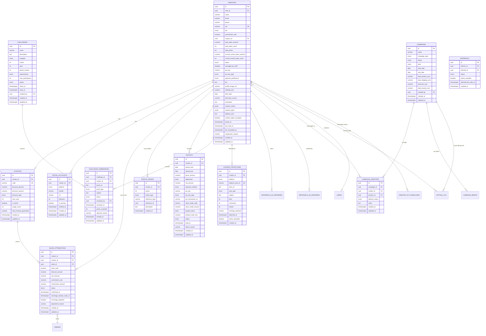

# Creators — Module Spec

> **Module:** Creators (Influencer Program — Nano to Mega)
> **Schema:** `creators`
> **Route prefix (portal):** `/api/v1/portal/creators`
> **Route prefix (admin):** `/api/v1/creators`
> **Route prefix (public):** `/api/v1/public/creators`
> **Admin UI route group:** `(admin)/creators/*`
> **Portal UI route group:** `(portal)/creators/*`
> **Public UI route:** `/creators/apply`
> **Version:** 1.2
> **Date:** March 2026 (revised)
> **Status:** Approved
> **Replaces:** Moneri (bridge first 60-90 days, then full migration), BixGrow (Shopify affiliate app)
> **References:** [DATABASE.md](../../architecture/DATABASE.md), [API.md](../../architecture/API.md), [AUTH.md](../../architecture/AUTH.md), [LGPD.md](../../platform/LGPD.md), [NOTIFICATIONS.md](../../platform/NOTIFICATIONS.md), [GLOSSARY.md](../../dev/GLOSSARY.md), [Checkout spec](../commerce/checkout.md), [CRM spec](./crm.md), [Trocas spec](../operations/trocas.md)

---

## 1. Purpose & Scope

The Creators module is the **influencer partnership engine** of Ambaril. It manages a tiered commission program where influencers (from nano 1k followers to mega/artists) promote CIENA products via personalized coupon codes and earn commission on attributed sales. The module owns creator onboarding (public form + white-glove), coupon management, sale attribution (coupon-only), commission calculation, multi-method payouts (PIX, store credit, products), a gamification layer (CIENA Points), monthly challenges, multi-platform social tracking (Instagram, TikTok, YouTube, Pinterest, Twitter), campaign ROI tracking, and comprehensive anti-fraud controls.

The program includes a massive **Ambassador** tier (tier 0) designed to scale to thousands of brand representatives with zero operational overhead. Ambassadors are not affiliates — they are *representatives of the movement*, earning exclusive discounts and recognition rather than commission. The promotion path from Ambassador to SEED (the first commissioned tier) is automated based on sales thresholds.

> **Portal copy guidelines:** All portal-facing copy uses belonging language ("voce faz parte", "nossa comunidade", "representante do movimento") rather than transactional language ("ganhe comissao", "programa de afiliados"). Ambassadors are referred to as "Representante CIENA" and the program is framed as "fazer parte do movimento" and "comunidade CIENA", never as "programa de afiliados".

This is the **most rule-heavy module** in Ambaril due to the intersection of financial calculations (commission, payouts), gamification (points, tiers, challenges), external API integration (Instagram Graph API, TikTok v1.1), fraud prevention (self-purchase blocking, monthly caps, coupon site monitoring), and dual interfaces (staff admin + creator portal).

**Core responsibilities:**

| Capability | Description |
|-----------|-------------|
| **5-tier system** | AMBASSADOR (0% commission, discount-only), SEED (8%), GROW (10%), BLOOM (12%), CORE (15%) — commission on net revenue after discount. Ambassador tier scales to thousands with zero operational cost. |
| **Coupon management** | Each creator receives a unique coupon code granting discount to the buyer |
| **Sale attribution (coupon-only)** | Orders with a creator coupon are attributed to that creator. Links UTM are analytics-only (track which network/campaign works best), not for attribution. No cookie-based tracking. |
| **CIENA Points** | Gamification system rewarding sales, social engagement, challenge participation, referrals, and tier progression |
| **Monthly challenges** | Admin-curated challenges (drop, style, community, viral, surprise) with points rewards and proof submission |
| **Multi-method payouts** | PIX, store credit (Shopify coupon), or products. Monthly cycle (calculated day 10, paid by day 15) with R$ 50 minimum |
| **Multi-platform social tracking** | Instagram Graph API polling + hashtag tracking (`#cienax{nome}{desconto}`). TikTok planned for v1.1 |
| **Campaign ROI tracking** | Each seeding/paid/gifting/reward campaign tracks costs (products, shipping, fees, rewards) and calculates ROI vs GMV generated |
| **Anti-fraud controls** | Self-purchase CPF blocking, monthly R$ 3.000 revenue cap, coupon site monitoring, device fingerprint flagging |
| **Creator self-service portal (8 pages)** | Dashboard, coupons & links, sales, earnings, ranking, challenges, profile, products catalog |
| **White-glove mode** | PM/admin manages everything on behalf of creators who never log in (artists, mega-influencers). Flag `managed_by_staff` |
| **Public application form** | 3-step form at `/creators/apply` (no auth): personal data, social networks, about. Includes content rights waiver |
| **Referral program** | Creators earn points for referring other creators who make their first confirmed sale |
| **Post-purchase creator invite** | WA message after purchase inviting customers to apply as creators |

**Primary users:**
- **Caio (PM):** Full management of creator program — approvals, challenges, payouts, analytics, **white-glove management for artists**
- **Marcus (Admin):** Full access, anti-fraud review, program configuration
- **Creators (external):** Self-service portal — dashboard, coupon sharing, challenge participation, payout tracking, ranking, product catalog
- **Staff-managed creators:** Artists/mega-influencers who never log in — PM performs all actions on their behalf
- **System (automated):** Tier evaluation, sale confirmation, payout calculation, social polling, hashtag tracking

**Out of scope:** This module does NOT handle the checkout coupon validation UX (owned by Checkout — Checkout calls Creators to validate coupon and check anti-fraud). It does NOT own the customer communication flow (owned by WhatsApp Engine). It does NOT manage ad spend or campaign performance (owned by Marketing Intelligence). Creator contact records also exist in CRM for customer-facing purposes.

---

## 2. User Stories

### 2.1 Creator Stories

| # | As a... | I want to... | So that... | Acceptance Criteria |
|---|---------|-------------|-----------|-------------------|
| US-01 | Prospective creator | Register for the CIENA Creators program via the public 3-step form | I can apply to become a brand partner | 3-step form at `/creators/apply`: (1) personal data (name, email, WhatsApp, CPF, city/state, birth date), (2) social networks (Instagram + TikTok required, YouTube/Pinterest/Twitter optional), (3) about (bio, motivation, niches, content types, clothing size, address, content rights waiver, terms). Creates `creators.creators` with `status=pending` + `creators.social_accounts` rows. WA confirmation "Recebemos sua solicitação! Avaliamos em até 48h." Instagram validated via API. |
| US-02 | Pending creator | Receive notification when my application is approved | I know I can start promoting and earning | On admin approval: `status` changes to `active`, `tier` set to SEED, coupon auto-generated (format: `CREATOR_FIRSTNAME` uppercase), WhatsApp notification with coupon code and portal link |
| US-03 | Active creator | Share my personalized coupon link via WhatsApp and Instagram | My followers get a 10% discount and I earn commission | Portal shows coupon code in large font with copy button; share buttons generate pre-formatted links for WhatsApp ("Use meu cupom JOAO e ganhe 10% de desconto na CIENA!") and Instagram (link in bio format); QR code generated for offline sharing |
| US-04 | Active creator | See my dashboard with sales, earnings, points, and tier progress | I stay motivated and track my performance | Dashboard shows: tier badge with progress bar to next tier, total earnings this month (gross and confirmed), total CIENA Points, recent sales table (last 10), active challenges card with deadline countdown |
| US-05 | Active creator | View my complete sales history with commission details | I can verify my earnings are accurate | Sales history table: date, order number, customer name (masked: "J*** S***"), order total, discount amount, net revenue, commission rate, commission amount, status (pending/confirmed/adjusted/cancelled) |
| US-06 | Active creator | See when a sale is detected from my Instagram post | I know my content is being tracked and rewarded | Portal notification: "Detectamos seu post no Instagram! +50 CIENA Points"; Instagram posts section shows all detected posts with likes, comments, and points status |
| US-07 | Active creator | Participate in a monthly challenge | I can earn bonus points and engage with the brand community | Challenges page shows active challenges with requirements, deadline, points reward; "Enviar prova" button opens submission form (proof URL, type, caption) |
| US-08 | Active creator | Submit proof for a challenge | I can claim my challenge completion points | Submission form: paste Instagram/TikTok URL, select proof type (instagram_post, instagram_story, tiktok, other), add optional caption; on submit creates `challenge_submissions` row with `status=pending` |
| US-09 | Active creator | Receive notification when I reach a new tier | I feel recognized for my growth as a creator | On tier upgrade: WhatsApp notification "Parabens! Voce subiu para o tier {TIER_NAME}! Sua nova comissao e {RATE}%"; portal shows celebratory banner; tier bonus points auto-credited |
| US-10 | Active creator | Check my payout history and current balance | I know when I will be paid and how much | Payouts page: current unpaid balance card (gross amount, deductions, net amount), payout history table (period, gross, deductions, net, status, paid date, PIX transaction ID) |
| US-11 | Active creator | Update my profile, social networks, and PIX key | My info is always current | Profile page: edit name, bio, social accounts (IG, TikTok, YouTube, Pinterest, Twitter), PIX key, PIX key type, clothing size, address, profile image, payment preference (PIX/store credit/product) |
| US-12 | Active creator | Refer another creator to the program | I earn bonus points when they make their first sale | Referral link/code available in portal; when referred creator registers, referral tracked; when referred creator's first sale is confirmed, referrer earns +100 points |
| US-13 | Active creator | Understand why my tier was downgraded | I know what I need to do to regain my previous tier | Downgrade notification includes: previous tier, new tier, new commission rate, reason ("Suas vendas confirmadas nos ultimos 90 dias ficaram abaixo do minimo para {PREVIOUS_TIER}"), requirements to regain tier |
| US-14a | Active creator | See a ranking of top creators | I feel motivated to compete and climb the leaderboard | Ranking page at `/portal/ranking`: top 20 creators by GMV this month, my position, tier distribution chart, "Creator do Mês" spotlight with badge + 500 bonus CIENA Points. Visible to all creators logged in (not public). |
| US-14b | Active creator | Browse CIENA product catalog | I know which products to promote and see commission per product | Products page at `/portal/products`: browse catalog, mark favorites, see which products generate the most commission via creator coupons |
| US-14c | Active creator | Access pre-formatted share templates | I can quickly share my coupon on WhatsApp and Instagram Stories | Share templates: pre-formatted WA message ("Usa meu cupom {CODE} e ganha {DISCOUNT}% off na @cienalab!"), IG Story template, QR code generator for offline sharing (events) |
| US-14d | Active creator | See content I posted that was detected by the system | I know my posts are being tracked and rewarded | Content Gallery in portal: feed of all detected posts (Instagram/TikTok) with likes, comments, points status, platform icon |
| US-14e | Active creator | Download brand assets | I have professional materials for my content | Assets page: CIENA logos, product photos, content guidelines, brand kit for download |
| US-NEW1 | Prospective ambassador | Apply via the public form and get auto-approved if I meet minimum criteria | I can start sharing immediately | Public form at `/creators/apply` with ambassador option. If IG follower count >= configurable threshold (default: 500), auto-approve with `tier=ambassador`, generate discount-only coupon, send WA welcome. No PM approval needed. |
| US-NEW2 | Active ambassador | Share my discount code and climb the ranking without needing commission payouts | I feel part of the CIENA movement | Ambassador portal shows: personalized coupon (discount-only, no commission), ranking position, active challenges, Creator Kit access. No earnings page. Promotion banner: "Faltam X vendas confirmadas para subir para SEED e comecar a ganhar comissao!" |
| US-NEW3 | Caio (PM) | Send campaign briefs to targeted creators with guidelines and deadlines | Content is aligned with brand strategy | Brief editor at `/creators/campaigns/:id/brief`: markdown editor, hashtag field, deadline picker, example upload (images/videos), creator/tier targeting. Creators see briefs in portal at `/portal/briefings`. |
| US-NEW4 | Caio (PM) | Have the system suggest top creators for monthly gifting | I can reward performers without manual tracking | Monthly gifting suggestions screen: ranked list of creators by confirmed sales + points + challenge completions. Configure budget and product pool. Review and approve. Approved items trigger internal ERP order + WA notification. |
| US-NEW5 | Active creator | Download brand assets (logos, photos, guidelines) from the portal | I can create professional content | Materiais page at `/portal/materials`: grid of downloadable assets from DAM `creator_kit` collection, organized by category (Logos, Fotos, Guidelines). Filter by campaign or browse all. Downloads tracked. |

### 2.2 Admin Stories

| # | As a... | I want to... | So that... | Acceptance Criteria |
|---|---------|-------------|-----------|-------------------|
| US-14 | Admin/PM | Review and approve pending creator applications | I can onboard quality creators who fit the brand | Creator list filtered by `status=pending`; detail view shows Instagram profile link, bio, follower count (if available); "Aprovar" button sets status=active, generates coupon, sends notification; "Rejeitar" button with reason field |
| US-15 | Admin/PM | Manage monthly challenges (create, edit, activate, complete) | I can keep the creator community engaged with fresh content challenges | Challenge manager: list view of all challenges by month/year; create form (name, description, category, points reward, requirements JSONB, max participants, start/end dates); status transitions: draft -> active -> judging -> completed |
| US-16 | Admin/PM | Review challenge submissions and approve/reject | I can verify creators actually completed challenges | Submissions review queue: shows pending submissions grouped by challenge; each submission shows proof URL (embedded preview if Instagram), creator name, caption; "Aprovar" awards points, "Rejeitar" requires reason |
| US-17 | Admin/PM | Process monthly payouts (calculate, review, approve, process via PIX) | Creators are paid accurately and on time | Payout manager: "Calcular pagamentos" button runs calculation for previous month; review table shows each creator's gross/deductions/net; bulk approve; "Processar PIX" initiates payments; status tracking (calculating -> pending -> processing -> paid/failed) |
| US-18 | Admin/PM | Monitor anti-fraud flags and take action | I can protect the program from abuse | Anti-fraud monitor: flagged creators list with flag type (cap_exceeded, coupon_site_detected, self_purchase_suspected, same_address, same_device); detail view with evidence; "Suspender" button with reason; "Liberar" button to clear flag |
| US-19 | Admin/PM | View creator analytics dashboard | I can measure ROI and optimize the creator program | Analytics: total GMV through creators (this month, last month, trend), top 10 performers (by sales count, by revenue, by points), CAC per creator, ROAS calculation, product mix chart (which products sell most through creator coupons), tier distribution pie chart |
| US-20 | Admin | Suspend a creator with reason | I can remove bad actors from the program | "Suspender" sets `status=suspended`, stores `suspension_reason`; creator loses portal access; pending payouts are held; WhatsApp notification with reason sent |
| US-21 | Admin | Reactivate a suspended creator | I can reinstate creators after investigation clears them | "Reativar" sets `status=active`; portal access restored; held payouts released to next cycle; WhatsApp notification sent |
| US-22 | Admin/PM | Manually adjust a creator's points with a reason | I can correct errors or award special bonuses | Points adjustment form: creator selector, points amount (+/-), reason text (required); creates `points_ledger` entry with `action_type=manual_adjustment` |
| US-23 | Admin/PM | Create and manage a creator in white-glove mode | I can manage artists/mega-influencers who will never log in | Create creator via `/creators/new` (manual form, all fields including social accounts); flag `managed_by_staff=true`; PM can generate coupons, create UTM links, view dashboard, process payouts, edit profile — all on behalf of the creator. Creator does NOT receive "access your portal" emails. |
| US-24 | Admin/PM | Generate UTM links for a creator | I can track which social network or campaign drives the most traffic for a creator | Link generator in creator profile: select platform (IG, TikTok, YouTube, etc.) + campaign name → generates UTM link. UTM links are **analytics only** — they do NOT attribute sales. Only coupons attribute sales. |
| US-25 | Admin/PM | Create and track campaigns with ROI | I can measure the return on investment of each seeding, paid, or gifting campaign | Campaign types: seeding, paid, gifting, reward. Each campaign tracks: product cost, shipping cost, fee cost, reward cost. System calculates total_gmv (from creator coupons during campaign period) and ROI = (GMV - total_cost) / total_cost × 100. Campaign detail shows cost breakdown, GMV, ROI chart, per-creator performance, detected content, delivery status. |
| US-26 | Admin/PM | Choose payment method for creator payout | I can pay creators via PIX, store credit, or products | Payout method options: (1) PIX — transfer to creator's key, (2) store_credit — auto-generate Shopify coupon (e.g., `CREDIT-IGUIN-250`), (3) product — select products from catalog, mark as payout-via-product. Creator can indicate preference in portal, but PM has final decision. |
| US-27 | Admin/PM | Invite customers to become creators via post-purchase WA | I can recruit new creators from our customer base | Post-purchase WA template sent after delivery: "Gostou? Seja creator CIENA e ganhe comissão indicando nossos produtos!" with link to `/creators/apply`. Triggered by WhatsApp Engine, configured in Creators settings. |

---

## 3. Data Model

### 3.1 Entity Relationship Diagram



### 3.2 Enums

```sql
CREATE TYPE creators.creator_tier AS ENUM ('ambassador', 'seed', 'grow', 'bloom', 'core');
CREATE TYPE creators.creator_status AS ENUM ('pending', 'active', 'suspended', 'inactive');
CREATE TYPE creators.discount_type AS ENUM ('percent', 'fixed');
CREATE TYPE creators.pix_key_type AS ENUM ('cpf', 'email', 'phone', 'random');
CREATE TYPE creators.payment_method AS ENUM ('pix', 'store_credit', 'product');
CREATE TYPE creators.payment_preference AS ENUM ('pix', 'store_credit', 'product');
CREATE TYPE creators.attribution_status AS ENUM ('pending', 'confirmed', 'adjusted', 'cancelled');
CREATE TYPE creators.points_action AS ENUM (
    'sale', 'post_detected', 'challenge_completed', 'referral',
    'engagement', 'manual_adjustment', 'tier_bonus', 'hashtag_detected',
    'creator_of_month', 'product_redemption'
);
CREATE TYPE creators.challenge_category AS ENUM ('drop', 'style', 'community', 'viral', 'surprise');
CREATE TYPE creators.challenge_status AS ENUM ('draft', 'active', 'judging', 'completed', 'cancelled');
CREATE TYPE creators.submission_status AS ENUM ('pending', 'approved', 'rejected');
CREATE TYPE creators.proof_type AS ENUM ('instagram_post', 'instagram_story', 'tiktok', 'youtube', 'other');
CREATE TYPE creators.payout_status AS ENUM ('calculating', 'pending', 'processing', 'paid', 'failed');
CREATE TYPE creators.referral_status AS ENUM ('pending', 'active', 'expired');
CREATE TYPE creators.social_platform AS ENUM ('instagram', 'tiktok', 'youtube', 'pinterest', 'twitter', 'other');
CREATE TYPE creators.content_post_type AS ENUM ('image', 'video', 'carousel', 'story', 'reel', 'short');
CREATE TYPE creators.campaign_type AS ENUM ('seeding', 'paid', 'gifting', 'reward');
CREATE TYPE creators.campaign_status AS ENUM ('draft', 'active', 'completed', 'cancelled');
CREATE TYPE creators.delivery_status AS ENUM ('pending', 'shipped', 'delivered', 'content_posted');
```

---

### 3.3 Database Schema (Full Column Reference)

All tables live in the `creators` PostgreSQL schema. Full column definitions are in [DATABASE.md](../../architecture/DATABASE.md) section 4.x. Below is the **complete reference** with all columns, types, and constraints.

#### 3.3.1 creators.creators

| Column | Type | Constraints | Description |
|--------|------|-------------|-------------|
| id | UUID | PK, DEFAULT gen_random_uuid() | UUID v7 |
| user_id | UUID | NULL, FK global.users(id) | Linked platform user account (created on approval). NULL for managed_by_staff creators. |
| name | VARCHAR(255) | NOT NULL | Full name |
| email | VARCHAR(255) | NOT NULL | Contact email |
| phone | VARCHAR(20) | NOT NULL | Brazilian format: +5511999999999 |
| cpf | VARCHAR(11) | NOT NULL, UNIQUE | Brazilian tax ID (digits only, no formatting) |
| tier | creators.creator_tier | NOT NULL DEFAULT 'ambassador' | Current tier: ambassador, seed, grow, bloom, core |
| commission_rate | NUMERIC(4,2) | NOT NULL DEFAULT 0.00 | Current commission percentage (mirrors tier). Ambassador = 0%. |
| coupon_id | UUID | NULL, FK creators.coupons(id) | Active coupon for this creator |
| total_sales_amount | NUMERIC(12,2) | NOT NULL DEFAULT 0 | Denormalized: lifetime confirmed net revenue |
| total_sales_count | INTEGER | NOT NULL DEFAULT 0 | Denormalized: lifetime confirmed sale count |
| total_points | INTEGER | NOT NULL DEFAULT 0 | Denormalized: lifetime accumulated CIENA Points |
| current_month_sales_amount | NUMERIC(12,2) | NOT NULL DEFAULT 0 | Denormalized: current month net revenue (reset day 1) |
| current_month_sales_count | INTEGER | NOT NULL DEFAULT 0 | Denormalized: current month confirmed sales (reset day 1) |
| status | creators.creator_status | NOT NULL DEFAULT 'pending' | pending, active, suspended, inactive |
| managed_by_staff | BOOLEAN | NOT NULL DEFAULT FALSE | White-glove mode: PM/admin manages everything for this creator. Creator never logs in (artists, mega-influencers). |
| pix_key | VARCHAR(255) | NULL | PIX key for payouts |
| pix_key_type | creators.pix_key_type | NULL | Type of PIX key: cpf, email, phone, random |
| payment_preference | creators.payment_preference | NULL | Creator's preferred payment method (PM has final say) |
| bio | TEXT | NULL | Creator bio / description |
| profile_image_url | VARCHAR(500) | NULL | URL to profile image |
| clothing_size | VARCHAR(5) | NULL | PP, P, M, G, GG — for product seeding |
| birth_date | DATE | NULL | Creator's date of birth |
| discovery_source | VARCHAR(100) | NULL | How creator discovered CIENA (Instagram, TikTok, amigo, evento, outro) |
| motivation | TEXT | NULL | "Por que quer representar a CIENA?" (from application form) |
| content_niches | JSONB | NULL | Selected niches: ["streetwear", "lifestyle", "musica", ...] |
| content_types | JSONB | NULL | Preferred content types: ["reels", "stories", "tiktok", ...] |
| address | JSONB | NULL | Full address: { street, number, complement, neighborhood, city, state, zip } |
| content_rights_accepted | BOOLEAN | NOT NULL DEFAULT FALSE | Whether creator accepted content rights waiver at registration |
| joined_at | TIMESTAMPTZ | NULL | Timestamp when status changed to active |
| last_sale_at | TIMESTAMPTZ | NULL | Timestamp of most recent attributed sale |
| tier_evaluated_at | TIMESTAMPTZ | NULL | Timestamp of last tier evaluation |
| suspension_reason | VARCHAR(500) | NULL | Reason for suspension (if status = suspended) |
| created_at | TIMESTAMPTZ | NOT NULL DEFAULT NOW() | |
| updated_at | TIMESTAMPTZ | NOT NULL DEFAULT NOW() | |

**Indexes:**

```sql
CREATE UNIQUE INDEX idx_creators_cpf ON creators.creators (cpf);
CREATE INDEX idx_creators_status ON creators.creators (status);
CREATE INDEX idx_creators_tier ON creators.creators (tier);
CREATE INDEX idx_creators_user_id ON creators.creators (user_id) WHERE user_id IS NOT NULL;
CREATE INDEX idx_creators_total_sales ON creators.creators (total_sales_count DESC);
CREATE INDEX idx_creators_total_points ON creators.creators (total_points DESC);
CREATE INDEX idx_creators_current_month_sales ON creators.creators (current_month_sales_amount DESC);
CREATE INDEX idx_creators_managed ON creators.creators (managed_by_staff) WHERE managed_by_staff = TRUE;
```

#### 3.3.2 creators.coupons

| Column | Type | Constraints | Description |
|--------|------|-------------|-------------|
| id | UUID | PK, DEFAULT gen_random_uuid() | |
| creator_id | UUID | NOT NULL, FK creators.creators(id) | Owning creator |
| code | VARCHAR(50) | NOT NULL, UNIQUE | Uppercase coupon code (e.g., JOAO, IGUIN10) |
| discount_percent | NUMERIC(4,2) | NULL | Discount percentage given to buyer (when discount_type = 'percent') |
| discount_amount | NUMERIC(12,2) | NULL | Fixed discount amount (when discount_type = 'fixed') |
| discount_type | creators.discount_type | NOT NULL DEFAULT 'percent' | percent or fixed |
| max_uses | INTEGER | NULL | NULL = unlimited uses |
| is_active | BOOLEAN | NOT NULL DEFAULT TRUE | Whether coupon can be used |
| usage_count | INTEGER | NOT NULL DEFAULT 0 | Denormalized: number of times used |
| total_revenue_generated | NUMERIC(12,2) | NOT NULL DEFAULT 0 | Denormalized: total order revenue via this coupon |
| created_at | TIMESTAMPTZ | NOT NULL DEFAULT NOW() | |
| updated_at | TIMESTAMPTZ | NOT NULL DEFAULT NOW() | |

**Indexes:**

```sql
CREATE UNIQUE INDEX idx_coupons_code ON creators.coupons (code);
CREATE INDEX idx_coupons_creator ON creators.coupons (creator_id);
CREATE INDEX idx_coupons_active ON creators.coupons (is_active) WHERE is_active = TRUE;
```

#### 3.3.3 creators.sales_attributions

| Column | Type | Constraints | Description |
|--------|------|-------------|-------------|
| id | UUID | PK, DEFAULT gen_random_uuid() | |
| creator_id | UUID | NOT NULL, FK creators.creators(id) | Attributed creator |
| coupon_id | UUID | NOT NULL, FK creators.coupons(id) | Coupon used in the order |
| order_id | UUID | NOT NULL, FK checkout.orders(id) | The Checkout order |
| order_total | NUMERIC(12,2) | NOT NULL | Original order total before discount |
| discount_amount | NUMERIC(12,2) | NOT NULL | Discount applied via creator coupon |
| net_revenue | NUMERIC(12,2) | NOT NULL | order_total - discount_amount |
| commission_rate | NUMERIC(4,2) | NOT NULL | Creator's commission rate at time of sale |
| commission_amount | NUMERIC(12,2) | NOT NULL | net_revenue * commission_rate / 100 |
| status | creators.attribution_status | NOT NULL DEFAULT 'pending' | pending, confirmed, adjusted, cancelled |
| confirmed_at | TIMESTAMPTZ | NULL | When status changed to confirmed |
| exchange_window_ends_at | TIMESTAMPTZ | NOT NULL | order.created_at + 7 days |
| exchange_adjusted | BOOLEAN | NOT NULL DEFAULT FALSE | Whether an exchange affected this attribution |
| adjustment_reason | VARCHAR(500) | NULL | Reason for adjustment (if exchange_adjusted) |
| created_at | TIMESTAMPTZ | NOT NULL DEFAULT NOW() | |
| updated_at | TIMESTAMPTZ | NOT NULL DEFAULT NOW() | |

**Indexes:**

```sql
CREATE UNIQUE INDEX idx_attributions_order ON creators.sales_attributions (order_id);
CREATE INDEX idx_attributions_creator ON creators.sales_attributions (creator_id);
CREATE INDEX idx_attributions_status ON creators.sales_attributions (status);
CREATE INDEX idx_attributions_pending_window ON creators.sales_attributions (exchange_window_ends_at)
    WHERE status = 'pending';
CREATE INDEX idx_attributions_creator_month ON creators.sales_attributions (creator_id, created_at DESC);
```

#### 3.3.4 creators.points_ledger

| Column | Type | Constraints | Description |
|--------|------|-------------|-------------|
| id | UUID | PK, DEFAULT gen_random_uuid() | |
| creator_id | UUID | NOT NULL, FK creators.creators(id) | |
| points | INTEGER | NOT NULL | Points earned (positive) or deducted (negative) |
| action_type | creators.points_action | NOT NULL | sale, post_detected, challenge_completed, referral, engagement, manual_adjustment, tier_bonus |
| reference_type | VARCHAR(100) | NULL | Type of referenced entity (e.g., 'sales_attribution', 'challenge_submission', 'instagram_post') |
| reference_id | UUID | NULL | ID of the referenced entity |
| description | TEXT | NOT NULL | Human-readable description of the points action |
| created_at | TIMESTAMPTZ | NOT NULL DEFAULT NOW() | Immutable — append-only ledger |

> **Append-only:** This table is an immutable ledger. Points are never updated or deleted. The current balance for a creator is derived from `SUM(points) WHERE creator_id = ?`. The denormalized `creators.total_points` is kept in sync by the application layer.

**Indexes:**

```sql
CREATE INDEX idx_points_creator ON creators.points_ledger (creator_id);
CREATE INDEX idx_points_action ON creators.points_ledger (action_type);
CREATE INDEX idx_points_reference ON creators.points_ledger (reference_type, reference_id);
CREATE INDEX idx_points_created ON creators.points_ledger (created_at DESC);
```

#### 3.3.5 creators.challenges

| Column | Type | Constraints | Description |
|--------|------|-------------|-------------|
| id | UUID | PK, DEFAULT gen_random_uuid() | |
| name | VARCHAR(255) | NOT NULL | Challenge display name |
| description | TEXT | NOT NULL | Full challenge description and rules |
| category | creators.challenge_category | NOT NULL | drop, style, community, viral, surprise |
| month | INTEGER | NOT NULL, CHECK (month BETWEEN 1 AND 12) | Month this challenge belongs to |
| year | INTEGER | NOT NULL, CHECK (year >= 2026) | Year this challenge belongs to |
| points_reward | INTEGER | NOT NULL, CHECK (points_reward BETWEEN 50 AND 500) | Points awarded on completion |
| requirements | JSONB | NOT NULL | Structured requirements (see section 3.5.1) |
| max_participants | INTEGER | NULL | NULL = unlimited |
| status | creators.challenge_status | NOT NULL DEFAULT 'draft' | draft, active, judging, completed, cancelled |
| starts_at | TIMESTAMPTZ | NOT NULL | Challenge start timestamp |
| ends_at | TIMESTAMPTZ | NOT NULL | Challenge deadline timestamp |
| created_by | UUID | NOT NULL, FK global.users(id) | Admin/PM who created the challenge |
| created_at | TIMESTAMPTZ | NOT NULL DEFAULT NOW() | |
| updated_at | TIMESTAMPTZ | NOT NULL DEFAULT NOW() | |

**Challenge Requirements JSONB Structure:**

```json
{
  "type": "instagram_post",
  "description": "Poste uma foto usando uma peca do Drop 10 com a tag @cienalab",
  "rules": [
    "Foto deve mostrar a peca claramente",
    "Deve marcar @cienalab na foto (nao apenas na legenda)",
    "Post deve permanecer ativo por pelo menos 7 dias"
  ],
  "hashtags_required": ["#cienalab", "#drop10"],
  "minimum_likes": 50,
  "proof_type": "instagram_post"
}
```

**Indexes:**

```sql
CREATE INDEX idx_challenges_status ON creators.challenges (status);
CREATE INDEX idx_challenges_month_year ON creators.challenges (year, month);
CREATE INDEX idx_challenges_active ON creators.challenges (starts_at, ends_at) WHERE status = 'active';
```

#### 3.3.6 creators.challenge_submissions

| Column | Type | Constraints | Description |
|--------|------|-------------|-------------|
| id | UUID | PK, DEFAULT gen_random_uuid() | |
| challenge_id | UUID | NOT NULL, FK creators.challenges(id) | |
| creator_id | UUID | NOT NULL, FK creators.creators(id) | |
| proof_url | TEXT | NOT NULL | URL to proof (Instagram post, TikTok, etc.) |
| proof_type | creators.proof_type | NOT NULL | instagram_post, instagram_story, tiktok, other |
| caption | TEXT | NULL | Optional caption / note from creator |
| status | creators.submission_status | NOT NULL DEFAULT 'pending' | pending, approved, rejected |
| reviewed_by | UUID | NULL, FK global.users(id) | Admin/PM who reviewed |
| reviewed_at | TIMESTAMPTZ | NULL | When the review happened |
| points_awarded | INTEGER | NULL | Points actually awarded (may differ from challenge default for bonus) |
| rejection_reason | VARCHAR(500) | NULL | Reason for rejection |
| created_at | TIMESTAMPTZ | NOT NULL DEFAULT NOW() | |
| updated_at | TIMESTAMPTZ | NOT NULL DEFAULT NOW() | |

**Indexes:**

```sql
CREATE UNIQUE INDEX idx_submissions_unique ON creators.challenge_submissions (challenge_id, creator_id);
CREATE INDEX idx_submissions_challenge ON creators.challenge_submissions (challenge_id);
CREATE INDEX idx_submissions_creator ON creators.challenge_submissions (creator_id);
CREATE INDEX idx_submissions_status ON creators.challenge_submissions (status) WHERE status = 'pending';
```

#### 3.3.7 creators.payouts

| Column | Type | Constraints | Description |
|--------|------|-------------|-------------|
| id | UUID | PK, DEFAULT gen_random_uuid() | |
| creator_id | UUID | NOT NULL, FK creators.creators(id) | |
| period_start | DATE | NOT NULL | Start of payout period (1st of previous month) |
| period_end | DATE | NOT NULL | End of payout period (last day of previous month) |
| gross_amount | NUMERIC(12,2) | NOT NULL | Total confirmed commission for the period |
| deductions | JSONB | NULL | Any deductions: `{ "reason": "...", "amount": 0.00 }[]` |
| net_amount | NUMERIC(12,2) | NOT NULL | gross_amount - sum(deductions) |
| payment_method | creators.payment_method | NOT NULL DEFAULT 'pix' | pix, store_credit, or product |
| pix_key | VARCHAR(255) | NULL | PIX key snapshot (only if payment_method = 'pix') |
| pix_key_type | creators.pix_key_type | NULL | PIX key type snapshot |
| pix_transaction_id | VARCHAR(255) | NULL | PIX transaction reference (only if payment_method = 'pix') |
| store_credit_code | VARCHAR(100) | NULL | Generated Shopify coupon code (only if payment_method = 'store_credit') |
| store_credit_amount | NUMERIC(12,2) | NULL | Store credit value |
| product_items | JSONB | NULL | Products given as payment: `[{ product_id, variant_id, name, qty, cost }]` (only if payment_method = 'product') |
| product_total_cost | NUMERIC(12,2) | NULL | Total cost of products given |
| status | creators.payout_status | NOT NULL DEFAULT 'calculating' | calculating, pending, processing, paid, failed |
| paid_at | TIMESTAMPTZ | NULL | When payment was actually processed |
| failure_reason | VARCHAR(500) | NULL | Reason if status = failed |
| created_at | TIMESTAMPTZ | NOT NULL DEFAULT NOW() | |
| updated_at | TIMESTAMPTZ | NOT NULL DEFAULT NOW() | |

**Indexes:**

```sql
CREATE INDEX idx_payouts_creator ON creators.payouts (creator_id);
CREATE INDEX idx_payouts_status ON creators.payouts (status);
CREATE INDEX idx_payouts_period ON creators.payouts (period_start, period_end);
CREATE INDEX idx_payouts_method ON creators.payouts (payment_method);
CREATE UNIQUE INDEX idx_payouts_creator_period ON creators.payouts (creator_id, period_start, period_end);
```

#### 3.3.8 creators.referrals

| Column | Type | Constraints | Description |
|--------|------|-------------|-------------|
| id | UUID | PK, DEFAULT gen_random_uuid() | |
| referrer_id | UUID | NOT NULL, FK creators.creators(id) | Creator who made the referral |
| referred_id | UUID | NOT NULL, FK creators.creators(id) | Creator who was referred |
| status | creators.referral_status | NOT NULL DEFAULT 'pending' | pending, active, expired |
| points_awarded | BOOLEAN | NOT NULL DEFAULT FALSE | Whether referrer received +100 points |
| referred_first_sale_at | TIMESTAMPTZ | NULL | When the referred creator made their first confirmed sale |
| created_at | TIMESTAMPTZ | NOT NULL DEFAULT NOW() | |

**Indexes:**

```sql
CREATE UNIQUE INDEX idx_referrals_pair ON creators.referrals (referrer_id, referred_id);
CREATE INDEX idx_referrals_referrer ON creators.referrals (referrer_id);
CREATE INDEX idx_referrals_referred ON creators.referrals (referred_id);
CREATE INDEX idx_referrals_pending ON creators.referrals (status) WHERE status = 'pending';
```

#### 3.3.9 creators.content_detections

Replaces the previous `instagram_posts` table. Now supports multi-platform detection (Instagram, TikTok, YouTube, etc.) and hashtag tracking.

| Column | Type | Constraints | Description |
|--------|------|-------------|-------------|
| id | UUID | PK, DEFAULT gen_random_uuid() | |
| creator_id | UUID | NOT NULL, FK creators.creators(id) | Matched creator |
| platform | creators.social_platform | NOT NULL | instagram, tiktok, youtube, etc. |
| platform_post_id | VARCHAR(200) | NOT NULL, UNIQUE | Platform-native post ID (deduplication key) |
| post_url | TEXT | NOT NULL | Full URL to the post |
| post_type | creators.content_post_type | NOT NULL | image, video, carousel, story, reel, short |
| caption | TEXT | NULL | Post caption text |
| likes | INTEGER | NOT NULL DEFAULT 0 | Like count at detection time |
| comments | INTEGER | NOT NULL DEFAULT 0 | Comment count at detection time |
| shares | INTEGER | NOT NULL DEFAULT 0 | Share/repost count at detection time |
| hashtag_matched | VARCHAR(100) | NULL | Which hashtag triggered detection (e.g., `#cienaxiguin10`). NULL if detected via @mention/tag. |
| detected_at | TIMESTAMPTZ | NOT NULL | When the system first detected this post |
| points_awarded | BOOLEAN | NOT NULL DEFAULT FALSE | Whether points have been credited |
| created_at | TIMESTAMPTZ | NOT NULL DEFAULT NOW() | |

**Indexes:**

```sql
CREATE UNIQUE INDEX idx_content_detections_platform_id ON creators.content_detections (platform_post_id);
CREATE INDEX idx_content_detections_creator ON creators.content_detections (creator_id);
CREATE INDEX idx_content_detections_platform ON creators.content_detections (platform);
CREATE INDEX idx_content_detections_detected ON creators.content_detections (detected_at DESC);
CREATE INDEX idx_content_detections_hashtag ON creators.content_detections (hashtag_matched) WHERE hashtag_matched IS NOT NULL;
```

#### 3.3.10 creators.social_accounts

Multi-platform social network profiles for each creator. Replaces the previous `instagram_handle` column on `creators.creators`.

| Column | Type | Constraints | Description |
|--------|------|-------------|-------------|
| id | UUID | PK, DEFAULT gen_random_uuid() | |
| creator_id | UUID | NOT NULL, FK creators.creators(id) | |
| platform | creators.social_platform | NOT NULL | instagram, tiktok, youtube, pinterest, twitter, other |
| handle | VARCHAR(100) | NOT NULL | @username (without @) or channel URL for YouTube |
| url | VARCHAR(500) | NULL | Full profile/channel URL |
| followers | INTEGER | NULL | Follower count (updated by sync job) |
| is_primary | BOOLEAN | NOT NULL DEFAULT FALSE | Creator's primary platform |
| verified_at | TIMESTAMPTZ | NULL | When we last validated this account via API |
| created_at | TIMESTAMPTZ | NOT NULL DEFAULT NOW() | |
| updated_at | TIMESTAMPTZ | NOT NULL DEFAULT NOW() | |

**Indexes:**

```sql
CREATE INDEX idx_social_accounts_creator ON creators.social_accounts (creator_id);
CREATE UNIQUE INDEX idx_social_accounts_platform_handle ON creators.social_accounts (platform, handle);
CREATE INDEX idx_social_accounts_platform ON creators.social_accounts (platform);
```

#### 3.3.11 creators.campaigns

Campaign as cost center for ROI tracking. Types: seeding (product send), paid (contracted influencer), gifting (product gift at event), reward (CIENA Points prize).

| Column | Type | Constraints | Description |
|--------|------|-------------|-------------|
| id | UUID | PK, DEFAULT gen_random_uuid() | |
| name | VARCHAR(255) | NOT NULL | Campaign display name |
| campaign_type | creators.campaign_type | NOT NULL | seeding, paid, gifting, reward |
| status | creators.campaign_status | NOT NULL DEFAULT 'draft' | draft, active, completed, cancelled |
| brief | JSONB | NULL | Campaign brief: { deadline, format, hashtags, dos, donts, notes } |
| start_date | DATE | NOT NULL | Campaign start |
| end_date | DATE | NULL | Campaign end (NULL = ongoing) |
| total_product_cost | NUMERIC(12,2) | NOT NULL DEFAULT 0 | Cost of products sent/gifted |
| total_shipping_cost | NUMERIC(12,2) | NOT NULL DEFAULT 0 | Shipping costs |
| total_fee_cost | NUMERIC(12,2) | NOT NULL DEFAULT 0 | Fee paid to influencer (for paid campaigns) |
| total_reward_cost | NUMERIC(12,2) | NOT NULL DEFAULT 0 | Value of rewards/prizes |
| created_by | UUID | NOT NULL, FK global.users(id) | PM/admin who created |
| created_at | TIMESTAMPTZ | NOT NULL DEFAULT NOW() | |
| updated_at | TIMESTAMPTZ | NOT NULL DEFAULT NOW() | |

> **Computed fields (application layer):**
> - `total_cost = total_product_cost + total_shipping_cost + total_fee_cost + total_reward_cost`
> - `total_gmv = SUM(sales_attributions.net_revenue) WHERE creator IN campaign_creators AND created_at BETWEEN start_date AND end_date`
> - `roi = (total_gmv - total_cost) / total_cost * 100`

**Indexes:**

```sql
CREATE INDEX idx_campaigns_status ON creators.campaigns (status);
CREATE INDEX idx_campaigns_type ON creators.campaigns (campaign_type);
CREATE INDEX idx_campaigns_dates ON creators.campaigns (start_date, end_date);
```

#### 3.3.12 creators.campaign_creators

Join table linking creators to campaigns. Tracks product seeding delivery status.

| Column | Type | Constraints | Description |
|--------|------|-------------|-------------|
| id | UUID | PK, DEFAULT gen_random_uuid() | |
| campaign_id | UUID | NOT NULL, FK creators.campaigns(id) | |
| creator_id | UUID | NOT NULL, FK creators.creators(id) | |
| product_id | UUID | NULL, FK erp.products(id) | Product sent for seeding (if applicable) |
| delivery_status | creators.delivery_status | NULL | pending, shipped, delivered, content_posted |
| product_cost | NUMERIC(12,2) | NULL | Cost of product sent to this creator |
| shipping_cost | NUMERIC(12,2) | NULL | Shipping cost for this creator |
| fee_amount | NUMERIC(12,2) | NULL | Fee paid to this specific creator (for paid campaigns) |
| notes | TEXT | NULL | Internal notes |
| created_at | TIMESTAMPTZ | NOT NULL DEFAULT NOW() | |
| updated_at | TIMESTAMPTZ | NOT NULL DEFAULT NOW() | |

**Indexes:**

```sql
CREATE UNIQUE INDEX idx_campaign_creators_pair ON creators.campaign_creators (campaign_id, creator_id);
CREATE INDEX idx_campaign_creators_campaign ON creators.campaign_creators (campaign_id);
CREATE INDEX idx_campaign_creators_creator ON creators.campaign_creators (creator_id);
```

#### 3.3.13 creators.campaign_briefs

Campaign briefs provide structured content guidelines for creators participating in a campaign.

| Column | Type | Constraints | Description |
|--------|------|-------------|-------------|
| id | UUID | PK, DEFAULT gen_random_uuid() | UUID v7 |
| campaign_id | UUID | NOT NULL, FK creators.campaigns(id) | Parent campaign |
| title | VARCHAR(255) | NOT NULL | Brief display title |
| content_md | TEXT | NOT NULL | Full brief content in Markdown format (guidelines, dos/donts, examples) |
| hashtags | TEXT[] | NULL | Required hashtags for this brief (e.g., `{"#cienalab", "#drop11"}`) |
| deadline | TIMESTAMPTZ | NULL | Content submission deadline |
| examples_json | JSONB | NULL | Example content references: `[{ "type": "image"|"video", "url": "...", "caption": "..." }]` |
| target_tiers | creators.creator_tier[] | NULL | Which tiers receive this brief (NULL = all tiers) |
| created_by | UUID | NOT NULL, FK global.users(id) | PM/admin who created the brief |
| created_at | TIMESTAMPTZ | NOT NULL DEFAULT NOW() | |
| updated_at | TIMESTAMPTZ | NOT NULL DEFAULT NOW() | |

**Indexes:**

```sql
CREATE INDEX idx_campaign_briefs_campaign ON creators.campaign_briefs (campaign_id);
CREATE INDEX idx_campaign_briefs_deadline ON creators.campaign_briefs (deadline) WHERE deadline IS NOT NULL;
```

#### 3.3.14 creators.gifting_log

Tracks gifting decisions and deliveries. Each row represents a single gifting action for one creator.

| Column | Type | Constraints | Description |
|--------|------|-------------|-------------|
| id | UUID | PK, DEFAULT gen_random_uuid() | UUID v7 |
| creator_id | UUID | NOT NULL, FK creators.creators(id) | Recipient creator |
| campaign_id | UUID | NULL, FK creators.campaigns(id) | Associated gifting campaign (for ROI tracking) |
| product_id | UUID | NULL, FK erp.products(id) | Gifted product |
| product_name | VARCHAR(255) | NOT NULL | Snapshot of product name at time of gifting |
| product_cost | NUMERIC(12,2) | NOT NULL | Product cost for ROI calculation |
| shipping_cost | NUMERIC(12,2) | NOT NULL DEFAULT 0 | Shipping cost |
| reason | TEXT | NOT NULL | Why this creator was selected (e.g., "Top 3 em vendas confirmadas") |
| status | VARCHAR(50) | NOT NULL DEFAULT 'suggested' | suggested, approved, rejected, ordered, shipped, delivered |
| erp_order_id | UUID | NULL, FK erp.orders(id) | Internal ERP order created on approval |
| approved_by | UUID | NULL, FK global.users(id) | PM who approved |
| approved_at | TIMESTAMPTZ | NULL | Approval timestamp |
| created_at | TIMESTAMPTZ | NOT NULL DEFAULT NOW() | |
| updated_at | TIMESTAMPTZ | NOT NULL DEFAULT NOW() | |

**Indexes:**

```sql
CREATE INDEX idx_gifting_log_creator ON creators.gifting_log (creator_id);
CREATE INDEX idx_gifting_log_campaign ON creators.gifting_log (campaign_id) WHERE campaign_id IS NOT NULL;
CREATE INDEX idx_gifting_log_status ON creators.gifting_log (status);
CREATE INDEX idx_gifting_log_created ON creators.gifting_log (created_at DESC);
```

#### 3.3.15 creators.creator_kit_downloads

Tracks asset downloads from the Creator Kit (DAM integration).

| Column | Type | Constraints | Description |
|--------|------|-------------|-------------|
| id | UUID | PK, DEFAULT gen_random_uuid() | UUID v7 |
| creator_id | UUID | NOT NULL, FK creators.creators(id) | Creator who downloaded |
| asset_id | UUID | NOT NULL | DAM asset ID (FK to future dam.assets table) |
| asset_name | VARCHAR(255) | NOT NULL | Snapshot of asset name at download time |
| downloaded_at | TIMESTAMPTZ | NOT NULL DEFAULT NOW() | When the download occurred |

**Indexes:**

```sql
CREATE INDEX idx_creator_kit_downloads_creator ON creators.creator_kit_downloads (creator_id);
CREATE INDEX idx_creator_kit_downloads_asset ON creators.creator_kit_downloads (asset_id);
CREATE INDEX idx_creator_kit_downloads_date ON creators.creator_kit_downloads (downloaded_at DESC);
```

---

## 4. Business Rules

### 4.1 Tier System

| # | Rule | Detail |
|---|------|--------|
| R0 | **AMBASSADOR tier (tier 0 — movement representatives)** | Requirements: none (entry level for mass onboarding). Commission rate: **0%** (no commission). Ambassador receives: personalized coupon with exclusive discount (5-8%, configurable) for their followers, access to ranking, challenges, Creator Kit, and limited portal (dashboard, ranking, challenges, profile, materials). No payout cycle. Goal: scale to thousands without operational cost. Self-service onboarding via public form with optional auto-approval. |
| R0a | **Ambassador → SEED promotion** | When an ambassador reaches a configurable sales threshold (default: **10 confirmed sales in 60 days**), the system auto-promotes them to SEED tier. Promotion triggers: set `tier=seed`, set `commission_rate=8.00`, send WA celebration ("Parabens! Voce agora e Creator SEED e comeca a ganhar comissao de 8%!"), award +100 bonus points, emit `creator.tier_upgraded` Flare event. PM is notified. |
| R1 | **SEED tier (first commissioned tier)** | Requirements: 0-4 confirmed sales OR 0-499 total points (for creators who were directly approved as SEED), OR promotion from Ambassador tier. Commission rate: 8%. |
| R2 | **GROW tier** | Requirements: 5-14 confirmed sales in last 90 days AND 500+ total lifetime points. Commission rate: 10%. |
| R3 | **BLOOM tier** | Requirements: 15-29 confirmed sales in last 90 days AND 1.500+ total lifetime points. Commission rate: 12%. |
| R4 | **CORE tier (top tier)** | Requirements: 30+ confirmed sales in last 90 days AND 3.000+ total lifetime points. Commission rate: 15%. |
| R5 | **Tier evaluation schedule** | Runs monthly on day 1 at 03:00 BRT via Vercel Cron. Evaluates each active creator against last 90 days of confirmed sales data and lifetime points. |
| R6 | **Tier progression (upgrade)** | If creator meets criteria for a higher tier: auto-upgrade tier, update `commission_rate`, set `tier_evaluated_at`, send WhatsApp notification ("Parabens! Voce subiu para {TIER}! Nova comissao: {RATE}%"), award tier bonus points (GROW: +200, BLOOM: +500, CORE: +1.000), emit `creator.tier_upgraded` Flare event. |
| R7 | **Tier regression (downgrade)** | If creator fails to meet current tier criteria for **2 consecutive** monthly evaluations: downgrade one tier (not skip tiers), update `commission_rate`, send WhatsApp notification with reason and guidance, emit `creator.tier_downgraded` Flare event. First failure: flag internally but do NOT downgrade (grace period). |
| R8 | **New creator default** | Public form applicants start at AMBASSADOR tier (0% commission) by default. PM-approved or white-glove creators start at SEED tier (8% commission). Ambassadors who meet promotion threshold auto-upgrade to SEED. |

### 4.2 Commission Calculation

| # | Rule | Detail |
|---|------|--------|
| R9 | **Attribution on order** | When Checkout processes an order with a creator coupon (`order.paid` event): create `sales_attributions` row with `status=pending`, record the creator's current `commission_rate` at the moment of sale (rate is locked in at sale time, not payout time). |
| R10 | **Commission formula** | `commission_amount = net_revenue * (commission_rate / 100)`. Where `net_revenue = order_total - discount_amount`. Example: order R$ 200, 10% discount = R$ 20, net = R$ 180, creator at GROW (10%) = R$ 18 commission. |
| R11 | **Exchange window** | `exchange_window_ends_at = order.created_at + 7 days`. This is the cooling-off period during which the attribution remains `pending`. |
| R12 | **Sale confirmation** | Sale transitions to `status=confirmed` only AFTER `exchange_window_ends_at` passes with no exchange request filed against the order. Confirmation is processed by the daily `creators:confirm-sales` background job at 04:00 BRT. |
| R13 | **Exchange within window (partial)** | If a `trocas.exchange_request` is created during the 7-day window for a partial exchange (not full refund): recalculate `net_revenue` on the adjusted order total, recalculate `commission_amount`, set `exchange_adjusted=true`, store `adjustment_reason`. Attribution may still confirm with adjusted amounts. |
| R14 | **Exchange within window (full refund)** | If the order receives a full refund during the 7-day window: cancel the attribution entirely (`status=cancelled`). Commission = R$ 0. |
| R15 | **Monthly payout calculation** | Payout calculation runs on day 10 of each month, covering the previous calendar month's confirmed sales (i.e., attributions where `confirmed_at` falls within the previous month). |
| R16 | **PIX payout processing** | Payouts are processed (PIX transfer initiated) by day 15 of the current month. Admin must approve payouts before processing. |
| R17 | **Minimum payout threshold** | Minimum payout amount: R$ 50,00. If a creator's net payout for the period is below R$ 50, the amount rolls over to the next month's calculation (accumulated in the next period's `gross_amount`). |
| R18 | **Monthly revenue cap (anti-fraud)** | Monthly net revenue cap per creator: R$ 3.000,00. If `current_month_sales_amount >= 3000`: flag creator for anti-fraud review, send admin notification, pause further commission accrual for the remainder of the month (new attributions still created but marked with a cap flag). Sales above cap are NOT retroactively removed — they are flagged for human review. |

### 4.3 CIENA Points System

| # | Rule | Detail |
|---|------|--------|
| R19 | **Points for confirmed sale** | +10 points per confirmed sale (when `sales_attributions.status` transitions to `confirmed`). Points ledger entry: `action_type=sale`, `reference_type='sales_attribution'`, `reference_id={attribution_id}`. |
| R20 | **Points for Instagram post** | +50 points when an Instagram post is detected mentioning/tagging @cienalab and matched to a creator. Maximum 1 award per unique `instagram_post_id`. Points ledger entry: `action_type=post_detected`, `reference_type='instagram_post'`, `reference_id={post_id}`. |
| R21 | **Points for challenge completion** | +`challenge.points_reward` points when a challenge submission is approved. Points vary from 50 to 500 depending on the challenge. Points ledger entry: `action_type=challenge_completed`, `reference_type='challenge_submission'`, `reference_id={submission_id}`. |
| R22 | **Points for referral** | +100 points when a referred creator makes their first confirmed sale. The referrer receives the points, not the referred. Points ledger entry: `action_type=referral`, `reference_type='referral'`, `reference_id={referral_id}`. |
| R23 | **Tier upgrade bonus points** | On tier upgrade: SEED->GROW: +200 points. GROW->BLOOM: +500 points. BLOOM->CORE: +1.000 points. Points ledger entry: `action_type=tier_bonus`, `description='Bonus por upgrade para {TIER}'`. |
| R24 | **Manual adjustment** | Admin/PM can add or subtract points with a mandatory reason text. Points ledger entry: `action_type=manual_adjustment`, `description={admin_reason}`. Used for corrections, special event bonuses, or penalty deductions. |
| R24a | **Exclusive product rewards** | New reward type: `exclusive_product`. Specific SKUs are configured as visible only in the creator portal catalog, redeemable with CIENA Points or as tier milestone rewards. Exclusive products can be linked to challenges (e.g., "Complete 3 desafios → unlock exclusive tee") or tier milestones (e.g., "Reach GROW tier → unlock exclusive hoodie"). The portal Products page gains a filter "Exclusivos" showing products available only to creators. Admin configures: select SKU, set points cost OR milestone trigger, set availability scope (all creators / specific tiers / specific campaigns). Redemptions create `creators.points_ledger` entry with `action_type=product_redemption` and an internal ERP order. |

### 4.4 Anti-Fraud Controls

| # | Rule | Detail |
|---|------|--------|
| R25 | **Self-purchase CPF block** | At checkout coupon application: compare the buyer's CPF (from `checkout.carts` identification step) with `creators.creators.cpf` for the coupon's creator. If match: reject coupon with user-facing message "Este cupom nao pode ser usado nesta compra." Internal log: `fraud_check_failed: self_purchase_cpf_match`. |
| R26 | **Monthly revenue cap flag** | If `creators.creators.current_month_sales_amount >= R$ 3.000` after a new attribution is created: (1) set anti-fraud flag on creator, (2) send in-app + Discord `#alertas` notification to admin/pm, (3) pause commission accrual for remaining month (new attributions created with `status=pending` but flagged). Does NOT auto-suspend the creator. |
| R27 | **Coupon site monitoring** | Periodic manual check (not automated) by admin/PM. If a creator's coupon code is found on a coupon aggregator site (e.g., Cuponomia, Pelando): admin can suspend the creator with `suspension_reason='Cupom encontrado em site de cupons'`. Not automated because false positives are likely. |
| R28 | **Self-purchase signal detection** | Additional signals checked per attributed sale: (1) buyer shipping address matches creator's known address (if available), (2) same device fingerprint (from `checkout.carts.user_agent` + IP) seen in creator portal sessions in last 30 days. If either signal fires: flag for human review (NOT auto-suspend). Anti-fraud monitor shows flagged records with evidence detail. |

### 4.5 Creator Evaluation Scoring

| # | Rule | Detail |
|---|------|--------|
| R-SCORING | **Brand Fit > Reach scoring model** | Creator evaluation scoring weights brand fit and conversion over follower count. Scoring weights: **Conversion rate** (confirmed sales / total visits via coupon): weight **0.35**. **Content quality score** (admin rating 1-5): weight **0.25**. **Engagement rate** (likes+comments / followers): weight **0.20**. **Brand alignment** (admin rating 1-5): weight **0.15**. **Follower count**: weight **0.05**. Formula: `composite_score = (conversion * 0.35) + (content_quality_normalized * 0.25) + (engagement_rate * 0.20) + (brand_alignment_normalized * 0.15) + (follower_count_normalized * 0.05)`. All sub-scores normalized to 0-1 scale. |

> **Pandora96 principle:** A nano-creator with high conversion and brand alignment scores higher than a mega-influencer with low engagement. This reflects the Pandora96 principle: **brand fit > reach**. The scoring model intentionally weights follower count at only 5% — the lowest factor. Conversion and content quality together account for 60% of the score.

### 4.6 Auto-Gifting Rules (R-GIFTING)

| # | Rule | Detail |
|---|------|--------|
| R-GIFTING.1 | **Monthly gifting identification** | Monthly background job (`monthly_gifting_suggestions`) identifies the top N creators/ambassadors eligible for gifting based on: confirmed sales count (weight 0.5), CIENA Points earned in period (weight 0.3), challenge completions in period (weight 0.2). N is configurable (default: 10). |
| R-GIFTING.2 | **Gifting budget configuration** | Admin configures monthly gifting budget (total R$ cap) and product pool (specific SKUs or product categories eligible for gifting). Configuration stored in `global.settings`. |
| R-GIFTING.3 | **Gifting suggestions** | System generates ranked gifting suggestions: creator name, suggested product (based on their audience/niche match and clothing size), reason for selection (e.g., "Top 3 em vendas confirmadas", "Completou 4 desafios este mes"). Suggestions presented in admin UI for review. |
| R-GIFTING.4 | **PM review and approval** | PM reviews gifting suggestion list and approves/rejects each item. Approved items create `creators.gifting_log` entries with status `approved` and trigger an internal ERP order (internal order, no payment, flagged as `order_type=gifting`). |
| R-GIFTING.5 | **Creator notification** | On gifting approval, creator receives WhatsApp notification: "Temos um presente pra voce! Confira seu portal para detalhes." Portal shows gifting history with product name, status (processing/shipped/delivered), and tracking info. |
| R-GIFTING.6 | **Gifting as campaign cost** | Gifting costs (product cost + shipping) are tracked as campaign expenses for ROI calculation. Each gifting batch can be associated with a campaign of type `gifting`. |

### 4.7 Campaign Playbook Rules (R-PLAYBOOK)

| # | Rule | Detail |
|---|------|--------|
| R-PLAYBOOK.1 | **Campaign playbook** | Each campaign can have a playbook — a structured checklist tracking the full campaign cycle: **Captacao** (creator recruitment) → **Briefing** (brief sent to creators) → **Envio de Produto** (product shipment) → **Publicacao** (content publication) → **Mensuracao** (results measurement). |
| R-PLAYBOOK.2 | **Step structure** | Each playbook step has: assignee (user_id), deadline (TIMESTAMPTZ), status (`pending`, `in_progress`, `done`), notes (TEXT). Steps are ordered and can have dependencies. |
| R-PLAYBOOK.3 | **Playbook templates** | Admin can create reusable playbook templates with pre-defined steps, default deadlines (relative, e.g., "+7 days from campaign start"), and default assignees. Templates are applied when creating a new campaign, pre-populating the playbook. |
| R-PLAYBOOK.4 | **Auto-advance on events** | System auto-advances playbook steps based on module events: gifting shipped → "Envio de Produto" marked `done`; first content detected for campaign creator → "Publicacao" marked `done`; campaign end_date reached → "Mensuracao" set to `in_progress`. PM notified on each auto-advance. |

### 4.8 Social Platform Integration

| # | Rule | Detail |
|---|------|--------|
| R29 | **Instagram polling schedule** | Background job polls Instagram Graph API every 15 minutes for recent posts and stories mentioning @cienalab or tagging the @cienalab account. Uses Instagram Graph API `ig_mention` and `ig_tagged` endpoints. |
| R29a | **Hashtag tracking** | Daily cron job searches for branded hashtags: `#cienax{handle}{discount}` (e.g., `#cienaxiguin10`) and campaign hashtags (e.g., `#cienadropverao26`). Match hashtag to creator via `social_accounts.handle`. Detected posts create `content_detections` row with `hashtag_matched` populated. Awards CIENA Points for awareness (does NOT attribute sales — only coupons attribute sales). |
| R30 | **Post-to-creator matching** | When a post is detected, extract the author's `username`. Match against `creators.social_accounts` (platform=instagram, case-insensitive handle). If match found, the post is attributed to that creator. If no match, the post is still stored (may be UGC from non-creators — also consumed by Marketing Intelligence module). |
| R31 | **Points award on detection** | If a matching creator is found AND the post is not already in `creators.content_detections` (checked by `platform_post_id`): create record, award +50 points via points ledger, send WhatsApp notification to creator ("Detectamos seu post no Instagram! +50 CIENA Points adicionados."). For hashtag detections: award +25 points. |
| R32 | **Deduplication** | Unique constraint on `creators.content_detections.platform_post_id` prevents duplicate processing. If the polling job encounters a post that already exists, it is silently skipped. |
| R32a | **Multi-platform support** | v1.0: Instagram Graph API (polling + hashtag). v1.1: TikTok API integration (requires Business Account approval). All detections stored in `content_detections` with `platform` field. Creator matching uses `social_accounts` table (1:N per creator). |
| R32b | **UTM links (analytics only)** | Links UTM generated for creators track which social network/campaign drives traffic. UTM parameters: `utm_source=creator`, `utm_medium={handle}`, `utm_campaign={campaign_name}`. UTM data is logged for analytics (traffic by network/campaign). UTM links do NOT attribute sales — **only coupons attribute sales**. |

### 4.9 Creator Lifecycle

| # | Rule | Detail |
|---|------|--------|
| R33 | **Public registration flow** | Prospective creator fills 3-step form at `/creators/apply` (no auth). Step 1: personal data (name, email, phone, CPF, city/state, birth_date). Step 2: social networks (Instagram + TikTok required; YouTube/Pinterest/Twitter optional; "other" free text). Step 3: about (bio, motivation, niches, content_types, clothing_size, address, content_rights_waiver, terms). System validates: CPF format + uniqueness, Instagram handle uniqueness (via `social_accounts`), IG account exists + is public (API check), email format. On success: create `creators.creators` + `creators.social_accounts` rows with `status=pending`, emit `creator.registered` Flare event. |
| R33a | **White-glove registration** | PM/admin can register a creator manually via `/creators/new` (staff-only). Same fields as public form but PM fills everything. Sets `managed_by_staff=true`. Skips IG API validation (PM knows the artist). Does NOT create `global.users` account (creator never logs in). PM manages all actions on behalf of this creator. |
| R34 | **Approval flow (SEED+ tiers)** | Admin/PM reviews pending creator and clicks "Aprovar": set `status=active`, set `tier=seed`, set `commission_rate=8.00`, set `joined_at=NOW()`, auto-generate coupon code (uppercase first name + discount, check uniqueness, append number if conflict), create `global.users` account with `role=creator` (skip if `managed_by_staff=true`), send WhatsApp with coupon + portal link (skip portal link if `managed_by_staff`), emit `creator.approved` event. |
| R34a | **Ambassador auto-approval flow** | When a public form applicant selects ambassador tier and their primary IG follower count >= configurable threshold (default: 500): auto-set `status=active`, set `tier=ambassador`, set `commission_rate=0.00`, set `joined_at=NOW()`, generate discount-only coupon (no commission tracking), send WA welcome using `wa_ambassador_welcome` template. No PM approval needed. If follower count < threshold, falls into standard PM review queue. Emit `creator.ambassador_auto_approved` event. |
| R35 | **Suspension flow** | Admin clicks "Suspender" with reason: set `status=suspended`, set `suspension_reason`, deactivate coupon (`is_active=false`), hold all pending payouts, revoke portal access (user account deactivated), send WhatsApp with reason, emit `creator.suspended` event. |
| R36 | **Reactivation flow** | Admin clicks "Reativar": set `status=active`, clear `suspension_reason`, reactivate coupon, restore portal access, release held payouts to next cycle, send WhatsApp, emit `creator.reactivated` event. |
| R37 | **Post-purchase creator invite** | After order delivery confirmation, WhatsApp Engine sends template `wa_creator_invite_post_purchase`: "Gostou da sua compra? Seja creator CIENA e ganhe comissão indicando nossos produtos!" with link to `/creators/apply`. Configurable in Creators settings (enable/disable, delay after delivery). |

#### 4.9.1 Onboarding Automation

Full automated onboarding flow reduces PM workload. Each step is tracked in the creator timeline (`creators.creator_timeline` — append-only event log).

**Non-Ambassador Onboarding (SEED+ tiers):**

| Step | Trigger | Action | Auto? |
|------|---------|--------|-------|
| 1. Application | Creator submits public form | Create `creators.creators` with `status=pending` | Yes |
| 2. IG Validation | On form submit | Check Instagram account exists + is public via API. Store follower count in `social_accounts`. | Yes |
| 3. PM Approval | PM reviews in admin queue | Set `status=active`, `tier=seed`, generate coupon. Create `global.users` account. | Manual |
| 4. Welcome WA+Email | On approval | Send WA with coupon + portal link. Send welcome email with program overview. | Yes |
| 5. First Briefing | On approval (if active campaigns) | Auto-assign the creator's first campaign brief based on tier targeting. | Yes |
| 6. Content Reminder | 7 days after approval, if no post detected | Send WA: "Ainda nao detectamos nenhum post seu! Compartilhe seu cupom e comece a ganhar." | Yes |
| 7. First Post Detected | Content detection matches creator | Send WA celebration: "Seu primeiro post foi detectado! +50 CIENA Points. Continue assim!" | Yes |
| 8. Activation | First confirmed sale | Send WA: "Sua primeira venda foi confirmada! Voce esta oficialmente ativo como Creator CIENA." | Yes |

**Ambassador Onboarding (simplified, no PM approval needed):**

| Step | Trigger | Action | Auto? |
|------|---------|--------|-------|
| 1. Application | Creator submits public form (ambassador option) | Create `creators.creators` with `status=pending` | Yes |
| 2. IG Validation | On form submit | Check IG exists + is public. If follower count >= configurable threshold (default: 500), **auto-approve**. | Yes |
| 3. Auto-Approval | Follower count meets threshold | Set `status=active`, `tier=ambassador`, `commission_rate=0.00`, generate discount-only coupon. No `global.users` portal account initially (creates on first login attempt). | Yes |
| 4. Welcome WA | On auto-approval | Send WA: "Bem-vindo(a) a comunidade CIENA! Voce agora e Representante CIENA. Seu cupom de desconto exclusivo: {CODE}. Compartilhe com seus seguidores!" | Yes |
| 5. Content Reminder | 7 days if no post detected | Send WA: "Compartilhe seu cupom {CODE} com seus seguidores e comece a subir no ranking!" | Yes |
| 6. Promotion Nudge | At 7/10 confirmed sales toward SEED threshold | Send WA: "Faltam apenas {N} vendas para voce se tornar Creator SEED e comecar a ganhar comissao!" | Yes |

> **PM workload reduction:** For ambassadors, the only manual intervention is if the auto-approval threshold is not met (low follower count), in which case the application goes to the standard PM review queue. This allows the ambassador tier to scale to thousands while PM focus remains on SEED+ creator quality.

---

## 5. UI Screens & Wireframes

### 5.1 Creator Portal — Dashboard

```
┌─────────────────────────────────────────────────────────────────────────────┐
│  CIENA Creators                                     Ola, Joao!  [Perfil]  │
├─────────────────────────────────────────────────────────────────────────────┤
│                                                                             │
│  ┌─────────────────────────────────────────────────────────────────────┐    │
│  │  TIER: GROW                                                        │    │
│  │  ████████████████████░░░░░░░░░░  67% para BLOOM                   │    │
│  │  Comissao atual: 10%    |    Vendas (90d): 10/15    |    Pts: 890 │    │
│  └─────────────────────────────────────────────────────────────────────┘    │
│                                                                             │
│  ┌──────────────────┐  ┌──────────────────┐  ┌──────────────────────┐      │
│  │  GANHOS ESTE MES  │  │  VENDAS ESTE MES  │  │  CIENA POINTS       │      │
│  │  ──────────────── │  │  ──────────────── │  │  ──────────────────  │      │
│  │  R$ 234,50        │  │  8 vendas         │  │  890 pontos          │      │
│  │  (confirmados)    │  │  R$ 2.345 receita │  │  +120 este mes       │      │
│  └──────────────────┘  └──────────────────┘  └──────────────────────┘      │
│                                                                             │
│  VENDAS RECENTES                                                           │
│  ┌───────────┬────────────┬──────────┬──────────┬────────┬──────────────┐  │
│  │ Data      │ Pedido     │ Cliente  │ Valor    │ Comiss.│ Status       │  │
│  ├───────────┼────────────┼──────────┼──────────┼────────┼──────────────┤  │
│  │ 15/03     │ #4521      │ J*** S** │ R$ 180   │ R$ 18  │ Confirmado   │  │
│  │ 14/03     │ #4498      │ M*** O** │ R$ 270   │ R$ 27  │ Pendente     │  │
│  │ 12/03     │ #4456      │ P*** R** │ R$ 162   │ R$ 16  │ Confirmado   │  │
│  │ 10/03     │ #4412      │ A*** L** │ R$ 90    │ R$ 9   │ Ajustado     │  │
│  │ 08/03     │ #4389      │ C*** F** │ R$ 360   │ R$ 36  │ Confirmado   │  │
│  │ ...       │            │          │          │        │              │  │
│  └───────────┴────────────┴──────────┴──────────┴────────┴──────────────┘  │
│                                                                             │
│  DESAFIOS ATIVOS                                                           │
│  ┌─────────────────────────────────────────────────────────────────────┐    │
│  │  Drop 10 Style Challenge                     +200 pts  |  8d left │    │
│  │  Poste um look completo com pecas do Drop 10 no Instagram          │    │
│  │  [Enviar Prova]                                                    │    │
│  ├─────────────────────────────────────────────────────────────────────┤    │
│  │  Community Vibes                              +100 pts  |  15d left│    │
│  │  Indique 3 amigos para seguirem @cienalab                          │    │
│  │  [Enviar Prova]                                                    │    │
│  └─────────────────────────────────────────────────────────────────────┘    │
│                                                                             │
│  [Home] [Cupons] [Vendas] [Ganhos] [Ranking] [Desafios] [Briefings]       │
│  [Produtos] [Materiais] [Perfil]                                          │
└─────────────────────────────────────────────────────────────────────────────┘
```

### 5.2 Creator Portal — Coupons & Links

```
┌─────────────────────────────────────────────────────────────────────────────┐
│  CIENA Creators > Meus Cupons & Links                                      │
├─────────────────────────────────────────────────────────────────────────────┤
│                                                                             │
│  [Cupons]  [Links UTM]  [QR Codes]                                        │
│                                                                             │
│  ┌─────────────────────────────────────────────────────────────────────┐    │
│  │                         ╔═══════════════╗                           │    │
│  │                         ║   IGUIN10     ║                           │    │
│  │                         ╚═══════════════╝                           │    │
│  │                      10% de desconto                                │    │
│  │               [████  Copiar Codigo  ████]                           │    │
│  └─────────────────────────────────────────────────────────────────────┘    │
│                                                                             │
│  METRICAS DO CUPOM                                                         │
│  ┌───────────────┐  ┌───────────────┐  ┌───────────────┐  ┌────────────┐  │
│  │ Pedidos       │  │ GMV gerado    │  │ Comissao      │  │ Ticket     │  │
│  │ 47 atribuidos │  │ R$ 8.460      │  │ R$ 846        │  │ R$ 180     │  │
│  │ +3 este mes   │  │ +R$ 540 mes   │  │ R$ 234 pend.  │  │ medio      │  │
│  └───────────────┘  └───────────────┘  └───────────────┘  └────────────┘  │
│  Status: Ativo  |  Ultimo uso: 15/03/2026                                 │
│                                                                             │
│  COMPARTILHAR (share templates)                                            │
│  ┌──────────────────┐  ┌──────────────────┐  ┌──────────────────────┐      │
│  │  WhatsApp         │  │  Instagram        │  │  QR Code             │      │
│  │  ────────────     │  │  ────────────     │  │  ──────────────────  │      │
│  │  Olha so! Use meu│  │  Texto pronto     │  │  ┌──────────────┐   │      │
│  │  cupom IGUIN10 e │  │  p/ bio/stories:  │  │  │ ██ ██ ██ ██  │   │      │
│  │  ganhe 10% de    │  │  Use IGUIN10 p/   │  │  │ ██    ██ ██  │   │      │
│  │  desconto na     │  │  10% off na       │  │  │ ██ ██    ██  │   │      │
│  │  @cienalab!      │  │  @cienalab        │  │  │ ██ ██ ██ ██  │   │      │
│  │  #cienaxiguin10  │  │  #cienaxiguin10   │  │  └──────────────┘   │      │
│  │  [Enviar via WA] │  │  [Copiar Texto]   │  │  [Baixar PNG]       │      │
│  └──────────────────┘  └──────────────────┘  └──────────────────────┘      │
│                                                                             │
│  LINKS UTM (analytics — nao atribuem vendas)                               │
│  ┌──────────────────────────────────────────────────────────────────────┐   │
│  │ Instagram: ciena.com.br/?utm_source=ig&utm_medium=creator&utm_...  │   │
│  │            Cliques: 234                              [Copiar]      │   │
│  │ TikTok:    ciena.com.br/?utm_source=tiktok&utm_medium=creator&...  │   │
│  │            Cliques: 89                               [Copiar]      │   │
│  └──────────────────────────────────────────────────────────────────────┘   │
│                                                                             │
└─────────────────────────────────────────────────────────────────────────────┘
```

### 5.3 Creator Portal — Sales History

```
┌─────────────────────────────────────────────────────────────────────────────┐
│  CIENA Creators > Vendas                                                   │
├─────────────────────────────────────────────────────────────────────────────┤
│                                                                             │
│  Periodo: [01/03/2026] a [17/03/2026]    Status: [Todos ▼]                │
│                                                                             │
│  ┌───────┬────────┬──────────┬──────────┬──────────┬────────┬────────┬────────────┐│
│  │ Data  │ Pedido │ Cliente  │ Total    │ Desconto │ Liquido│ Comiss.│ Status     ││
│  ├───────┼────────┼──────────┼──────────┼──────────┼────────┼────────┼────────────┤│
│  │ 15/03 │ #4521  │ J*** S** │ R$ 200   │ R$ 20    │ R$ 180 │ R$ 18  │ Confirmado ││
│  │ 14/03 │ #4498  │ M*** O** │ R$ 300   │ R$ 30    │ R$ 270 │ R$ 27  │ Pendente   ││
│  │ 12/03 │ #4456  │ P*** R** │ R$ 180   │ R$ 18    │ R$ 162 │ R$ 16  │ Confirmado ││
│  │ 10/03 │ #4412  │ A*** L** │ R$ 150   │ R$ 15    │ R$ 90  │ R$ 9   │ Ajustado   ││
│  │       │        │          │          │          │        │        │ (troca)    ││
│  │ 08/03 │ #4389  │ C*** F** │ R$ 400   │ R$ 40    │ R$ 360 │ R$ 36  │ Confirmado ││
│  │ 05/03 │ #4334  │ L*** M** │ R$ 250   │ R$ 25    │ R$ 225 │ R$ 22  │ Confirmado ││
│  │ 02/03 │ #4289  │ R*** A** │ R$ 189   │ R$ 19    │ R$ 170 │ R$ 0   │ Cancelado  ││
│  │       │        │          │          │          │        │        │ (reembolso)││
│  └───────┴────────┴──────────┴──────────┴──────────┴────────┴────────┴────────────┘│
│                                                                             │
│  RESUMO DO PERIODO                                                         │
│  ┌─────────────────────────────────────────────────────────────────────┐    │
│  │  Vendas: 7  |  Confirmadas: 4  |  Receita liquida: R$ 1.457       │    │
│  │  Comissao total: R$ 128,50  |  Pendente: R$ 27,00                 │    │
│  └─────────────────────────────────────────────────────────────────────┘    │
│                                                                             │
│  Mostrando 1-7 de 47 vendas                          [Anterior] [Proximo]  │
└─────────────────────────────────────────────────────────────────────────────┘
```

### 5.4 Creator Portal — Challenges

```
┌─────────────────────────────────────────────────────────────────────────────┐
│  CIENA Creators > Desafios                                                 │
├─────────────────────────────────────────────────────────────────────────────┤
│                                                                             │
│  DESAFIOS ATIVOS (Marco 2026)                                              │
│                                                                             │
│  ┌─────────────────────────────────────────────────────────────────────┐    │
│  │  DROP 10 STYLE CHALLENGE                           Categoria: Drop │    │
│  │  ─────────────────────────────                                     │    │
│  │  Poste um look completo usando pelo menos 2 pecas do Drop 10      │    │
│  │  no seu Instagram com a tag @cienalab.                             │    │
│  │                                                                     │    │
│  │  Requisitos:                                                        │    │
│  │  - Foto deve mostrar as pecas claramente                           │    │
│  │  - Deve marcar @cienalab na foto (nao apenas legenda)              │    │
│  │  - Usar #cienalab e #drop10                                        │    │
│  │  - Post deve permanecer ativo por 7 dias                           │    │
│  │                                                                     │    │
│  │  Recompensa: +200 CIENA Points                                     │    │
│  │  Prazo: 25/03/2026 (8 dias restantes)                             │    │
│  │  Participantes: 12/50                                               │    │
│  │                                                                     │    │
│  │  [Enviar Prova]                                                    │    │
│  └─────────────────────────────────────────────────────────────────────┘    │
│                                                                             │
│  ┌─────────────────────────────────────────────────────────────────────┐    │
│  │  COMMUNITY VIBES                              Categoria: Community │    │
│  │  ─────────────────────────────                                     │    │
│  │  Indique 3 amigos para seguirem @cienalab e poste um story         │    │
│  │  mostrando que eles seguem.                                        │    │
│  │                                                                     │    │
│  │  Recompensa: +100 CIENA Points                                     │    │
│  │  Prazo: 31/03/2026 (14 dias restantes)                            │    │
│  │  Participantes: 6/ilimitado                                        │    │
│  │                                                                     │    │
│  │  [Enviar Prova]                                                    │    │
│  └─────────────────────────────────────────────────────────────────────┘    │
│                                                                             │
│  MEUS ENVIOS                                                               │
│  ┌──────────────────────┬──────────────┬──────────┬──────────────────────┐  │
│  │ Desafio              │ Enviado em   │ Status   │ Pontos               │  │
│  ├──────────────────────┼──────────────┼──────────┼──────────────────────┤  │
│  │ Viral Reel Feb       │ 22/02/2026   │ Aprovado │ +300                 │  │
│  │ Style Drop 9         │ 10/02/2026   │ Aprovado │ +200                 │  │
│  │ Surprise Valentine   │ 14/02/2026   │ Rejeitado│ — (foto sem produto) │  │
│  └──────────────────────┴──────────────┴──────────┴──────────────────────┘  │
└─────────────────────────────────────────────────────────────────────────────┘
```

### 5.5 Creator Portal — Challenge Submission

```
┌─────────────────────────────────────────────────────────────────────────────┐
│  CIENA Creators > Desafios > Enviar Prova                          [X]    │
├─────────────────────────────────────────────────────────────────────────────┤
│                                                                             │
│  Desafio: Drop 10 Style Challenge                                          │
│  Recompensa: +200 CIENA Points                                             │
│                                                                             │
│  LINK DA PROVA                                                             │
│  ─────────────────                                                          │
│  [https://www.instagram.com/p/ABC123...                              ]     │
│                                                                             │
│  TIPO DE PROVA                                                             │
│  ─────────────────                                                          │
│  (●) Post no Instagram                                                     │
│  ( ) Story no Instagram                                                    │
│  ( ) TikTok                                                                │
│  ( ) Outro                                                                 │
│                                                                             │
│  COMENTARIO (opcional)                                                     │
│  ─────────────────                                                          │
│  ┌─────────────────────────────────────────────────────────────────────┐    │
│  │ Look completo com camiseta e bone do Drop 10. Marquei na foto     │    │
│  │ e usei as hashtags pedidas.                                        │    │
│  └─────────────────────────────────────────────────────────────────────┘    │
│                                                                             │
│  [Cancelar]                                             [Enviar Prova]    │
└─────────────────────────────────────────────────────────────────────────────┘
```

### 5.6 Creator Portal — Earnings

```
┌─────────────────────────────────────────────────────────────────────────────┐
│  CIENA Creators > Meus Ganhos                                              │
├─────────────────────────────────────────────────────────────────────────────┤
│                                                                             │
│  SALDO ATUAL                                                               │
│  ┌─────────────────────────────────────────────────────────────────────┐    │
│  │  Comissoes confirmadas (marco): R$ 234,50                          │    │
│  │  Saldo acumulado (meses anteriores): R$ 42,00                     │    │
│  │  ──────────────────────────────────────────                        │    │
│  │  Total a receber: R$ 276,50                                       │    │
│  │                                                                     │    │
│  │  Proximo pagamento: 15/04/2026 (calculo em 10/04)                 │    │
│  │  Preferencia de pagamento: PIX (***@email.com)                    │    │
│  └─────────────────────────────────────────────────────────────────────┘    │
│                                                                             │
│  PREFERENCIA DE PAGAMENTO                                                  │
│  (●) PIX — transferencia para chave PIX                                   │
│  ( ) Credito na loja — cupom de valor para usar na CIENA                  │
│  ( ) Produtos — selecionar pecas no catalogo                              │
│                                                                             │
│  HISTORICO DE PAGAMENTOS                                                   │
│  ┌────────────────────┬──────────┬───────────┬────────────┬──────────────┐  │
│  │ Periodo            │ Bruto    │ Metodo    │ Liquido    │ Status       │  │
│  ├────────────────────┼──────────┼───────────┼────────────┼──────────────┤  │
│  │ 01/02 - 28/02/2026 │ R$ 312   │ PIX       │ R$ 312,00  │ Pago 15/03  │  │
│  │ 01/01 - 31/01/2026 │ R$ 189   │ Credito   │ R$ 189,00  │ Pago 15/02  │  │
│  │ 01/12 - 31/12/2025 │ R$ 456   │ PIX       │ R$ 456,00  │ Pago 15/01  │  │
│  │ 01/11 - 30/11/2025 │ R$ 42    │ —         │ R$ 42,00   │ Abaixo min. │  │
│  └────────────────────┴──────────┴───────────┴────────────┴──────────────┘  │
│                                                                             │
│  * Pagamento minimo: R$ 50,00. Valores abaixo acumulam para proximo mes.  │
│  * Metodo final definido pelo PM. Sua preferencia e considerada.           │
└─────────────────────────────────────────────────────────────────────────────┘
```

### 5.7 Creator Portal — Profile

```
┌─────────────────────────────────────────────────────────────────────────────┐
│  CIENA Creators > Meu Perfil                                      [Salvar] │
├─────────────────────────────────────────────────────────────────────────────┤
│                                                                             │
│  INFORMACOES PESSOAIS                                                      │
│  ─────────────────────                                                      │
│  Nome:              [Joao da Silva                                 ]       │
│  Bio:               ┌─────────────────────────────────────────────┐        │
│                     │ Creator de streetwear em SP. Apaixonado por │        │
│                     │ moda urbana e cultura de rua.               │        │
│                     └─────────────────────────────────────────────┘        │
│  Foto de perfil:    [https://...                         ] [Upload]        │
│  Tamanho de roupa:  [M ▼]                                                 │
│                                                                             │
│  REDES SOCIAIS                                                             │
│  ─────────────────────                                                      │
│  Instagram* (principal):  [@iguindasilva                           ]       │
│  TikTok*:                 [@iguindasilva                           ]       │
│  YouTube:                 [youtube.com/@iguin                      ]       │
│  Pinterest:               [@iguindasilva                           ]       │
│  Twitter/X:               [                                        ]       │
│  * obrigatorio                                                             │
│                                                                             │
│  DADOS PARA PAGAMENTO                                                      │
│  ──────────────────────────                                                 │
│  Preferencia:      (●) PIX  ( ) Credito na loja  ( ) Produtos             │
│  Tipo de chave:    (●) CPF  ( ) Email  ( ) Telefone  ( ) Chave aleatoria  │
│  Chave PIX:        [123.456.789-09                                ]        │
│                                                                             │
│  ENDERECO                                                                  │
│  ─────────────────────                                                      │
│  CEP: [01310-100   ] [Buscar]                                              │
│  Rua: [Av Paulista                          ] Numero: [1000]               │
│  Complemento: [Apto 42                      ]                              │
│  Bairro: [Bela Vista] Cidade: [Sao Paulo] Estado: [SP]                    │
│                                                                             │
│  INFORMACOES DA CONTA (nao editavel)                                       │
│  ─────────────────────                                                      │
│  CPF: 123.456.789-09  |  Email: joao@email.com                            │
│  Telefone: +55 11 99999-9999  |  Membro desde: 15/09/2025                 │
│  Tier atual: GROW (10%)                                                    │
│                                                                             │
│  [Cancelar]                                                      [Salvar] │
└─────────────────────────────────────────────────────────────────────────────┘
```

### 5.8 Creator Portal — Ranking

```
┌─────────────────────────────────────────────────────────────────────────────┐
│  CIENA Creators > Ranking                                                  │
├─────────────────────────────────────────────────────────────────────────────┤
│                                                                             │
│  CREATOR DO MES: @anacosta                                    500 pts      │
│  ┌─────────────────────────────────────────────────────────────────────┐    │
│  │  Ana Costa — CORE — R$ 7.200 GMV em marco                          │    │
│  └─────────────────────────────────────────────────────────────────────┘    │
│                                                                             │
│  TOP 20 — GMV MENSAL (Marco 2026)                                         │
│  ┌───┬──────────────────┬────────┬──────────┬──────────────────────────┐    │
│  │ # │ Creator          │ Tier   │ GMV      │                          │    │
│  ├───┼──────────────────┼────────┼──────────┼──────────────────────────┤    │
│  │ 1 │ Ana Costa        │ CORE   │ R$ 7.200 │ ████████████████████████ │    │
│  │ 2 │ Maria Santos     │ BLOOM  │ R$ 4.100 │ █████████████░░░░░░░░░░ │    │
│  │ 3 │ Joao da Silva    │ GROW   │ R$ 2.800 │ █████████░░░░░░░░░░░░░░ │    │
│  │ 4 │ Felipe Moura     │ GROW   │ R$ 2.100 │ ██████░░░░░░░░░░░░░░░░░ │    │
│  │ 5 │ Bruna Lima       │ GROW   │ R$ 1.800 │ █████░░░░░░░░░░░░░░░░░░ │    │
│  │...│ ...              │ ...    │ ...      │ ...                      │    │
│  │20 │ Carla Dias       │ SEED   │ R$ 340   │ █░░░░░░░░░░░░░░░░░░░░░░ │    │
│  └───┴──────────────────┴────────┴──────────┴──────────────────────────┘    │
│                                                                             │
│  ┌─────────────────────────────────────────────────────────────────────┐    │
│  │  Sua posicao: #3  |  GMV: R$ 2.800  |  Faltam R$ 1.300 para #2   │    │
│  └─────────────────────────────────────────────────────────────────────┘    │
│                                                                             │
└─────────────────────────────────────────────────────────────────────────────┘
```

### 5.9 Creator Portal — Products

```
┌─────────────────────────────────────────────────────────────────────────────┐
│  CIENA Creators > Produtos                                                 │
├─────────────────────────────────────────────────────────────────────────────┤
│                                                                             │
│  Buscar: [______________]  Categoria: [Todos ▼]  [Exclusivos]              │
│                                                                             │
│  ┌──────────────────┐  ┌──────────────────┐  ┌──────────────────┐          │
│  │  [  Foto Prod  ] │  │  [  Foto Prod  ] │  │  [  Foto Prod  ] │          │
│  │  Camiseta Drop10 │  │  Moletom CIENA   │  │  Bone Classic    │          │
│  │  R$ 189,90       │  │  R$ 349,90       │  │  R$ 129,90       │          │
│  │  Sua comissao:   │  │  Sua comissao:   │  │  Sua comissao:   │          │
│  │  ~R$ 17,10 (10%) │  │  ~R$ 31,50 (10%) │  │  ~R$ 11,70 (10%) │          │
│  │  [♡ Favoritar]   │  │  [♥ Favoritado]  │  │  [♡ Favoritar]   │          │
│  └──────────────────┘  └──────────────────┘  └──────────────────┘          │
│                                                                             │
│  ┌──────────────────┐  ┌──────────────────┐  ┌──────────────────┐          │
│  │  [  Foto Prod  ] │  │  [  Foto Prod  ] │  │  [  Foto Prod  ] │          │
│  │  Calca Cargo     │  │  Bucket Hat      │  │  Camiseta Collab │          │
│  │  R$ 279,90       │  │  R$ 149,90       │  │  R$ 199,90       │          │
│  │  Sua comissao:   │  │  Sua comissao:   │  │  Sua comissao:   │          │
│  │  ~R$ 25,20 (10%) │  │  ~R$ 13,50 (10%) │  │  ~R$ 18,00 (10%) │          │
│  │  [♡ Favoritar]   │  │  [♡ Favoritar]   │  │  [♡ Favoritar]   │          │
│  └──────────────────┘  └──────────────────┘  └──────────────────┘          │
│                                                                             │
│  Mostrando 1-6 de 135 produtos                       [Anterior] [Proximo] │
└─────────────────────────────────────────────────────────────────────────────┘
```

### 5.10 Creator Portal — Briefings

```
┌─────────────────────────────────────────────────────────────────────────────┐
│  CIENA Creators > Briefings                                                │
├─────────────────────────────────────────────────────────────────────────────┤
│                                                                             │
│  BRIEFINGS ATIVOS                                                          │
│                                                                             │
│  ┌─────────────────────────────────────────────────────────────────────┐    │
│  │  DROP 11 — LANCAMENTO VERAO                  Prazo: 15/04/2026    │    │
│  │  ─────────────────────────────                                     │    │
│  │  Campanha: Drop 11 Summer Launch                                   │    │
│  │                                                                     │    │
│  │  Diretrizes:                                                        │    │
│  │  - Foco em looks completos com pelo menos 2 pecas do Drop 11      │    │
│  │  - Cenario ao ar livre (praia, parque, urbano)                    │    │
│  │  - Mostrar etiqueta da peca em pelo menos 1 foto/video            │    │
│  │                                                                     │    │
│  │  Hashtags obrigatorias: #cienalab #drop11 #cienaxverao            │    │
│  │                                                                     │    │
│  │  Exemplos de conteudo:                                             │    │
│  │  [Foto 1] [Foto 2] [Video Ref]                                   │    │
│  │                                                                     │    │
│  │  Checklist de entregaveis:                                         │    │
│  │  □ 1 post no feed (foto ou carousel)                              │    │
│  │  □ 2 stories mostrando a peca                                     │    │
│  │  □ 1 reels (min. 15 segundos)                                     │    │
│  │                                                                     │    │
│  │  [Ver Briefing Completo]                                           │    │
│  └─────────────────────────────────────────────────────────────────────┘    │
│                                                                             │
│  BRIEFINGS ANTERIORES                                                      │
│  ┌────────────────────────────┬────────────────┬──────────────────────────┐ │
│  │ Campanha                   │ Prazo          │ Status                   │ │
│  ├────────────────────────────┼────────────────┼──────────────────────────┤ │
│  │ Drop 10 Winter Collab      │ 01/03/2026     │ Concluido                │ │
│  │ Valentine's Special        │ 14/02/2026     │ Concluido                │ │
│  └────────────────────────────┴────────────────┴──────────────────────────┘ │
└─────────────────────────────────────────────────────────────────────────────┘
```

### 5.11 Creator Portal — Materiais (Creator Kit)

```
┌─────────────────────────────────────────────────────────────────────────────┐
│  CIENA Creators > Materiais                                                │
├─────────────────────────────────────────────────────────────────────────────┤
│                                                                             │
│  Filtrar: [Todos ▼]  [Campanha: Todas ▼]  Buscar: [______________]        │
│                                                                             │
│  LOGOS                                                                      │
│  ┌──────────────────┐  ┌──────────────────┐  ┌──────────────────┐          │
│  │  [  Logo Dark   ] │  │  [  Logo Light  ] │  │  [  Logo Icon   ] │          │
│  │  CIENA Logo Dark  │  │  CIENA Logo Light │  │  CIENA Icon      │          │
│  │  PNG + SVG         │  │  PNG + SVG         │  │  PNG + SVG       │          │
│  │  [Baixar]          │  │  [Baixar]          │  │  [Baixar]        │          │
│  └──────────────────┘  └──────────────────┘  └──────────────────┘          │
│                                                                             │
│  FOTOS DE PRODUTO                                                          │
│  ┌──────────────────┐  ┌──────────────────┐  ┌──────────────────┐          │
│  │  [  Produto 1   ] │  │  [  Produto 2   ] │  │  [  Produto 3   ] │          │
│  │  Drop 11 Camiseta │  │  Drop 11 Moletom  │  │  Drop 11 Bone    │          │
│  │  6 fotos (Hi-Res) │  │  4 fotos (Hi-Res) │  │  3 fotos (Hi-Res)│          │
│  │  [Baixar Todas]   │  │  [Baixar Todas]   │  │  [Baixar Todas]  │          │
│  └──────────────────┘  └──────────────────┘  └──────────────────┘          │
│                                                                             │
│  GUIDELINES                                                                │
│  ┌─────────────────────────────────────────────────────────────────────┐    │
│  │  [PDF] Brand Guidelines CIENA — O que fazer e nao fazer           │    │
│  │  [PDF] Guia de Conteudo para Creators                             │    │
│  │  [Baixar]                                              [Baixar]   │    │
│  └─────────────────────────────────────────────────────────────────────┘    │
│                                                                             │
│  Mostrando 9 de 42 materiais                            [Anterior] [Proximo]│
└─────────────────────────────────────────────────────────────────────────────┘
```

### 5.12 Admin — Campaign Detail with Playbook

```
┌─────────────────────────────────────────────────────────────────────────────┐
│  Creators > Campanhas > Drop 11 Summer Launch            [Editar] [Voltar] │
├──────────────────────────────────────┬──────────────────────────────────────┤
│                                      │                                      │
│  DETALHES DA CAMPANHA                │  PLAYBOOK                           │
│  ──────────────────────              │  ──────────────────                  │
│  Tipo: Seeding                       │                                      │
│  Status: Ativo                       │  ● Captacao          Done    05/03  │
│  Inicio: 01/03/2026                  │    Responsavel: Caio               │
│  Fim: 30/04/2026                     │                                      │
│  Creators: 8                         │  ● Briefing           Done    08/03  │
│                                      │    Responsavel: Caio               │
│  CUSTOS                              │                                      │
│  ──────────────────────              │  ● Envio de Produto   In Progress   │
│  Produtos:  R$ 2.400                 │    Responsavel: Ana Clara          │
│  Frete:     R$ 320                   │    Prazo: 20/03/2026              │
│  Fee:       R$ 0                     │    5/8 entregues                   │
│  Premiacao: R$ 200                   │                                      │
│  TOTAL:     R$ 2.920                 │  ○ Publicacao         Pending       │
│  GMV:       R$ 8.600                 │    Prazo: 15/04/2026              │
│  ROI:       +195%                    │    0/8 posts detectados            │
│                                      │                                      │
│  BRIEFING                            │  ○ Mensuracao         Pending       │
│  ──────────────────────              │    Prazo: 30/04/2026              │
│  [Ver Briefing Completo]             │                                      │
│  [Editar Briefing]                   │  [Usar Template: Seeding Padrao ▼] │
│                                      │                                      │
└──────────────────────────────────────┴──────────────────────────────────────┘
```

### 5.13 Public — Creator Application Form

```
┌─────────────────────────────────────────────────────────────────────────────┐
│  CIENA Creators — Seja um Creator                                          │
├─────────────────────────────────────────────────────────────────────────────┤
│                                                                             │
│  Etapa 1 de 3: Dados Pessoais    ●───────○───────○                         │
│                                                                             │
│  Nome completo*:    [                                              ]       │
│  Email*:            [                                              ]       │
│  WhatsApp*:         [(11) 99999-9999                               ]       │
│  CPF*:              [000.000.000-00                                 ]       │
│  Data de nasc.*:    [dd/mm/aaaa                                    ]       │
│  Cidade*:           [Sao Paulo ▼]    Estado*: [SP ▼]                      │
│                                                                             │
│  ──────────────────────────────────────────────────                         │
│  Etapa 2 de 3: Redes Sociais     ○───────●───────○                         │
│                                                                             │
│  Instagram (@)*:    [@                                             ]       │
│  TikTok (@)*:       [@                                             ]       │
│  YouTube (URL):     [                                              ]       │
│  Pinterest (@):     [                                              ]       │
│  Twitter/X (@):     [                                              ]       │
│  Outra rede:        Nome: [         ]  Link: [                     ]       │
│                                                                             │
│  ──────────────────────────────────────────────────                         │
│  Etapa 3 de 3: Sobre Voce        ○───────○───────●                         │
│                                                                             │
│  Bio curta*:        ┌──────────────────────────────────────────────┐       │
│  (max 280 chars)    │                                              │       │
│                     └──────────────────────────────────────────────┘       │
│  Por que quer       ┌──────────────────────────────────────────────┐       │
│  representar a      │                                              │       │
│  CIENA?*            └──────────────────────────────────────────────┘       │
│  Marcas anteriores: [                                              ]       │
│  Nicho/estilo*:     □ Streetwear □ Lifestyle □ Musica □ Skate □ Arte      │
│  Conteudo*:         □ Reels □ Stories □ Feed □ TikTok □ YouTube □ Live    │
│  Conheceu CIENA*:   [Instagram ▼]                                          │
│  Tam. de roupa*:    [M ▼]                                                 │
│  Endereco completo: CEP [       ] Rua [              ] N [    ]           │
│                                                                             │
│  ☑ Autorizo o uso da minha imagem pela CIENA Lab... [ler termos]          │
│  ☑ Li e aceito os termos do programa de creators.   [ler termos]          │
│                                                                             │
│  [Voltar]                                               [Enviar Cadastro] │
└─────────────────────────────────────────────────────────────────────────────┘
```

### 5.14 Admin — Creator List

```
┌─────────────────────────────────────────────────────────────────────────────┐
│  Creators > Lista                          [+ Novo Creator]  [+ Convidar]  │
├─────────────────────────────────────────────────────────────────────────────┤
│                                                                             │
│  Buscar: [______________] Status:[Todos ▼] Tier:[Todos ▼] Gestao:[Todos ▼]│
│                                                                             │
│  ┌──────────────────┬──────────┬────────┬────────┬────────┬────────┬───────┐│
│  │ Nome             │ @handle  │ Tier   │ Status │ Vendas │ GMV    │ Acoes ││
│  ├──────────────────┼──────────┼────────┼────────┼────────┼────────┼───────┤│
│  │ Joao da Silva    │ @iguin   │ GROW   │ Ativo  │ 47     │ R$ 8.4k│ [Ver] ││
│  │ Maria Santos     │ @mariast │ BLOOM  │ Ativo  │ 89     │ R$ 16k │ [Ver] ││
│  │ Pedro Lima       │ @pedrol  │ SEED   │ Ativo  │ 3      │ R$ 540 │ [Ver] ││
│  │ Ana Costa        │ @anacost │ CORE   │ Ativo  │ 156    │ R$ 28k │ [Ver] ││
│  │ Lucas Mendes     │ @lucasm  │ SEED   │ Pend.  │ —      │ —      │[Aprov]││
│  │ DJ Artista [WG]  │ @djart   │ BLOOM  │ Ativo  │ 34     │ R$ 6.2k│ [Ver] ││
│  │ Carlos Souza     │ @carlhos │ GROW   │ Susp.  │ 23     │ R$ 4.1k│ [Ver] ││
│  └──────────────────┴──────────┴────────┴────────┴────────┴────────┴───────┘│
│  [WG] = White-glove (gerenciado pelo PM)                                   │
│  Mostrando 1-7 de 34 creators                        [Anterior] [Proximo]  │
│                                                                             │
│  RESUMO                                                                    │
│  ┌───────────────────────────────────────────────────────────────────┐      │
│  │  Total: 34  |  Ativos: 28  |  Pendentes: 3  |  Suspensos: 2    │      │
│  │  SEED: 12  |  GROW: 10  |  BLOOM: 4  |  CORE: 2                │      │
│  │  White-glove: 5  |  Self-service: 29                            │      │
│  └───────────────────────────────────────────────────────────────────┘      │
└─────────────────────────────────────────────────────────────────────────────┘
```

### 5.15 Admin — Creator Detail

```
┌─────────────────────────────────────────────────────────────────────────────┐
│  Creators > Joao da Silva  [WG]          [Suspender] [Editar] [Voltar]     │
├──────────────────────────────────┬──────────────────────────────────────────┤
│                                  │                                          │
│  PERFIL                          │  VENDAS RECENTES                        │
│  ─────────────────────           │  ──────────────────                     │
│  Nome: Joao da Silva             │  #4521 — J. Silva — R$ 180 — Confirm.  │
│  Email: joao@email.com           │  #4498 — M. Oliveira — R$ 270 — Pend.  │
│  Tel: +55 11 99999-9999          │  #4456 — P. Rocha — R$ 162 — Confirm.  │
│  CPF: 123.456.789-09             │  ...                                    │
│  Gestao: White-glove (PM)        │                                          │
│  Tamanho: M                      ├──────────────────────────────────────────┤
│  Status: Ativo                   │                                          │
│  Membro desde: 15/09/2025        │  REDES SOCIAIS                         │
│                                  │  ──────────────────                     │
│  TIER & METRICAS                 │  IG: @iguin (12.4k) ★ principal        │
│  ─────────────────────           │  TikTok: @iguin (8.2k)                 │
│  Tier: GROW (10%)                │  YouTube: /iguin (1.1k)                │
│  Vendas (90d): 10                │  [Editar Redes]                        │
│  Vendas (total): 47              │                                          │
│  GMV total: R$ 8.460            ├──────────────────────────────────────────┤
│  Comissao total: R$ 846         │                                          │
│  Pontos: 890                     │  CUPONS                                 │
│                                  │  ──────────────────                     │
│  PAGAMENTO                       │  IGUIN10 — 10% — Ativo — 47 usos      │
│  ─────────────────────           │  [Desativar] [Gerar Novo]              │
│  Preferencia: PIX                │                                          │
│  Chave: 123.456.789-09 (CPF)    ├──────────────────────────────────────────┤
│  Metodo (PM): [PIX ▼]           │                                          │
│                                  │  CAMPANHAS                             │
│  ANTI-FRAUDE FLAGS               │  ──────────────────                     │
│  ─────────────────────           │  Drop 10 Seeding — Ativo — R$ 180 GMV │
│  Nenhum flag ativo               │  Summer '26 Paid — Concluido — R$ 1.2k │
│                                  │  [Associar a Campanha]                  │
│  [Ajustar Pontos]                │                                          │
│  [Gerar Link UTM]                ├──────────────────────────────────────────┤
│                                  │                                          │
│                                  │  PAGAMENTOS                            │
│                                  │  ──────────────────                     │
│                                  │  02/2026: R$ 312 PIX — Pago 15/03     │
│                                  │  01/2026: R$ 189 Credito — Pago 15/02  │
│                                  │  12/2025: R$ 456 PIX — Pago 15/01     │
│                                  │                                          │
└──────────────────────────────────┴──────────────────────────────────────────┘
```

### 5.16 Admin — Challenge Manager

```
┌─────────────────────────────────────────────────────────────────────────────┐
│  Creators > Desafios                                   [+ Novo Desafio]    │
├─────────────────────────────────────────────────────────────────────────────┤
│                                                                             │
│  Mes: [Marco 2026 ▼]                                                      │
│                                                                             │
│  ┌────────────────────────┬──────────┬────────┬────────────┬───────┬──────┐│
│  │ Nome                   │ Categoria│ Pontos │ Prazo      │ Envios│Status││
│  ├────────────────────────┼──────────┼────────┼────────────┼───────┼──────┤│
│  │ Drop 10 Style          │ Drop     │ 200    │ 25/03/2026 │ 12/50 │Ativo ││
│  │ Community Vibes         │ Community│ 100    │ 31/03/2026 │ 6/--  │Ativo ││
│  │ Viral Reel Marco       │ Viral    │ 300    │ 28/03/2026 │ 0/20  │Draft ││
│  └────────────────────────┴──────────┴────────┴────────────┴───────┴──────┘│
│                                                                             │
│  FILA DE REVISAO (envios pendentes)                                        │
│  ┌────────────────────┬──────────────────┬───────────┬──────────────────┐  │
│  │ Desafio            │ Creator          │ Enviado em│ Acoes            │  │
│  ├────────────────────┼──────────────────┼───────────┼──────────────────┤  │
│  │ Drop 10 Style      │ @joaodasilva     │ 16/03     │ [Ver] [Aprovar] │  │
│  │                    │                  │           │ [Rejeitar]       │  │
│  │ Community Vibes    │ @mariast         │ 15/03     │ [Ver] [Aprovar] │  │
│  │                    │                  │           │ [Rejeitar]       │  │
│  └────────────────────┴──────────────────┴───────────┴──────────────────┘  │
└─────────────────────────────────────────────────────────────────────────────┘
```

### 5.17 Admin — Payout Manager

```
┌─────────────────────────────────────────────────────────────────────────────┐
│  Creators > Pagamentos                                                     │
├─────────────────────────────────────────────────────────────────────────────┤
│                                                                             │
│  Periodo: Fevereiro 2026           [Calcular Pagamentos]  [Processar]      │
│  Status: Pendente                                                          │
│                                                                             │
│  ┌──────────────────┬──────────┬──────────┬──────────┬──────────┬────────┐  │
│  │ Creator          │ Bruto    │ Metodo   │ Liquido  │ Status   │ Acoes  │  │
│  ├──────────────────┼──────────┼──────────┼──────────┼──────────┼────────┤  │
│  │ □ Ana Costa      │ R$ 890   │ PIX      │ R$ 890   │ Pendente │ [Met.] │  │
│  │ □ Maria Santos   │ R$ 456   │ Credito  │ R$ 456   │ Pendente │ [Met.] │  │
│  │ □ Joao da Silva  │ R$ 312   │ PIX      │ R$ 312   │ Pendente │ [Met.] │  │
│  │ □ Carlos Souza   │ R$ 189   │ Produto  │ R$ 189   │ Pendente │ [Met.] │  │
│  │   Pedro Lima     │ R$ 42    │ —        │ R$ 42    │ Abx min. │        │  │
│  ├──────────────────┼──────────┼──────────┼──────────┼──────────┼────────┤  │
│  │ TOTAL            │ R$ 1.889 │          │ R$ 1.847 │          │        │  │
│  └──────────────────┴──────────┴──────────┴──────────┴──────────┴────────┘  │
│                                                                             │
│  [Met.] = Alterar metodo de pagamento (PIX / Credito na loja / Produto)   │
│  □ Selecionar todos elegiveis (4)                                          │
│  [Aprovar Selecionados]                                  [Exportar CSV]    │
│                                                                             │
│  * Pedro Lima: R$ 42 abaixo do minimo (R$ 50). Acumulado p/ proximo mes.  │
│  * Credito gera cupom Shopify automatico. Produto requer selecao de itens. │
└─────────────────────────────────────────────────────────────────────────────┘
```

### 5.18 Admin — Anti-Fraud Monitor

```
┌─────────────────────────────────────────────────────────────────────────────┐
│  Creators > Anti-Fraude                                                    │
├─────────────────────────────────────────────────────────────────────────────┤
│                                                                             │
│  FLAGS ATIVOS                                                              │
│                                                                             │
│  ┌──────────────────┬──────────────────┬──────────┬──────────────────────┐  │
│  │ Creator          │ Tipo             │ Data     │ Detalhes             │  │
│  ├──────────────────┼──────────────────┼──────────┼──────────────────────┤  │
│  │ @carlinhos       │ Cap excedido     │ 12/03    │ R$ 3.240 (cap:      │  │
│  │                  │                  │          │ R$ 3.000). 8 vendas  │  │
│  │                  │                  │          │ acima do cap.        │  │
│  │                  │                  │          │ [Ver Detalhes]       │  │
│  │                  │                  │          │ [Suspender] [Liberar]│  │
│  ├──────────────────┼──────────────────┼──────────┼──────────────────────┤  │
│  │ @pedrolima       │ Mesmo endereco   │ 10/03    │ Pedido #4412:       │  │
│  │                  │                  │          │ endereco do comprador│  │
│  │                  │                  │          │ = endereco do creator│  │
│  │                  │                  │          │ [Ver Detalhes]       │  │
│  │                  │                  │          │ [Suspender] [Liberar]│  │
│  ├──────────────────┼──────────────────┼──────────┼──────────────────────┤  │
│  │ @flavinha        │ Cupom em site    │ 08/03    │ Cupom FLAVIA         │  │
│  │                  │                  │          │ encontrado em        │  │
│  │                  │                  │          │ cuponomia.com.br     │  │
│  │                  │                  │          │ [Ver Detalhes]       │  │
│  │                  │                  │          │ [Suspender] [Liberar]│  │
│  └──────────────────┴──────────────────┴──────────┴──────────────────────┘  │
│                                                                             │
│  HISTORICO (ultimos 30 dias)                                               │
│  Flags criados: 5  |  Resolvidos: 2  |  Suspensoes: 1                    │
└─────────────────────────────────────────────────────────────────────────────┘
```

### 5.19 Admin — Analytics Dashboard

```
┌─────────────────────────────────────────────────────────────────────────────┐
│  Creators > Analytics                                                      │
├─────────────────────────────────────────────────────────────────────────────┤
│                                                                             │
│  Periodo: [Ultimo mes ▼]                                                   │
│                                                                             │
│  KPIs                                                                      │
│  ┌──────────────┐  ┌──────────────┐  ┌──────────────┐  ┌──────────────┐   │
│  │ GMV Creators │  │ Comissoes    │  │ CAC/Creator  │  │ ROAS         │   │
│  │ R$ 42.800    │  │ R$ 4.280     │  │ R$ 122       │  │ 10.0x        │   │
│  │ +18% vs prev │  │ +18% vs prev │  │ -5% vs prev  │  │ +2% vs prev  │   │
│  └──────────────┘  └──────────────┘  └──────────────┘  └──────────────┘   │
│                                                                             │
│  TOP 10 PERFORMERS                                                         │
│  ┌───┬──────────────────┬────────┬──────────┬────────────┐                 │
│  │ # │ Creator          │ Vendas │ Receita  │ Comissao   │                 │
│  ├───┼──────────────────┼────────┼──────────┼────────────┤                 │
│  │ 1 │ @anacosta (CORE) │ 38     │ R$ 7.200 │ R$ 1.080   │                 │
│  │ 2 │ @mariast (BLOOM) │ 22     │ R$ 4.100 │ R$ 492     │                 │
│  │ 3 │ @joaodasilva     │ 15     │ R$ 2.800 │ R$ 280     │                 │
│  │ ...                  │        │          │            │                 │
│  └───┴──────────────────┴────────┴──────────┴────────────┘                 │
│                                                                             │
│  DISTRIBUICAO POR TIER              PRODUTO MIX (via cupons)               │
│  ┌─────────────────────────┐       ┌─────────────────────────┐             │
│  │ ████████████ SEED (35%) │       │ ████████████ Camisetas   │             │
│  │ ██████████ GROW (29%)   │       │ ████████ Moletom         │             │
│  │ ████ BLOOM (12%)        │       │ ██████ Bone              │             │
│  │ ██ CORE (6%)            │       │ ████ Calca               │             │
│  │ ██████ Pendentes (18%)  │       │ ██ Acessorios            │             │
│  └─────────────────────────┘       └─────────────────────────┘             │
│                                                                             │
│  [Exportar Relatorio]                                                      │
└─────────────────────────────────────────────────────────────────────────────┘
```

### 5.20 Admin — Campaigns (ROI Tracker)

```
┌─────────────────────────────────────────────────────────────────────────────┐
│  Creators > Campanhas                                     [+ Nova Campanha]│
├─────────────────────────────────────────────────────────────────────────────┤
│                                                                             │
│  ┌─────────────────┬──────────┬────────┬──────────┬──────────┬───────────┐  │
│  │ Campanha        │ Tipo     │ Status │ Custos   │ GMV      │ ROI       │  │
│  ├─────────────────┼──────────┼────────┼──────────┼──────────┼───────────┤  │
│  │ Drop 10 Seeding │ Seeding  │ Ativo  │ R$ 2.400 │ R$ 12.8k │ +433%    │  │
│  │ Summer Paid     │ Paid     │ Concl. │ R$ 5.000 │ R$ 18.2k │ +264%    │  │
│  │ Gifting Marco   │ Gifting  │ Ativo  │ R$ 800   │ R$ 2.1k  │ +163%    │  │
│  │ Meta Mensal     │ Reward   │ Ativo  │ R$ 500   │ R$ 4.5k  │ +800%    │  │
│  └─────────────────┴──────────┴────────┴──────────┴──────────┴───────────┘  │
│                                                                             │
│  DETALHES: Drop 10 Seeding                                                 │
│  ┌─────────────────────────────────────────────────────────────────────┐    │
│  │  CUSTOS BREAKDOWN                    │  CREATORS (5)              │    │
│  │  ─────────────────                    │  ───────────────            │    │
│  │  Produtos:  R$ 1.200 (8 pecas)      │  @iguin — Entregue — R$2.8k│    │
│  │  Frete:     R$ 240                   │  @mariast — Entregue — R$4k│    │
│  │  Fee:       R$ 800                   │  @pedrol — Enviado — R$540 │    │
│  │  Premiacao: R$ 160                   │  @djart [WG] — Pend. — R$0│    │
│  │  ─────────────────                    │  @bruna — Entregue — R$5.5k│    │
│  │  TOTAL:     R$ 2.400                 │                            │    │
│  │  GMV:       R$ 12.800               │  [+ Adicionar Creator]     │    │
│  │  ROI:       +433%                    │                            │    │
│  └─────────────────────────────────────────────────────────────────────┘    │
│                                                                             │
└─────────────────────────────────────────────────────────────────────────────┘
```

---

## 6. API Endpoints

All endpoints follow the patterns defined in [API.md](../../architecture/API.md).

### 6.1 Creator Portal Endpoints

Module prefix: `/api/v1/portal/creators`. Auth: `creator` role (token-based, own data only).

| Method | Path | Description | Request Body / Query | Response |
|--------|------|-------------|---------------------|----------|
| GET | `/dashboard` | Get creator dashboard data | — | `{ data: { tier, commission_rate, progress, earnings_this_month, sales_this_month, points, recent_sales[], active_challenges[], milestones } }` |
| GET | `/sales` | List attributed sales (paginated) | `?cursor=&limit=25&status=&dateFrom=&dateTo=` | `{ data: SalesAttribution[], meta: Pagination }` |
| GET | `/challenges` | List active and past challenges | `?status=active&month=&year=` | `{ data: Challenge[] }` |
| POST | `/challenges/:id/submissions` | Submit challenge proof | `{ proof_url, proof_type, caption? }` | `201 { data: ChallengeSubmission }` |
| GET | `/challenges/submissions` | List own submissions | `?status=` | `{ data: ChallengeSubmission[] }` |
| GET | `/payouts` | List payout history | `?cursor=&limit=25` | `{ data: Payout[], meta: Pagination }` |
| GET | `/profile` | Get own profile (with social accounts) | — | `{ data: Creator & { social_accounts: SocialAccount[] } }` |
| PUT | `/profile` | Update own profile | `{ name?, bio?, pix_key?, pix_key_type?, payment_preference?, profile_image_url?, clothing_size?, address? }` | `{ data: Creator }` |
| PUT | `/profile/social-accounts` | Update social accounts | `{ accounts: [{ platform, handle, url?, is_primary? }] }` | `{ data: SocialAccount[] }` |
| GET | `/coupon` | Get own coupon details + share templates | — | `{ data: Coupon & { share_templates: { whatsapp, instagram, qr_code_url } } }` |
| GET | `/points` | Get points ledger (paginated) | `?cursor=&limit=25&action_type=` | `{ data: PointsLedger[], meta: Pagination }` |
| GET | `/content` | List detected posts (all platforms) | `?cursor=&limit=25&platform=` | `{ data: ContentDetection[] }` |
| GET | `/referral-link` | Get referral link/code | — | `{ data: { referral_code, referral_url } }` |
| GET | `/ranking` | Get creator ranking (top 20 GMV this month) | — | `{ data: { ranking: [{ position, name, tier, gmv }], my_position, creator_of_month } }` |
| GET | `/products` | Browse product catalog with commission info | `?cursor=&limit=25&search=` | `{ data: Product[] & { creator_commission_estimate } }` |
| POST | `/products/:id/favorite` | Mark product as favorite | — | `204` |
| DELETE | `/products/:id/favorite` | Remove product from favorites | — | `204` |
| GET | `/assets` | List brand assets for download | — | `{ data: { logos[], product_photos[], guidelines_url } }` |
| GET | `/briefs` | List campaign briefs assigned to creator | `?status=active` | `{ data: CampaignBrief[] }` |
| GET | `/briefs/:id` | Get full brief detail | — | `{ data: CampaignBrief & { campaign_name, examples } }` |
| GET | `/materials` | List Creator Kit assets (from DAM) | `?category=&campaign_id=` | `{ data: Asset[], meta: Pagination }` |
| POST | `/materials/:assetId/download` | Track asset download and return download URL | — | `{ data: { download_url } }` |
| GET | `/gifting` | List own gifting history | — | `{ data: GiftingLog[] }` |

### 6.2 Admin Endpoints

Module prefix: `/api/v1/creators`. Auth: `admin` or `pm` role.

| Method | Path | Description | Request Body / Query | Response |
|--------|------|-------------|---------------------|----------|
| GET | `/` | List all creators (paginated, filterable) | `?cursor=&limit=25&status=&tier=&managed=&search=&sort=-totalSalesCount` | `{ data: Creator[], meta: Pagination }` |
| GET | `/:id` | Get creator detail (with social accounts) | `?include=sales,points,payouts,flags,social_accounts` | `{ data: Creator & { social_accounts } }` |
| POST | `/` | Create creator (white-glove mode) | `{ name, email, phone, cpf, bio?, managed_by_staff: true, social_accounts: [...], clothing_size?, birth_date?, ... }` | `201 { data: Creator }` |
| PUT | `/:id` | Update creator profile (white-glove) | `{ name?, bio?, pix_key?, clothing_size?, address?, ... }` | `{ data: Creator }` |
| PUT | `/:id/social-accounts` | Manage creator's social accounts | `{ accounts: [{ platform, handle, url?, is_primary? }] }` | `{ data: SocialAccount[] }` |
| POST | `/:id/actions/approve` | Approve pending creator | — | `{ data: Creator }` |
| POST | `/:id/actions/reject` | Reject pending creator | `{ reason }` | `{ data: Creator }` |
| POST | `/:id/actions/suspend` | Suspend creator | `{ reason }` | `{ data: Creator }` |
| POST | `/:id/actions/reactivate` | Reactivate suspended creator | — | `{ data: Creator }` |
| POST | `/:id/actions/adjust-points` | Manual points adjustment | `{ points, reason }` | `{ data: PointsLedger }` |
| POST | `/:id/coupons` | Create coupon for creator | `{ code, discount_percent?, discount_amount?, discount_type }` | `201 { data: Coupon }` |
| PATCH | `/:id/coupons/:couponId` | Update creator's coupon | `{ is_active?, max_uses? }` | `{ data: Coupon }` |
| POST | `/:id/utm-links` | Generate UTM link for creator | `{ platform, campaign_name? }` | `{ data: { url, utm_params } }` |

#### 6.2.1 Challenges Admin

| Method | Path | Description | Request Body / Query | Response |
|--------|------|-------------|---------------------|----------|
| GET | `/challenges` | List all challenges | `?status=&month=&year=&sort=-startsAt` | `{ data: Challenge[] }` |
| POST | `/challenges` | Create challenge | `{ name, description, category, month, year, points_reward, requirements, max_participants?, starts_at, ends_at }` | `201 { data: Challenge }` |
| PATCH | `/challenges/:id` | Update challenge | `{ name?, description?, requirements?, status?, ... }` | `{ data: Challenge }` |
| DELETE | `/challenges/:id` | Delete draft challenge | — | `204` |
| GET | `/challenges/:id/submissions` | List submissions for challenge | `?status=pending` | `{ data: ChallengeSubmission[] }` |
| POST | `/challenges/:id/submissions/:subId/approve` | Approve submission | `{ points_awarded? }` | `{ data: ChallengeSubmission }` |
| POST | `/challenges/:id/submissions/:subId/reject` | Reject submission | `{ rejection_reason }` | `{ data: ChallengeSubmission }` |

#### 6.2.2 Briefs Admin

| Method | Path | Description | Request Body / Query | Response |
|--------|------|-------------|---------------------|----------|
| GET | `/briefs` | List all campaign briefs | `?campaign_id=&sort=-deadline` | `{ data: CampaignBrief[] }` |
| POST | `/briefs` | Create campaign brief | `{ campaign_id, title, content_md, hashtags?, deadline?, examples_json?, target_tiers? }` | `201 { data: CampaignBrief }` |
| GET | `/briefs/:id` | Get brief detail | — | `{ data: CampaignBrief }` |
| PATCH | `/briefs/:id` | Update brief | `{ title?, content_md?, hashtags?, deadline?, examples_json?, target_tiers? }` | `{ data: CampaignBrief }` |
| DELETE | `/briefs/:id` | Delete brief | — | `204` |

#### 6.2.3 Gifting Admin

| Method | Path | Description | Request Body / Query | Response |
|--------|------|-------------|---------------------|----------|
| GET | `/gifting/suggestions` | Get monthly gifting suggestions | `?month=&year=&limit=10` | `{ data: GiftingSuggestion[] }` |
| POST | `/gifting/approve` | Approve gifting suggestions (bulk) | `{ gifting_ids: UUID[] }` | `{ data: GiftingLog[] }` |
| POST | `/gifting/reject` | Reject gifting suggestions | `{ gifting_ids: UUID[], reason? }` | `{ data: GiftingLog[] }` |
| GET | `/gifting` | List gifting history | `?creator_id=&status=&sort=-createdAt` | `{ data: GiftingLog[], meta: Pagination }` |
| POST | `/gifting/configure` | Configure gifting budget and product pool | `{ monthly_budget, product_pool: { sku_ids?: UUID[], category_ids?: UUID[] }, top_n: number }` | `{ data: GiftingConfig }` |

#### 6.2.4 Campaigns Admin

| Method | Path | Description | Request Body / Query | Response |
|--------|------|-------------|---------------------|----------|
| GET | `/campaigns` | List all campaigns | `?status=&type=&sort=-startDate` | `{ data: Campaign[] }` |
| POST | `/campaigns` | Create campaign | `{ name, campaign_type, brief?, start_date, end_date?, total_product_cost?, total_shipping_cost?, total_fee_cost?, total_reward_cost? }` | `201 { data: Campaign }` |
| GET | `/campaigns/:id` | Get campaign detail with ROI | — | `{ data: Campaign & { total_cost, total_gmv, roi, creators: CampaignCreator[], content: ContentDetection[] } }` |
| PATCH | `/campaigns/:id` | Update campaign | `{ name?, status?, brief?, costs... }` | `{ data: Campaign }` |
| POST | `/campaigns/:id/creators` | Add creator to campaign | `{ creator_id, product_id?, product_cost?, shipping_cost?, fee_amount? }` | `201 { data: CampaignCreator }` |
| PATCH | `/campaigns/:id/creators/:creatorId` | Update delivery status | `{ delivery_status, notes? }` | `{ data: CampaignCreator }` |
| DELETE | `/campaigns/:id/creators/:creatorId` | Remove creator from campaign | — | `204` |

#### 6.2.5 Payouts Admin

| Method | Path | Description | Request Body / Query | Response |
|--------|------|-------------|---------------------|----------|
| GET | `/payouts` | List all payouts | `?status=&period=&creator_id=` | `{ data: Payout[] }` |
| POST | `/payouts/calculate` | Calculate payouts for period | `{ period_start, period_end }` | `{ data: Payout[] }` |
| POST | `/payouts/approve` | Bulk approve payouts | `{ payout_ids: UUID[] }` | `{ data: Payout[] }` |
| PATCH | `/payouts/:id/method` | Set payment method | `{ payment_method, pix_key?, store_credit_amount?, product_items? }` | `{ data: Payout }` |
| POST | `/payouts/:id/process` | Process payout (PIX, store credit, or product) | — | `{ data: Payout }` |
| POST | `/payouts/process-batch` | Process all approved payouts | — | `{ data: { processed: N, failed: N } }` |
| POST | `/payouts/:id/mark-paid` | Manually mark as paid | `{ pix_transaction_id?, store_credit_code?, product_items? }` | `{ data: Payout }` |

#### 6.2.6 Anti-Fraud Admin

| Method | Path | Description | Request Body / Query | Response |
|--------|------|-------------|---------------------|----------|
| GET | `/anti-fraud/flags` | List active fraud flags | `?type=&creator_id=` | `{ data: FraudFlag[] }` |
| POST | `/anti-fraud/flags/:id/resolve` | Resolve a fraud flag | `{ action: 'suspend' \| 'clear', reason }` | `{ data: FraudFlag }` |

#### 6.2.7 Analytics Admin

| Method | Path | Description | Request Body / Query | Response |
|--------|------|-------------|---------------------|----------|
| GET | `/analytics/overview` | Overview KPIs | `?dateFrom=&dateTo=` | `{ data: { gmv, total_commissions, cac_per_creator, roas, active_creators, tier_distribution } }` |
| GET | `/analytics/top-performers` | Top creators by metric | `?metric=sales\|revenue\|points&limit=10` | `{ data: Creator[] }` |
| GET | `/analytics/product-mix` | Product category breakdown via creator coupons | `?dateFrom=&dateTo=` | `{ data: { category, count, revenue }[] }` |

### 6.3 Internal Endpoints

These are internal endpoints called by other modules (not exposed to external clients):

| Method | Path | Auth | Description |
|--------|------|------|-------------|
| POST | `/internal/creators/validate-coupon` | Service-to-service | Called by Checkout on coupon apply. Validates coupon code, checks is_active, checks max_uses. Returns `{ valid, creator_id, discount_percent, discount_type }`. |
| POST | `/internal/creators/check-anti-fraud` | Service-to-service | Called by Checkout on coupon apply. Receives buyer CPF, compares with creator CPF. Returns `{ allowed: boolean, reason? }`. |
| POST | `/internal/creators/attribute-sale` | Service-to-service | Called by Checkout on `order.paid` event with creator coupon. Creates `sales_attributions` row. Payload: `{ order_id, coupon_id, order_total, discount_amount }`. |
| POST | `/internal/creators/adjust-commission` | Service-to-service | Called by Trocas on exchange within 7-day window. Payload: `{ order_id, new_net_revenue?, full_refund: boolean }`. |
| POST | `/internal/creators/detect-post` | Service-to-service | Called by Instagram polling job. Payload: `{ instagram_post_id, post_url, post_type, author_username, caption, likes, comments }`. |

### 6.4 Public Endpoints

| Method | Path | Auth | Description |
|--------|------|------|-------------|
| POST | `/api/v1/public/creators/apply` | None | Creator self-registration (3-step form). Payload: `{ name, email, phone, cpf, birth_date, city, state, social_accounts: [{ platform, handle }], bio, motivation, content_niches: [], content_types: [], discovery_source, clothing_size, address: {}, content_rights_accepted: true, terms_accepted: true, referral_code? }`. Validates: CPF format + uniqueness, IG handle uniqueness + API validation, email format. Returns `201 { data: { message: "Solicitacao recebida! Avaliamos em ate 48h." } }`. |

---

## 7. Integrations

### 7.1 Inbound (modules that feed data INTO Creators)

| Source Module | Event / Data | Creators Action |
|--------------|-------------|-----------------|
| **Checkout** | `order.paid` (with creator coupon) | Create `sales_attributions` row with `status=pending`, set `exchange_window_ends_at`, update creator `current_month_sales_amount` and `current_month_sales_count`, update coupon `usage_count` and `total_revenue_generated` |
| **Checkout** | Coupon validation request | Validate coupon code, return discount info, check anti-fraud (CPF match) |
| **Trocas** | `exchange.completed` (within 7-day window) | Adjust or cancel `sales_attributions`, recalculate commission, update denormalized counters |
| **Instagram Graph API** | Post/story detection (polling) | Match to creator, create `instagram_posts` record, award +50 points if new |

### 7.1.1 DAM → Creator Kit Integration

A special DAM folder/collection tagged `creator_kit` is auto-synced to the Creators portal. This provides creators with professional brand assets for content creation.

| Aspect | Detail |
|--------|--------|
| **Source** | DAM module — any asset in a collection tagged `creator_kit` |
| **Assets include** | CIENA logos (dark, light, icon — PNG + SVG), approved product photos (hi-res), brand guidelines PDF, content dos and don'ts document |
| **Portal page** | "Materiais" at `/portal/materials`: grid of downloadable assets, organized by category (Logos, Fotos, Guidelines) |
| **Filtering** | Creators can filter by campaign (assets tagged with campaign_id) or browse all-time materials |
| **Download tracking** | Every download creates a `creators.creator_kit_downloads` row (creator_id, asset_id, downloaded_at) |
| **Sync behavior** | When DAM team adds/removes assets from the `creator_kit` collection, the portal reflects changes in real-time (no cache, reads from DAM directly) |
| **Access control** | All active creators and ambassadors can access Creator Kit. Suspended/inactive creators cannot. |

### 7.2 Outbound (Creators dispatches TO other modules/services)

| Target | Data / Action | Trigger |
|--------|--------------|---------|
| **WhatsApp Engine** | Creator notifications (approval, sale, tier change, payout, challenge, Instagram detection) | Various lifecycle events |
| **CRM** | Creator as contact (for customer-facing communication) | On creator approval, sync to CRM contacts |
| **ERP** | Order data query (for commission calculation verification) | Payout calculation job |
| **ClawdBot** (Discord) | Creator section of #report-marketing | Weekly report data query |
| **Dashboard** | Creator analytics panel data | Dashboard queries creator analytics endpoints |

### 7.3 Flare Events Emitted

| Event Key | Trigger | Channels | Recipients | Priority |
|-----------|---------|----------|------------|----------|
| `creator.registered` | New creator self-registers | In-app | `admin`, `pm` | Medium |
| `creator.approved` | Creator application approved | WhatsApp (to creator), In-app | Creator, `admin`, `pm` | Medium |
| `creator.suspended` | Creator suspended | WhatsApp (to creator), In-app, Discord `#alertas` | Creator, `admin`, `pm` | High |
| `creator.reactivated` | Creator reactivated | WhatsApp (to creator), In-app | Creator, `admin`, `pm` | Medium |
| `creator.sale` | Sale attributed to creator | In-app (portal) | Creator | Low |
| `creator.sale_confirmed` | Sale confirmed after 7-day window | In-app (portal) | Creator | Low |
| `creator.tier_upgraded` | Creator reaches higher tier | WhatsApp (to creator), In-app, Discord `#alertas` | Creator, `admin`, `pm` | High |
| `creator.tier_downgraded` | Creator drops to lower tier | WhatsApp (to creator), In-app | Creator, `admin`, `pm` | Medium |
| `creator.payout_ready` | Payout calculated and pending approval | In-app | `admin`, `pm` | Medium |
| `creator.payout_paid` | Payout processed via PIX | WhatsApp (to creator), In-app | Creator | Medium |
| `creator.challenge_new` | New challenge activated | WhatsApp (to all active creators), In-app | All active creators | Low |
| `creator.challenge_approved` | Challenge submission approved | WhatsApp (to creator), In-app | Creator | Medium |
| `creator.instagram_detected` | Instagram post detected and matched | WhatsApp (to creator), In-app | Creator | Low |
| `creator.fraud_flag` | Anti-fraud flag raised | In-app, Discord `#alertas` | `admin`, `pm` | High |
| `creator.hashtag_detected` | Branded hashtag post detected | In-app (portal) | Creator | Low |
| `creator.campaign_assigned` | Creator added to campaign | WhatsApp (to creator), In-app | Creator, `pm` | Medium |
| `creator.creator_of_month` | Named creator of the month | WhatsApp (to creator), In-app, Discord `#alertas` | Creator, `admin`, `pm` | High |
| `creator.invite_post_purchase` | Post-purchase creator recruitment WA | WhatsApp (to customer) | Customer | Low |
| `creator.inactive_30d` | Creator has no sales in 30 days | In-app | `pm` | Medium |
| `creator.ambassador_auto_approved` | Ambassador auto-approved (met follower threshold) | In-app | `pm` | Low |
| `creator.ambassador_promotion_nudge` | Ambassador approaching SEED promotion threshold | WhatsApp (to creator), In-app | Creator | Low |
| `creator.brief_assigned` | Campaign brief assigned to creator | WhatsApp (to creator), In-app | Creator | Medium |
| `creator.gifting_approved` | Gifting approved for creator | WhatsApp (to creator), In-app | Creator, `pm` | Medium |
| `creator.gifting_suggestions_ready` | Monthly gifting suggestions generated | In-app | `pm` | Medium |
| `creator.playbook_step_completed` | Playbook step auto-advanced | In-app | `pm` | Low |
| `creator.content_reminder` | 7-day no-post reminder sent | WhatsApp (to creator) | Creator | Low |
| `creator.first_post_celebration` | First post detected for new creator | WhatsApp (to creator), In-app | Creator | Medium |

---

## 8. Background Jobs

All jobs run via PostgreSQL job queue (`FOR UPDATE SKIP LOCKED`) + Vercel Cron. No Redis/BullMQ.

| Job Name | Schedule | Priority | Description |
|----------|----------|----------|-------------|
| `creators:tier-evaluation` | Monthly, day 1 at 03:00 BRT | High | Evaluate all active creators against tier criteria (last 90 days sales + lifetime points). Auto-upgrade eligible. Flag failing (first fail = grace, second consecutive = downgrade). Determine Creator of the Month (+500 pts). |
| `creators:payout-calculation` | Monthly, day 10 at 02:00 BRT | High | Calculate payouts for all active creators covering previous month's confirmed sales. Create `payouts` rows. Skip below R$ 50 (roll over). |
| `creators:confirm-sales` | Daily at 04:00 BRT | Medium | Scan `sales_attributions` WHERE `status=pending` AND `exchange_window_ends_at <= NOW()`. Confirm, award +10 pts, update counters, check referral awards. |
| `creators:instagram-polling` | Every 15 minutes | Medium | Poll Instagram Graph API for @cienalab mentions/tags. Match to creators via `social_accounts` (platform=instagram). Create `content_detections` records. Award +50 pts. Send WA notification. |
| `creators:hashtag-tracking` | Daily at 06:00 BRT | Medium | Search for branded hashtags (`#cienax*`) via Instagram Graph API. Match hashtag to creator. Create `content_detections` with `hashtag_matched`. Award +25 pts. |
| `creators:social-sync` | Daily at 07:00 BRT | Low | For each creator with verified social accounts: update follower count via platform APIs (Instagram Graph API). Store in `social_accounts.followers`. Alert PM if engagement drops below threshold. |
| `creators:monthly-cap-reset` | Monthly, day 1 at 00:00 BRT | Low | Reset `current_month_sales_amount` and `current_month_sales_count` to 0 for all. Clear monthly anti-fraud cap flags. |
| `creators:referral-expiry` | Daily at 05:00 BRT | Low | Expire referrals where `status=pending` and `created_at + 90 days < NOW()`. Set `status=expired`. |
| `creators:inactive-alerter` | Weekly (Mondays 08:00 BRT) | Low | Detect creators with no sales in 30 days. Alert PM via Flare. |
| `creators:monthly-gifting-suggestions` | Monthly, day 5 at 09:00 BRT | Medium | Identify top N creators/ambassadors by: confirmed sales count (weight 0.5), points earned (weight 0.3), challenge completions (weight 0.2). Generate `gifting_log` entries with `status=suggested`. Cross-reference creator clothing_size with product pool. Notify PM that suggestions are ready for review. |
| `creators:ambassador-promotion-check` | Daily at 05:30 BRT | Medium | Scan active ambassadors. If ambassador has >= threshold confirmed sales (default: 10) in last 60 days, auto-promote to SEED: update tier, set commission_rate=8%, generate commission-enabled coupon, send WA celebration, award +100 bonus points. |
| `creators:onboarding-content-reminder` | Daily at 10:00 BRT | Low | For creators approved in the last 7-14 days with zero detected posts: send WA content reminder. One reminder per creator (tracked via creator timeline). |

---

## 9. Permissions

From [AUTH.md](../../architecture/AUTH.md) section 3.4.x. Format: `{module}:{resource}:{action}`.

| Permission | admin | pm | creative | operations | support | finance | commercial | b2b | creator |
|-----------|-------|-----|----------|-----------|---------|---------|-----------|-----|---------|
| `creators:creators:read` | Y | Y | -- | -- | -- | -- | -- | -- | Own |
| `creators:creators:write` | Y | Y | -- | -- | -- | -- | -- | -- | Own* |
| `creators:creators:admin` | Y | -- | -- | -- | -- | -- | -- | -- | -- |
| `creators:coupons:read` | Y | Y | -- | -- | -- | -- | -- | -- | Own |
| `creators:coupons:write` | Y | Y | -- | -- | -- | -- | -- | -- | -- |
| `creators:sales:read` | Y | Y | -- | -- | -- | -- | -- | -- | Own |
| `creators:challenges:read` | Y | Y | -- | -- | -- | -- | -- | -- | Y |
| `creators:challenges:write` | Y | Y | -- | -- | -- | -- | -- | -- | -- |
| `creators:submissions:read` | Y | Y | -- | -- | -- | -- | -- | -- | Own |
| `creators:submissions:write` | Y | Y | -- | -- | -- | -- | -- | -- | Own** |
| `creators:payouts:read` | Y | Y | -- | -- | -- | Y | -- | -- | Own |
| `creators:payouts:write` | Y | Y | -- | -- | -- | -- | -- | -- | -- |
| `creators:antifraud:read` | Y | Y | -- | -- | -- | -- | -- | -- | -- |
| `creators:antifraud:write` | Y | -- | -- | -- | -- | -- | -- | -- | -- |
| `creators:analytics:read` | Y | Y | -- | -- | -- | -- | -- | -- | -- |
| `creators:points:read` | Y | Y | -- | -- | -- | -- | -- | -- | Own |
| `creators:points:write` | Y | Y | -- | -- | -- | -- | -- | -- | -- |
| `creators:campaigns:read` | Y | Y | -- | -- | -- | -- | -- | -- | Own*** |
| `creators:campaigns:write` | Y | Y | -- | -- | -- | -- | -- | -- | -- |
| `creators:ranking:read` | Y | Y | -- | -- | -- | -- | -- | -- | Y |
| `creators:products:read` | Y | Y | -- | -- | -- | -- | -- | -- | Y |
| `creators:content:read` | Y | Y | -- | -- | -- | -- | -- | -- | Own |
| `creators:briefs:read` | Y | Y | -- | -- | -- | -- | -- | -- | Own**** |
| `creators:briefs:write` | Y | Y | -- | -- | -- | -- | -- | -- | -- |
| `creators:gifting:read` | Y | Y | -- | -- | -- | -- | -- | -- | Own |
| `creators:gifting:write` | Y | Y | -- | -- | -- | -- | -- | -- | -- |
| `creators:materials:read` | Y | Y | -- | -- | -- | -- | -- | -- | Y |

**Notes:**
- `Own` = creator can only access their own data via the portal endpoints.
- `Own*` = creator can update only name, bio, PIX key, social accounts, clothing size, address, profile image, payment preference via `/portal/creators/profile`.
- `Own**` = creator can create submissions for active challenges only.
- `Own***` = creator can see campaigns they participate in (not all campaigns).
- `finance` can read payouts for accounting reconciliation.
- `pm` (Caio) has full read/write to manage the creator program, including **white-glove mode** (creating/managing creators who never log in).
- Only `admin` (Marcus) can delete creators, manage anti-fraud write actions, and process payouts.
- `Own****` = creator can see briefs for campaigns they participate in or briefs targeted at their tier.
- All other roles (`creative`, `operations`, `support`, `commercial`, `b2b`) have zero access.

---

## 10. Notifications (Flare Events)

See section 7.3 for the complete Flare events table. Key WhatsApp templates used by this module:

| Template Key | Trigger | Language | Variables |
|-------------|---------|----------|-----------|
| `wa_creator_registered` | Self-registration | pt-BR | `{ name }` |
| `wa_creator_approved` | Application approved | pt-BR | `{ name, coupon_code, portal_url }` |
| `wa_creator_suspended` | Creator suspended | pt-BR | `{ name, reason }` |
| `wa_creator_reactivated` | Creator reactivated | pt-BR | `{ name }` |
| `wa_creator_sale` | New sale attributed | pt-BR | `{ name, order_number, commission_amount }` |
| `wa_creator_tier_upgrade` | Tier progression | pt-BR | `{ name, new_tier, new_rate }` |
| `wa_creator_tier_downgrade` | Tier regression | pt-BR | `{ name, new_tier, new_rate, guidance }` |
| `wa_creator_payout` | Payout processed | pt-BR | `{ name, amount, pix_key_masked }` |
| `wa_creator_challenge_new` | New challenge activated | pt-BR | `{ challenge_name, points_reward, deadline }` |
| `wa_creator_challenge_approved` | Submission approved | pt-BR | `{ name, challenge_name, points_awarded }` |
| `wa_creator_instagram_detected` | Instagram post matched | pt-BR | `{ name, post_url, points_awarded }` |
| `wa_creator_hashtag_detected` | Branded hashtag post detected | pt-BR | `{ name, hashtag, post_url, points_awarded }` |
| `wa_creator_campaign_assigned` | Added to campaign | pt-BR | `{ name, campaign_name, brief_summary }` |
| `wa_creator_of_month` | Named creator of the month | pt-BR | `{ name, month, gmv, bonus_points }` |
| `wa_creator_invite_post_purchase` | Post-purchase recruitment | pt-BR | `{ customer_name, apply_url }` |
| `wa_ambassador_welcome` | Ambassador auto-approved | pt-BR | `{ name, coupon_code }` |
| `wa_ambassador_promotion_nudge` | Ambassador approaching SEED threshold | pt-BR | `{ name, remaining_sales, coupon_code }` |
| `wa_creator_brief_assigned` | Campaign brief assigned | pt-BR | `{ name, campaign_name, deadline }` |
| `wa_creator_gifting` | Gifting approved notification | pt-BR | `{ name }` |
| `wa_creator_content_reminder` | 7-day no-post reminder | pt-BR | `{ name, coupon_code }` |
| `wa_creator_first_post` | First post detected celebration | pt-BR | `{ name, post_url, points_awarded }` |

---

## 11. Error Handling

All errors follow the standard envelope from [API.md](../../architecture/API.md) and error codes from [ERROR-HANDLING.md](../../platform/ERROR-HANDLING.md).

| Error Code | HTTP | When | User-facing Message |
|-----------|------|------|-------------------|
| `CREATORS_DUPLICATE_CPF` | 409 | Creator with same CPF already exists | "Ja existe um creator cadastrado com este CPF." |
| `CREATORS_DUPLICATE_SOCIAL` | 409 | Creator with same social handle+platform exists | "Ja existe um creator com este perfil em {platform}." |
| `CREATORS_INVALID_CPF` | 422 | CPF fails check-digit validation | "CPF invalido." |
| `CREATORS_NOT_FOUND` | 404 | Creator ID does not exist | "Creator nao encontrado." |
| `CREATORS_NOT_ACTIVE` | 403 | Creator attempting portal action while not active | "Sua conta esta inativa. Entre em contato com o suporte." |
| `CREATORS_COUPON_INVALID` | 422 | Coupon code not found or inactive | "Cupom invalido ou inativo." |
| `CREATORS_COUPON_SELF_PURCHASE` | 422 | Buyer CPF matches creator CPF | "Este cupom nao pode ser usado nesta compra." |
| `CREATORS_COUPON_MAX_USES` | 422 | Coupon has reached max_uses limit | "Este cupom atingiu o limite de usos." |
| `CREATORS_CHALLENGE_NOT_FOUND` | 404 | Challenge ID does not exist | "Desafio nao encontrado." |
| `CREATORS_CHALLENGE_NOT_ACTIVE` | 422 | Attempting to submit to inactive challenge | "Este desafio nao esta ativo." |
| `CREATORS_CHALLENGE_EXPIRED` | 422 | Challenge deadline has passed | "O prazo deste desafio ja encerrou." |
| `CREATORS_CHALLENGE_FULL` | 422 | Challenge max_participants reached | "Este desafio atingiu o numero maximo de participantes." |
| `CREATORS_CHALLENGE_ALREADY_SUBMITTED` | 409 | Creator already submitted to this challenge | "Voce ja enviou uma prova para este desafio." |
| `CREATORS_PAYOUT_BELOW_MINIMUM` | 422 | Attempting to process payout below R$ 50 | "Valor abaixo do minimo para pagamento (R$ 50,00)." |
| `CREATORS_PAYOUT_NO_PIX` | 422 | Payment method is PIX but no PIX key configured | "Creator nao possui chave PIX configurada." |
| `CREATORS_PAYOUT_ALREADY_PAID` | 409 | Attempting to process already-paid payout | "Este pagamento ja foi processado." |
| `CREATORS_PAYOUT_INVALID_METHOD` | 422 | Invalid payment method specified | "Metodo de pagamento invalido. Use: pix, store_credit ou product." |
| `CREATORS_PAYOUT_PRODUCT_NO_ITEMS` | 422 | Payment method is product but no items selected | "Selecione os produtos para pagamento." |
| `CREATORS_SUSPENDED` | 403 | Suspended creator attempting any action | "Sua conta esta suspensa. Motivo: {reason}" |
| `CREATORS_REGISTRATION_CLOSED` | 422 | Registration temporarily closed (if applicable) | "As inscricoes para o programa estao temporariamente fechadas." |
| `CREATORS_SOCIAL_MISSING_REQUIRED` | 422 | Instagram or TikTok not provided | "Instagram e TikTok sao obrigatorios." |
| `CREATORS_CAMPAIGN_NOT_FOUND` | 404 | Campaign ID does not exist | "Campanha nao encontrada." |
| `CREATORS_CAMPAIGN_CREATOR_EXISTS` | 409 | Creator already assigned to campaign | "Creator ja esta nesta campanha." |
| `CREATORS_CAMPAIGN_NOT_ACTIVE` | 422 | Action on non-active campaign | "Esta campanha nao esta ativa." |
| `CREATORS_CONTENT_RIGHTS_REQUIRED` | 422 | Content rights checkbox not accepted | "Voce deve aceitar a cessao de direitos de imagem." |
| `CREATORS_APPLICATION_INCOMPLETE` | 422 | Missing required fields in 3-step form | "Preencha todos os campos obrigatorios: {fields}." |

---

## 12. Testing Checklist

Following the testing strategy from [TESTING.md](../../platform/TESTING.md).

### 12.1 Unit Tests

- [ ] CPF validation (valid, invalid, all-same-digits, formatted vs unformatted)
- [ ] Commission calculation: net_revenue = order_total - discount_amount; commission = net_revenue * rate
- [ ] Commission calculation with different tier rates (8%, 10%, 12%, 15%)
- [ ] Commission calculation with fixed-amount coupons (discount_amount instead of percent)
- [ ] Tier evaluation logic: SEED criteria, GROW criteria, BLOOM criteria, CORE criteria
- [ ] Tier progression: creator meeting higher tier auto-upgrades
- [ ] Tier regression: only after 2 consecutive monthly failures (first failure = grace)
- [ ] Tier regression: only downgrades one tier at a time (no skip)
- [ ] Points calculation per action type: sale (+10), post (+50), challenge (variable), referral (+100), tier bonus, hashtag_detected (+20), creator_of_month (+500)
- [ ] Payout calculation: sum confirmed commissions for period
- [ ] Payout minimum threshold: below R$ 50 rolls over
- [ ] Anti-fraud CPF check: buyer CPF == creator CPF -> reject
- [ ] Monthly cap detection: current_month_sales_amount >= 3000 -> flag
- [ ] Coupon code generation (uppercase, uniqueness handling, conflict resolution)
- [ ] Exchange window calculation: order.created_at + 7 days
- [ ] Referral points: awarded only when referred creator's first sale is confirmed
- [ ] Hashtag pattern matching: `#cienax{handle}{discount}` regex (case-insensitive)
- [ ] Campaign ROI calculation: (total_gmv - total_cost) / total_cost * 100
- [ ] Campaign total_cost computation: sum of product + shipping + fee + reward costs
- [ ] Payment method validation: only pix, store_credit, product accepted
- [ ] Store credit code generation (format: `CREDIT-{NAME}-{AMOUNT}`)
- [ ] Social account deduplication: unique (platform, handle) constraint
- [ ] Ambassador tier: commission_rate = 0%, no payout cycle
- [ ] Ambassador auto-approval: IG followers >= threshold → auto-approve
- [ ] Ambassador auto-approval: IG followers < threshold → pending (PM queue)
- [ ] Ambassador → SEED promotion: 10 confirmed sales in 60 days triggers auto-upgrade
- [ ] Ambassador coupon: discount-only (no commission tracking)
- [ ] Creator evaluation scoring: composite score calculation with correct weights
- [ ] Scoring: nano-creator with high conversion scores higher than mega with low engagement
- [ ] Gifting suggestions: correct ranking by sales (0.5) + points (0.3) + challenges (0.2)
- [ ] Gifting budget: suggestions respect configured monthly budget cap
- [ ] Campaign brief: markdown content renders correctly
- [ ] Playbook template: applying template pre-populates steps with relative deadlines
- [ ] Exclusive product: redeemable with CIENA Points, creates points_ledger deduction
- [ ] Exclusive product: tier-gated visibility works correctly

### 12.2 Integration Tests

- [ ] Creator registration API (public form): valid 3-step data creates pending creator with social_accounts
- [ ] Creator registration API: duplicate CPF returns 409
- [ ] Creator registration API: duplicate social handle returns 409
- [ ] Creator registration API: missing required social accounts (IG, TikTok) returns 422
- [ ] Creator registration API: content_rights_accepted=false returns 422
- [ ] Creator approval: sets status=active, generates coupon, creates user account (if not managed_by_staff)
- [ ] Creator approval (white-glove): sets status=active, generates coupon, does NOT create user account
- [ ] White-glove creation: PM creates creator with managed_by_staff=true via admin endpoint
- [ ] Coupon validation (internal): valid coupon returns discount info
- [ ] Coupon validation (internal): inactive coupon returns error
- [ ] Coupon anti-fraud (internal): matching CPF returns allowed=false
- [ ] Sale attribution: order webhook with discount_code matching creator coupon creates sales_attribution
- [ ] Sale attribution: order with discount_applications.type != "discount_code" is ignored (PIX/custom discounts)
- [ ] Sale attribution: case-insensitive coupon matching (IGUIN10 == iguin10)
- [ ] Exchange within window: partial exchange adjusts commission
- [ ] Exchange within window: full refund cancels attribution
- [ ] Content detection: new IG post matched to creator creates record and awards points
- [ ] Content detection: duplicate post (same platform_post_id) silently skipped
- [ ] Hashtag detection: post with `#cienaxiguin10` awards points to creator @iguin
- [ ] Challenge submission: valid submission creates pending row
- [ ] Challenge submission: duplicate submission returns 409
- [ ] Challenge approval: awards points, updates submission status
- [ ] Payout calculation: correct sum of confirmed commissions for period
- [ ] Payout processing (PIX): snapshots PIX key, updates status to paid
- [ ] Payout processing (store_credit): generates Shopify discount code, saves store_credit_code
- [ ] Payout processing (product): saves product_items JSONB, records product_total_cost
- [ ] Points ledger: each action creates correct ledger entry
- [ ] Tier evaluation job: upgrades eligible creators, flags failing creators
- [ ] Campaign CRUD: create, update, add/remove creators, verify cost calculations
- [ ] Campaign GMV: total_gmv computed from sales attributed to campaign creators' coupons during campaign period
- [ ] Social accounts CRUD: create, update, delete social accounts for creator
- [ ] Social sync job: updates follower counts from Instagram Graph API
- [ ] Ranking endpoint: returns top 20 by GMV this month, includes requester's position
- [ ] Ambassador registration API: auto-approval when IG followers >= threshold
- [ ] Ambassador registration API: pending when IG followers < threshold
- [ ] Ambassador promotion job: promotes ambassador with 10+ confirmed sales in 60 days to SEED
- [ ] Ambassador promotion job: does NOT promote ambassador with 9 confirmed sales
- [ ] Campaign brief CRUD: create, update, delete briefs with markdown content
- [ ] Campaign brief targeting: brief with target_tiers=['seed','grow'] not visible to ambassador
- [ ] Gifting suggestions endpoint: returns ranked creators based on weighted scoring
- [ ] Gifting approval: creates gifting_log entries and triggers ERP order
- [ ] Creator Kit downloads: download tracking creates creator_kit_downloads row
- [ ] Exclusive products: only visible to targeted tiers
- [ ] Exclusive product redemption: deducts points and creates ERP order
- [ ] Onboarding content reminder: sent 7 days after approval if no posts detected
- [ ] Playbook auto-advance: gifting shipped triggers "Envio de Produto" step completion

### 12.3 E2E Tests

- [ ] Full lifecycle (self-service): public form -> approve -> share coupon -> customer buys -> 7-day wait -> sale confirmed -> points awarded -> payout (PIX) calculated -> paid
- [ ] Full lifecycle (white-glove): PM creates creator -> generates coupon -> customer buys -> attribution -> payout via store credit
- [ ] Tier progression lifecycle: SEED creator makes sales -> reaches GROW criteria -> tier evaluation upgrades -> new commission rate applied to next sale
- [ ] Challenge lifecycle: admin creates challenge -> creator submits proof -> admin approves -> points awarded -> displayed in creator portal
- [ ] Anti-fraud lifecycle: creator coupon used by same CPF -> coupon rejected at checkout
- [ ] Exchange impact: creator sale -> exchange within 7 days -> commission adjusted -> payout reflects adjustment
- [ ] Content detection: IG post published -> polling detects -> matched to creator -> points awarded -> portal shows post
- [ ] Hashtag tracking: post with `#cienaxiguin10` -> detected -> points awarded -> content gallery updated
- [ ] Referral lifecycle: creator A refers creator B -> B registers -> B approved -> B makes sale -> sale confirmed -> A receives +100 points
- [ ] Campaign lifecycle: PM creates seeding campaign -> adds creators -> ships products -> creators generate sales -> ROI calculated -> campaign completed
- [ ] Multi-method payout: 3 creators in same cycle -> one PIX, one store credit, one product -> all processed correctly
- [ ] Post-purchase invite: customer completes purchase -> WA sent with creator application link
- [ ] Application form: fill all 3 steps -> submit -> WA confirmation -> PM receives Flare -> PM approves -> WA boas-vindas with coupon
- [ ] Ambassador lifecycle: apply -> auto-approved (>= 500 followers) -> share discount code -> 10 sales confirmed in 60 days -> auto-promoted to SEED -> commission starts accruing
- [ ] Ambassador with low followers: apply -> goes to PM queue -> PM approves as ambassador -> same flow
- [ ] Gifting lifecycle: monthly job generates suggestions -> PM reviews -> approves 5 -> ERP orders created -> creators notified -> shipped -> delivered
- [ ] Campaign brief lifecycle: PM creates brief with markdown + hashtags + examples -> assigns to campaign -> targeted creators see brief in portal -> creators submit content -> PM measures results
- [ ] Playbook lifecycle: PM creates campaign with template -> steps auto-populated -> gifting shipped auto-completes "Envio" step -> content detected auto-completes "Publicacao" step
- [ ] Creator Kit: DAM team adds asset to `creator_kit` collection -> asset appears in portal Materiais page -> creator downloads -> download tracked

### 12.4 Performance Tests

- [ ] Sale attribution creation: under 200ms including anti-fraud check and discount_applications filter
- [ ] Tier evaluation for 100+ active creators: completes within 2 minutes
- [ ] Payout calculation for 100+ creators: completes within 3 minutes
- [ ] Content polling for 1000+ recent posts: completes within 1 minute
- [ ] Hashtag tracking for 500+ posts: completes within 30 seconds
- [ ] Creator portal dashboard load: under 500ms
- [ ] Sales history with 1000+ attributions: paginated response under 200ms
- [ ] Ranking computation for 100+ active creators: under 500ms
- [ ] Campaign ROI computation with 50+ creators: under 1 second
- [ ] Social sync (follower update) for 100+ creators: completes within 2 minutes

---

## 13. Migration Path

### 13.1 Bridge Phase (Days 1-90)

The CIENA Creators module will run in parallel with the existing **Moneri** platform and **BixGrow** (Shopify affiliate app) for the first 60-90 days. During the bridge phase:

| Aspect | Moneri (existing) | Ambaril (new) |
|--------|------------------|----------------|
| Creator management | Primary (existing creators stay) | New creators onboarded here |
| Coupon generation | Moneri coupons | Ambaril coupons |
| Sale attribution | Manual tracking in Moneri | Automated via Checkout integration |
| Payouts | Manual via Moneri | Automated PIX |
| Challenges | None | Active from day 1 |
| Instagram tracking | Manual | Automated polling |

### 13.2 Migration Steps

1. **Data export from Moneri:** Export all active creator profiles (name, Instagram, CPF, email, tier, sales history)
2. **BixGrow data:** Extract BixGrow affiliate data from Shopify (price rule: "BixGrow CienaLab Program Automatic Discount Code for Affiliates")
3. **Shopify coupon audit:** Map existing 157 price rules. Creator coupons follow pattern `{NAME}10` (10% off). Import as `creators.coupons`.
4. **Schema mapping:** Map Moneri/BixGrow data to Ambaril `creators.creators` + `social_accounts` schema
5. **Import:** Bulk import creators with correct tier assignments and historical counters
6. **Coupon migration:** Preserve existing codes (e.g., `IGUIN10`) — these are already known by the creators' followers
7. **Parallel run (2-4 weeks):** Both systems active. New sales tracked in Ambaril via Shopify webhooks. Verify parity.
8. **Creator portal access:** Onboard existing creators to Ambaril portal (send WhatsApp with login instructions). Skip for `managed_by_staff` creators.
9. **Cutover:** Disable Moneri + BixGrow. All coupon attribution through Ambaril.
10. **Post-migration verification:** Audit 100% of creator records, verify commission calculations match

### 13.3 Rollback Plan

If critical issues arise during migration, revert to Moneri by re-enabling Moneri coupon processing at the Checkout level (feature flag). No data loss as Moneri remains read-only during parallel run.

---

## 14. Open Questions

| # | Question | Impact | Status |
|---|----------|--------|--------|
| OQ-1 | Should challenges include a voting mechanism where other creators can vote on submissions? | Medium | Defer to v1.1. Start with admin-only review. |
| OQ-2 | Should referral points be tiered? | Low | Start simple with flat +100 points. |
| OQ-3 | TikTok API for post detection? | Medium | **Planned for v1.1.** TikTok handle collected at registration (required field). Detection deferred until TikTok Business Account approved. |
| OQ-4 | Maximum number of active creators? | Medium | No hard limit. Monitor CAC per creator and ROAS. |
| OQ-5 | Commission rates configurable per creator? | Low | Not in v1.0. Tier-based only. Revisit for CORE/mega partnerships. |
| OQ-6 | Real-time push notifications for sales? | Low | WA notification sufficient for v1.0. Push for v1.1 if PWA. |
| OQ-7 | **RESOLVED:** Attribution method? | High | **Coupon-only.** Links UTM = analytics only. No cookie-based tracking. Decided by Marcus. |
| OQ-8 | **RESOLVED:** Payment methods? | High | **PIX, store credit, products.** PM has final say. Creator indicates preference. Decided by Marcus. |
| OQ-9 | **RESOLVED:** White-glove mode? | High | **Yes.** PM/admin manages everything for artists who never log in. `managed_by_staff=true` flag. Decided by Marcus. |
| OQ-10 | **RESOLVED:** Hashtag format? | Medium | **`#cienax{handle}{discount}`** (e.g., `#cienaxiguin10`). Decided by Marcus. |
| OQ-11 | SecureCodes (single-use coupons)? | Medium | Planned for v1.1. Prevents coupon leaking to aggregator sites. |
| OQ-12 | Creator Storefront (personal page on CIENA site)? | Medium | Planned for v2.0. Creator curates product selection on their own branded page. |
| OQ-13 | Ambassador auto-approval follower threshold: 500 is default — should it be configurable per campaign? | Low | Start with global config. Per-campaign in v1.1. |
| OQ-14 | Ambassador → SEED promotion threshold: 10 sales in 60 days — needs A/B testing? | Medium | Start with default. Track conversion rates. Adjust in v1.1. |
| OQ-15 | Should ambassadors have access to earnings page (showing R$ 0 commission but their discount impact)? | Low | Start without. Add if ambassadors request it. |

---

*This module spec is the source of truth for CIENA Creators implementation. All development, review, and QA should reference this document. Changes require review from Marcus (admin) or Caio (pm).*
