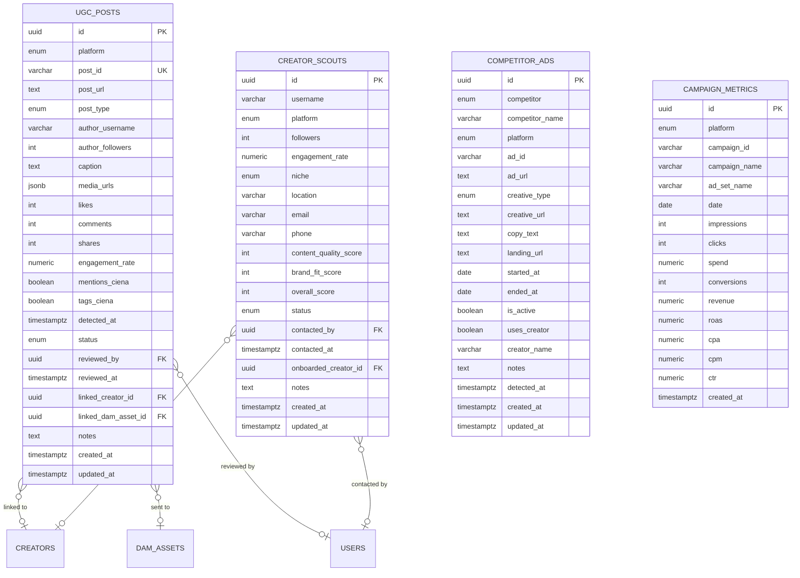

# Marketing Intelligence — Module Spec

> **Module:** Marketing Intelligence
> **Schema:** `marketing`
> **Route prefix:** `/api/v1/marketing`
> **Admin UI route group:** `(admin)/marketing/*`
> **Version:** 1.0
> **Date:** March 2026
> **Status:** Approved
> **Replaces:** None (new capability — no existing tool; Manus AI is Caio's separate tool, NOT integrated into Ambaril)
> **References:** [DATABASE.md](../../architecture/DATABASE.md), [API.md](../../architecture/API.md), [AUTH.md](../../architecture/AUTH.md), [NOTIFICATIONS.md](../../platform/NOTIFICATIONS.md), [GLOSSARY.md](../../dev/GLOSSARY.md), [Creators spec](./creators.md), [CRM spec](./crm.md)

---

## 1. Purpose & Scope

The Marketing Intelligence module is the **marketing data aggregation and analysis hub** of Ambaril. It consolidates user-generated content (UGC) monitoring, new creator discovery, competitor ad tracking, and paid campaign performance reporting into a single interface. This module empowers the marketing and creative teams to make data-driven decisions about content strategy, influencer partnerships, competitive positioning, and ad spend optimization.

The module is organized into **4 sub-modules:**

| Sub-module | Description |
|-----------|-------------|
| **UGC Monitor** | Detects and catalogs Instagram @cienalab mentions, tags, and #cienalab hashtag usage. Surfaces organic content for review, potential Partnership Ad flagging, and DAM archival. |
| **Creator Scout** | Discovers and evaluates potential nano-influencers for the CIENA Creators program. Tracks outreach status from discovery through onboarding. |
| **Competitor Watch** | Monitors competitor advertising activity via Meta Ad Library API. Tracks ad creatives, copy, and creator usage for Baw, Approve, High, and Disturb. |
| **Ads Reporting** | Aggregates Meta (Facebook/Instagram) and Google Ads campaign metrics. Calculates ROAS, CPA, CPM, CTR. Generates weekly reports for ClawdBot. |

**Primary users:**
- **Caio (PM):** Full access — reviews UGC, manages scout pipeline, monitors competitors, analyzes ad performance, generates reports
- **Yuri + Sick (Creative):** Read-only access to all marketing data — browse UGC for design inspiration, review competitor creatives, view campaign metrics. **Cannot** modify, approve, or delete any data.
- **Marcus (Admin):** Full access (same as PM)

**Important note:** Manus AI is a separate tool used personally by Caio for marketing research and ideation. It is **NOT** integrated into Ambaril and has no API connection or data flow with this module. This distinction is documented here to prevent confusion during development.

**Out of scope:** This module does NOT handle creator onboarding or commission management (owned by Creators module). It does NOT dispatch marketing messages (owned by CRM + WhatsApp Engine). It does NOT manage the DAM storage layer (owned by DAM module — Marketing Intelligence sends approved UGC to DAM via API). It does NOT manage actual ad creation or spend (done manually in Meta Ads Manager and Google Ads by Caio).

---

## 2. User Stories

### 2.1 UGC Monitor Stories

| # | As a... | I want to... | So that... | Acceptance Criteria |
|---|---------|-------------|-----------|-------------------|
| US-01 | PM (Caio) | Review detected UGC posts in a feed view | I can quickly scan organic mentions and decide which to amplify | Grid view of detected posts with image thumbnail, author username, engagement metrics (likes, comments, shares, engagement_rate), status badge (new/reviewed/approved/rejected/partnership_ad); filters by status, platform, date range, minimum engagement rate |
| US-02 | PM (Caio) | Approve a UGC post and optionally send it to DAM | I can build a library of approved brand content | "Aprovar" button changes status to `approved`; "Enviar ao DAM" button creates a `dam.assets` record with tags (ugc, collection name, author username); sets `linked_dam_asset_id` on the UGC post |
| US-03 | PM (Caio) | Flag a UGC post as potential Partnership Ad | I can track which organic posts could be promoted via Meta Partnership Ads | "Partnership Ad" button sets status to `partnership_ad`; this is a flag only — actual ad creation happens manually in Meta Ads Manager |
| US-04 | PM (Caio) | Link a UGC post to an existing creator | I can track which creators generate organic mentions beyond coupon sales | "Vincular ao Creator" opens creator selector; sets `linked_creator_id`; auto-matches are highlighted (when UGC author matches a `creators.creators.instagram_handle`) |
| US-05 | PM (Caio) | Receive an alert when a viral UGC post is detected | I can quickly capitalize on high-engagement organic content | When engagement_rate > 5% AND likes > 500: emit `ugc.viral_detected` Flare event -> Discord `#alertas` notification + in-app notification to PM and Creative roles |
| US-06 | Creative (Yuri/Sick) | Browse approved UGC in a gallery view | I can find inspiration for new designs and campaigns | Read-only gallery filtered to `status=approved`; shows image, author, caption, metrics; click to view full detail; NO action buttons (read-only) |

### 2.2 Creator Scout Stories

| # | As a... | I want to... | So that... | Acceptance Criteria |
|---|---------|-------------|-----------|-------------------|
| US-07 | PM (Caio) | Discover potential new creators in a searchable table | I can identify nano-influencers who fit the CIENA brand | Table with columns: username, platform, followers, engagement_rate, niche, overall_score, status; filters by niche, min followers, min engagement, status; sortable by score |
| US-08 | PM (Caio) | Add a potential creator to the scout pipeline | I can track outreach and onboarding progress | "Adicionar Scout" form: username, platform, followers, engagement_rate, niche, location, email/phone (if available); initial status = `discovered` |
| US-09 | PM (Caio) | Score a scouted creator on content quality and brand fit | I can objectively compare potential creators | Edit form with `content_quality_score` (1-10) and `brand_fit_score` (1-10); `overall_score` auto-calculated based on weighted formula; sortable by overall_score |
| US-10 | PM (Caio) | Onboard a scouted creator directly into the Creators module | I can seamlessly convert a prospect into an active creator | "Onboard" button transitions status to `onboarded`; auto-creates `creators.creators` record with pre-filled data (username, email, phone); sets `onboarded_creator_id` link; redirects to Creators module for approval |
| US-11 | PM (Caio) | Track outreach status (contacted, interested, not interested) | I know where each prospect is in the pipeline | Status transitions: discovered -> contacted (with contacted_by and contacted_at) -> interested / not_interested -> onboarded / rejected |

### 2.3 Competitor Watch Stories

| # | As a... | I want to... | So that... | Acceptance Criteria |
|---|---------|-------------|-----------|-------------------|
| US-12 | PM (Caio) | View competitor ads in a timeline view | I can track what competitors are running and when | Timeline/card view: each card shows competitor logo/name, creative thumbnail, copy preview, date range (started_at to ended_at), platform badge (Meta/Google), "Uses Creator" badge if applicable; filter by competitor, platform, date range, active status |
| US-13 | PM (Caio) | Add notes to a competitor ad | I can capture insights and strategic observations | Notes text field on ad detail; saves to `notes` column; visible to PM and Creative |
| US-14 | Creative (Yuri/Sick) | Browse competitor creatives for design research | I can understand the competitive visual landscape | Read-only access to competitor ads timeline; can view creative images/videos, copy text, landing URLs; NO edit or note-adding capability |

### 2.4 Ads Reporting Stories

| # | As a... | I want to... | So that... | Acceptance Criteria |
|---|---------|-------------|-----------|-------------------|
| US-15 | PM (Caio) | View a KPI dashboard with total spend, revenue, ROAS, and CPA | I can quickly assess overall paid media performance | KPI cards: total spend (period), total revenue (attributed), overall ROAS, average CPA; filterable by date range and platform |
| US-16 | PM (Caio) | Compare ROAS across campaigns side by side | I can identify underperforming campaigns and reallocate budget | Comparison table: campaigns listed with all metrics (impressions, clicks, spend, conversions, revenue, ROAS, CPA, CPM, CTR); sortable by any column; highlight campaigns with ROAS < 2.0 in red |
| US-17 | PM (Caio) | View trend charts for ROAS and spend over time | I can identify trends and seasonality in paid performance | Line charts: ROAS trend (daily/weekly/monthly), spend vs revenue bar chart, CPA trend; date range selector; platform filter |
| US-18 | PM (Caio) | Preview the weekly marketing report before it goes to ClawdBot | I can verify the data before it is posted to Discord | Formatted report preview matching the ClawdBot `#report-marketing` format; editable notes section; "Enviar" button (manual override of auto-generated report) |
| US-19 | PM (Caio) | Trigger a manual data import from Meta/Google | I can refresh metrics on-demand outside the daily sync schedule | "Importar agora" button triggers immediate API pull from Meta Marketing API and/or Google Ads API; shows import status and last import timestamp |
| US-20 | Creative (Yuri/Sick) | View ads performance metrics | I can understand which creative approaches perform best | Read-only access to all Ads Reporting views; can sort, filter, view charts; NO import or edit capability |

---

## 3. Data Model

### 3.1 Entity Relationship Diagram



### 3.2 Enums

```sql
CREATE TYPE marketing.social_platform AS ENUM ('instagram', 'tiktok');
CREATE TYPE marketing.ad_platform AS ENUM ('meta', 'google');
CREATE TYPE marketing.post_type AS ENUM ('image', 'video', 'carousel', 'story', 'reel');
CREATE TYPE marketing.ugc_status AS ENUM ('new', 'reviewed', 'approved', 'rejected', 'partnership_ad');
CREATE TYPE marketing.creative_type AS ENUM ('image', 'video', 'carousel');
CREATE TYPE marketing.competitor_name AS ENUM ('baw', 'approve', 'high', 'disturb', 'other');
CREATE TYPE marketing.scout_niche AS ENUM ('streetwear', 'fashion', 'lifestyle', 'urban', 'music');
CREATE TYPE marketing.experiment_result AS ENUM ('a_won', 'b_won', 'inconclusive', 'ongoing');
CREATE TYPE marketing.scout_status AS ENUM (
    'discovered', 'contacted', 'interested',
    'not_interested', 'onboarded', 'rejected'
);
```

---

## 3. Database Schema

All tables live in the `marketing` PostgreSQL schema. Full column definitions are in [DATABASE.md](../../architecture/DATABASE.md) section 4.x. Below is the **complete reference** with all columns, types, and constraints.

### 3.1 marketing.ugc_posts

| Column | Type | Constraints | Description |
|--------|------|-------------|-------------|
| id | UUID | PK, DEFAULT gen_random_uuid() | UUID v7 |
| platform | marketing.social_platform | NOT NULL | instagram or tiktok |
| post_id | VARCHAR(100) | NOT NULL, UNIQUE | Platform-native post ID (deduplication key) |
| post_url | TEXT | NOT NULL | Full URL to the post |
| post_type | marketing.post_type | NOT NULL | image, video, carousel, story, reel |
| author_username | VARCHAR(100) | NOT NULL | Username of the post author |
| author_followers | INTEGER | NULL | Follower count at detection time |
| caption | TEXT | NULL | Post caption text |
| media_urls | JSONB | NULL | Array of media URLs: `["https://...", ...]` |
| likes | INTEGER | NOT NULL DEFAULT 0 | Like count at detection time |
| comments | INTEGER | NOT NULL DEFAULT 0 | Comment count at detection time |
| shares | INTEGER | NULL | Share/send count (if available from API) |
| engagement_rate | NUMERIC(5,2) | NOT NULL DEFAULT 0 | Calculated: (likes + comments) / author_followers * 100 |
| mentions_ciena | BOOLEAN | NOT NULL DEFAULT FALSE | Whether post mentions @cienalab in caption |
| tags_ciena | BOOLEAN | NOT NULL DEFAULT FALSE | Whether post tags @cienalab in the image/video |
| detected_at | TIMESTAMPTZ | NOT NULL | When the system first detected this post |
| status | marketing.ugc_status | NOT NULL DEFAULT 'new' | new, reviewed, approved, rejected, partnership_ad |
| reviewed_by | UUID | NULL, FK global.users(id) | Admin/PM who reviewed the post |
| reviewed_at | TIMESTAMPTZ | NULL | When the review happened |
| linked_creator_id | UUID | NULL, FK creators.creators(id) | Linked creator (if author is a known creator) |
| linked_dam_asset_id | UUID | NULL, FK dam.assets(id) | Linked DAM asset (if sent to DAM) |
| notes | TEXT | NULL | Internal notes from reviewer |
| created_at | TIMESTAMPTZ | NOT NULL DEFAULT NOW() | |
| updated_at | TIMESTAMPTZ | NOT NULL DEFAULT NOW() | |

**Indexes:**

```sql
CREATE UNIQUE INDEX idx_ugc_post_id ON marketing.ugc_posts (post_id);
CREATE INDEX idx_ugc_status ON marketing.ugc_posts (status);
CREATE INDEX idx_ugc_platform ON marketing.ugc_posts (platform);
CREATE INDEX idx_ugc_detected ON marketing.ugc_posts (detected_at DESC);
CREATE INDEX idx_ugc_engagement ON marketing.ugc_posts (engagement_rate DESC);
CREATE INDEX idx_ugc_author ON marketing.ugc_posts (author_username);
CREATE INDEX idx_ugc_linked_creator ON marketing.ugc_posts (linked_creator_id) WHERE linked_creator_id IS NOT NULL;
CREATE INDEX idx_ugc_viral ON marketing.ugc_posts (engagement_rate, likes)
    WHERE status = 'new' AND engagement_rate > 5 AND likes > 500;
```

### 3.2 marketing.competitor_ads

| Column | Type | Constraints | Description |
|--------|------|-------------|-------------|
| id | UUID | PK, DEFAULT gen_random_uuid() | |
| competitor | marketing.competitor_name | NOT NULL | baw, approve, high, disturb, other |
| competitor_name | VARCHAR(100) | NOT NULL | Display name (e.g., "Baw Clothing", "Approve") |
| platform | marketing.ad_platform | NOT NULL | meta or google |
| ad_id | VARCHAR(100) | NOT NULL | Platform-native ad ID |
| ad_url | TEXT | NULL | URL to view the ad in Ad Library |
| creative_type | marketing.creative_type | NOT NULL | image, video, carousel |
| creative_url | TEXT | NULL | URL to the creative asset (image/video) |
| copy_text | TEXT | NULL | Ad copy / text content |
| landing_url | TEXT | NULL | Landing page URL the ad drives to |
| started_at | DATE | NULL | When the ad started running (from Ad Library) |
| ended_at | DATE | NULL | When the ad stopped running (NULL if still active) |
| is_active | BOOLEAN | NOT NULL DEFAULT TRUE | Whether the ad is currently running |
| uses_creator | BOOLEAN | NOT NULL DEFAULT FALSE | Whether the ad features a creator/influencer |
| creator_name | VARCHAR(100) | NULL | Name/handle of featured creator (if applicable) |
| notes | TEXT | NULL | Internal strategic notes |
| detected_at | TIMESTAMPTZ | NOT NULL | When the system first detected this ad |
| created_at | TIMESTAMPTZ | NOT NULL DEFAULT NOW() | |
| updated_at | TIMESTAMPTZ | NOT NULL DEFAULT NOW() | |

**Indexes:**

```sql
CREATE UNIQUE INDEX idx_competitor_ads_platform_id ON marketing.competitor_ads (platform, ad_id);
CREATE INDEX idx_competitor_ads_competitor ON marketing.competitor_ads (competitor);
CREATE INDEX idx_competitor_ads_platform ON marketing.competitor_ads (platform);
CREATE INDEX idx_competitor_ads_active ON marketing.competitor_ads (is_active) WHERE is_active = TRUE;
CREATE INDEX idx_competitor_ads_detected ON marketing.competitor_ads (detected_at DESC);
CREATE INDEX idx_competitor_ads_started ON marketing.competitor_ads (started_at DESC);
```

### 3.3 marketing.campaign_metrics

| Column | Type | Constraints | Description |
|--------|------|-------------|-------------|
| id | UUID | PK, DEFAULT gen_random_uuid() | |
| platform | marketing.ad_platform | NOT NULL | meta or google |
| campaign_id | VARCHAR(100) | NOT NULL | Platform-native campaign ID |
| campaign_name | VARCHAR(255) | NOT NULL | Campaign display name |
| ad_set_name | VARCHAR(255) | NULL | Ad set / ad group name (if applicable) |
| date | DATE | NOT NULL | Metrics date (daily granularity) |
| impressions | INTEGER | NOT NULL DEFAULT 0 | Total impressions |
| clicks | INTEGER | NOT NULL DEFAULT 0 | Total clicks |
| spend | NUMERIC(10,2) | NOT NULL DEFAULT 0 | Total spend in BRL |
| conversions | INTEGER | NOT NULL DEFAULT 0 | Total conversions (purchases) |
| revenue | NUMERIC(12,2) | NOT NULL DEFAULT 0 | Total attributed revenue in BRL |
| roas | NUMERIC(6,2) | NULL | Return on ad spend: revenue / spend |
| cpa | NUMERIC(10,2) | NULL | Cost per acquisition: spend / conversions |
| cpm | NUMERIC(10,2) | NULL | Cost per mille: (spend / impressions) * 1000 |
| ctr | NUMERIC(6,4) | NULL | Click-through rate: (clicks / impressions) * 100 |
| created_at | TIMESTAMPTZ | NOT NULL DEFAULT NOW() | |

**Indexes:**

```sql
CREATE UNIQUE INDEX idx_metrics_campaign_date ON marketing.campaign_metrics (platform, campaign_id, date);
CREATE INDEX idx_metrics_platform ON marketing.campaign_metrics (platform);
CREATE INDEX idx_metrics_date ON marketing.campaign_metrics (date DESC);
CREATE INDEX idx_metrics_campaign ON marketing.campaign_metrics (campaign_id);
CREATE INDEX idx_metrics_roas ON marketing.campaign_metrics (roas) WHERE roas IS NOT NULL;
```

### 3.4 marketing.experiments

| Column | Type | Constraints | Description |
|--------|------|-------------|-------------|
| id | UUID | PK, DEFAULT gen_random_uuid() | UUID v7 |
| hypothesis | TEXT | NOT NULL | The hypothesis being tested (e.g., "CTA 'Comprar' converts better than 'Garantir o seu'") |
| channel | VARCHAR(50) | NOT NULL | Experiment channel: ads, email, wa, checkout, social, website, other |
| variant_a | TEXT | NOT NULL | Description of variant A (control) |
| variant_b | TEXT | NOT NULL | Description of variant B (challenger) |
| result | marketing.experiment_result | NOT NULL DEFAULT 'ongoing' | a_won, b_won, inconclusive, ongoing |
| learning | TEXT | NULL | Key takeaway / what was learned from the experiment |
| started_at | TIMESTAMPTZ | NOT NULL | When the experiment started |
| ended_at | TIMESTAMPTZ | NULL | When the experiment concluded. NULL if ongoing. |
| created_by | UUID | NOT NULL, FK global.users(id) | Who created this experiment record |
| created_at | TIMESTAMPTZ | NOT NULL DEFAULT NOW() | |
| updated_at | TIMESTAMPTZ | NOT NULL DEFAULT NOW() | |
| deleted_at | TIMESTAMPTZ | NULL | Soft delete |

**Indexes:**

```sql
CREATE INDEX idx_experiments_channel ON marketing.experiments (channel);
CREATE INDEX idx_experiments_result ON marketing.experiments (result);
CREATE INDEX idx_experiments_started ON marketing.experiments (started_at DESC);
CREATE INDEX idx_experiments_created_by ON marketing.experiments (created_by);
CREATE INDEX idx_experiments_active ON marketing.experiments (result) WHERE result = 'ongoing';
```

### 3.5 marketing.creator_scouts

| Column | Type | Constraints | Description |
|--------|------|-------------|-------------|
| id | UUID | PK, DEFAULT gen_random_uuid() | |
| username | VARCHAR(100) | NOT NULL | Social media username |
| platform | marketing.social_platform | NOT NULL | instagram or tiktok |
| followers | INTEGER | NOT NULL | Follower count at discovery |
| engagement_rate | NUMERIC(5,2) | NOT NULL | Engagement rate at discovery |
| niche | marketing.scout_niche | NOT NULL | streetwear, fashion, lifestyle, urban, music |
| location | VARCHAR(255) | NULL | City/state location (e.g., "Sao Paulo, SP") |
| email | VARCHAR(255) | NULL | Contact email (if discovered) |
| phone | VARCHAR(20) | NULL | Contact phone (if discovered) |
| content_quality_score | INTEGER | NULL, CHECK (content_quality_score BETWEEN 1 AND 10) | Manual quality score by PM |
| brand_fit_score | INTEGER | NULL, CHECK (brand_fit_score BETWEEN 1 AND 10) | Manual brand fit score by PM |
| overall_score | INTEGER | NOT NULL DEFAULT 0 | Computed: weighted average of engagement, quality, brand fit |
| status | marketing.scout_status | NOT NULL DEFAULT 'discovered' | discovered, contacted, interested, not_interested, onboarded, rejected |
| contacted_by | UUID | NULL, FK global.users(id) | Who reached out to this prospect |
| contacted_at | TIMESTAMPTZ | NULL | When outreach was made |
| onboarded_creator_id | UUID | NULL, FK creators.creators(id) | Link to creators.creators if onboarded |
| notes | TEXT | NULL | Internal notes about the prospect |
| created_at | TIMESTAMPTZ | NOT NULL DEFAULT NOW() | |
| updated_at | TIMESTAMPTZ | NOT NULL DEFAULT NOW() | |

**Indexes:**

```sql
CREATE UNIQUE INDEX idx_scouts_username_platform ON marketing.creator_scouts (username, platform);
CREATE INDEX idx_scouts_status ON marketing.creator_scouts (status);
CREATE INDEX idx_scouts_niche ON marketing.creator_scouts (niche);
CREATE INDEX idx_scouts_score ON marketing.creator_scouts (overall_score DESC);
CREATE INDEX idx_scouts_engagement ON marketing.creator_scouts (engagement_rate DESC);
CREATE INDEX idx_scouts_onboarded ON marketing.creator_scouts (onboarded_creator_id) WHERE onboarded_creator_id IS NOT NULL;
```

---

## 4. Business Rules

### 4.1 UGC Detection & Processing

| # | Rule | Detail |
|---|------|--------|
| R1 | **UGC detection polling** | Background job polls Instagram Graph API every 15 minutes for: (a) @cienalab mentions in captions, (b) @cienalab tags on photos/videos, (c) #cienalab hashtag usage. Uses `ig_mention` and `ig_hashtag_search` endpoints. |
| R2 | **New post creation** | Each newly detected post creates a `marketing.ugc_posts` row with `status=new`. If the post mentions @cienalab, `mentions_ciena=true`. If it tags @cienalab, `tags_ciena=true`. Both can be true simultaneously. |
| R3 | **Engagement rate calculation** | `engagement_rate = (likes + comments) / author_followers * 100`. If `author_followers` is 0 or NULL, set `engagement_rate = 0`. Rate is calculated at detection time and not updated. |
| R4 | **Viral threshold detection** | If a new UGC post has `engagement_rate > 5.0` AND `likes > 500`: emit `ugc.viral_detected` Flare event. Event triggers: (a) Discord `#alertas` notification with post preview, (b) in-app notification to `pm` and `creative` roles. Priority: High. |
| R5 | **UGC approval and DAM integration** | When PM approves a UGC post and selects "Enviar ao DAM": create a `dam.assets` record via DAM module API with tags `["ugc", "{collection_name}", "{author_username}"]`. Store the returned `dam.assets.id` in `ugc_posts.linked_dam_asset_id`. |
| R6 | **Partnership Ad flag** | When PM sets status to `partnership_ad`, this is a **flag only**. No automated action follows. Actual ad creation via Meta Partnership Ads is done manually by Caio in Meta Ads Manager. The flag helps track which organic posts were amplified. |
| R7 | **Auto-link to creator** | On UGC post detection, if `author_username` (case-insensitive) matches any `creators.creators.instagram_handle`: auto-set `linked_creator_id` to that creator's ID. UGC posts from known creators are also counted toward their engagement in the Creators module (but do NOT auto-award points — that is handled by the Creators module's own Instagram polling, which shares the same API data). |

### 4.2 Competitor Watch

| # | Rule | Detail |
|---|------|--------|
| R8 | **Ad Library polling** | Background job polls Meta Ad Library API daily at 06:00 BRT for ad activity from configured competitor page IDs. Currently tracked: **Baw Clothing**, **Approve**, **High Company**, **Disturb**. Page IDs configured via environment variable `COMPETITOR_PAGE_IDS`. |
| R9 | **New ad detection** | For each ad returned by the API: if `ad_id` does not exist in `marketing.competitor_ads`, create new row with `is_active=true`. If `ad_id` exists and is still returned, update metrics/dates if changed. |
| R10 | **Ad deactivation** | Ads previously stored as `is_active=true` that are no longer returned by the Ad Library API on a given poll are marked `is_active=false` and `ended_at = current_date`. This indicates the competitor stopped running the ad. |
| R11 | **Creator usage flag** | If the ad creative or copy text mentions an influencer/creator (detected by keyword matching or manual flag by PM), set `uses_creator=true` and record `creator_name`. This helps track competitor influencer strategy. |

### 4.3 Ads Reporting

| # | Rule | Detail |
|---|------|--------|
| R12 | **Campaign metrics import** | Background job imports campaign metrics daily at 07:00 BRT from: (a) Meta Marketing API (Facebook/Instagram campaigns), (b) Google Ads API (Google campaigns). Imports daily granularity data for the previous day. |
| R13 | **ROAS calculation** | `roas = revenue / spend`. If `spend = 0`, set `roas = NULL`. ROAS is calculated per campaign per day and also aggregated in the dashboard view. |
| R14 | **Underperforming campaign flag** | Campaigns with `roas < 2.0` over the last 7 days (aggregated) are visually highlighted in the dashboard as underperforming (red indicator). No automated action — this is informational for Caio to act on manually in the ad platforms. |
| R15 | **CPA calculation** | `cpa = spend / conversions`. If `conversions = 0`, set `cpa = NULL`. |
| R16 | **CPM calculation** | `cpm = (spend / impressions) * 1000`. If `impressions = 0`, set `cpm = NULL`. |
| R17 | **CTR calculation** | `ctr = (clicks / impressions) * 100`. If `impressions = 0`, set `ctr = NULL`. |

### 4.4 Creator Scout Scoring

| # | Rule | Detail |
|---|------|--------|
| R18 | **Overall score formula** | `overall_score = (engagement_rate_normalized * 40) + (content_quality_score * 30) + (brand_fit_score * 30)`. Where `engagement_rate_normalized` maps the raw engagement_rate to a 1-10 scale: 0-1% = 1, 1-2% = 3, 2-3% = 5, 3-5% = 7, 5-8% = 9, 8%+ = 10. |
| R19 | **Score recalculation** | `overall_score` is recalculated automatically whenever `content_quality_score` or `brand_fit_score` is updated. If either quality or brand fit score is NULL, only the engagement component is used (scaled to 100). |
| R20 | **Scout to creator onboarding** | When scout status changes to `onboarded`: (1) auto-create `creators.creators` record with pre-filled data from scout (username as `instagram_handle`, email, phone), (2) set `creators.creators.status = 'pending'` (still requires admin approval in Creators module), (3) set `marketing.creator_scouts.onboarded_creator_id` to the new creator's ID. |

### 4.5 Weekly Report Generation

| # | Rule | Detail |
|---|------|--------|
| R21 | **Auto-generation schedule** | Weekly report is auto-generated every Sunday at 20:00 BRT for the ClawdBot `#report-marketing` post on Monday at 09:00 BRT. |
| R22 | **Report content** | The weekly report includes: (a) UGC summary (new mentions count, viral posts, top UGC by engagement), (b) Creator Scout pipeline status (new discoveries, outreach count, onboarded count), (c) Competitor Watch highlights (new ads detected, notable creative trends), (d) Ads Performance summary (total spend, total revenue, overall ROAS, best/worst campaigns by ROAS, week-over-week trends). |
| R23 | **Report format** | Report is formatted as structured markdown matching the ClawdBot `#report-marketing` template. ClawdBot queries the `/reports/weekly-report` endpoint to fetch the formatted report and posts it to Discord. |

### 4.6 Product Mining (Demand Score)

| # | Rule | Detail |
|---|------|--------|
| R-MINE.1 | **Demand score formula** | Each product receives a `demand_score` (0-100) calculated as a weighted combination of normalized signals: `demand_score = (page_views_norm × 0.30) + (conversion_rate_norm × 0.25) + (social_mentions_norm × 0.20) + (cart_adds_norm × 0.15) + (wishlist_norm × 0.10)`. Each signal is normalized to a 0-100 scale relative to the maximum value across all active products in the period. |
| R-MINE.2 | **Signal weights** | `page_views` weight = 0.30 (strongest demand indicator by volume), `conversion_rate` weight = 0.25 (purchase intent), `social_mentions` weight = 0.20 (organic buzz), `cart_adds` weight = 0.15 (consideration without purchase — unfulfilled intent), `wishlist` weight = 0.10 (weakest signal, often unavailable). |
| R-MINE.3 | **Wishlist redistribution** | If wishlist data is unavailable (no Shopify wishlist app installed), the 0.10 weight is redistributed proportionally: `page_views` becomes 0.333, `conversion_rate` becomes 0.278, `social_mentions` becomes 0.222, `cart_adds` becomes 0.167. |
| R-MINE.4 | **Missed opportunity detection** | Products with `demand_score >= 60` AND `erp.inventory.quantity_available = 0` are flagged as "Oportunidade Perdida" (missed opportunity). These are highlighted at the top of the dashboard. This data feeds into the ERP revenue leak system — emits event `product_mining.opportunity_lost` with estimated daily revenue loss based on historical conversion rate × average selling price. |
| R-MINE.5 | **Score refresh frequency** | Demand scores are recalculated daily at 05:00 BRT via background job. Scores use a rolling 30-day window for all signals. Products marked as `is_active = false` (discontinued) in `erp.skus` are excluded from scoring but displayed with status "Descontinuado" for reference. |
| R-MINE.6 | **Social mentions matching** | A UGC post in `marketing.ugc_posts` is counted as a social mention for a product if the post caption contains the product name (fuzzy match, case-insensitive) OR the product SKU code OR a known product hashtag. Matching is best-effort — one post can mention multiple products. |

### 4.7 Social Selling Analytics (R-SOCIAL)

| # | Rule | Detail |
|---|------|--------|
| R-SOCIAL.1 | **Social selling funnel tracking** | Track the full social selling conversion funnel: creator content detected (`marketing.ugc_posts` or `creators.content_detections`) → engagement metrics (likes, comments, shares on the content) → link clicks (tracked via UTM or short links in creator bio/stories) → coupon usage (`creators.sales_attributions` where `coupon_code` matches a creator coupon) → confirmed sale (`checkout.orders` with `status = 'paid'`). Each step is logged with timestamp for funnel drop-off analysis. |
| R-SOCIAL.2 | **Attribution via creator coupon** | When a confirmed sale uses a creator coupon code, the system traces back to detected content posts from that creator within a 7-day attribution window (`sale.created_at - 7 days <= content.detected_at <= sale.created_at`). If one or more content posts are found within the window, the sale is attributed to social selling. If no content is detected in the window, the sale is attributed to direct coupon (non-social). |
| R-SOCIAL.3 | **Social selling metrics** | Key metric: `Social Selling Conversion Rate = confirmed_sales_via_creator_content / total_creator_content_detected × 100`. Calculated per-creator and in aggregate. Additional per-creator metrics: total content pieces, total engagement generated, total link clicks, total coupon uses, total confirmed sales, total revenue attributed, avg engagement-to-sale conversion time. |
| R-SOCIAL.4 | **Dashboard card — Social Selling Funnel** | A dedicated card in the Marketing panel of the Dashboard (Beacon) shows the Social Selling funnel as a horizontal bar visualization with drop-off percentages at each step: Content Detected (100%) → Engagement (X%) → Link Clicks (Y%) → Coupon Used (Z%) → Sale Confirmed (W%). Filterable by creator, date range, and campaign. Clicking on any step drills into the detail list. |

---

## 5. UI Screens & Wireframes

### 5.1 UGC Feed

```
┌─────────────────────────────────────────────────────────────────────────────┐
│  Marketing > UGC Monitor                                                   │
├─────────────────────────────────────────────────────────────────────────────┤
│                                                                             │
│  Filtros: Status [Todos ▼] Plataforma [Todos ▼] Periodo [Ultimos 30d ▼]  │
│           Engagement min: [___%]                                           │
│                                                                             │
│  ┌──────────────────┐  ┌──────────────────┐  ┌──────────────────┐         │
│  │ ┌──────────────┐ │  │ ┌──────────────┐ │  │ ┌──────────────┐ │         │
│  │ │              │ │  │ │              │ │  │ │              │ │         │
│  │ │   [imagem]   │ │  │ │   [imagem]   │ │  │ │   [video]    │ │         │
│  │ │              │ │  │ │              │ │  │ │              │ │         │
│  │ └──────────────┘ │  │ └──────────────┘ │  │ └──────────────┘ │         │
│  │ @usuario1         │  │ @joaodasilva     │  │ @fashiongirl     │         │
│  │ 234 likes 12 comm│  │ 1.2k likes 89 co│  │ 567 likes 34 com│         │
│  │ Eng: 3.2%         │  │ Eng: 8.1% VIRAL │  │ Eng: 4.5%        │         │
│  │ [Novo]             │  │ [Aprovado]       │  │ [Novo]           │         │
│  │                    │  │ Vinculado: @joao │  │                  │         │
│  └──────────────────┘  └──────────────────┘  └──────────────────┘         │
│                                                                             │
│  ┌──────────────────┐  ┌──────────────────┐  ┌──────────────────┐         │
│  │ ┌──────────────┐ │  │ ┌──────────────┐ │  │ ┌──────────────┐ │         │
│  │ │              │ │  │ │              │ │  │ │              │ │         │
│  │ │   [imagem]   │ │  │ │   [reel]     │ │  │ │   [carousel] │ │         │
│  │ │              │ │  │ │              │ │  │ │              │ │         │
│  │ └──────────────┘ │  │ └──────────────┘ │  │ └──────────────┘ │         │
│  │ @streetguy        │  │ @mariast         │  │ @urbanstyle      │         │
│  │ 89 likes 5 comm  │  │ 456 likes 23 com│  │ 123 likes 8 comm│         │
│  │ Eng: 1.8%         │  │ Eng: 5.3% VIRAL │  │ Eng: 2.1%        │         │
│  │ [Rejeitado]        │  │ [Partnership Ad] │  │ [Revisado]       │         │
│  └──────────────────┘  └──────────────────┘  └──────────────────┘         │
│                                                                             │
│  Mostrando 1-6 de 89 posts                           [Anterior] [Proximo] │
└─────────────────────────────────────────────────────────────────────────────┘
```

### 5.2 UGC Detail

```
┌─────────────────────────────────────────────────────────────────────────────┐
│  Marketing > UGC > Post por @joaodasilva                          [Voltar] │
├──────────────────────────────────┬──────────────────────────────────────────┤
│                                  │                                          │
│  POST PREVIEW                    │  INFORMACOES                            │
│  ─────────────────────           │  ──────────────────                     │
│  ┌──────────────────────────┐    │  Autor: @joaodasilva                    │
│  │                          │    │  Seguidores: 14.800                     │
│  │                          │    │  Plataforma: Instagram                  │
│  │       [imagem do post]   │    │  Tipo: Imagem                          │
│  │                          │    │  Detectado em: 14/03/2026 15:30        │
│  │                          │    │                                          │
│  └──────────────────────────┘    │  METRICAS                              │
│                                  │  ──────────────────                     │
│  LEGENDA                         │  Likes: 1.200                           │
│  ─────────────────────           │  Comentarios: 89                        │
│  "Novo look com a @cienalab      │  Compartilhamentos: 34                  │
│   Drop 10 esta insano!           │  Taxa de engajamento: 8.1% (VIRAL)     │
│   #cienalab #drop10              │                                          │
│   #streetwear #sp"               │  VINCULACOES                            │
│                                  │  ──────────────────                     │
│  Status: [Aprovado]              │  Creator: @joaodasilva (auto-link)     │
│                                  │  DAM: asset-uuid-123 (enviado)         │
│                                  │                                          │
│                                  │  NOTAS                                  │
│                                  │  ──────────────────                     │
│                                  │  ┌──────────────────────────────────┐   │
│                                  │  │ Otimo conteudo. Potencial para  │   │
│                                  │  │ Partnership Ad se performance    │   │
│                                  │  │ organica se mantiver.            │   │
│                                  │  └──────────────────────────────────┘   │
│                                  │                                          │
├──────────────────────────────────┴──────────────────────────────────────────┤
│                                                                             │
│  ACOES                                                                     │
│  [Aprovar]  [Rejeitar]  [Partnership Ad]  [Vincular Creator]              │
│  [Enviar ao DAM]  [Abrir no Instagram]                                    │
│                                                                             │
└─────────────────────────────────────────────────────────────────────────────┘
```

### 5.3 Creator Scout

```
┌─────────────────────────────────────────────────────────────────────────────┐
│  Marketing > Creator Scout                             [+ Adicionar Scout] │
├─────────────────────────────────────────────────────────────────────────────┤
│                                                                             │
│  Filtros: Nicho [Todos ▼] Status [Todos ▼] Min seguidores [____]          │
│           Min engagement [____%]   Ordenar por: [Score ▼]                  │
│                                                                             │
│  ┌──────────────┬──────────┬──────────┬──────────┬───────┬──────┬─────────┬──────────┐│
│  │ Username     │Plataforma│Seguidores│ Eng. %   │ Nicho │Score │ Status  │ Acoes    ││
│  ├──────────────┼──────────┼──────────┼──────────┼───────┼──────┼─────────┼──────────┤│
│  │ @newgirl_sp  │ Instagram│ 8.200    │ 6.3%     │Street.│ 82   │Descobert│[Contatar]││
│  │ @urbanking   │ Instagram│ 12.400   │ 4.1%     │ Urban │ 76   │Interest.│[Onboard] ││
│  │ @stylebr     │ TikTok   │ 23.000   │ 3.8%     │Fashion│ 71   │Contatado│[Marcar]  ││
│  │ @streetvibe  │ Instagram│ 5.600    │ 7.2%     │Street.│ 68   │Descobert│[Contatar]││
│  │ @modaflow    │ Instagram│ 15.000   │ 2.1%     │Lifest.│ 45   │Rejeitado│ —        ││
│  │ @rapstyle    │ Instagram│ 9.800    │ 5.5%     │ Music │ 79   │Onboarded│ Ver      ││
│  └──────────────┴──────────┴──────────┴──────────┴───────┴──────┴─────────┴──────────┘│
│                                                                             │
│  PIPELINE                                                                  │
│  ┌──────────┐  ┌──────────┐  ┌──────────┐  ┌──────────┐  ┌──────────┐    │
│  │Descobert.│  │Contatados│  │Interest. │  │Onboarded │  │Rejeitados│    │
│  │    12    │→ │    5     │→ │    3     │→ │    2     │  │    4     │    │
│  └──────────┘  └──────────┘  └──────────┘  └──────────┘  └──────────┘    │
│                                                                             │
│  Mostrando 1-6 de 26 scouts                          [Anterior] [Proximo] │
└─────────────────────────────────────────────────────────────────────────────┘
```

### 5.4 Competitor Watch

```
┌─────────────────────────────────────────────────────────────────────────────┐
│  Marketing > Competitor Watch                                              │
├─────────────────────────────────────────────────────────────────────────────┤
│                                                                             │
│  Filtros: Concorrente [Todos ▼] Plataforma [Todos ▼] Status [Ativos ▼]   │
│           Periodo: [01/03/2026] a [17/03/2026]                            │
│                                                                             │
│  TIMELINE                                                                  │
│                                                                             │
│  17/03 ─────────────────────────────────────────────────────────────       │
│  ┌─────────────────────────────────────────────────────────────────────┐    │
│  │  BAW CLOTHING                                 Meta  |  Ativo       │    │
│  │  ┌──────────┐  "Colecao inverno 2026. Frete gratis para todo     │    │
│  │  │ [imagem] │   Brasil. Compre agora!"                            │    │
│  │  │ creative │   Landing: baw.com.br/inverno-2026                  │    │
│  │  └──────────┘   Inicio: 15/03  |  Tipo: Carousel                 │    │
│  │                 [Usa Creator: @baw_influencer]                     │    │
│  │                 Notas: Campanha forte com frete gratis + creator   │    │
│  └─────────────────────────────────────────────────────────────────────┘    │
│                                                                             │
│  15/03 ─────────────────────────────────────────────────────────────       │
│  ┌─────────────────────────────────────────────────────────────────────┐    │
│  │  APPROVE                                      Meta  |  Ativo       │    │
│  │  ┌──────────┐  "Nova drop. Pecas limitadas. Link na bio."        │    │
│  │  │ [video]  │   Landing: approve.com.br/drop-mar26                │    │
│  │  │ creative │   Inicio: 14/03  |  Tipo: Video                    │    │
│  │  └──────────┘   Sem creator                                       │    │
│  │                 Notas: —                                           │    │
│  └─────────────────────────────────────────────────────────────────────┘    │
│                                                                             │
│  12/03 ─────────────────────────────────────────────────────────────       │
│  ┌─────────────────────────────────────────────────────────────────────┐    │
│  │  DISTURB                                      Meta  |  Encerrado   │    │
│  │  ┌──────────┐  "Ate 40% off. So ate domingo."                    │    │
│  │  │ [imagem] │   Landing: disturb.com.br/sale                     │    │
│  │  │ creative │   Inicio: 08/03  |  Fim: 12/03  |  Tipo: Image    │    │
│  │  └──────────┘   Sem creator                                       │    │
│  └─────────────────────────────────────────────────────────────────────┘    │
│                                                                             │
│  Mostrando 3 de 18 anuncios                          [Anterior] [Proximo] │
└─────────────────────────────────────────────────────────────────────────────┘
```

### 5.5 Ads Dashboard

```
┌─────────────────────────────────────────────────────────────────────────────┐
│  Marketing > Ads Dashboard                              [Importar Agora]   │
├─────────────────────────────────────────────────────────────────────────────┤
│                                                                             │
│  Periodo: [01/03/2026] a [17/03/2026]   Plataforma: [Todas ▼]            │
│  Ultima importacao: 17/03/2026 07:00                                      │
│                                                                             │
│  KPIs                                                                      │
│  ┌──────────────┐  ┌──────────────┐  ┌──────────────┐  ┌──────────────┐   │
│  │ GASTO TOTAL  │  │ RECEITA      │  │ ROAS GERAL   │  │ CPA MEDIO    │   │
│  │ R$ 12.400    │  │ R$ 42.800    │  │ 3.45x        │  │ R$ 62,00     │   │
│  │ +8% vs prev  │  │ +22% vs prev │  │ +12% vs prev │  │ -5% vs prev  │   │
│  └──────────────┘  └──────────────┘  └──────────────┘  └──────────────┘   │
│                                                                             │
│  ROAS TREND (ultimos 30 dias)                                              │
│  ┌─────────────────────────────────────────────────────────────────────┐    │
│  │ 5.0x │                                                             │    │
│  │ 4.0x │         *    *                                              │    │
│  │ 3.0x │ ──────*────*────*────*──── target line (3.0x)              │    │
│  │ 2.0x │ *  *                   *    *    *                          │    │
│  │ 1.0x │                                       *                     │    │
│  │      └──────────────────────────────────────────────────           │    │
│  │       Feb 15  Feb 22  Mar 01  Mar 08  Mar 15                      │    │
│  └─────────────────────────────────────────────────────────────────────┘    │
│                                                                             │
│  CAMPANHAS                                                                 │
│  ┌─────────────────┬──────────┬──────────┬────────┬──────────┬───────┬──────────┐│
│  │ Campanha        │Plataforma│ Gasto    │ Receita│ ROAS     │ CPA   │ CTR      ││
│  ├─────────────────┼──────────┼──────────┼────────┼──────────┼───────┼──────────┤│
│  │ Drop 10 Launch  │ Meta     │ R$ 4.200 │R$18.9k │ 4.50x    │R$ 47  │ 2.8%     ││
│  │ Retargeting Mar │ Meta     │ R$ 3.100 │R$12.4k │ 4.00x    │R$ 52  │ 3.1%     ││
│  │ Brand Awareness │ Google   │ R$ 2.800 │ R$ 5.6k│ 2.00x    │R$ 93  │ 1.2%     ││
│  │ Remarketing     │ Google   │ R$ 1.500 │ R$ 3.2k│ 2.13x    │R$ 68  │ 1.8%     ││
│  │ Cold Traffic     │ Meta     │ R$ 800   │ R$ 780 │ 0.98x    │R$ 160 │ 0.6%     ││
│  │                 │          │          │        │ (BAIXO)  │       │          ││
│  └─────────────────┴──────────┴──────────┴────────┴──────────┴───────┴──────────┘│
│                                                                             │
│  [Exportar CSV]                                                            │
└─────────────────────────────────────────────────────────────────────────────┘
```

### 5.6 Mineracao de Produtos (Product Mining Dashboard)

```
┌─────────────────────────────────────────────────────────────────────────────┐
│  Marketing > Mineracao de Produtos                                         │
├─────────────────────────────────────────────────────────────────────────────┤
│                                                                             │
│  Periodo: [01/03/2026] a [26/03/2026]    [Atualizar Dados]                │
│                                                                             │
│  RESUMO                                                                    │
│  ┌──────────────┐  ┌──────────────┐  ┌──────────────┐  ┌──────────────┐   │
│  │ PRODUTOS     │  │ OPORTUNIDADES│  │ DEMAND SCORE │  │ FORA DE      │   │
│  │ ANALISADOS   │  │ PERDIDAS     │  │ MEDIO        │  │ ESTOQUE      │   │
│  │ 142          │  │ 8            │  │ 54.3         │  │ 12           │   │
│  └──────────────┘  └──────────────┘  └──────────────┘  └──────────────┘   │
│                                                                             │
│  OPORTUNIDADES PERDIDAS (demanda alta + estoque baixo/zero)               │
│  ┌─────────────────────────────────────────────────────────────────────┐    │
│  │  ⚠ Moletom Oversized Preto P — Demand Score 87 | Estoque: 0      │    │
│  │  ⚠ Camiseta Basic Off-White M — Demand Score 79 | Estoque: 2     │    │
│  │  ⚠ Calca Cargo Cinza G — Demand Score 72 | Estoque: 0            │    │
│  └─────────────────────────────────────────────────────────────────────┘    │
│                                                                             │
│  TABELA COMPLETA                                                           │
│  Filtros: Status [Todos ▼] Min Demand Score [____] Ordenar [Score ▼]     │
│                                                                             │
│  ┌───────────────────┬────────┬─────────┬────────┬──────────┬───────┬──────────┬─────────────┐│
│  │ Produto           │Visitas │Conversao│Mencoes │Cart Adds │D.Score│Est. Atual│ Status      ││
│  ├───────────────────┼────────┼─────────┼────────┼──────────┼───────┼──────────┼─────────────┤│
│  │ Moletom Over. P   │ 1.842  │ 4.2%    │ 12     │ 234      │ 87    │ 0        │⚠ Fora      ││
│  │ Camiseta Basic M  │ 1.456  │ 3.8%    │ 8      │ 189      │ 79    │ 2        │⚠ Critico   ││
│  │ Calca Cargo G     │ 1.123  │ 3.1%    │ 15     │ 156      │ 72    │ 0        │⚠ Fora      ││
│  │ Bone Aba Reta     │ 987    │ 5.1%    │ 3      │ 98       │ 65    │ 24       │ Em estoque  ││
│  │ Meia Pack x3      │ 654    │ 6.3%    │ 1      │ 67       │ 51    │ 89       │ Em estoque  ││
│  │ Jaqueta Corta V.  │ 234    │ 0.8%    │ 0      │ 12       │ 18    │ 45       │ Em estoque  ││
│  │ Regata Drop 8     │ 89     │ 0.0%    │ 0      │ 3        │ 7     │ 0        │Descontinuad.││
│  └───────────────────┴────────┴─────────┴────────┴──────────┴───────┴──────────┴─────────────┘│
│                                                                             │
│  Insight: Produtos com demand score > 60 e estoque = 0 representam        │
│  oportunidade de receita perdida. Dados alimentam ERP (revenue leak).     │
│                                                                             │
│  [Exportar CSV]                                                            │
└─────────────────────────────────────────────────────────────────────────────┘
```

**Data sources:**
- **Visitas (page views):** Shopify Analytics API — page views per product handle
- **Conversao (conversion rate):** `checkout.orders` confirmed / sessions with product view
- **Mencoes (social mentions):** `marketing.ugc_posts` where caption or hashtag references the product name/SKU
- **Cart Adds (cart additions without purchase):** `checkout.carts` with product added but cart status != `converted`
- **Wishlist:** Shopify wishlist data (if available via app); weight applied only when data exists, otherwise redistributed
- **Estoque Atual:** `erp.inventory.quantity_available`
- **Status:** Em estoque (qty > reorder_point) / Critico (qty <= 5 AND qty > 0) / Fora (qty = 0) / Descontinuado (SKU `is_active = false`)

**Demand Score calculation:** See Business Rule R-MINE.1 (Section 4.6).

**Insight logic:** Products with `demand_score >= 60` AND `quantity_available = 0` are flagged as "Oportunidade Perdida". These feed into the ERP revenue leak monitoring system (cross-module event `product_mining.opportunity_lost`).

### 5.7 Registro de Experimentos (Test Tracker)

```
┌─────────────────────────────────────────────────────────────────────────────┐
│  Marketing > Registro de Experimentos                  [+ Novo Experimento] │
├─────────────────────────────────────────────────────────────────────────────┤
│                                                                             │
│  Filtros: Canal [Todos ▼] Resultado [Todos ▼] Responsavel [Todos ▼]      │
│           Periodo: [01/01/2026] a [26/03/2026]                            │
│                                                                             │
│  RESUMO                                                                    │
│  ┌──────────────┐  ┌──────────────┐  ┌──────────────┐  ┌──────────────┐   │
│  │ TOTAL        │  │ A VENCEU     │  │ B VENCEU     │  │ EM ANDAMENTO │   │
│  │ 34           │  │ 14           │  │ 11           │  │ 4            │   │
│  └──────────────┘  └──────────────┘  └──────────────┘  └──────────────┘   │
│                                                                             │
│  ┌────┬──────────────────────────┬────────┬──────────┬──────────┬──────────┬──────────────────────────┬──────────┬───────────┐│
│  │ ID │ Hipotese                 │ Canal  │Variante A│Variante B│Resultado │ Aprendizado              │ Data     │Responsavel││
│  ├────┼──────────────────────────┼────────┼──────────┼──────────┼──────────┼──────────────────────────┼──────────┼───────────┤│
│  │ 34 │ CTA "Comprar" vs        │ Ads    │ Comprar  │ Garantir │Em andam. │ —                        │ 20/03/26 │ Caio      ││
│  │    │ "Garantir o seu"         │        │          │ o seu    │          │                          │          │           ││
│  │ 33 │ Frete gratis > R$199    │Checkout│ R$ 199   │ R$ 249   │ A venceu │ Threshold R$199 aumentou │ 15/03/26 │ Caio      ││
│  │    │ vs > R$249               │        │          │          │          │ conversao em 18%         │          │           ││
│  │ 32 │ WA recovery apos 1h     │ WA     │ 1h       │ 3h       │ B venceu │ 3h tem 22% mais          │ 10/03/26 │ Caio      ││
│  │    │ vs 3h                    │        │          │          │          │ recuperacao               │          │           ││
│  │ 31 │ Reels com musica vs     │ Social │ Com      │ Sem      │Inconcl.  │ Diferenca < 2%, nao      │ 05/03/26 │ Yuri      ││
│  │    │ sem musica               │        │ musica   │ musica   │          │ significativo            │          │           ││
│  └────┴──────────────────────────┴────────┴──────────┴──────────┴──────────┴──────────────────────────┴──────────┴───────────┘│
│                                                                             │
│  Proposito: base de conhecimento acumulativa — evitar repetir experimentos │
│  fracassados e preservar padroes vencedores.                               │
│                                                                             │
│  Mostrando 1-4 de 34 experimentos                   [Anterior] [Proximo]  │
└─────────────────────────────────────────────────────────────────────────────┘
```

### 5.8 Weekly Report Preview

```
┌─────────────────────────────────────────────────────────────────────────────┐
│  Marketing > Relatorio Semanal                                    [Enviar] │
├─────────────────────────────────────────────────────────────────────────────┤
│                                                                             │
│  Semana: 10/03/2026 - 16/03/2026                  Gerado: 16/03 20:00    │
│  Publicacao agendada: 17/03 09:00 (#report-marketing)                     │
│                                                                             │
│  PREVIEW DO RELATORIO                                                      │
│  ┌─────────────────────────────────────────────────────────────────────┐    │
│  │  # Relatorio de Marketing — Semana 10-16 Mar 2026                 │    │
│  │                                                                     │    │
│  │  ## UGC                                                            │    │
│  │  - 23 novas mencoes detectadas (+15% vs semana anterior)           │    │
│  │  - 2 posts virais (engagement > 5%)                                │    │
│  │  - Top UGC: @joaodasilva (8.1% eng, 1.2k likes)                  │    │
│  │  - 5 posts aprovados, 2 enviados ao DAM                          │    │
│  │                                                                     │    │
│  │  ## Creator Scout                                                  │    │
│  │  - 4 novos perfis descobertos                                     │    │
│  │  - 2 contatados, 1 interessado                                    │    │
│  │  - 0 onboarded esta semana                                        │    │
│  │                                                                     │    │
│  │  ## Competitor Watch                                               │    │
│  │  - Baw: 2 novos anuncios (1 com creator)                         │    │
│  │  - Approve: 1 novo anuncio (video, drop)                         │    │
│  │  - Disturb: encerrou campanha de sale                             │    │
│  │  - High: sem novos anuncios                                       │    │
│  │                                                                     │    │
│  │  ## Ads Performance                                                │    │
│  │  - Gasto total: R$ 12.400 (+8% vs anterior)                      │    │
│  │  - Receita total: R$ 42.800 (+22% vs anterior)                   │    │
│  │  - ROAS geral: 3.45x (+12% vs anterior)                          │    │
│  │  - Melhor campanha: Drop 10 Launch (ROAS 4.50x)                  │    │
│  │  - Pior campanha: Cold Traffic (ROAS 0.98x) — ATENCAO            │    │
│  └─────────────────────────────────────────────────────────────────────┘    │
│                                                                             │
│  NOTAS DO PM (opcionais — aparecem no final do relatorio)                 │
│  ┌─────────────────────────────────────────────────────────────────────┐    │
│  │ Semana forte com Drop 10. Cold Traffic precisa de revisao de      │    │
│  │ creative e audience. Baw apostando forte em creators.              │    │
│  └─────────────────────────────────────────────────────────────────────┘    │
│                                                                             │
│  [Regenerar]                                          [Enviar ao ClawdBot] │
└─────────────────────────────────────────────────────────────────────────────┘
```

---

## 6. API Endpoints

All endpoints follow the patterns defined in [API.md](../../architecture/API.md). Module prefix: `/api/v1/marketing`.

### 6.1 UGC Endpoints

| Method | Path | Auth | Description | Request Body / Query | Response |
|--------|------|------|-------------|---------------------|----------|
| GET | `/ugc` | Internal | List UGC posts (paginated, filterable) | `?cursor=&limit=25&status=&platform=&dateFrom=&dateTo=&engagementMin=&sort=-detectedAt` | `{ data: UgcPost[], meta: Pagination }` |
| GET | `/ugc/:id` | Internal | Get UGC post detail | — | `{ data: UgcPost }` |
| PUT | `/ugc/:id/review` | Internal (pm, admin) | Review UGC post | `{ status: 'approved' \| 'rejected' \| 'partnership_ad', notes? }` | `{ data: UgcPost }` |
| POST | `/ugc/:id/link-creator` | Internal (pm, admin) | Link UGC to a creator | `{ creator_id }` | `{ data: UgcPost }` |
| POST | `/ugc/:id/send-to-dam` | Internal (pm, admin) | Send approved UGC to DAM | `{ collection_name?, tags[]? }` | `{ data: { ugc_post: UgcPost, dam_asset_id: UUID } }` |

### 6.2 Competitor Endpoints

| Method | Path | Auth | Description | Request Body / Query | Response |
|--------|------|------|-------------|---------------------|----------|
| GET | `/competitors/ads` | Internal | List competitor ads (paginated, filterable) | `?cursor=&limit=25&competitor=&platform=&isActive=&dateFrom=&dateTo=&sort=-detectedAt` | `{ data: CompetitorAd[], meta: Pagination }` |
| GET | `/competitors/ads/:id` | Internal | Get competitor ad detail | — | `{ data: CompetitorAd }` |
| PUT | `/competitors/ads/:id` | Internal (pm, admin) | Update notes or creator flag | `{ notes?, uses_creator?, creator_name? }` | `{ data: CompetitorAd }` |

### 6.3 Campaign Metrics Endpoints

| Method | Path | Auth | Description | Request Body / Query | Response |
|--------|------|------|-------------|---------------------|----------|
| GET | `/campaigns/metrics` | Internal | Get campaign metrics (aggregated) | `?dateFrom=&dateTo=&platform=&groupBy=campaign\|day\|week\|month&sort=-roas` | `{ data: CampaignMetric[] }` |
| GET | `/campaigns/overview` | Internal | Get KPI overview | `?dateFrom=&dateTo=&platform=` | `{ data: { total_spend, total_revenue, overall_roas, avg_cpa, total_impressions, total_clicks, total_conversions } }` |
| POST | `/campaigns/import` | Internal (pm, admin) | Trigger manual metrics import | `{ platform?: 'meta' \| 'google' }` | `{ data: { status: 'importing', last_import_at } }` |

### 6.4 Creator Scout Endpoints

| Method | Path | Auth | Description | Request Body / Query | Response |
|--------|------|------|-------------|---------------------|----------|
| GET | `/scouts` | Internal | List scouts (paginated, filterable) | `?cursor=&limit=25&status=&niche=&minFollowers=&minEngagement=&sort=-overallScore` | `{ data: CreatorScout[], meta: Pagination }` |
| GET | `/scouts/:id` | Internal | Get scout detail | — | `{ data: CreatorScout }` |
| POST | `/scouts` | Internal (pm, admin) | Add new scout | `{ username, platform, followers, engagement_rate, niche, location?, email?, phone?, notes? }` | `201 { data: CreatorScout }` |
| PATCH | `/scouts/:id` | Internal (pm, admin) | Update scout | `{ content_quality_score?, brand_fit_score?, status?, notes?, contacted_by?, contacted_at? }` | `{ data: CreatorScout }` |
| POST | `/scouts/:id/onboard` | Internal (pm, admin) | Onboard scout into Creators module | — | `{ data: { scout: CreatorScout, creator_id: UUID } }` |
| DELETE | `/scouts/:id` | Internal (admin) | Delete scout record | — | `204` |

### 6.5 Report Endpoints

| Method | Path | Auth | Description | Request Body / Query | Response |
|--------|------|------|-------------|---------------------|----------|
| GET | `/reports/weekly` | Internal | Get latest weekly report | `?week=YYYY-WW` | `{ data: { content: string (markdown), generated_at, period_start, period_end } }` |
| POST | `/reports/generate` | Internal (pm, admin) | Force regenerate weekly report | `{ week?: 'YYYY-WW' }` | `{ data: { content: string, generated_at } }` |

---

## 7. Integrations

### 7.1 Inbound (data sources INTO Marketing Intelligence)

| Source | Data | Marketing Action |
|--------|------|-----------------|
| **Instagram Graph API** | @cienalab mentions, tags, #cienalab hashtag posts | Create `ugc_posts` records, calculate engagement_rate, auto-link to known creators, fire viral alerts |
| **Meta Ad Library API** | Competitor ad data (Baw, Approve, High, Disturb) | Create/update `competitor_ads` records, track active/inactive status |
| **Meta Marketing API** | Facebook/Instagram campaign metrics | Import daily `campaign_metrics` records (impressions, clicks, spend, conversions, revenue) |
| **Google Ads API** | Google campaign metrics | Import daily `campaign_metrics` records (same structure as Meta) |
| **Creators module** | Creator profiles (instagram_handle) | Auto-match UGC authors to known creators via instagram_handle lookup |

### 7.2 Outbound (Marketing Intelligence dispatches TO other modules/services)

| Target | Data / Action | Trigger |
|--------|--------------|---------|
| **Creators module** | Scout onboarding — auto-create `creators.creators` record | When scout status changes to `onboarded` |
| **DAM module** | Approved UGC — create `dam.assets` record with tags | When PM approves UGC and clicks "Enviar ao DAM" |
| **ClawdBot** (Discord) | Weekly marketing report for `#report-marketing` | Weekly report auto-generated Sunday 20:00 for Monday 09:00 post |
| **Dashboard** | Marketing analytics panel data | Dashboard queries marketing analytics endpoints |

### 7.3 Flare Events Emitted

| Event Key | Trigger | Channels | Recipients | Priority |
|-----------|---------|----------|------------|----------|
| `ugc.new_mention` | New @cienalab mention detected | _(none by default — too frequent)_ | — | — |
| `ugc.viral_detected` | UGC with engagement_rate > 5% AND likes > 500 | In-app, Discord `#alertas` | `pm`, `creative` | High |
| `ugc.approved` | PM approves UGC post | _(none by default)_ | — | — |
| `ugc.sent_to_dam` | UGC sent to DAM | In-app | `pm` | Low |
| `competitor.new_ad` | New competitor ad detected | In-app | `pm` | Low |
| `marketing.report_generated` | Weekly report generated | In-app | `pm` | Low |
| `marketing.import_completed` | Campaign metrics import finished | In-app | `pm` | Low |
| `marketing.import_failed` | Campaign metrics import failed | In-app, Discord `#alertas` | `admin`, `pm` | High |

---

## 8. Background Jobs

All jobs run via PostgreSQL job queue (`FOR UPDATE SKIP LOCKED`) + Vercel Cron. No Redis/BullMQ.

| Job Name | Queue | Schedule | Priority | Description |
|----------|-------|----------|----------|-------------|
| `marketing:ugc-polling` | `marketing` | Every 15 minutes | Medium | Poll Instagram Graph API for @cienalab mentions, tags, and #cienalab hashtag. Create new `ugc_posts` records. Calculate engagement_rate. Auto-link to known creators. Fire viral alerts if threshold met. Deduplicate by `post_id`. |
| `marketing:adlib-polling` | `marketing` | Daily at 06:00 BRT | Medium | Poll Meta Ad Library API for configured competitor page IDs. Create new `competitor_ads` records. Update existing records (active/inactive status, end dates). |
| `marketing:metrics-import-meta` | `marketing` | Daily at 07:00 BRT | Medium | Import previous day's campaign metrics from Meta Marketing API. Calculate derived metrics (ROAS, CPA, CPM, CTR). Upsert by `(platform, campaign_id, date)`. |
| `marketing:metrics-import-google` | `marketing` | Daily at 07:15 BRT | Medium | Import previous day's campaign metrics from Google Ads API. Same metric calculation and upsert logic as Meta. |
| `marketing:weekly-report` | `marketing` | Sunday at 20:00 BRT | Low | Generate weekly marketing report aggregating UGC, Scout, Competitor, and Ads data. Store formatted markdown. Available for ClawdBot to fetch on Monday 09:00. |

---

## 9. Permissions

From [AUTH.md](../../architecture/AUTH.md) section 3.4.x. Format: `{module}:{resource}:{action}`.

| Permission | admin | pm | creative | operations | support | finance | commercial | b2b | creator |
|-----------|-------|-----|----------|-----------|---------|---------|-----------|-----|---------|
| `marketing:ugc:read` | Y | Y | Y | -- | -- | -- | -- | -- | -- |
| `marketing:ugc:write` | Y | Y | -- | -- | -- | -- | -- | -- | -- |
| `marketing:ugc:delete` | Y | -- | -- | -- | -- | -- | -- | -- | -- |
| `marketing:competitors:read` | Y | Y | Y | -- | -- | -- | -- | -- | -- |
| `marketing:competitors:write` | Y | Y | -- | -- | -- | -- | -- | -- | -- |
| `marketing:campaigns:read` | Y | Y | Y | -- | -- | -- | -- | -- | -- |
| `marketing:campaigns:write` | Y | Y | -- | -- | -- | -- | -- | -- | -- |
| `marketing:scouts:read` | Y | Y | Y | -- | -- | -- | -- | -- | -- |
| `marketing:scouts:write` | Y | Y | -- | -- | -- | -- | -- | -- | -- |
| `marketing:scouts:delete` | Y | -- | -- | -- | -- | -- | -- | -- | -- |
| `marketing:reports:read` | Y | Y | Y | -- | -- | -- | -- | -- | -- |
| `marketing:reports:write` | Y | Y | -- | -- | -- | -- | -- | -- | -- |

**Notes:**
- `creative` (Yuri, Sick) has **read-only** access to ALL marketing data — UGC, competitors, campaign metrics, scouts, and reports. They can browse, filter, sort, and view details but cannot modify, approve, reject, or delete anything.
- `pm` (Caio) has full read/write to manage all aspects of marketing intelligence.
- Only `admin` (Marcus) can delete UGC records and scout records.
- All other roles (`operations`, `support`, `finance`, `commercial`, `b2b`, `creator`) have zero access.

---

## 10. Notifications (Flare Events)

See section 7.3 for the complete Flare events table. Key notification flows:

| Scenario | Channel | Message |
|----------|---------|---------|
| Viral UGC detected | Discord `#alertas` + In-app (pm, creative) | "UGC VIRAL detectado! @{author} — {engagement_rate}% engagement, {likes} likes. [Ver post]" |
| New competitor ad (Baw) | In-app (pm) | "Novo anuncio da Baw detectado no Meta. [Ver detalhes]" |
| Campaign metrics import failed | Discord `#alertas` + In-app (admin, pm) | "Falha na importacao de metricas do {platform}. Erro: {error_message}" |
| Weekly report ready | In-app (pm) | "Relatorio semanal de marketing gerado. [Ver preview]" |

---

## 11. Error Handling

All errors follow the standard envelope from [API.md](../../architecture/API.md) and error codes from [ERROR-HANDLING.md](../../platform/ERROR-HANDLING.md).

| Error Code | HTTP | When | User-facing Message |
|-----------|------|------|-------------------|
| `MKTG_UGC_NOT_FOUND` | 404 | UGC post ID does not exist | "Post UGC nao encontrado." |
| `MKTG_UGC_ALREADY_REVIEWED` | 409 | Attempting to review an already-reviewed post | "Este post ja foi revisado." |
| `MKTG_UGC_NOT_APPROVED` | 422 | Attempting to send non-approved UGC to DAM | "Somente posts aprovados podem ser enviados ao DAM." |
| `MKTG_UGC_ALREADY_IN_DAM` | 409 | UGC already has a linked DAM asset | "Este post ja foi enviado ao DAM." |
| `MKTG_COMPETITOR_NOT_FOUND` | 404 | Competitor ad ID does not exist | "Anuncio do concorrente nao encontrado." |
| `MKTG_SCOUT_NOT_FOUND` | 404 | Scout ID does not exist | "Scout nao encontrado." |
| `MKTG_SCOUT_DUPLICATE` | 409 | Scout with same username+platform exists | "Ja existe um scout com este perfil." |
| `MKTG_SCOUT_ALREADY_ONBOARDED` | 409 | Scout already onboarded | "Este scout ja foi integrado ao programa de creators." |
| `MKTG_SCOUT_INVALID_SCORE` | 422 | Score outside 1-10 range | "Score deve ser entre 1 e 10." |
| `MKTG_IMPORT_IN_PROGRESS` | 409 | Manual import triggered while another is running | "Uma importacao ja esta em andamento. Aguarde a conclusao." |
| `MKTG_IMPORT_FAILED` | 500 | API import from Meta/Google failed | "Falha ao importar metricas. Tente novamente ou verifique as credenciais." |
| `MKTG_REPORT_NOT_FOUND` | 404 | Weekly report for specified week not found | "Relatorio nao encontrado para esta semana." |

---

## 12. Testing Checklist

Following the testing strategy from [TESTING.md](../../platform/TESTING.md).

### 12.1 Unit Tests

- [ ] Engagement rate calculation: (likes + comments) / followers * 100
- [ ] Engagement rate edge case: followers = 0 returns 0
- [ ] Viral threshold detection: engagement_rate > 5% AND likes > 500
- [ ] Viral threshold edge case: engagement_rate = 5.0 exactly (should NOT trigger)
- [ ] Scout scoring formula: weighted average with engagement_rate_normalized (40%), quality (30%), brand_fit (30%)
- [ ] Scout scoring with NULL quality/brand_fit: only engagement component used
- [ ] Engagement rate normalization to 1-10 scale (all bands)
- [ ] ROAS calculation: revenue / spend
- [ ] ROAS edge case: spend = 0 returns NULL
- [ ] CPA calculation: spend / conversions
- [ ] CPA edge case: conversions = 0 returns NULL
- [ ] CPM calculation: (spend / impressions) * 1000
- [ ] CTR calculation: (clicks / impressions) * 100

### 12.2 Integration Tests

- [ ] Instagram API mock: poll returns new posts -> UGC records created with correct fields
- [ ] Instagram API mock: poll returns duplicate post_id -> silently skipped (no error, no duplicate)
- [ ] UGC auto-link: post author matches creator instagram_handle -> linked_creator_id set
- [ ] UGC approve -> send to DAM: creates dam.assets record, sets linked_dam_asset_id
- [ ] UGC viral detection: post exceeds threshold -> Flare event emitted
- [ ] Ad Library mock: new ads detected -> competitor_ads records created
- [ ] Ad Library mock: existing ad no longer returned -> is_active set to false
- [ ] Meta Marketing API mock: metrics imported -> campaign_metrics records created with derived fields
- [ ] Google Ads API mock: metrics imported -> campaign_metrics records created
- [ ] Scout create: valid data creates scout with correct overall_score
- [ ] Scout onboard: creates creators.creators record, sets onboarded_creator_id
- [ ] Scout onboard: duplicate onboard attempt returns 409
- [ ] Weekly report generation: produces formatted markdown with all 4 sections

### 12.3 E2E Tests

- [ ] UGC lifecycle: Instagram post detected -> appears in UGC feed -> PM approves -> sends to DAM -> DAM asset visible
- [ ] Scout lifecycle: PM adds scout -> scores quality/brand fit -> contacts -> marks interested -> onboards -> creator appears in Creators module
- [ ] Competitor tracking: ad library detects new Baw ad -> appears in timeline -> PM adds notes -> ad stops running -> marked inactive
- [ ] Ads reporting: metrics imported -> dashboard shows correct KPIs -> ROAS trend chart renders -> underperforming campaign highlighted
- [ ] Weekly report: auto-generated on schedule -> preview available -> posted to ClawdBot

### 12.4 Performance Tests

- [ ] UGC feed with 1000+ posts: paginated response under 200ms
- [ ] Campaign metrics aggregation across 6 months of daily data: under 2 seconds
- [ ] Competitor ads timeline with 500+ ads: paginated response under 200ms
- [ ] Instagram polling processing 100+ new posts per cycle: completes within 30 seconds
- [ ] Weekly report generation: completes within 1 minute

---

## 13. Migration Path

### 13.1 Clean Start

There is no existing tool to migrate from. Marketing Intelligence is a new capability in Ambaril. Manus AI (Caio's separate tool) has no data export or integration point — it remains a standalone personal tool.

### 13.2 Historical Data Import

| Data Source | Import Method | Notes |
|------------|--------------|-------|
| Historical Meta Ads data | CSV bulk import via `/campaigns/import` or direct database seed | Caio can export from Meta Ads Manager |
| Historical Google Ads data | CSV bulk import | Caio can export from Google Ads |
| Known competitors | Pre-seed `competitor_ads` table with initial competitor page IDs | Configure `COMPETITOR_PAGE_IDS` env var |
| Existing creator scout notes | Manual entry or CSV import into `creator_scouts` | Low volume, manual acceptable |

### 13.3 API Credentials Setup

Before the module can operate, the following API credentials must be configured:

| API | Environment Variable | Documentation |
|-----|---------------------|---------------|
| Instagram Graph API | `INSTAGRAM_ACCESS_TOKEN`, `INSTAGRAM_BUSINESS_ACCOUNT_ID` | Meta Developer Portal |
| Meta Ad Library API | `META_AD_LIBRARY_ACCESS_TOKEN` | Meta Developer Portal |
| Meta Marketing API | `META_MARKETING_ACCESS_TOKEN`, `META_AD_ACCOUNT_ID` | Meta Developer Portal |
| Google Ads API | `GOOGLE_ADS_DEVELOPER_TOKEN`, `GOOGLE_ADS_CLIENT_ID`, `GOOGLE_ADS_CLIENT_SECRET`, `GOOGLE_ADS_REFRESH_TOKEN`, `GOOGLE_ADS_CUSTOMER_ID` | Google Ads API Console |

---

## 14. Open Questions

| # | Question | Impact | Proposed Answer |
|---|----------|--------|-----------------|
| OQ-1 | What is the TikTok API integration timeline? | Medium — TikTok is growing in Brazilian streetwear audience | Defer to v1.1. Start with Instagram only. Evaluate TikTok for Business API availability and add `platform='tiktok'` support for UGC and Scout. |
| OQ-2 | Should we auto-detect creative type (image/video/carousel) from competitor ads? | Low — currently set from Ad Library metadata | Use Ad Library API metadata. If not available, default to `image` and allow manual override. |
| OQ-3 | Should competitor analysis include pricing intelligence (monitoring competitor product prices)? | Medium — valuable for positioning but adds web scraping complexity | Out of scope for v1.0. Would require web scraping (fragile, legal concerns). Manual tracking in notes field is sufficient initially. |
| OQ-4 | Should UGC engagement metrics be periodically refreshed (likes/comments may grow after initial detection)? | Low — initial metrics are sufficient for ranking | Not in v1.0. Engagement is captured at detection time. A future enhancement could re-poll top posts after 24h/48h for updated metrics. |
| OQ-5 | Should the weekly report be customizable (sections, date ranges, comparisons)? | Low — standardized format is sufficient for now | Fixed format for v1.0 matching ClawdBot template. PM notes field provides customization. |
| OQ-6 | Should we track Meta Ad Library for "Partnership Ads" (branded content) specifically? | Medium — could surface competitor creator partnerships | Partially covered by `uses_creator` flag. Dedicated Partnership Ad filtering could be added in v1.1 if Ad Library API provides this metadata. |

---

*This module spec is the source of truth for Marketing Intelligence implementation. All development, review, and QA should reference this document. Changes require review from Marcus (admin) or Caio (pm).*
