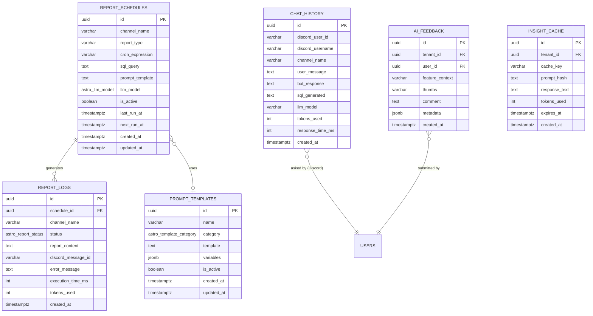

# Astro — Intelligence Layer

> **Module:** Astro (AI Brain + Discord Runtime)
> **Schema:** `astro`
> **Route prefix:** `/api/v1/astro`
> **Admin UI route group:** `(admin)/astro/*`
> **Version:** 2.0 (April 2026 — absorbs Pulse/clawdbot)
> **Status:** Approved
> **Replaces:** Astro v1.0 (AI Brain only) + Pulse (Discord Bot) — merged into single intelligence module
> **References:** [genius.md](./genius.md), [DATABASE.md](../../architecture/DATABASE.md), [API.md](../../architecture/API.md), [AUTH.md](../../architecture/AUTH.md), [NOTIFICATIONS.md](../../platform/NOTIFICATIONS.md)

---

## 1. Purpose & Scope

Astro é a **camada de inteligência unificada do Ambaril**. Processa dados de todos os módulos, consome o Genius como memória de negócio, e entrega inteligência por múltiplos canais: web dashboard, Discord, WhatsApp, email, e Mensageria.

**Por que o merge com Pulse:**
Pulse (Discord Bot) e Astro (AI Brain) eram dois módulos com LLM routing próprio, SQL generation e lógica de inteligência redundante. A separação "brain vs mouth" era uma abstração que não correspondia à implementação real. Astro absorve todas as capacidades do Pulse, e Discord passa a ser um canal de delivery — assim como web, WhatsApp e email já eram.

**Canais de entrega:**

| Canal                    | Quem usa            | O que faz                                      |
| ------------------------ | ------------------- | ---------------------------------------------- |
| **Web Dashboard** (chat) | Marcus, Caio, todos | Queries em linguagem natural, insights, AI gen |
| **Discord**              | Time inteiro        | Reports automáticos + #geral-ia chat + alertas |
| **WhatsApp** (alertas)   | Marcus, Caio        | Alertas críticos real-time                     |
| **Email** (briefs)       | Marcus              | Weekly Executive Brief automático              |
| **Mensageria Inbox**     | Slimgust            | AI Draft de resposta + self-service bot        |

**Activation Channels (Priority):**

| Priority | Canal                               | Versão                                          |
| -------- | ----------------------------------- | ----------------------------------------------- |
| **P0**   | Ambaril web platform                | v1                                              |
| **P1**   | Discord                             | v1 (reports + #geral-ia + alertas)              |
| **P2**   | Business channels (Telegram, Slack) | v2 (apenas canais de time, nunca apps pessoais) |

**Constraint:** Astro NÃO é ativado via WhatsApp pessoal ou apps de mensagem pessoal. Apenas canais de comunicação de negócio/equipe.

**Out of scope:** Astro não modifica dados de nenhum módulo — o canal Discord é estritamente read-only para dados operacionais. Astro não substitui o admin UI para tarefas operacionais.

---

## 2. Capabilities

### 2.1 AI Generation

- **AI Image Generation (AI Studio):** briefing → DALL-E/FLUX. 20 gerações/dia por tenant. Output depositado no DAM automaticamente.
- **AI Video Generation:** Luma AI Ray 2. Image-to-video para reels/stories/ads. 5 gerações/dia por tenant. Output → DAM.
- **Creative Script Generation:** AI gera roteiros/briefings para criativos usando Brand Brain + Buyer Personas do CRM. Streaming via SSE.
- **Gerador de Descrição de Produto:** Ao cadastrar produto no ERP: AI gera descrição SEO, copy para Instagram, copy para WhatsApp VIP, hashtags. Humanização fortíssima — NÃO pode parecer IA. Supervisão: Slimgust redige/edita, Caio aprova. Claude Sonnet (tier `reasoning`) com prompt template + contexto de marca.
- **Precificação Assistida por IA:** Análise baseada em custo de produção, margem desejada, preços de concorrentes (Marketing Competitor Watch), performance histórica. Simulador de preço no ERP, inteligência de pricing no Astro. Requer 2-3 meses de dados reais.

### 2.2 Reasoning & Insights

- **Module Context:** 12+ strings de contexto por módulo. Astro sabe onde o usuário está e adapta respostas. Exemplo: no ERP, Astro fala de pedidos; no PLM, fala de produção.
- **Insight Cache:** Cache de insights AI no banco (24h TTL). Reduz custo e latência. Cleanup via Vercel Cron.
- **Cross-Module Analysis:** Conecta ERP + PLM + CRM + Marketing para insights que nenhum módulo vê sozinho.
- **AI Feedback:** Thumbs up/down + comentário opcional em toda resposta AI. Dashboard de qualidade para admin.

### 2.3 Workflow Engine

Platform-wide automation builder. Caio cria automações sem dev: triggers → conditions → actions. Exemplos:

- "SE pedido pago E cliente é VIP → enviar WhatsApp personalizado"
- "SE estoque < 10 E produção em andamento → não alertar, apenas logar"
- "SE troca aprovada → gerar etiqueta reversa + enviar WA com instruções"

### 2.4 Discord Runtime (ex-Pulse/clawdbot)

> **Runtime:** Implementado via fork do **Hermes Agent** (`ambaril/astro-agent`) — ver [Seção 18](#18-runtime-architecture-hermes-fork) e [ADR-015](../../architecture/ADR-015-ASTRO-RUNTIME.md). Cada tenant tem 1 VPS com profiles isolados por collaborador.

- **8 reports agendados** (cron Hermes) → 7 canais #report-\*
- **Alertas real-time** → #alertas (via webhooks do Ambaril → Hermes)
- **#geral-ia chat interativo:** linguagem natural → MCP tools do Ambaril → dados reais formatados
- **Bot personality (SOUL.md):** direto, dados primeiro, pt-BR informal, sem emoji exceto arrows de tendência
- **Admin UI:** scheduling de reports, logs, chat history, prompt templates, bot settings
- **Rate limiting por Discord user/canal** (Hermes gateway)
- **MCP tools** para dados de negócio (substitui `astro_readonly` SQL direto)
- **LLM routing:** Gemini 2.5 Flash para reports (SQL pré-escrito, tier `structured`), Claude Sonnet para chat (SQL gerado, tier `reasoning`)
- **Per-collaborator profiles:** cada membro da equipe tem seu próprio agente com SOUL.md personalizado

### 2.5 Changelog In-App

Página de novidades in-app com badge no sidebar. Tabela `platform.changelog`. Mostra features novas, updates, fixes.

---

## 3. Knowledge Source: Genius

Astro consome Genius para contexto de negócio em cada operação AI.

**Como Astro consome Genius:**

| Level                          | Quando                                           | Token Budget    |
| ------------------------------ | ------------------------------------------------ | --------------- |
| **L0** (tenant summary)        | Toda chamada AI — sempre injetado                | ~200-500 tokens |
| **L1** (sector map + keywords) | Quando Astro decide qual setor é relevante       | ~1-2k tokens    |
| **L2** (BM25 search)           | Ao responder questões específicas de negócio     | ~2-5k tokens    |
| **L3** (full entry)            | Análise profunda, queries cross-module complexas | ~5-20k tokens   |

**Regra de verificação:** Astro consome apenas entries com `status = 'verified'` por default. Entries com `status = 'draft'` podem ser acessadas com flag explícito, com aviso ao usuário de que o conteúdo não está verificado.

**Conflito live vs KB:** Se SQL ao vivo diverge de entry verified do Genius, Astro prioriza o dado live e sinaliza o Genius para revisão no próximo ciclo de linting. Resposta ao usuário inclui: "dado pode estar desatualizado na base de conhecimento".

Astro também mantém estado operacional próprio:

1. **Insight Cache** (24h TTL): insights AI cacheados para reduzir custo e latência
2. **AI Feedback**: thumbs up/down para tracking de qualidade
3. **Module Context**: 12+ strings de contexto por módulo

---

## 4. User Stories

### 4.1 AI Generation & Reasoning

| #     | Como...     | Quero...                                                                      | Para...                                            | Critério de Aceitação                                                                     |
| ----- | ----------- | ----------------------------------------------------------------------------- | -------------------------------------------------- | ----------------------------------------------------------------------------------------- |
| US-01 | Marcus      | Fazer perguntas em linguagem natural no chat do Dashboard                     | Obter respostas contextualizadas sobre meu negócio | Chat responde em pt-BR, usa Genius L0+L1 como contexto, cita fonte quando vem do Genius   |
| US-02 | Sick/Yuri   | Gerar imagens de produto com AI (briefing de texto → DALL-E/FLUX)             | Acelerar produção de conteúdo visual               | UI de geração com campos de briefing. Output salvo no DAM automaticamente. Limite: 20/dia |
| US-03 | Sick/Yuri   | Gerar vídeos curtos via Luma AI (image-to-video)                              | Criar reels/stories/ads sem produção de vídeo      | Upload de imagem → vídeo 5-10s. Output → DAM. Limite: 5/dia                               |
| US-04 | Marcus/Caio | Gerar scripts de criativo com base no Brand Brain + personas do CRM           | Reduzir tempo de briefing para criativos           | Input: tipo de conteúdo, canal, objetivo. Output: script estruturado em streaming SSE     |
| US-05 | Slimgust    | Ter sugestão de resposta AI ao abrir um ticket no Mensageria                  | Reduzir tempo de resposta a clientes               | Draft AI aparece ao abrir ticket, editável, Caio aprova antes de enviar                   |
| US-06 | Marcus      | Ver todos os insights de AI feedbacks (thumbs up/down) em painel de qualidade | Entender onde o Astro erra mais                    | Dashboard com % positivo/negativo por tipo de operação, comentários opcionais             |

### 4.2 Report Consumer Stories (Discord)

| #     | Como...  | Quero...                                                               | Para...                                                      | Critério de Aceitação                                                                                                                                                            |
| ----- | -------- | ---------------------------------------------------------------------- | ------------------------------------------------------------ | -------------------------------------------------------------------------------------------------------------------------------------------------------------------------------- |
| US-07 | Marcus   | Receber relatório diário de vendas às 08:00 no #report-vendas          | Avaliar performance de ontem antes do dia começar            | Embed verde às 08:00 BRT com: faturamento total (R$), pedidos, ticket médio, top 5 produtos por receita, top 5 SKUs por unidades, receita por pagamento, comparação dia anterior |
| US-08 | Marcus   | Receber resumo semanal de vendas toda Segunda no #report-vendas        | Revisar semana completa e comparar com semana anterior       | Embed Segunda 08:00 com métricas agregadas + comparação semana-a-semana                                                                                                          |
| US-09 | Pedro    | Receber relatório financeiro diário às 08:30 no #report-financeiro     | Monitorar saldo MP, aprovação e chargebacks sem abrir painel | Embed azul 08:30 BRT com: saldo MP, taxa aprovação %, liquidações pendentes, chargebacks count + R$, fees                                                                        |
| US-10 | Tavares  | Receber relatório de estoque diário às 08:15 no #report-estoque        | Ver quais SKUs precisam atenção antes da reunião de produção | Embed 08:15 BRT com: SKUs no ponto de reposição, SKUs críticos (<=5 un), SKUs zerados, top 5 depletação, valor total em estoque, análise de tiers (Ouro/Prata/Bronze)            |
| US-11 | Tavares  | Receber relatório de produção diário às 08:45 no #report-producao      | Rastrear progresso das OPs e identificar atrasos de relance  | Embed laranja 08:45 BRT com: OPs ativas, etapas atrasadas, etapas finalizando hoje, atrasos de fornecedor, rework pendente                                                       |
| US-12 | Caio     | Receber relatório de marketing diário às 09:00 no #report-marketing    | Rastrear performance de campanha e engajamento diariamente   | Embed roxo 09:00 BRT com: seguidores IG + engajamento, UGCs detectados, top UGC, creators (vendas + top), ad spend, ROAS, CPA                                                    |
| US-13 | Caio     | Receber relatório comercial semanal Segunda 09:30 no #report-comercial | Revisar volume B2B e pipeline da semana                      | Embed teal Segunda 09:30 com: pedidos B2B, receita B2B, top lojistas, pipeline (aprovações pendentes), novas consultas                                                           |
| US-14 | All team | Receber relatório de suporte semanal Sexta 17:00 no #report-suporte    | Revisar métricas de atendimento antes do fim de semana       | Embed cinza Sexta 17:00 com: tickets abertos/resolvidos, tempo médio resposta, tempo médio resolução, top tópicos, SLA breaches, trocas abertas                                  |

### 4.3 Alert Stories (Discord)

| #     | Como...  | Quero...                                                                       | Para...                                                      | Critério de Aceitação                                                                                                                                        |
| ----- | -------- | ------------------------------------------------------------------------------ | ------------------------------------------------------------ | ------------------------------------------------------------------------------------------------------------------------------------------------------------ |
| US-15 | Tavares  | Receber alerta real-time no #alertas quando SKU chegar a estoque crítico       | Agir imediatamente para evitar stockout                      | Embed em ≤10s do Flare event. Vermelho para crítico, amarelo para warning. SKU code, produto, quantidade, velocidade, dias estimados zero. @mentions Tavares |
| US-16 | All team | Receber alerta quando API externa cair (Focus NFe, Melhor Envio, Mercado Pago) | Saber imediatamente quando integrações estão quebradas       | Embed em ≤10s. Vermelho. Nome da API, tipo de erro, timestamp, operações afetadas                                                                            |
| US-17 | Marcus   | Receber alerta quando taxa de conversão cair abaixo de threshold               | Investigar e intervir em problemas de checkout imediatamente | Embed quando conversão cai abaixo do threshold configurado. Amarelo. Taxa atual, média 24h, contagem de sessões                                              |
| US-18 | Marcus   | Receber alerta quando spike de vendas for detectado durante um drop            | Monitorar performance do drop em real-time                   | Embed quando taxa de vendas supera 2x o normal. Azul. Vendas em 10 min, receita, comparação                                                                  |

### 4.4 Interactive Chat Stories (Discord)

| #     | Como...         | Quero...                                                                                        | Para...                                                | Critério de Aceitação                                                                                                    |
| ----- | --------------- | ----------------------------------------------------------------------------------------------- | ------------------------------------------------------ | ------------------------------------------------------------------------------------------------------------------------ |
| US-19 | Caio            | Perguntar "qual foi o ROAS da ultima campanha?" no #geral-ia e receber resposta com dados reais | Obter dados de performance sem navegar no painel       | Bot responde em ≤10s. Gera SQL contra tabelas de marketing. Retorna ROAS, ad spend, receita atribuída, período           |
| US-20 | Marcus          | Perguntar "quais os top 10 produtos por margem esse mes?" no #geral-ia                          | Identificar rapidamente nossos produtos mais rentáveis | Bot gera SQL com JOIN erp.skus + erp.margin_calculations. Retorna lista rankeada com produto, SKU, margem %              |
| US-21 | Tavares         | Perguntar "quais ordens de producao estao atrasadas?" no #geral-ia                              | Ter lista rápida sem abrir o módulo PLM                | Bot gera SQL contra plm.production_orders + plm.production_stages. Retorna lista com nome, data esperada, dias de atraso |
| US-22 | Any team member | Fazer pergunta não-data como "como funciona o calculo de RFM?" no #geral-ia                     | Obter resposta de conhecimento geral do bot            | Bot detecta que não é query de dados. Responde com conhecimento geral usando Sonnet                                      |

### 4.5 Admin Stories (Discord)

| #     | Como... | Quero...                                                | Para...                                                          | Critério de Aceitação                                                                                                                  |
| ----- | ------- | ------------------------------------------------------- | ---------------------------------------------------------------- | -------------------------------------------------------------------------------------------------------------------------------------- |
| US-23 | Marcus  | Ver e editar agendamentos de reports no admin UI        | Ajustar timing, habilitar/desabilitar reports sem tocar código   | Tabela com todos os schedules, toggle, cron expression, último status, próximo run. Modal de edição com query editor e template editor |
| US-24 | Marcus  | Ver logs de execução de reports com conteúdo completo   | Auditar o que foi enviado ao Discord e debugar falhas            | Lista cronológica filtrável por canal, status (success/failed/partial), data. Click para ver conteúdo completo                         |
| US-25 | Caio    | Buscar histórico de chat do #geral-ia                   | Encontrar respostas anteriores e rastrear o que o time perguntou | Log pesquisável com usuário Discord, pergunta, resposta bot, SQL gerado, timestamp                                                     |
| US-26 | Marcus  | Editar templates de prompt usados pelo Astro no Discord | Refinar output e personalidade do bot sem mudanças de código     | Lista de templates por categoria (report/chat/alert). Edição com texto, variáveis preview, botão de teste                              |
| US-27 | Marcus  | Disparar manualmente um report para qualquer canal      | Forçar um report fora do horário agendado para testes ou demanda | Botão "Executar Agora" em cada linha de schedule. Executa imediatamente e envia para Discord. Logado como run manual                   |

---

## 5. Data Model

### 5.1 Entity Relationship Diagram



### 5.2 Enums

```sql
CREATE TYPE astro.llm_model AS ENUM ('gemini_flash', 'sonnet');
CREATE TYPE astro.report_status AS ENUM ('success', 'failed', 'partial');
CREATE TYPE astro.template_category AS ENUM ('report', 'chat', 'alert');
CREATE TYPE astro.thumbs AS ENUM ('up', 'down');
```

### 5.3 astro.report_schedules

| Coluna          | Tipo            | Constraints                     | Descrição                                                               |
| --------------- | --------------- | ------------------------------- | ----------------------------------------------------------------------- |
| id              | UUID            | PK, DEFAULT gen_random_uuid()   | UUID v7                                                                 |
| channel_name    | VARCHAR(50)     | NOT NULL                        | Discord channel name (ex: "report-vendas")                              |
| report_type     | VARCHAR(50)     | NOT NULL                        | Identificador do report (ex: "daily_sales")                             |
| cron_expression | VARCHAR(50)     | NOT NULL                        | Cron em fuso BRT (ex: "0 8 \* \* \*" para 08:00 diário)                 |
| sql_query       | TEXT            | NOT NULL                        | SQL pré-escrito. Usa placeholders `{{period_start}}` e `{{period_end}}` |
| prompt_template | TEXT            | NOT NULL                        | Template LLM com placeholder `{{data}}` e `{{period}}`                  |
| llm_model       | astro.llm_model | NOT NULL DEFAULT 'gemini_flash' | Reports usam Gemini Flash (tier `structured`)                           |
| is_active       | BOOLEAN         | NOT NULL DEFAULT TRUE           | Toggle para habilitar/desabilitar                                       |
| last_run_at     | TIMESTAMPTZ     | NULL                            | Último run bem-sucedido. NULL se nunca executou                         |
| next_run_at     | TIMESTAMPTZ     | NULL                            | Próxima execução pré-computada. Atualizado após cada run                |
| created_at      | TIMESTAMPTZ     | NOT NULL DEFAULT NOW()          |                                                                         |
| updated_at      | TIMESTAMPTZ     | NOT NULL DEFAULT NOW()          |                                                                         |

```sql
CREATE INDEX idx_astro_schedules_channel ON astro.report_schedules (channel_name);
CREATE INDEX idx_astro_schedules_active ON astro.report_schedules (is_active) WHERE is_active = TRUE;
CREATE INDEX idx_astro_schedules_next_run ON astro.report_schedules (next_run_at ASC) WHERE is_active = TRUE;
CREATE UNIQUE INDEX idx_astro_schedules_type ON astro.report_schedules (report_type);
```

### 5.4 astro.report_logs

| Coluna             | Tipo                | Constraints                             | Descrição                                             |
| ------------------ | ------------------- | --------------------------------------- | ----------------------------------------------------- |
| id                 | UUID                | PK                                      | UUID v7                                               |
| schedule_id        | UUID                | NOT NULL, FK astro.report_schedules(id) | Schedule que gerou este log                           |
| channel_name       | VARCHAR(50)         | NOT NULL                                | Canal Discord (denormalizado para eficiência)         |
| status             | astro.report_status | NOT NULL                                | success/failed/partial                                |
| report_content     | TEXT                | NOT NULL                                | Texto completo que foi (ou seria) enviado ao Discord  |
| discord_message_id | VARCHAR(50)         | NULL                                    | Discord message ID se enviado com sucesso             |
| error_message      | TEXT                | NULL                                    | Detalhes do erro se status failed/partial             |
| execution_time_ms  | INTEGER             | NOT NULL                                | Tempo total (SQL + LLM + Discord send)                |
| tokens_used        | INTEGER             | NULL                                    | Tokens LLM consumidos (Gemini Flash ou Claude Sonnet) |
| created_at         | TIMESTAMPTZ         | NOT NULL DEFAULT NOW()                  | Append-only — nunca atualizado                        |

> **Imutabilidade:** Report logs são append-only. Reports com falha criam nova entrada no retry — não atualizam a original.

```sql
CREATE INDEX idx_astro_logs_schedule ON astro.report_logs (schedule_id);
CREATE INDEX idx_astro_logs_channel ON astro.report_logs (channel_name);
CREATE INDEX idx_astro_logs_status ON astro.report_logs (status);
CREATE INDEX idx_astro_logs_created ON astro.report_logs (created_at DESC);
CREATE INDEX idx_astro_logs_channel_created ON astro.report_logs (channel_name, created_at DESC);
```

### 5.5 astro.chat_history

| Coluna           | Tipo         | Constraints                 | Descrição                                                                                        |
| ---------------- | ------------ | --------------------------- | ------------------------------------------------------------------------------------------------ |
| id               | UUID         | PK                          | UUID v7                                                                                          |
| discord_user_id  | VARCHAR(50)  | NOT NULL                    | Discord user snowflake ID                                                                        |
| discord_username | VARCHAR(100) | NOT NULL                    | Discord display name no momento da mensagem                                                      |
| channel_name     | VARCHAR(50)  | NOT NULL DEFAULT 'geral-ia' | Sempre "geral-ia"                                                                                |
| user_message     | TEXT         | NOT NULL                    | Pergunta feita pelo membro da equipe                                                             |
| bot_response     | TEXT         | NOT NULL                    | Resposta completa do Astro                                                                       |
| sql_generated    | TEXT         | NULL                        | SQL gerado pelo Sonnet se a pergunta era data-related. NULL para perguntas de conhecimento geral |
| llm_model        | VARCHAR(20)  | NOT NULL DEFAULT 'sonnet'   | Chat sempre usa Claude Sonnet (tier `reasoning`)                                                 |
| tokens_used      | INTEGER      | NOT NULL                    | Total tokens LLM (prompt + completion)                                                           |
| response_time_ms | INTEGER      | NOT NULL                    | Tempo de recebimento da msg Discord até postagem da resposta                                     |
| created_at       | TIMESTAMPTZ  | NOT NULL DEFAULT NOW()      | Append-only                                                                                      |

```sql
CREATE INDEX idx_astro_chat_user ON astro.chat_history (discord_user_id);
CREATE INDEX idx_astro_chat_username ON astro.chat_history (discord_username);
CREATE INDEX idx_astro_chat_created ON astro.chat_history (created_at DESC);
CREATE INDEX idx_astro_chat_msg_search ON astro.chat_history USING GIN (to_tsvector('portuguese', user_message));
CREATE INDEX idx_astro_chat_resp_search ON astro.chat_history USING GIN (to_tsvector('portuguese', bot_response));
```

### 5.6 astro.prompt_templates

| Coluna     | Tipo                    | Constraints            | Descrição                                                      |
| ---------- | ----------------------- | ---------------------- | -------------------------------------------------------------- |
| id         | UUID                    | PK                     | UUID v7                                                        |
| name       | VARCHAR(100)            | NOT NULL, UNIQUE       | Identificador (ex: "sales_report_daily", "chat_system_prompt") |
| category   | astro.template_category | NOT NULL               | report, chat, ou alert                                         |
| template   | TEXT                    | NOT NULL               | Texto do template com placeholders `{{variable}}`              |
| variables  | JSONB                   | NOT NULL DEFAULT '{}'  | Schema das variáveis disponíveis                               |
| is_active  | BOOLEAN                 | NOT NULL DEFAULT TRUE  | Apenas um template por name pode estar ativo                   |
| created_at | TIMESTAMPTZ             | NOT NULL DEFAULT NOW() |                                                                |
| updated_at | TIMESTAMPTZ             | NOT NULL DEFAULT NOW() |                                                                |

```sql
CREATE UNIQUE INDEX idx_astro_templates_name ON astro.prompt_templates (name) WHERE is_active = TRUE;
CREATE INDEX idx_astro_templates_category ON astro.prompt_templates (category);
```

### 5.7 astro.insight_cache

| Coluna        | Tipo         | Constraints                     | Descrição                                  |
| ------------- | ------------ | ------------------------------- | ------------------------------------------ |
| id            | UUID         | PK                              | UUID v7                                    |
| tenant_id     | UUID         | NOT NULL, FK global.tenants(id) | Isolamento por tenant                      |
| cache_key     | VARCHAR(255) | NOT NULL                        | Chave de cache (ex: "erp_margin_2026-04")  |
| prompt_hash   | VARCHAR(64)  | NOT NULL                        | SHA-256 do prompt para cache hit detection |
| response_text | TEXT         | NOT NULL                        | Resposta cacheada                          |
| tokens_used   | INTEGER      | NOT NULL                        | Tokens originais consumidos                |
| expires_at    | TIMESTAMPTZ  | NOT NULL                        | TTL: 24h por padrão                        |
| created_at    | TIMESTAMPTZ  | NOT NULL DEFAULT NOW()          |                                            |

```sql
CREATE INDEX idx_astro_cache_tenant_key ON astro.insight_cache (tenant_id, cache_key) WHERE expires_at > NOW();
CREATE INDEX idx_astro_cache_expires ON astro.insight_cache (expires_at);
```

### 5.8 astro.ai_feedback

| Coluna          | Tipo         | Constraints                     | Descrição                                                        |
| --------------- | ------------ | ------------------------------- | ---------------------------------------------------------------- |
| id              | UUID         | PK                              | UUID v7                                                          |
| tenant_id       | UUID         | NOT NULL, FK global.tenants(id) |                                                                  |
| user_id         | UUID         | NOT NULL, FK global.users(id)   | Quem deu o feedback                                              |
| feature_context | VARCHAR(100) | NOT NULL                        | Contexto: "chat", "product_description", "insight", "script_gen" |
| thumbs          | astro.thumbs | NOT NULL                        | up ou down                                                       |
| comment         | TEXT         | NULL                            | Comentário opcional                                              |
| metadata        | JSONB        | NOT NULL DEFAULT '{}'           | Dados contextuais (prompt usado, módulo ativo, etc.)             |
| created_at      | TIMESTAMPTZ  | NOT NULL DEFAULT NOW()          |                                                                  |

```sql
CREATE INDEX idx_astro_feedback_tenant ON astro.ai_feedback (tenant_id);
CREATE INDEX idx_astro_feedback_context ON astro.ai_feedback (feature_context);
CREATE INDEX idx_astro_feedback_thumbs ON astro.ai_feedback (thumbs);
```

---

## 6. Channel Specifications (Discord)

### 6.1 #report-vendas (Sales Report)

**Schedule:** Daily 08:00 BRT + Weekly Monday 08:00 BRT

**Métricas diárias:**

| Métrica                        | SQL Source                                                                              | Formato                          |
| ------------------------------ | --------------------------------------------------------------------------------------- | -------------------------------- |
| Faturamento total              | `SUM(checkout.orders.total) WHERE status NOT IN ('cancelled') AND created_at IN period` | R$ com separador de milhar       |
| Contagem de pedidos            | `COUNT(checkout.orders.id)`                                                             | Inteiro                          |
| Ticket médio                   | `AVG(checkout.orders.total)`                                                            | R$ com 2 decimais                |
| Top 5 produtos por receita     | `SUM(oi.total_price) GROUP BY oi.product_name ORDER BY SUM DESC LIMIT 5`                | Lista rankeada com R$            |
| Top 5 SKUs por unidades        | `SUM(oi.quantity) GROUP BY oi.sku_code ORDER BY SUM DESC LIMIT 5`                       | Lista rankeada com contagem      |
| Receita por forma de pagamento | `SUM(o.total) GROUP BY o.payment_method`                                                | PIX / Cartão / Boleto com R$ e % |
| Comparação período anterior    | Mesmas métricas para dia/semana anterior                                                | % variação com arrows            |

**Embed:** Verde. Título: "Relatório de Vendas — {data}".

### 6.2 #report-financeiro (Financial Report)

**Schedule:** Daily 08:30 BRT

| Métrica               | SQL Source                                                                  |
| --------------------- | --------------------------------------------------------------------------- |
| Saldo Mercado Pago    | `erp.financial_transactions` (settled sales - refunds - chargebacks - fees) |
| Taxa de aprovação     | `approved payments / total payments * 100`                                  |
| Liquidações pendentes | `pending sale transactions`                                                 |
| Chargebacks           | Count + `SUM(amount)` do período                                            |
| Fees pagos            | `SUM(ABS(amount)) WHERE type = 'fee'`                                       |

**Embed:** Azul (#3498db). Título: "Relatório Financeiro — {data}".

### 6.3 #report-estoque (Inventory Report)

**Schedule:** Daily 08:15 BRT

| Métrica                       | SQL Source                                                       |
| ----------------------------- | ---------------------------------------------------------------- |
| SKUs no ponto de reposição    | `erp.inventory WHERE quantity <= reorder_point AND quantity > 0` |
| SKUs críticos (<=5 un)        | `erp.inventory JOIN erp.skus WHERE quantity_available <= 5`      |
| SKUs zerados                  | `erp.inventory WHERE quantity_available = 0`                     |
| Top 5 depletação rápida       | `erp.inventory ORDER BY depletion_velocity DESC LIMIT 5`         |
| Valor total em estoque        | `SUM(quantity_available * price)`                                |
| Tiers (Ouro/Prata/Bronze)     | Classificação por receita 90 dias (Pareto)                       |
| SKUs Ouro em risco            | Gold-tier com `days_to_zero < 14`                                |
| SKUs Bronze para descontinuar | Bronze-tier com 0 vendas em 60+ dias                             |

**Embed:** Amarelo (#f1c40f) se críticos ≤ 3, Vermelho (#e74c3c) se > 3.

### 6.4 #report-producao (Production Report)

**Schedule:** Daily 08:45 BRT

| Métrica                 | SQL Source                                                                         |
| ----------------------- | ---------------------------------------------------------------------------------- |
| OPs ativas              | `plm.production_orders WHERE status IN ('in_production', 'planning')`              |
| Etapas atrasadas        | `plm.production_stages WHERE status != 'completed' AND estimated_end_date < NOW()` |
| Etapas finalizando hoje | `plm.production_stages WHERE estimated_end_date = CURRENT_DATE`                    |
| Atrasos de fornecedor   | `plm.production_stages WHERE stage_type = 'supplier' AND status = 'delayed'`       |
| Rework pendente         | `plm.rework_orders WHERE status = 'pending'`                                       |

**Embed:** Laranja (#e67e22).

### 6.5 #report-marketing (Marketing Report)

**Schedule:** Daily 09:00 BRT + Weekly Monday 09:00 BRT

| Métrica                       | SQL Source                                                       |
| ----------------------------- | ---------------------------------------------------------------- |
| Seguidores IG + engajamento   | `marketing.social_metrics ORDER BY date DESC LIMIT 1`            |
| UGC detectados (novos)        | `marketing.ugc_posts WHERE detected_at >= period_start`          |
| Top UGC por engajamento       | `ORDER BY engagement DESC LIMIT 3`                               |
| Creator program: vendas novas | `creators.sales_attributions WHERE confirmed_at >= period_start` |
| Creator program: top creator  | `JOIN creators.profiles ORDER BY SUM(commission) DESC LIMIT 1`   |
| Ad spend + ROAS + CPA         | `marketing.campaign_metrics`                                     |

**Embed:** Roxo (#9b59b6).

### 6.6 #report-comercial (B2B Report)

**Schedule:** Weekly Monday 09:30 BRT

| Métrica                         | SQL Source                                                              |
| ------------------------------- | ----------------------------------------------------------------------- |
| Pedidos B2B                     | `b2b.b2b_orders WHERE created_at >= period_start`                       |
| Receita B2B                     | `SUM(total) WHERE status NOT IN ('cancelled')`                          |
| Top lojistas por receita        | `JOIN b2b.retailers ORDER BY SUM DESC LIMIT 5`                          |
| Pipeline (aprovações pendentes) | `WHERE status = 'pending_approval'`                                     |
| Novas consultas de lojistas     | `b2b.retailers WHERE created_at >= period_start AND status = 'pending'` |

**Embed:** Teal (#1abc9c). Título: "Relatório Comercial — Semana {n}".

### 6.7 #report-suporte (Support Report)

**Schedule:** Weekly Friday 17:00 BRT

| Métrica                    | SQL Source                                                            |
| -------------------------- | --------------------------------------------------------------------- |
| Tickets abertos/resolvidos | `inbox.tickets WHERE created_at/resolved_at >= period_start`          |
| Tempo médio de 1ª resposta | `AVG(first_response_at - created_at)`                                 |
| Tempo médio de resolução   | `AVG(resolved_at - created_at)`                                       |
| Top tópicos por tag        | `inbox.ticket_tags GROUP BY tag ORDER BY COUNT DESC LIMIT 5`          |
| SLA breaches               | `WHERE sla_breached = TRUE AND created_at >= period_start`            |
| Trocas abertas             | `trocas.exchange_requests WHERE status IN ('pending', 'in_progress')` |

**Embed:** Cinza (#95a5a6). Título: "Relatório de Suporte — Semana {n}".

### 6.8 #alertas (Real-time Alerts)

**Schedule:** Nenhum — event-driven via Flare.

| Event Key                          | Fonte     | Cor      | @Mention         | Conteúdo                                                 |
| ---------------------------------- | --------- | -------- | ---------------- | -------------------------------------------------------- |
| `stock.critical`                   | ERP       | Vermelho | @Tavares         | SKU, produto, quantidade, velocidade, dias estimados     |
| `stock.low`                        | ERP       | Amarelo  | —                | SKU, produto, quantidade, ponto de reposição             |
| `pcp.stage.overdue`                | PLM       | Laranja  | @Tavares         | OP name, etapa, data esperada, dias de atraso            |
| `conversion.dropped`               | Dashboard | Amarelo  | @Caio            | Taxa atual, média 24h, magnitude, sessões                |
| `sales.spike`                      | Dashboard | Azul     | @Marcus          | Vendas em 10 min, receita, comparação                    |
| `system.external_api_down`         | Platform  | Vermelho | @Marcus          | API name, erro, operações afetadas                       |
| `chargeback.received`              | ERP       | Vermelho | @Marcus @Pedro   | Pedido, R$, CPF mascarado, forma pagamento               |
| `nfe.rejected`                     | ERP       | Vermelho | @Tavares         | Pedido, mensagem de erro NF-e, tentativas                |
| `order.high_value`                 | Checkout  | Azul     | @Marcus          | Pedido, total (>R$ 500), produtos                        |
| `inventory.revenue_leak_threshold` | ERP       | Amarelo  | @Tavares @Marcus | SKU, produto, dias sem estoque, perda estimada R$, ação  |
| `inventory.restock_suggestion`     | ERP       | Azul     | @Tavares         | SKU, produto, cobertura atual, tier, quantidade sugerida |

### 6.9 #geral-ia (Interactive AI Chat)

**Schedule:** Nenhum — on-demand via mensagens da equipe no canal.

**Fluxo:**

```
1. Membro da equipe envia mensagem no #geral-ia
2. Bot recebe via Discord Gateway (WebSocket)
3. Rate limit check: 20 msgs/user/hora
4. Se limitado: "Calma, tu já mandou 20 perguntas nessa hora. Tenta de novo em {min}."
5. Bot envia user_message + SOUL.md + schema context → Claude Sonnet (tier `reasoning`)
6. Sonnet classifica: data query ou general question?
7. Se data query:
   a. Sonnet gera SELECT query
   b. Bot valida: apenas SELECT (regex rejeita INSERT/UPDATE/DELETE/DROP/ALTER/TRUNCATE/CREATE/GRANT/REVOKE/INTO após SELECT)
   c. Executa com timeout 10s e limit 1000 rows
   d. Se falha: resposta humana (não raw SQL error)
   e. Se sucesso: resultados + pergunta → Sonnet para formatação
8. Se general question: Sonnet responde com conhecimento geral (SOUL.md)
9. Bot posta resposta no #geral-ia
10. Log salvo em astro.chat_history
```

**SOUL.md Personality:**

```
Você é o Astro, assistente de dados da {tenant.name} ({tenant.description}).
Estilo: direto, dados primeiro, sem enrolação.
Idioma: pt-BR informal mas profissional.
Não use emoji exceto para indicar tendências: (cima) e (baixo).
Quando tiver dados, sempre lidere com o número antes da explicação.
Se não souber a resposta com certeza, diga que não sabe.
Nunca invente dados. Se a query não retornar resultado, diga "sem dados pra esse período".
Você conhece o schema completo do Ambaril e pode consultar qualquer tabela.
```

**Safety Rails:**

| Rail                     | Implementação                                                                                                            |
| ------------------------ | ------------------------------------------------------------------------------------------------------------------------ |
| Apenas queries read-only | Regex: rejeita INSERT, UPDATE, DELETE, DROP, ALTER, TRUNCATE, CREATE, GRANT, REVOKE, INTO após SELECT. Case-insensitive. |
| Query timeout            | `statement_timeout` = 10s na conexão de chat                                                                             |
| Row limit                | `LIMIT 1000` adicionado a todas as queries. Se já tem LIMIT, usa `MIN(existing_limit, 1000)`                             |
| Schema context           | Sonnet recebe schema completo (tabelas, colunas, tipos). NÃO recebe dados reais como contexto.                           |
| Error handling           | SQL errors NÃO são exibidos ao usuário. Resposta humanizada sempre.                                                      |
| DB role                  | Conexão usa role PostgreSQL `astro_readonly` com apenas SELECT grants em todos os schemas                                |

---

## 7. API Endpoints

Todos os endpoints seguem [API.md](../../architecture/API.md). Prefixo do módulo: `/api/v1/astro`.

### 7.1 AI Features

| Method | Path                            | Auth     | Descrição                                 |
| ------ | ------------------------------- | -------- | ----------------------------------------- |
| POST   | `/chat`                         | Internal | Chat em linguagem natural (web dashboard) |
| POST   | `/generate/image`               | Internal | Gerar imagem via DALL-E/FLUX              |
| POST   | `/generate/video`               | Internal | Gerar vídeo via Luma AI                   |
| POST   | `/generate/script`              | Internal | Gerar script criativo                     |
| POST   | `/generate/product-description` | Internal | Gerar descrição de produto                |
| POST   | `/generate/pricing-suggestion`  | Internal | Sugestão de preço assistida               |
| GET    | `/feedback`                     | Internal | Listar feedbacks de AI (admin)            |
| POST   | `/feedback`                     | Internal | Submeter feedback (thumbs up/down)        |
| DELETE | `/cache`                        | Internal | Limpar insight cache (admin)              |

### 7.2 Discord Report Schedules

| Method | Path                                         | Auth     | Descrição                                                       |
| ------ | -------------------------------------------- | -------- | --------------------------------------------------------------- |
| GET    | `/discord/schedules`                         | Internal | Listar todos os schedules                                       |
| GET    | `/discord/schedules/:id`                     | Internal | Detalhe do schedule                                             |
| POST   | `/discord/schedules`                         | Internal | Criar novo schedule                                             |
| PATCH  | `/discord/schedules/:id`                     | Internal | Atualizar schedule                                              |
| DELETE | `/discord/schedules/:id`                     | Internal | Deletar schedule                                                |
| POST   | `/discord/schedules/:id/actions/run-now`     | Internal | Disparar report manualmente                                     |
| POST   | `/discord/schedules/:id/actions/test-query`  | Internal | Executar SQL e retornar resultado bruto (sem enviar ao Discord) |
| POST   | `/discord/schedules/:id/actions/test-prompt` | Internal | Executar SQL + formatar com LLM (sem enviar ao Discord)         |

### 7.3 Discord Report Logs

| Method | Path                | Auth     | Descrição                                                             |
| ------ | ------------------- | -------- | --------------------------------------------------------------------- |
| GET    | `/discord/logs`     | Internal | Listar logs (paginado). Params: `?channel=&status=&dateFrom=&dateTo=` |
| GET    | `/discord/logs/:id` | Internal | Detalhe do log com conteúdo completo                                  |

### 7.4 Discord Chat History

| Method | Path                          | Auth     | Descrição                                                                                 |
| ------ | ----------------------------- | -------- | ----------------------------------------------------------------------------------------- |
| GET    | `/discord/chat-history`       | Internal | Listar interações (paginado). Params: `?discordUserId=&search=&dateFrom=&dateTo=&hasSql=` |
| GET    | `/discord/chat-history/:id`   | Internal | Detalhe da entrada                                                                        |
| GET    | `/discord/chat-history/stats` | Internal | Stats de uso: total msgs, usuários únicos, tempo médio, tokens                            |

### 7.5 Prompt Templates

| Method | Path                                     | Auth     | Descrição                                        |
| ------ | ---------------------------------------- | -------- | ------------------------------------------------ |
| GET    | `/discord/templates`                     | Internal | Listar templates. Params: `?category=&isActive=` |
| GET    | `/discord/templates/:id`                 | Internal | Detalhe                                          |
| POST   | `/discord/templates`                     | Internal | Criar template                                   |
| PATCH  | `/discord/templates/:id`                 | Internal | Atualizar                                        |
| DELETE | `/discord/templates/:id`                 | Internal | Deletar                                          |
| POST   | `/discord/templates/:id/actions/preview` | Internal | Renderizar template com variáveis de exemplo     |

### 7.6 Bot Settings

| Method | Path                       | Auth     | Descrição                                  |
| ------ | -------------------------- | -------- | ------------------------------------------ |
| GET    | `/discord/settings`        | Internal | Configurações do bot (API keys mascaradas) |
| PATCH  | `/discord/settings`        | Internal | Atualizar configurações                    |
| GET    | `/discord/settings/health` | Internal | Status de saúde do bot                     |

---

## 8. Business Rules

### 8.1 LLM Routing

| #   | Regra                             | Detalhe                                                                                                                                                                                                                                                          |
| --- | --------------------------------- | ---------------------------------------------------------------------------------------------------------------------------------------------------------------------------------------------------------------------------------------------------------------- |
| R1  | **Reports usam Gemini 2.5 Flash** | Reports agendados (#report-\*) sempre usam Gemini Flash (tier `structured`). Flash recebe resultados SQL como JSON + prompt template. Não gera SQL — o SQL é pré-escrito em `report_schedules.sql_query`. ~70% mais barato que Haiku para tarefas de formatação. |
| R2  | **Chat usa Claude Sonnet**        | Chat interativo (#geral-ia) e reasoning complexo usam Claude Sonnet (tier `reasoning`). Sonnet recebe a pergunta em linguagem natural, o schema do banco, e o SOUL.md. Gera SQL se for data query. Superior em instrução following e raciocínio em PT-BR.        |
| R3  | **SOUL.md identity**              | Tanto Gemini Flash quanto Sonnet recebem a personalidade SOUL.md como system prompt. Garante tom e estilo consistentes: direto, dados primeiro, pt-BR informal mas profissional.                                                                                 |

### 8.2 Regras de Execução de Reports

| #   | Regra                     | Detalhe                                                                                                                                                                                                |
| --- | ------------------------- | ------------------------------------------------------------------------------------------------------------------------------------------------------------------------------------------------------ |
| R4  | **Execução sequencial**   | Reports executam sequencialmente na ordem agendada (08:00, 08:15, 08:30, 08:45, 09:00, 09:30) para não sobrecarregar o banco com queries analíticas simultâneas.                                       |
| R5  | **Retry em falha**        | Se report falha (SQL, LLM, ou Discord send error), sistema tenta novamente após 5 min. Se retry também falha: log com status `failed` + meta-alerta no #alertas: "Relatório {tipo} falhou após retry." |
| R6  | **Partial success**       | Se SQL + LLM formatação passam mas Discord send falha: log com status `partial`. Conteúdo formatado preservado em `report_content` e re-enviável pelo admin UI.                                        |
| R7  | **Date placeholders**     | `{{period_start}}` e `{{period_end}}` são substituídos em runtime. Daily: `yesterday 00:00 BRT` → `today 00:00 BRT`. Weekly: `last Monday 00:00 BRT` → `this Monday 00:00 BRT`.                        |
| R8  | **Weekly com comparação** | Reports semanais incluem comparação automática com semana anterior. SQL retorna ambos os períodos; Gemini Flash calcula % variação com arrows direcionais.                                             |

### 8.3 Regras de Chat

| #   | Regra                         | Detalhe                                                                                                                                                                                                                            |
| --- | ----------------------------- | ---------------------------------------------------------------------------------------------------------------------------------------------------------------------------------------------------------------------------------- |
| R9  | **Rate limit de chat**        | Cada Discord user é limitado a 20 mensagens/hora no #geral-ia. Rate limit rastreado com sliding window no PostgreSQL. Quando excedido, bot responde com tempo de espera. Reset em janela de 60 minutos.                            |
| R10 | **SQL read-only enforcement** | Dois níveis: (1) Application: regex rejeita INSERT, UPDATE, DELETE, DROP, ALTER, TRUNCATE, CREATE, GRANT, REVOKE, INTO após SELECT. (2) Database: role `astro_readonly` com apenas SELECT em todos os schemas. Ambos devem passar. |
| R11 | **Query timeout**             | Queries de chat executam com `statement_timeout` de 10 segundos. Se excedido, conexão é terminada e bot responde com mensagem amigável sugerindo reformular a pergunta.                                                            |
| R12 | **Row limit**                 | Todas as queries de chat são limitadas a 1000 rows. Sistema adiciona `LIMIT 1000` a queries sem cláusula LIMIT. Se já tem LIMIT, usa `MIN(existing, 1000)`.                                                                        |
| R13 | **Bot apenas no #geral-ia**   | Bot processa mensagens de chat APENAS no #geral-ia. Mensagens em #report-\* e #alertas são ignoradas (canais de output apenas).                                                                                                    |
| R14 | **Schema context para SQL**   | Claude Sonnet recebe schema completo do banco (tabelas, colunas, tipos, relacionamentos) como contexto. Schema carregado no startup do bot e atualizado daily às 04:00 BRT. NÃO inclui dados reais.                                |

### 8.4 Regras de Alertas

| #   | Regra                       | Detalhe                                                                                                                                                                                                                                                  |
| --- | --------------------------- | -------------------------------------------------------------------------------------------------------------------------------------------------------------------------------------------------------------------------------------------------------- |
| R15 | **Deduplicação de alertas** | Mesmo alert type + mesmo `resource_id` (ex: mesmo SKU ID) em janela de 30 min são deduplicados. Primeiro alerta enviado; subsequentes suprimidos silenciosamente. Evita spam de alertas durante falhas em cascata.                                       |
| R16 | **@mention mapping**        | Alertas podem @mention usuários Discord por tipo de alerta. Mapeamento configurado em bot settings: `mention_mapping = { "Tavares": "333...", "Marcus": "111...", ... }`. Templates de alerta referenciam nomes, resolvidos para Discord IDs em runtime. |
| R17 | **Cor por severidade**      | Vermelho (#e74c3c) = crítico (ação imediata), Amarelo (#f1c40f) = warning (atenção), Azul (#3498db) = info (apenas conhecimento). Severidade herdada da prioridade do Flare event.                                                                       |

### 8.5 Regras de Inventory Intelligence

| #   | Regra                                | Detalhe                                                                                                                                                                                                                                                                                                                                                       |
| --- | ------------------------------------ | ------------------------------------------------------------------------------------------------------------------------------------------------------------------------------------------------------------------------------------------------------------------------------------------------------------------------------------------------------------- |
| R20 | **Revenue leak threshold**           | Quando SKU tem `quantity_available = 0` por dias consecutivos, sistema calcula `days_out_of_stock × depletion_velocity × avg_selling_price`. Quando ultrapassa R$ 500 (configurável via env var), emite evento Flare `inventory.revenue_leak_threshold`. Alerta dispara uma vez por SKU por crossing — não reapara até estoque ser reposto e zerar novamente. |
| R21 | **Cálculo de sugestão de reposição** | Quantidade sugerida = `depletion_velocity × 30` (cobertura de 30 dias). Usa média de velocidade de depletação dos últimos 30 dias de `erp.inventory.depletion_velocity`.                                                                                                                                                                                      |
| R22 | **Trigger de sugestão de reposição** | Check diário às 08:10 BRT (antes do relatório de estoque às 08:15). Para cada SKU Gold-tier com `days_to_zero < 10`: emite evento Flare `inventory.restock_suggestion`.                                                                                                                                                                                       |
| R23 | **SKU tier classification**          | Pareto por receita nos últimos 90 dias: **Ouro** = top 20% dos SKUs por receita, **Prata** = próximos 30%, **Bronze** = bottom 50%. Recalculado daily às 05:00 BRT. SKUs com 0 vendas em 90 dias são sempre Bronze.                                                                                                                                           |

### 8.6 Token & Custo

| #   | Regra                       | Detalhe                                                                                                                                  |
| --- | --------------------------- | ---------------------------------------------------------------------------------------------------------------------------------------- |
| R18 | **Token tracking**          | Toda chamada LLM loga `tokens_used` (prompt + completion) na tabela correspondente. Habilita monitoramento de custo e alertas de budget. |
| R19 | **Execution time tracking** | Reports e chat logam `execution_time_ms` total (SQL + LLM + Discord send). Usado para monitoramento de performance e SLA.                |

### 8.7 Regras de Genius

| #   | Regra                             | Detalhe                                                                                                                                                                               |
| --- | --------------------------------- | ------------------------------------------------------------------------------------------------------------------------------------------------------------------------------------- |
| R24 | **Astro consome apenas verified** | Por default, Astro lê apenas entries com `status = 'verified'` do Genius. Leitura de entries `draft` exige flag explícito com aviso ao usuário.                                       |
| R25 | **Live data override KB**         | Se SQL ao vivo diverge de entry verified do Genius, Astro prioriza o dado live e inclui aviso na resposta. Genius entry é sinalizado para re-verificação no próximo ciclo de linting. |

---

## 9. Integrations

### 9.1 Inbound (dados que Astro lê)

| Módulo                 | Dados                                                                                                         | Propósito                                                  |
| ---------------------- | ------------------------------------------------------------------------------------------------------------- | ---------------------------------------------------------- |
| **Genius**             | L0/L1/L2/L3 (verified entries)                                                                                | Contexto de negócio para todas as operações AI             |
| **Checkout**           | `checkout.orders`, `order_items`, `carts`, `conversion_events`                                                | Reports de vendas, analytics de conversão, queries de chat |
| **ERP**                | `erp.skus`, `erp.inventory`, `erp.financial_transactions`, `erp.margin_calculations`, `erp.income_statements` | Reports de estoque, financeiro, consultas de margem        |
| **PLM**                | `plm.production_orders`, `plm.production_stages`, `plm.rework_orders`                                         | Reports de produção, consultas de PLM                      |
| **CRM**                | `crm.contacts`, `crm.rfm_scores`, `crm.segments`, `crm.cohorts`                                               | Analytics de clientes, criação de scripts com personas     |
| **Marketing**          | `marketing.ugc_posts`, `marketing.campaign_metrics`, `marketing.social_metrics`                               | Reports de marketing, performance de campanha              |
| **Creators**           | `creators.profiles`, `creators.sales_attributions`                                                            | Reports de creators                                        |
| **B2B**                | `b2b.b2b_orders`, `b2b.retailers`                                                                             | Reports comerciais                                         |
| **Inbox (Mensageria)** | `inbox.tickets`, `inbox.metrics_daily`, `inbox.ticket_tags`                                                   | Reports de suporte, AI draft de respostas                  |
| **Trocas**             | `trocas.exchange_requests`                                                                                    | Dados de troca para reports de suporte                     |
| **Flare Events**       | Notification events (event bus)                                                                               | Alertas real-time para #alertas Discord                    |

### 9.2 Outbound (Astro entrega PARA)

| Destino        | Dados / Ação                                 | Trigger                                  |
| -------------- | -------------------------------------------- | ---------------------------------------- |
| **Discord**    | Embeds (reports, alertas, respostas de chat) | Cron, Flare events, mensagens de usuário |
| **DAM**        | Imagens e vídeos gerados por AI              | On generation                            |
| **Mensageria** | AI draft de resposta para tickets            | On ticket open                           |
| **ERP**        | AI-generated product descriptions            | On product approval stage                |

### 9.3 External Services

| Serviço                    | Propósito                                                                                                                 | Padrão                                                                                                                                |
| -------------------------- | ------------------------------------------------------------------------------------------------------------------------- | ------------------------------------------------------------------------------------------------------------------------------------- |
| **Hermes Agent** (runtime) | Agent runtime para Discord + outros canais. Gerencia profiles por collaborador, memória, skills, cron, approval workflow. | Fork próprio (`ambaril/astro-agent`). VPS Hetzner por tenant. REST API OpenAI-compatible. MCP client para dados Ambaril. Ver ADR-015. |
| **Discord API**            | Bot token auth. Envio de embeds. Recebimento de mensagens (#geral-ia). @mention.                                          | Via Hermes Discord adapter. Token por profile em `.env` do profile.                                                                   |
| **Anthropic Claude API**   | LLM inference — Claude Sonnet para chat/reasoning (tier `reasoning`)                                                      | Configurado no Hermes (multi-provider routing). API key no `.env` do profile. Timeout: 60s.                                           |
| **Google Gemini API**      | LLM inference — Gemini 2.5 Flash para reports/classificação/formatação (tier `structured`)                                | Configurado no Hermes. API key no `.env` do profile. Timeout: 30s.                                                                    |
| **DALL-E / FLUX API**      | Geração de imagens                                                                                                        | REST API. Por tenant (BYOK em versão futura).                                                                                         |
| **Luma AI**                | Geração de vídeos                                                                                                         | REST API.                                                                                                                             |

---

## 10. Background Jobs

Todos via PostgreSQL job queue (`FOR UPDATE SKIP LOCKED`) + Vercel Cron.

| Job                             | Queue   | Schedule / Trigger      | Prioridade | Descrição                                                                                            |
| ------------------------------- | ------- | ----------------------- | ---------- | ---------------------------------------------------------------------------------------------------- |
| `astro:report-vendas-daily`     | `astro` | Daily 08:00 BRT         | High       | Report diário de vendas → #report-vendas                                                             |
| `astro:report-vendas-weekly`    | `astro` | Monday 08:00 BRT        | High       | Report semanal de vendas com comparação → #report-vendas                                             |
| `astro:report-estoque-daily`    | `astro` | Daily 08:15 BRT         | High       | Report diário de estoque → #report-estoque                                                           |
| `astro:report-financeiro-daily` | `astro` | Daily 08:30 BRT         | High       | Report diário financeiro → #report-financeiro                                                        |
| `astro:report-producao-daily`   | `astro` | Daily 08:45 BRT         | High       | Report diário de produção → #report-producao                                                         |
| `astro:report-marketing-daily`  | `astro` | Daily 09:00 BRT         | Medium     | Report diário de marketing → #report-marketing                                                       |
| `astro:report-marketing-weekly` | `astro` | Monday 09:00 BRT        | Medium     | Report semanal de marketing → #report-marketing                                                      |
| `astro:report-comercial-weekly` | `astro` | Monday 09:30 BRT        | Medium     | Report semanal comercial → #report-comercial                                                         |
| `astro:report-suporte-weekly`   | `astro` | Friday 17:00 BRT        | Low        | Report semanal de suporte → #report-suporte                                                          |
| `astro:alert-dispatcher`        | `astro` | On-demand (Flare event) | Critical   | Recebe Flare event, formata embed, verifica deduplicação (30 min), resolve @mentions, envia #alertas |
| `astro:sku-tier-classification` | `astro` | Daily 05:00 BRT         | Low        | Reclassifica SKUs em Ouro/Prata/Bronze por receita dos últimos 90 dias                               |
| `astro:restock-suggestion`      | `astro` | Daily 08:10 BRT         | High       | Verifica Gold-tier SKUs com `days_to_zero < 10`, emite eventos `inventory.restock_suggestion`        |
| `astro:schema-refresh`          | `astro` | Daily 04:00 BRT         | Low        | Atualiza schema context do banco para Sonnet (SQL generation). Introspecta todos os schemas Ambaril. |
| `astro:rate-limit-cleanup`      | `astro` | Hourly                  | Low        | Remove entradas expiradas de rate limit do Discord chat                                              |
| `astro:insight-cache-cleanup`   | `astro` | Daily 03:00 BRT         | Low        | Remove insight cache entries expiradas (`expires_at < NOW()`)                                        |

---

## 11. Permissions

### 11.1 Discord Access

Acesso a canais Discord é gerenciado via roles do servidor Discord, NÃO via permissões do Ambaril. Todos os membros da equipe com role do servidor podem ver e interagir com #geral-ia. Canais de report são visíveis para todos. Não é necessário auth Ambaril para interação Discord.

### 11.2 Admin UI Permissions

Formato: `{module}:{resource}:{action}`

| Permissão                         | admin | pm  | creative | operations | support | finance | commercial |
| --------------------------------- | ----- | --- | -------- | ---------- | ------- | ------- | ---------- |
| `astro:chat:use`                  | Y     | Y   | Y        | Y          | Y       | Y       | Y          |
| `astro:ai-gen:image`              | Y     | Y   | Y        | —          | —       | —       | —          |
| `astro:ai-gen:video`              | Y     | Y   | Y        | —          | —       | —       | —          |
| `astro:ai-gen:scripts`            | Y     | Y   | Y        | —          | —       | —       | —          |
| `astro:feedback:submit`           | Y     | Y   | Y        | Y          | Y       | Y       | Y          |
| `astro:feedback:read`             | Y     | —   | —        | —          | —       | —       | —          |
| `astro:discord:schedules:read`    | Y     | Y   | —        | —          | —       | —       | —          |
| `astro:discord:schedules:write`   | Y     | —   | —        | —          | —       | —       | —          |
| `astro:discord:logs:read`         | Y     | Y   | —        | —          | —       | —       | —          |
| `astro:discord:chat-history:read` | Y     | Y   | —        | —          | —       | —       | —          |
| `astro:discord:templates:read`    | Y     | Y   | —        | —          | —       | —       | —          |
| `astro:discord:templates:write`   | Y     | —   | —        | —          | —       | —       | —          |
| `astro:discord:settings:read`     | Y     | —   | —        | —          | —       | —       | —          |
| `astro:discord:settings:write`    | Y     | —   | —        | —          | —       | —       | —          |
| `astro:workflow:create`           | Y     | Y   | —        | —          | —       | —       | —          |
| `astro:workflow:read`             | Y     | Y   | Y        | Y          | Y       | Y       | Y          |

---

## 12. Notifications (Flare Events)

### 12.1 Eventos Consumidos (para dispatch no #alertas)

Astro subscreve a TODOS os Flare events configurados com `discord` como canal de delivery. Ver [NOTIFICATIONS.md](../../platform/NOTIFICATIONS.md) para catálogo completo. Principais:

- `stock.critical`, `stock.low` (ERP)
- `inventory.revenue_leak_threshold`, `inventory.restock_suggestion` (ERP)
- `pcp.stage.overdue` (PLM)
- `nfe.rejected`, `chargeback.received` (ERP)
- `conversion.dropped`, `sales.spike` (Dashboard)
- `system.external_api_down` (Platform)

### 12.2 Eventos Emitidos (meta-monitoramento)

| Event Key                      | Trigger                                                                    | Canais                   | Destinatários             | Prioridade |
| ------------------------------ | -------------------------------------------------------------------------- | ------------------------ | ------------------------- | ---------- |
| `astro.report.failed`          | Report falha após retry                                                    | In-app, Discord #alertas | `admin`                   | High       |
| `astro.discord.disconnected`   | WebSocket Discord perdido por > 60 segundos                                | In-app                   | `admin`                   | Critical   |
| `astro.llm.api_error`          | LLM API (Anthropic ou Google) retorna erro/timeout em 3 calls consecutivos | In-app                   | `admin`                   | High       |
| `astro.rate_limit.approaching` | Usuário usou 18/20 mensagens na hora                                       | —                        | _(monitoramento interno)_ | Low        |

---

## 13. Error Handling

### 13.1 API Errors (Admin UI)

| Error Code                      | HTTP | Quando                                              | Mensagem ao usuário                                                    |
| ------------------------------- | ---- | --------------------------------------------------- | ---------------------------------------------------------------------- |
| `ASTRO_SCHEDULE_NOT_FOUND`      | 404  | Schedule ID não existe                              | "Agendamento não encontrado."                                          |
| `ASTRO_SCHEDULE_TYPE_DUPLICATE` | 409  | report_type já existe                               | "Já existe um agendamento com este tipo de relatório."                 |
| `ASTRO_TEMPLATE_NOT_FOUND`      | 404  | Template ID não existe                              | "Template não encontrado."                                             |
| `ASTRO_TEMPLATE_NAME_DUPLICATE` | 409  | Template name duplicado                             | "Já existe um template com este nome."                                 |
| `ASTRO_LOG_NOT_FOUND`           | 404  | Log ID não existe                                   | "Log de relatório não encontrado."                                     |
| `ASTRO_CHAT_NOT_FOUND`          | 404  | Chat history ID não existe                          | "Registro de chat não encontrado."                                     |
| `ASTRO_SQL_INVALID`             | 422  | SQL contém mutation keywords                        | "Query SQL contém comandos não permitidos. Apenas SELECT é permitido." |
| `ASTRO_CRON_INVALID`            | 422  | Cron expression inválida                            | "Expressão cron inválida: {expression}."                               |
| `ASTRO_DISCORD_SEND_FAILED`     | 502  | Discord API rejeitou o envio                        | "Falha ao enviar mensagem para o Discord: {error}."                    |
| `ASTRO_LLM_API_FAILED`          | 502  | LLM API (Anthropic ou Google) retornou erro/timeout | "Falha na API de IA: {error}."                                         |

### 13.2 Discord-side Errors

| Situação                 | Resposta do bot no Discord                                                                      |
| ------------------------ | ----------------------------------------------------------------------------------------------- |
| Rate limit excedido      | "Calma, {username}. Tu já mandou 20 perguntas nessa hora. Tenta de novo em {min} min."          |
| SQL generation falhou    | "Não consegui gerar uma query válida pra essa pergunta. Tenta reformular?"                      |
| SQL query timeout        | "Query demorou demais (>10s). Tenta uma pergunta mais específica ou com período menor."         |
| SQL query error          | "Deu um erro na consulta. Pode ser que essa tabela não exista ou os campos estejam diferentes." |
| Resultados vazios        | "Sem dados pra esse período/filtro. Verifica se o período tá certo."                            |
| LLM API down             | "Tô com problema pra processar agora. Tenta de novo em alguns minutos."                         |
| Pergunta geral detectada | _(Responde com conhecimento geral, sem erro)_                                                   |

---

## 14. Modelo de Custo AI

**Multi-model strategy (Anthropic + Google):**

| Tier         | Modelo                        | Custo/1M tokens (input) | Uso                                                                          |
| ------------ | ----------------------------- | ----------------------- | ---------------------------------------------------------------------------- |
| `structured` | Gemini 2.5 Flash (Google)     | $0.30                   | Reports, classificações, distill, formatação, lint, AutoDream (85% volume)   |
| `reasoning`  | Claude Sonnet 4.6 (Anthropic) | $3.00                   | Chat interativo, análise profunda, geração criativa, onboarding (15% volume) |

**AI Gateway:** Todas as chamadas AI passam pelo padrão Provider com `modelTier`. `ai.complete(prompt, { tier: 'structured' })` → GoogleProvider (Gemini Flash). `ai.complete(prompt, { tier: 'reasoning' })` → AnthropicProvider (Sonnet). Trocável para SelfHostedProvider (futuro: vLLM) ou BYOKProvider (tenant traz própria API key — configuração avançada).

**Custo estimado por tenant/mês:** $8-18 (Astro + Genius combinados). ~40-55% mais barato que all-Anthropic.

**Estimativa específica Discord (~$60-80/mês para CIENA):**

- Reports Gemini Flash: ~9 reports/dia × 500 tokens avg × 30 dias ≈ $15-20/mês
- Chat Sonnet: ~20 queries/dia avg × 2000 tokens avg × 30 dias ≈ $45-60/mês

---

## 15. Fases Incrementais

| Fase | Capability                                                                           | Quando            |
| ---- | ------------------------------------------------------------------------------------ | ----------------- |
| v0.1 | Chat web + Genius L0 consumer                                                        | Sprint 13 semanas |
| v0.2 | Discord reports + alertas (ex-Pulse MVP)                                             | Após ERP live     |
| v0.3 | AI Gen (image/video/scripts) + cross-module insights                                 | Após Dashboard    |
| v0.4 | Workflow Engine                                                                      | 6+ meses de dados |
| v0.5 | Reasoning preditivo (churn, demand, next-purchase) + ações autônomas (com aprovação) | 12+ meses         |

---

## 16. Exemplos Cross-Module

| Insight                                                            | Módulos envolvidos      | Ação                                            |
| ------------------------------------------------------------------ | ----------------------- | ----------------------------------------------- |
| "Creator João vendeu 3x mais, mas 60% trocaram por tamanho errado" | Creators + Trocas + CRM | Briefing para João: comunicar sizing correto    |
| "Clientes que recompram em 30 dias pós-drop têm LTV 4.7x maior"    | CRM + Checkout + ERP    | Automação "look complementar" 15 dias após drop |
| "SKU top-seller com 5 dias de estoque, OP entrega em 15"           | ERP + PLM + Dashboard   | ALERTA CRÍTICO: revenue leak R$12.4k projetado  |

---

## 17. Testing Checklist

### 17.1 Unit Tests (Discord)

- [ ] SQL placeholder replacement: `{{period_start}}` e `{{period_end}}` resolvidos corretamente para daily/weekly
- [ ] Cron expression parsing e cálculo de next-run
- [ ] Rate limit counter: incremento, verificação, expiração (sliding window)
- [ ] SQL mutation keyword detection (regex para INSERT/UPDATE/DELETE/DROP etc.)
- [ ] SQL LIMIT injection: queries sem LIMIT recebem `LIMIT 1000`; com LIMIT usa MIN
- [ ] Alert deduplication: mesmo event_type + resource_id em 30 min suprimido; após 30 min permitido
- [ ] @mention mapping: nome de membro → Discord user ID
- [ ] Embed color selection por severidade
- [ ] Discord embed construction: título, cor, campos, footer, timestamp
- [ ] SOUL.md system prompt construction (Gemini Flash vs Sonnet)
- [ ] Token counting accuracy
- [ ] Report status classification: success vs partial vs failed

### 17.2 Integration Tests (Discord)

- [ ] Report end-to-end: SQL → Gemini Flash format → Discord embed send → log creation
- [ ] Report failure + retry: SQL error → 5 min wait → retry → if still fails, #alertas alert + failed log
- [ ] Chat end-to-end: Discord msg → Claude Sonnet SQL gen → query execution → format → Discord reply → chat_history log
- [ ] Chat com pergunta geral: detectado corretamente, resposta de conhecimento geral retornada
- [ ] Chat rate limiting: 20 msgs em 1 hora → 21ª rejeitada com tempo de espera
- [ ] Chat SQL safety: mutation keyword em SQL gerado rejeitado no application level
- [ ] Chat SQL timeout: query lenta (>10s) terminada com mensagem amigável
- [ ] Alert dispatch: Flare event → dedup check → embed format → Discord send
- [ ] Alert dedup: mesmo stock.critical para mesmo SKU em 30 min → segundo alerta suprimido
- [ ] Admin API: CRUD schedules, verificar estado no banco
- [ ] Admin API: manual trigger, verificar execução e log

### 17.3 Unit Tests (AI Features)

- [ ] Insight cache hit/miss por tenant + cache_key
- [ ] Genius L0 injection em toda chamada AI
- [ ] RBAC: role sem permissão de margin não recebe dados de margem do Genius via chat
- [ ] AI feedback: thumbs up/down persistido corretamente com feature_context
- [ ] Verified-only filter: Astro não usa entries com status='draft' por default

### 17.4 E2E Tests

- [ ] Sequência de reports matinais: 08:00 vendas → 08:15 estoque → 08:30 financeiro → 08:45 produção → 09:00 marketing (todos aparecem nos canais Discord corretos na ordem)
- [ ] Reports adicionais Segunda: semanal vendas, semanal marketing, comercial
- [ ] Report suporte Sexta 17:00
- [ ] Chat interativo: pergunta de dados → resposta com SQL real → verificar log no chat_history
- [ ] Chat geral: pergunta de conhecimento → resposta sem SQL → verificar que sql_generated é NULL
- [ ] Alert flow: trigger stock.critical → embed no #alertas com @Tavares
- [ ] Admin schedule toggle: desabilitar report → não dispara → reabilitar → dispara
- [ ] Admin manual trigger: botão "Executar Agora" → report enviado ao Discord imediatamente

### 17.5 Performance Tests

- [ ] SQL dos reports completam em ≤5 segundos (dataset de produção)
- [ ] Gemini Flash formatting em ≤3 segundos por report
- [ ] Pipeline completo (SQL + Gemini Flash + Discord send) em ≤10 segundos por report
- [ ] Janela matinal (08:00-09:30): todos os 5-6 reports completam na janela
- [ ] Chat response: pergunta → resposta Discord em ≤10 segundos p95
- [ ] Alert dispatch: Flare event → embed no #alertas em ≤5 segundos p95

---

## 18. Runtime Architecture (Hermes Fork)

> Ver [ADR-015](../../architecture/ADR-015-ASTRO-RUNTIME.md) para a decisão completa com alternativas avaliadas.

O Discord Runtime do Astro (e canais futuros) é implementado via **fork do Hermes Agent** — um agente de IA auto-aperfeiçoável com memória persistente, skills e sistema de profiles.

### 18.1 Por que Hermes

O spec do Astro descreve exatamente o que o Hermes já oferece: SOUL.md para personalidade, memória estruturada em camadas, skills criados da experiência, cron de tarefas, approval workflow para ações de risco. Construir isso custom levaria 3-6 meses; integrar o Hermes leva 2-3 semanas.

A stack Python é diferente do monorepo TypeScript, mas Hermes roda como microservice com REST API OpenAI-compatible — o mesmo padrão de usar Redis ou Elasticsearch.

### 18.2 Topologia de deploy

```
VPS Hetzner CX22 (~$4/mês por tenant)
├── ambaril/astro-agent (fork do nousresearch/hermes-agent)
├── Profile: marcus    → SOUL.md, MEMORY.md, skills, cron, state.db
├── Profile: tavares   → SOUL.md, MEMORY.md, skills, cron, state.db
├── Profile: ana-clara → SOUL.md, MEMORY.md, skills, cron, state.db
├── Profile: guilherme → SOUL.md, MEMORY.md, skills, cron, state.db
├── Profile: pedro     → SOUL.md, MEMORY.md, skills, cron, state.db
├── Profile: slimgust  → SOUL.md, MEMORY.md, skills, cron, state.db
├── Profile: caio      → SOUL.md, MEMORY.md, skills, cron, state.db
├── Profile: yuri      → SOUL.md, MEMORY.md, skills, cron, state.db
└── Profile: sick      → SOUL.md, MEMORY.md, skills, cron, state.db
```

Cada profile é isolado por filesystem. Cross-profile access é impossível sem credencial explícita.

### 18.3 Personalidades por role (SOUL.md)

| Profile   | Tom do SOUL.md                                                       |
| --------- | -------------------------------------------------------------------- |
| marcus    | Executivo. Visão geral. Decisões estratégicas. Dados de performance. |
| tavares   | Especialista em produção. Gargalos. OPs. Eficiência operacional.     |
| ana-clara | Mobile-first. Logística. Expedição. Estoque. Direto ao ponto.        |
| guilherme | Comercial. B2B. Pipeline. Atacado. Números de venda.                 |
| pedro     | Financeiro. DRE. Conciliação. Margem. Preciso.                       |
| slimgust  | Atendimento. WA. Email. Cliente em primeiro lugar.                   |
| caio      | Marketing. Estratégia. CRM. Criativo. Orientado a crescimento.       |
| yuri      | Criativo. Conteúdo. DAM. Visual.                                     |
| sick      | Design. Ads. UI/UX. Visual primeiro.                                 |

### 18.4 Camadas de memória (por profile)

| Camada                  | Conteúdo                                                          | Fonte                                         |
| ----------------------- | ----------------------------------------------------------------- | --------------------------------------------- |
| **MEMORY.md** (frozen)  | Fatos do negócio: produtos top, fornecedores, processos, metas    | Sync do Genius entries verified (cron diário) |
| **USER.md** (frozen)    | Perfil do collaborador: role, preferências, estilo de comunicação | Configurado no onboarding                     |
| **Episódica** (FTS5)    | Histórico de conversas, buscável por texto                        | Auto-acumulado via interações                 |
| **Skills** (procedural) | Procedimentos criados da experiência                              | Auto-gerado após tarefas complexas            |

### 18.5 Integração com Ambaril

```
Ambaril (Next.js/Vercel)
    ↕ REST API (/v1/chat/completions)   → chat web + dashboard AI
    ↕ MCP Server (modules as tools)     → agente consulta dados de negócio
    ↕ Webhook push (Flare events)       → alertas real-time para Discord
```

O Ambaril expõe um **MCP Server** em `apps/mcp-server` (TypeScript) que os profiles do Hermes usam como MCP Client. Cada tool do MCP valida tenant_id antes de retornar dados — isolamento mantido.

### 18.6 Repositório

```
github.com/ambaril/astro-agent   ← fork de nousresearch/hermes-agent
github.com/ambaril/ambaril       ← monorepo (inclui apps/mcp-server)
```

O `apps/discord-bot` do CLAUDE.md e STACK.md é substituído por `apps/mcp-server` — o único código TypeScript necessário para a integração Ambaril ↔ Hermes.

---

## Appendix A: Seed Data — Default Report Schedules

9 schedules criados no deploy inicial:

| report_type         | channel_name      | cron_expression | llm_model |
| ------------------- | ----------------- | --------------- | --------- |
| `daily_sales`       | report-vendas     | `0 8 * * *`     | haiku     |
| `weekly_sales`      | report-vendas     | `0 8 * * 1`     | haiku     |
| `daily_inventory`   | report-estoque    | `15 8 * * *`    | haiku     |
| `daily_financial`   | report-financeiro | `30 8 * * *`    | haiku     |
| `daily_production`  | report-producao   | `45 8 * * *`    | haiku     |
| `daily_marketing`   | report-marketing  | `0 9 * * *`     | haiku     |
| `weekly_marketing`  | report-marketing  | `0 9 * * 1`     | haiku     |
| `weekly_commercial` | report-comercial  | `30 9 * * 1`    | haiku     |
| `weekly_support`    | report-suporte    | `0 17 * * 5`    | haiku     |

---

## Appendix B: Open Questions (herdado de Pulse v2.0)

| #    | Questão                                                                                                                                                               | Owner        | Status |
| ---- | --------------------------------------------------------------------------------------------------------------------------------------------------------------------- | ------------ | ------ |
| OQ-1 | Pulse deve suportar thread replies no Discord ou sempre postar como mensagens top-level?                                                                              | Marcus       | Aberto |
| OQ-2 | Chat (#geral-ia) deve ter context memory entre múltiplas mensagens do mesmo user, ou tratar cada msg independentemente? V1: independentes. V2: sliding context window | Caio         | Aberto |
| OQ-3 | Adicionar "daily digest" combinando métricas-chave de todos os canais em uma única mensagem matinal?                                                                  | Marcus       | Aberto |
| OQ-4 | Budget mensal LLM API para Discord: estimativa ~$60-80/mês (Gemini Flash + Claude Sonnet). Definir threshold de alerta.                                               | Marcus/Pedro | Aberto |
| OQ-5 | #alertas deve ter feature de "acknowledge" via reação Discord para indicar que alguém está tratando?                                                                  | Marcus       | Aberto |

---

_Este módulo spec é a fonte de verdade para Astro. Absorve completamente a spec anterior de Pulse (v2.0). Mudanças requerem review de Marcus (admin)._
