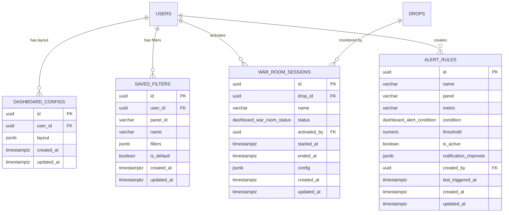

# Dashboard Executivo + Drop War Room (Beacon) — Module Spec

> **Module:** Dashboard Executivo + Drop War Room
> **Codename:** Beacon
> **Schema:** `dashboard`
> **Route prefix:** `/api/v1/dashboard`
> **Admin UI route group:** `(admin)/dashboard/*`
> **Version:** 1.0
> **Date:** March 2026
> **Status:** Approved
> **Replaces:** None (new capability; previously spreadsheets and manual Bling/Yever dashboards)
> **References:** [DATABASE.md](../../architecture/DATABASE.md), [API.md](../../architecture/API.md), [AUTH.md](../../architecture/AUTH.md), [NOTIFICATIONS.md](../../platform/NOTIFICATIONS.md), [GLOSSARY.md](../../dev/GLOSSARY.md), [ClawdBot spec](../communication/clawdbot.md)

---

## 1. Purpose & Scope

The Dashboard Executivo + Drop War Room module (codename **Beacon**) is the **centralized data visualization and real-time monitoring layer** of Ambaril. It aggregates read-only data from every operational module into 9 configurable dashboard panels, provides a real-time Drop War Room for launch events, renders a visual DRE (income statement), and manages configurable metric alerts. All charts are built with Recharts following DS.md section 10 visual rules.

**Core responsibilities:**

| Capability | Description |
|-----------|-------------|
| **9 Dashboard Panels** | Vendas, Retencao (CRM), Estoque, Financeiro, Marketing, PCP, Trocas, Checkout, Creators. Each panel has summary cards + detail view with charts and tables. |
| **Drop War Room** | Real-time monitoring view activated during drop launches. Sales per minute, inventory per SKU, conversion rate, comparison with previous drops. SSE-powered data refresh (5s for sales, 10s for inventory, 30s for conversion). |
| **DRE Visual** | Waterfall chart visualization of the monthly income statement from `erp.income_statements`. Gross revenue -> discounts -> returns -> net revenue -> COGS -> gross margin -> expenses -> net income. |
| **Configurable Alerts** | Rule-based metric alerts: when a metric crosses a threshold (above/below), emit a Flare event for notification via configured channels (in-app, Discord). |
| **Layout Customization** | Users can reorder, resize, and toggle panel visibility. Layout persisted per user. |

**Primary users:**

| User | Role | Usage Pattern |
|------|------|---------------|
| **Marcus** | `admin` | Morning dashboard review. Drills into sales and financial panels. Monitors War Room during drops. Full access to all 9 panels. |
| **Caio** | `pm` | Activates War Room for drops. Reviews marketing and creator panels. Configures alert rules. Full access to all panels. |
| **Tavares** | `operations` | Checks PCP and Estoque panels daily. Monitors inventory health. |
| **Pedro** | `finance` | Reviews Financeiro panel and DRE visual. Monitors margin trends. |
| **Creative team** | `creative` | Views Marketing panel only (Instagram, UGC, campaign performance). All other panels hidden. |

**Out of scope:** This module does NOT modify data in any source module — it is strictly read-only aggregation. It does NOT generate PDF reports (future enhancement). It does NOT handle Discord reporting (owned by ClawdBot / Pulse). The dashboard shares data patterns with ClawdBot, and both modules can reference the same SQL queries for consistency.

---

## 2. User Stories

### 2.1 Dashboard Consumer Stories

| # | As a... | I want to... | So that... | Acceptance Criteria |
|---|---------|-------------|-----------|-------------------|
| US-01 | Marcus | See a high-level overview of all CIENA metrics on a single page when I open the dashboard | I can assess the health of the business in 30 seconds | Main dashboard loads with summary metric cards (faturamento, pedidos, ticket medio, conversao) + panel grid below. All data loads within 2 seconds. Cards show period-over-period delta with color-coded arrows. |
| US-02 | Marcus | Drill into the Vendas panel to see detailed revenue charts, top products, and payment method breakdown | I can identify sales trends and product performance | Click "Vendas" card/panel expands to full detail view: revenue line chart (daily/weekly/monthly toggle), orders bar chart, top products table (sortable), top SKUs table, payment method pie chart, period comparison table. |
| US-03 | Pedro | View the Financeiro panel with DRE waterfall chart, margin rankings, and chargeback trends | I can assess financial health and identify problem areas | Financeiro panel shows: DRE waterfall (gross -> net -> margin -> expenses -> income), MP balance card, approval rate trend, chargeback trend line, margin ranking table (by SKU, color-coded). |
| US-04 | Pedro | View the DRE Visual as a waterfall chart and toggle between months | I can quickly see how revenue flows through to net income each month | Waterfall chart with labeled bars: Receita Bruta (green), (-) Descontos (red), (-) Devolucoes (red), = Receita Liquida (blue), (-) CMV (red), = Margem Bruta (blue), (-) Despesas (red), = Lucro Liquido (green/red based on positive/negative). Month selector dropdown. Values in R$ on each bar. |
| US-05 | Tavares | View the Estoque panel with inventory levels, depletion velocity, and days-to-zero alerts | I can proactively manage stock before problems occur | Estoque panel shows: inventory table with SKU, product, size, color, available, reserved, in_prod, velocity, days_to_zero, status badge (OK/Alerta/Critico). Sortable columns. Filter by status. Depletion velocity chart (top 10 fastest depleting). Days-to-zero alerts section. |
| US-06 | Tavares | View the PCP panel with a simplified production timeline and overdue stages | I can track production progress without opening the full PCP module | PCP panel shows: simplified Gantt-style timeline of active production orders with stage progress bars. Overdue stages count (highlighted red). Supplier reliability score. Upcoming deadlines list (next 7 days). |
| US-07 | Caio | View the Marketing panel with ad spend, ROAS, UGC counts, and creator KPIs | I can assess marketing performance across all channels in one view | Marketing panel shows: ad spend vs revenue dual-axis chart, ROAS trend line, UGC count card + top posts list, creator program KPIs (active creators, total GMV, avg commission), Instagram analytics (followers, engagement rate trend). |
| US-08 | Caio | View the Creators panel with GMV, top performers, tier distribution, and commission trends | I can manage the creator program effectively with data | Creators panel shows: total GMV through creators card, top 10 performers table (name, coupon, sales, commission, tier), tier distribution pie chart, commission payout trend (monthly bar chart). |
| US-09 | Marcus | View the Checkout panel with conversion funnel, abandoned cart rate, and A/B test results | I can identify checkout optimization opportunities | Checkout panel shows: conversion funnel visualization (page_view -> add_to_cart -> start_checkout -> payment -> confirmed with drop-off %), abandoned cart rate trend, payment method distribution, active A/B test results card. |
| US-10 | Support lead | View the Trocas panel with exchange volume, reasons breakdown, and processing time | I can monitor exchange operations and customer pain points | Trocas panel shows: exchange volume trend (line chart), reasons breakdown pie chart, avg processing time card (with trend), exchange impact on revenue card (total exchange value as % of revenue). |
| US-10a | Marcus | See a "Perda de Receita Estimada" card in the Estoque panel showing how much revenue is being lost to out-of-stock SKUs | I can quantify the cost of stockouts and prioritize replenishment | Card shows total estimated R$ revenue leak, top 10 OOS SKUs table (SKU, produto, dias sem estoque, perda R$), weekly trend sparkline (last 4 weeks). Data from `erp.revenue_leak_daily`. |
| US-10b | Tavares | See SKU tier classification (Ouro/Prata/Bronze) in the Estoque panel with tier distribution and sortable table | I can focus inventory management efforts on the highest-value SKUs | Heatmap or table showing tier distribution summary (pie/bar with count per tier) + detailed table with columns: SKU, Produto, Tier (badge), Vendas 90d, Cobertura (dias), Tendencia (sparkline). Filterable by tier, sortable by any column. |
| US-10c | Caio | See CAC per channel, LTV medio, and LTV/CAC ratio in the Retencao panel | I can evaluate marketing efficiency per acquisition channel and overall customer value | Cards: CAC Medio (R$), LTV Medio (R$), LTV/CAC Ratio (color-coded: green > 3, yellow 1-3, red < 1). Bar chart: CAC by channel (trafego pago, creators, organico, WA, marketplace). Monthly evolution line chart (12 months): CAC trend + LTV/CAC ratio trend. |
| US-10d | Pedro | See a "Composicao de Custos" chart in the Financeiro panel breaking down where money is being spent | I can identify which cost categories are growing and need attention | Stacked bar or donut showing % and R$ per category: Produto (COGS), Marketing, Pessoal, Infraestrutura. Monthly comparison: current vs previous month side-by-side bars with variation percentage per category. |
| US-10e | Tavares | See a "Cobertura de Estoque" horizontal bar chart showing days-to-zero for Gold-tier SKUs | I can immediately see which high-value SKUs are about to run out | Horizontal bars for Gold-tier SKUs only, color-coded: verde (> 14 dias), amarelo (7-14 dias), vermelho (< 7 dias). Alert icon on red items. Sorted by days-to-zero ascending (most critical first). |

### 2.2 Layout Customization Stories

| # | As a... | I want to... | So that... | Acceptance Criteria |
|---|---------|-------------|-----------|-------------------|
| US-11 | Marcus | Reorder dashboard panels by dragging them to different positions | I can prioritize the panels I check most often at the top | Panels are drag-and-drop reorderable. New layout saved to `dashboard_configs.layout` on drop. Persists across sessions. |
| US-12 | Marcus | Hide panels I don't need and show only the ones relevant to my role | I can reduce visual noise and focus on what matters | Each panel has a visibility toggle. Hidden panels don't render or fetch data. Layout config tracks `visible: true/false` per panel. |
| US-13 | Any user | Have the dashboard remember my filters and date range between sessions | I don't have to reconfigure my view every time I visit | Saved filters stored in `dashboard.saved_filters`. User can save multiple named filter presets per panel. Default filter applied on load. |

### 2.3 War Room Stories

| # | As a... | I want to... | So that... | Acceptance Criteria |
|---|---------|-------------|-----------|-------------------|
| US-14 | Caio | Activate a Drop War Room before a launch and compare with a previous drop | I can monitor the drop in real-time and make decisions based on live data | "Ativar War Room" button on dashboard. Select drop (from pcp.drops), optionally select comparison drop. War Room enters active state. |
| US-15 | Marcus | See live sales-per-minute, revenue, and conversion rate during an active War Room | I can gauge drop momentum in real-time | Summary cards update every 5 seconds: sales count (with per-minute rate), total revenue, avg ticket, conversion rate. All via SSE stream. |
| US-16 | Tavares | See live inventory levels per SKU during the War Room with depletion progress bars | I can identify when specific sizes are running out during a drop | Inventory section shows each SKU in the drop with: progress bar (current/initial), unit count, warning indicator when below 25%. Updates every 10 seconds via SSE. |
| US-17 | Marcus | Compare current drop performance with a previous drop at the same elapsed time | I can tell if this drop is performing better or worse than the last one | Comparison section shows: current vs comparison drop at same elapsed time (e.g., 30 min after launch). Metrics: sales count, revenue, avg ticket, conversion. % change with directional arrows. |
| US-18 | Caio | End the War Room session when the drop stabilizes | The dashboard returns to normal mode and the War Room data is preserved for post-analysis | "Encerrar War Room" button. Sets `war_room_sessions.status = 'ended'`, `ended_at = NOW()`. Dashboard returns to normal panel view. SSE stream disconnected. |
| US-19 | Caio | Review a completed War Room session with historical data | I can analyze drop performance post-event and compare across drops | Past War Room sessions listed in dashboard settings. Click to view: final metrics, sales timeline chart, inventory depletion timeline, comparison results. Read-only view of the historical data. |

### 2.4 Alert Configuration Stories

| # | As a... | I want to... | So that... | Acceptance Criteria |
|---|---------|-------------|-----------|-------------------|
| US-20 | Marcus | Configure an alert rule that fires when conversion rate drops below 2% | I'm notified immediately when checkout performance degrades | Alert rule form: panel=checkout, metric=conversion_rate, condition=below, threshold=2.0, channels=[in-app, discord]. Rule saved. When condition triggers, Flare event emitted. |
| US-21 | Caio | Configure an alert rule that fires when a War Room SKU drops below 10 units | I can take action during a drop before a size sells out completely | Alert rule: panel=war_room, metric=sku_stock, condition=below, threshold=10, channels=[in-app, discord]. Active only during War Room sessions. |
| US-22 | Pedro | Configure an alert rule when daily chargeback count exceeds 3 | I can investigate potential fraud patterns immediately | Alert rule: panel=financeiro, metric=daily_chargeback_count, condition=above, threshold=3, channels=[in-app, discord]. Fires once per day maximum. |

---

## 3. Data Model

### 3.1 Entity Relationship Diagram



**Cross-schema references:**

```
dashboard reads from ALL schemas (read-only aggregation):
    checkout.orders              -- sales panel, checkout panel, war room
    checkout.order_items         -- product-level sales data
    checkout.carts               -- checkout panel (abandonment)
    checkout.conversion_events   -- checkout panel (funnel), war room
    checkout.ab_tests            -- checkout panel (A/B results)
    erp.skus                     -- estoque panel, war room (inventory per SKU), SKU tier visualization, days-to-zero visual
    erp.inventory                -- estoque panel
    erp.inventory_movements      -- estoque panel (velocity)
    erp.revenue_leak_daily       -- estoque panel (revenue leak card: OOS revenue loss)
    erp.financial_transactions   -- financeiro panel
    erp.margin_calculations      -- financeiro panel (margin ranking)
    erp.income_statements        -- financeiro panel (DRE visual, cost composition chart)
    erp.shipping_labels          -- operational data
    pcp.production_orders        -- PCP panel
    pcp.production_stages        -- PCP panel (timeline, overdue)
    pcp.drops                    -- war room (drop reference)
    crm.contacts                 -- retencao panel, retencao panel (LTV by contact)
    crm.rfm_scores               -- retencao panel (RFM distribution)
    crm.segments                 -- retencao panel
    crm.cohorts                  -- retencao panel (cohort heatmap)
    crm.acquisition_channels     -- retencao panel (CAC per channel tracking)
    crm.contact_ltv              -- retencao panel (LTV medio, LTV/CAC ratio)
    marketing.ugc_posts          -- marketing panel
    marketing.campaign_metrics   -- marketing panel
    marketing.social_metrics     -- marketing panel (Instagram)
    creators.profiles            -- creators panel
    creators.sales_attributions  -- creators panel, war room
    creators.commissions         -- creators panel
    b2b.b2b_orders               -- (future panel)
    inbox.tickets                -- (data available via support report)
    trocas.exchange_requests     -- trocas panel
    global.users                 -- user layout/filter ownership
    pcp.drops                    -- war room drop selection
```

### 3.2 Enums

```sql
CREATE TYPE dashboard.war_room_status AS ENUM ('active', 'ended');
CREATE TYPE dashboard.alert_condition AS ENUM ('above', 'below', 'equals');
```

### 3.3 dashboard.dashboard_configs

| Column | Type | Constraints | Description |
|--------|------|-------------|-------------|
| id | UUID | PK, DEFAULT gen_random_uuid() | UUID v7 |
| user_id | UUID | NOT NULL, FK global.users(id), UNIQUE | One layout config per user |
| layout | JSONB | NOT NULL DEFAULT '[...]' | Array of panel layout objects. See section 3.3.1 for schema. |
| created_at | TIMESTAMPTZ | NOT NULL DEFAULT NOW() | |
| updated_at | TIMESTAMPTZ | NOT NULL DEFAULT NOW() | |

#### 3.3.1 Layout JSONB Structure

```json
[
  { "panel_id": "vendas", "position": 0, "size": "full", "visible": true },
  { "panel_id": "retencao", "position": 1, "size": "half", "visible": true },
  { "panel_id": "estoque", "position": 2, "size": "half", "visible": true },
  { "panel_id": "financeiro", "position": 3, "size": "full", "visible": true },
  { "panel_id": "marketing", "position": 4, "size": "half", "visible": true },
  { "panel_id": "pcp", "position": 5, "size": "half", "visible": true },
  { "panel_id": "trocas", "position": 6, "size": "half", "visible": false },
  { "panel_id": "checkout", "position": 7, "size": "half", "visible": true },
  { "panel_id": "creators", "position": 8, "size": "half", "visible": true }
]
```

| Field | Type | Description |
|-------|------|-------------|
| `panel_id` | string | Unique panel identifier |
| `position` | integer | Display order (0 = first) |
| `size` | enum: `full`, `half`, `third` | Panel width in the grid. `full` = 100%, `half` = 50%, `third` = 33%. |
| `visible` | boolean | Whether the panel is rendered. Hidden panels don't fetch data. |

**Indexes:**

```sql
CREATE UNIQUE INDEX idx_dashboard_configs_user ON dashboard.dashboard_configs (user_id);
```

### 3.4 dashboard.saved_filters

| Column | Type | Constraints | Description |
|--------|------|-------------|-------------|
| id | UUID | PK, DEFAULT gen_random_uuid() | UUID v7 |
| user_id | UUID | NOT NULL, FK global.users(id) | Owner of the saved filter |
| panel_id | VARCHAR(50) | NOT NULL | Which panel this filter applies to (e.g., "vendas", "estoque") |
| name | VARCHAR(100) | NOT NULL | User-friendly filter preset name (e.g., "Ultimos 7 dias", "So PIX") |
| filters | JSONB | NOT NULL | Filter criteria. See section 3.4.1. |
| is_default | BOOLEAN | NOT NULL DEFAULT FALSE | If TRUE, this filter is auto-applied when the panel loads |
| created_at | TIMESTAMPTZ | NOT NULL DEFAULT NOW() | |
| updated_at | TIMESTAMPTZ | NOT NULL DEFAULT NOW() | |

#### 3.4.1 Filters JSONB Structure

```json
{
  "date_range": { "preset": "30d" },
  "payment_method": ["pix", "credit_card"],
  "category": null,
  "status": ["paid", "shipped", "delivered"],
  "custom_date_from": null,
  "custom_date_to": null
}
```

**Indexes:**

```sql
CREATE INDEX idx_saved_filters_user ON dashboard.saved_filters (user_id);
CREATE INDEX idx_saved_filters_panel ON dashboard.saved_filters (panel_id);
CREATE INDEX idx_saved_filters_user_panel ON dashboard.saved_filters (user_id, panel_id);
CREATE UNIQUE INDEX idx_saved_filters_default ON dashboard.saved_filters (user_id, panel_id) WHERE is_default = TRUE;
```

### 3.5 dashboard.war_room_sessions

| Column | Type | Constraints | Description |
|--------|------|-------------|-------------|
| id | UUID | PK, DEFAULT gen_random_uuid() | UUID v7 |
| drop_id | UUID | NOT NULL, FK pcp.drops(id) | Which drop this War Room session monitors |
| name | VARCHAR(255) | NOT NULL | Display name (e.g., "Drop 13 — Oversized Collection") |
| status | dashboard.war_room_status | NOT NULL DEFAULT 'active' | active = currently running, ended = session closed |
| activated_by | UUID | NOT NULL, FK global.users(id) | Who activated the War Room |
| started_at | TIMESTAMPTZ | NOT NULL DEFAULT NOW() | When the War Room was activated |
| ended_at | TIMESTAMPTZ | NULL | When the War Room was ended. NULL while active. |
| config | JSONB | NOT NULL DEFAULT '{}' | Session configuration. See section 3.5.1. |
| created_at | TIMESTAMPTZ | NOT NULL DEFAULT NOW() | |
| updated_at | TIMESTAMPTZ | NOT NULL DEFAULT NOW() | |

#### 3.5.1 Config JSONB Structure

```json
{
  "compare_drop_ids": ["uuid-of-previous-drop"],
  "alert_thresholds": {
    "sku_stock_warning": 10,
    "sku_stock_critical": 5,
    "conversion_min": 2.0
  },
  "tracked_sku_ids": ["uuid-1", "uuid-2"],
  "refresh_intervals": {
    "sales_seconds": 5,
    "inventory_seconds": 10,
    "conversion_seconds": 30
  }
}
```

**Indexes:**

```sql
CREATE INDEX idx_war_room_drop ON dashboard.war_room_sessions (drop_id);
CREATE INDEX idx_war_room_status ON dashboard.war_room_sessions (status);
CREATE INDEX idx_war_room_active ON dashboard.war_room_sessions (id) WHERE status = 'active';
CREATE INDEX idx_war_room_started ON dashboard.war_room_sessions (started_at DESC);
```

### 3.6 dashboard.alert_rules

| Column | Type | Constraints | Description |
|--------|------|-------------|-------------|
| id | UUID | PK, DEFAULT gen_random_uuid() | UUID v7 |
| name | VARCHAR(255) | NOT NULL | Human-readable alert name (e.g., "Conversao abaixo de 2%") |
| panel | VARCHAR(50) | NOT NULL | Which panel this alert monitors (e.g., "checkout", "financeiro", "war_room") |
| metric | VARCHAR(100) | NOT NULL | Metric identifier (e.g., "conversion_rate", "daily_chargeback_count", "sku_stock") |
| condition | dashboard.alert_condition | NOT NULL | Trigger condition: above, below, or equals the threshold |
| threshold | NUMERIC(12,4) | NOT NULL | Threshold value. Type depends on metric (percentage, count, currency amount). |
| is_active | BOOLEAN | NOT NULL DEFAULT TRUE | Toggle to enable/disable without deleting |
| notification_channels | JSONB | NOT NULL DEFAULT '["in-app"]' | Array of delivery channels: `["in-app", "discord"]`. Maps to Flare notification channels. |
| created_by | UUID | NOT NULL, FK global.users(id) | Who created the rule |
| last_triggered_at | TIMESTAMPTZ | NULL | When this rule last fired. Used for cooldown logic. |
| created_at | TIMESTAMPTZ | NOT NULL DEFAULT NOW() | |
| updated_at | TIMESTAMPTZ | NOT NULL DEFAULT NOW() | |

**Indexes:**

```sql
CREATE INDEX idx_alert_rules_panel ON dashboard.alert_rules (panel);
CREATE INDEX idx_alert_rules_active ON dashboard.alert_rules (is_active) WHERE is_active = TRUE;
CREATE INDEX idx_alert_rules_metric ON dashboard.alert_rules (metric);
CREATE INDEX idx_alert_rules_created_by ON dashboard.alert_rules (created_by);
```

---

## 4. Screens & Wireframes

### 4.1 Main Dashboard (Grid of Panels)

```
+-----------------------------------------------------------------------------+
|  Dashboard Executivo                  [Periodo: 30 dias v] [Configurar]     |
+-----------------------------------------------------------------------------+
|                                                                               |
|  +--- Summary Cards (DS.md 8.5 fused block) ---+                            |
|  |                                               |                            |
|  | ┌──────────┬──────────┬──────────┬──────────┐ |                            |
|  | │Faturament│ Pedidos  │ Ticket   │ Conversao│ |                            |
|  | │ R$42.6k  │   152    │  R$280   │   3,8%   │ |                            |
|  | │  +18,2%  │   +12    │  +5,3%   │  -0,3pp  │ |                            |
|  | │ [verde]  │ [verde]  │ [verde]  │ [verm.]  │ |                            |
|  | └──────────┴──────────┴──────────┴──────────┘ |                            |
|  +-----------------------------------------------+                            |
|                                                                               |
|  +--- Panel Grid (draggable) ----------------------------------------+      |
|  |                                                                     |      |
|  |  +--- Vendas [full] -----------------------------------------+    |      |
|  |  | Revenue Line Chart (30d, --electric primary color)          |    |      |
|  |  | X: dates, Y: R$                                            |    |      |
|  |  | [Diario | Semanal | Mensal] toggle                        |    |      |
|  |  +------------------------------------------------------------+    |      |
|  |                                                                     |      |
|  |  +--- Estoque [half] ---+  +--- PCP [half] -----------------+    |      |
|  |  | Low Stock Alerts (3)  |  | Overdue Stages: 2              |    |      |
|  |  | SKU-0412-P  5 un [!]  |  | PO-047 Corte: 2 dias atrasado|    |      |
|  |  | SKU-0301-G  8 un [!]  |  | PO-048 Costura: 1 dia atrasa.|    |      |
|  |  | SKU-0505-M 11 un [~]  |  |                                |    |      |
|  |  | [Ver Estoque Completo]|  | Completando Hoje: 4 stages    |    |      |
|  |  +-----------------------+  | [Ver PCP Completo]            |    |      |
|  |                              +--------------------------------+    |      |
|  |                                                                     |      |
|  |  +--- Marketing [half] -+  +--- Creators [half] -----------+    |      |
|  |  | ROAS: 3.2x           |  | GMV Criadores: R$ 8.450       |    |      |
|  |  | Ad Spend: R$ 2.100   |  | Top: @julia_style (R$ 1.230)  |    |      |
|  |  | UGC Novos: 12        |  | Tiers: 40% SEED, 35% GROW,   |    |      |
|  |  | [Ver Marketing]      |  |        20% BLOOM, 5% CORE     |    |      |
|  |  +-----------------------+  | [Ver Creators]               |    |      |
|  |                              +--------------------------------+    |      |
|  +---------------------------------------------------------------------+      |
+-----------------------------------------------------------------------------+
```

### 4.2 Panel Detail View — Vendas

```
+-----------------------------------------------------------------------------+
|  Dashboard > Vendas                   [Periodo: 30 dias v] [Voltar]         |
+-----------------------------------------------------------------------------+
|                                                                               |
|  +--- Metric Cards ---+                                                      |
|  | Receita | Pedidos | Ticket Medio | PIX % | Cartao % | Boleto %          |
|  | R$42.6k | 152     | R$ 280       | 48%   | 42%      | 10%               |
|  | +18,2%  | +8,6%   | +5,3%        | +2pp  | -1pp     | -1pp              |
|  +--------------------+                                                      |
|                                                                               |
|  +--- Revenue Chart (Line, Recharts AreaChart) ---------------------------+   |
|  | R$                                                                     |   |
|  | 3k ┤                          .--.                                     |   |
|  |    |                     .--.'    '-.                                   |   |
|  | 2k ┤               .--.'            '--..                              |   |
|  |    |          .--.'                       '-.                          |   |
|  | 1k ┤    .--.'                                 '--..                    |   |
|  |    | .-'                                           '-.                 |   |
|  |  0 ┤----+----+----+----+----+----+----+----+----+----+               |   |
|  |      15/02  20/02  25/02  01/03  05/03  10/03  15/03                  |   |
|  | Color: --electric (#00F0FF)                                            |   |
|  +-----------------------------------------------------------------------+   |
|                                                                               |
|  +--- Orders Chart (Bar) ----+  +--- Payment Method (Donut) -----------+   |
|  | (daily order count bars)   |  |                                       |   |
|  | --sky secondary color      |  |    PIX 48%  /  Cartao 42%  / Boleto  |   |
|  +----------------------------+  +---------------------------------------+   |
|                                                                               |
|  +--- Top Produtos (Table) -----------------------------------------------+ |
|  | # | Produto                  | Receita    | Unidades | % do Total      | |
|  | 1 | Moletom Oversized Preto  | R$ 6.840   | 36       | 16,1%           | |
|  | 2 | Camiseta Basic Off-White  | R$ 4.275   | 45       | 10,0%           | |
|  | 3 | Calca Cargo Cinza         | R$ 3.890   | 22       | 9,1%            | |
|  | 4 | Bone Aba Reta Preto       | R$ 2.838   | 30       | 6,7%            | |
|  | 5 | Meia Pack x3 Preta        | R$ 2.069   | 69       | 4,9%            | |
|  +------------------------------------------------------------------------ + |
|                                                                               |
|  +--- Period Comparison -------------------------------------------------+  |
|  | Metrica      | Atual (30d) | Anterior (30d) | Variacao               |  |
|  | Receita      | R$ 42.600   | R$ 36.050      | +18,2% [verde]         |  |
|  | Pedidos      | 152         | 140            | +8,6% [verde]          |  |
|  | Ticket Medio | R$ 280,26   | R$ 257,50      | +8,8% [verde]          |  |
|  | Conversao    | 3,8%        | 4,1%           | -0,3pp [vermelho]      |  |
|  +-----------------------------------------------------------------------+  |
+-----------------------------------------------------------------------------+
```

### 4.3 Panel Detail View — Retencao (CRM)

```
+-----------------------------------------------------------------------------+
|  Dashboard > Retencao (CRM)           [Periodo: 90 dias v] [Voltar]         |
+-----------------------------------------------------------------------------+
|                                                                               |
|  +--- RFM Segment Distribution (Grid) -----------------------------------+ |
|  |                                                                         | |
|  |  Campea  (555)  █████  12%  |  Leal  (445)  ████████  18%             | |
|  |  Risco   (211)  ██████████  24%  |  Novo  (511)  ███████  15%         | |
|  |  Perdido (111)  ████████  19%  |  Potencial (311)  █████  12%         | |
|  |                                                                         | |
|  +------------------------------------------------------------------------+ |
|                                                                               |
|  +--- Repurchase Rate Trend ---+  +--- LTV by Segment (Bar) ----------+   |
|  | (Line chart, 12 months)      |  | Campea: R$ 1.450                   |   |
|  | Current: 32% (+2pp)          |  | Leal:   R$ 820                     |   |
|  +------------------------------+  | Risco:  R$ 340                     |   |
|                                     | Novo:   R$ 180                     |   |
|  +--- Churn Rate ---------------+  +-----------------------------------+   |
|  | Current: 12% (-1pp)          |                                          |
|  | Target: < 15%                |                                          |
|  +------------------------------+                                          |
|                                                                               |
|  +--- Cohort Heatmap (Repurchase by Acquisition Month) ------------------+ |
|  |         M1    M2    M3    M4    M5    M6                               | |
|  | Jan26  100%  32%   18%   12%   9%    7%                                | |
|  | Fev26  100%  35%   21%   14%   --    --                                | |
|  | Mar26  100%  --    --    --    --    --                                | |
|  | (darker = higher repurchase rate)                                       | |
|  +------------------------------------------------------------------------+ |
+-----------------------------------------------------------------------------+
```

### 4.4 Drop War Room

```
+-----------------------------------------------------------------------------+
|  [vermelho pulsante] WAR ROOM ATIVO                     [Encerrar War Room] |
|  Drop 13 "Oversized Collection"                                              |
|  Ativado por Caio . 14:32 . Tempo decorrido: 00:47:23                       |
|  Comparando com: Drop 12 "Summer Basics"                                     |
+-----------------------------------------------------------------------------+
|                                                                               |
|  +--- Live Metric Cards (SSE, updates every 5s) -------------------------+ |
|  |                                                                         | |
|  | ┌──────────┬──────────┬──────────┬──────────┐                          | |
|  | │ Vendas   │ Revenue  │ Ticket   │ Conv.    │                          | |
|  | │   47     │ R$12.8k  │  R$272   │  4,1%    │                          | |
|  | │ 12/min   │ +52% vs  │          │ vs 3,2%  │                          | |
|  | │ (pico)   │ Drop 12  │          │ Drop 12  │                          | |
|  | └──────────┴──────────┴──────────┴──────────┘                          | |
|  +------------------------------------------------------------------------+ |
|                                                                               |
|  +--- Real-time Sales Chart (updates every 5s) --------------------------+ |
|  | Vendas/min                                                              | |
|  | 15 ┤       .                                                            | |
|  |    |      . .     .                                                     | |
|  | 10 ┤    .     . .   .                                                   | |
|  |    |  .             . .   .                                             | |
|  |  5 ┤.                   .   . .                                         | |
|  |    |                          . .                                       | |
|  |  0 ┤----+----+----+----+----+----+----+----+                           | |
|  |     14:32 14:37 14:42 14:47 14:52 14:57 15:02 15:07                    | |
|  | --electric (current drop)  --sky (comparison drop, same elapsed time)  | |
|  +------------------------------------------------------------------------+ |
|                                                                               |
|  +--- Estoque por SKU (updates every 10s) -------------------------------+ |
|  |                                                                         | |
|  | SKU-0412 P  ████████████░░░░  23 un (was 50)                           | |
|  | SKU-0412 M  ██████████████░░  31 un (was 50)                           | |
|  | SKU-0412 G  ████████░░░░░░░░  15 un (was 50)  [!] abaixo de 25%       | |
|  | SKU-0412 GG ██████████████░░  34 un (was 50)                           | |
|  | SKU-0413 P  ████████████████  40 un (was 40)   sem vendas              | |
|  | SKU-0413 M  ██████████████░░  30 un (was 40)                           | |
|  | SKU-0413 G  ████████████░░░░  22 un (was 40)                           | |
|  |                                                                         | |
|  +------------------------------------------------------------------------+ |
|                                                                               |
|  +--- Comparativo com Drop 12 (mesmo tempo decorrido: 47 min) -----------+ |
|  |                                                                         | |
|  | Metrica        | Drop 13 (atual) | Drop 12 (47 min) | Variacao        | |
|  | Vendas         | 47              | 32                | +47% [verde]    | |
|  | Revenue        | R$ 12.800       | R$ 8.400          | +52% [verde]    | |
|  | Ticket Medio   | R$ 272          | R$ 263            | +3,4% [verde]   | |
|  | Conversao      | 4,1%            | 3,2%              | +0,9pp [verde]  | |
|  | Sessoes        | 1.146           | 1.000             | +14,6% [verde]  | |
|  |                                                                         | |
|  +------------------------------------------------------------------------+ |
+-----------------------------------------------------------------------------+
```

### 4.5 Alert Configuration

```
+-----------------------------------------------------------------------------+
|  Dashboard > Alertas                                        [+ Nova Regra]  |
+-----------------------------------------------------------------------------+
|                                                                               |
|  +------+---------------------+----------+-------+----------+------+------+ |
|  | Ativo| Nome                | Painel   | Metric| Condicao | Thres| Canais| |
|  +------+---------------------+----------+-------+----------+------+------+ |
|  | [ON] | Conversao < 2%      | checkout | conv% | abaixo   | 2,0  | app+D| |
|  | [ON] | Chargeback > 3/dia  | financ.  | chbk# | acima    | 3    | app+D| |
|  | [ON] | Estoque critico WR  | war_room | sku#  | abaixo   | 10   | app+D| |
|  | [OFF]| ROAS < 2.0          | market.  | roas  | abaixo   | 2,0  | app  | |
|  | [ON] | Revenue spike > 5k  | vendas   | rev$  | acima    | 5000 | app  | |
|  +------+---------------------+----------+-------+----------+------+------+ |
|                                                                               |
|  [Selecione uma regra para editar ou clique "+ Nova Regra"]                  |
+-----------------------------------------------------------------------------+
```

### 4.6 DRE Visual (Waterfall Chart)

```
+-----------------------------------------------------------------------------+
|  Dashboard > DRE Visual                      [Mes: Fevereiro 2026 v]        |
+-----------------------------------------------------------------------------+
|                                                                               |
|  R$                                                                          |
|  50k ┤ ┌─────┐                                                              |
|      │ │     │                                                               |
|  40k ┤ │ RB  │ ┌───┐                                                        |
|      │ │     │ │-D │ ┌───┐                                                   |
|  35k ┤ │     │ │   │ │-DV│ ┌─────┐                                          |
|      │ │     │ │   │ │   │ │     │                                           |
|  30k ┤ │     │ │   │ │   │ │ RL  │                                          |
|      │ │     │ │   │ │   │ │     │ ┌───┐                                    |
|  20k ┤ │     │ │   │ │   │ │     │ │-CM│ ┌─────┐                            |
|      │ │     │ │   │ │   │ │     │ │   │ │     │                             |
|  15k ┤ │     │ │   │ │   │ │     │ │   │ │ MB  │ ┌───┐                      |
|      │ │     │ │   │ │   │ │     │ │   │ │     │ │-DO│ ┌─────┐              |
|  10k ┤ │     │ │   │ │   │ │     │ │   │ │     │ │   │ │     │              |
|      │ │     │ │   │ │   │ │     │ │   │ │     │ │   │ │ LL  │              |
|   5k ┤ │     │ │   │ │   │ │     │ │   │ │     │ │   │ │     │              |
|      │ │     │ │   │ │   │ │     │ │   │ │     │ │   │ │     │              |
|    0 ┤─┴─────┴─┴───┴─┴───┴─┴─────┴─┴───┴─┴─────┴─┴───┴─┴─────┴─           |
|       Receita  (-)   (-)   Receita  (-)   Margem  (-)   Lucro               |
|       Bruta   Desc. Devol. Liquida  CMV   Bruta  Desp.  Liquido             |
|                                                                               |
|  Legenda: [verde] positivo/receita  [vermelho] deducao/custo                |
|  RB = R$ 48.200  Desc = R$ 3.100  Devol = R$ 1.800                         |
|  RL = R$ 43.300  CMV = R$ 18.500  MB = R$ 24.800                           |
|  Desp = R$ 12.300  LL = R$ 12.500 (25,9% margem liquida)                   |
|                                                                               |
|  Status: [Rascunho] — Aprovado por Pedro em --/--/----                       |
+-----------------------------------------------------------------------------+
```

### 4.7 Estoque Panel — Revenue Leak Card

```
+-----------------------------------------------------------------------------+
|  Dashboard > Estoque > Perda de Receita Estimada                            |
+-----------------------------------------------------------------------------+
|                                                                               |
|  +--- Summary Card (DS.md 8.5 fused block) --------------------------------+|
|  |  Perda de Receita Estimada                                                ||
|  |  R$ 14.280   [vermelho]                                                   ||
|  |  +8,3% vs semana anterior                                                ||
|  +--------------------------------------------------------------------------+|
|                                                                               |
|  +--- Weekly Trend Sparkline (last 4 weeks) --------------------------------+|
|  |  Perda Semanal                                                            ||
|  |  R$ 3.2k  R$ 3.0k  R$ 3.6k  R$ 4.4k                                    ||
|  |    ─.       .─       .        .──                                         ||
|  |      '─.  ─'  '─.  ─'  '──.─'                                            ||
|  |  Sem -4  Sem -3  Sem -2  Sem -1                                          ||
|  |  Color: --coral (upward = worsening)                                      ||
|  +--------------------------------------------------------------------------+|
|                                                                               |
|  +--- Top 10 SKUs com Maior Perda (Table) ---------------------------------+|
|  | #  | SKU          | Produto                  | Dias s/ Est. | Perda R$   ||
|  | 1  | SKU-0412-P   | Moletom Oversized Preto  | 12           | R$ 2.340   ||
|  | 2  | SKU-0301-G   | Camiseta Basic Off-White  | 9            | R$ 1.870   ||
|  | 3  | SKU-0505-M   | Calca Cargo Cinza         | 7            | R$ 1.540   ||
|  | 4  | SKU-0220-G   | Bone Aba Reta Preto       | 14           | R$ 1.280   ||
|  | 5  | SKU-0118-P   | Meia Pack x3 Preta        | 6            | R$ 980     ||
|  | ...                                                                        ||
|  | 10 | SKU-0633-GG  | Shorts Cargo Preto        | 3            | R$ 420     ||
|  +--------------------------------------------------------------------------+|
|  Data source: erp.revenue_leak_daily (aggregated from ERP module)            |
+-----------------------------------------------------------------------------+
```

### 4.8 Estoque / PCP Panel — SKU Tier Visualization

```
+-----------------------------------------------------------------------------+
|  Dashboard > Estoque > Classificacao de SKUs                                 |
+-----------------------------------------------------------------------------+
|                                                                               |
|  +--- Tier Distribution Summary (Pie / Bar) --------------------------------+|
|  |  Distribuicao por Tier                                                    ||
|  |                                                                           ||
|  |  [====== Ouro 15% ======]                                                ||
|  |  [=========== Prata 35% ===========]                                     ||
|  |  [=================== Bronze 50% ===================]                    ||
|  |                                                                           ||
|  |  Ouro: 12 SKUs  |  Prata: 28 SKUs  |  Bronze: 40 SKUs                   ||
|  +--------------------------------------------------------------------------+|
|                                                                               |
|  +--- SKU Tier Table (sortable, filterable) --------------------------------+|
|  | [Filtrar Tier: Todos v] [Ouro] [Prata] [Bronze]                          ||
|  |                                                                           ||
|  | SKU          | Produto                  | Tier      | Vendas 90d | Cob.  | Tend. ||
|  | SKU-0412     | Moletom Oversized Preto  | [Ouro]    | 342        | 18d   | ~~^   ||
|  | SKU-0301     | Camiseta Basic Off-White  | [Ouro]    | 289        | 22d   | ~~^   ||
|  | SKU-0505     | Calca Cargo Cinza         | [Prata]   | 156        | 31d   | ~~~   ||
|  | SKU-0220     | Bone Aba Reta Preto       | [Prata]   | 134        | 45d   | ~~v   ||
|  | SKU-0118     | Meia Pack x3 Preta        | [Bronze]  | 42         | 90d+  | ~~~   ||
|  | ...                                                                        ||
|  +--------------------------------------------------------------------------+|
|                                                                               |
|  Tier badges: [Ouro] = gold (#FFD700), [Prata] = silver (#C0C0C0),         |
|               [Bronze] = bronze (#CD7F32)                                    |
|  Cobertura = days of stock remaining at current depletion velocity           |
|  Tendencia = sparkline of last 90 days sales velocity (ascending/flat/desc)  |
|  Data source: erp.skus.tier + inventory calculations                         |
+-----------------------------------------------------------------------------+
```

### 4.9 Retencao Panel — CAC por Canal + LTV/CAC Ratio

```
+-----------------------------------------------------------------------------+
|  Dashboard > Retencao > CAC & LTV                                            |
+-----------------------------------------------------------------------------+
|                                                                               |
|  +--- Metric Cards (DS.md 8.5 fused block) --------------------------------+|
|  |                                                                           ||
|  | ┌──────────┬──────────┬──────────┬──────────────────┐                    ||
|  | │ CAC Medio│ LTV Medio│ LTV/CAC  │ Payback Period   │                    ||
|  | │  R$ 42   │  R$ 380  │   9,0x   │   ~1,2 meses     │                    ||
|  | │  -5,2%   │  +3,8%   │ [verde]  │                   │                    ||
|  | │ [verde]  │ [verde]  │ > 3 = OK │                   │                    ||
|  | └──────────┴──────────┴──────────┴──────────────────┘                    ||
|  |                                                                           ||
|  |  LTV/CAC color: verde (> 3), amarelo (1-3), vermelho (< 1)              ||
|  +--------------------------------------------------------------------------+|
|                                                                               |
|  +--- CAC por Canal (Bar Chart) -------------------------------------------+|
|  |                                                                           ||
|  |  Trafego Pago  ████████████████  R$ 68                                   ||
|  |  Creators      ████████████      R$ 45                                   ||
|  |  Organico      ████              R$ 12                                   ||
|  |  WhatsApp      ██████            R$ 22                                   ||
|  |  Marketplace   ██████████        R$ 35                                   ||
|  |                                                                           ||
|  |  Color: --electric per bar, --sky for average line                       ||
|  +--------------------------------------------------------------------------+|
|                                                                               |
|  +--- Monthly Evolution (Line Chart, dual axis) ---------------------------+|
|  |  CAC Trend + LTV/CAC Ratio Trend (12 months)                            ||
|  |                                                                           ||
|  |  R$  |                                  .--. LTV/CAC                      ||
|  |  80  ┤ .                           .--.'                                  ||
|  |      | '. .                   .--.'                                       ||
|  |  40  ┤    '-.            .--.'           CAC                              ||
|  |      |       '-.    .--.'                                                 ||
|  |  0   ┤──────────'--'────────────────                                     ||
|  |       Abr  Mai  Jun  Jul  Ago  Set  Out  Nov  Dez  Jan  Fev  Mar        ||
|  |                                                                           ||
|  |  --electric = CAC (left axis R$), --lime = LTV/CAC ratio (right axis)   ||
|  +--------------------------------------------------------------------------+|
|  Data source: CRM module (acquisition_channels, contact_ltv)                 |
+-----------------------------------------------------------------------------+
```

### 4.10 Financeiro Panel — Cost Composition Chart

```
+-----------------------------------------------------------------------------+
|  Dashboard > Financeiro > Composicao de Custos                               |
+-----------------------------------------------------------------------------+
|                                                                               |
|  +--- Stacked Bar / Donut (current month) ---------------------------------+|
|  |  Composicao de Custos — Marco 2026                                       ||
|  |                                                                           ||
|  |   Produto (COGS)     ██████████████████████  52%   R$ 18.500             ||
|  |   Marketing          ████████████            28%   R$ 9.800              ||
|  |   Pessoal            ██████                  14%   R$ 4.900              ||
|  |   Infraestrutura     ██                       6%   R$ 2.100              ||
|  |                                                    ─────────              ||
|  |                                             Total: R$ 35.300             ||
|  |                                                                           ||
|  |  Colors: --electric (COGS), --sky (Marketing),                           ||
|  |          --lime (Pessoal), --text-secondary (Infraestrutura)             ||
|  +--------------------------------------------------------------------------+|
|                                                                               |
|  +--- Monthly Comparison (side-by-side bars) -------------------------------+|
|  |  Mes Atual vs Mes Anterior                                                ||
|  |                                                                           ||
|  |              Fev 2026          Mar 2026          Variacao                 ||
|  |  COGS        R$ 17.200        R$ 18.500         +7,6% [vermelho]         ||
|  |  Marketing   R$ 8.400         R$ 9.800          +16,7% [vermelho]        ||
|  |  Pessoal     R$ 4.900         R$ 4.900          0,0% [neutro]            ||
|  |  Infra       R$ 1.950         R$ 2.100          +7,7% [vermelho]         ||
|  |  ─────────   ──────────       ──────────        ──────────                ||
|  |  Total       R$ 32.450        R$ 35.300         +8,8% [vermelho]         ||
|  |                                                                           ||
|  |  Side-by-side grouped bars, --sky (previous) vs --electric (current)     ||
|  +--------------------------------------------------------------------------+|
|  Data source: erp.income_statements (DRE data) + cost categorization         |
+-----------------------------------------------------------------------------+
```

### 4.11 Estoque Panel — Days-to-Zero Visual

```
+-----------------------------------------------------------------------------+
|  Dashboard > Estoque > Cobertura de Estoque                                  |
+-----------------------------------------------------------------------------+
|                                                                               |
|  Cobertura de Estoque — SKUs Ouro (Gold-tier only)                          |
|  Ordenado por dias restantes (mais critico primeiro)                         |
|                                                                               |
|  +--- Horizontal Bar Chart ------------------------------------------------+|
|  |                                                                           ||
|  |  SKU-0412-P  Moletom Over. P   ██░░░░░░░░░░░░░░  3d  [!] [vermelho]    ||
|  |  SKU-0301-G  Camiseta Basic G  ████░░░░░░░░░░░░  5d  [!] [vermelho]    ||
|  |  SKU-0505-M  Calca Cargo M     ████████░░░░░░░░  9d      [amarelo]     ||
|  |  SKU-0220-G  Bone Aba Reta G   ██████████░░░░░░  12d     [amarelo]     ||
|  |  SKU-0118-P  Meia Pack x3 P    ██████████████░░  18d     [verde]       ||
|  |  SKU-0412-M  Moletom Over. M   ████████████████  22d     [verde]       ||
|  |  SKU-0301-M  Camiseta Basic M  ████████████████  25d     [verde]       ||
|  |  SKU-0412-G  Moletom Over. G   ████████████████  31d     [verde]       ||
|  |                                                                           ||
|  |  Bar colors: verde (> 14 dias), amarelo (7-14 dias), vermelho (< 7 dias)||
|  |  [!] = alert icon on red items (critical stock)                          ||
|  |  Sorted by days-to-zero ascending (most critical first)                  ||
|  +--------------------------------------------------------------------------+|
|                                                                               |
|  Legenda: [verde] > 14 dias  [amarelo] 7-14 dias  [vermelho] < 7 dias      |
|  Data source: erp.skus (depletion velocity) + erp.inventory (current stock) |
+-----------------------------------------------------------------------------+
```

---

## 5. API Endpoints

All endpoints follow the patterns defined in [API.md](../../architecture/API.md). Module prefix: `/api/v1/dashboard`.

### 5.1 Dashboard Configuration

| Method | Path | Auth | Description | Request Body / Query | Response |
|--------|------|------|-------------|---------------------|----------|
| GET | `/config` | Internal | Get current user's dashboard layout | -- | `{ data: DashboardConfig }` |
| PUT | `/config` | Internal | Update current user's dashboard layout | `{ layout: PanelLayout[] }` | `{ data: DashboardConfig }` |

### 5.2 Saved Filters

| Method | Path | Auth | Description | Request Body / Query | Response |
|--------|------|------|-------------|---------------------|----------|
| GET | `/filters` | Internal | List saved filters for current user | `?panelId=` | `{ data: SavedFilter[] }` |
| POST | `/filters` | Internal | Create saved filter | `{ panel_id, name, filters, is_default? }` | `201 { data: SavedFilter }` |
| PATCH | `/filters/:id` | Internal | Update saved filter | `{ name?, filters?, is_default? }` | `{ data: SavedFilter }` |
| DELETE | `/filters/:id` | Internal | Delete saved filter | -- | `204` |

### 5.3 Panel Data Endpoints

Each panel has its own data endpoint with standardized parameters for date range and filters.

| Method | Path | Auth | Description | Request Body / Query | Response |
|--------|------|------|-------------|---------------------|----------|
| GET | `/panels/vendas` | Internal | Sales panel data | `?dateFrom=&dateTo=&preset=30d&paymentMethod=` | `{ data: VendasPanel }` |
| GET | `/panels/retencao` | Internal | CRM/retention panel data | `?dateFrom=&dateTo=&preset=90d` | `{ data: RetencaoPanel }` |
| GET | `/panels/estoque` | Internal | Inventory panel data | `?sortBy=depletionVelocity&statusFilter=&search=` | `{ data: EstoquePanel }` |
| GET | `/panels/estoque/revenue-leak` | Internal | Revenue leak card: OOS revenue loss summary, top 10 SKUs, weekly sparkline | `?weeks=4` | `{ data: RevenueLeak }` |
| GET | `/panels/estoque/sku-tiers` | Internal | SKU tier visualization: tier distribution + tier table | `?tier=&sortBy=sales_90d&order=desc` | `{ data: SkuTiers }` |
| GET | `/panels/estoque/days-to-zero` | Internal | Days-to-zero horizontal bar chart for Gold-tier SKUs | `?tierFilter=gold` | `{ data: DaysToZero }` |
| GET | `/panels/financeiro` | Internal | Financial panel data | `?dateFrom=&dateTo=&preset=30d` | `{ data: FinanceiroPanel }` |
| GET | `/panels/financeiro/cost-composition` | Internal | Cost composition chart: stacked breakdown + monthly comparison | `?month=&year=` | `{ data: CostComposition }` |
| GET | `/panels/retencao/cac-ltv` | Internal | CAC per channel, LTV medio, LTV/CAC ratio, monthly evolution | `?dateFrom=&dateTo=&preset=12m` | `{ data: CacLtv }` |
| GET | `/panels/marketing` | Internal | Marketing panel data | `?dateFrom=&dateTo=&preset=30d` | `{ data: MarketingPanel }` |
| GET | `/panels/pcp` | Internal | Production panel data | -- | `{ data: PcpPanel }` |
| GET | `/panels/trocas` | Internal | Exchanges panel data | `?dateFrom=&dateTo=&preset=30d` | `{ data: TrocasPanel }` |
| GET | `/panels/checkout` | Internal | Checkout funnel panel data | `?dateFrom=&dateTo=&preset=30d` | `{ data: CheckoutPanel }` |
| GET | `/panels/creators` | Internal | Creators panel data | `?dateFrom=&dateTo=&preset=30d` | `{ data: CreatorsPanel }` |
| GET | `/panels/summary` | Internal | Top-level summary cards (faturamento, pedidos, ticket, conversao) | `?dateFrom=&dateTo=&preset=30d` | `{ data: SummaryCards }` |

### 5.4 DRE Visual

| Method | Path | Auth | Description | Request Body / Query | Response |
|--------|------|------|-------------|---------------------|----------|
| GET | `/dre` | Internal | Get DRE waterfall data for a period | `?month=&year=` | `{ data: DreVisual }` |
| GET | `/dre/months` | Internal | List available DRE months | -- | `{ data: { months: [{ month, year, status }] } }` |

### 5.5 War Room

| Method | Path | Auth | Description | Request Body / Query | Response |
|--------|------|------|-------------|---------------------|----------|
| GET | `/war-room` | Internal | List War Room sessions | `?status=&cursor=&limit=25` | `{ data: WarRoomSession[], meta: Pagination }` |
| GET | `/war-room/:id` | Internal | Get War Room session detail | -- | `{ data: WarRoomSession }` |
| POST | `/war-room` | Internal | Activate a new War Room | `{ drop_id, name?, compare_drop_ids?, alert_thresholds?, tracked_sku_ids? }` | `201 { data: WarRoomSession }` |
| POST | `/war-room/:id/actions/end` | Internal | End an active War Room | -- | `{ data: WarRoomSession }` |
| GET | `/war-room/:id/stream` | Internal | SSE stream for live War Room data | -- | `text/event-stream` (see section 5.5.1) |
| GET | `/war-room/:id/snapshot` | Internal | Get current War Room snapshot (non-SSE) | -- | `{ data: WarRoomSnapshot }` |
| GET | `/war-room/:id/history` | Internal | Get historical War Room data for post-analysis | `?metric=sales&granularity=1min` | `{ data: WarRoomHistory }` |

#### 5.5.1 War Room SSE Stream Events

| Event Type | Frequency | Payload |
|-----------|-----------|---------|
| `sales_update` | Every 5 seconds | `{ total_sales: int, revenue: numeric, avg_ticket: numeric, sales_per_minute: numeric, last_5min_sales: int }` |
| `inventory_update` | Every 10 seconds | `{ skus: [{ sku_id, sku_code, size, color, current_stock: int, initial_stock: int, percent_remaining: numeric }] }` |
| `conversion_update` | Every 30 seconds | `{ conversion_rate: numeric, sessions: int, carts_created: int, checkouts_started: int, orders_confirmed: int }` |
| `comparison_update` | Every 30 seconds | `{ comparison_drop_name: string, same_elapsed: { sales: int, revenue: numeric, conversion: numeric }, delta: { sales_pct: numeric, revenue_pct: numeric, conversion_pp: numeric } }` |
| `alert` | On trigger | `{ alert_rule_id: uuid, metric: string, current_value: numeric, threshold: numeric, message: string }` |

### 5.6 Alert Rules

| Method | Path | Auth | Description | Request Body / Query | Response |
|--------|------|------|-------------|---------------------|----------|
| GET | `/alert-rules` | Internal | List alert rules | `?panel=&isActive=&cursor=&limit=25` | `{ data: AlertRule[], meta: Pagination }` |
| GET | `/alert-rules/:id` | Internal | Get alert rule detail | -- | `{ data: AlertRule }` |
| POST | `/alert-rules` | Internal | Create alert rule | `{ name, panel, metric, condition, threshold, notification_channels?, is_active? }` | `201 { data: AlertRule }` |
| PATCH | `/alert-rules/:id` | Internal | Update alert rule | `{ name?, metric?, condition?, threshold?, notification_channels?, is_active? }` | `{ data: AlertRule }` |
| DELETE | `/alert-rules/:id` | Internal | Delete alert rule | -- | `204` |

---

## 6. Business Rules

### 6.1 Data Rules

| # | Rule | Detail |
|---|------|--------|
| R1 | **Dashboard data is read-only** | The dashboard module NEVER mutates data in any source module. All data is fetched via read-only SQL queries or API calls. No INSERT, UPDATE, or DELETE operations are performed on source schemas. |
| R2 | **Panel data cached in PostgreSQL** | Standard panel data is cached in a PostgreSQL cache table with a 5-minute TTL. Cache key format: `dashboard:panel:{panel_id}:{filter_hash}`. Cache is invalidated on explicit refresh (user clicks refresh button) or TTL expiry. |
| R3 | **Period selector** | All panels support a period selector with presets: Today, 7 days, 30 days, 90 days, Custom range. Default: 30 days. Custom range maximum: 365 days. Period selection applies to the entire dashboard (global) or per-panel if the user has a saved filter. |
| R4 | **Metric card format (DS.md 8.5)** | Summary metric cards follow the fused block layout from DS.md section 8.5: value + delta in a single card. Delta arrows: green for positive trend, red for negative trend. Delta format: percentage for ratios, absolute value for counts, percentage points for rates (e.g., conversion). |
| R5 | **Chart visual rules (DS.md section 10)** | All charts use Recharts components with DS.md section 10 visual rules: `--electric` (#00F0FF) as primary color, `--sky` as secondary color, `--text-tertiary` for axis labels, minimal grid lines, no chartjunk. Dark mode by default. |
| R5a | **Revenue leak calculation** | Revenue leak per OOS SKU is estimated as: `avg_daily_revenue_when_in_stock * days_out_of_stock`. The aggregated value `erp.revenue_leak_daily` is computed by the ERP module and consumed read-only by the dashboard. The "Perda de Receita Estimada" card sums all active OOS SKUs. Weekly sparkline shows the last 4 weeks of total daily revenue leak aggregated per week. Top 10 table is sorted by `estimated_leak_amount DESC`. |
| R5b | **SKU tier classification** | SKUs are classified into tiers based on the `erp.skus.tier` column (enum: `gold`, `silver`, `bronze`). Tier assignment is managed by the ERP module (typically based on 90-day sales velocity). The dashboard reads tier data read-only. Tier badges use brand-specific colors: Ouro (#FFD700), Prata (#C0C0C0), Bronze (#CD7F32). The tier distribution summary shows count + percentage of SKUs per tier. Table supports filtering by tier and sorting by any column (SKU, produto, tier, vendas_90d, cobertura, tendencia). |
| R5c | **CAC per channel calculation** | CAC (Custo de Aquisicao de Cliente) is calculated per acquisition channel: `total_channel_spend / new_customers_acquired_via_channel`. Channels: trafego_pago, creators, organico, whatsapp, marketplace. Data sourced from `crm.acquisition_channels` + `crm.contact_ltv`. LTV/CAC ratio color coding: verde (> 3.0 = healthy), amarelo (1.0-3.0 = attention), vermelho (< 1.0 = unsustainable). Monthly evolution chart shows 12-month rolling window with dual axes: CAC trend (left, R$) and LTV/CAC ratio (right, multiplier). |
| R5d | **Cost composition structure** | Cost composition chart reads from `erp.income_statements` and categorizes costs into 4 groups: Produto/COGS (CMV from DRE), Marketing (marketing spend line items), Pessoal (payroll/contractor costs), Infraestrutura (tools, hosting, logistics overhead). Monthly comparison shows current month vs previous month side-by-side with absolute values and percentage change per category. Total costs row included. |
| R5e | **Days-to-zero visualization** | The "Cobertura de Estoque" chart displays ONLY Gold-tier SKUs (`erp.skus.tier = 'gold'`). Days-to-zero is calculated as `current_available_stock / avg_daily_depletion_velocity`. Bar color thresholds: verde (> 14 days), amarelo (7-14 days), vermelho (< 7 days). Bars sorted ascending by days-to-zero (most critical first). Red items display an alert icon ([!]). If a Gold-tier SKU has zero stock (days_to_zero = 0), it appears at the top with a solid red bar and "Sem estoque" label. |

### 6.2 War Room Rules

| # | Rule | Detail |
|---|------|--------|
| R6 | **War Room activation** | Only `admin` and `pm` roles can activate a War Room. Activation creates a `war_room_sessions` row with `status=active`. At most one War Room can be active at a time. Attempting to start a second returns error: "Ja existe um War Room ativo. Encerre o atual antes de iniciar um novo." |
| R7 | **War Room data refresh** | War Room data is NOT cached. It is fetched directly from the database on every SSE interval: sales_update every 5 seconds, inventory_update every 10 seconds, conversion_update every 30 seconds. This ensures real-time accuracy during the critical drop window. |
| R8 | **War Room comparison** | When `compare_drop_ids` is configured, the War Room fetches data for the comparison drop filtered to the same elapsed time window. Example: if the current War Room has been active for 47 minutes, it compares with the comparison drop's first 47 minutes (from its `started_at`). The comparison drop's data is queried from historical `checkout.orders` filtered by the comparison drop's date range. |
| R9 | **War Room auto-deactivation** | If a War Room has been active for more than 24 hours without manual deactivation, the system automatically ends it: sets `status=ended`, `ended_at=NOW()`. A meta-alert is sent: "War Room encerrado automaticamente apos 24 horas." |
| R10 | **War Room inventory tracking** | During War Room, inventory for tracked SKUs is fetched directly from `erp.inventory`. The "initial stock" is the stock level at War Room activation (`started_at`), computed from `erp.inventory_movements` to reconstruct the point-in-time value. Progress bars show current/initial ratio. |
| R11 | **War Room SKU alerts** | During an active War Room, if a tracked SKU's stock drops below the configured `sku_stock_warning` threshold (default 10), an alert event is pushed via the SSE stream AND emitted to Flare for Discord notification. Below `sku_stock_critical` (default 5) triggers a critical-level alert. |

### 6.3 Alert Rules

| # | Rule | Detail |
|---|------|--------|
| R12 | **Alert evaluation** | Alert rules are evaluated by a background job (`dashboard:alert-evaluator`) that runs every minute. For each active rule, the job fetches the current metric value, compares it against the threshold and condition, and fires a Flare event if triggered. |
| R13 | **Alert cooldown** | Each alert rule has a cooldown period of 1 hour. After firing, the rule will not fire again for the same metric until `last_triggered_at + 1 hour`. This prevents alert spam when a metric hovers around the threshold. |
| R14 | **Alert channels** | Alert rules specify `notification_channels` (e.g., `["in-app", "discord"]`). The alert job emits a Flare event with the configured channels. Flare handles routing to the appropriate delivery systems (in-app notification, ClawdBot #alertas). |
| R15 | **War Room alerts are session-scoped** | Alert rules with `panel = "war_room"` are only evaluated while a War Room session is active. When no War Room is active, these rules are skipped entirely. |

### 6.4 Panel Access Rules

| # | Rule | Detail |
|---|------|--------|
| R16 | **Creative role restriction** | Users with the `creative` role see ONLY the Marketing panel. All other panels are hidden from the layout and their data endpoints return `403 Forbidden`. This ensures creative team members are focused on their domain. |
| R17 | **Finance role restriction** | Users with the `finance` role see Financeiro + Vendas panels. They can also access the DRE visual endpoint. All other panels are hidden. |
| R18 | **Operations role access** | Users with the `operations` role see Vendas, Estoque, PCP, and Trocas panels. They can also view the War Room when active. |
| R19 | **Panel visibility enforcement** | Panel visibility is enforced at the API level, not just the UI. If a user's role does not have access to a panel, the data endpoint returns `403` and the layout config hides the panel. Users cannot override panel visibility via API manipulation. |

### 6.5 DRE Visual Rules

| # | Rule | Detail |
|---|------|--------|
| R20 | **DRE data source** | The DRE visual reads from `erp.income_statements`. It does NOT recalculate the DRE — it visualizes whatever the ERP module has generated. If the DRE for a requested month does not exist, the endpoint returns a clear message: "DRE para {month}/{year} ainda nao foi gerado." |
| R21 | **DRE waterfall chart structure** | The waterfall chart always has 8 bars in this order: Receita Bruta (absolute, green), (-) Descontos (relative, red), (-) Devolucoes (relative, red), = Receita Liquida (subtotal, blue), (-) CMV (relative, red), = Margem Bruta (subtotal, blue), (-) Despesas Operacionais (relative, red), = Lucro Liquido (final, green if positive / red if negative). |

---

## 7. Integrations

### 7.1 Inbound (data sources Dashboard reads FROM)

| Source Module | Data Read | Dashboard Usage |
|--------------|-----------|-----------------|
| **Checkout** | `orders`, `order_items`, `carts`, `conversion_events`, `ab_tests` | Vendas panel (revenue, orders, products), Checkout panel (funnel, abandonment, A/B), War Room (live sales, conversion) |
| **ERP** | `skus`, `inventory`, `inventory_movements`, `financial_transactions`, `margin_calculations`, `income_statements`, `shipping_labels`, `revenue_leak_daily` | Estoque panel (stock levels, velocity, revenue leak, SKU tiers, days-to-zero), Financeiro panel (MP balance, chargebacks, DRE, margins, cost composition), War Room (live inventory) |
| **PCP** | `production_orders`, `production_stages`, `drops` | PCP panel (timeline, overdue), War Room (drop reference) |
| **CRM** | `contacts`, `rfm_scores`, `segments`, `cohorts`, `acquisition_channels`, `contact_ltv` | Retencao panel (RFM grid, repurchase rate, LTV, cohort heatmap, CAC per channel, LTV/CAC ratio) |
| **Marketing Intelligence** | `ugc_posts`, `campaign_metrics`, `social_metrics` | Marketing panel (ad spend, ROAS, UGC, Instagram) |
| **Creators** | `profiles`, `sales_attributions`, `commissions` | Creators panel (GMV, top performers, tier distribution, payouts) |
| **Trocas** | `exchange_requests` | Trocas panel (volume, reasons, processing time) |
| **B2B** | `b2b_orders`, `retailers` | _(future panel — data available for summary cards)_ |
| **Inbox** | `tickets`, `metrics_daily` | _(available for support summary — not a dedicated panel in V1)_ |

### 7.2 Outbound (Dashboard emits TO)

| Target | Data / Action | Trigger |
|--------|--------------|---------|
| **Flare** | Alert events when metric thresholds are crossed | Alert evaluator job + War Room SKU alerts |
| **ClawdBot** | Dashboard data overlaps with ClawdBot report data. Same SQL queries can be shared for consistency. ClawdBot may call Dashboard panel endpoints instead of running its own SQL. | Scheduled reports (optional integration) |
| **PostgreSQL cache table** | Cached panel data (5-min TTL) | Every panel data request that misses cache |

### 7.3 External Services

| Service | Purpose | Integration Pattern |
|---------|---------|-------------------|
| **PostgreSQL cache table** | Panel data caching (5-min TTL for standard panels, no cache for War Room). Cache key format: `dashboard:panel:{panel_id}:{filter_hash}`. | PostgreSQL `dashboard.panel_cache` table with `key`, `data` (JSONB), `expires_at` columns. |
| **SSE (Server-Sent Events)** | Real-time data push for War Room. Browser maintains persistent HTTP connection. Server pushes events at configured intervals. | Next.js API route returning `text/event-stream`. Connection managed per War Room session. Auto-reconnect on client disconnect. |

### 7.4 Integration Diagram

```
                              +------------------+
                              |   PostgreSQL     |
                              |  (panel cache    |
                              |   5-min TTL)     |
                              +--------+---------+
                                       |
                                       | read/write cache
                                       |
+------------------+            +------+--------+            +------------------+
|  Flare           |<-----------|               |----------->|   Browser        |
| (alert events)   |   event    |   Dashboard   |    SSE     |  (War Room live  |
+------------------+            |   (Beacon)    |    stream  |   + panel data)  |
                                |               |            +------------------+
                                +------+--------+
                                       |
                                       | READ-ONLY SQL
                                       |
          +----------------------------+----------------------------+
          |              |              |              |              |
   +------+----+  +------+-----+  +------+-----+  +------+------+  +------+------+
   | Checkout  |  |    ERP     |  |    PCP     |  |    CRM      |  |  Marketing  |
   | (orders,  |  | (inventory,|  | (prod.     |  | (contacts,  |  | (UGC, ads,  |
   |  funnel)  |  |  finance,  |  |  stages,   |  |  RFM,       |  |  social)    |
   |           |  |  DRE)      |  |  drops)    |  |  cohorts)   |  |             |
   +-----------+  +------------+  +------------+  +-------------+  +-------------+
          |              |              |
   +------+----+  +------+-----+  +------+------+
   |  Creators |  |   Trocas   |  |    B2B      |
   | (GMV,     |  | (exchanges)|  | (orders,    |
   |  commiss.)|  |            |  |  retailers) |
   +-----------+  +------------+  +-------------+
```

---

## 8. Background Jobs

All jobs run via PostgreSQL job queue (`FOR UPDATE SKIP LOCKED`) + Vercel Cron. No Redis/BullMQ.

| Job Name | Queue | Schedule / Trigger | Priority | Description |
|----------|-------|--------------------|----------|-------------|
| `dashboard:cache-warmup` | `dashboard` | Every 5 minutes | Medium | Pre-compute and cache panel data for all 9 panels with default filters (30-day period). Ensures fast page loads without cold cache hits. |
| `dashboard:alert-evaluator` | `dashboard` | Every 1 minute | High | Evaluate all active alert rules. For each rule: fetch current metric value, compare against threshold, fire Flare event if triggered and cooldown has elapsed. Skip `war_room` panel rules if no active War Room. |
| `dashboard:war-room-aggregator` | `dashboard` | Every 5 seconds (while War Room active) | Critical | Aggregate War Room data: query current sales, inventory, and conversion metrics. Push SSE events to connected clients. Only runs when `war_room_sessions.status = 'active'`. |
| `dashboard:war-room-auto-end` | `dashboard` | Hourly | Low | Check for War Room sessions active > 24 hours. Auto-end them with a meta-alert. |
| `dashboard:cache-invalidation` | `dashboard` | On-demand (Flare event) | Medium | Listen for data-changing events (order.paid, stock.updated, etc.) and invalidate relevant panel caches. Ensures cache freshness when significant events occur. |
| `dashboard:dre-cache` | `dashboard` | Daily 03:00 BRT | Low | Pre-compute DRE visual data for the current and previous month. Cache in PostgreSQL cache table for instant rendering. |

---

## 9. Permissions

From [AUTH.md](../../architecture/AUTH.md). Dashboard permissions control which panels a user can view and what administrative actions they can perform.

### 9.1 Panel Access Matrix

| Panel | admin | pm | creative | operations | support | finance | commercial | b2b | creator |
|-------|-------|-----|----------|-----------|---------|---------|-----------|-----|---------|
| Summary Cards | Y | Y | -- | Y | -- | Y | -- | -- | -- |
| Vendas | Y | Y | -- | Y | -- | Y | -- | -- | -- |
| Retencao (CRM) | Y | Y | -- | -- | -- | -- | -- | -- | -- |
| Estoque | Y | Y | -- | Y | -- | -- | -- | -- | -- |
| Financeiro | Y | Y | -- | -- | -- | Y | -- | -- | -- |
| Marketing | Y | Y | Y | -- | -- | -- | -- | -- | -- |
| PCP | Y | Y | -- | Y | -- | -- | -- | -- | -- |
| Trocas | Y | Y | -- | Y | Y | -- | -- | -- | -- |
| Checkout | Y | Y | -- | Y | -- | -- | -- | -- | -- |
| Creators | Y | Y | -- | -- | -- | -- | -- | -- | -- |
| DRE Visual | Y | Y | -- | -- | -- | Y | -- | -- | -- |
| War Room | Y | Y | -- | Y | -- | -- | -- | -- | -- |

### 9.2 Admin Permissions

Format: `{module}:{resource}:{action}`

| Permission | admin | pm | creative | operations | support | finance | commercial | b2b | creator |
|-----------|-------|-----|----------|-----------|---------|---------|-----------|-----|---------|
| `dashboard:config:read` | Y | Y | Y | Y | Y | Y | -- | -- | -- |
| `dashboard:config:write` | Y | Y | Y | Y | Y | Y | -- | -- | -- |
| `dashboard:filters:read` | Y | Y | Y | Y | Y | Y | -- | -- | -- |
| `dashboard:filters:write` | Y | Y | Y | Y | Y | Y | -- | -- | -- |
| `dashboard:panels:read` | Y | Y | * | * | * | * | -- | -- | -- |
| `dashboard:war-room:read` | Y | Y | -- | Y | -- | -- | -- | -- | -- |
| `dashboard:war-room:write` | Y | Y | -- | -- | -- | -- | -- | -- | -- |
| `dashboard:alert-rules:read` | Y | Y | -- | Y | -- | Y | -- | -- | -- |
| `dashboard:alert-rules:write` | Y | Y | -- | -- | -- | -- | -- | -- | -- |
| `dashboard:dre:read` | Y | Y | -- | -- | -- | Y | -- | -- | -- |

`*` = restricted to panels listed in the Panel Access Matrix above.

**Notes:**
- `admin` (Marcus) and `pm` (Caio) have full access to all dashboard panels, War Room, alert rules, and DRE visual.
- `creative` has access ONLY to the Marketing panel. All other endpoints return 403.
- `operations` (Tavares, Ana Clara) can view Vendas, Estoque, PCP, Trocas, Checkout panels and the War Room (read only). Cannot activate/deactivate War Room or manage alert rules.
- `finance` (Pedro) can view Vendas, Financeiro panels and DRE visual. Can read alert rules but not write.
- `support` (Slimgust) can view only the Trocas panel for exchange monitoring.
- External roles (`b2b_retailer`, `creator`) have zero dashboard access.
- All users can manage their own layout config and saved filters (personalization).

---

## 10. Notifications (Flare Events)

### 10.1 Events Emitted by Dashboard

| Event Key | Trigger | Channels | Recipients | Priority |
|-----------|---------|----------|------------|----------|
| `dashboard.alert.triggered` | Alert rule condition met (metric crosses threshold) | Configured in `alert_rules.notification_channels` (in-app and/or Discord) | Configured per alert rule. Default: `admin`, `pm`. | Depends on metric severity: conversion/chargeback = High, revenue = Medium. |
| `dashboard.war_room.activated` | War Room session started | In-app | All users with `dashboard:war-room:read` permission | Medium |
| `dashboard.war_room.ended` | War Room session ended (manual or auto) | In-app | All users with `dashboard:war-room:read` permission | Low |
| `dashboard.war_room.sku_warning` | SKU stock drops below warning threshold during War Room | In-app, Discord #alertas | `operations`, `admin`, `pm` | High |
| `dashboard.war_room.sku_critical` | SKU stock drops below critical threshold during War Room | In-app, Discord #alertas (with @mention) | `operations` (@Tavares), `admin` (@Marcus) | Critical |

### 10.2 Events Consumed by Dashboard

Dashboard listens for these Flare events to trigger cache invalidation:

| Event Key | Action |
|-----------|--------|
| `order.paid` | Invalidate vendas panel cache + checkout panel cache + War Room (if active) |
| `stock.updated` | Invalidate estoque panel cache + War Room inventory (if active) |
| `order.shipped` | Invalidate vendas panel cache |
| `chargeback.received` | Invalidate financeiro panel cache |
| `pcp.stage.completed` | Invalidate PCP panel cache |
| `exchange.created` | Invalidate trocas panel cache |

---

## 11. Error Handling

All errors follow the standard envelope from [API.md](../../architecture/API.md) and error codes from [ERROR-HANDLING.md](../../platform/ERROR-HANDLING.md).

| Error Code | HTTP | When | User-facing Message |
|-----------|------|------|-------------------|
| `DASHBOARD_PANEL_FORBIDDEN` | 403 | User's role does not have access to the requested panel | "Voce nao tem acesso a este painel." |
| `DASHBOARD_WAR_ROOM_NOT_FOUND` | 404 | War Room session ID does not exist | "Sessao de War Room nao encontrada." |
| `DASHBOARD_WAR_ROOM_ALREADY_ACTIVE` | 409 | Attempting to start a second War Room | "Ja existe um War Room ativo. Encerre o atual antes de iniciar um novo." |
| `DASHBOARD_WAR_ROOM_ALREADY_ENDED` | 409 | Attempting to end a War Room that is already ended | "Esta sessao de War Room ja foi encerrada." |
| `DASHBOARD_WAR_ROOM_FORBIDDEN` | 403 | Non-admin/pm user attempting to activate/deactivate War Room | "Apenas admin e pm podem ativar/encerrar o War Room." |
| `DASHBOARD_ALERT_RULE_NOT_FOUND` | 404 | Alert rule ID does not exist | "Regra de alerta nao encontrada." |
| `DASHBOARD_ALERT_INVALID_METRIC` | 422 | Metric name not recognized for the specified panel | "Metrica '{metric}' nao e valida para o painel '{panel}'." |
| `DASHBOARD_DRE_NOT_FOUND` | 404 | DRE for requested month/year does not exist | "DRE para {month}/{year} ainda nao foi gerado." |
| `DASHBOARD_FILTER_NOT_FOUND` | 404 | Saved filter ID does not exist or belongs to another user | "Filtro salvo nao encontrado." |
| `DASHBOARD_DATE_RANGE_EXCEEDED` | 422 | Custom date range exceeds 365 days | "Periodo maximo de 365 dias." |
| `DASHBOARD_DROP_NOT_FOUND` | 404 | Drop ID for War Room does not exist | "Drop nao encontrado." |
| `DASHBOARD_SSE_CONNECTION_FAILED` | 500 | SSE stream failed to initialize | "Erro ao conectar ao stream de dados em tempo real. Tente recarregar a pagina." |

---

## 12. Testing Checklist

Following the testing strategy from [TESTING.md](../../platform/TESTING.md).

### 12.1 Unit Tests

- [ ] Summary card calculations: revenue sum, order count, avg ticket, conversion rate
- [ ] Delta calculation: percentage change between current and previous period
- [ ] Delta formatting: green for positive trends, red for negative, percentage points for rates
- [ ] Period date range resolution: Today, 7d, 30d, 90d, Custom
- [ ] Layout JSONB validation: required fields, valid panel_ids, valid sizes
- [ ] Filter JSONB validation: valid presets, date range format, valid payment methods
- [ ] War Room elapsed time calculation: `NOW() - started_at`
- [ ] War Room comparison data: filter comparison drop to same elapsed window
- [ ] War Room inventory initial stock reconstruction from movements
- [ ] Alert rule evaluation: above/below/equals conditions with numeric comparison
- [ ] Alert cooldown: skip if `last_triggered_at + 1 hour > NOW()`
- [ ] DRE waterfall data structure: 8 bars in correct order with correct signs
- [ ] Cache key generation: `dashboard:panel:{panel_id}:{filter_hash}` is deterministic
- [ ] Panel access check: role -> allowed panels mapping
- [ ] Revenue leak calculation: avg_daily_revenue_when_in_stock * days_out_of_stock per SKU
- [ ] Revenue leak weekly sparkline: correct aggregation per week for last 4 weeks
- [ ] Revenue leak top 10 sorting: sorted by estimated_leak_amount DESC
- [ ] SKU tier distribution: correct count and percentage per tier (gold/silver/bronze)
- [ ] SKU tier table filtering: tier filter returns only matching SKUs
- [ ] SKU tier table sorting: all columns (sku, product, tier, sales_90d, coverage, trend) sortable
- [ ] CAC per channel: total_channel_spend / new_customers per channel
- [ ] LTV/CAC ratio color: green (> 3), yellow (1-3), red (< 1)
- [ ] LTV/CAC monthly evolution: 12-month rolling window with correct CAC and ratio per month
- [ ] Cost composition categories: COGS + Marketing + Pessoal + Infraestrutura = total
- [ ] Cost composition monthly comparison: delta_pct calculated correctly between months
- [ ] Days-to-zero calculation: current_stock / avg_daily_depletion_velocity
- [ ] Days-to-zero filtering: only Gold-tier SKUs included
- [ ] Days-to-zero color thresholds: green (> 14d), yellow (7-14d), red (< 7d)
- [ ] Days-to-zero sorting: ascending by days_to_zero (most critical first)

### 12.2 Integration Tests

- [ ] Vendas panel: known orders -> verify correct revenue, count, avg ticket, top products
- [ ] Retencao panel: known RFM scores -> verify correct segment distribution
- [ ] Estoque panel: known inventory -> verify depletion velocity, days-to-zero, status badges
- [ ] Financeiro panel: known transactions -> verify MP balance, chargeback count, approval rate
- [ ] Marketing panel: known campaign data -> verify ROAS, ad spend, UGC count
- [ ] PCP panel: known production data -> verify overdue count, timeline structure
- [ ] Trocas panel: known exchanges -> verify volume, reasons breakdown, avg processing time
- [ ] Checkout panel: known events -> verify funnel step counts and drop-off percentages
- [ ] Creators panel: known attributions -> verify GMV, top performers, tier distribution
- [ ] Revenue leak endpoint: known OOS SKUs with known daily revenue -> verify total matches sum, top 10 correct, sparkline aggregates by week
- [ ] SKU tiers endpoint: known SKU tier assignments -> verify distribution pie chart values match, table rows sortable/filterable
- [ ] CAC/LTV endpoint: known spend per channel + known new customers -> verify CAC per channel correct, LTV/CAC ratio correct, monthly evolution has 12 data points
- [ ] Cost composition endpoint: known DRE data -> verify 4 categories sum to total, monthly comparison deltas correct
- [ ] Days-to-zero endpoint: known inventory + known depletion velocity -> verify days-to-zero values, only Gold-tier SKUs returned, color assignment correct, sorted ascending
- [ ] DRE visual: known income statement -> verify waterfall bar values match exactly
- [ ] Dashboard config CRUD: create, update layout, verify persistence
- [ ] Saved filters CRUD: create, set default, verify auto-applied on load
- [ ] War Room activation: create session, verify status=active, SSE stream starts
- [ ] War Room data: known orders during session -> verify live metrics accuracy
- [ ] War Room comparison: known comparison drop data -> verify delta calculations
- [ ] War Room end: end session, verify status=ended, SSE stream closes
- [ ] Alert rule CRUD: create, verify evaluation triggers on next job run
- [ ] Alert rule trigger: set metric below threshold -> verify Flare event emitted
- [ ] Alert cooldown: trigger rule -> immediately trigger again -> second should be suppressed
- [ ] Panel access control: creative user requests vendas panel -> 403

### 12.3 E2E Tests

- [ ] Morning dashboard: load main page -> verify summary cards + all visible panels render -> data matches recent database state
- [ ] Panel drill-down: click vendas panel -> detail view loads -> charts render -> filters work -> period selector works
- [ ] Layout customization: drag panel to new position -> refresh page -> panel is in new position
- [ ] Panel visibility: hide estoque panel -> refresh -> panel not visible -> show again -> panel reappears
- [ ] DRE visual: select month -> waterfall chart renders -> values match ERP income statement
- [ ] War Room full flow: activate -> verify live metric cards update -> sales happening in test env appear in War Room -> inventory depletes -> comparison data shows -> end War Room -> session preserved for review
- [ ] War Room alert: during active War Room, set SKU below warning threshold -> alert appears in SSE stream + Flare event fires
- [ ] Alert configuration: create alert rule -> wait for evaluator job -> trigger condition -> verify notification received
- [ ] Role-based access: log in as creative user -> only Marketing panel visible -> all other panel endpoints return 403
- [ ] Saved filter: create "Ultimos 7 dias" filter for vendas -> set as default -> reload -> filter auto-applied

### 12.4 Performance Tests

- [ ] Summary cards endpoint: < 200ms p95 (cached), < 2s p95 (cold)
- [ ] Each panel data endpoint: < 500ms p95 (cached), < 3s p95 (cold)
- [ ] DRE visual endpoint: < 500ms p95
- [ ] War Room SSE: events arrive within 1 second of interval (5s +/- 1s for sales)
- [ ] War Room with 50 tracked SKUs: inventory_update within 2 seconds
- [ ] War Room with 10 concurrent connected clients: all receive same events within 500ms of each other
- [ ] Dashboard main page load (all panels): < 3 seconds on 4G connection
- [ ] Cache warmup job (all 9 panels): completes within 30 seconds
- [ ] Alert evaluator job (20 active rules): completes within 10 seconds
- [ ] Panel data query with 10,000+ orders in period: < 2 seconds

### 12.5 Visual / Design Tests

- [ ] All charts use Recharts with DS.md section 10 visual rules
- [ ] Primary chart color: `--electric` (#00F0FF)
- [ ] Secondary chart color: `--sky`
- [ ] Axis labels use `--text-tertiary` color
- [ ] Dark mode renders correctly on all panels (default mode)
- [ ] Metric cards follow DS.md 8.5 fused block layout
- [ ] Delta arrows are colored correctly (green positive, red negative)
- [ ] War Room pulsing red indicator is visible and not distracting
- [ ] DRE waterfall chart colors: green for revenue/income, red for deductions/costs, blue for subtotals
- [ ] Responsive layout: panels reflow correctly at 1024px, 768px, 375px breakpoints
- [ ] War Room inventory progress bars scale correctly from 0% to 100%

---

## Appendix A: Panel Data Response Schemas

### A.1 SummaryCards Response

```json
{
  "revenue": { "value": 42600.00, "delta_pct": 18.2, "trend": "up" },
  "orders": { "value": 152, "delta_abs": 12, "trend": "up" },
  "avg_ticket": { "value": 280.26, "delta_pct": 5.3, "trend": "up" },
  "conversion_rate": { "value": 3.8, "delta_pp": -0.3, "trend": "down" },
  "period": { "from": "2026-02-15", "to": "2026-03-17" },
  "comparison_period": { "from": "2026-01-16", "to": "2026-02-15" }
}
```

### A.2 DreVisual Response

```json
{
  "period": { "month": 2, "year": 2026 },
  "status": "final",
  "bars": [
    { "label": "Receita Bruta", "value": 48200.00, "type": "absolute", "color": "green" },
    { "label": "(-) Descontos", "value": -3100.00, "type": "relative", "color": "red" },
    { "label": "(-) Devolucoes", "value": -1800.00, "type": "relative", "color": "red" },
    { "label": "Receita Liquida", "value": 43300.00, "type": "subtotal", "color": "blue" },
    { "label": "(-) CMV", "value": -18500.00, "type": "relative", "color": "red" },
    { "label": "Margem Bruta", "value": 24800.00, "type": "subtotal", "color": "blue" },
    { "label": "(-) Desp. Operacionais", "value": -12300.00, "type": "relative", "color": "red" },
    { "label": "Lucro Liquido", "value": 12500.00, "type": "final", "color": "green" }
  ],
  "net_margin_pct": 25.9,
  "approved_by": null
}
```

### A.3 RevenueLeak Response

```json
{
  "total_estimated_leak": 14280.00,
  "delta_pct_vs_previous_week": 8.3,
  "trend": "up",
  "weekly_sparkline": [
    { "week_label": "Sem -4", "value": 3200.00 },
    { "week_label": "Sem -3", "value": 3000.00 },
    { "week_label": "Sem -2", "value": 3640.00 },
    { "week_label": "Sem -1", "value": 4440.00 }
  ],
  "top_skus": [
    {
      "sku_code": "SKU-0412-P",
      "product_name": "Moletom Oversized Preto",
      "days_out_of_stock": 12,
      "estimated_leak_amount": 2340.00
    }
  ]
}
```

### A.4 SkuTiers Response

```json
{
  "distribution": {
    "gold": { "count": 12, "percentage": 15.0 },
    "silver": { "count": 28, "percentage": 35.0 },
    "bronze": { "count": 40, "percentage": 50.0 }
  },
  "skus": [
    {
      "sku_code": "SKU-0412",
      "product_name": "Moletom Oversized Preto",
      "tier": "gold",
      "sales_90d": 342,
      "coverage_days": 18,
      "trend_sparkline": [12, 14, 11, 13, 15, 14, 16, 18, 17, 19, 20, 18]
    }
  ],
  "pagination": { "cursor": "...", "has_more": true }
}
```

### A.5 CacLtv Response

```json
{
  "cac_average": { "value": 42.00, "delta_pct": -5.2, "trend": "down" },
  "ltv_average": { "value": 380.00, "delta_pct": 3.8, "trend": "up" },
  "ltv_cac_ratio": { "value": 9.0, "color": "green" },
  "cac_by_channel": [
    { "channel": "trafego_pago", "label": "Trafego Pago", "cac": 68.00 },
    { "channel": "creators", "label": "Creators", "cac": 45.00 },
    { "channel": "organico", "label": "Organico", "cac": 12.00 },
    { "channel": "whatsapp", "label": "WhatsApp", "cac": 22.00 },
    { "channel": "marketplace", "label": "Marketplace", "cac": 35.00 }
  ],
  "monthly_evolution": [
    { "month": "2025-04", "cac": 55.00, "ltv_cac_ratio": 6.2 },
    { "month": "2025-05", "cac": 52.00, "ltv_cac_ratio": 6.8 }
  ]
}
```

### A.6 CostComposition Response

```json
{
  "current_month": {
    "month": 3,
    "year": 2026,
    "categories": [
      { "key": "cogs", "label": "Produto (COGS)", "value": 18500.00, "percentage": 52.4 },
      { "key": "marketing", "label": "Marketing", "value": 9800.00, "percentage": 27.8 },
      { "key": "personnel", "label": "Pessoal", "value": 4900.00, "percentage": 13.9 },
      { "key": "infrastructure", "label": "Infraestrutura", "value": 2100.00, "percentage": 5.9 }
    ],
    "total": 35300.00
  },
  "previous_month": {
    "month": 2,
    "year": 2026,
    "categories": [
      { "key": "cogs", "label": "Produto (COGS)", "value": 17200.00, "percentage": 53.0 },
      { "key": "marketing", "label": "Marketing", "value": 8400.00, "percentage": 25.9 },
      { "key": "personnel", "label": "Pessoal", "value": 4900.00, "percentage": 15.1 },
      { "key": "infrastructure", "label": "Infraestrutura", "value": 1950.00, "percentage": 6.0 }
    ],
    "total": 32450.00
  },
  "deltas": [
    { "key": "cogs", "delta_pct": 7.6 },
    { "key": "marketing", "delta_pct": 16.7 },
    { "key": "personnel", "delta_pct": 0.0 },
    { "key": "infrastructure", "delta_pct": 7.7 }
  ],
  "total_delta_pct": 8.8
}
```

### A.7 DaysToZero Response

```json
{
  "skus": [
    {
      "sku_code": "SKU-0412-P",
      "product_name": "Moletom Oversized Preto P",
      "tier": "gold",
      "current_stock": 8,
      "depletion_velocity_daily": 2.67,
      "days_to_zero": 3,
      "color": "red",
      "is_critical": true
    },
    {
      "sku_code": "SKU-0301-G",
      "product_name": "Camiseta Basic Off-White G",
      "tier": "gold",
      "current_stock": 15,
      "depletion_velocity_daily": 3.0,
      "days_to_zero": 5,
      "color": "red",
      "is_critical": true
    },
    {
      "sku_code": "SKU-0505-M",
      "product_name": "Calca Cargo Cinza M",
      "tier": "gold",
      "current_stock": 18,
      "depletion_velocity_daily": 2.0,
      "days_to_zero": 9,
      "color": "yellow",
      "is_critical": false
    }
  ]
}
```

---

## Appendix B: Open Questions

| # | Question | Owner | Status | Notes |
|---|----------|-------|--------|-------|
| OQ-1 | Should the dashboard support PDF export for panels and War Room sessions? | Marcus / Caio | Open | Useful for investor reports and post-mortem analysis. Could use Puppeteer for server-side rendering. Defer to V2. |
| OQ-2 | Should panel data be refreshable in real-time (SSE for standard panels too) or is 5-min cache sufficient? | Caio | Open | Real-time for all panels adds server load. Current spec: only War Room uses SSE. Standard panels use 5-min cache with manual refresh button. |
| OQ-3 | Should the War Room support multi-drop comparison (compare current drop vs. 2+ previous drops simultaneously)? | Caio | Open | V1 supports single comparison drop. Multi-comparison would add visual complexity but improve trend analysis. |
| OQ-4 | Should the dashboard have a "shared view" feature where Marcus can share his dashboard configuration with the team? | Marcus | Open | Currently each user has their own layout. A "team default" layout could be useful for standardization. |
| OQ-5 | Should the Retencao panel include a predictive churn model visualization, or is the current RFM grid sufficient for V1? | Caio | Open | Predictive churn requires ML model. RFM grid provides segment-level churn visibility. Defer predictive to V2. |
| OQ-6 | How should the dashboard handle timezone for teams in different locations? | Marcus | Open | Currently all data is in BRT (America/Sao_Paulo). If team members travel or work remotely from different timezones, should the dashboard adjust? V1 assumption: all BRT. |
| OQ-7 | Should War Room sessions store their own snapshot data (denormalized) or always query live data from source tables? | Caio | Open | Storing snapshots enables faster historical review but adds storage cost. Currently: historical review re-queries source tables with time filters. |
| OQ-8 | Should we add a mobile-optimized War Room view for team members monitoring drops from their phones? | Marcus | Open | War Room is data-dense and optimized for desktop. A simplified mobile view could show just the key metric cards and SKU stock levels. |

---

*This module spec is the source of truth for Dashboard Executivo + Drop War Room implementation. All development, review, and QA should reference this document. Changes require review from Marcus (admin) or Caio (PM).*
