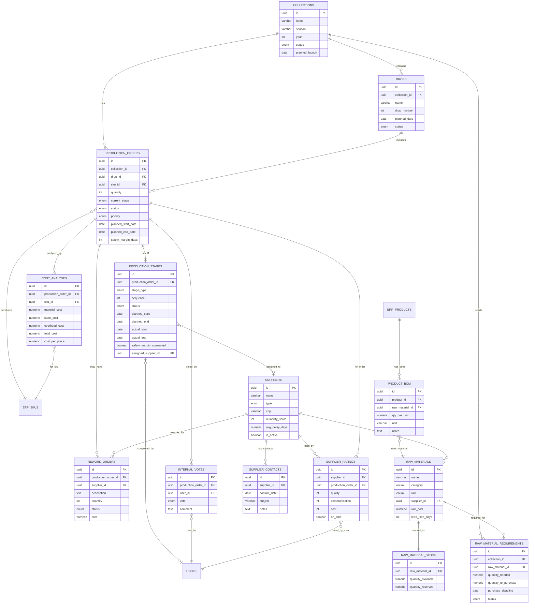

# PCP (Planejamento e Controle de Producao) — Module Spec

> **Module:** PCP / Production Planning & Control
> **Schema:** `pcp`
> **Route prefix:** `/api/v1/pcp`
> **Admin UI route group:** `(admin)/pcp/*`
> **Version:** 1.0
> **Date:** March 2026
> **Status:** Approved
> **Priority:** HIGHEST — largest operational bottleneck at CIENA
> **Replaces:** Nothing (new capability — previously managed via spreadsheets and WhatsApp)
> **Inspiration:** Colecao.Moda PLM (adapted for streetwear drop model)
> **References:** [DATABASE.md](../../architecture/DATABASE.md), [API.md](../../architecture/API.md), [AUTH.md](../../architecture/AUTH.md), [NOTIFICATIONS.md](../../platform/NOTIFICATIONS.md), [GLOSSARY.md](../../dev/GLOSSARY.md)

---

## 1. Overview

The PCP module is the **production nerve center** of Ambaril. It manages the entire production lifecycle for CIENA's streetwear collections and drops — from initial concept through pattern-making, sampling, approval, material sourcing, cutting, sewing, finishing, quality control, and final stock entry. Every garment that reaches a customer passes through this pipeline.

CIENA operates on a **collection/drop model**: seasonal collections contain multiple drops, each drop contains multiple production orders (OPs), and each OP tracks the manufacturing of a specific SKU through 11 sequential stages. The PCP module provides full visibility into where every piece is in the pipeline, which suppliers are performing, what materials are needed, and what everything costs.

**This is the highest-priority module** because production is CIENA's biggest operational bottleneck. Before Ambaril, Tavares managed production via spreadsheets and WhatsApp messages to suppliers, with no systematic tracking of deadlines, costs, or supplier reliability. Missed deadlines cascaded into delayed drops, lost revenue, and frustrated customers.

**5 Sub-modules:**

| Sub-module | Description |
|-----------|-------------|
| **Production Orders (OPs)** | Create, track, and manage production orders through 11 sequential stages with deadline monitoring and escalation alerts |
| **Supplier Management** | Track all suppliers (factories, weaving mills, print shops, dyeing mills, trim suppliers, packaging), rate their performance, log contact history, calculate reliability scores |
| **Raw Materials** | Manage raw material inventory (fabrics, trims, labels, packaging, thread), track stock levels, plan purchases per collection, alert on shortages |
| **Cost Analysis** | Break down production costs per SKU (materials, labor, overhead), calculate cost-per-piece, feed data to ERP margin calculator |
| **Rework** | Track defective batches sent back to suppliers for rework, monitor return timelines, log rework costs |

**Primary users:**

| User | Role | Device | Primary actions |
|------|------|--------|----------------|
| **Tavares** | Operations | Desktop | Create OPs, advance stages, manage suppliers, plan materials, analyze costs, handle rework |
| **Ana Clara** | Logistics | Mobile | Enter finished stock (stock_entry stage), verify quantities, scan/confirm deliveries |
| **Caio** | PM | Desktop | View production dashboard, monitor collection timelines, review bottlenecks (read-only) |
| **Marcus** | Admin | Desktop | Full access, review supplier costs, approve high-cost decisions (read-only day-to-day) |

**Out of scope:** This module does NOT manage finished goods inventory (that is the ERP module). PCP tracks production until the stock_entry stage completes, at which point it hands off to `erp.inventory`. PCP also does NOT manage sales orders, shipping, or customer-facing logistics.

---

## 2. User Stories

### 2.1 Production Orders

| # | As a... | I want to... | So that... |
|---|---------|-------------|------------|
| US01 | Tavares (operations) | create a new production order for a specific SKU within a collection | I can track the manufacturing process from concept to stock entry |
| US02 | Tavares | see all production orders for a collection on a single screen with status indicators | I can quickly assess overall collection progress |
| US03 | Tavares | advance a production stage to "completed" with notes and optional supplier rating | each stage is documented and supplier performance is tracked |
| US04 | Tavares | see a simplified Gantt-style timeline showing all 11 stages for an OP | I can visualize where the OP is in the pipeline and which stages are delayed |
| US05 | Tavares | set planned start and end dates for each stage when creating an OP | the system can calculate deadlines and trigger alerts |
| US06 | Tavares | pause an OP and add a reason | I can handle interruptions (supplier issue, design change) without losing tracking |
| US07 | Tavares | skip a stage with a mandatory reason | non-applicable stages (e.g., no size grading needed) don't block the pipeline |
| US08 | Tavares | assign a supplier to a specific production stage | I know who is responsible for each part of manufacturing |
| US09 | Tavares | set priority (low/medium/high/critical) on an OP | critical drops get attention first |
| US10 | System | automatically create 11 production stages when a new OP is created | Tavares doesn't have to manually set up each stage every time |

### 2.2 Alerts and Monitoring

| # | As a... | I want to... | So that... |
|---|---------|-------------|------------|
| US11 | Tavares | receive an in-app alert when a stage consumes its safety margin | I know a stage is running late before it becomes critical |
| US12 | Tavares | receive a Discord @mention when a stage deadline is tomorrow and the stage is not complete | I can take urgent action on at-risk stages |
| US13 | Caio (PM) | receive a Discord @mention when a stage is overdue (deadline passed) | I'm aware of critical production delays affecting drop timelines |
| US14 | Marcus (admin) | see production bottlenecks on the main dashboard | I can identify systemic issues without digging into PCP details |
| US15 | Caio | view a collection overview showing all OPs, their stages, and a summary of on-track vs. delayed | I can report production status in team meetings |

### 2.3 Suppliers

| # | As a... | I want to... | So that... |
|---|---------|-------------|------------|
| US16 | Tavares | add a new supplier with contact info, type, and CNPJ | our supplier database is complete and organized |
| US17 | Tavares | rate a supplier after completing a stage they were assigned to (quality, communication, cost, on-time) | supplier reliability scores are based on real data |
| US18 | Tavares | see a supplier's reliability score, average delay, and rating history | I can make informed decisions about which supplier to use |
| US19 | Tavares | log a contact interaction with a supplier (call, email, visit) with notes | we have a record of all supplier communications |
| US20 | System | automatically recalculate supplier reliability scores daily | scores always reflect the latest performance data |
| US21 | System | alert when a supplier has been late on 3 of the last 5 deliveries | I'm warned about declining supplier performance |

### 2.4 Raw Materials

| # | As a... | I want to... | So that... |
|---|---------|-------------|------------|
| US22 | Tavares | see all raw materials with current stock levels and alert badges for low stock | I know what needs to be reordered |
| US23 | Tavares | generate a requirements list for a collection showing what materials are needed vs. what's in stock | I can plan material purchases efficiently |
| US24 | Tavares | set the purchase deadline for materials based on collection launch date and lead times | I order materials in time for production to start |
| US25 | Ana Clara (logistics) | enter raw material stock received from a supplier on her mobile phone | stock levels stay accurate as materials arrive at the warehouse |

### 2.5 Cost Analysis

| # | As a... | I want to... | So that... |
|---|---------|-------------|------------|
| US26 | Tavares | enter material, labor, and overhead costs for an OP and see the cost-per-piece | I know the true production cost of each SKU |
| US27 | Tavares | compare production costs between different suppliers for the same service | I can negotiate better prices or switch suppliers |
| US28 | Marcus | see production cost data feeding into the ERP margin calculator | pricing decisions are based on accurate cost data |

### 2.6 Rework

| # | As a... | I want to... | So that... |
|---|---------|-------------|------------|
| US29 | Tavares | create a rework order when QC identifies defective pieces | defective batches are tracked from detection through resolution |
| US30 | Tavares | track the status of rework (sent to supplier, in rework, returned, completed) | I know where rework batches are and when to expect them back |
| US31 | Tavares | log rework costs against the original OP | true production costs include rework expenses |

### 2.7 Mobile

| # | As a... | I want to... | So that... |
|---|---------|-------------|------------|
| US32 | Ana Clara | complete the stock_entry stage on mobile with large touch-friendly buttons | I can confirm production deliveries on the warehouse floor without a desktop |
| US33 | Ana Clara | select a production order, confirm the SKU and quantity, and mark stock entry complete | the system knows exactly what entered inventory and when |

### 2.8 Pilot Production & Validation

| # | As a... | I want to... | So that... |
|---|---------|-------------|------------|
| US34 | Tavares (operations) | create a pilot production order (50-100 units) to test market response before committing to full-scale production | I can minimize waste on unvalidated designs. OP type `pilot` with fixed qty. Linked to sales data for go/no-go decision in 48h. |
| US35 | Tavares | the system to suggest a full-scale OP when a pilot SKU sells X% in Y days | I can capitalize on champion products quickly. Auto-trigger notification with pre-calculated BOM and suggested quantity. |
| US36 | CIENA team | vote on whether I would buy a product during the approval stage | we have internal validation data before production. Simple poll: sim/nao/talvez + optional comment. Results visible on OP detail. |
| US37 | Caio (PM) | a Product Development Pipeline dashboard showing all concepts in different validation stages | I can track the funnel from idea to production. Kanban view: Conceito → Votacao Interna → Preview Social → Piloto → Dados de Venda → Escala / Descontinuado. |

---

## 3. Data Model

### 3.1 Entity Relationship Diagram



### 3.2 Enums

```sql
-- Defined in DATABASE.md section 3
CREATE TYPE pcp.collection_status AS ENUM ('draft', 'active', 'completed', 'archived');
CREATE TYPE pcp.drop_status AS ENUM ('planned', 'active', 'completed');
CREATE TYPE pcp.production_status AS ENUM ('draft', 'in_progress', 'paused', 'completed', 'cancelled');
CREATE TYPE pcp.stage_type AS ENUM (
    'concept', 'pattern', 'sample', 'approval', 'size_grading',
    'material_purchase', 'cutting', 'sewing', 'finishing', 'qc', 'stock_entry'
);
CREATE TYPE pcp.stage_status AS ENUM ('pending', 'in_progress', 'completed', 'skipped');
CREATE TYPE pcp.priority AS ENUM ('low', 'medium', 'high', 'critical');
CREATE TYPE pcp.supplier_type AS ENUM (
    'factory', 'weaving_mill', 'print_shop', 'dyeing_mill', 'trim_supplier', 'packaging'
);
CREATE TYPE pcp.raw_material_category AS ENUM ('fabric', 'trim', 'label', 'packaging', 'thread', 'other');
CREATE TYPE pcp.raw_material_unit AS ENUM ('meters', 'units', 'kg', 'rolls');
CREATE TYPE pcp.requirement_status AS ENUM ('pending', 'ordered', 'received');
CREATE TYPE pcp.rework_status AS ENUM ('pending', 'sent_to_supplier', 'in_rework', 'returned', 'completed');
CREATE TYPE pcp.op_type AS ENUM ('standard', 'pilot');
CREATE TYPE pcp.vote_choice AS ENUM ('yes', 'no', 'maybe');
CREATE TYPE pcp.pilot_status AS ENUM ('monitoring', 'champion', 'discontinue');
```

### 3.3 Tables

#### 3.3.1 pcp.collections

| Column | Type | Constraints | Description |
|--------|------|-------------|-------------|
| id | UUID | PK, DEFAULT gen_random_uuid() | UUID v7 |
| name | VARCHAR(255) | NOT NULL | e.g., 'Colecao Inverno 2026' |
| season | VARCHAR(50) | NULL | e.g., 'inverno_2026', 'verao_2027' |
| year | INTEGER | NOT NULL | e.g., 2026 |
| status | pcp.collection_status | NOT NULL DEFAULT 'draft' | draft, active, completed, archived |
| planned_launch | DATE | NULL | Target launch date for the collection |
| notes | TEXT | NULL | Internal notes about the collection |
| created_at | TIMESTAMPTZ | NOT NULL DEFAULT NOW() | |
| updated_at | TIMESTAMPTZ | NOT NULL DEFAULT NOW() | |

```sql
CREATE INDEX idx_pcp_collections_status ON pcp.collections (status);
CREATE INDEX idx_pcp_collections_year ON pcp.collections (year);
CREATE INDEX idx_pcp_collections_launch ON pcp.collections (planned_launch);
```

#### 3.3.2 pcp.drops

| Column | Type | Constraints | Description |
|--------|------|-------------|-------------|
| id | UUID | PK, DEFAULT gen_random_uuid() | |
| collection_id | UUID | NOT NULL, FK pcp.collections(id) ON DELETE CASCADE | Parent collection |
| name | VARCHAR(255) | NOT NULL | e.g., 'Drop 13' |
| drop_number | INTEGER | NOT NULL | Sequential number within collection |
| planned_date | DATE | NULL | Planned launch date for this drop |
| actual_date | DATE | NULL | Actual launch date (filled when launched) |
| status | pcp.drop_status | NOT NULL DEFAULT 'planned' | planned, active, completed |
| notes | TEXT | NULL | |
| created_at | TIMESTAMPTZ | NOT NULL DEFAULT NOW() | |
| updated_at | TIMESTAMPTZ | NOT NULL DEFAULT NOW() | |

```sql
CREATE INDEX idx_pcp_drops_collection ON pcp.drops (collection_id);
CREATE INDEX idx_pcp_drops_status ON pcp.drops (status);
CREATE INDEX idx_pcp_drops_planned ON pcp.drops (planned_date);
CREATE UNIQUE INDEX idx_pcp_drops_number ON pcp.drops (collection_id, drop_number);
```

#### 3.3.3 pcp.production_orders

| Column | Type | Constraints | Description |
|--------|------|-------------|-------------|
| id | UUID | PK, DEFAULT gen_random_uuid() | |
| collection_id | UUID | NOT NULL, FK pcp.collections(id) | |
| drop_id | UUID | NULL, FK pcp.drops(id) | Nullable -- not all OPs belong to a drop |
| name | VARCHAR(255) | NOT NULL | OP name / description |
| description | TEXT | NULL | Detailed production notes |
| sku_id | UUID | NOT NULL, FK erp.skus(id) | Which SKU is being produced |
| quantity | INTEGER | NOT NULL, CHECK (quantity > 0) | How many units to produce |
| current_stage | pcp.stage_type | NOT NULL DEFAULT 'concept' | Current active stage |
| status | pcp.production_status | NOT NULL DEFAULT 'draft' | draft, in_progress, paused, completed, cancelled |
| planned_start_date | DATE | NULL | Planned production start |
| planned_end_date | DATE | NULL | Planned production end |
| actual_start_date | DATE | NULL | Actual start (set when first stage begins) |
| actual_end_date | DATE | NULL | Actual end (set when stock_entry completes) |
| safety_margin_days | INTEGER | NOT NULL DEFAULT 3 | Buffer days per stage before alerts escalate |
| priority | pcp.priority | NOT NULL DEFAULT 'medium' | low, medium, high, critical |
| op_type | pcp.op_type | NOT NULL DEFAULT 'standard' | standard or pilot. Pilot OPs have reduced qty for market validation |
| pilot_qty | INTEGER | NULL, CHECK (pilot_qty BETWEEN 50 AND 100) | Used only when `op_type = 'pilot'`. Fixed qty between 50-100 units (configurable per product category) |
| pilot_status | pcp.pilot_status | NULL | NULL for standard OPs. Set by champion_detection job: monitoring, champion, discontinue |
| pilot_scale_factor | INTEGER | NULL DEFAULT 10 | Multiplier for suggested full-scale qty when pilot is flagged as champion |
| notes | TEXT | NULL | |
| created_by | UUID | NOT NULL, FK global.users(id) | Who created this OP |
| created_at | TIMESTAMPTZ | NOT NULL DEFAULT NOW() | |
| updated_at | TIMESTAMPTZ | NOT NULL DEFAULT NOW() | |

```sql
CREATE INDEX idx_pcp_po_collection ON pcp.production_orders (collection_id);
CREATE INDEX idx_pcp_po_drop ON pcp.production_orders (drop_id) WHERE drop_id IS NOT NULL;
CREATE INDEX idx_pcp_po_sku ON pcp.production_orders (sku_id);
CREATE INDEX idx_pcp_po_status ON pcp.production_orders (status);
CREATE INDEX idx_pcp_po_stage ON pcp.production_orders (current_stage);
CREATE INDEX idx_pcp_po_priority ON pcp.production_orders (priority) WHERE priority IN ('high', 'critical');
CREATE INDEX idx_pcp_po_planned_end ON pcp.production_orders (planned_end_date);
CREATE INDEX idx_pcp_po_created_by ON pcp.production_orders (created_by);
CREATE INDEX idx_pcp_po_op_type ON pcp.production_orders (op_type) WHERE op_type = 'pilot';
CREATE INDEX idx_pcp_po_pilot_status ON pcp.production_orders (pilot_status) WHERE pilot_status IS NOT NULL;
```

#### 3.3.4 pcp.production_stages

| Column | Type | Constraints | Description |
|--------|------|-------------|-------------|
| id | UUID | PK, DEFAULT gen_random_uuid() | |
| production_order_id | UUID | NOT NULL, FK pcp.production_orders(id) ON DELETE CASCADE | Parent OP |
| stage_type | pcp.stage_type | NOT NULL | concept, pattern, sample, approval, size_grading, material_purchase, cutting, sewing, finishing, qc, stock_entry |
| sequence | INTEGER | NOT NULL, CHECK (sequence BETWEEN 1 AND 11) | Order in the production flow |
| status | pcp.stage_status | NOT NULL DEFAULT 'pending' | pending, in_progress, completed, skipped |
| planned_start | DATE | NULL | Planned start for this stage |
| planned_end | DATE | NULL | Planned end / deadline for this stage |
| actual_start | DATE | NULL | When stage actually began |
| actual_end | DATE | NULL | When stage was actually completed |
| safety_margin_consumed | BOOLEAN | NOT NULL DEFAULT FALSE | TRUE when actual_end > planned_end |
| assigned_supplier_id | UUID | NULL, FK pcp.suppliers(id) | Supplier responsible for this stage |
| cost | NUMERIC(12,2) | NULL | Cost incurred at this stage |
| notes | TEXT | NULL | Completion notes, skip reason, etc. |
| completed_by | UUID | NULL, FK global.users(id) | Who marked this stage complete |
| created_at | TIMESTAMPTZ | NOT NULL DEFAULT NOW() | |
| updated_at | TIMESTAMPTZ | NOT NULL DEFAULT NOW() | |

```sql
CREATE INDEX idx_pcp_ps_order ON pcp.production_stages (production_order_id);
CREATE INDEX idx_pcp_ps_type ON pcp.production_stages (stage_type);
CREATE INDEX idx_pcp_ps_status ON pcp.production_stages (status);
CREATE INDEX idx_pcp_ps_supplier ON pcp.production_stages (assigned_supplier_id) WHERE assigned_supplier_id IS NOT NULL;
CREATE INDEX idx_pcp_ps_planned_end ON pcp.production_stages (planned_end) WHERE status IN ('pending', 'in_progress');
CREATE UNIQUE INDEX idx_pcp_ps_unique ON pcp.production_stages (production_order_id, stage_type);
```

#### 3.3.5 pcp.suppliers

| Column | Type | Constraints | Description |
|--------|------|-------------|-------------|
| id | UUID | PK, DEFAULT gen_random_uuid() | |
| name | VARCHAR(255) | NOT NULL | Company name |
| type | pcp.supplier_type | NOT NULL | factory, weaving_mill, print_shop, dyeing_mill, trim_supplier, packaging |
| contact_name | VARCHAR(255) | NULL | Primary contact person |
| contact_phone | VARCHAR(20) | NULL | E.164 format |
| contact_email | VARCHAR(255) | NULL | |
| address | TEXT | NULL | Full address |
| cnpj | VARCHAR(18) | NULL, UNIQUE (WHERE deleted_at IS NULL) | Brazilian company ID (00.000.000/0000-00) |
| reliability_score | NUMERIC(5,2) | NOT NULL DEFAULT 50.00 | 0-100, calculated from delivery/quality/cost history |
| avg_delay_days | NUMERIC(5,1) | NOT NULL DEFAULT 0 | Average days late across all orders (negative = early) |
| total_orders | INTEGER | NOT NULL DEFAULT 0 | Total production stages assigned to this supplier |
| on_time_deliveries | INTEGER | NOT NULL DEFAULT 0 | Stages completed on or before planned_end |
| quality_rating | NUMERIC(3,1) | NOT NULL DEFAULT 3.0 | Average quality rating 1.0-5.0 |
| communication_rating | NUMERIC(3,1) | NOT NULL DEFAULT 3.0 | Average communication rating 1.0-5.0 |
| cost_rating | NUMERIC(3,1) | NOT NULL DEFAULT 3.0 | Average cost-effectiveness rating 1.0-5.0 |
| notes | TEXT | NULL | |
| is_active | BOOLEAN | NOT NULL DEFAULT TRUE | |
| created_at | TIMESTAMPTZ | NOT NULL DEFAULT NOW() | |
| updated_at | TIMESTAMPTZ | NOT NULL DEFAULT NOW() | |
| deleted_at | TIMESTAMPTZ | NULL | Soft delete |

```sql
CREATE INDEX idx_pcp_suppliers_type ON pcp.suppliers (type);
CREATE INDEX idx_pcp_suppliers_active ON pcp.suppliers (is_active) WHERE is_active = TRUE;
CREATE INDEX idx_pcp_suppliers_reliability ON pcp.suppliers (reliability_score DESC);
CREATE UNIQUE INDEX idx_pcp_suppliers_cnpj ON pcp.suppliers (cnpj) WHERE cnpj IS NOT NULL AND deleted_at IS NULL;
```

#### 3.3.6 pcp.supplier_contacts

| Column | Type | Constraints | Description |
|--------|------|-------------|-------------|
| id | UUID | PK, DEFAULT gen_random_uuid() | |
| supplier_id | UUID | NOT NULL, FK pcp.suppliers(id) ON DELETE CASCADE | |
| contact_date | TIMESTAMPTZ | NOT NULL DEFAULT NOW() | When the contact happened |
| subject | VARCHAR(255) | NOT NULL | Brief subject of the interaction |
| notes | TEXT | NULL | Detailed notes about the conversation |
| contacted_by | UUID | NOT NULL, FK global.users(id) | Who made the contact |
| created_at | TIMESTAMPTZ | NOT NULL DEFAULT NOW() | |

```sql
CREATE INDEX idx_pcp_sc_supplier ON pcp.supplier_contacts (supplier_id);
CREATE INDEX idx_pcp_sc_date ON pcp.supplier_contacts (contact_date DESC);
```

#### 3.3.7 pcp.supplier_ratings

| Column | Type | Constraints | Description |
|--------|------|-------------|-------------|
| id | UUID | PK, DEFAULT gen_random_uuid() | |
| supplier_id | UUID | NOT NULL, FK pcp.suppliers(id) | |
| production_order_id | UUID | NOT NULL, FK pcp.production_orders(id) | Which OP this rating is for |
| quality | INTEGER | NOT NULL, CHECK (quality BETWEEN 1 AND 5) | Quality score |
| communication | INTEGER | NOT NULL, CHECK (communication BETWEEN 1 AND 5) | Communication score |
| cost | INTEGER | NOT NULL, CHECK (cost BETWEEN 1 AND 5) | Cost-effectiveness score |
| on_time | BOOLEAN | NOT NULL | Was this delivery on time? |
| delay_days | INTEGER | NULL | Days late (NULL if on_time = true, 0+ if late) |
| notes | TEXT | NULL | Optional comments |
| rated_by | UUID | NOT NULL, FK global.users(id) | Who submitted this rating |
| created_at | TIMESTAMPTZ | NOT NULL DEFAULT NOW() | |

```sql
CREATE INDEX idx_pcp_sr_supplier ON pcp.supplier_ratings (supplier_id);
CREATE INDEX idx_pcp_sr_order ON pcp.supplier_ratings (production_order_id);
CREATE INDEX idx_pcp_sr_rated_by ON pcp.supplier_ratings (rated_by);
```

#### 3.3.8 pcp.raw_materials

| Column | Type | Constraints | Description |
|--------|------|-------------|-------------|
| id | UUID | PK, DEFAULT gen_random_uuid() | |
| name | VARCHAR(255) | NOT NULL | e.g., 'Malha 30/1 Preta', 'Ziper YKK 20cm' |
| category | pcp.raw_material_category | NOT NULL | fabric, trim, label, packaging, thread, other |
| unit | pcp.raw_material_unit | NOT NULL | meters, units, kg, rolls |
| supplier_id | UUID | NULL, FK pcp.suppliers(id) | Default/preferred supplier |
| unit_cost | NUMERIC(10,2) | NOT NULL DEFAULT 0 | Latest known cost per unit |
| min_order_quantity | INTEGER | NOT NULL DEFAULT 0 | Minimum order quantity from supplier |
| lead_time_days | INTEGER | NOT NULL DEFAULT 0 | Typical supplier lead time in days |
| notes | TEXT | NULL | |
| is_active | BOOLEAN | NOT NULL DEFAULT TRUE | |
| created_at | TIMESTAMPTZ | NOT NULL DEFAULT NOW() | |
| updated_at | TIMESTAMPTZ | NOT NULL DEFAULT NOW() | |

```sql
CREATE INDEX idx_pcp_rm_category ON pcp.raw_materials (category);
CREATE INDEX idx_pcp_rm_supplier ON pcp.raw_materials (supplier_id) WHERE supplier_id IS NOT NULL;
CREATE INDEX idx_pcp_rm_active ON pcp.raw_materials (is_active) WHERE is_active = TRUE;
```

#### 3.3.9 pcp.raw_material_stock

| Column | Type | Constraints | Description |
|--------|------|-------------|-------------|
| id | UUID | PK, DEFAULT gen_random_uuid() | |
| raw_material_id | UUID | NOT NULL, FK pcp.raw_materials(id), UNIQUE | One stock record per material |
| quantity_available | NUMERIC(10,2) | NOT NULL DEFAULT 0 | Current available stock |
| quantity_reserved | NUMERIC(10,2) | NOT NULL DEFAULT 0 | Reserved for upcoming production |
| last_entry_at | TIMESTAMPTZ | NULL | Last time stock was added |
| last_exit_at | TIMESTAMPTZ | NULL | Last time stock was consumed |
| updated_at | TIMESTAMPTZ | NOT NULL DEFAULT NOW() | |

```sql
CREATE UNIQUE INDEX idx_pcp_rms_material ON pcp.raw_material_stock (raw_material_id);
```

#### 3.3.10 pcp.raw_material_requirements

| Column | Type | Constraints | Description |
|--------|------|-------------|-------------|
| id | UUID | PK, DEFAULT gen_random_uuid() | |
| collection_id | UUID | NOT NULL, FK pcp.collections(id) | Which collection needs this material |
| raw_material_id | UUID | NOT NULL, FK pcp.raw_materials(id) | Which material |
| quantity_needed | NUMERIC(10,2) | NOT NULL | Total quantity needed for the collection |
| quantity_in_stock | NUMERIC(10,2) | NOT NULL DEFAULT 0 | Snapshot of available stock at calculation time |
| quantity_to_purchase | NUMERIC(10,2) | NOT NULL DEFAULT 0 | quantity_needed - quantity_in_stock (if positive) |
| purchase_deadline | DATE | NULL | When material must be ordered to arrive on time |
| status | pcp.requirement_status | NOT NULL DEFAULT 'pending' | pending, ordered, received |
| supplier_id | UUID | NULL, FK pcp.suppliers(id) | Which supplier to order from |
| notes | TEXT | NULL | |
| created_at | TIMESTAMPTZ | NOT NULL DEFAULT NOW() | |
| updated_at | TIMESTAMPTZ | NOT NULL DEFAULT NOW() | |

```sql
CREATE INDEX idx_pcp_rmr_collection ON pcp.raw_material_requirements (collection_id);
CREATE INDEX idx_pcp_rmr_material ON pcp.raw_material_requirements (raw_material_id);
CREATE INDEX idx_pcp_rmr_status ON pcp.raw_material_requirements (status);
CREATE INDEX idx_pcp_rmr_deadline ON pcp.raw_material_requirements (purchase_deadline) WHERE status = 'pending';
```

#### 3.3.11 pcp.cost_analyses

| Column | Type | Constraints | Description |
|--------|------|-------------|-------------|
| id | UUID | PK, DEFAULT gen_random_uuid() | |
| production_order_id | UUID | NULL, FK pcp.production_orders(id) | Associated OP (nullable for standalone cost estimates) |
| sku_id | UUID | NOT NULL, FK erp.skus(id) | Which SKU |
| material_cost | NUMERIC(10,2) | NOT NULL DEFAULT 0 | Total raw material cost |
| labor_cost | NUMERIC(10,2) | NOT NULL DEFAULT 0 | Factory labor cost |
| overhead_cost | NUMERIC(10,2) | NOT NULL DEFAULT 0 | Factory overhead, utilities, misc |
| total_cost | NUMERIC(10,2) | NOT NULL DEFAULT 0 | material + labor + overhead |
| cost_per_piece | NUMERIC(10,2) | NOT NULL DEFAULT 0 | total_cost / quantity |
| quantity | INTEGER | NOT NULL, CHECK (quantity > 0) | Units in this cost calculation |
| notes | TEXT | NULL | |
| calculated_by | UUID | NOT NULL, FK global.users(id) | Who entered this cost analysis |
| created_at | TIMESTAMPTZ | NOT NULL DEFAULT NOW() | |
| updated_at | TIMESTAMPTZ | NOT NULL DEFAULT NOW() | |

```sql
CREATE INDEX idx_pcp_ca_order ON pcp.cost_analyses (production_order_id) WHERE production_order_id IS NOT NULL;
CREATE INDEX idx_pcp_ca_sku ON pcp.cost_analyses (sku_id);
```

#### 3.3.12 pcp.rework_orders

| Column | Type | Constraints | Description |
|--------|------|-------------|-------------|
| id | UUID | PK, DEFAULT gen_random_uuid() | |
| production_order_id | UUID | NOT NULL, FK pcp.production_orders(id) | Source OP |
| supplier_id | UUID | NULL, FK pcp.suppliers(id) | Supplier doing the rework |
| description | TEXT | NOT NULL | What needs to be fixed |
| quantity | INTEGER | NOT NULL, CHECK (quantity > 0) | Units needing rework |
| status | pcp.rework_status | NOT NULL DEFAULT 'pending' | pending, sent_to_supplier, in_rework, returned, completed |
| sent_at | DATE | NULL | Date sent to supplier |
| expected_return | DATE | NULL | Expected return date |
| actual_return | DATE | NULL | Actual return date |
| cost | NUMERIC(10,2) | NULL | Rework cost |
| notes | TEXT | NULL | |
| created_by | UUID | NOT NULL, FK global.users(id) | Who created this rework order |
| created_at | TIMESTAMPTZ | NOT NULL DEFAULT NOW() | |
| updated_at | TIMESTAMPTZ | NOT NULL DEFAULT NOW() | |

```sql
CREATE INDEX idx_pcp_rw_order ON pcp.rework_orders (production_order_id);
CREATE INDEX idx_pcp_rw_supplier ON pcp.rework_orders (supplier_id) WHERE supplier_id IS NOT NULL;
CREATE INDEX idx_pcp_rw_status ON pcp.rework_orders (status);
```

#### 3.3.13 pcp.product_bom

Bill of Materials linking products to raw materials. Enables auto-calculation of material requirements from OP quantities and per-SKU material specs (resolves OQ5).

| Column | Type | Constraints | Description |
|--------|------|-------------|-------------|
| id | UUID | PK, DEFAULT gen_random_uuid() | UUID v7 |
| product_id | UUID | NOT NULL, FK erp.products(id) | Which product this BOM entry is for |
| raw_material_id | UUID | NOT NULL, FK pcp.raw_materials(id) | Which raw material is required |
| qty_per_unit | NUMERIC(10,4) | NOT NULL, CHECK (qty_per_unit > 0) | Quantity of raw material needed per unit produced (e.g., 3.0000 meters of fabric per shirt) |
| unit | VARCHAR(20) | NOT NULL | Unit of measurement (kg, m, un, etc.) |
| notes | TEXT | NULL | Optional notes (e.g., "includes 10% waste allowance") |
| created_at | TIMESTAMPTZ | NOT NULL DEFAULT NOW() | |
| updated_at | TIMESTAMPTZ | NOT NULL DEFAULT NOW() | |
| deleted_at | TIMESTAMPTZ | NULL | Soft delete |

```sql
CREATE INDEX idx_pcp_bom_product ON pcp.product_bom (product_id);
CREATE INDEX idx_pcp_bom_material ON pcp.product_bom (raw_material_id);
CREATE UNIQUE INDEX idx_pcp_bom_unique ON pcp.product_bom (product_id, raw_material_id) WHERE deleted_at IS NULL;
```

#### 3.3.14 pcp.internal_votes

Team votes on products during the approval stage. Provides internal validation data before committing to production.

| Column | Type | Constraints | Description |
|--------|------|-------------|-------------|
| id | UUID | PK, DEFAULT gen_random_uuid() | UUID v7 |
| production_order_id | UUID | NOT NULL, FK pcp.production_orders(id) ON DELETE CASCADE | Which OP is being voted on |
| user_id | UUID | NOT NULL, FK global.users(id) | Who cast this vote |
| vote | pcp.vote_choice | NOT NULL | yes, no, maybe |
| comment | TEXT | NULL | Optional comment explaining the vote |
| created_at | TIMESTAMPTZ | NOT NULL DEFAULT NOW() | |

```sql
CREATE INDEX idx_pcp_iv_order ON pcp.internal_votes (production_order_id);
CREATE INDEX idx_pcp_iv_user ON pcp.internal_votes (user_id);
CREATE UNIQUE INDEX idx_pcp_iv_unique ON pcp.internal_votes (production_order_id, user_id);
```

### 3.4 Cross-schema References

```
pcp.production_orders.sku_id           ──► erp.skus(id)
pcp.production_orders.created_by       ──► global.users(id)
pcp.production_stages.completed_by     ──► global.users(id)
pcp.supplier_contacts.contacted_by     ──► global.users(id)
pcp.supplier_ratings.rated_by          ──► global.users(id)
pcp.cost_analyses.calculated_by        ──► global.users(id)
pcp.cost_analyses.sku_id               ──► erp.skus(id)
pcp.rework_orders.created_by           ──► global.users(id)
pcp.product_bom.product_id             ──► erp.products(id)
pcp.product_bom.raw_material_id        ──► pcp.raw_materials(id)
pcp.internal_votes.production_order_id ──► pcp.production_orders(id)
pcp.internal_votes.user_id             ──► global.users(id)

erp.inventory.quantity_in_production   ◄── updated by PCP stage completion (stock_entry)
erp.skus.cost_price                    ◄── fed from pcp.cost_analyses.cost_per_piece
erp.inventory_movements                ◄── created on stock_entry completion (type = 'production_entry')
```

---

## 4. Screens & UI

All screens use the Ambaril dark-mode design system. Desktop-first for Tavares, with a mobile-optimized stock entry flow for Ana Clara.

### 4.1 Production Orders List

```
+------------------------------------------------------------------------------+
|  PCP > Ordens de Producao                              [+ Nova OP] [Filtros] |
+------------------------------------------------------------------------------+
|                                                                              |
|  Colecao: [Inverno 2026          v]  Status: [Todos     v]  Buscar: [____]  |
|                                                                              |
|  +------------------------------------------------------------------------+  |
|  | OP-001  Camiseta Preta Basic P             Prioridade: ALTA            |  |
|  | SKU: CIE-CAM-001-P  |  Qtd: 200  |  Drop 13                          |  |
|  |                                                                        |  |
|  | [concept][pattern][sample][approv][gradin][materi][cuttin][sewing]...   |  |
|  | [##████][########][########][########][########][>>>>>>][      ][    ]  |  |
|  |                                                                        |  |
|  | Estagio atual: CORTE (7/11)      Prazo: 25/04/2026                    |  |
|  | [========================================>..........] 63%              |  |
|  |                                                                        |  |
|  | [!] Margem de seguranca consumida no estagio "Costura"                |  |
|  +------------------------------------------------------------------------+  |
|                                                                              |
|  +------------------------------------------------------------------------+  |
|  | OP-002  Moletom Oversized Drop 13 M        Prioridade: CRITICA         |  |
|  | SKU: CIE-MOL-003-M  |  Qtd: 150  |  Drop 13                          |  |
|  |                                                                        |  |
|  | [concept][pattern][sample][approv][gradin][materi][cuttin][sewing]...   |  |
|  | [########][########][########][########][>>>>>>][      ][      ][    ]  |  |
|  |                                                                        |  |
|  | Estagio atual: GRADUACAO (5/11)   Prazo: 20/04/2026                   |  |
|  | [=============================>.....................] 45%              |  |
|  |                                                                        |  |
|  | [!!] Estagio "Amostra" atrasado 2 dias                                |  |
|  +------------------------------------------------------------------------+  |
|                                                                              |
|  +------------------------------------------------------------------------+  |
|  | OP-003  Calca Cargo Wide Leg G             Prioridade: MEDIA           |  |
|  | SKU: CIE-CRG-007-G  |  Qtd: 100  |  Drop 14                          |  |
|  |                                                                        |  |
|  | [concept][pattern][sample][approv][gradin][materi][cuttin][sewing]...   |  |
|  | [########][>>>>>>][      ][      ][      ][      ][      ][      ]     |  |
|  |                                                                        |  |
|  | Estagio atual: MODELAGEM (2/11)   Prazo: 15/05/2026                   |  |
|  | [=======>..........................................] 9%                 |  |
|  +------------------------------------------------------------------------+  |
|                                                                              |
|  Mostrando 1-10 de 24 OPs                        [< Anterior] [Proximo >]   |
+------------------------------------------------------------------------------+

Legend:
  [########] = completed stage (green)
  [>>>>>>]   = in progress stage (blue, animated)
  [      ]   = pending stage (dark/muted)
  [!]        = warning badge (yellow)
  [!!]       = critical badge (red)
```

### 4.2 Production Order Detail (Gantt Timeline)

```
+------------------------------------------------------------------------------+
|  PCP > OPs > OP-001: Camiseta Preta Basic P                [Editar] [Pausar]|
+------------------------------------------------------------------------------+
|                                                                              |
|  Status: EM ANDAMENTO    Prioridade: [ALTA]    SKU: CIE-CAM-001-P          |
|  Colecao: Inverno 2026   Drop: 13              Quantidade: 200 un           |
|  Criado por: Tavares em 01/03/2026                                          |
|  Prazo: 01/03/2026 - 25/04/2026    Margem de seguranca: 3 dias/estagio     |
|                                                                              |
|  TIMELINE DE PRODUCAO                                                        |
|  ===================                                                         |
|                                                                              |
|         Mar 01    Mar 08    Mar 15    Mar 22    Mar 29    Abr 05    Abr 12  |
|            |         |         |         |         |         |         |     |
|  1. Conceito                                                                 |
|     [########################################] 01/03 - 05/03  CONCLUIDO     |
|                                                                              |
|  2. Modelagem                                                                |
|     [########################################] 06/03 - 10/03  CONCLUIDO     |
|                                                                              |
|  3. Amostra                                                                  |
|     [########################################] 11/03 - 15/03  CONCLUIDO     |
|     Fornecedor: Confeccoes Silva                                             |
|                                                                              |
|  4. Aprovacao                                                                |
|     [########################################] 16/03 - 17/03  CONCLUIDO     |
|                                                                              |
|  5. Graduacao                                                                |
|     [########################################] 18/03 - 20/03  CONCLUIDO     |
|                                                                              |
|  6. Compra Materiais                                                         |
|     [########################################] 21/03 - 28/03  CONCLUIDO     |
|     Fornecedor: Tecelagem Nordeste                                           |
|                                                                              |
|  7. Corte                                                                    |
|     [>>>>>>>>>>>>>>>>>>.....................] 29/03 - 05/04  EM ANDAMENTO   |
|     Fornecedor: Confeccoes Silva                                             |
|                                                                              |
|  8. Costura                                                                  |
|     [                                      ] 06/04 - 12/04  PENDENTE       |
|     Fornecedor: Confeccoes Silva                                             |
|                                                                              |
|  9. Acabamento                                                               |
|     [                                      ] 13/04 - 16/04  PENDENTE       |
|                                                                              |
| 10. Controle Qualidade                                                       |
|     [                                      ] 17/04 - 20/04  PENDENTE       |
|                                                                              |
| 11. Entrada Estoque                                                          |
|     [                                      ] 21/04 - 22/04  PENDENTE       |
|                                                                              |
+------ Stage Actions ---------------------------------------------------------+
|                                                                              |
|  Estagio atual: 7. Corte                                                    |
|  [Concluir Estagio]  [Pular Estagio]  [Adicionar Nota]                     |
|                                                                              |
+------ Historico -------------------------------------------------------------+
|                                                                              |
|  22/03 14:30  Tavares concluiu "Compra Materiais"                           |
|               Nota: "Malha 30/1 entregue. Ziper atrasou 1 dia."            |
|  17/03 10:00  Tavares concluiu "Aprovacao"                                  |
|               Nota: "Caio aprovou amostra. Sem alteracoes."                 |
|  15/03 16:45  Tavares concluiu "Amostra"                                   |
|               Avaliacao Confeccoes Silva: Qualidade 4, Comunicacao 5        |
|  ...                                                                         |
|                                                                              |
+------ Custos ---------------------------------------------------------------+
|  Material: R$ 3.200,00  |  Mao de obra: R$ 2.800,00  |  Overhead: R$ 600,00|
|  Total: R$ 6.600,00     |  Custo/peca: R$ 33,00                            |
|                                                                              |
+------ Retrabalhos ----------------------------------------------------------+
|  Nenhum retrabalho registrado.    [+ Novo Retrabalho]                       |
+------------------------------------------------------------------------------+

Color coding:
  [####] Green  = Completed on time
  [####] Yellow = Completed, safety margin consumed
  [>>>>] Blue   = In progress
  [    ] Gray   = Pending
  [####] Red    = Overdue (not yet completed)
```

### 4.3 Create/Edit Production Order Form

```
+------------------------------------------------------------------------------+
|  PCP > OPs > Nova Ordem de Producao                                          |
+------------------------------------------------------------------------------+
|                                                                              |
|  INFORMACOES BASICAS                                                         |
|  --------------------                                                        |
|  Nome da OP:      [Camiseta Preta Basic P x200________________]             |
|  Descricao:       [Producao de 200 un camiseta preta basic____]             |
|                   [tamanho P para o Drop 13___________________]             |
|                                                                              |
|  Colecao:         [Inverno 2026                            v]               |
|  Drop (opcional): [Drop 13                                 v]               |
|  SKU:             [CIE-CAM-001-P - Camiseta Preta Basic P  v]               |
|  Quantidade:      [200_____]                                                 |
|  Prioridade:      ( ) Baixa  ( ) Media  (o) Alta  ( ) Critica               |
|                                                                              |
|  DATAS PLANEJADAS                                                            |
|  -----------------                                                           |
|  Inicio planejado:   [01/03/2026]                                           |
|  Fim planejado:      [25/04/2026]                                           |
|  Margem seguranca:   [3] dias por estagio                                   |
|                                                                              |
|  ATRIBUICAO DE FORNECEDORES POR ESTAGIO (opcional)                          |
|  ------------------------------------------------                           |
|   3. Amostra:           [Confeccoes Silva               v]                  |
|   6. Compra Materiais:  [Tecelagem Nordeste             v]                  |
|   7. Corte:             [Confeccoes Silva               v]                  |
|   8. Costura:           [Confeccoes Silva               v]                  |
|   9. Acabamento:        [-- Nenhum --                   v]                  |
|  (somente estagios que tipicamente envolvem fornecedor)                     |
|                                                                              |
|  DATAS POR ESTAGIO (auto-calculadas, editaveis)                             |
|  -----------------------------------------------                            |
|  |  #  | Estagio            | Inicio     | Fim        | Dias |             |
|  |-----|--------------------|------------|------------|------|             |
|  |  1  | Conceito           | 01/03/2026 | 05/03/2026 |   5  |             |
|  |  2  | Modelagem          | 06/03/2026 | 10/03/2026 |   5  |             |
|  |  3  | Amostra            | 11/03/2026 | 15/03/2026 |   5  |             |
|  |  4  | Aprovacao          | 16/03/2026 | 17/03/2026 |   2  |             |
|  |  5  | Graduacao          | 18/03/2026 | 20/03/2026 |   3  |             |
|  |  6  | Compra Materiais   | 21/03/2026 | 28/03/2026 |   8  |             |
|  |  7  | Corte              | 29/03/2026 | 05/04/2026 |   7  |             |
|  |  8  | Costura            | 06/04/2026 | 12/04/2026 |   7  |             |
|  |  9  | Acabamento         | 13/04/2026 | 16/04/2026 |   4  |             |
|  | 10  | Controle Qualidade | 17/04/2026 | 20/04/2026 |   4  |             |
|  | 11  | Entrada Estoque    | 21/04/2026 | 22/04/2026 |   2  |             |
|                                                                              |
|  Notas:           [________________________________________]                |
|                   [________________________________________]                |
|                                                                              |
|  [Cancelar]                                              [Salvar Rascunho]  |
|                                                       [Salvar e Iniciar]    |
+------------------------------------------------------------------------------+
```

### 4.4 Stage Advancement Dialog

```
+------------------------------------------------------+
|  Concluir Estagio: 7. Corte                     [X]  |
+------------------------------------------------------+
|                                                       |
|  OP: OP-001 Camiseta Preta Basic P                   |
|  Fornecedor neste estagio: Confeccoes Silva           |
|                                                       |
|  Planejado: 29/03 - 05/04                            |
|  Hoje: 04/04   [Dentro do prazo]                     |
|                                                       |
|  Notas de conclusao:                                  |
|  [Corte finalizado. 200 pecas cortadas.____]         |
|  [Nenhuma perda de material._______________]         |
|                                                       |
|  AVALIAR FORNECEDOR (Confeccoes Silva)               |
|  ------------------------------------                 |
|  Qualidade:     [*] [*] [*] [*] [ ]   4/5           |
|  Comunicacao:   [*] [*] [*] [*] [*]   5/5           |
|  Custo:         [*] [*] [*] [ ] [ ]   3/5           |
|  Entregou no prazo?   (o) Sim  ( ) Nao               |
|                                                       |
|  [Cancelar]                       [Concluir Estagio] |
+------------------------------------------------------+
```

### 4.5 Supplier List

```
+------------------------------------------------------------------------------+
|  PCP > Fornecedores                                   [+ Novo Fornecedor]    |
+------------------------------------------------------------------------------+
|                                                                              |
|  Tipo: [Todos          v]   Status: [Ativos   v]   Buscar: [_____________]  |
|                                                                              |
|  +--------+---------------------+-------------+-------+------+------+-----+ |
|  | Score  | Nome                | Tipo        | CNPJ  | Qual.| Com. |Atraso| |
|  +--------+---------------------+-------------+-------+------+------+-----+ |
|  | [92]   | Confeccoes Silva    | Faccao      | 12.34 | 4.3  | 4.7  | 0.5d| |
|  | ██████ |                     |             | 5.678 |      |      |     | |
|  +--------+---------------------+-------------+-------+------+------+-----+ |
|  | [78]   | Tecelagem Nordeste  | Tecelagem   | 23.45 | 3.8  | 3.5  | 2.1d| |
|  | █████  |                     |             | 6.789 |      |      |     | |
|  +--------+---------------------+-------------+-------+------+------+-----+ |
|  | [65]   | Estamparia Central  | Estamparia  | 34.56 | 4.0  | 3.0  | 3.8d| |
|  | ████   |                     |             | 7.890 |      |      | [!] | |
|  +--------+---------------------+-------------+-------+------+------+-----+ |
|  | [45]   | Tinturaria SP       | Tinturaria  | 45.67 | 2.5  | 2.8  | 5.2d| |
|  | ███    |                     |             | 8.901 |      |      | [!!]| |
|  +--------+---------------------+-------------+-------+------+------+-----+ |
|                                                                              |
|  Score colors: [90-100] green  [70-89] blue  [50-69] yellow  [0-49] red     |
|  [!] = 2+ late deliveries in last 5   [!!] = 3+ late in last 5              |
+------------------------------------------------------------------------------+
```

### 4.6 Supplier Detail

```
+------------------------------------------------------------------------------+
|  PCP > Fornecedores > Confeccoes Silva                         [Editar] [X]  |
+------------------------------------------------------------------------------+
|                                                                              |
|  INFORMACOES                          SCORE DE CONFIABILIDADE                |
|  ----------------                     -----------------------                |
|  Tipo: Faccao                         [==================> 92/100]           |
|  CNPJ: 12.345.678/0001-90                                                   |
|  Contato: Jose Silva                  Entregas no prazo:  87% (26/30)       |
|  Telefone: +55 11 98765-4321         Atraso medio:       0.5 dias           |
|  Email: jose@confsilva.com.br                                                |
|  Endereco: R. Industrial 456,        Qualidade:   [****-] 4.3              |
|    Bras, SP - 03012-000              Comunicacao: [*****] 4.7              |
|                                       Custo:       [***--] 3.2              |
|  Status: [Ativo]                                                             |
|                                                                              |
+------ Historico de OPs ------------------------------------------------------+
|                                                                              |
|  | OP       | SKU              | Estagio      | Status    | Prazo     |     |
|  |----------|------------------|--------------|-----------|-----------|     |
|  | OP-001   | CIE-CAM-001-P    | Corte        | Andamento | 05/04     |     |
|  | OP-001   | CIE-CAM-001-P    | Costura      | Pendente  | 12/04     |     |
|  | OP-002   | CIE-MOL-003-M    | Amostra      | Concluido | 10/03     |     |
|  | OP-005   | CIE-CAM-002-M    | Costura      | Concluido | 28/02     |     |
|  | ...      |                  |              |           |           |     |
|                                                                              |
+------ Avaliacoes Recentes ---------------------------------------------------+
|                                                                              |
|  OP-001, Amostra (15/03): Qual 4, Com 5, Custo 3, No prazo: Sim            |
|  OP-005, Costura (28/02): Qual 5, Com 5, Custo 3, No prazo: Sim            |
|  OP-004, Corte (15/02):   Qual 4, Com 4, Custo 4, No prazo: Nao (+1d)     |
|  ...                                                                         |
|                                                                              |
+------ Registro de Contatos --------------------------------------------------+
|                                                                              |
|  17/03 10:30 - Tavares: "Confirmei prazo do corte OP-001 por telefone"      |
|  10/03 14:00 - Tavares: "Enviamos tecido para amostra OP-001"              |
|  05/03 09:15 - Tavares: "Negociacao de preco para lote de 500 un"          |
|  ...                                                             [+ Contato] |
|                                                                              |
+------------------------------------------------------------------------------+
```

### 4.7 Raw Materials Inventory

```
+------------------------------------------------------------------------------+
|  PCP > Materia-Prima > Estoque                          [+ Novo Material]    |
+------------------------------------------------------------------------------+
|                                                                              |
|  Categoria: [Todas       v]   Status: [Ativos  v]   Buscar: [____________]  |
|                                                                              |
|  +----+-------------------------+----------+--------+---------+------+-----+ |
|  | ID | Material                | Categ.   | Unid.  | Disponiv| Reser| Sts | |
|  +----+-------------------------+----------+--------+---------+------+-----+ |
|  | 01 | Malha 30/1 Preta        | Tecido   | metros | 450.00  | 200  | OK  | |
|  | 02 | Malha 30/1 Branca       | Tecido   | metros | 120.00  | 300  | [!] | |
|  | 03 | Ziper YKK 20cm          | Aviament | un     | 800     | 350  | OK  | |
|  | 04 | Etiqueta Tecida CIENA   | Etiqueta | un     | 2000    | 500  | OK  | |
|  | 05 | Linha Preta Coats       | Linha    | metros | 50.00   | 200  | [!!]| |
|  | 06 | Embalagem Kraft 30x40   | Embalag  | un     | 1500    | 400  | OK  | |
|  | 07 | Malha Moletom Cinza     | Tecido   | metros | 0.00    | 150  | [!!]| |
|  +----+-------------------------+----------+--------+---------+------+-----+ |
|                                                                              |
|  [!]  = Disponivel < Reservado (estoque insuficiente para producao)          |
|  [!!] = Disponivel = 0 ou critico                                            |
+------------------------------------------------------------------------------+
```

### 4.8 Raw Material Requirements per Collection

```
+------------------------------------------------------------------------------+
|  PCP > Materia-Prima > Necessidades por Colecao                              |
+------------------------------------------------------------------------------+
|                                                                              |
|  Colecao: [Inverno 2026                                   v]                |
|  Lancamento planejado: 15/05/2026                                            |
|                                                                              |
|  +-------------------------+----------+----------+----------+--------+-----+ |
|  | Material                | Necessario| Em estoque| A comprar| Prazo  | Sts | |
|  +-------------------------+----------+----------+----------+--------+-----+ |
|  | Malha 30/1 Preta        | 600m     | 450m     | 150m     | 25/03  | [!] | |
|  | Malha 30/1 Branca       | 400m     | 120m     | 280m     | 25/03  | [!!]| |
|  | Malha Moletom Cinza     | 300m     | 0m       | 300m     | 20/03  | [!!]| |
|  | Ziper YKK 20cm          | 350 un   | 800 un   | 0        | --     | OK  | |
|  | Etiqueta Tecida CIENA   | 1200 un  | 2000 un  | 0        | --     | OK  | |
|  | Linha Preta Coats       | 500m     | 50m      | 450m     | 28/03  | [!!]| |
|  | Embalagem Kraft 30x40   | 800 un   | 1500 un  | 0        | --     | OK  | |
|  +-------------------------+----------+----------+----------+--------+-----+ |
|                                                                              |
|  Resumo: 3 materiais com compra pendente | 2 prazos vencendo esta semana    |
|                                                                              |
|  [Recalcular Necessidades]                          [Exportar Pedido Compra] |
+------------------------------------------------------------------------------+
```

### 4.9 Cost Analysis per SKU

```
+------------------------------------------------------------------------------+
|  PCP > Custos > CIE-CAM-001-P Camiseta Preta Basic P                        |
+------------------------------------------------------------------------------+
|                                                                              |
|  OP: OP-001  |  Quantidade: 200 un  |  Calculado por: Tavares em 20/03/2026|
|                                                                              |
|  +----------------------------------+                                        |
|  | CUSTO MATERIAL        R$ 3.200   |                                        |
|  | ================================ |                                        |
|  | Malha 30/1 Preta      R$ 2.400   |  (3m x R$ 4,00/m x 200 un)           |
|  | Etiqueta Tecida       R$ 200     |  (1 un x R$ 1,00 x 200 un)           |
|  | Linha Preta           R$ 100     |  (2.5m x R$ 0,20/m x 200 un)         |
|  | Embalagem Kraft       R$ 300     |  (1 un x R$ 1,50 x 200 un)           |
|  | Ziper YKK             R$ 200     |  (1 un x R$ 1,00 x 200 un)           |
|  +----------------------------------+                                        |
|  | MAO DE OBRA           R$ 2.800   |                                        |
|  | ================================ |                                        |
|  | Corte                 R$ 600     |  (R$ 3,00/peca)                        |
|  | Costura               R$ 1.600   |  (R$ 8,00/peca)                        |
|  | Acabamento            R$ 600     |  (R$ 3,00/peca)                        |
|  +----------------------------------+                                        |
|  | OVERHEAD              R$ 600     |                                        |
|  | ================================ |                                        |
|  | Transporte            R$ 300     |                                        |
|  | Outros                R$ 300     |                                        |
|  +----------------------------------+                                        |
|                                                                              |
|  +----------------------------------+                                        |
|  | TOTAL                 R$ 6.600   |                                        |
|  | CUSTO POR PECA        R$ 33,00   |                                        |
|  +----------------------------------+                                        |
|                                                                              |
|  --> Alimenta erp.skus.cost_price = R$ 33,00 para Calculadora de Margem     |
|                                                                              |
|  [Editar Custos]    [Comparar com OPs anteriores]    [Exportar]              |
+------------------------------------------------------------------------------+
```

### 4.10 Rework Orders List and Detail

```
+------------------------------------------------------------------------------+
|  PCP > Retrabalhos                                    [+ Novo Retrabalho]    |
+------------------------------------------------------------------------------+
|                                                                              |
|  +------+--------+--------------------------+--------+------+--------+-----+ |
|  | ID   | OP     | Descricao                | Qtd    | Forn.| Status | Ret.| |
|  +------+--------+--------------------------+--------+------+--------+-----+ |
|  | RW-01| OP-005 | Costura desalinhada      | 15 un  | Conf.| Retrab.| 10/4| |
|  |      |        | no ombro esquerdo        |        | Silva|        |     | |
|  +------+--------+--------------------------+--------+------+--------+-----+ |
|  | RW-02| OP-003 | Estampa desbotada        | 30 un  | Estam| Enviado| 15/4| |
|  |      |        | apos lavagem             |        | Centr|        |     | |
|  +------+--------+--------------------------+--------+------+--------+-----+ |
|                                                                              |
+------ Detail (RW-01) -------------------------------------------------------+
|                                                                              |
|  Retrabalho RW-01                                                            |
|  OP: OP-005 (CIE-CAM-002-M Camiseta Logo M)                                |
|  Fornecedor: Confeccoes Silva                                                |
|  Descricao: Costura desalinhada no ombro esquerdo em 15 pecas               |
|  Quantidade: 15 un de 200 un totais                                          |
|                                                                              |
|  Status: EM RETRABALHO                                                       |
|  Enviado em: 28/03/2026                                                      |
|  Retorno previsto: 10/04/2026                                                |
|  Retorno real: --                                                            |
|  Custo estimado: R$ 120,00 (R$ 8,00/peca)                                  |
|                                                                              |
|  [Marcar Retornado]  [Marcar Concluido]  [Editar]                           |
+------------------------------------------------------------------------------+
```

### 4.11 Collection Overview

```
+------------------------------------------------------------------------------+
|  PCP > Colecoes > Inverno 2026                              [Editar] [Novo] |
+------------------------------------------------------------------------------+
|                                                                              |
|  Status: ATIVA    Lancamento planejado: 15/05/2026    Temporada: inverno_26 |
|                                                                              |
|  RESUMO                                                                      |
|  +----------------+----------------+----------------+----------------+       |
|  | Total OPs      | No prazo       | Atrasadas      | Concluidas     |       |
|  |      24        |      18        |       4        |       2        |       |
|  |                | (75%)          | (17%)          | (8%)           |       |
|  +----------------+----------------+----------------+----------------+       |
|                                                                              |
|  DROPS                                                                       |
|  +-----------+----------+---------+---------+----------+                     |
|  | Drop      | OPs      | Concl.  | Atraso  | Lancament|                     |
|  +-----------+----------+---------+---------+----------+                     |
|  | Drop 13   | 12       | 1       | 2       | 15/04    |                     |
|  | Drop 14   | 8        | 0       | 1       | 01/05    |                     |
|  | Drop 15   | 4        | 1       | 1       | 15/05    |                     |
|  +-----------+----------+---------+---------+----------+                     |
|                                                                              |
|  OPs DESTA COLECAO                                                           |
|  +--------+---------------------+-----------+--------+----------+---------+  |
|  | OP     | SKU                 | Estagio   | Progr. | Status   | Prazo   |  |
|  +--------+---------------------+-----------+--------+----------+---------+  |
|  | OP-001 | CIE-CAM-001-P       | Corte     | 63%    | Andament | 25/04   |  |
|  | OP-002 | CIE-MOL-003-M       | Graduacao | 45%    | Andament | 20/04   |  |
|  | OP-003 | CIE-CRG-007-G       | Modelagem | 9%     | Andament | 15/05   |  |
|  | OP-004 | CIE-CAM-001-M       | Est.Entra | 100%   | Concl.   | 10/03   |  |
|  | ...    |                     |           |        |          |         |  |
|  +--------+---------------------+-----------+--------+----------+---------+  |
+------------------------------------------------------------------------------+
```

### 4.12 Internal Vote (on OP Detail Screen)

Displayed as a collapsible section within the OP detail view (4.2), between the Stage Actions and Historico sections. Only visible when the OP is at the `approval` stage or when `op_type = 'pilot'`.

```
+------ Votacao Interna ------------------------------------------------+
|                                                                        |
|  Minimo 3 votos necessarios   [3/9 votos recebidos]                  |
|                                                                        |
|  SEU VOTO                                                              |
|  ---------                                                             |
|  Voce compraria este produto?                                          |
|                                                                        |
|  [ SIM ]    [ NAO ]    [ TALVEZ ]                                     |
|   (green)    (red)     (yellow)                                        |
|                                                                        |
|  Comentario (opcional):                                                |
|  [________________________________________]                           |
|  [________________________________________]                           |
|                                                                        |
|  [Enviar Voto]                                                        |
|                                                                        |
|  RESUMO DE VOTOS                                                       |
|  ----------------                                                      |
|  +------+------+--------+                                             |
|  | Sim  | Nao  | Talvez |                                             |
|  |  5   |  2   |   1    |                                             |
|  +------+------+--------+                                             |
|                                                                        |
|  [████████████████████ 62%] Sim                                       |
|  [██████         25%      ] Nao                                       |
|  [███       13%           ] Talvez                                    |
|                                                                        |
|  HISTORICO DE VOTOS                                                    |
|  ------------------                                                    |
|  Marcus      | Sim    | 25/03 14:30 | "Silhueta forte, vai vender"   |
|  Caio        | Sim    | 25/03 14:15 | "Encaixa bem na linha inverno" |
|  Yuri        | Talvez | 25/03 13:45 | "Cor pode ser mais escura"     |
|  Sick        | Sim    | 25/03 13:30 |                                |
|  Slimgust    | Nao    | 25/03 13:00 | "Nao e o que o publico pede"  |
|  Pedro       | Sim    | 25/03 12:30 |                                |
|  Tavares     | Sim    | 25/03 12:00 |                                |
|  Ana Clara   | Nao    | 25/03 11:45 | "Dificil de embalar"          |
|                                                                        |
+------------------------------------------------------------------------+
```

### 4.13 Product Development Pipeline Dashboard

Kanban-style dashboard showing all concepts in different validation stages. Accessible to `pm` and `admin` roles.

```
+------------------------------------------------------------------------------+
|  PCP > Pipeline de Desenvolvimento                           [Filtros] [v]  |
+------------------------------------------------------------------------------+
|                                                                              |
|  Colecao: [Inverno 2026   v]  Temporada: [Todas  v]                        |
|                                                                              |
|  +----------+----------+----------+----------+----------+--------+---------+|
|  | CONCEITO | VOTACAO  | PREVIEW  | PILOTO   | DADOS DE | ESCALA |DESCONT. ||
|  |          | INTERNA  | SOCIAL   |          | VENDA    |        |         ||
|  |   (3)    |   (2)    |   (1)    |   (2)    |   (1)    |  (4)   |  (1)    ||
|  +----------+----------+----------+----------+----------+--------+---------+|
|  |          |          |          |          |          |        |         ||
|  | +------+ | +------+ | +------+ | +------+ | +------+ |+------+|+------+||
|  | |Camise| | |Moleto| | |Calca | | |Jaqueta| | |Bone  | ||Camise|||Camise|||
|  | |ta    | | |m Over| | |Cargo | | |Corta | | |Struct| ||ta Pr|||ta Li|||
|  | |Gola V| | |size  | | |Wide  | | |Vento | | |ured  | ||eta B|||nho  |||
|  | |      | | |      | | |      | | |      | | |      | ||asic |||     |||
|  | |[img] | | |[img] | | |[img] | | |[img] | | |[img] | ||[img]|||[img]|||
|  | |      | | |      | | |      | | |      | | |      | ||     |||     |||
|  | |Votos:| | |5S 2N | | |6S 1N | | |50 un | | |80 un | ||200un|||Sell-|||
|  | | --   | | |1T    | | |0T    | | |Sell:  | | |Sell:  | ||x3   |||thru:|||
|  | |      | | |      | | |      | | | 40%   | | | 75%  | ||     |||12%  |||
|  | +------+ | +------+ | +------+ | +------+ | +------+ |+------+|+------+||
|  |          |          |          |          |          |        |         ||
|  | +------+ | +------+ |          | +------+ |          |+------+|         ||
|  | |Bermu | | |Regata| |          | |Short | |          ||Moleto||         ||
|  | |da    | | |Mesh  | |          | |Tactel| |          ||m Cin||         ||
|  | |Cargo | | |      | |          | |      | |          ||za   ||         ||
|  | |[img] | | |[img] | |          | |[img] | |          ||[img]||         ||
|  | |Votos:| | |3S 1N | |          | |75 un | |          ||150un||         ||
|  | | --   | | |2T    | |          | |Sell:  | |          ||x5   ||         ||
|  | |      | | |      | |          | | 55%   | |          ||     ||         ||
|  | +------+ | +------+ |          | +------+ |          |+------+|         ||
|  |          |          |          |          |          |        |         ||
|  | +------+ |          |          |          |          |+------+|         ||
|  | |Corset| |          |          |          |          ||Calca ||         ||
|  | |Top   | |          |          |          |          ||Jeans ||         ||
|  | |[img] | |          |          |          |          ||[img] ||         ||
|  | |Votos:| |          |          |          |          ||300un ||         ||
|  | | --   | |          |          |          |          ||x2    ||         ||
|  | +------+ |          |          |          |          |+------+|         ||
|  +----------+----------+----------+----------+----------+--------+---------+|
|                                                                              |
|  Card legend:                                                                |
|    [img]  = Product image thumbnail                                          |
|    Votos  = Vote summary (S=Sim, N=Nao, T=Talvez). "--" = no votes yet     |
|    Sell   = Pilot sell-through % (only in Piloto/Dados de Venda columns)     |
|    NNNun  = Quantity produced. "xN" = scale factor applied                   |
|    Sell-through color: >=60% green (Campeao), 30-60% yellow, <30% red       |
|                                                                              |
|  Funil: 14 conceitos → 4 em escala (28% conversion)                        |
+------------------------------------------------------------------------------+

Notes:
- Drag-and-drop is NOT supported (validation gates are system-driven)
- Cards move automatically based on OP stage + vote count + pilot data
- Click card to open OP detail with full timeline
- Filter by collection, season, or product category
```

### 4.14 Mobile: Stock Entry Form (Ana Clara)

```
+--------------------------------------+
|  Ambaril            [=]   Ana Clara |
+--------------------------------------+
|                                      |
|  ENTRADA DE ESTOQUE                  |
|  ====================                |
|                                      |
|  Selecione a OP:                     |
|  +----------------------------------+|
|  | OP-001                           ||
|  | Camiseta Preta Basic P           ||
|  | 200 un | Drop 13                 ||
|  +----------------------------------+|
|  +----------------------------------+|
|  | OP-004                           ||
|  | Camiseta Preta Basic M           ||
|  | 150 un | Drop 13                 ||
|  +----------------------------------+|
|                                      |
+--------------------------------------+
|  (after selecting OP-001)            |
+--------------------------------------+
|                                      |
|  OP-001: Camiseta Preta Basic P     |
|  SKU: CIE-CAM-001-P                 |
|  Quantidade esperada: 200 un         |
|                                      |
|  Quantidade recebida:                |
|  +----------------------------------+|
|  |                                  ||
|  |            [ 200 ]               ||
|  |                                  ||
|  +----------------------------------+|
|                                      |
|  Notas (opcional):                   |
|  +----------------------------------+|
|  | Todas as pecas em bom estado    ||
|  +----------------------------------+|
|                                      |
|  +----------------------------------+|
|  |                                  ||
|  |     [  CONFIRMAR ENTRADA  ]      ||
|  |                                  ||
|  +----------------------------------+|
|                                      |
|  +----------------------------------+|
|  |        [  CANCELAR  ]            ||
|  +----------------------------------+|
|                                      |
+--------------------------------------+

Notes:
- Large touch targets (min 48px)
- Big number input field
- Prominent green confirm button
- Only shows OPs at QC-complete stage
  (ready for stock entry)
```

---

## 5. API Endpoints

All endpoints follow the patterns defined in [API.md](../../architecture/API.md). Module prefix: `/api/v1/pcp`.

### 5.1 Collections

| Method | Path | Description | Auth | Permission |
|--------|------|-------------|------|------------|
| GET | `/collections` | List collections (paginated, filterable by status/year) | Internal | `pcp:collections:read` |
| GET | `/collections/:id` | Get collection detail with summary stats | Internal | `pcp:collections:read` |
| POST | `/collections` | Create new collection | Internal | `pcp:collections:write` |
| PATCH | `/collections/:id` | Update collection | Internal | `pcp:collections:write` |
| DELETE | `/collections/:id` | Archive collection (soft) | Internal | `pcp:collections:delete` |
| GET | `/collections/:id/overview` | Collection overview with all OPs and status summary | Internal | `pcp:collections:read` |
| GET | `/collections/:id/requirements` | Material requirements for this collection | Internal | `pcp:raw-materials:read` |
| POST | `/collections/:id/actions/recalculate-requirements` | Recalculate material needs | Internal | `pcp:raw-materials:write` |

### 5.2 Drops

| Method | Path | Description | Auth | Permission |
|--------|------|-------------|------|------------|
| GET | `/collections/:id/drops` | List drops for a collection | Internal | `pcp:collections:read` |
| GET | `/drops/:id` | Get drop detail | Internal | `pcp:collections:read` |
| POST | `/collections/:id/drops` | Create drop in collection | Internal | `pcp:collections:write` |
| PATCH | `/drops/:id` | Update drop | Internal | `pcp:collections:write` |
| DELETE | `/drops/:id` | Delete drop | Internal | `pcp:collections:delete` |

### 5.3 Production Orders

| Method | Path | Description | Auth | Permission |
|--------|------|-------------|------|------------|
| GET | `/production-orders` | List all OPs (paginated, filterable by collection/drop/status/priority) | Internal | `pcp:production-orders:read` |
| GET | `/production-orders/:id` | Get OP detail with stages, costs, rework | Internal | `pcp:production-orders:read` |
| POST | `/production-orders` | Create new OP (auto-creates 11 stages) | Internal | `pcp:production-orders:write` |
| PATCH | `/production-orders/:id` | Update OP metadata (name, dates, priority, notes) | Internal | `pcp:production-orders:write` |
| DELETE | `/production-orders/:id` | Cancel OP | Internal | `pcp:production-orders:delete` |
| POST | `/production-orders/:id/actions/pause` | Pause OP with reason | Internal | `pcp:production-orders:write` |
| POST | `/production-orders/:id/actions/resume` | Resume paused OP | Internal | `pcp:production-orders:write` |

### 5.4 Production Stages

| Method | Path | Description | Auth | Permission |
|--------|------|-------------|------|------------|
| GET | `/production-orders/:id/stages` | List all 11 stages for an OP | Internal | `pcp:production-orders:read` |
| GET | `/stages/:id` | Get single stage detail | Internal | `pcp:production-orders:read` |
| PATCH | `/stages/:id` | Update stage (dates, supplier, notes) | Internal | `pcp:stages:write` |
| POST | `/stages/:id/actions/start` | Mark stage as in_progress | Internal | `pcp:stages:write` |
| POST | `/stages/:id/actions/complete` | Mark stage as completed (with notes, optional supplier rating) | Internal | `pcp:stages:write` |
| POST | `/stages/:id/actions/skip` | Skip stage with mandatory reason | Internal | `pcp:stages:write` |

### 5.5 Suppliers

| Method | Path | Description | Auth | Permission |
|--------|------|-------------|------|------------|
| GET | `/suppliers` | List suppliers (filterable by type, status, score range) | Internal | `pcp:suppliers:read` |
| GET | `/suppliers/:id` | Get supplier detail with ratings, order history, contact log | Internal | `pcp:suppliers:read` |
| POST | `/suppliers` | Create new supplier | Internal | `pcp:suppliers:write` |
| PATCH | `/suppliers/:id` | Update supplier info | Internal | `pcp:suppliers:write` |
| DELETE | `/suppliers/:id` | Soft-delete supplier | Internal | `pcp:suppliers:delete` |
| GET | `/suppliers/:id/ratings` | List all ratings for a supplier | Internal | `pcp:suppliers:read` |
| POST | `/suppliers/:id/ratings` | Submit a rating for a supplier (after stage completion) | Internal | `pcp:suppliers:write` |
| GET | `/suppliers/:id/contacts` | List contact log entries | Internal | `pcp:suppliers:read` |
| POST | `/suppliers/:id/contacts` | Log a contact interaction | Internal | `pcp:suppliers:write` |
| POST | `/suppliers/:id/actions/recalculate-score` | Force recalculate reliability score | Internal | `pcp:suppliers:write` |

### 5.6 Raw Materials

| Method | Path | Description | Auth | Permission |
|--------|------|-------------|------|------------|
| GET | `/raw-materials` | List all raw materials with stock levels | Internal | `pcp:raw-materials:read` |
| GET | `/raw-materials/:id` | Get raw material detail with stock info | Internal | `pcp:raw-materials:read` |
| POST | `/raw-materials` | Create new raw material | Internal | `pcp:raw-materials:write` |
| PATCH | `/raw-materials/:id` | Update raw material info | Internal | `pcp:raw-materials:write` |
| DELETE | `/raw-materials/:id` | Deactivate raw material | Internal | `pcp:raw-materials:delete` |
| GET | `/raw-materials/:id/stock` | Get stock record for a material | Internal | `pcp:raw-materials:read` |
| POST | `/raw-materials/:id/stock/actions/entry` | Record stock entry (inbound) | Internal | `pcp:raw-materials:write` |
| POST | `/raw-materials/:id/stock/actions/exit` | Record stock exit (consumption) | Internal | `pcp:raw-materials:write` |

### 5.7 Raw Material Requirements

| Method | Path | Description | Auth | Permission |
|--------|------|-------------|------|------------|
| GET | `/requirements` | List all requirements (filterable by collection, status) | Internal | `pcp:raw-materials:read` |
| GET | `/requirements/:id` | Get single requirement detail | Internal | `pcp:raw-materials:read` |
| POST | `/requirements` | Create requirement manually | Internal | `pcp:raw-materials:write` |
| PATCH | `/requirements/:id` | Update requirement (quantity, deadline, status) | Internal | `pcp:raw-materials:write` |
| DELETE | `/requirements/:id` | Delete requirement | Internal | `pcp:raw-materials:delete` |

### 5.8 Cost Analyses

| Method | Path | Description | Auth | Permission |
|--------|------|-------------|------|------------|
| GET | `/cost-analyses` | List cost analyses (filterable by SKU, OP) | Internal | `pcp:costs:read` |
| GET | `/cost-analyses/:id` | Get cost analysis detail | Internal | `pcp:costs:read` |
| POST | `/cost-analyses` | Create cost analysis for an OP/SKU | Internal | `pcp:costs:write` |
| PATCH | `/cost-analyses/:id` | Update cost analysis | Internal | `pcp:costs:write` |
| DELETE | `/cost-analyses/:id` | Delete cost analysis | Internal | `pcp:costs:delete` |
| POST | `/cost-analyses/:id/actions/sync-to-erp` | Push cost_per_piece to erp.skus.cost_price | Internal | `pcp:costs:write` |

### 5.9 Rework Orders

| Method | Path | Description | Auth | Permission |
|--------|------|-------------|------|------------|
| GET | `/rework-orders` | List rework orders (filterable by OP, supplier, status) | Internal | `pcp:rework:read` |
| GET | `/rework-orders/:id` | Get rework order detail | Internal | `pcp:rework:read` |
| POST | `/rework-orders` | Create rework order | Internal | `pcp:rework:write` |
| PATCH | `/rework-orders/:id` | Update rework order | Internal | `pcp:rework:write` |
| DELETE | `/rework-orders/:id` | Delete rework order | Internal | `pcp:rework:delete` |
| POST | `/rework-orders/:id/actions/send` | Mark as sent to supplier | Internal | `pcp:rework:write` |
| POST | `/rework-orders/:id/actions/return` | Mark as returned from supplier | Internal | `pcp:rework:write` |
| POST | `/rework-orders/:id/actions/complete` | Mark rework as completed | Internal | `pcp:rework:write` |

### 5.10 Internal Event Receivers

| Method | Path | Description | Auth |
|--------|------|-------------|------|
| POST | `/internal/stock-entry-complete` | Called when stock_entry stage completes; triggers ERP inventory sync | Service-to-service |

---

## 6. Business Rules

### 6.1 Production Stages (R1-R9)

| # | Rule | Detail |
|---|------|--------|
| R1 | **Auto-create 11 stages** | When a new production order is created, the system MUST automatically create exactly 11 `pcp.production_stages` rows with `stage_type` and `sequence` values: 1=concept, 2=pattern, 3=sample, 4=approval, 5=size_grading, 6=material_purchase, 7=cutting, 8=sewing, 9=finishing, 10=qc, 11=stock_entry. All stages start with `status=pending`. |
| R2 | **Sequential completion** | Stages MUST be completed in sequence order. A stage with `sequence=N` cannot be marked `completed` or `in_progress` unless all stages with `sequence < N` are `completed` or `skipped`. Stages can be skipped (with a mandatory reason stored in `notes`), but they cannot go backwards — a completed stage cannot be reverted to pending. |
| R3 | **Safety margin consumption** | When a stage is completed and `actual_end > planned_end`, the system MUST set `safety_margin_consumed = true` on that stage. This indicates the stage ran late and consumed the buffer built into the timeline. |
| R4 | **Alert Tier 1 — Safety margin consumed** | When `safety_margin_consumed = true` on a stage AND the next sequential stage has not yet started (`status = pending`), emit Flare event `production.safety_margin_consumed`. Channels: in-app notification to `operations` role + Discord `#alertas` channel broadcast. Priority: high. |
| R5 | **Alert Tier 2 — Deadline tomorrow** | When a stage has `status IN (pending, in_progress)` AND `planned_end = CURRENT_DATE + 1` (deadline is tomorrow) AND the stage is not complete, emit Flare event `production.deadline_tomorrow`. Channels: in-app to `operations` + Discord `#alertas` with @tavares mention. Priority: high. |
| R6 | **Alert Tier 3 — Deadline overdue** | When a stage has `status IN (pending, in_progress)` AND `planned_end < CURRENT_DATE` (deadline has passed) AND the stage is not complete, emit Flare event `production.deadline_overdue`. Channels: in-app to `operations` and `pm` + Discord `#alertas` with @tavares AND @caio mentions. Priority: critical. Additionally, the production order's `priority` is automatically escalated to `critical` if not already. |
| R7 | **Auto-advance current_stage** | When a stage is marked as `completed`, the system MUST update the parent `pcp.production_orders.current_stage` to the `stage_type` of the next non-skipped, non-completed stage in sequence. If the completed stage is the last one (stock_entry), set `current_stage = 'stock_entry'` and proceed to R8. |
| R8 | **OP completion on last stage** | When the last stage (`stock_entry`, sequence=11) is marked `completed`, the system MUST: (1) Set `production_orders.status = 'completed'`. (2) Set `production_orders.actual_end_date = CURRENT_DATE`. (3) Trigger the ERP inventory sync per R9. (4) Emit Flare event `production.completed`. |
| R9 | **Stock entry triggers ERP inventory sync** | When the `stock_entry` stage is completed, the system MUST execute the following in a database transaction: (1) `UPDATE erp.inventory SET quantity_in_production = quantity_in_production - :quantity WHERE sku_id = :sku_id`. (2) `UPDATE erp.inventory SET quantity_available = quantity_available + :quantity WHERE sku_id = :sku_id`. (3) `INSERT INTO erp.inventory_movements (sku_id, movement_type, quantity, reference_type, reference_id) VALUES (:sku_id, 'production_entry', :quantity, 'production_order', :production_order_id)`. This ensures finished goods are reflected in the ERP inventory immediately. |

### 6.2 Production Order Lifecycle (R10-R14)

| # | Rule | Detail |
|---|------|--------|
| R10 | **Draft to in_progress** | When a draft OP's first stage is started (concept set to `in_progress`), the OP's `status` changes from `draft` to `in_progress` and `actual_start_date` is set to `CURRENT_DATE`. |
| R11 | **Pause with reason** | When an OP is paused, all currently `in_progress` stages are frozen (status stays `in_progress` but no deadline alerts fire for paused OPs). A note with the pause reason is required. |
| R12 | **Resume updates deadlines** | When a paused OP is resumed, the system SHOULD offer to shift all remaining stage `planned_start` and `planned_end` dates forward by the number of days the OP was paused. |
| R13 | **Cancellation restrictions** | An OP can only be cancelled if it has no completed stages with ERP inventory impact (i.e., stock_entry was not completed). Cancelling an OP sets `status = cancelled` on the OP and all pending/in_progress stages. |
| R14 | **Priority escalation** | When an OP has 2 or more stages with `safety_margin_consumed = true`, the system SHOULD automatically escalate the OP's `priority` by one level (e.g., medium to high, high to critical). Already-critical OPs stay critical. |

### 6.3 Pilot Production Rules (R-PILOT)

| # | Rule | Detail |
|---|------|--------|
| R-PILOT.1 | **Pilot qty range** | Pilot OPs (`op_type = 'pilot'`) have a fixed quantity between 50-100 units. The exact range is configurable per product category (e.g., camisetas default 75, moletons default 50). Enforced by `CHECK (pilot_qty BETWEEN 50 AND 100)` on the `pcp.production_orders` table. When `op_type = 'pilot'`, `quantity` MUST equal `pilot_qty`. |
| R-PILOT.2 | **Pilot stage skipping** | Pilot lots enter the standard 11-stage pipeline but MAY skip the `cutting` (stage 7) and `sewing` (stage 8) stages if using supplier-managed production (i.e., the supplier handles cut+sew as a single service). When skipping, the standard skip-with-reason rule (R2) applies. The skip reason is auto-populated: "Piloto com producao terceirizada (corte+costura pelo fornecedor)". |
| R-PILOT.3 | **Post-stock-entry monitoring** | After a pilot lot completes the `stock_entry` stage (stage 11) and enters `erp.inventory`, the system begins monitoring sales velocity. The monitoring window is 48h-72h from the `stock_entry` completion timestamp (`production_stages.actual_end` where `stage_type = 'stock_entry'`). Sales data is read from `erp.order_items` matching the pilot OP's `sku_id`. |
| R-PILOT.4 | **Champion threshold** | If pilot sells >= 60% of `pilot_qty` within 48h of stock entry → system sets `pilot_status = 'champion'` on the OP and emits Flare event `production.pilot_champion` with suggested full-scale OP details (BOM pre-calculated via `pcp.product_bom`). Notification: "SKU {name} identificado como Campeao. Sugestao: OP de {qty} unidades. Materia-prima disponivel: {sim/parcial/nao}". |
| R-PILOT.5 | **Discontinue threshold** | If pilot sells < 30% of `pilot_qty` within 72h of stock entry → system sets `pilot_status = 'discontinue'` on the OP and emits Flare event `production.pilot_discontinue`. Notification: "SKU {name} com sell-through de {pct}% em 72h. Status: Descontinuar quando zerar estoque." |
| R-PILOT.6 | **Monitor threshold** | If pilot sells between 30-60% within 72h → system sets `pilot_status = 'monitoring'`. No immediate action. System re-evaluates after 7 days. If still below 60%, status changes to `discontinue`. If it crosses 60%, status changes to `champion`. |

### 6.4 Champion Detection & Auto-OP Suggestion (R-CHAMPION)

| # | Rule | Detail |
|---|------|--------|
| R-CHAMPION.1 | **BOM requirement calculation** | When a pilot SKU reaches `champion` status, the system calculates BOM requirements by querying `pcp.product_bom` for the product and multiplying `qty_per_unit` by the suggested full-scale quantity. Result is a material requirements preview shown in the champion notification. |
| R-CHAMPION.2 | **Suggested qty formula** | `suggested_qty = pilot_qty × scale_factor`. The `scale_factor` defaults to 10 (stored in `production_orders.pilot_scale_factor`) and is configurable per OP at creation time. Example: pilot of 75 units × 10 = 750 units suggested for full-scale. |
| R-CHAMPION.3 | **Raw material availability check** | System checks current `pcp.raw_material_stock.quantity_available` against the BOM requirements for the suggested quantity. Status reported as: `sim` (all materials available), `parcial` (some materials available, some need ordering), `nao` (critical materials unavailable). Each material's gap is listed in the notification detail. |
| R-CHAMPION.4 | **Champion notification** | Notification sent to Tavares (`operations` role) via in-app and Discord `#alertas`: "SKU {sku_name} identificado como Campeao. Sugestao: OP de {suggested_qty} unidades. Materia-prima disponivel: {sim/parcial/nao}". Includes a deep link to the pilot OP detail with a "Criar OP em Escala" action button. |
| R-CHAMPION.5 | **Tavares action options** | On the pilot OP detail, Tavares sees three options: (1) **Aprovar** — creates a new standard OP with `quantity = suggested_qty` and the same SKU, collection, and drop. BOM-based material requirements are auto-created. (2) **Modificar** — opens OP creation form pre-filled with suggested values, allowing qty adjustment. (3) **Descartar** — dismisses the suggestion with a mandatory reason. Action logged in OP timeline. |

### 6.5 Product Validation Workflow — 4 Layers (R-VALIDATION)

| # | Rule | Detail |
|---|------|--------|
| R-VALIDATION.1 | **Layer 1 — Internal Vote** | During the `approval` stage (stage 4), team members can vote on the product: `yes`, `no`, or `maybe`, with an optional comment. Each user can vote once per OP (enforced by UNIQUE constraint on `production_order_id, user_id` in `pcp.internal_votes`). Minimum 3 votes required before the approval stage can be completed. Results displayed as summary (e.g., "5 sim, 2 nao, 1 talvez") on the OP detail page. Voting is available to all internal roles (`admin`, `pm`, `creative`, `operations`, `support`, `finance`, `commercial`). |
| R-VALIDATION.2 | **Layer 2 — Social Preview** | After internal vote passes (majority `yes`), PM (Caio) posts a teaser on Instagram Stories with poll/reaction tracking. Results are manually entered into the system: total views, positive reactions count, negative reactions count, and optional screenshots (uploaded to DAM). Stored as a note on the OP timeline with tag `social_preview`. No automated integration — manual entry only (Instagram API does not expose Stories poll data reliably). |
| R-VALIDATION.3 | **Layer 3 — Pilot Lot** | If social preview results are positive (PM's judgment call), Tavares creates a pilot OP (`op_type = 'pilot'`, `pilot_qty` between 50-100). Pilot follows the standard production pipeline per R-PILOT rules. Pilot completion triggers the 48-72h sales monitoring window. |
| R-VALIDATION.4 | **Layer 4 — Sales Data** | System monitors sell-through rate during the 48-72h window. Thresholds per R-PILOT.4/R-PILOT.5/R-PILOT.6 trigger automatic status classification: Campeao (>=60% in 48h), Monitorar (30-60% in 72h), or Descontinuar (<30% in 72h). Each threshold crossing is logged in the OP timeline with timestamp, calculated sell-through %, and resulting status. |
| R-VALIDATION.5 | **Checkpoint tracking** | Each validation layer is tracked as an entry in the OP timeline (via `global.audit_logs`) with: timestamp, responsible user (who completed the checkpoint), layer identifier (internal_vote / social_preview / pilot_lot / sales_data), outcome (passed / failed / monitoring), and relevant data payload (vote summary / social metrics / sell-through %). The Product Development Pipeline dashboard (4.13) reads these checkpoints to position cards in the correct column. |

### 6.6 Supplier Management (R15-R22)

| # | Rule | Detail |
|---|------|--------|
| R15 | **CNPJ validation** | Supplier CNPJ must pass the Brazilian check-digit algorithm (2 verification digits). Invalid CNPJs are rejected at the API level via Zod schema. Format: `00.000.000/0000-00`. |
| R16 | **CNPJ uniqueness** | No two active (non-deleted) suppliers can have the same CNPJ. |
| R17 | **Soft delete** | Supplier deletion sets `deleted_at`. Soft-deleted suppliers are excluded from queries and dropdown selections but remain linked to historical production stages and ratings. |
| R18 | **Rating prompts** | After a production stage involving a supplier (i.e., `assigned_supplier_id IS NOT NULL`) is marked complete, the UI MUST prompt the user to rate that supplier. The rating is optional but strongly encouraged. Skipping dismisses the dialog; the stage completion proceeds regardless. |
| R19 | **Rating aggregation** | When a new `pcp.supplier_ratings` row is inserted, the system MUST recalculate the supplier's aggregate ratings: `quality_rating = AVG(all ratings.quality)`, `communication_rating = AVG(all ratings.communication)`, `cost_rating = AVG(all ratings.cost)`, `on_time_deliveries = COUNT(ratings WHERE on_time = true)`, `total_orders = COUNT(ratings)`, `avg_delay_days = AVG(ratings.delay_days WHERE delay_days IS NOT NULL)`. |
| R20 | **Reliability score formula** | `reliability_score` is calculated as: `(on_time_rate * 40) + (quality_avg_scaled * 30) + (communication_avg_scaled * 20) + (cost_avg_scaled * 10)` where: `on_time_rate = (on_time_deliveries / total_orders) * 100` (0-100), `quality_avg_scaled = (quality_rating / 5) * 100` (0-100), `communication_avg_scaled = (communication_rating / 5) * 100` (0-100), `cost_avg_scaled = (cost_rating / 5) * 100` (0-100). The weights sum to 100. New suppliers with zero ratings default to 50. |
| R21 | **Post-OP supplier rating prompt** | After an entire OP is completed (all stages done), if the OP involved suppliers, the system emits a reminder for Tavares to rate each supplier used in the OP. This is in addition to the per-stage prompts (R18). |
| R22 | **Late delivery pattern alert** | The system MUST check after each rating insertion: if a supplier has been late (on_time = false) on 3 or more of their last 5 ratings, emit Flare event `supplier.delivery_late` with message "Fornecedor {name} atrasou {count} das ultimas 5 entregas". Channels: in-app to `operations` + Discord `#alertas`. |

### 6.7 Raw Materials (R23-R27)

| # | Rule | Detail |
|---|------|--------|
| R23 | **Stock tracking** | Every raw material has exactly one `pcp.raw_material_stock` record (1:1 relationship, enforced by UNIQUE on `raw_material_id`). The stock record is auto-created when the raw material is created, initialized to 0 available and 0 reserved. |
| R24 | **Stock entry updates** | When raw material stock is received (via stock entry endpoint or Ana Clara's mobile form), update `quantity_available += received_quantity` and set `last_entry_at = NOW()`. |
| R25 | **Purchase deadline calculation** | `purchase_deadline = collection.planned_launch - total_production_lead_time - material.lead_time_days`. Where `total_production_lead_time` is the sum of planned durations for stages 6 (material_purchase) through 11 (stock_entry) for the relevant OP. This ensures materials arrive before the production stages that consume them. |
| R26 | **Quantity to purchase** | `quantity_to_purchase = MAX(0, quantity_needed - quantity_available)`. If `quantity_available >= quantity_needed`, `quantity_to_purchase = 0` and status stays `pending` with no alert. If `quantity_to_purchase > 0`, the requirement is flagged for action. |
| R27 | **Low stock alert** | When `quantity_available < quantity_needed` for a raw material required by an upcoming collection (collection.status = 'active'), the system emits an alert. If `purchase_deadline <= CURRENT_DATE + 7` (due within a week), priority is `high`. If `purchase_deadline < CURRENT_DATE` (overdue), priority is `critical`. |

### 6.8 Cost Analysis (R28-R32)

| # | Rule | Detail |
|---|------|--------|
| R28 | **Total cost calculation** | `total_cost = material_cost + labor_cost + overhead_cost`. This is enforced at the application level (not a database constraint) and recalculated on every save. |
| R29 | **Cost per piece** | `cost_per_piece = total_cost / quantity`. Division by zero is prevented by the `CHECK (quantity > 0)` constraint on the table. |
| R30 | **ERP cost sync** | When a cost analysis is finalized (via the "sync to ERP" action), the system updates `erp.skus.cost_price = cost_per_piece` for the associated SKU. This feeds the Margin Calculator in the ERP module, which calculates `gross_margin = selling_price - cost_price`. |
| R31 | **Cost comparison** | The system SHOULD support comparing costs between different production orders for the same SKU, and between different suppliers for the same service type. This data helps Tavares negotiate better prices. |
| R32 | **Historical cost tracking** | Cost analyses are never deleted — they form a historical record of production costs over time. Multiple cost analyses can exist for the same SKU (from different OPs), allowing trend analysis. |

### 6.9 Rework (R33-R37)

| # | Rule | Detail |
|---|------|--------|
| R33 | **Rework status flow** | Status must follow the sequence: `pending` -> `sent_to_supplier` -> `in_rework` -> `returned` -> `completed`. No backwards transitions. `sent_at` is set when moving to `sent_to_supplier`. `actual_return` is set when moving to `returned`. |
| R34 | **Rework cost impact** | When a rework order's cost is set and the rework is completed, the cost SHOULD be added to the parent OP's total cost tracking (visible in the cost analysis section of the OP detail). |
| R35 | **Rework quantity validation** | `rework_orders.quantity` cannot exceed `production_orders.quantity` for the parent OP. |
| R36 | **Overdue rework alert** | When `expected_return < CURRENT_DATE` and `status IN ('sent_to_supplier', 'in_rework')`, the system emits an alert to `operations` via in-app and Discord. |
| R37 | **Rework supplier tracking** | Rework orders count against a supplier's reliability. Frequent rework from the same supplier negatively impacts their quality rating and should be visible in the supplier detail view. |

---

## 7. Integrations

### 7.1 ERP Module

| Direction | Data / Action | Trigger | Detail |
|-----------|--------------|---------|--------|
| PCP -> ERP | Inventory sync on stock_entry | Stage 11 completed | R9: Decrement `quantity_in_production`, increment `quantity_available`, create `inventory_movement` of type `production_entry` |
| PCP -> ERP | Cost price sync | Manual "sync to ERP" action | R30: Update `erp.skus.cost_price` with `cost_per_piece` from latest cost analysis |
| ERP -> PCP | SKU data | OP creation | PCP reads `erp.skus` to populate SKU dropdown and validate `sku_id` |
| ERP -> PCP | Inventory data | Cost analysis | PCP reads `erp.inventory` for current stock context |

### 7.2 Tarefas Module

| Direction | Data / Action | Trigger | Detail |
|-----------|--------------|---------|--------|
| PCP -> Tarefas | Auto-create task per stage | OP creation or stage advancement | When a stage transitions to `in_progress`, optionally create a corresponding task in `tarefas.tasks` assigned to Tavares, with due date = stage `planned_end`. Task title: "PCP: {stage_name} - {OP_name}". |
| PCP -> Tarefas | Auto-complete task | Stage completion | When a stage is marked `completed`, auto-complete the corresponding task in Tarefas. |

### 7.3 Dashboard Module

| Direction | Data / Action | Trigger | Detail |
|-----------|--------------|---------|--------|
| PCP -> Dashboard | PCP panel data | Dashboard load / SSE | Dashboard queries PCP endpoints for: total active OPs, OPs by status, overdue count, stages in progress, supplier performance summary, upcoming deadlines. Displayed in the PCP widget on Caio's and Marcus's dashboards. |

### 7.4 ClawdBot (Discord)

| Direction | Data / Action | Trigger | Detail |
|-----------|--------------|---------|--------|
| PCP -> ClawdBot | Daily production report | Cron at 08:45 BRT | ClawdBot queries `/api/v1/pcp/production-orders?status=in_progress` and generates a summary posted to `#report-producao`: total active OPs, stages completed yesterday, stages due today, overdue stages, upcoming deadlines this week. |
| PCP -> ClawdBot | Real-time alerts | Flare events | Alert Tiers 1/2/3 (R4/R5/R6) and supplier late pattern (R22) are dispatched to `#alertas` via Flare -> ClawdBot. |

### 7.5 Flare (Notifications)

All PCP notification events emitted to the Flare system:

| Event Key | Trigger | Channels | Recipients | Priority |
|-----------|---------|----------|------------|----------|
| `production.safety_margin_consumed` | Stage completes late (R4) | In-app, Discord `#alertas` | `operations` role | High |
| `production.deadline_tomorrow` | Stage deadline is tomorrow (R5) | In-app, Discord `#alertas` (@tavares) | `operations` role | High |
| `production.deadline_overdue` | Stage deadline passed (R6) | In-app, Discord `#alertas` (@tavares @caio) | `operations`, `pm` roles | Critical |
| `production.stage_completed` | Any stage completed | In-app | `operations` role | Low |
| `production.completed` | OP completed (all stages done) | In-app, Discord `#report-producao` | `operations` role | Medium |
| `supplier.delivery_late` | Supplier late 3/5 pattern (R22) | In-app, Discord `#alertas` | `operations` role | High |
| `raw_material.low_stock` | Material stock below need (R27) | In-app | `operations` role | Medium |
| `raw_material.purchase_overdue` | Purchase deadline passed (R27) | In-app, Discord `#alertas` | `operations` role | High |
| `rework.overdue` | Rework return overdue (R36) | In-app, Discord `#alertas` | `operations` role | High |
| `production.pilot_champion` | Pilot SKU sell-through >=60% in 48h (R-PILOT.4) | In-app, Discord `#alertas` | `operations` role | High |
| `production.pilot_discontinue` | Pilot SKU sell-through <30% in 72h (R-PILOT.5) | In-app | `operations`, `pm` roles | Medium |
| `production.pilot_monitoring` | Pilot SKU sell-through 30-60%, under monitoring (R-PILOT.6) | In-app | `operations` role | Low |

---

## 8. Background Jobs

All jobs run via PostgreSQL job queue (`FOR UPDATE SKIP LOCKED`) + Vercel Cron. No Redis/BullMQ.

| Job Name | Queue | Schedule | Priority | Description |
|----------|-------|----------|----------|-------------|
| `pcp:daily-production-report` | `pcp` | Daily 08:45 BRT | Medium | Generates the daily production status report for ClawdBot. Queries all active OPs, summarizes stages completed yesterday, stages due today, overdue stages, and upcoming deadlines for the week. Posts to Discord `#report-producao` via ClawdBot. |
| `pcp:hourly-deadline-monitor` | `pcp` | Every hour | High | Scans all `in_progress` and `pending` stages with `planned_end` approaching. Emits Tier 1 (safety margin consumed), Tier 2 (deadline tomorrow), and Tier 3 (deadline overdue) alerts per R4/R5/R6. Idempotent: does not re-emit the same alert within a 24-hour window. |
| `pcp:daily-supplier-reliability-recalc` | `pcp` | Daily 04:00 BRT | Low | Recalculates `reliability_score` for all active suppliers using the formula in R20. Also recalculates `avg_delay_days`, `quality_rating`, `communication_rating`, `cost_rating` aggregates. |
| `pcp:daily-raw-material-alert-check` | `pcp` | Daily 07:00 BRT | Medium | Scans all `pcp.raw_material_requirements` with `status = 'pending'` for active collections. Checks if `quantity_available < quantity_needed` and if `purchase_deadline` is approaching or overdue. Emits alerts per R27. |
| `pcp:weekly-supplier-late-pattern-check` | `pcp` | Weekly Monday 08:00 BRT | Low | Scans all active suppliers for the late delivery pattern (3+ late in last 5). Emits `supplier.delivery_late` alert if pattern detected. Supplements the real-time check in R22. |
| `pcp:daily-rework-overdue-check` | `pcp` | Daily 09:00 BRT | Medium | Scans all rework orders with `status IN ('sent_to_supplier', 'in_rework')` and `expected_return < CURRENT_DATE`. Emits `rework.overdue` alert per R36. |
| `pcp:champion-detection` | `pcp` | Every 6 hours | High | Scans all pilot OPs (`op_type = 'pilot'`) where `stock_entry` stage was completed within the last 72h and `pilot_status IS NULL OR pilot_status = 'monitoring'`. For each, calculates sell-through % by querying `erp.order_items` for the SKU since `stock_entry.actual_end`. Applies R-PILOT thresholds: >=60% in 48h → `champion` (emits `production.pilot_champion`), <30% in 72h → `discontinue` (emits `production.pilot_discontinue`), 30-60% → `monitoring`. For OPs in `monitoring` status for 7+ days, re-evaluates and promotes to `champion` or demotes to `discontinue`. Updates `pilot_status` on the OP. Idempotent: does not re-process OPs already in `champion` or `discontinue` final status. |

---

## 9. Permissions

From [AUTH.md](../../architecture/AUTH.md) section 3.4.3. Format: `{module}:{resource}:{action}`.

| Permission | admin | pm | creative | operations | support | finance | commercial |
|-----------|-------|-----|----------|-----------|---------|---------|-----------|
| `pcp:collections:read` | Y | Y | -- | Y | -- | -- | -- |
| `pcp:collections:write` | Y | -- | -- | Y | -- | -- | -- |
| `pcp:collections:delete` | Y | -- | -- | -- | -- | -- | -- |
| `pcp:production-orders:read` | Y | Y | -- | Y | -- | -- | -- |
| `pcp:production-orders:write` | Y | -- | -- | Y | -- | -- | -- |
| `pcp:production-orders:delete` | Y | -- | -- | -- | -- | -- | -- |
| `pcp:stages:read` | Y | Y | -- | Y | -- | -- | -- |
| `pcp:stages:write` | Y | -- | -- | Y | -- | -- | -- |
| `pcp:suppliers:read` | Y | Y | -- | Y | -- | -- | -- |
| `pcp:suppliers:write` | Y | -- | -- | Y | -- | -- | -- |
| `pcp:suppliers:delete` | Y | -- | -- | -- | -- | -- | -- |
| `pcp:raw-materials:read` | Y | Y | -- | Y | -- | -- | -- |
| `pcp:raw-materials:write` | Y | -- | -- | Y | -- | -- | -- |
| `pcp:raw-materials:delete` | Y | -- | -- | -- | -- | -- | -- |
| `pcp:costs:read` | Y | Y | -- | Y | -- | Y | -- |
| `pcp:costs:write` | Y | -- | -- | Y | -- | -- | -- |
| `pcp:costs:delete` | Y | -- | -- | -- | -- | -- | -- |
| `pcp:rework:read` | Y | Y | -- | Y | -- | -- | -- |
| `pcp:rework:write` | Y | -- | -- | Y | -- | -- | -- |
| `pcp:rework:delete` | Y | -- | -- | -- | -- | -- | -- |

**Notes:**

- **operations** (Tavares, Ana Clara) has full read/write access to all PCP resources. This is the primary working role for production management.
- **pm** (Caio) has read-only access across all PCP resources for monitoring and reporting. Cannot create, edit, or delete production data.
- **admin** (Marcus) has full access including delete permissions for administrative corrections.
- **finance** (Leticia) can read cost analyses only — needed for financial reporting and pricing decisions.
- **creative**, **support**, **commercial** have no PCP access.
- External roles (`b2b_retailer`, `creator`) have zero PCP access.
- Ana Clara (operations role) uses the mobile stock entry flow. Her write permission covers stage completion (specifically the stock_entry stage via the mobile interface).

---

## 10. Testing Checklist

Following the testing strategy from [TESTING.md](../../platform/TESTING.md).

### 10.1 Unit Tests

- [ ] **Reliability score calculation** — Test R20 formula with known inputs: supplier with 80% on-time (8/10), quality 4.0, communication 3.5, cost 4.5. Expected score: `(80*0.40) + (80*0.30) + (70*0.20) + (90*0.10) = 32 + 24 + 14 + 9 = 79`
- [ ] **Reliability score edge cases** — New supplier with zero ratings (expect 50), supplier with 100% on-time and all 5s (expect 100), supplier with 0% on-time and all 1s (expect 20)
- [ ] **Alert tier classification** — Given a stage with planned_end in various relative positions to CURRENT_DATE, verify correct tier: Tier 1 (safety margin consumed), Tier 2 (tomorrow), Tier 3 (overdue)
- [ ] **Stage ordering validation** — Attempt to complete stage 5 when stage 4 is still pending. Expect rejection. Allow completion when stage 4 is completed or skipped.
- [ ] **Stage skip validation** — Skip a stage without a reason in notes. Expect rejection. Skip with reason. Expect success.
- [ ] **Cost per piece calculation** — R29: Test with various total_cost and quantity values. Verify correct division. Test quantity=1 edge case.
- [ ] **Safety margin detection** — R3: Complete a stage where actual_end > planned_end. Verify safety_margin_consumed = true. Complete on time. Verify false.
- [ ] **Purchase deadline calculation** — R25: Given collection launch date, OP lead time, and material lead time, verify correct deadline.
- [ ] **Quantity to purchase** — R26: Test with quantity_needed > available (positive result), quantity_needed <= available (zero result), quantity_needed with zero available.
- [ ] **Late delivery pattern** — R22: Supplier with ratings [on_time, late, late, late, on_time]. Verify 3/5 triggers alert. Supplier with [late, late, on_time, on_time, on_time]. Verify 2/5 does not trigger.
- [ ] **Priority auto-escalation** — R14: OP with 2 stages having safety_margin_consumed = true. Verify priority escalates.
- [ ] **Rework quantity validation** — R35: Rework quantity > OP quantity. Expect rejection.
- [ ] **CNPJ validation** — Valid and invalid CNPJs, formatted and unformatted.

### 10.2 Integration Tests

- [ ] **Create OP via API** — POST to `/production-orders`, verify 11 stages auto-created with correct sequence and types.
- [ ] **Stage advancement flow** — Start stage 1, complete it, verify stage 2 becomes startable, verify `current_stage` updated on parent OP.
- [ ] **Stage advancement with supplier rating** — Complete a stage with an assigned supplier, include rating data, verify `pcp.supplier_ratings` row created and supplier aggregates updated.
- [ ] **Skip stage** — Skip stage 3 (sample) with reason, verify stage 4 becomes startable, verify `current_stage` jumps to stage 4.
- [ ] **Stock entry triggers ERP sync** — Complete stage 11 (stock_entry), verify: OP status = completed, `erp.inventory.quantity_in_production` decremented, `erp.inventory.quantity_available` incremented, `erp.inventory_movements` row created with type `production_entry`.
- [ ] **Alert emission** — Create an OP with a stage whose `planned_end` is yesterday. Run deadline monitor job. Verify Tier 3 alert emitted via Flare.
- [ ] **Supplier reliability recalculation** — Insert 5 ratings for a supplier with known values. Run recalc job. Verify `reliability_score` matches R20 formula.
- [ ] **Raw material requirement calculation** — Create a collection with OPs, create material requirements. Run recalculate endpoint. Verify `quantity_to_purchase` matches R26.
- [ ] **Cost sync to ERP** — Create cost analysis, call sync-to-erp action. Verify `erp.skus.cost_price` updated.
- [ ] **Tarefas auto-task creation** — Start a production stage. Verify a task is created in `tarefas.tasks` with correct title and due date.
- [ ] **Pause and resume OP** — Pause an OP, verify no alerts fire for paused OP stages. Resume, verify alerts resume.
- [ ] **Rework status flow** — Create rework, advance through all statuses in sequence. Verify timestamps set correctly.

### 10.3 E2E Tests

- [ ] **Full OP lifecycle** — Create collection -> Create drop -> Create OP -> Advance through all 11 stages -> Complete stock entry -> Verify OP completed, ERP inventory updated, Flare event `production.completed` emitted
- [ ] **Alert escalation path** — Create OP with tight deadlines -> Let stages become overdue -> Verify Tier 1, Tier 2, Tier 3 alerts fire in correct sequence with correct Discord mentions
- [ ] **Supplier management flow** — Create supplier -> Assign to stages in multiple OPs -> Complete stages with ratings -> Verify reliability score calculated correctly -> Trigger late pattern alert
- [ ] **Material planning flow** — Create collection -> Define material requirements -> Verify purchase deadlines calculated -> Mark materials as ordered/received -> Verify stock levels update
- [ ] **Mobile stock entry** — Open mobile view as Ana Clara -> Select OP at QC-complete stage -> Enter quantity -> Confirm -> Verify stage completed, ERP synced
- [ ] **Rework flow** — Create OP -> Advance to QC -> Create rework order -> Advance rework through statuses -> Verify cost recorded against OP

### 10.4 Performance Tests

- [ ] **Production orders list** — 100+ active OPs with stages: list endpoint under 300ms
- [ ] **Collection overview** — Collection with 50 OPs, each with 11 stages (550 stage rows): overview endpoint under 500ms
- [ ] **Supplier reliability recalc job** — 50 suppliers, 500 total ratings: complete within 10 seconds
- [ ] **Deadline monitor scan** — 100 active OPs with 1100 stages: hourly scan completes within 30 seconds
- [ ] **Material requirements recalculation** — Collection with 30 OPs and 50 distinct materials: under 5 seconds

---

## 11. Migration Path

### 11.1 Current State

There is no existing production management tool at CIENA. Production is currently tracked via:

- **Google Sheets** — Tavares maintains a spreadsheet with OP names, dates, and status columns
- **WhatsApp messages** — Supplier communication happens in individual and group chats with no centralized log
- **Memory** — Much of the supplier performance data and material requirements exist only in Tavares's head

### 11.2 Migration Plan

| Phase | Action | Timeline |
|-------|--------|----------|
| **Phase 1: Schema creation** | Run database migrations to create all `pcp.*` tables, indexes, and enums | Sprint 1 |
| **Phase 2: Seed suppliers** | Import CIENA's existing supplier contacts from Tavares's spreadsheet into `pcp.suppliers`. Manual process — estimated 15-20 suppliers. | Sprint 1 |
| **Phase 3: Seed raw materials** | Import known raw materials and current stock levels from warehouse count. Manual process — estimated 30-50 materials. | Sprint 1 |
| **Phase 4: Create active collections** | Create current collection(s) and drop(s) in the system. Create OPs for any currently in-flight production. | Sprint 1-2 |
| **Phase 5: Historical data** | Optionally backfill completed OPs from spreadsheet data for cost analysis and supplier rating history. Lower priority — only if time permits. | Sprint 3+ |
| **Phase 6: Training** | Walk Tavares through the system: creating OPs, advancing stages, rating suppliers, managing materials. Walk Ana Clara through the mobile stock entry flow. | Sprint 2 |

### 11.3 Data Seeding

```sql
-- Example seed: suppliers
INSERT INTO pcp.suppliers (id, name, type, contact_name, contact_phone, cnpj, is_active)
VALUES
  (gen_random_uuid(), 'Confeccoes Silva', 'factory', 'Jose Silva', '+5511987654321', '12.345.678/0001-90', true),
  (gen_random_uuid(), 'Tecelagem Nordeste', 'weaving_mill', 'Maria Souza', '+5511976543210', '23.456.789/0001-01', true),
  (gen_random_uuid(), 'Estamparia Central', 'print_shop', 'Pedro Lima', '+5511965432109', '34.567.890/0001-12', true);

-- Example seed: raw materials
INSERT INTO pcp.raw_materials (id, name, category, unit, unit_cost, min_order_quantity, lead_time_days, is_active)
VALUES
  (gen_random_uuid(), 'Malha 30/1 Preta', 'fabric', 'meters', 4.00, 100, 7, true),
  (gen_random_uuid(), 'Malha 30/1 Branca', 'fabric', 'meters', 4.00, 100, 7, true),
  (gen_random_uuid(), 'Ziper YKK 20cm', 'trim', 'units', 1.00, 500, 14, true),
  (gen_random_uuid(), 'Etiqueta Tecida CIENA', 'label', 'units', 1.00, 1000, 10, true);
```

---

## 12. Open Questions

| # | Question | Impact | Proposed Resolution |
|---|----------|--------|-------------------|
| OQ1 | **Concurrent OP count** — How many OPs will typically be active at the same time? This affects UI pagination defaults and background job performance tuning. | Medium | Estimate 20-50 active OPs per collection. Start with pagination of 25 per page. Monitor after launch and adjust. |
| OQ2 | **Bulk stage advancement** — Should Tavares be able to advance multiple OPs through the same stage at once (e.g., mark "cutting complete" for 10 OPs simultaneously)? | High | Defer to v1.1. Start with individual stage advancement. If Tavares requests bulk actions after using the system, add a bulk endpoint `POST /stages/actions/bulk-complete`. |
| OQ3 | **Tarefas integration depth** — How tightly should PCP integrate with Tarefas? Options: (A) Auto-create task per stage, auto-complete on stage completion. (B) Only create tasks for stages with assigned suppliers. (C) No auto-creation, Tavares manually creates tasks. | Medium | Start with option B — auto-create tasks only for stages with `assigned_supplier_id IS NOT NULL`. This avoids cluttering Tarefas with internal stages (concept, approval) that are quick actions. |
| OQ4 | **Stage duration defaults** — Should the system suggest default durations per stage type based on historical data? E.g., "sewing typically takes 7 days for this supplier." | Low | Defer to v1.1. Requires historical data. After 2-3 months of usage, analyze `production_stages` data to calculate average durations per stage_type per supplier. |
| OQ5 | **Raw material BOM (Bill of Materials)** — Should each SKU have a formal Bill of Materials linking it to required raw materials and quantities? Currently, material requirements are managed at the collection level, not per-SKU. | High | Defer to v1.1. For v1.0, material requirements are entered manually per collection. A BOM feature would auto-calculate requirements from OP quantities and per-SKU material specs. |
| OQ6 | **Multi-supplier per stage** — Can a single production stage involve multiple suppliers (e.g., fabric from supplier A, trims from supplier B, both used in "material_purchase")? | Low | For v1.0, one supplier per stage. Material purchase stage represents the primary fabric supplier. Trim purchases can be noted in the stage notes field. Revisit if this becomes a pain point. |
| OQ7 | **Audit trail granularity** — Should every stage status change be logged in `global.audit_logs`, or is the `production_stages.actual_start/actual_end` sufficient? | Low | Use the existing audit log system (from AUDIT-LOG.md). Every PATCH/POST to a stage is automatically logged by the audit middleware. No additional logging needed. |
| OQ8 | **Production order templates** — Should Tavares be able to save an OP as a template (with pre-set stage durations, suppliers, notes) and reuse it for similar SKUs? | Medium | Defer to v1.1. For v1.0, Tavares creates each OP from scratch. After he has created 20+ OPs, patterns will emerge and we can build a template feature. |

---

*This module spec is the source of truth for PCP implementation. All development, review, and QA should reference this document. Changes require review from Marcus (admin) or Tavares (operations).*

---

## Princípios de UX

> Referência: `DS.md` seções 4 (ICP & Filosofia), 6 (Formulários), 7 (Dashboards)

### Timeline como View Principal
- **Ação > informação (DS.md 4.2, princípio 5):** a timeline visual é o elemento dominante. Mostrar o que importa ao bater o olho — ordens atrasadas em destaque, ordens no prazo subordinadas.
- **Contraste é priorização (DS.md 4.2, princípio 3):** ordens atrasadas com border `--danger`, ordens em risco com border `--warning`, ordens no prazo com border `--border-default`.
- **Padrão F (DS.md 7):** ordens mais urgentes no topo esquerdo.

### Formulários de OP — Progressive Disclosure
- **Dados básicos primeiro (DS.md 6.1):** nome da OP, coleção, fornecedor, prazo. Campos essenciais no topo.
- **Detalhes em accordion (DS.md 6.5):** insumos, custos, retoque, histórico — expandíveis sob sections colapsáveis. Não sobrecarregar Tavares com todos os campos de uma vez.
- **Pergunte menos (DS.md 6.1):** steps progressivos para criação de OP com mais de 5 campos.

### Alertas Contextuais
- **Contextualização (DS.md 7, regra 4):** todo alerta com significado + enquadramento.
  - "3 dias para deadline. Fornecedor X não confirmou entrega."
  - "Prazo de segurança consumido. Margem restante: 0 dias."
  - "Fornecedor Y atrasou 3 das últimas 5 entregas. Confiabilidade: 40%."
- **Escalonamento visual:** informação em `--info`, atenção em `--warning`, ação urgente em `--danger`.

### Empty States
- **Nunca tela vazia (DS.md 11.3):**
  - Ordens: "Nenhuma ordem de produção criada. Crie a primeira para acompanhar o fluxo."
  - Fornecedores: "Nenhum fornecedor cadastrado. Adicione seus fornecedores para acompanhar prazos e qualidade."
  - Insumos: "Lista de insumos vazia. Vincule insumos à coleção para receber alertas de compra."
