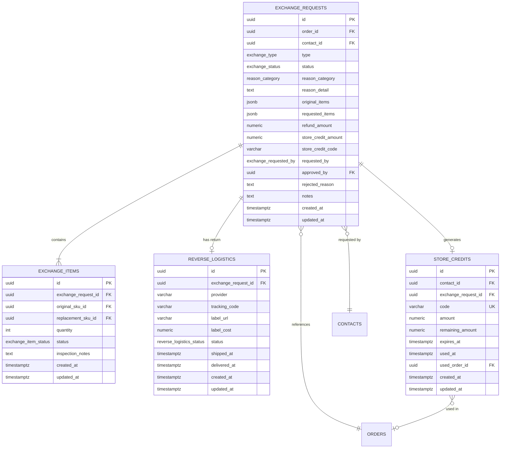

# Trocas e Devolucoes — Module Spec

> **Module:** Trocas e Devolucoes
> **Schema:** `trocas`
> **Route prefix:** `/api/v1/trocas`
> **Admin UI route group:** `(admin)/trocas/*`
> **Version:** 1.0
> **Date:** March 2026
> **Status:** Approved
> **Replaces:** TroqueCommerce (R$ 0/mes — free tier, but limited and manual; efficiency gain is the primary driver)
> **References:** [DATABASE.md](../../architecture/DATABASE.md), [API.md](../../architecture/API.md), [AUTH.md](../../architecture/AUTH.md), [LGPD.md](../../platform/LGPD.md), [NOTIFICATIONS.md](../../platform/NOTIFICATIONS.md), [GLOSSARY.md](../../dev/GLOSSARY.md), [ERP spec](./erp.md), [Checkout spec](../commerce/checkout.md), [CRM spec](../growth/crm.md), [Mensageria spec](../communication/mensageria.md)

---

## 1. Purpose & Scope

The Trocas e Devolucoes module manages the complete **post-sale reverse flow** for Ambaril. It handles four distinct resolution types: size exchange, color exchange, store credit issuance, and monetary refund. The module integrates with Melhor Envio for reverse logistics (return labels), Focus NFe for NF-e return documents, ERP for inventory reconciliation, Checkout for store credit redemption, and the Creators module for commission adjustment within the 7-day confirmation window.

**Core responsibilities:**

| Capability                    | Description                                                                                                                               |
| ----------------------------- | ----------------------------------------------------------------------------------------------------------------------------------------- |
| **Exchange by size/color**    | Customer requests a swap to a different size or color of the same product. System validates replacement SKU stock before approval         |
| **Store credit**              | Customer receives a unique credit code redeemable at checkout. Expires in 6 months. Partial or full use supported                         |
| **Monetary refund**           | Full refund to original payment method via Mercado Pago Refund API. Available for defective products and "not as described" cases         |
| **Reverse logistics**         | Automated return label generation via Melhor Envio API. Customer ships product back using pre-paid label. Tracking integrated             |
| **Product inspection**        | On-receipt inspection workflow: mark returned items as OK (restock) or damaged (discard). Notes and photo support                         |
| **NF-e return**               | Automatic NF-e de devolucao emission via ERP Focus NFe integration on exchange approval                                                   |
| **Inventory reconciliation**  | Inspected-OK items are restocked in ERP with `movement_type: 'return'`. Damaged items are written off                                     |
| **Creator commission impact** | Sales are only confirmed after a 7-day exchange window. Exchanges within this window trigger commission adjustment on the Creators module |
| **Size recommendation data**  | Exchange reason data (wrong_size frequency per SKU) feeds the future size recommendation engine (E4 expansion)                            |

**Primary users:**

- **Slimgust (Support):** Creates exchange requests from Mensageria conversations, communicates with customers
- **Ana Clara (Operations):** Approves/rejects requests, performs product inspection on receipt, manages reverse logistics
- **System (automated):** Generates return labels, emits NF-e, restocks inventory, adjusts creator commissions
- **Customers:** Receive WhatsApp notifications at each stage, track return shipment

**Out of scope:** This module does NOT handle the original order fulfillment (owned by ERP). It does NOT own the customer conversation (owned by Mensageria). It does NOT process payments (Mercado Pago refunds are triggered via ERP financial reconciliation). It does NOT own the store credit redemption UX (owned by Checkout — store credit is applied like a coupon).

---

## 2. User Stories

### 2.1 Customer-Facing Stories

| #     | As a...  | I want to...                                            | So that...                                                                                 | Acceptance Criteria                                                                                                                                                                                          |
| ----- | -------- | ------------------------------------------------------- | ------------------------------------------------------------------------------------------ | ------------------------------------------------------------------------------------------------------------------------------------------------------------------------------------------------------------ |
| US-01 | Customer | Request an exchange via WhatsApp/Mensageria             | I can get the right size/color without visiting a store                                    | Customer sends exchange request via WhatsApp; Slimgust opens exchange form in Mensageria; exchange request created with `requested_by = 'support'`; customer receives WhatsApp confirmation with exchange ID |
| US-02 | Customer | Receive a pre-paid return label by WhatsApp             | I can ship the product back at no cost                                                     | On exchange approval, system generates Melhor Envio return label; label URL sent via WhatsApp template `wa_exchange_approved`; label also available in "Minha Troca" page                                    |
| US-03 | Customer | Track the status of my exchange                         | I know where my return is and when I will receive the replacement/credit/refund            | Customer receives WhatsApp notifications at each status transition: approved, label_generated, received, inspected, completed                                                                                |
| US-04 | Customer | Receive store credit that I can use on my next purchase | I have flexibility to choose a different product if the exact replacement is not available | Store credit code sent via WhatsApp; code redeemable at checkout; remaining balance shown after partial use                                                                                                  |
| US-05 | Customer | Receive a refund to my original payment method          | I get my money back for a defective or misrepresented product                              | Refund processed via Mercado Pago API; customer receives WhatsApp confirmation with refund amount and expected timeline (3-10 business days)                                                                 |

### 2.2 Support Stories

| #     | As a...            | I want to...                                                           | So that...                                                                | Acceptance Criteria                                                                                                                                                                                           |
| ----- | ------------------ | ---------------------------------------------------------------------- | ------------------------------------------------------------------------- | ------------------------------------------------------------------------------------------------------------------------------------------------------------------------------------------------------------- |
| US-06 | Support (Slimgust) | Create an exchange request from within a Mensageria conversation       | I can process the customer's request without switching contexts           | "Abrir troca" button in Mensageria conversation detail opens exchange creation form; form pre-fills contact info and recent orders; created exchange is linked to Mensageria ticket via `related_exchange_id` |
| US-07 | Support (Slimgust) | View the exchange request timeline alongside the customer conversation | I can see the full context when discussing the exchange with the customer | Mensageria right panel shows linked exchange with status timeline, items, and logistics info                                                                                                                  |

### 2.3 Operations Stories

| #     | As a...                | I want to...                                                         | So that...                                                         | Acceptance Criteria                                                                                                                                                                     |
| ----- | ---------------------- | -------------------------------------------------------------------- | ------------------------------------------------------------------ | --------------------------------------------------------------------------------------------------------------------------------------------------------------------------------------- |
| US-08 | Operations (Ana Clara) | View all exchange requests in a filterable list                      | I can manage the exchange pipeline efficiently                     | Exchange list with filters: status, type, date range, search by order number or customer name; sortable by date, status; status badges with color coding                                |
| US-09 | Operations (Ana Clara) | Approve an exchange request and have the return label auto-generated | I can process approvals quickly on mobile                          | "Aprovar" button on exchange detail; system auto-checks replacement stock (for size/color swaps); auto-generates Melhor Envio return label; auto-triggers NF-e return; all in one click |
| US-10 | Operations (Ana Clara) | Reject an exchange request with a reason                             | I can communicate clearly why an exchange was denied               | "Rejeitar" button with required `rejected_reason` text field; customer notified via WhatsApp with reason                                                                                |
| US-11 | Operations (Ana Clara) | Inspect received products and mark as OK or damaged                  | I can determine whether returned items can be restocked            | Inspection form per item: status toggle (OK / Damaged), notes field, photo upload (optional); on save: OK items trigger restock, damaged items trigger write-off                        |
| US-12 | Operations (Ana Clara) | Complete an exchange after inspection                                | I can finalize the exchange and trigger the appropriate resolution | "Concluir troca" button: for size/color swap, triggers replacement shipment in ERP; for store credit, generates and sends code; for refund, triggers Mercado Pago refund                |
| US-13 | Operations (Ana Clara) | View reverse logistics tracking for all active exchanges             | I can monitor return shipments and follow up on delays             | Reverse logistics panel showing all active return shipments with tracking status, carrier, estimated delivery, days in transit                                                          |

### 2.4 System Stories

| #     | As a... | I want to...                                                                            | So that...                                   | Acceptance Criteria                                                                                                                                                                                                                                                      |
| ----- | ------- | --------------------------------------------------------------------------------------- | -------------------------------------------- | ------------------------------------------------------------------------------------------------------------------------------------------------------------------------------------------------------------------------------------------------------------------------ |
| US-14 | System  | Automatically adjust creator commission when an exchange occurs within the 7-day window | Creator commissions reflect actual net sales | On exchange completion (any type), system checks if original order was within 7-day creator commission confirmation window; if yes, emits `creator.commission_adjustment` event with order_id and adjustment amount                                                      |
| US-15 | System  | Auto-close exchange requests where the customer has not shipped within 15 days          | Stale requests do not clog the pipeline      | Background job checks daily: requests with `status = 'label_generated'` AND `reverse_logistics.created_at + 15 days < NOW()` AND no shipment detected; auto-transition to `status = 'closed'` with system note "Fechado automaticamente: produto nao enviado em 15 dias" |
| US-16 | System  | Feed exchange reason data to the size recommendation model                              | Future size recommendations are data-driven  | Exchange requests with `reason_category = 'wrong_size'` are logged with original SKU size and requested replacement size. This data is queryable for the E4 expansion (size recommendation engine).                                                                      |

---

## 3. Data Model

### 3.1 Entity Relationship Diagram



### 3.2 Enums

```sql
CREATE TYPE trocas.exchange_type AS ENUM (
    'size_swap', 'color_swap', 'store_credit', 'refund'
);

CREATE TYPE trocas.exchange_status AS ENUM (
    'requested', 'approved', 'label_generated',
    'shipped_by_customer', 'received', 'inspected',
    'completed', 'rejected', 'closed'
);

CREATE TYPE trocas.reason_category AS ENUM (
    'wrong_size', 'wrong_color', 'defective',
    'not_as_described', 'changed_mind', 'other'
);

CREATE TYPE trocas.exchange_requested_by AS ENUM (
    'customer', 'support'
);

CREATE TYPE trocas.exchange_item_status AS ENUM (
    'pending', 'returned', 'inspected_ok',
    'inspected_damaged', 'restocked', 'discarded'
);

CREATE TYPE trocas.reverse_logistics_status AS ENUM (
    'pending', 'generated', 'shipped',
    'in_transit', 'delivered'
);
```

### 3.3 Table Definitions

#### 3.3.1 trocas.exchange_requests

| Column                    | Type                         | Constraints                      | Description                                                                                                                                          |
| ------------------------- | ---------------------------- | -------------------------------- | ---------------------------------------------------------------------------------------------------------------------------------------------------- |
| id                        | UUID                         | PK, DEFAULT gen_random_uuid()    | UUID v7                                                                                                                                              |
| order_id                  | UUID                         | NOT NULL, FK checkout.orders(id) | Original order being exchanged/returned                                                                                                              |
| contact_id                | UUID                         | NOT NULL, FK crm.contacts(id)    | Customer requesting the exchange                                                                                                                     |
| type                      | trocas.exchange_type         | NOT NULL                         | Resolution type: `size_swap`, `color_swap`, `store_credit`, `refund`                                                                                 |
| status                    | trocas.exchange_status       | NOT NULL DEFAULT 'requested'     | FSM status (see R2 for state machine)                                                                                                                |
| reason_category           | trocas.reason_category       | NOT NULL                         | Categorized reason for the exchange (feeds analytics and size recommendation model)                                                                  |
| reason_detail             | TEXT                         | NULL                             | Free-text customer explanation (e.g., "Pedi M mas ficou muito apertado, preciso G")                                                                  |
| original_items            | JSONB                        | NOT NULL                         | Snapshot of items being returned: `[{ sku_id, sku_code, product_name, size, color, quantity, unit_price_cents }]`                                    |
| requested_items           | JSONB                        | NULL                             | For size/color swap: items requested as replacement: `[{ sku_id, sku_code, product_name, size, color, quantity }]`. NULL for store_credit and refund |
| refund_amount_cents       | INTEGER                      | NULL                             | For refund type: amount to refund in centavos. NULL for other types                                                                                  |
| store_credit_amount_cents | INTEGER                      | NULL                             | For store_credit type: credit amount in centavos. NULL for other types                                                                               |
| store_credit_code         | VARCHAR(20)                  | NULL                             | Generated store credit code (e.g., `CIENA-CR-A1B2C3`). NULL until store credit is created                                                            |
| requested_by              | trocas.exchange_requested_by | NOT NULL                         | Who initiated: `customer` (self-service, future) or `support` (via Mensageria)                                                                       |
| approved_by               | UUID                         | NULL, FK users(id)               | User who approved the exchange. NULL if still pending or rejected                                                                                    |
| rejected_reason           | TEXT                         | NULL                             | Required when status = rejected. Reason communicated to customer                                                                                     |
| notes                     | TEXT                         | NULL                             | Internal notes (visible to team only, not customer)                                                                                                  |
| created_at                | TIMESTAMPTZ                  | NOT NULL DEFAULT NOW()           |                                                                                                                                                      |
| updated_at                | TIMESTAMPTZ                  | NOT NULL DEFAULT NOW()           |                                                                                                                                                      |

**Original items JSONB structure:**

```json
[
  {
    "sku_id": "01961a2b-3c4d-7e8f-9a0b-1c2d3e4f5a6b",
    "sku_code": "CAM-PRETA-M",
    "product_name": "Camiseta Preta Basic",
    "size": "M",
    "color": "Preto",
    "quantity": 1,
    "unit_price_cents": 14990
  }
]
```

**Requested items JSONB structure (size/color swap):**

```json
[
  {
    "sku_id": "01961a2b-3c4d-7e8f-9a0b-1c2d3e4f5a7c",
    "sku_code": "CAM-PRETA-G",
    "product_name": "Camiseta Preta Basic",
    "size": "G",
    "color": "Preto",
    "quantity": 1
  }
]
```

**Indexes:**

```sql
CREATE INDEX idx_exchange_requests_order ON trocas.exchange_requests (order_id);
CREATE INDEX idx_exchange_requests_contact ON trocas.exchange_requests (contact_id);
CREATE INDEX idx_exchange_requests_status ON trocas.exchange_requests (status);
CREATE INDEX idx_exchange_requests_type ON trocas.exchange_requests (type);
CREATE INDEX idx_exchange_requests_reason ON trocas.exchange_requests (reason_category);
CREATE INDEX idx_exchange_requests_created ON trocas.exchange_requests (created_at DESC);
CREATE INDEX idx_exchange_requests_pending ON trocas.exchange_requests (status, created_at DESC) WHERE status IN ('requested', 'approved', 'label_generated', 'shipped_by_customer', 'received');
```

#### 3.3.2 trocas.exchange_items

| Column              | Type                        | Constraints                                                 | Description                                                                                                  |
| ------------------- | --------------------------- | ----------------------------------------------------------- | ------------------------------------------------------------------------------------------------------------ |
| id                  | UUID                        | PK, DEFAULT gen_random_uuid()                               | UUID v7                                                                                                      |
| exchange_request_id | UUID                        | NOT NULL, FK trocas.exchange_requests(id) ON DELETE CASCADE | Parent exchange request                                                                                      |
| original_sku_id     | UUID                        | NOT NULL, FK erp.skus(id)                                   | SKU being returned                                                                                           |
| replacement_sku_id  | UUID                        | NULL, FK erp.skus(id)                                       | SKU being sent as replacement (NULL for store_credit/refund)                                                 |
| quantity            | INTEGER                     | NOT NULL, CHECK (quantity > 0)                              | Number of units being exchanged                                                                              |
| status              | trocas.exchange_item_status | NOT NULL DEFAULT 'pending'                                  | Per-item lifecycle: `pending` -> `returned` -> `inspected_ok`/`inspected_damaged` -> `restocked`/`discarded` |
| inspection_notes    | TEXT                        | NULL                                                        | Inspector's notes (e.g., "Produto com mancha na frente, nao pode ser revendido")                             |
| created_at          | TIMESTAMPTZ                 | NOT NULL DEFAULT NOW()                                      |                                                                                                              |
| updated_at          | TIMESTAMPTZ                 | NOT NULL DEFAULT NOW()                                      |                                                                                                              |

**Indexes:**

```sql
CREATE INDEX idx_exchange_items_request ON trocas.exchange_items (exchange_request_id);
CREATE INDEX idx_exchange_items_original_sku ON trocas.exchange_items (original_sku_id);
CREATE INDEX idx_exchange_items_replacement_sku ON trocas.exchange_items (replacement_sku_id) WHERE replacement_sku_id IS NOT NULL;
CREATE INDEX idx_exchange_items_status ON trocas.exchange_items (status);
```

#### 3.3.3 trocas.reverse_logistics

| Column              | Type                            | Constraints                                       | Description                                                                                                                               |
| ------------------- | ------------------------------- | ------------------------------------------------- | ----------------------------------------------------------------------------------------------------------------------------------------- |
| id                  | UUID                            | PK, DEFAULT gen_random_uuid()                     | UUID v7                                                                                                                                   |
| exchange_request_id | UUID                            | NOT NULL, FK trocas.exchange_requests(id), UNIQUE | One reverse logistics record per exchange                                                                                                 |
| provider            | VARCHAR(50)                     | NOT NULL DEFAULT 'melhor_envio'                   | Logistics provider. Currently only Melhor Envio                                                                                           |
| tracking_code       | VARCHAR(100)                    | NULL                                              | Carrier tracking code (set after label generation, confirmed after shipment)                                                              |
| label_url           | VARCHAR(512)                    | NULL                                              | URL to the downloadable/printable return label (PDF). Generated by Melhor Envio API                                                       |
| label_cost_cents    | INTEGER                         | NOT NULL DEFAULT 0                                | Cost of the return label in centavos. Paid by CIENA (not customer). Tracked for margin analysis                                           |
| status              | trocas.reverse_logistics_status | NOT NULL DEFAULT 'pending'                        | Lifecycle: `pending` -> `generated` (label created) -> `shipped` (customer posted) -> `in_transit` -> `delivered` (received at warehouse) |
| shipped_at          | TIMESTAMPTZ                     | NULL                                              | When the carrier accepted the package from the customer                                                                                   |
| delivered_at        | TIMESTAMPTZ                     | NULL                                              | When the package arrived at CIENA warehouse                                                                                               |
| created_at          | TIMESTAMPTZ                     | NOT NULL DEFAULT NOW()                            |                                                                                                                                           |
| updated_at          | TIMESTAMPTZ                     | NOT NULL DEFAULT NOW()                            |                                                                                                                                           |

**Indexes:**

```sql
CREATE UNIQUE INDEX idx_reverse_logistics_exchange ON trocas.reverse_logistics (exchange_request_id);
CREATE INDEX idx_reverse_logistics_status ON trocas.reverse_logistics (status);
CREATE INDEX idx_reverse_logistics_tracking ON trocas.reverse_logistics (tracking_code) WHERE tracking_code IS NOT NULL;
CREATE INDEX idx_reverse_logistics_active ON trocas.reverse_logistics (status, created_at DESC) WHERE status IN ('generated', 'shipped', 'in_transit');
```

#### 3.3.4 trocas.store_credits

| Column              | Type        | Constraints                               | Description                                                                                                           |
| ------------------- | ----------- | ----------------------------------------- | --------------------------------------------------------------------------------------------------------------------- |
| id                  | UUID        | PK, DEFAULT gen_random_uuid()             | UUID v7                                                                                                               |
| contact_id          | UUID        | NOT NULL, FK crm.contacts(id)             | Customer who owns this credit                                                                                         |
| exchange_request_id | UUID        | NOT NULL, FK trocas.exchange_requests(id) | Exchange that generated this credit                                                                                   |
| code                | VARCHAR(20) | NOT NULL, UNIQUE                          | Unique credit code: `CIENA-CR-{6 random alphanumeric}` (e.g., `CIENA-CR-A1B2C3`). Used at checkout like a coupon code |
| amount_cents        | INTEGER     | NOT NULL, CHECK (amount_cents > 0)        | Original credit amount in centavos                                                                                    |
| remaining_cents     | INTEGER     | NOT NULL, CHECK (remaining_cents >= 0)    | Remaining balance in centavos. Decremented on partial use. 0 when fully used                                          |
| expires_at          | TIMESTAMPTZ | NOT NULL                                  | Expiration date (6 months from creation). Credit becomes invalid after this date                                      |
| used_at             | TIMESTAMPTZ | NULL                                      | When the credit was first used (NULL if unused). Set on first redemption                                              |
| used_order_id       | UUID        | NULL, FK checkout.orders(id)              | Order where the credit was last redeemed (tracks the most recent usage for partial credits)                           |
| created_at          | TIMESTAMPTZ | NOT NULL DEFAULT NOW()                    |                                                                                                                       |
| updated_at          | TIMESTAMPTZ | NOT NULL DEFAULT NOW()                    |                                                                                                                       |

**Indexes:**

```sql
CREATE UNIQUE INDEX idx_store_credits_code ON trocas.store_credits (code);
CREATE INDEX idx_store_credits_contact ON trocas.store_credits (contact_id);
CREATE INDEX idx_store_credits_exchange ON trocas.store_credits (exchange_request_id);
CREATE INDEX idx_store_credits_active ON trocas.store_credits (contact_id, remaining_cents) WHERE remaining_cents > 0 AND expires_at > NOW();
CREATE INDEX idx_store_credits_expires ON trocas.store_credits (expires_at) WHERE remaining_cents > 0;
```

---

## 4. Screens & Wireframes

All screens follow the Ambaril Design System (DS.md): light mode default (dark opt-in), DM Sans, shadcn/ui components, Lucide React. Trocas screens use amber accent for warning states and green for completed states.

### 4.1 Exchange Request List

```
+-----------------------------------------------------------------------+
|  Ambaril Admin > Trocas e Devolucoes                  [+ Nova Troca]      |
+-----------------------------------------------------------------------+
|                                                                       |
|  Filtros: [Status v] [Tipo v] [Periodo v] [Buscar pedido/nome...]    |
|                                                                       |
|  Metricas rapidas:                                                    |
|  [  Abertas: 12  ] [  Em transito: 8  ] [  Aguardando inspecao: 3  ] |
|  [  Concluidas (mes): 47  ] [  Taxa de troca: 4.2%  ]                |
|                                                                       |
|  +---+-------------+----------+--------+----------+--------+-------+ |
|  | # | Pedido      | Cliente  | Tipo   | Motivo   | Status | Data  | |
|  +---+-------------+----------+--------+----------+--------+-------+ |
|  |   | CIENA-0317  | Maria    | Troca  | Tam.     |[Solici]| 17/03 | |
|  |   | -0042       | Santos   | tam.   | errado   |[tada  ]| 10:30 | |
|  +---+-------------+----------+--------+----------+--------+-------+ |
|  |   | CIENA-0315  | Pedro    | Store  | Mudou    |[Etiq. ]| 15/03 | |
|  |   | -0039       | Oliveira | credit | de ideia |[gerada]| 14:20 | |
|  +---+-------------+----------+--------+----------+--------+-------+ |
|  |   | CIENA-0314  | Ana      | Devol. | Defeito  |[Receb.]| 14/03 | |
|  |   | -0037       | Costa    | (refund)|         |[inspec]| 09:15 | |
|  +---+-------------+----------+--------+----------+--------+-------+ |
|  |   | CIENA-0312  | Lucas    | Troca  | Cor      |[Concl.]| 12/03 | |
|  |   | -0035       | Silva    | cor    | errada   |[uida  ]| 16:45 | |
|  +---+-------------+----------+--------+----------+--------+-------+ |
|                                                                       |
|  Status badges:                                                       |
|  [Solicitada] = yellow  [Aprovada] = blue  [Etiq. gerada] = blue     |
|  [Enviada] = purple  [Recebida] = orange  [Inspecionada] = orange    |
|  [Concluida] = green  [Rejeitada] = red  [Fechada] = gray           |
|                                                                       |
|  Mostrando 1-25 de 67              [< Anterior] [Proximo >]          |
+-----------------------------------------------------------------------+
```

### 4.2 Exchange Request Detail (Timeline)

```
+-----------------------------------------------------------------------+
|  Ambaril Admin > Trocas > Troca #TR-2026-0312                            |
+-----------------------------------------------------------------------+
|                                                                       |
|  +---------------------------------+---------------------------------+ |
|  |  DETALHES DA TROCA              |  TIMELINE                       | |
|  +---------------------------------+---------------------------------+ |
|  |                                 |                                 | |
|  |  Pedido: CIENA-20260317-0042    |  (o) Solicitada                 | |
|  |  Cliente: Maria Santos          |      17/03 10:30 - Slimgust     | |
|  |  CPF: 123.456.789-00            |      "Cliente pediu troca de    | |
|  |  Tipo: Troca de tamanho         |       M para G via WhatsApp"    | |
|  |  Motivo: Tamanho errado         |      |                          | |
|  |  Detalhe: "Pedi M mas ficou     |  (o) Aprovada                   | |
|  |   muito apertado, preciso G"    |      17/03 11:15 - Ana Clara    | |
|  |                                 |      "Estoque G disponivel.     | |
|  |  -  -  -  -  -  -  -  -  -  -  |       Label gerada."            | |
|  |                                 |      |                          | |
|  |  ITENS ORIGINAIS                |  (o) Etiqueta gerada            | |
|  |  +---------------------------+  |      17/03 11:15 - Sistema      | |
|  |  | Camiseta Preta Basic     |  |      Tracking: ME123456789      | |
|  |  | Tam: M | Cor: Preto      |  |      |                          | |
|  |  | SKU: CAM-PRETA-M         |  |  (o) Enviada pelo cliente       | |
|  |  | Qtd: 1 | R$ 149,90       |  |      18/03 14:20 - Carrier      | |
|  |  +---------------------------+  |      PAC postado em SP          | |
|  |                                 |      |                          | |
|  |  ITENS SOLICITADOS              |  ( ) Recebida                   | |
|  |  +---------------------------+  |      Previsao: 22/03            | |
|  |  | Camiseta Preta Basic     |  |      |                          | |
|  |  | Tam: G | Cor: Preto      |  |  ( ) Inspecionada               | |
|  |  | SKU: CAM-PRETA-G         |  |      |                          | |
|  |  | Qtd: 1 | Em estoque (12) |  |  ( ) Concluida                  | |
|  |  +---------------------------+  |                                 | |
|  |                                 |                                 | |
|  |  -  -  -  -  -  -  -  -  -  -  |                                 | |
|  |                                 |                                 | |
|  |  LOGISTICA REVERSA              |                                 | |
|  |  Transportadora: Melhor Envio   |                                 | |
|  |  Rastreio: ME123456789          |                                 | |
|  |  Status: Em transito            |                                 | |
|  |  Custo label: R$ 18,90          |                                 | |
|  |  [Rastrear envio ->]            |                                 | |
|  |                                 |                                 | |
|  +---------------------------------+---------------------------------+ |
|                                                                       |
|  Notas internas:                                                      |
|  [_____________________________________________________________]      |
|  [Salvar nota]                                                        |
|                                                                       |
|  Acoes: [Aprovar] [Rejeitar] [Marcar como recebida] [Inspecionar]    |
|         [Concluir troca]                                              |
+-----------------------------------------------------------------------+
```

### 4.3 Create Exchange (from Mensageria or standalone)

```
+-----------------------------------------------------------------------+
|  Ambaril Admin > Trocas > Nova Troca                                     |
+-----------------------------------------------------------------------+
|                                                                       |
|  +-----------------------------------------------------------------+  |
|  |  PEDIDO ORIGINAL *                                              |  |
|  +-----------------------------------------------------------------+  |
|  |                                                                 |  |
|  |  Numero do pedido: [CIENA-20260317-0042______]  [Buscar]       |  |
|  |                                                                 |  |
|  |  (v) Pedido encontrado                                          |  |
|  |  Cliente: Maria Santos | Data: 17/03/2026 | Total: R$ 149,90   |  |
|  |  Entregue em: 20/03/2026 (dentro do prazo de 30 dias)           |  |
|  |                                                                 |  |
|  +-----------------------------------------------------------------+  |
|                                                                       |
|  +-----------------------------------------------------------------+  |
|  |  ITENS PARA TROCA *                                             |  |
|  +-----------------------------------------------------------------+  |
|  |                                                                 |  |
|  |  [x] Camiseta Preta Basic - M - Preto (CAM-PRETA-M)            |  |
|  |      Qtd a trocar: [1_] de 1 disponivel                        |  |
|  |  [ ] Meia CIENA Crew - U - Preto (MEIA-CREW-U)                 |  |
|  |                                                                 |  |
|  +-----------------------------------------------------------------+  |
|                                                                       |
|  +-----------------------------------------------------------------+  |
|  |  TIPO DE RESOLUCAO *                                            |  |
|  +-----------------------------------------------------------------+  |
|  |                                                                 |  |
|  |  (o) Troca de tamanho                                           |  |
|  |      Novo tamanho: [G v]  Estoque: 12 unidades                 |  |
|  |                                                                 |  |
|  |  ( ) Troca de cor                                               |  |
|  |      Nova cor: [Selecione v]                                    |  |
|  |                                                                 |  |
|  |  ( ) Vale-troca (store credit)                                  |  |
|  |      Valor: R$ 149,90 | Validade: 6 meses                      |  |
|  |                                                                 |  |
|  |  ( ) Devolucao (reembolso)                                      |  |
|  |      Valor: R$ 149,90 | Via Mercado Pago                       |  |
|  |                                                                 |  |
|  +-----------------------------------------------------------------+  |
|                                                                       |
|  +-----------------------------------------------------------------+  |
|  |  MOTIVO *                                                       |  |
|  +-----------------------------------------------------------------+  |
|  |                                                                 |  |
|  |  Categoria: [Tamanho errado v]                                  |  |
|  |  Detalhes: [Pedi M mas ficou muito apertado, preciso G_______]  |  |
|  |                                                                 |  |
|  +-----------------------------------------------------------------+  |
|                                                                       |
|  Vinculado ao ticket: #INB-4521 (Mensageria)                         |
|                                                                       |
|  [Cancelar]                                      [Criar solicitacao]  |
+-----------------------------------------------------------------------+
```

### 4.4 Inspection Form

```
+-----------------------------------------------------------------------+
|  Ambaril Admin > Trocas > Troca #TR-2026-0312 > Inspecao                 |
+-----------------------------------------------------------------------+
|                                                                       |
|  Produto recebido em: 22/03/2026 | Dias em transito: 4               |
|                                                                       |
|  +-----------------------------------------------------------------+  |
|  |  INSPECAO DO ITEM 1/1                                           |  |
|  +-----------------------------------------------------------------+  |
|  |                                                                 |  |
|  |  Produto: Camiseta Preta Basic                                  |  |
|  |  SKU: CAM-PRETA-M | Tam: M | Cor: Preto | Qtd: 1              |  |
|  |                                                                 |  |
|  |  Condicao do produto *                                          |  |
|  |  (o) OK - Pode ser recolocado no estoque                       |  |
|  |  ( ) Danificado - Nao pode ser revendido                       |  |
|  |                                                                 |  |
|  |  Observacoes da inspecao:                                       |  |
|  |  [Produto em bom estado, etiqueta intacta, sem manchas.___]     |  |
|  |  [___________________________________________________________]  |  |
|  |                                                                 |  |
|  |  Foto (opcional): [Selecionar arquivo]                          |  |
|  |                                                                 |  |
|  +-----------------------------------------------------------------+  |
|                                                                       |
|  Resumo:                                                              |
|  +------------------------------+-------+                            |
|  | Item                         | Acao  |                            |
|  +------------------------------+-------+                            |
|  | CAM-PRETA-M x1               | OK    | -> Sera restocado         |
|  +------------------------------+-------+                            |
|                                                                       |
|  [Cancelar]                          [Salvar inspecao e concluir ->]  |
+-----------------------------------------------------------------------+
```

### 4.5 Store Credit Management

```
+-----------------------------------------------------------------------+
|  Ambaril Admin > Trocas > Vale-Trocas (Store Credits)                    |
+-----------------------------------------------------------------------+
|                                                                       |
|  Filtros: [Status v] [Buscar por codigo ou cliente...]               |
|                                                                       |
|  Metricas:                                                            |
|  [  Ativos: 23  ] [  Saldo total: R$ 3.847  ] [  Expirados: 5  ]    |
|  [  Utilizados (mes): 12  ] [  Valor resgatado: R$ 1.920  ]         |
|                                                                       |
|  +------------------+----------+----------+---------+-------+------+ |
|  | Codigo           | Cliente  | Valor    | Saldo   | Exp.  | Sta. | |
|  +------------------+----------+----------+---------+-------+------+ |
|  | CIENA-CR-A1B2C3  | Maria    | R$ 149   | R$ 149  | 17/09 | Ativo| |
|  |                  | Santos   |          |         |       |      | |
|  +------------------+----------+----------+---------+-------+------+ |
|  | CIENA-CR-D4E5F6  | Pedro    | R$ 289   | R$ 89   | 15/09 | Parc.| |
|  |                  | Oliveira |          |         |       | usado| |
|  +------------------+----------+----------+---------+-------+------+ |
|  | CIENA-CR-G7H8I9  | Lucas    | R$ 199   | R$ 0    | 12/09 | Usado| |
|  |                  | Silva    |          |         |       |      | |
|  +------------------+----------+----------+---------+-------+------+ |
|  | CIENA-CR-J1K2L3  | Ana      | R$ 149   | R$ 149  | 01/03 | Exp. | |
|  |                  | Costa    |          |         |       |      | |
|  +------------------+----------+----------+---------+-------+------+ |
|                                                                       |
|  Mostrando 1-25 de 28              [< Anterior] [Proximo >]          |
+-----------------------------------------------------------------------+
```

### 4.6 Reverse Logistics Tracking

```
+-----------------------------------------------------------------------+
|  Ambaril Admin > Trocas > Logistica Reversa                              |
+-----------------------------------------------------------------------+
|                                                                       |
|  Filtros: [Status v] [Periodo v] [Transportadora v]                  |
|                                                                       |
|  +--------+-----------+---------+--------+------+---------+--------+ |
|  | Troca  | Cliente   | Rastr.  | Transp | Dias | Status  | Custo  | |
|  +--------+-----------+---------+--------+------+---------+--------+ |
|  | TR-312 | Maria     | ME123.. | PAC    | 4    |[Em tran]| R$ 18  | |
|  |        | Santos    |         |        |      |[sito   ]|        | |
|  +--------+-----------+---------+--------+------+---------+--------+ |
|  | TR-310 | Pedro     | ME456.. | SEDEX  | 2    |[Enviada]| R$ 28  | |
|  |        | Oliveira  |         |        |      |         |        | |
|  +--------+-----------+---------+--------+------+---------+--------+ |
|  | TR-308 | Ana       | ME789.. | PAC    | 7    |[Entreg.]| R$ 18  | |
|  |        | Costa     |         |        |      |[ue     ]|        | |
|  +--------+-----------+---------+--------+------+---------+--------+ |
|                                                                       |
|  (!) TR-305 esta em transito ha 12 dias (acima da media de 7).       |
|      Verificar com Melhor Envio.                                      |
|                                                                       |
|  Custo total de logistica reversa (mes): R$ 342,00 (19 labels)       |
+-----------------------------------------------------------------------+
```

---

## 5. API Endpoints

All endpoints follow the patterns defined in [API.md](../../architecture/API.md). Money values are in **integer centavos** (BRL). Dates in ISO 8601.

### 5.1 Admin Endpoints (Auth Required)

Route prefix: `/api/v1/trocas`

#### 5.1.1 Exchange Requests

| Method | Path                                   | Auth     | Description                                           | Request Body / Query                                                                                                                                              | Response                                                            |
| ------ | -------------------------------------- | -------- | ----------------------------------------------------- | ----------------------------------------------------------------------------------------------------------------------------------------------------------------- | ------------------------------------------------------------------- |
| GET    | `/exchanges`                           | Internal | List exchange requests (paginated, filterable)        | `?cursor=&limit=25&status=&type=&reason_category=&dateFrom=&dateTo=&search=`                                                                                      | `{ data: ExchangeRequest[], meta: Pagination }`                     |
| GET    | `/exchanges/:id`                       | Internal | Get exchange detail with items, logistics, timeline   | `?include=items,logistics,store_credit,timeline`                                                                                                                  | `{ data: ExchangeRequest }`                                         |
| POST   | `/exchanges`                           | Internal | Create new exchange request                           | `{ order_id, type, reason_category, reason_detail?, original_items: [{ sku_id, quantity }], requested_items?: [{ sku_id, quantity }], notes?, inbox_ticket_id? }` | `201 { data: ExchangeRequest }`                                     |
| PATCH  | `/exchanges/:id`                       | Internal | Update exchange request                               | `{ type?, reason_detail?, requested_items?, notes? }`                                                                                                             | `{ data: ExchangeRequest }`                                         |
| POST   | `/exchanges/:id/actions/approve`       | Internal | Approve exchange (auto-generates return label + NF-e) | `{ notes? }`                                                                                                                                                      | `{ data: ExchangeRequest }` (status -> approved -> label_generated) |
| POST   | `/exchanges/:id/actions/reject`        | Internal | Reject exchange with reason                           | `{ rejected_reason }`                                                                                                                                             | `{ data: ExchangeRequest }` (status -> rejected)                    |
| POST   | `/exchanges/:id/actions/mark-received` | Internal | Mark returned product as received at warehouse        | —                                                                                                                                                                 | `{ data: ExchangeRequest }` (status -> received)                    |
| POST   | `/exchanges/:id/actions/complete`      | Internal | Complete exchange (trigger resolution)                | —                                                                                                                                                                 | `{ data: ExchangeRequest }` (status -> completed)                   |

#### 5.1.2 Exchange Items (Inspection)

| Method | Path                                     | Auth     | Description                | Request Body / Query      | Response                                  |
| ------ | ---------------------------------------- | -------- | -------------------------- | ------------------------- | ----------------------------------------- | ------------------------ |
| GET    | `/exchanges/:id/items`                   | Internal | List items for an exchange | —                         | `{ data: ExchangeItem[] }`                |
| PATCH  | `/exchanges/:exchange_id/items/:item_id` | Internal | Update item inspection     | `{ status: 'inspected_ok' | 'inspected_damaged', inspection_notes? }` | `{ data: ExchangeItem }` |

#### 5.1.3 Reverse Logistics

| Method | Path                                      | Auth     | Description                                     | Request Body / Query        | Response                                         |
| ------ | ----------------------------------------- | -------- | ----------------------------------------------- | --------------------------- | ------------------------------------------------ |
| GET    | `/logistics`                              | Internal | List all reverse logistics                      | `?status=&cursor=&limit=25` | `{ data: ReverseLogistics[], meta: Pagination }` |
| GET    | `/logistics/:id`                          | Internal | Get logistics detail with tracking history      | —                           | `{ data: ReverseLogistics }`                     |
| POST   | `/logistics/:id/actions/refresh-tracking` | Internal | Force refresh tracking status from Melhor Envio | —                           | `{ data: ReverseLogistics }`                     |

#### 5.1.4 Store Credits

| Method | Path                           | Auth     | Description                                     | Request Body / Query        | Response                |
| ------ | ------------------------------ | -------- | ----------------------------------------------- | --------------------------- | ----------------------- | --------------------------------- | ------------------------------------------- |
| GET    | `/store-credits`               | Internal | List all store credits                          | `?contact_id=&status=active | used                    | expired&search=&cursor=&limit=25` | `{ data: StoreCredit[], meta: Pagination }` |
| GET    | `/store-credits/:id`           | Internal | Get store credit detail                         | —                           | `{ data: StoreCredit }` |
| GET    | `/store-credits/by-code/:code` | Internal | Look up store credit by code (used by Checkout) | —                           | `{ data: StoreCredit }` |

#### 5.1.5 Analytics

| Method | Path                   | Auth     | Description                                 | Request Body / Query   | Response                                                                                                                                              |
| ------ | ---------------------- | -------- | ------------------------------------------- | ---------------------- | ----------------------------------------------------------------------------------------------------------------------------------------------------- |
| GET    | `/analytics/overview`  | Internal | Exchange analytics overview                 | `?dateFrom=&dateTo=`   | `{ data: { total_exchanges, exchange_rate, by_type, by_reason, avg_resolution_days, reverse_logistics_cost_cents, store_credit_outstanding_cents } }` |
| GET    | `/analytics/size-data` | Internal | Size exchange data for recommendation model | `?sku_id=&product_id=` | `{ data: [{ original_size, requested_size, count }] }`                                                                                                |

### 5.2 Internal Endpoints (Module-to-Module)

Route prefix: `/api/v1/trocas/internal`

| Method | Path                            | Auth    | Description                                                        | Request Body / Query               | Response                                                 |
| ------ | ------------------------------- | ------- | ------------------------------------------------------------------ | ---------------------------------- | -------------------------------------------------------- |
| POST   | `/store-credits/validate`       | Service | Validate and apply store credit at checkout                        | `{ code, order_total_cents }`      | `{ data: { valid, remaining_cents, applicable_cents } }` |
| POST   | `/store-credits/redeem`         | Service | Redeem store credit (called on order confirmation)                 | `{ code, amount_cents, order_id }` | `{ data: StoreCredit }`                                  |
| GET    | `/exchanges/by-order/:order_id` | Service | Get exchanges for an order (used by Creators for commission check) | —                                  | `{ data: ExchangeRequest[] }`                            |

### 5.3 Webhook Endpoints

Route prefix: `/api/v1/webhooks`

| Method | Path                   | Description                                        | Request Body / Query          | Response |
| ------ | ---------------------- | -------------------------------------------------- | ----------------------------- | -------- |
| POST   | `/melhor-envio/trocas` | Melhor Envio tracking webhook for return shipments | Melhor Envio tracking payload | `200`    |

---

## 6. Business Rules

### 6.1 Eligibility Rules

| #   | Rule                                           | Detail                                                                                                                                                                                                                                                                                                                                                                                                                                                |
| --- | ---------------------------------------------- | ----------------------------------------------------------------------------------------------------------------------------------------------------------------------------------------------------------------------------------------------------------------------------------------------------------------------------------------------------------------------------------------------------------------------------------------------------- |
| R1  | **30-day exchange window from delivery**       | Exchange requests can only be created within 30 calendar days of the order's `delivered_at` date. If `delivered_at` is NULL (order not yet delivered) or `NOW() - delivered_at > 30 days`, the creation request is rejected with error: "Prazo para troca expirado. Trocas devem ser solicitadas em ate 30 dias apos a entrega." The 30-day window is a CIENA policy aligned with CDC (Codigo de Defesa do Consumidor) Art. 26 for non-durable goods. |
| R2  | **One active exchange per order item**         | A specific SKU in an order can only have one active (non-completed, non-rejected, non-closed) exchange at a time. Attempting to create a second exchange for the same order item returns error: "Ja existe uma troca em andamento para este item."                                                                                                                                                                                                    |
| R3  | **Refund only for defective/not-as-described** | Monetary refund (`type = 'refund'`) is only available when `reason_category IN ('defective', 'not_as_described')`. For `changed_mind` and `wrong_size`/`wrong_color`, only size/color swap or store credit are offered. This is a business decision to preserve revenue while complying with CDC.                                                                                                                                                     |

### 6.2 Status Machine Rules

| #   | Rule                                        | Detail                                                                                                                                                                                                                                                                                                                                                                                                                                                                                      |
| --- | ------------------------------------------- | ------------------------------------------------------------------------------------------------------------------------------------------------------------------------------------------------------------------------------------------------------------------------------------------------------------------------------------------------------------------------------------------------------------------------------------------------------------------------------------------- |
| R4  | **Exchange status FSM**                     | The exchange request follows a strict finite state machine. Valid transitions: `requested` -> `approved` OR `rejected`; `approved` -> `label_generated` (automatic, immediate); `label_generated` -> `shipped_by_customer`; `shipped_by_customer` -> `received`; `received` -> `inspected`; `inspected` -> `completed`. Also: `label_generated` -> `closed` (auto-close after 15 days). No backward transitions. Invalid transitions return 409 Conflict.                                   |
| R5  | **Approval triggers automatic actions**     | When an exchange is approved (`requested` -> `approved`), the system immediately and automatically: (1) generates a return label via Melhor Envio API, transitioning to `label_generated`, (2) triggers NF-e de devolucao via ERP Focus NFe integration, (3) sends `wa_exchange_approved` WhatsApp template with label instructions, (4) if size/color swap, validates replacement SKU stock availability. All actions are atomic — if label generation fails, the approval is rolled back. |
| R6  | **Approval requires stock check for swaps** | For `type IN ('size_swap', 'color_swap')`, the system checks `erp.sku_stock.available` for the replacement SKU before approving. If stock is 0, the approval is blocked with warning: "SKU de substituicao sem estoque. Sugerir vale-troca ou aguardar reposicao." Ana Clara can override by changing the type to `store_credit`.                                                                                                                                                           |

### 6.3 Reverse Logistics Rules

| #   | Rule                                        | Detail                                                                                                                                                                                                                                                                                                                                                                                                   |
| --- | ------------------------------------------- | -------------------------------------------------------------------------------------------------------------------------------------------------------------------------------------------------------------------------------------------------------------------------------------------------------------------------------------------------------------------------------------------------------- |
| R7  | **Return label auto-generation**            | On approval, the system calls Melhor Envio API (`POST /api/v2/me/shipment/generate`) to create a return label. The label is generated with: origin = customer address (from order `shipping_address`), destination = CIENA warehouse address (stored in system config), carrier = cheapest available (PAC preferred for cost). The label URL and tracking code are stored in `trocas.reverse_logistics`. |
| R8  | **Label cost tracked per exchange**         | The cost of each return label (paid by CIENA) is stored in `label_cost_cents`. This feeds the exchange analytics and margin impact reports. Average label cost is approximately R$ 18-28 depending on origin.                                                                                                                                                                                            |
| R9  | **Tracking status sync**                    | Melhor Envio sends tracking webhooks to `/api/v1/webhooks/melhor-envio/trocas`. Status updates: `posted` -> `in_transit` -> `delivered`. The system maps these to `trocas.reverse_logistics.status` values: `shipped`, `in_transit`, `delivered`. On `delivered`, the exchange request auto-transitions to `received`.                                                                                   |
| R10 | **Auto-close after 15 days of no shipment** | If a return label has been generated (`status = 'label_generated'`) but the customer has not shipped (no tracking event from Melhor Envio) within 15 calendar days, a background job auto-transitions the exchange to `status = 'closed'` with the note: "Fechado automaticamente: produto nao enviado em 15 dias." The customer is notified via WhatsApp. The label becomes void.                       |

### 6.4 Inspection & Inventory Rules

| #   | Rule                                      | Detail                                                                                                                                                                                                                                                                                                       |
| --- | ----------------------------------------- | ------------------------------------------------------------------------------------------------------------------------------------------------------------------------------------------------------------------------------------------------------------------------------------------------------------ |
| R11 | **Inspection required before completion** | An exchange cannot transition from `received` to `completed` without inspecting all items. Each `trocas.exchange_items` must have `status` set to either `inspected_ok` or `inspected_damaged` before the "Concluir troca" action is available.                                                              |
| R12 | **Inspected OK -> Restock**               | Items with `status = 'inspected_ok'` are automatically restocked in ERP inventory on exchange completion. The system calls ERP internal API to create an inventory movement: `{ sku_id, quantity, movement_type: 'return', reference_id: exchange_request.id }`. The item status transitions to `restocked`. |
| R13 | **Inspected damaged -> Discard**          | Items with `status = 'inspected_damaged'` are NOT restocked. The system creates an ERP inventory write-off: `{ sku_id, quantity, movement_type: 'write_off', reason: inspection_notes, reference_id: exchange_request.id }`. The item status transitions to `discarded`.                                     |

### 6.5 Resolution Rules

| #   | Rule                                    | Detail                                                                                                                                                                                                                                                                                                                                                                                                                     |
| --- | --------------------------------------- | -------------------------------------------------------------------------------------------------------------------------------------------------------------------------------------------------------------------------------------------------------------------------------------------------------------------------------------------------------------------------------------------------------------------------- |
| R14 | **Size/color swap -> Ship replacement** | On exchange completion with `type IN ('size_swap', 'color_swap')`, the system creates a new fulfillment order in ERP for the replacement items. This is treated as a standard shipment from the CIENA warehouse (not a return). The customer receives a new tracking notification when shipped. No additional payment is collected (same-price swap).                                                                      |
| R15 | **Price difference on swap**            | If the replacement SKU has a different price than the original, the difference is handled as follows: (1) replacement cheaper -> issue store credit for the difference, (2) replacement more expensive -> charge the difference via a micro-payment link (Mercado Pago). Currently, CIENA only offers same-price swaps (size/color of the same product), so price differences are rare but the system supports them.       |
| R16 | **Store credit generation**             | On exchange completion with `type = 'store_credit'`, the system generates: (1) a unique code `CIENA-CR-{6 random alphanumeric uppercase}`, (2) sets `amount_cents = sum of original_items unit_price_cents * quantity`, (3) sets `remaining_cents = amount_cents`, (4) sets `expires_at = NOW() + 6 months`. The code is sent to the customer via WhatsApp template `wa_store_credit_issued`.                              |
| R17 | **Store credit redeemable at checkout** | Store credits are applied at checkout like coupon codes. The Checkout module calls `/internal/store-credits/validate` to check validity and balance, then `/internal/store-credits/redeem` on order confirmation to deduct the amount. Partial redemption is supported — `remaining_cents` is decremented by the used amount. A store credit can be used across multiple orders until the balance reaches 0 or it expires. |
| R18 | **Refund via Mercado Pago**             | On exchange completion with `type = 'refund'`, the system triggers a refund via the Mercado Pago Refund API: `POST /v1/payments/{payment_id}/refunds` with `amount = refund_amount_cents / 100`. Refund amount equals the original item price(s). The customer receives WhatsApp notification with refund amount and estimated timeline (3-10 business days for credit card, instant for PIX).                             |

### 6.6 NF-e & Fiscal Rules

| #   | Rule                              | Detail                                                                                                                                                                                                                                                                                                                                         |
| --- | --------------------------------- | ---------------------------------------------------------------------------------------------------------------------------------------------------------------------------------------------------------------------------------------------------------------------------------------------------------------------------------------------- |
| R19 | **NF-e de devolucao on approval** | On exchange approval, the system triggers NF-e de devolucao emission via the ERP module's Focus NFe integration. The NF-e references the original sale NF-e and contains the returned items. This is required by Brazilian fiscal law for any product return. The NF-e ID is stored on the ERP side and linked to the exchange via `order_id`. |

### 6.7 Creator Commission Rules

| #   | Rule                                     | Detail                                                                                                                                                                                                                                                                                                                                                                                                                                                                    |
| --- | ---------------------------------------- | ------------------------------------------------------------------------------------------------------------------------------------------------------------------------------------------------------------------------------------------------------------------------------------------------------------------------------------------------------------------------------------------------------------------------------------------------------------------------- |
| R20 | **7-day commission confirmation window** | Creator commissions on coupon-attributed sales are held in `pending` status for 7 days after the order's `delivered_at` date. If an exchange request is created within this 7-day window, the commission is adjusted: for full exchange (all items), commission is reversed entirely; for partial exchange, commission is reduced proportionally to the exchanged item value. After the 7-day window passes without an exchange, the commission is confirmed as `earned`. |
| R21 | **Commission adjustment event**          | On exchange completion (any type), if the original order had a creator coupon and the exchange occurred within the 7-day window, the system emits `creator.commission_adjustment` event with: `{ order_id, creator_id, original_commission_cents, adjustment_cents, new_commission_cents, reason: 'exchange' }`. The Creators module processes this to update the commission record.                                                                                      |

### 6.8 Data & Analytics Rules

| #   | Rule                                            | Detail                                                                                                                                                                                                                                                                                                                                                                |
| --- | ----------------------------------------------- | --------------------------------------------------------------------------------------------------------------------------------------------------------------------------------------------------------------------------------------------------------------------------------------------------------------------------------------------------------------------- |
| R22 | **Size exchange data for recommendation model** | All exchanges with `reason_category = 'wrong_size'` contribute data points to the size recommendation model (E4 expansion). Data captured: `{ product_id, original_size, requested_size, customer_height?, customer_weight? }` (height/weight are future fields, currently NULL). The analytics endpoint `/analytics/size-data` exposes this data grouped by product. |
| R23 | **Exchange rate monitoring**                    | The system calculates the exchange rate as `(completed exchanges in period / delivered orders in period) * 100`. If the rate exceeds 8% for any 30-day rolling window, a Flare alert is emitted to `admin` and `pm` roles: "Taxa de troca acima de 8%. Investigar possiveis problemas de qualidade ou sizing."                                                        |

---

## 7. Integrations

### 7.1 Melhor Envio (Reverse Logistics)

| Property                | Value                                                                              |
| ----------------------- | ---------------------------------------------------------------------------------- |
| **Purpose**             | Generate return labels and track reverse shipments                                 |
| **Integration pattern** | `packages/integrations/melhor-envio/client.ts` (shared with ERP forward logistics) |
| **Auth**                | OAuth2 Bearer token (stored in env vars)                                           |
| **API version**         | v2                                                                                 |
| **Webhook**             | `/api/v1/webhooks/melhor-envio/trocas`                                             |
| **Rate limits**         | 60 req/min                                                                         |
| **Retry**               | Exponential backoff (2s, 4s, 8s), max 3 retries                                    |
| **Circuit breaker**     | YES — opens after 5 consecutive failures, half-open after 30s                      |

**Flows:**

| Flow                      | Description                                                                                                                                           |
| ------------------------- | ----------------------------------------------------------------------------------------------------------------------------------------------------- |
| **Generate return label** | `POST /api/v2/me/shipment/generate` with origin (customer address), destination (warehouse), dimensions, weight. Returns label URL and tracking code. |
| **Track shipment**        | Webhook or `GET /api/v2/me/shipment/tracking` with tracking code. Maps carrier status to `trocas.reverse_logistics.status`.                           |
| **Get shipping quote**    | `POST /api/v2/me/shipment/calculate` to estimate return label cost before approval. Used for cost display in admin.                                   |

### 7.2 ERP Module (Inventory, NF-e, Fulfillment)

| Interaction             | Direction     | Mechanism                                          | Description                                                                                  |
| ----------------------- | ------------- | -------------------------------------------------- | -------------------------------------------------------------------------------------------- |
| Inventory restock       | Trocas -> ERP | Internal API `/internal/inventory/movement`        | On inspected_ok items, create `movement_type: 'return'` to add units back to available stock |
| Inventory write-off     | Trocas -> ERP | Internal API `/internal/inventory/movement`        | On inspected_damaged items, create `movement_type: 'write_off'` to record loss               |
| NF-e de devolucao       | Trocas -> ERP | Internal API `/internal/nfe/return`                | On exchange approval, emit return NF-e referencing original sale NF-e                        |
| Replacement fulfillment | Trocas -> ERP | Internal API `/internal/orders/create-fulfillment` | For size/color swaps, create a fulfillment order for the replacement SKU                     |
| Stock check             | Trocas -> ERP | DB query on `erp.sku_stock`                        | Before swap approval, verify replacement SKU availability                                    |
| Refund trigger          | Trocas -> ERP | Internal API `/internal/financial/refund`          | For refund type, trigger Mercado Pago refund via ERP financial module                        |

### 7.3 Checkout Module (Store Credit Redemption)

| Interaction       | Direction          | Mechanism                                       | Description                                                                          |
| ----------------- | ------------------ | ----------------------------------------------- | ------------------------------------------------------------------------------------ |
| Credit validation | Checkout -> Trocas | Internal API `/internal/store-credits/validate` | During checkout coupon step, validate store credit code and return applicable amount |
| Credit redemption | Checkout -> Trocas | Internal API `/internal/store-credits/redeem`   | On order confirmation, deduct amount from store credit balance                       |

### 7.4 CRM Module (Contact History)

| Interaction        | Direction            | Mechanism                                              | Description                                                                                   |
| ------------------ | -------------------- | ------------------------------------------------------ | --------------------------------------------------------------------------------------------- |
| Contact enrichment | Trocas -> CRM        | Flare event `exchange.completed`                       | CRM updates contact profile with exchange count and last exchange date for segment conditions |
| Exchange history   | Mensageria -> Trocas | DB query on `trocas.exchange_requests` by `contact_id` | Mensageria customer context panel shows recent exchanges                                      |

### 7.5 Creators Module (Commission Adjustment)

| Interaction           | Direction          | Mechanism                                               | Description                                                                              |
| --------------------- | ------------------ | ------------------------------------------------------- | ---------------------------------------------------------------------------------------- |
| Commission check      | Trocas -> Creators | Internal API `/internal/commissions/by-order/:order_id` | On exchange creation, check if order has associated creator commission in pending status |
| Commission adjustment | Trocas -> Creators | Flare event `creator.commission_adjustment`             | On exchange completion within 7-day window, notify Creators module to adjust commission  |

### 7.6 Mensageria Module (Exchange from Conversation)

| Interaction                 | Direction            | Mechanism                                                        | Description                                                           |
| --------------------------- | -------------------- | ---------------------------------------------------------------- | --------------------------------------------------------------------- |
| Create exchange from ticket | Mensageria -> Trocas | Admin API `POST /exchanges` with `inbox_ticket_id`               | Mensageria "Abrir troca" action creates exchange linked to the ticket |
| Exchange status in ticket   | Mensageria -> Trocas | DB query on `trocas.exchange_requests` by `inbox_ticket_id` join | Mensageria shows linked exchange status in the ticket detail panel    |

### 7.7 WhatsApp Engine (Customer Notifications)

| Interaction                       | Direction                   | Mechanism                  | Description                                                                                                        |
| --------------------------------- | --------------------------- | -------------------------- | ------------------------------------------------------------------------------------------------------------------ |
| Exchange approved notification    | Trocas -> Flare -> WhatsApp | Event `exchange.approved`  | Sends `wa_exchange_approved` template with exchange ID, return label link                                          |
| Exchange completed notification   | Trocas -> Flare -> WhatsApp | Event `exchange.completed` | Sends `wa_exchange_completed` template with resolution details (replacement shipped / credit code / refund amount) |
| Exchange auto-closed notification | Trocas -> Flare -> WhatsApp | Event `exchange.closed`    | Sends `wa_exchange_closed` template informing customer the request was closed due to inactivity                    |

### 7.8 Flare (Notification Events)

Events emitted by the Trocas module to the Flare notification system. See [NOTIFICATIONS.md](../../platform/NOTIFICATIONS.md).

| Event Key                       | Trigger                                       | Channels                   | Recipients                                    | Priority |
| ------------------------------- | --------------------------------------------- | -------------------------- | --------------------------------------------- | -------- |
| `exchange.requested`            | New exchange request created                  | In-app                     | `operations`, `support`                       | Medium   |
| `exchange.approved`             | Exchange approved by operations               | In-app, WhatsApp           | In-app: `operations`; WA: customer            | High     |
| `exchange.rejected`             | Exchange rejected                             | In-app, WhatsApp           | In-app: `operations`, `support`; WA: customer | Medium   |
| `exchange.received`             | Returned product received at warehouse        | In-app                     | `operations`                                  | Medium   |
| `exchange.completed`            | Exchange fully completed (resolution applied) | In-app, WhatsApp           | In-app: `admin`, `operations`; WA: customer   | High     |
| `exchange.closed`               | Exchange auto-closed (15-day no-ship)         | In-app, WhatsApp           | In-app: `operations`; WA: customer            | Low      |
| `exchange.rate_alert`           | Exchange rate > 8% for 30-day rolling window  | In-app, Discord `#alertas` | `admin`, `pm`                                 | Critical |
| `creator.commission_adjustment` | Exchange triggers commission adjustment       | In-app                     | `admin`, `commercial`                         | Medium   |

---

## 8. Background Jobs

All jobs run via PostgreSQL job queue (`FOR UPDATE SKIP LOCKED`) + Vercel Cron. No Redis/BullMQ.

| Job Name                         | Queue    | Schedule / Trigger | Priority | Description                                                                                                                                                                                                                                                                            |
| -------------------------------- | -------- | ------------------ | -------- | -------------------------------------------------------------------------------------------------------------------------------------------------------------------------------------------------------------------------------------------------------------------------------------- |
| `trocas:auto-close-stale`        | `trocas` | Daily 08:00 BRT    | Medium   | Find exchanges with `status = 'label_generated'` AND label created > 15 days ago AND no shipping event. Transition to `status = 'closed'`. Send customer notification.                                                                                                                 |
| `trocas:tracking-sync`           | `trocas` | Every 4 hours      | Medium   | For all active reverse logistics (`status IN ('generated', 'shipped', 'in_transit')`), poll Melhor Envio tracking API to get latest status. Update `trocas.reverse_logistics` and trigger status transitions on the exchange request. Webhook is primary; this is the fallback poller. |
| `trocas:store-credit-expiry`     | `trocas` | Daily 00:00 BRT    | Low      | Find store credits where `expires_at < NOW()` AND `remaining_cents > 0`. Log expiration event. No automatic action (credit simply becomes invalid at checkout validation).                                                                                                             |
| `trocas:exchange-rate-check`     | `trocas` | Daily 09:00 BRT    | Low      | Calculate 30-day rolling exchange rate. If > 8%, emit `exchange.rate_alert` Flare event.                                                                                                                                                                                               |
| `trocas:commission-window-check` | `trocas` | Daily 00:00 BRT    | Medium   | Find orders where `delivered_at + 7 days < NOW()` AND associated creator commission is still `pending`. Emit `creator.commission_confirmed` event to Creators module to confirm the commission. Only processes orders with no active exchange request.                                 |
| `trocas:label-generation-retry`  | `trocas` | On failure trigger | High     | If Melhor Envio label generation fails during approval, the exchange stays in `approved` status. This job retries label generation every 5 minutes for up to 3 attempts. If all fail, the exchange is flagged for manual intervention and operations is notified.                      |

---

## 9. Permissions

From [AUTH.md](../../architecture/AUTH.md).

Format: `{module}:{resource}:{action}`

| Permission                   | admin | pm  | creative | operations | support | finance | commercial | b2b | creator |
| ---------------------------- | ----- | --- | -------- | ---------- | ------- | ------- | ---------- | --- | ------- |
| `trocas:exchanges:read`      | Y     | Y   | --       | Y          | Y       | --      | --         | --  | --      |
| `trocas:exchanges:write`     | Y     | --  | --       | Y          | Y       | --      | --         | --  | --      |
| `trocas:exchanges:approve`   | Y     | --  | --       | Y          | --      | --      | --         | --  | --      |
| `trocas:inspection:write`    | Y     | --  | --       | Y          | --      | --      | --         | --  | --      |
| `trocas:store-credits:read`  | Y     | Y   | --       | Y          | Y       | Y       | --         | --  | --      |
| `trocas:store-credits:write` | Y     | --  | --       | --         | --      | --      | --         | --  | --      |
| `trocas:logistics:read`      | Y     | Y   | --       | Y          | Y       | --      | --         | --  | --      |
| `trocas:analytics:read`      | Y     | Y   | --       | Y          | --      | --      | --         | --  | --      |

**Notes:**

- `operations` (Ana Clara) has full read/write access to exchanges and inspection. She is the primary operator for approvals and inspections.
- `support` (Slimgust) can read and create exchanges (via Mensageria) but cannot approve, reject, or inspect. She is the intake channel, not the decision-maker.
- `finance` can read store credits for financial reporting (outstanding credit liability).
- `pm` (Caio) has read access for analytics and monitoring but does not operate exchanges.
- Only `admin` can write store credits directly (e.g., manual credit issuance outside the exchange flow).
- Approval is separated from general write — support can create but not approve. Only admin and operations can approve.
- External roles (`b2b_retailer`, `creator`) have zero Trocas admin access.

---

## 10. Testing Checklist

Following the testing strategy from [TESTING.md](../../platform/TESTING.md).

### 10.1 Unit Tests

- [ ] Exchange eligibility check (30-day window calculation from delivered_at)
- [ ] Exchange status FSM validation (all valid transitions, all invalid transitions rejected)
- [ ] Store credit code generation (format `CIENA-CR-{6 alnum}`, uniqueness)
- [ ] Store credit expiration check (6-month window)
- [ ] Store credit partial redemption (remaining_cents calculation)
- [ ] Refund amount calculation (sum of original items unit_price_cents \* quantity)
- [ ] Commission window check (7-day calculation from delivered_at)
- [ ] Exchange rate calculation (exchanges / delivered orders \* 100)
- [ ] Reason category validation (refund only for defective/not_as_described)
- [ ] Replacement SKU stock validation for swap types
- [ ] Original items JSONB structure validation
- [ ] Requested items JSONB structure validation
- [ ] Label cost cents calculation and storage

### 10.2 Integration Tests

- [ ] Create exchange via API, verify database state and all related records
- [ ] Create exchange for order outside 30-day window, verify rejection
- [ ] Create duplicate exchange for same order item, verify rejection
- [ ] Approve size swap with stock available, verify: label generated (mock Melhor Envio), NF-e triggered (mock), WhatsApp sent (mock)
- [ ] Approve size swap with no stock, verify rejection with stock warning
- [ ] Approve refund for `changed_mind` reason, verify rejection (refund only for defective/not_as_described)
- [ ] Reject exchange, verify: status updated, reason stored, customer notified
- [ ] Mark as received, verify status transition
- [ ] Inspect item as OK, verify restock triggered in ERP (mock)
- [ ] Inspect item as damaged, verify write-off triggered in ERP (mock)
- [ ] Complete size swap, verify replacement fulfillment order created in ERP
- [ ] Complete store credit, verify: code generated, amount correct, expires_at set, WhatsApp sent
- [ ] Complete refund, verify Mercado Pago refund API called (mock) with correct amount
- [ ] Melhor Envio webhook: tracking update, verify reverse_logistics status updated
- [ ] Melhor Envio webhook: delivered, verify exchange auto-transitions to received
- [ ] Auto-close stale job: label_generated > 15 days, no shipment, verify closure
- [ ] Store credit validation at checkout: valid code with balance, verify applicable amount
- [ ] Store credit validation: expired code, verify rejection
- [ ] Store credit validation: zero balance code, verify rejection
- [ ] Store credit redemption: partial use, verify remaining_cents decremented
- [ ] Commission adjustment: exchange within 7-day window, verify event emitted
- [ ] Commission confirmation: 7 days passed with no exchange, verify commission confirmed

### 10.3 E2E Tests (Critical Path)

- [ ] **Size swap happy path:** Create exchange from Mensageria -> approve -> customer ships (mock tracking) -> receive -> inspect OK -> complete -> verify replacement shipment created and customer notified at each step
- [ ] **Store credit happy path:** Create exchange -> approve -> ship -> receive -> inspect -> complete -> verify credit code generated -> use credit at checkout -> verify balance deducted
- [ ] **Refund happy path:** Create exchange (defective) -> approve -> ship -> receive -> inspect damaged -> complete -> verify Mercado Pago refund triggered
- [ ] **Auto-close flow:** Create exchange -> approve -> label generated -> wait 15 days (fast-forward) -> verify auto-closed and customer notified
- [ ] **Creator commission impact:** Create order with creator coupon -> deliver -> create exchange within 7 days -> complete -> verify commission adjusted

### 10.4 Performance Tests

- [ ] Exchange list query with filters (30-day window): < 1 second
- [ ] Exchange detail with full includes (items, logistics, timeline): < 500ms
- [ ] Store credit validation (lookup by code): < 100ms
- [ ] Melhor Envio label generation API call: < 5 seconds p95
- [ ] Tracking sync job (50 active shipments): < 30 seconds

### 10.5 Security Tests

- [ ] Melhor Envio webhook signature verification
- [ ] Store credit code not guessable (6 random alphanumeric = 2.1 billion combinations)
- [ ] Authorization: support cannot approve (verify 403)
- [ ] Authorization: external roles cannot access Trocas admin (verify 403)

---

## 11. Migration from TroqueCommerce

### 11.1 Current State (TroqueCommerce)

| Aspect                 | TroqueCommerce          | Ambaril Trocas                                |
| ---------------------- | ----------------------- | --------------------------------------------- |
| Cost                   | R$ 0 (free tier)        | R$ 0 (built-in)                               |
| Exchange types         | Size/color swap only    | Size swap, color swap, store credit, refund   |
| Reverse logistics      | Manual label generation | Automated via Melhor Envio API                |
| NF-e return            | Manual via Bling        | Automated via Focus NFe                       |
| Inventory sync         | Manual                  | Automated restock/write-off                   |
| Creator commission     | Not connected           | Automated 7-day window adjustment             |
| Customer notifications | Manual WhatsApp         | Automated WhatsApp templates                  |
| Inspection workflow    | Spreadsheet-based       | Built-in inspection form                      |
| Store credits          | Not supported           | Built-in with checkout integration            |
| Analytics              | Basic CSV export        | Built-in dashboards, size recommendation data |

### 11.2 Migration Plan

| Phase           | Action                                                               | Timeline  | Risk                                                     |
| --------------- | -------------------------------------------------------------------- | --------- | -------------------------------------------------------- |
| 1. Build        | Develop Trocas module with all features                              | Weeks 1-4 | None (parallel to TroqueCommerce)                        |
| 2. Parallel run | Process new exchanges in Ambaril while TroqueCommerce handles legacy | Week 5    | Low                                                      |
| 3. Data import  | Import active TroqueCommerce exchanges to Ambaril                    | Week 5    | Low — small volume (~10-20 active exchanges at any time) |
| 4. Cutover      | Stop using TroqueCommerce, all exchanges in Ambaril                  | Week 6    | Low                                                      |

### 11.3 Data Migration

| Data                 | Source                      | Target                                      | Method                                                                                                                                                                                           |
| -------------------- | --------------------------- | ------------------------------------------- | ------------------------------------------------------------------------------------------------------------------------------------------------------------------------------------------------ |
| Active exchanges     | TroqueCommerce export (CSV) | `trocas.exchange_requests` + related tables | One-time import script. Map TroqueCommerce statuses to Ambaril statuses. Only import `status NOT IN ('completed', 'rejected')` — completed/rejected exchanges are historical and not actionable. |
| Historical exchanges | TroqueCommerce export (CSV) | `trocas.exchange_requests`                  | Import for reporting continuity. All imported as `status = 'completed'` or `status = 'rejected'` based on TroqueCommerce status.                                                                 |

### 11.4 Rollback Plan

If the new Trocas module has critical issues within the first 2 weeks:

1. Resume processing in TroqueCommerce manually
2. Active Ambaril exchanges are exported and tracked in spreadsheet
3. Fix issues and re-migrate
4. Risk is low — exchange volume is ~50/month (manageable manually if needed)

---

## 12. Open Questions

| #    | Question                                                                                                     | Owner              | Status | Notes                                                                                                                                                                                                                         |
| ---- | ------------------------------------------------------------------------------------------------------------ | ------------------ | ------ | ----------------------------------------------------------------------------------------------------------------------------------------------------------------------------------------------------------------------------- |
| OQ-1 | Should store credits be transferable between contacts (e.g., gift to a friend)?                              | Caio               | Open   | Current spec: store credits are locked to the contact_id of the exchange. Alternative: allow transfer with a "gift" flow. Adds complexity.                                                                                    |
| OQ-2 | Should we offer self-service exchange requests via "Minha Conta" page, or always require Mensageria/support? | Caio / Marcus      | Open   | Current spec: exchanges are created by support (Slimgust) via Mensageria. Self-service would reduce support load but requires a customer-facing UI.                                                                           |
| OQ-3 | What is the threshold for auto-approving exchanges vs. requiring manual approval?                            | Marcus / Ana Clara | Open   | Current spec: all exchanges require manual approval by operations. Alternative: auto-approve `wrong_size`/`wrong_color` if within 7 days and product price < R$ 200. Would speed up processing for common cases.              |
| OQ-4 | Should the 30-day exchange window be extended for VIP customers?                                             | Caio               | Open   | Some brands offer extended return windows (60-90 days) for VIP/loyalty tiers. Could be a CRM segment-based rule.                                                                                                              |
| OQ-5 | How should we handle exchanges for Cloud Estoque items that have not yet been produced?                      | Marcus             | Open   | Edge case: customer orders Cloud Estoque item, production runs but sizing is wrong on delivery. Standard exchange flow applies, but the replacement item may also need production. Need to define the flow for this scenario. |
| OQ-6 | Should damaged-but-cleanable items have a third inspection status ("refurbish") instead of just OK/damaged?  | Ana Clara          | Open   | Some returned items have minor defects (small stain, loose thread) that could be cleaned/repaired and resold as "B-grade" at a discount. Adds complexity to inventory management.                                             |

---

_This module spec is the source of truth for Trocas e Devolucoes implementation. All development, review, and QA should reference this document. Changes require review from Marcus (admin) or Ana Clara (operations)._

---

## Princípios de UX

> Referência: `DS.md` seções 4 (ICP & Filosofia), 6 (Formulários), 11 (Onboarding)

### Fluxo Simples — Máximo 3 Steps

- **Pergunte menos (DS.md 6.1):** máximo 3 etapas para o operador: motivo → tipo de troca (tamanho/cor, crédito, devolução) → confirmação.
- **Evite digitação (DS.md 6.2):** motivos pré-definidos (dropdown), tipo de troca por seleção visual (cards), endereço de devolução auto-preenchido do pedido original.

### Explicar Por Quê

- **Dados sensíveis explicados (DS.md 6.3):** ao pedir dados de devolução, informar "Necessário para gerar etiqueta de logística reversa." Ao pedir fotos do defeito: "Necessário para registro de qualidade junto ao fornecedor."
- **Tom factual (DS.md 12):** sem urgência artificial. "Envie o produto até [data] para que a troca seja processada."

### Empty States

- **Lista de trocas (DS.md 11.3):** "Nenhuma troca solicitada. Quando um cliente solicitar, o fluxo aparece aqui." Tom calmo, sem urgência.
- **Créditos (DS.md 11.3):** "Nenhum crédito de loja emitido. Créditos são gerados quando trocas por crédito são aprovadas."
- **Onboarding (DS.md 11.2):** checklist de ativação: configurar motivos de troca, definir prazo de troca, conectar Melhor Envio para etiquetas reversas.

### Integração com Mensageria

- **Ação-first (DS.md 4.2, princípio 5):** Slimgust abre solicitação de troca direto da conversa com 1 clique. Dados do pedido e cliente preenchidos automaticamente.
- **Zero retrabalho:** não pedir dados que já existem na conversa (número do pedido, nome do cliente, produto).
