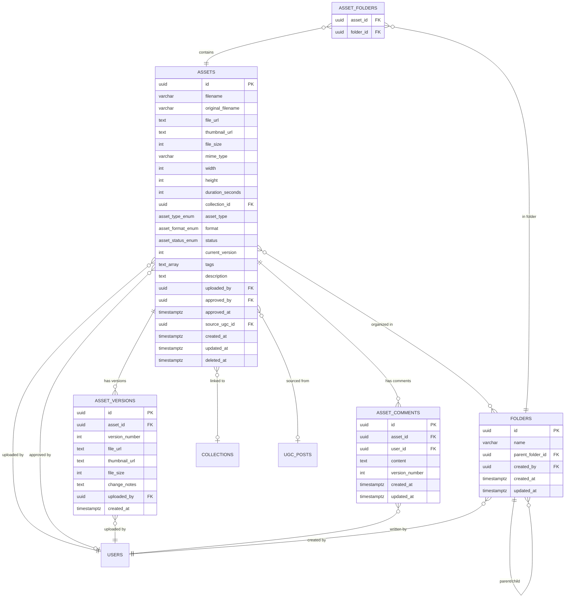

# Digital Asset Management (Repositorio de Assets) — Module Spec

> **Module:** Digital Asset Management (DAM)
> **Schema:** `dam`
> **Route prefix:** `/api/v1/dam`
> **Admin UI route group:** `(admin)/dam/*`
> **Version:** 1.0
> **Date:** March 2026
> **Status:** Approved
> **Priority:** HIGH — centralizes all brand assets currently scattered across Google Drive folders
> **Replaces:** Google Drive (informal folder structure with no versioning, no tagging, no approval workflow, no UGC pipeline)
> **References:** [DATABASE.md](../../architecture/DATABASE.md), [API.md](../../architecture/API.md), [AUTH.md](../../architecture/AUTH.md), [INFRA.md](../../architecture/INFRA.md), [NOTIFICATIONS.md](../../platform/NOTIFICATIONS.md), [GLOSSARY.md](../../dev/GLOSSARY.md), [Marketing Intel spec](../growth/marketing-intel.md), [PCP spec](../operations/pcp.md), [Tarefas spec](./tarefas.md)

---

## 1. Purpose & Scope

The Digital Asset Management (DAM) module is the **centralized brand asset library** of Ambaril. It replaces the current Google Drive chaos — where product photos, key visuals, mockups, videos, and UGC are scattered across dozens of folders with inconsistent naming, no versioning, no approval workflow, and no search — with a structured, searchable, version-controlled repository backed by Cloudflare R2 storage.

Every visual asset that represents the CIENA brand lives here: product photography for the e-commerce catalog, key visuals (KVs) for marketing campaigns, design mockups and source files, video content for social media, and approved user-generated content (UGC) imported from the Marketing Intelligence module. The DAM provides a single source of truth for "what is the latest approved version of this asset?"

**Core responsibilities:**

| Capability | Description |
|-----------|-------------|
| **Asset Library** | Grid/list view of all assets with rich filtering by collection, type, format, status, tags, uploader, and date. Full-text search across filenames, tags, and descriptions using PostgreSQL `tsvector`. |
| **Upload & Storage** | Direct upload to Cloudflare R2 via presigned URLs. Bulk upload support. Auto-thumbnail generation (Sharp for images, first-frame extraction for video). Supports images, videos, design files, and documents. |
| **Versioning** | Upload new versions of existing assets. Version history timeline with change notes. Side-by-side comparison for images. Sick uploads v1, Yuri comments, Sick uploads v2 — all tracked. |
| **Approval Workflow** | Status pipeline: `draft` -> `review` -> `approved` -> `published` -> `archived`. Only PM and admin can approve/publish. Creative can upload, tag, and version freely but cannot approve. |
| **UGC Pipeline** | Approved UGC posts from Marketing Intelligence auto-import into DAM with `type = ugc`, source link, and auto-populated tags. Provides a "UGC Inbox" view for review. |
| **Folder Organization** | Hierarchical folder tree for organizing assets. Assets can belong to multiple folders (many-to-many). Drag-and-drop to organize. |
| **Collection Linking** | Assets can be linked to PCP collections for organization by season/drop. |
| **Download Options** | Download original resolution file or a web-optimized version (auto-compressed for web use). |
| **Tags & Search** | Free-form text tags with autocomplete from existing tags. PostgreSQL full-text search across filename, tags, and description. |

**Primary users:**

| User | Role | Device | Primary actions |
|------|------|--------|----------------|
| **Sick** | Creative (Designer) | Desktop | Upload product photos, KVs, mockups, design source files. Create new versions after feedback. Tag and organize assets. Primary uploader. |
| **Yuri** | Creative (Content) | Desktop + Mobile | Search for approved assets for social media posts. Browse UGC. Comment on assets with feedback. Download web-optimized versions. |
| **Caio** | PM | Desktop | Approve assets for publication. Review UGC inbox. Manage folder structure. Monitor asset pipeline. |
| **Marcus** | Admin | Desktop | Full access. Approve/publish assets. Delete assets if needed. |

**Out of scope:** This module does NOT manage the actual social media posting (that is content execution, not asset management). It does NOT manage task attachments (those are stored in R2 but tracked by the Tarefas module, not DAM). It does NOT manage the UGC detection pipeline (that is Marketing Intelligence — DAM receives already-approved UGC). It does NOT manage product catalog images on the e-commerce frontend (the Checkout module references asset URLs but DAM does not push to the storefront).

---

## 2. User Stories

### 2.1 Upload & Organization (Sick / Creative)

| # | As a... | I want to... | So that... | Acceptance Criteria |
|---|---------|-------------|-----------|-------------------|
| US-01 | Creative (Sick) | Upload product photos for a new collection with collection tag and type | The assets are organized and findable from day one | Drag-and-drop upload zone or file picker; select collection from dropdown; set `asset_type = product_photo`; add tags during upload; bulk upload multiple files; auto-thumbnail generated; assets appear in library immediately with `status = draft` |
| US-02 | Creative (Sick) | Upload a new version of a KV after incorporating feedback | Version history is preserved and the team always sees the latest version | On asset detail, "Nova versao" button; upload new file; add change notes (e.g., "Ajustei cores conforme feedback do Caio"); `current_version` incremented; previous version preserved in `asset_versions`; thumbnail updated to new version |
| US-03 | Creative (Sick) | Tag assets with descriptive labels during or after upload | Assets are discoverable via search and filtering | Tag input with autocomplete suggesting existing tags (type-ahead); free-form creation of new tags; tags saved as `TEXT[]`; tags displayed as chips on asset cards; filterable in library view |
| US-04 | Creative (Sick) | Organize assets into folders by collection, drop, and content type | I can browse assets in a structured hierarchy when search is not enough | Folder tree in sidebar; create nested folders (e.g., "Inverno 2026 > Drop 13 > Fotos Produto"); drag assets into folders; assets can exist in multiple folders (many-to-many); click folder to filter library to that folder's contents |
| US-05 | Creative (Sick) | Upload design source files (PSD, AI) alongside exported versions | Both the editable source and the final output are stored together | PSD and AI files accepted (mime_type validation); stored in R2; thumbnail generated from embedded preview if available (else generic file icon); displayed in library alongside image exports |

### 2.2 Search & Discovery (Yuri / Creative)

| # | As a... | I want to... | So that... | Acceptance Criteria |
|---|---------|-------------|-----------|-------------------|
| US-06 | Creative (Yuri) | Search for assets by keyword across filename, tags, and description | I can find the specific asset I need for a social media post in seconds | Search bar at top of library; queries PostgreSQL full-text search index; results ranked by relevance; search terms highlighted in results; search works across filename, tags[], and description |
| US-07 | Creative (Yuri) | Filter the asset library by collection, type, format, status, and uploader | I can narrow down to exactly the category of assets I need | Filter bar with multi-select dropdowns: Collection (from pcp.collections), Type (product_photo, key_visual, mockup, video, ugc, etc.), Format (jpg, png, webp, mp4, etc.), Status (draft, review, approved, published, archived), Uploaded by (team member); filters applied in real-time; combinable |
| US-08 | Creative (Yuri) | Browse approved UGC in a dedicated gallery | I can find user-generated content for reposting or campaign inspiration | "UGC" filter preset in library view; shows only assets with `asset_type = ugc AND status = approved`; sorted by newest; shows original author username, engagement metrics (from linked ugc_post), and source link |
| US-09 | Creative (Yuri) | Download an asset in original resolution or web-optimized format | I can get the right format for my use case (print vs. social media) | Asset detail page: two download buttons — "Original" (full resolution, original format) and "Web" (compressed to max 1920px wide, WebP format, quality 80). Download via signed R2 URL (expires in 1 hour). |

### 2.3 Review & Approval (Caio / PM)

| # | As a... | I want to... | So that... | Acceptance Criteria |
|---|---------|-------------|-----------|-------------------|
| US-10 | PM (Caio) | Approve an asset and change its status to "approved" | The team knows this asset is cleared for use in campaigns and publications | "Aprovar" button on asset detail; sets `status = approved`, `approved_by = user.id`, `approved_at = NOW()`; asset badge changes to green "Aprovado"; emits `asset.approved` Flare event |
| US-11 | PM (Caio) | Publish an approved asset | The asset is marked as actively in use / published externally | "Publicar" button on approved assets only; sets `status = published`; asset badge changes to blue "Publicado"; reversible (can archive later) |
| US-12 | PM (Caio) | Archive an asset that is no longer current | Old assets are hidden from default views but not deleted | "Arquivar" button; sets `status = archived`; asset hidden from default library view (filter `status != archived`); still searchable with explicit archived filter; reversible |
| US-13 | PM (Caio) | Review the UGC inbox with assets auto-imported from Marketing Intelligence | I can approve or reject UGC assets for the DAM library | "UGC Inbox" tab in DAM; shows assets with `asset_type = ugc AND status = draft`; each card shows thumbnail, original post link, author username, engagement stats; "Aprovar" or "Rejeitar" actions; approved assets enter the main library |
| US-14 | PM (Caio) | Add feedback comments on a specific version of an asset | Sick knows exactly what to change on which version | Comment input on asset detail with optional `version_number` selector; comments tagged to specific version displayed in version timeline; Sick sees "Caio commented on v1: 'Cores estao escuras, clarear 10%'" |

### 2.4 Version Comparison (Sick + Caio)

| # | As a... | I want to... | So that... | Acceptance Criteria |
|---|---------|-------------|-----------|-------------------|
| US-15 | Creative (Sick) | Compare two versions of an asset side by side | I can visually confirm the changes I made between versions | "Comparar" button on asset detail with version >= 2; opens side-by-side view with v(N-1) on left and v(N) on right; image zoom synchronized; version numbers and change notes displayed above each side |
| US-16 | PM (Caio) | View the full version history of an asset | I can track the evolution of a design from initial upload to final approved version | Version timeline on asset detail: vertical list of versions with version number, thumbnail, change notes, uploaded_by, created_at; click any version to view full detail; current version highlighted |

### 2.5 Team Member Downloads

| # | As a... | I want to... | So that... | Acceptance Criteria |
|---|---------|-------------|-----------|-------------------|
| US-17 | Team member | Download an original resolution asset for print or external use | I can use the highest quality version available | "Baixar original" button generates signed R2 URL with `Content-Disposition: attachment`; download starts immediately; URL expires after 1 hour for security |
| US-18 | Team member | Download a web-optimized version for social media or email | I don't have to manually resize/compress assets for web use | "Baixar web" button serves auto-generated web version (WebP, max 1920px, quality 80); generated on first request and cached in R2 alongside original |

---

## 3. Data Model

### 3.1 Entity Relationship Diagram



### 3.2 Enums

```sql
CREATE TYPE dam.asset_type AS ENUM (
    'product_photo', 'key_visual', 'mockup', 'video',
    'ugc', 'raw_file', 'document', 'other'
);

CREATE TYPE dam.asset_format AS ENUM (
    'jpg', 'png', 'webp', 'mp4', 'mov',
    'psd', 'ai', 'pdf', 'svg', 'other'
);

CREATE TYPE dam.asset_status AS ENUM (
    'draft', 'review', 'approved', 'published', 'archived'
);
```

### 3.3 Table Definitions

#### 3.3.1 dam.assets

| Column | Type | Constraints | Description |
|--------|------|-------------|-------------|
| id | UUID | PK, DEFAULT gen_random_uuid() | UUID v7 |
| filename | VARCHAR(255) | NOT NULL | System filename (sanitized, unique slug): e.g., `camiseta-preta-basic-kv-v3.png`. Generated on upload: slugified original name + collision suffix if needed. |
| original_filename | VARCHAR(255) | NOT NULL | Original filename as uploaded by the user: e.g., "Camiseta Preta Basic KV Final FINAL v3.png". Preserved for display and download. |
| file_url | TEXT | NOT NULL | R2 storage URL: `https://assets.ambaril.app/dam/{collection_or_folder}/{filename}`. Points to the current version. Updated on new version upload. |
| thumbnail_url | TEXT | NULL | R2 URL for auto-generated thumbnail (400x400 max, WebP). NULL if thumbnail generation failed or is pending. For video: first frame extracted. |
| file_size | INTEGER | NOT NULL, CHECK (file_size > 0) | File size in bytes of the current version |
| mime_type | VARCHAR(100) | NOT NULL | MIME type of the current version (e.g., "image/png", "video/mp4", "application/pdf") |
| width | INTEGER | NULL | Image/video width in pixels. NULL for non-visual files (PDF, PSD without embedded preview). |
| height | INTEGER | NULL | Image/video height in pixels. NULL for non-visual files. |
| duration_seconds | INTEGER | NULL | Video duration in seconds. NULL for non-video assets. |
| collection_id | UUID | NULL, FK pcp.collections(id) | Linked PCP collection for organizational context. NULL if not collection-specific. |
| asset_type | dam.asset_type | NOT NULL | product_photo, key_visual, mockup, video, ugc, raw_file, document, other |
| format | dam.asset_format | NOT NULL | jpg, png, webp, mp4, mov, psd, ai, pdf, svg, other |
| status | dam.asset_status | NOT NULL DEFAULT 'draft' | draft, review, approved, published, archived |
| current_version | INTEGER | NOT NULL DEFAULT 1 | Current version number. Incremented on each new version upload. |
| tags | TEXT[] | NOT NULL DEFAULT '{}' | Free-form tags (e.g., `{'drop-13', 'camiseta', 'kv', 'instagram'}`). Searchable via GIN index. |
| description | TEXT | NULL | Asset description, notes, usage instructions. Searchable via full-text index. |
| uploaded_by | UUID | NOT NULL, FK global.users(id) | Original uploader |
| approved_by | UUID | NULL, FK global.users(id) | Who approved the asset. NULL if not yet approved. |
| approved_at | TIMESTAMPTZ | NULL | When the asset was approved. NULL if not yet approved. |
| source_ugc_id | UUID | NULL, FK marketing.ugc_posts(id) | Link to the Marketing Intelligence UGC post that was the source for this asset. NULL if not UGC-sourced. |
| created_at | TIMESTAMPTZ | NOT NULL DEFAULT NOW() | |
| updated_at | TIMESTAMPTZ | NOT NULL DEFAULT NOW() | |
| deleted_at | TIMESTAMPTZ | NULL | Soft delete. Deleted assets are hidden from all views but retained in R2 for recovery. |

**Indexes:**

```sql
CREATE INDEX idx_dam_assets_collection ON dam.assets (collection_id) WHERE collection_id IS NOT NULL;
CREATE INDEX idx_dam_assets_type ON dam.assets (asset_type);
CREATE INDEX idx_dam_assets_format ON dam.assets (format);
CREATE INDEX idx_dam_assets_status ON dam.assets (status);
CREATE INDEX idx_dam_assets_uploaded_by ON dam.assets (uploaded_by);
CREATE INDEX idx_dam_assets_approved_by ON dam.assets (approved_by) WHERE approved_by IS NOT NULL;
CREATE INDEX idx_dam_assets_tags ON dam.assets USING GIN (tags);
CREATE INDEX idx_dam_assets_source_ugc ON dam.assets (source_ugc_id) WHERE source_ugc_id IS NOT NULL;
CREATE INDEX idx_dam_assets_search ON dam.assets USING GIN (
    to_tsvector('portuguese', coalesce(filename, '') || ' ' || coalesce(original_filename, '') || ' ' || coalesce(description, '') || ' ' || array_to_string(tags, ' '))
);
CREATE INDEX idx_dam_assets_active ON dam.assets (status, created_at DESC) WHERE deleted_at IS NULL;
CREATE INDEX idx_dam_assets_library ON dam.assets (status, asset_type, created_at DESC) WHERE deleted_at IS NULL AND status != 'archived';
```

#### 3.3.2 dam.asset_versions

| Column | Type | Constraints | Description |
|--------|------|-------------|-------------|
| id | UUID | PK, DEFAULT gen_random_uuid() | UUID v7 |
| asset_id | UUID | NOT NULL, FK dam.assets(id) ON DELETE CASCADE | Parent asset |
| version_number | INTEGER | NOT NULL, CHECK (version_number >= 1) | Sequential version number (1, 2, 3...) |
| file_url | TEXT | NOT NULL | R2 storage URL for this specific version: `https://assets.ambaril.app/dam/versions/{asset_id}/v{version_number}/{filename}` |
| thumbnail_url | TEXT | NULL | Version-specific thumbnail URL. NULL if not yet generated. |
| file_size | INTEGER | NOT NULL, CHECK (file_size > 0) | File size in bytes for this version |
| change_notes | TEXT | NULL | Description of changes in this version (e.g., "Ajustei saturacao e cortei fundo"). NULL for v1 (initial upload). |
| uploaded_by | UUID | NOT NULL, FK global.users(id) | Who uploaded this version |
| created_at | TIMESTAMPTZ | NOT NULL DEFAULT NOW() | |

**Indexes:**

```sql
CREATE INDEX idx_dam_av_asset ON dam.asset_versions (asset_id, version_number DESC);
CREATE UNIQUE INDEX idx_dam_av_unique ON dam.asset_versions (asset_id, version_number);
CREATE INDEX idx_dam_av_uploaded_by ON dam.asset_versions (uploaded_by);
```

#### 3.3.3 dam.asset_comments

| Column | Type | Constraints | Description |
|--------|------|-------------|-------------|
| id | UUID | PK, DEFAULT gen_random_uuid() | UUID v7 |
| asset_id | UUID | NOT NULL, FK dam.assets(id) ON DELETE CASCADE | Parent asset |
| user_id | UUID | NOT NULL, FK global.users(id) | Comment author |
| content | TEXT | NOT NULL | Comment text. Max 4096 chars. |
| version_number | INTEGER | NULL | If the comment is about a specific version, references that version number. NULL = general comment about the asset (not version-specific). |
| created_at | TIMESTAMPTZ | NOT NULL DEFAULT NOW() | |
| updated_at | TIMESTAMPTZ | NOT NULL DEFAULT NOW() | |

**Indexes:**

```sql
CREATE INDEX idx_dam_ac_asset ON dam.asset_comments (asset_id, created_at ASC);
CREATE INDEX idx_dam_ac_user ON dam.asset_comments (user_id);
CREATE INDEX idx_dam_ac_version ON dam.asset_comments (asset_id, version_number) WHERE version_number IS NOT NULL;
```

#### 3.3.4 dam.folders

| Column | Type | Constraints | Description |
|--------|------|-------------|-------------|
| id | UUID | PK, DEFAULT gen_random_uuid() | UUID v7 |
| name | VARCHAR(255) | NOT NULL | Folder name (e.g., "Inverno 2026", "Drop 13", "Fotos Produto") |
| parent_folder_id | UUID | NULL, FK dam.folders(id) ON DELETE CASCADE | Parent folder for nesting. NULL = root-level folder. |
| created_by | UUID | NOT NULL, FK global.users(id) | Who created this folder |
| created_at | TIMESTAMPTZ | NOT NULL DEFAULT NOW() | |
| updated_at | TIMESTAMPTZ | NOT NULL DEFAULT NOW() | |

**Indexes:**

```sql
CREATE INDEX idx_dam_folders_parent ON dam.folders (parent_folder_id);
CREATE INDEX idx_dam_folders_name ON dam.folders (name);
CREATE UNIQUE INDEX idx_dam_folders_unique_name ON dam.folders (parent_folder_id, name) WHERE parent_folder_id IS NOT NULL;
CREATE UNIQUE INDEX idx_dam_folders_unique_root ON dam.folders (name) WHERE parent_folder_id IS NULL;
```

#### 3.3.5 dam.asset_folders (Junction Table)

| Column | Type | Constraints | Description |
|--------|------|-------------|-------------|
| asset_id | UUID | NOT NULL, FK dam.assets(id) ON DELETE CASCADE | Asset |
| folder_id | UUID | NOT NULL, FK dam.folders(id) ON DELETE CASCADE | Folder |
| | | PRIMARY KEY (asset_id, folder_id) | Composite PK prevents duplicates |

**Indexes:**

```sql
CREATE INDEX idx_dam_af_folder ON dam.asset_folders (folder_id);
CREATE INDEX idx_dam_af_asset ON dam.asset_folders (asset_id);
```

### 3.4 Cross-schema References

```
dam.assets.collection_id               ──► pcp.collections(id)
dam.assets.uploaded_by                  ──► global.users(id)
dam.assets.approved_by                  ──► global.users(id)
dam.assets.source_ugc_id               ──► marketing.ugc_posts(id)
dam.asset_versions.uploaded_by          ──► global.users(id)
dam.asset_comments.user_id             ──► global.users(id)
dam.folders.created_by                  ──► global.users(id)

marketing.ugc_posts.linked_dam_asset_id ◄── set when UGC is imported into DAM
tarefas.task_attachments.file_url       ──► shared R2 bucket (same infrastructure, different path prefix)
```

---

## 4. Screens & Wireframes

All screens follow the Ambaril Design System: dark mode default, DM Sans, HeroUI components, Lucide React. DAM uses a media-forward layout with large thumbnails, minimal chrome, and responsive grid.

### 4.1 Asset Library (Grid View — Default)

```
+------------------------------------------------------------------------------+
|  Ambaril Admin > DAM > Biblioteca de Assets             [+ Upload] [Grid|Lista] |
+------------------------------------------------------------------------------+
|                                                                              |
|  [Buscar assets...______________________________________]  [Buscar]         |
|                                                                              |
|  Filtros: [Colecao v] [Tipo v] [Formato v] [Status v] [Uploader v] [Tags v]|
|                                                                              |
|  Resultados: 142 assets                    Ordenar: [Mais recentes v]       |
|                                                                              |
|  +-- Sidebar ------+  +-- Grid ------------------------------------------+ |
|  |                  |  |                                                    | |
|  | PASTAS           |  | +----------+ +----------+ +----------+ +--------+ | |
|  |                  |  | |          | |          | |          | |        | | |
|  | > Inverno 2026   |  | | [thumb]  | | [thumb]  | | [thumb]  | | [thumb]| | |
|  |   > Drop 13      |  | | kv-drop  | | camiseta | | moletom  | | ugc-   | | |
|  |     > Fotos      |  | | -13.png  | | -preta-  | | -over-   | | maria- | | |
|  |     > KVs        |  | |          | | front.jpg| | sized.jpg| | 01.jpg | | |
|  |     > Mockups     |  | | KV       | | Foto Prod| | Foto Prod| | UGC    | | |
|  |   > Drop 14      |  | | Aprovado | | Aprovado | | Rascunho | | Draft  | | |
|  | > Verao 2026     |  | | v3  Sick | | v1  Sick | | v2  Sick | | auto   | | |
|  | > UGC            |  | | 2.4 MB   | | 4.1 MB   | | 3.8 MB   | | 1.2 MB | | |
|  | > Creator Kit    |  | +----------+ +----------+ +----------+ +--------+ | |
|  | > Sem pasta      |  |                                                    | |
|  |                  |  |                                                    | |
|  | [+ Nova pasta]   |  | +----------+ +----------+ +----------+ +--------+ | |
|  |                  |  | | [thumb]  | | [thumb]  | | [play]   | | [thumb]| | |
|  +------------------+  | | lookbook | | mockup-  | | reels-   | | etiq-  | | |
|  |                  |  | | -01.jpg  | | embalag. | | bts-     | | ueta-  | | |
|  | Tags populares:  |  | |          | | psd      | | drop13   | | tecida | | |
|  | [drop-13] [kv]   |  | | Foto Prod| | Mockup   | | Video    | | Foto   | | |
|  | [instagram]      |  | | Publicado| | Review   | | Draft    | | Draft  | | |
|  | [produto]        |  | | v1  Sick | | v1  Sick | | v1  Yuri | | v1 Sick| | |
|  | [ugc]            |  | | 5.2 MB   | | 45 MB    | | 82 MB    | | 890 KB | | |
|  |                  |  | +----------+ +----------+ +----------+ +--------+ | |
|  +------------------+  |                                                    | |
|                        |  Mostrando 1-24 de 142         [< Anterior] [> Prox]| |
|                        +----------------------------------------------------+ |
|                                                                              |
|  Status badges:                                                              |
|  [Rascunho] gray  [Revisao] yellow  [Aprovado] green                       |
|  [Publicado] blue  [Arquivado] hidden by default                            |
|                                                                              |
|  Thumbnail = 400x400 auto-generated WebP                                    |
|  [play] overlay on video thumbnails                                         |
|  Click thumbnail = open Asset Detail                                        |
+------------------------------------------------------------------------------+
```

### 4.2 Asset Detail

```
+------------------------------------------------------------------------------+
|  Ambaril Admin > DAM > kv-drop-13.png                     [Baixar v] [Fechar X]|
+------------------------------------------------------------------------------+
|                                                                              |
|  +-- Preview (large) ---------------------+  +-- Metadata ----------------+ |
|  |                                         |  |                            | |
|  |                                         |  |  INFORMACOES               | |
|  |                                         |  |  Arquivo: kv-drop-13.png   | |
|  |           [Large preview                |  |  Original: KV Drop 13      | |
|  |            of the asset                 |  |    FINAL v3.png            | |
|  |            800x600 area                 |  |  Tamanho: 2.4 MB           | |
|  |            click to zoom]               |  |  Formato: PNG              | |
|  |                                         |  |  Dimensoes: 1080 x 1080    | |
|  |                                         |  |  Tipo: Key Visual          | |
|  |                                         |  |  Colecao: Inverno 2026     | |
|  |                                         |  |                            | |
|  |                                         |  |  STATUS                    | |
|  |                                         |  |  [Aprovado] por Caio       | |
|  |                                         |  |  em 15/03/2026 14:30       | |
|  |                                         |  |                            | |
|  |                                         |  |  UPLOAD                    | |
|  +-----------------------------------------+  |  Por: Sick                 | |
|                                               |  Em: 10/03/2026 09:00      | |
|  DOWNLOAD                                     |  Versao atual: v3          | |
|  [Baixar original (PNG, 2.4MB)]               |                            | |
|  [Baixar web (WebP, 320KB)]                   |  TAGS                      | |
|                                               |  [drop-13] [kv]            | |
|  ACOES                                        |  [instagram] [campanha]    | |
|  [Nova versao] [Aprovar] [Arquivar]           |  [+ adicionar tag]         | |
|                                               |                            | |
|  -  -  -  -  -  -  -  -  -  -  -  -  -  -   |  PASTAS                    | |
|                                               |  Inverno 2026 > Drop 13    | |
|  HISTORICO DE VERSOES                         |    > KVs                   | |
|  ========================                     |                            | |
|                                               +----------------------------+ |
|  v3 (atual)  Sick  15/03/2026                                               |
|  "Ajustei cores e adicionei texto overlay                                   |
|   conforme feedback do Caio"                                                |
|  [Ver] [Comparar com v2]                                                    |
|                                                                              |
|  v2  Sick  13/03/2026                                                       |
|  "Cortei fundo e ajustei enquadramento"                                     |
|  [Ver] [Comparar com v1]                                                    |
|                                                                              |
|  v1  Sick  10/03/2026                                                       |
|  (upload inicial)                                                            |
|  [Ver]                                                                       |
|                                                                              |
|  -  -  -  -  -  -  -  -  -  -  -  -  -  -  -  -  -  -  -  -  -  -  -  -  |
|                                                                              |
|  COMENTARIOS (3)                                                            |
|                                                                              |
|  [Caio] 12/03 14:00  (sobre v1)                                            |
|  Cores estao muito escuras. Clarear uns 10%                                 |
|  e adicionar o texto "DROP 13" overlay.                                     |
|                                                                              |
|  [Sick] 13/03 10:00                                                        |
|  Subi a v2 com o fundo cortado. Vou fazer                                  |
|  os ajustes de cor na proxima versao.                                       |
|                                                                              |
|  [Caio] 15/03 14:30  (sobre v3)                                            |
|  Perfeito! Aprovado.                                                        |
|                                                                              |
|  [Escrever comentario...]   Versao: [Geral v]   [Enviar]                   |
+------------------------------------------------------------------------------+
```

### 4.3 Upload View

```
+------------------------------------------------------------------------------+
|  Ambaril Admin > DAM > Upload                                                   |
+------------------------------------------------------------------------------+
|                                                                              |
|  +----------------------------------------------------------------------+   |
|  |                                                                      |   |
|  |          +------+                                                    |   |
|  |          | drag |    Arraste arquivos aqui                           |   |
|  |          | drop |    ou [Selecionar arquivos]                        |   |
|  |          | icon |                                                    |   |
|  |          +------+    Formatos: JPG, PNG, WebP, MP4, MOV,            |   |
|  |                      PSD, AI, PDF, SVG                               |   |
|  |                      Max: 100MB (imagens), 500MB (video),           |   |
|  |                           50MB (documentos)                          |   |
|  |                                                                      |   |
|  +----------------------------------------------------------------------+   |
|                                                                              |
|  CONFIGURACOES DO UPLOAD                                                     |
|  Colecao: [Inverno 2026                                   v]               |
|  Tipo:    [Foto de Produto                                 v]               |
|  Tags:    [drop-13] [produto] [camiseta] [+ adicionar tag__]               |
|                                                                              |
|  ARQUIVOS SELECIONADOS (4)                                                   |
|  +----+---------------------------+---------+--------+----+------+          |
|  | #  | Arquivo                   | Tamanho | Tipo   | Sts| Prev |          |
|  +----+---------------------------+---------+--------+----+------+          |
|  | 1  | camiseta-preta-front.jpg  | 4.1 MB  | JPG    | OK | [th] |          |
|  |    | [========================] 100%                            |          |
|  +----+---------------------------+---------+--------+----+------+          |
|  | 2  | camiseta-preta-back.jpg   | 3.8 MB  | JPG    | OK | [th] |          |
|  |    | [========================] 100%                            |          |
|  +----+---------------------------+---------+--------+----+------+          |
|  | 3  | camiseta-preta-detail.jpg | 2.9 MB  | JPG    | >> | [th] |          |
|  |    | [============>...........] 58%                             |          |
|  +----+---------------------------+---------+--------+----+------+          |
|  | 4  | camiseta-preta-modelo.jpg | 5.2 MB  | JPG    | .. | [th] |          |
|  |    | [                        ] aguardando                      |          |
|  +----+---------------------------+---------+--------+----+------+          |
|                                                                              |
|  Upload direto para R2 via presigned URL                                    |
|  Thumbnails gerados automaticamente apos upload                             |
|                                                                              |
|  [Cancelar]                                                  [Fazer Upload] |
+------------------------------------------------------------------------------+
```

### 4.4 Folder Browser

```
+------------------------------------------------------------------------------+
|  Ambaril Admin > DAM > Pastas                                   [+ Nova Pasta]  |
+------------------------------------------------------------------------------+
|                                                                              |
|  +-- Folder Tree (sidebar) ---+  +-- Folder Contents ----------------------+|
|  |                             |  |                                          ||
|  | v Inverno 2026              |  |  Pasta: Inverno 2026 > Drop 13 > KVs   ||
|  |   v Drop 13                |  |  3 assets                                ||
|  |     > Fotos Produto (8)    |  |                                          ||
|  |     > KVs (3)        <--   |  |  +----------+ +----------+ +----------+ ||
|  |     > Mockups (5)          |  |  | [thumb]  | | [thumb]  | | [thumb]  | ||
|  |     > Videos (2)           |  |  | kv-drop  | | kv-drop  | | kv-drop  | ||
|  |   > Drop 14                |  |  | -13.png  | | -13-     | | -13-     | ||
|  |     > Fotos Produto (3)    |  |  |          | | stor.png | | feed.png | ||
|  |     > KVs (1)              |  |  | Aprovado | | Draft    | | Aprovado | ||
|  | v Verao 2026               |  |  | v3       | | v1       | | v2       | ||
|  |   > Drop 15                |  |  +----------+ +----------+ +----------+ ||
|  | > UGC Aprovados (12)       |  |                                          ||
|  | > Templates Marca (6)      |  |  Drag assets here to add to folder      ||
|  |                             |  |                                          ||
|  | [+ Nova pasta raiz]        |  +------------------------------------------+|
|  +-----------------------------+                                             |
|                                                                              |
|  Folder tree:                                                                |
|  - Click folder = show contents in right panel                              |
|  - Right-click folder = rename/delete/create subfolder                      |
|  - Drag asset to folder = add to folder (many-to-many)                      |
|  - (N) = asset count in folder                                              |
+------------------------------------------------------------------------------+
```

### 4.5 Version Compare (Side-by-Side)

```
+------------------------------------------------------------------------------+
|  Ambaril Admin > DAM > kv-drop-13.png > Comparar Versoes            [Fechar X] |
+------------------------------------------------------------------------------+
|                                                                              |
|  +--- v2 (13/03/2026) -------------------+  +--- v3 (15/03/2026) ---------+ |
|  |                                        |  |                              | |
|  |                                        |  |                              | |
|  |          [Image v2                     |  |          [Image v3           | |
|  |           rendered at                  |  |           rendered at        | |
|  |           same scale                   |  |           same scale         | |
|  |           synced zoom]                 |  |           synced zoom]       | |
|  |                                        |  |                              | |
|  |                                        |  |                              | |
|  |                                        |  |                              | |
|  +----------------------------------------+  +------------------------------+ |
|                                                                              |
|  v2: "Cortei fundo e ajustei enquadramento"                                 |
|  v3: "Ajustei cores e adicionei texto overlay conforme feedback do Caio"    |
|                                                                              |
|  Uploaded by: Sick (v2), Sick (v3)                                          |
|  File size: 2.1 MB (v2), 2.4 MB (v3)                                       |
|                                                                              |
|  Versao: [v1 v] vs [v3 v]    (dropdown selectors to compare any versions)  |
|                                                                              |
|  Zoom: synced between both panels (scroll/pinch on one affects both)        |
+------------------------------------------------------------------------------+
```

### 4.6 UGC Inbox

```
+------------------------------------------------------------------------------+
|  Ambaril Admin > DAM > UGC Inbox                                               |
+------------------------------------------------------------------------------+
|                                                                              |
|  Assets importados automaticamente do Marketing Intelligence                 |
|  Status: Pendente de revisao                                                 |
|                                                                              |
|  Filtros: [Status: Rascunho v]  [Periodo v]           Total pendente: 7    |
|                                                                              |
|  +----------------------------------------------------------------------+   |
|  | [thumb]  @maria.santos  |  Engajamento: 3.2%  |  850 likes          |   |
|  |          15/03/2026     |  12 comentarios      |  42 shares          |   |
|  |          Instagram      |                      |                     |   |
|  |                         |  Tags auto: [ugc] [menção] [camiseta]      |   |
|  |                         |  Colecao: Inverno 2026 (auto-detected)     |   |
|  |                         |                                            |   |
|  |          [Ver post original ->]                                      |   |
|  |                                                                      |   |
|  |          [Aprovar para DAM]     [Rejeitar]     [Ver no Marketing]    |   |
|  +----------------------------------------------------------------------+   |
|  | [thumb]  @pedro.style   |  Engajamento: 5.1%  |  1.2k likes         |   |
|  |          14/03/2026     |  34 comentarios      |  89 shares          |   |
|  |          Instagram      |                      |                     |   |
|  |                         |  Tags auto: [ugc] [reels] [moletom]        |   |
|  |                         |  Colecao: Inverno 2026 (auto-detected)     |   |
|  |                         |                                            |   |
|  |          [Ver post original ->]                                      |   |
|  |                                                                      |   |
|  |          [Aprovar para DAM]     [Rejeitar]     [Ver no Marketing]    |   |
|  +----------------------------------------------------------------------+   |
|                                                                              |
|  Aprovar = status -> approved, move to main library                         |
|  Rejeitar = status -> archived (hidden but not deleted)                     |
|  Auto-imported assets have source_ugc_id linking back to Marketing Intel    |
+------------------------------------------------------------------------------+
```

---

## 5. API Endpoints

All endpoints follow the patterns defined in [API.md](../../architecture/API.md). Dates in ISO 8601. Auth via session cookie.

### 5.1 Admin Endpoints (Auth Required)

Route prefix: `/api/v1/dam`

#### 5.1.1 Assets

| Method | Path | Auth | Description | Request Body / Query | Response |
|--------|------|------|-------------|---------------------|----------|
| GET | `/assets` | Internal | List assets (paginated, filterable, searchable) | `?cursor=&limit=24&search=&collection_id=&asset_type=&format=&status=&uploaded_by=&tags=&folder_id=&dateFrom=&dateTo=&sort=created_at_desc` | `{ data: Asset[], meta: Pagination }` |
| GET | `/assets/:id` | Internal | Get asset detail with versions, comments, folders | `?include=versions,comments,folders` | `{ data: Asset }` |
| POST | `/assets` | Internal | Create asset record (after file upload to R2) | `{ filename, original_filename, file_url, file_size, mime_type, width?, height?, duration_seconds?, collection_id?, asset_type, format, tags?, description? }` | `201 { data: Asset }` |
| PATCH | `/assets/:id` | Internal | Update asset metadata | `{ description?, tags?, collection_id?, asset_type?, status? }` | `{ data: Asset }` |
| DELETE | `/assets/:id` | Internal | Soft-delete asset (sets deleted_at) | -- | `204` |
| POST | `/assets/:id/actions/approve` | Internal | Approve asset (status -> approved) | -- | `{ data: Asset }` (approved_by, approved_at set) |
| POST | `/assets/:id/actions/publish` | Internal | Publish asset (status -> published) | -- | `{ data: Asset }` |
| POST | `/assets/:id/actions/archive` | Internal | Archive asset (status -> archived) | -- | `{ data: Asset }` |
| POST | `/assets/:id/actions/restore` | Internal | Restore archived asset (status -> approved) | -- | `{ data: Asset }` |
| GET | `/assets/search` | Internal | Full-text search across assets | `?q=&cursor=&limit=24` | `{ data: Asset[], meta: Pagination }` |

#### 5.1.2 Upload

| Method | Path | Auth | Description | Request Body / Query | Response |
|--------|------|------|-------------|---------------------|----------|
| POST | `/upload/presign` | Internal | Get presigned R2 upload URL | `{ filename, mime_type, file_size }` | `{ upload_url, file_url, thumbnail_path }` |
| POST | `/upload/confirm` | Internal | Confirm upload and create asset record | `{ file_url, original_filename, file_size, mime_type, width?, height?, duration_seconds?, collection_id?, asset_type, format, tags?, description? }` | `201 { data: Asset }` |
| POST | `/upload/bulk-presign` | Internal | Get presigned URLs for bulk upload | `{ files: [{ filename, mime_type, file_size }] }` | `{ uploads: [{ upload_url, file_url }] }` |

#### 5.1.3 Versions

| Method | Path | Auth | Description | Request Body / Query | Response |
|--------|------|------|-------------|---------------------|----------|
| GET | `/assets/:id/versions` | Internal | List all versions of an asset | -- | `{ data: AssetVersion[] }` |
| POST | `/assets/:id/versions/presign` | Internal | Get presigned URL for new version upload | `{ filename, mime_type, file_size }` | `{ upload_url, file_url }` |
| POST | `/assets/:id/versions` | Internal | Confirm new version upload | `{ file_url, file_size, change_notes? }` | `201 { data: AssetVersion }` (asset.current_version incremented, asset.file_url updated) |
| GET | `/assets/:id/versions/:version` | Internal | Get specific version detail | -- | `{ data: AssetVersion }` |

#### 5.1.4 Comments

| Method | Path | Auth | Description | Request Body / Query | Response |
|--------|------|------|-------------|---------------------|----------|
| GET | `/assets/:id/comments` | Internal | List comments for an asset (chronological) | `?version_number=` | `{ data: Comment[] }` |
| POST | `/assets/:id/comments` | Internal | Add a comment | `{ content, version_number? }` | `201 { data: Comment }` |
| PATCH | `/comments/:id` | Internal | Edit own comment | `{ content }` | `{ data: Comment }` |
| DELETE | `/comments/:id` | Internal | Delete own comment | -- | `204` |

#### 5.1.5 Folders

| Method | Path | Auth | Description | Request Body / Query | Response |
|--------|------|------|-------------|---------------------|----------|
| GET | `/folders` | Internal | Get folder tree | `?flat=false` (default: hierarchical tree) | `{ data: Folder[] }` (nested structure) |
| POST | `/folders` | Internal | Create a folder | `{ name, parent_folder_id? }` | `201 { data: Folder }` |
| PATCH | `/folders/:id` | Internal | Rename folder | `{ name }` | `{ data: Folder }` |
| DELETE | `/folders/:id` | Internal | Delete folder (removes folder, not assets) | -- | `204` |
| POST | `/folders/:id/assets` | Internal | Add asset to folder | `{ asset_id }` | `201` |
| DELETE | `/folders/:id/assets/:asset_id` | Internal | Remove asset from folder | -- | `204` |

#### 5.1.6 Tags

| Method | Path | Auth | Description | Request Body / Query | Response |
|--------|------|------|-------------|---------------------|----------|
| GET | `/tags/autocomplete` | Internal | Autocomplete tags from existing usage | `?q=&limit=10` | `{ data: string[] }` |
| GET | `/tags/popular` | Internal | Get most-used tags | `?limit=20` | `{ data: [{ tag: string, count: number }] }` |

#### 5.1.7 Bulk Operations

| Method | Path | Auth | Description | Request Body / Query | Response |
|--------|------|------|-------------|---------------------|----------|
| POST | `/assets/bulk/move` | Internal | Move multiple assets to a folder | `{ asset_ids: UUID[], folder_id }` | `{ data: { moved: number } }` |
| POST | `/assets/bulk/tag` | Internal | Add tags to multiple assets | `{ asset_ids: UUID[], tags: string[] }` | `{ data: { tagged: number } }` |
| POST | `/assets/bulk/delete` | Internal | Soft-delete multiple assets | `{ asset_ids: UUID[] }` | `{ data: { deleted: number } }` |
| POST | `/assets/bulk/approve` | Internal | Approve multiple assets | `{ asset_ids: UUID[] }` | `{ data: { approved: number } }` |

#### 5.1.8 Download

| Method | Path | Auth | Description | Request Body / Query | Response |
|--------|------|------|-------------|---------------------|----------|
| GET | `/assets/:id/download/original` | Internal | Get signed download URL for original file | -- | `{ url: string, expires_in: 3600 }` |
| GET | `/assets/:id/download/web` | Internal | Get signed download URL for web-optimized version | -- | `{ url: string, expires_in: 3600 }` |

### 5.2 Internal Endpoints (Module-to-Module)

Route prefix: `/api/v1/dam/internal`

| Method | Path | Auth | Description | Request Body / Query | Response |
|--------|------|------|-------------|---------------------|----------|
| POST | `/assets/from-ugc` | Service | Create asset from approved UGC post (called by Marketing Intel) | `{ source_ugc_id, file_url, thumbnail_url?, original_filename, file_size, mime_type, width?, height?, tags?, collection_id?, author_username }` | `201 { data: Asset }` (asset_type=ugc, status=draft, source_ugc_id set) |
| GET | `/assets/by-collection/:collection_id` | Service | Get assets for a collection (used by PCP, Dashboard) | `?asset_type=&status=&limit=` | `{ data: Asset[] }` |
| GET | `/assets/stats` | Service | Get asset statistics (used by Dashboard) | -- | `{ data: { total_assets, by_status, by_type, total_storage_bytes } }` |

---

## 6. Business Rules

### 6.1 Upload & Storage Rules

| # | Rule | Detail |
|---|------|--------|
| R1 | **Upload flow via presigned URL** | Client requests a presigned upload URL from the API (`POST /upload/presign`). Server generates a Cloudflare R2 presigned PUT URL (expires in 15 minutes) with the target path `dam/{year}/{month}/{sanitized_filename}`. Client uploads the file directly to R2 (no file data passes through the API server). Client then calls `POST /upload/confirm` to create the `dam.assets` record with the file_url and metadata. This two-step flow keeps the API server lightweight and avoids large file transfer bottlenecks. |
| R2 | **Thumbnail auto-generation** | After upload confirmation, a background job (`dam:generate-thumbnail`) is enqueued. For images: Sharp resizes to max 400x400 (preserving aspect ratio), converts to WebP quality 80, saves to R2 at `dam/thumbnails/{asset_id}.webp`. For video: ffmpeg extracts the first frame, resizes and converts to WebP. Thumbnail URL stored in `dam.assets.thumbnail_url`. If generation fails, `thumbnail_url` remains NULL and a generic file-type icon is shown in the UI. |
| R3 | **File size limits** | Images (jpg, png, webp, svg): max 100MB. Video (mp4, mov): max 500MB. Documents (pdf, psd, ai): max 50MB. Enforced at presigned URL generation: server checks `file_size` against limits before issuing the URL. Oversized requests return 413 Payload Too Large. |
| R4 | **Supported formats** | Accepted MIME types: `image/jpeg`, `image/png`, `image/webp`, `image/svg+xml`, `video/mp4`, `video/quicktime`, `application/pdf`, `image/vnd.adobe.photoshop` (PSD), `application/postscript` (AI). Files with unsupported MIME types are rejected at presigned URL request with 415 Unsupported Media Type. |
| R5 | **Filename sanitization** | The `filename` stored in the database is a sanitized version of the original: lowercase, spaces replaced with hyphens, special characters removed, max 200 chars. `original_filename` preserves the user's original filename for display. If a filename collision occurs in the same R2 path, a UUID suffix is appended. |

### 6.2 Versioning Rules

| # | Rule | Detail |
|---|------|--------|
| R6 | **Version creation** | Uploading a new file to an existing asset creates an `asset_versions` record with the next sequential `version_number`. The parent `dam.assets` record is updated: `current_version` incremented, `file_url` updated to the new file, `thumbnail_url` updated to the new thumbnail, `file_size` updated. Previous version file remains in R2 (never deleted on version update). |
| R7 | **Version immutability** | Once an `asset_versions` record is created, it cannot be deleted or modified (except by admin for emergency cleanup). This ensures a complete audit trail of all versions. The `change_notes` can be edited within 24 hours of creation. |
| R8 | **Version 1 auto-creation** | When a new asset is created (`POST /upload/confirm`), a v1 `asset_versions` record is simultaneously created with the same `file_url`, `file_size`, and `uploaded_by`. This ensures every asset has at least one version record for consistent history display. |

### 6.3 Status & Approval Rules

| # | Rule | Detail |
|---|------|--------|
| R9 | **Asset status flow** | Valid transitions: `draft` -> `review` -> `approved` -> `published` -> `archived`. Also allowed: `draft` -> `approved` (skip review), `approved` -> `draft` (revoke approval), `published` -> `archived`, `archived` -> `approved` (restore). Invalid transitions return 409 Conflict. |
| R10 | **Approval restricted to PM and Admin** | Only users with `pm` or `admin` role can change status to `approved` or `published`. `POST /assets/:id/actions/approve` and `/actions/publish` check role and return 403 Forbidden for other roles. On approval: `approved_by = user.id`, `approved_at = NOW()`. |
| R11 | **Creative role: full upload, no delete** | Users with `creative` role (Sick, Yuri) can: upload new assets, add tags, edit descriptions, create new versions, add comments, organize into folders. They CANNOT: delete assets (even soft-delete), approve/publish assets, or archive assets. This protects brand assets from accidental deletion while giving creatives full creative freedom. |
| R12 | **Status reset on new version** | When a new version is uploaded to an approved or published asset, the status is NOT automatically reset. The asset remains in its current status. Rationale: minor version updates (e.g., fixing a typo in a KV) should not invalidate approval. If a major revision requires re-approval, the PM manually changes status back to `review`. |

### 6.4 UGC Pipeline Rules

| # | Rule | Detail |
|---|------|--------|
| R13 | **UGC auto-import from Marketing Intelligence** | When a UGC post in Marketing Intelligence is approved with the "Enviar ao DAM" action, Marketing Intel calls `POST /internal/assets/from-ugc` to create a `dam.assets` record with: `asset_type = 'ugc'`, `source_ugc_id = ugc_post.id`, `status = 'draft'` (requires DAM-level approval before use), `tags` auto-populated from UGC metadata (author username, platform, detected collection). The media file is downloaded from the social platform URL and re-uploaded to R2 (to avoid external URL dependency). |
| R14 | **UGC Inbox** | DAM provides a "UGC Inbox" view that filters to `asset_type = 'ugc' AND status = 'draft'`. This gives Caio a dedicated review queue for imported UGC. Approving moves the UGC asset into the main library. Rejecting sets `status = 'archived'`. |
| R15 | **UGC source linking** | UGC assets maintain a bidirectional link: `dam.assets.source_ugc_id` -> `marketing.ugc_posts(id)`, and `marketing.ugc_posts.linked_dam_asset_id` -> `dam.assets(id)`. This prevents duplicate imports (if `linked_dam_asset_id` is already set, skip re-import) and allows tracing from the DAM back to the original social media post. |
| R15b | **UGC source type: ambassador** | UGC assets support a `source` classification alongside the existing pipeline. When a UGC post is detected from an Instagram account matching a `creators.creators` record with `tier = 'ambassador'`, the system auto-tags the asset with `source = 'ambassador'`. This enables filtering UGC by three source types: **organic** (random customers posting about CIENA), **creator** (program members with commission — matched by `creators.creators` with active status), **ambassador** (tier 0, discount-only representatives — matched by `tier = 'ambassador'`). The source type is stored as a tag on the `dam.assets.tags` array (e.g., `ugc-source:ambassador`). Analytics: track UGC volume and engagement rate by source type to measure the ambassador program's content impact vs. organic and paid creator content. |

### 6.5 Search & Tag Rules

| # | Rule | Detail |
|---|------|--------|
| R16 | **Full-text search** | Search queries use PostgreSQL `to_tsvector('portuguese', ...)` across: `filename`, `original_filename`, `description`, and `array_to_string(tags, ' ')`. Results are ranked by `ts_rank`. The Portuguese text search configuration handles Portuguese stemming and stop words. Search is case-insensitive and accent-insensitive. |
| R17 | **Tag autocomplete** | Tags are free-form `TEXT[]`. The autocomplete endpoint queries `SELECT DISTINCT unnest(tags) FROM dam.assets WHERE deleted_at IS NULL` filtered by prefix match. Results sorted by frequency (most-used first). Maximum 10 suggestions returned. |
| R18 | **Tag normalization** | Tags are normalized on save: lowercase, trimmed, hyphens replace spaces, max 50 chars per tag. Duplicate tags within the same asset are removed. |

### 6.6 Download Rules

| # | Rule | Detail |
|---|------|--------|
| R19 | **Signed download URLs** | Download URLs are Cloudflare R2 signed URLs with 1-hour expiry. Generated on-demand when the user clicks "Download". The URL includes `Content-Disposition: attachment; filename="{original_filename}"` so the browser downloads with the original filename. |
| R20 | **Web-optimized version** | The web-optimized download serves a compressed version of the asset: images are resized to max 1920px on the longest side, converted to WebP, quality 80. This version is generated on first request and cached in R2 at `dam/web/{asset_id}.webp`. Subsequent requests serve the cached version. Video and document assets do not have web-optimized versions (download returns the original). |

---

## 7. Integrations

### 7.1 Marketing Intelligence (UGC Auto-Import)

| Property | Value |
|----------|-------|
| **Purpose** | Import approved UGC posts from Marketing Intelligence into DAM for brand asset use |
| **Integration pattern** | Internal API call. Marketing Intel -> DAM `/internal/assets/from-ugc`. |
| **Trigger** | Caio clicks "Enviar ao DAM" on an approved UGC post in Marketing Intelligence |
| **Data flow** | Marketing Intel downloads UGC media, uploads to R2, then calls DAM internal API with file_url and metadata. DAM creates asset record with `asset_type=ugc`, `status=draft`, `source_ugc_id` linked. |
| **Deduplication** | Before creating, check if `source_ugc_id` already exists in `dam.assets`. If found, return existing asset (no duplicate). |

### 7.2 Cloudflare R2 (File Storage)

| Property | Value |
|----------|-------|
| **Purpose** | Store all asset files (originals, versions, thumbnails, web-optimized) |
| **Bucket** | `ciena-dam` (single bucket, prefixed paths) |
| **Path structure** | `dam/{year}/{month}/{filename}` for originals, `dam/versions/{asset_id}/v{N}/{filename}` for versions, `dam/thumbnails/{asset_id}.webp` for thumbnails, `dam/web/{asset_id}.webp` for web-optimized |
| **Access** | Presigned URLs for upload (PUT, 15-min expiry), signed URLs for download (GET, 1-hour expiry). No public access. |
| **CDN** | `assets.ambaril.app` custom domain via Cloudflare DNS for cached delivery |
| **Shared with** | Tarefas module (task attachments at `tarefas/attachments/` prefix in same bucket) and Inbox module (message attachments at `inbox/attachments/` prefix) |

### 7.3 PCP Module (Collection Linking)

| Interaction | Direction | Mechanism | Description |
|------------|-----------|-----------|-------------|
| Collection list | DAM -> PCP | DB query on `pcp.collections` | Populate collection filter dropdown in DAM library |
| Asset by collection | PCP -> DAM | Internal API `/internal/assets/by-collection/:id` | PCP can display linked assets for a collection |

### 7.4 Tarefas Module (Shared R2 Infrastructure)

| Property | Value |
|----------|-------|
| **Relationship** | Tarefas task attachments use the same R2 bucket with different path prefix (`tarefas/attachments/`). No data-model link between DAM assets and task attachments. They share storage infrastructure only. |
| **No cross-reference** | A task attachment is NOT a DAM asset. If an asset needs to be both, it must be uploaded to both independently. |

### 7.5 Creators Module (Creator Kit)

| Property | Value |
|----------|-------|
| **Purpose** | Provide a curated collection of brand assets for creators via the Creator portal "Materiais" page |
| **Integration pattern** | DAM -> Creators module. Assets in the `creator_kit` collection are auto-synced to the Creator portal. |
| **Creator Kit collection** | A special folder/collection in DAM tagged `creator_kit` serves as the source of brand assets available to creators. Assets in this collection with `status = 'approved'` or `status = 'published'` are visible in the Creator portal "Materiais" page. |
| **Asset types** | CIENA logos (horizontal, vertical, white, dark), approved product photos (high-res + web-optimized), brand guidelines PDF, content dos and don'ts document, campaign-specific assets |

**Workflow:**
1. Creative team (Sick/Yuri) uploads assets to DAM as usual
2. PM (Caio) approves the asset and adds it to the `creator_kit` folder
3. Asset automatically appears in the Creator portal "Materiais" page
4. Creators can browse and download assets for their content

**Download tracking:**
- Downloads by creators are tracked in `creators.creator_kit_downloads` (creator_id UUID FK, asset_id UUID FK, downloaded_at TIMESTAMPTZ).
- Analytics: total downloads per asset, downloads per creator, most-downloaded assets. Available in the Creators module dashboard.

**Sync rules:**
- Only assets in the `creator_kit` folder with `status IN ('approved', 'published')` are visible to creators.
- Removing an asset from the `creator_kit` folder or archiving it immediately hides it from the Creator portal.
- Updating an asset version (new version upload) automatically updates what creators see — they always get the latest approved version.

### 7.6 Flare (Notification Events)

Events emitted by the DAM module to the Flare notification system. See [NOTIFICATIONS.md](../../platform/NOTIFICATIONS.md).

| Event Key | Trigger | Channels | Recipients | Priority |
|-----------|---------|----------|------------|----------|
| `asset.uploaded` | New asset uploaded (v1 created) | In-app | `pm` | Low |
| `asset.new_version` | New version uploaded to existing asset | In-app | `pm`, asset `approved_by` (if approved) | Medium |
| `asset.approved` | Asset approved by PM/admin | In-app | Asset `uploaded_by` (creative who uploaded) | Medium |
| `asset.comment` | New comment on asset | In-app | Asset `uploaded_by` + previous commenters | Medium |
| `asset.ugc_imported` | UGC asset auto-imported from Marketing Intel | In-app | `pm` | Low |

---

## 8. Background Jobs

All jobs run via PostgreSQL job queue (`FOR UPDATE SKIP LOCKED`) + Vercel Cron. No Redis/BullMQ.

| Job Name | Queue | Schedule / Trigger | Priority | Description |
|----------|-------|--------------------|----------|-------------|
| `dam:generate-thumbnail` | `dam` | On asset upload / new version (event-driven) | High | Generate thumbnail for newly uploaded asset or version. Images: Sharp resize to max 400x400, WebP quality 80. Video: ffmpeg extract first frame, resize, convert to WebP. Save to R2 at `dam/thumbnails/{asset_id}.webp`. Update `dam.assets.thumbnail_url`. If processing fails, retry 3 times with exponential backoff. On final failure, leave `thumbnail_url` as NULL. |
| `dam:generate-web-optimized` | `dam` | On first web download request (lazy generation) | Medium | Generate web-optimized version for download. Images: Sharp resize to max 1920px longest side, WebP quality 80. Save to R2 at `dam/web/{asset_id}.webp`. Cache indefinitely (regenerated only if new version uploaded). Not applicable to video/document assets. |
| `dam:orphan-cleanup` | `dam` | Weekly (Sunday 03:00 BRT) | Low | Find files in R2 `dam/` prefix that have no corresponding `dam.assets` or `dam.asset_versions` record (orphaned from failed uploads or deleted assets). Log orphaned files. After 30 days of being orphaned, delete from R2. This prevents unbounded storage growth from incomplete uploads. |
| `dam:ugc-media-download` | `dam` | On UGC import trigger (event-driven) | Medium | Download UGC media from external social platform URL, upload to R2, and update the DAM asset record with the R2 file_url. This ensures we have a local copy and don't depend on external URLs that may break. Retry 3 times with exponential backoff. |
| `dam:storage-metrics` | `dam` | Daily 00:30 BRT | Low | Calculate total storage usage by summing `file_size` from `dam.assets` and `dam.asset_versions`. Store metrics for Dashboard/Beacon. Alert if total storage exceeds 80% of R2 budget allocation. |

---

## 9. Permissions

From [AUTH.md](../../architecture/AUTH.md).

Format: `{module}:{resource}:{action}`

| Permission | admin | pm | creative | operations | support | finance | commercial |
|-----------|-------|-----|----------|-----------|---------|---------|-----------|
| `dam:assets:read` | Y | Y | Y | -- | -- | -- | -- |
| `dam:assets:write` | Y | Y | Y | -- | -- | -- | -- |
| `dam:assets:delete` | Y | Y | -- | -- | -- | -- | -- |
| `dam:assets:approve` | Y | Y | -- | -- | -- | -- | -- |
| `dam:assets:publish` | Y | Y | -- | -- | -- | -- | -- |
| `dam:versions:read` | Y | Y | Y | -- | -- | -- | -- |
| `dam:versions:write` | Y | Y | Y | -- | -- | -- | -- |
| `dam:comments:read` | Y | Y | Y | -- | -- | -- | -- |
| `dam:comments:write` | Y | Y | Y | -- | -- | -- | -- |
| `dam:folders:read` | Y | Y | Y | -- | -- | -- | -- |
| `dam:folders:write` | Y | Y | -- | -- | -- | -- | -- |
| `dam:download:original` | Y | Y | Y | -- | -- | -- | -- |
| `dam:download:web` | Y | Y | Y | -- | -- | -- | -- |
| `dam:bulk:operations` | Y | Y | -- | -- | -- | -- | -- |

**Notes:**
- `admin` (Marcus) has full unrestricted access including delete.
- `pm` (Caio) has full access including approval, publishing, deletion, and folder management.
- `creative` (Sick, Yuri) can read all assets, upload new assets, create versions, add comments, download (original and web), and organize into existing folders. They CANNOT delete, approve, publish, archive, create/manage folders, or perform bulk operations. This gives them creative freedom while protecting the asset library from accidental damage.
- `operations` (Tavares, Ana Clara), `support` (Slimgust), `finance` (Pedro), and `commercial` (Guilherme) have NO access to the DAM module. Brand assets are managed exclusively by the creative team and PM. If other roles need specific assets, the creative team shares download links directly.
- Folder management (create, rename, delete) is restricted to `admin` and `pm` to maintain organizational structure consistency.

---

## 10. Testing Checklist

Following the testing strategy from [TESTING.md](../../platform/TESTING.md).

### 10.1 Unit Tests

- [ ] Asset status FSM validation (all valid transitions accepted, all invalid transitions rejected with 409)
- [ ] File size limit enforcement per asset type (100MB image, 500MB video, 50MB document)
- [ ] MIME type validation (accepted types pass, unsupported types rejected with 415)
- [ ] Filename sanitization (spaces, special chars, max length, collision suffix)
- [ ] Tag normalization (lowercase, trim, hyphenate, deduplicate)
- [ ] Version number increment logic (current_version incremented, file_url updated)
- [ ] Full-text search vector generation (Portuguese stemming, accent-insensitive)
- [ ] Permission checks: creative cannot delete (403), creative cannot approve (403)
- [ ] Presigned URL generation with correct R2 path and expiry
- [ ] Download URL generation with Content-Disposition header
- [ ] UGC deduplication check (source_ugc_id already exists -> return existing)
- [ ] Folder unique name constraint (no duplicate names at same level)
- [ ] Web-optimized resize calculation (max 1920px longest side, aspect ratio preserved)

### 10.2 Integration Tests

- [ ] Full upload flow: presign -> upload to R2 -> confirm -> asset created -> thumbnail generated
- [ ] Bulk upload: 5 files presigned, uploaded, confirmed in parallel
- [ ] Version upload: new version presigned, uploaded, confirmed -> current_version incremented, file_url updated, version record created
- [ ] UGC import: Marketing Intel calls `/internal/assets/from-ugc` -> asset created with type=ugc, source linked
- [ ] UGC deduplication: second import with same source_ugc_id -> returns existing asset, no duplicate
- [ ] Approval flow: creative uploads (status=draft) -> PM approves (status=approved, approved_by set) -> PM publishes (status=published)
- [ ] Search: upload asset with tags and description -> search by keyword -> asset found in results
- [ ] Folder organization: create folder, add asset to folder, list folder contents -> asset appears
- [ ] Asset in multiple folders: add same asset to two folders -> appears in both
- [ ] Comment on specific version: comment with version_number -> appears under that version
- [ ] Download original: signed URL generated, file downloadable with correct filename
- [ ] Download web-optimized: first request triggers generation, subsequent requests serve cached version
- [ ] Thumbnail generation: upload image -> thumbnail generated at 400x400 WebP
- [ ] Video thumbnail: upload MP4 -> first frame extracted as thumbnail

### 10.3 E2E Tests (Critical Path)

- [ ] **Creative upload workflow:** Sick uploads 5 product photos for Drop 13 -> sets collection, type, tags -> photos appear in library with thumbnails -> Sick organizes into "Drop 13 > Fotos Produto" folder
- [ ] **Version and feedback cycle:** Sick uploads KV v1 -> Caio comments "cores escuras" on v1 -> Sick uploads v2 with change notes -> Caio compares v1 vs v2 -> Caio approves v2 -> asset badge changes to "Aprovado"
- [ ] **UGC pipeline:** Caio approves UGC in Marketing Intel with "Enviar ao DAM" -> asset auto-appears in DAM UGC Inbox -> Caio reviews and approves -> UGC asset visible in main library with approved status
- [ ] **Search and download:** Yuri searches "camiseta drop 13" -> finds approved product photos -> downloads web-optimized version for Instagram post
- [ ] **Permission enforcement:** Sick tries to delete an asset -> 403. Sick tries to approve -> 403. Tavares tries to access DAM -> 403.

### 10.4 Performance Tests

- [ ] Asset library grid load (24 assets per page with thumbnails): < 500ms
- [ ] Full-text search across 1000 assets: < 1 second
- [ ] Presigned URL generation: < 200ms
- [ ] Thumbnail generation (5MB image): < 5 seconds
- [ ] Web-optimized generation (10MB image): < 10 seconds
- [ ] Folder tree load (50 folders, 3 levels deep): < 300ms
- [ ] Tag autocomplete (10,000 unique tags): < 200ms
- [ ] Version history load (10 versions): < 300ms
- [ ] Bulk approve 10 assets: < 2 seconds

### 10.5 Security Tests

- [ ] Presigned URLs expire after 15 minutes (upload) and 1 hour (download)
- [ ] R2 bucket has no public access (all access via signed URLs)
- [ ] Creative role cannot access approve/delete/publish endpoints (verify 403)
- [ ] Non-DAM roles (operations, support, finance, commercial) cannot access any DAM endpoint (verify 403)
- [ ] File upload validation prevents uploading executable files (.exe, .sh, .bat)
- [ ] MIME type spoofing detection (verify actual file content matches declared MIME type)
- [ ] SQL injection prevention in search queries (parameterized queries)
- [ ] XSS prevention in asset descriptions and comments (sanitize HTML)

---

## 11. Migration Path

### 11.1 Current State

CIENA currently stores all brand assets in Google Drive across multiple folders shared between team members. The folder structure is informal and inconsistent — some folders are organized by collection, others by type, others by date. There is no versioning (files are named "Final", "Final v2", "FINAL FINAL"). There is no approval workflow. There is no search beyond Google Drive's basic filename search. UGC is saved manually from Instagram into a shared folder.

### 11.2 Migration Plan

| Phase | Action | Timeline | Risk |
|-------|--------|----------|------|
| 1. Build | Develop DAM module with R2 integration, upload, versioning, folders, search | Weeks 1-3 | None (parallel to Google Drive) |
| 2. Folder structure | Create the target folder hierarchy in DAM (by collection > drop > type) | Week 3 | Low — Caio/Sick define structure |
| 3. Asset migration | Bulk upload current Google Drive assets into DAM. Tag by collection/type. Set initial status based on usage. | Week 3-4 | Medium — large volume (~500-1000 files), requires tagging effort |
| 4. UGC pipeline | Connect Marketing Intel -> DAM auto-import. Migrate existing saved UGC from Google Drive folder. | Week 4 | Low |
| 5. Cutover | Team starts using DAM for all new assets. Google Drive marked read-only (archive). | Week 5 | Low — Google Drive preserved as historical backup |

### 11.3 Data Migration

| Source | Data | Target | Notes |
|--------|------|--------|-------|
| Google Drive | Product photos (~200 files) | `dam.assets` with `asset_type=product_photo` | Organize by collection. Bulk upload via script. |
| Google Drive | KVs and marketing materials (~100 files) | `dam.assets` with `asset_type=key_visual` | Latest versions become the current asset. Previous versions (if identifiable from filenames) become `asset_versions`. |
| Google Drive | Mockups and design files (~50 PSD/AI files) | `dam.assets` with `asset_type=mockup` or `raw_file` | Include source files (PSD) alongside exports. |
| Google Drive | Videos (~30 files) | `dam.assets` with `asset_type=video` | Large files may take time to upload. Schedule during off-hours. |
| Google Drive | Saved UGC folder (~50 images) | `dam.assets` with `asset_type=ugc` | No source_ugc_id (not from Marketing Intel). Tag with "ugc-legacy". |
| Google Drive | Folder structure | `dam.folders` | Recreate meaningful folder hierarchy. Discard inconsistent nested structures. |

### 11.4 Migration Script

```
1. Export Google Drive file list (filename, path, size, modified date)
2. Map each file to: collection, asset_type, format, tags (based on folder path)
3. For each file:
   a. Request presigned URL
   b. Upload to R2
   c. Create dam.assets record with metadata
   d. Assign to folder based on original Drive path
4. Generate thumbnails (background job processes queue)
5. Caio reviews and approves migrated assets
```

### 11.5 Rollback Plan

If the DAM module has critical issues:
1. Google Drive remains accessible (marked read-only, not deleted)
2. New assets uploaded to DAM during the transition can be exported via R2 direct access
3. Team reverts to Google Drive workflow
4. Risk is low — Google Drive is a reliable fallback, and R2 data is independently accessible

---

## 12. Open Questions

| # | Question | Owner | Status | Notes |
|---|----------|-------|--------|-------|
| OQ-1 | Should we support AI-powered auto-tagging (e.g., image recognition to auto-suggest tags like "camiseta", "preta", "modelo masculino")? | Caio | Open | Would significantly reduce manual tagging effort. Requires image classification API (Claude Vision, Google Cloud Vision, or similar). Adds cost per image. Could be Phase 2. |
| OQ-2 | Should we implement image annotation (draw on image to mark feedback areas)? | Sick / Caio | Open | Currently comments are text-only. Visual annotation (like Figma comments) would improve feedback precision. Adds significant UI complexity. Could use a library like Annotorious. |
| OQ-3 | Should we generate multiple thumbnail sizes (small 100x100 for lists, medium 400x400 for grid, large 800x800 for preview)? | Caio | Open | Current spec: single 400x400 thumbnail. Multiple sizes would improve loading performance at the cost of storage and generation time. |
| OQ-4 | Should we implement an asset expiration/review date (e.g., "review this asset in 6 months")? | Caio | Open | Would help keep the library current. Old assets that are never reviewed accumulate silently. Could add `review_date DATE` column with a background job to flag assets needing review. |
| OQ-5 | Should we support Figma/Canva integration for direct asset import? | Sick | Open | Sick uses Figma for design. Direct export from Figma to DAM would save the download-then-upload step. Requires Figma API integration. |
| OQ-6 | Should non-creative roles (operations, commercial) have read-only access to browse approved/published assets? | Marcus | Open | Current spec: DAM access restricted to admin, pm, creative. Other roles may need product photos for presentations, supplier communications, or B2B catalogs. Read-only access for `published` assets could be useful without compromising the creative workflow. |
| OQ-7 | Should we track download analytics (who downloaded what, when, how many times)? | Caio | Open | Would provide insight into which assets are most used. Simple implementation: `dam.download_logs` table recording each signed URL generation. Adds minor overhead. |

---

*This module spec is the source of truth for Digital Asset Management (DAM) implementation. All development, review, and QA should reference this document. Changes require review from Caio (PM), Sick (creative lead), or Marcus (admin).*
