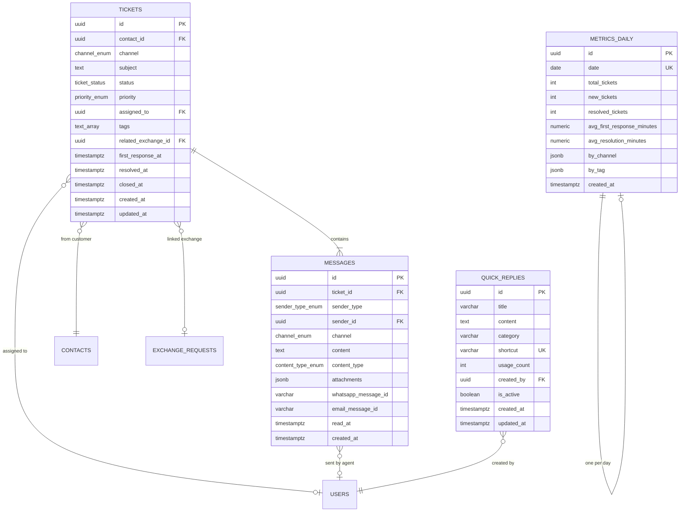

# Inbox de Atendimento — Module Spec

> **Module:** Inbox de Atendimento
> **Schema:** `inbox`
> **Route prefix:** `/api/v1/inbox`
> **Admin UI route group:** `(admin)/inbox/*`
> **Version:** 1.0
> **Date:** March 2026
> **Status:** Approved
> **Replaces:** None (new capability — previously manual WhatsApp Business conversations without CRM context or metrics)
> **References:** [DATABASE.md](../../architecture/DATABASE.md), [API.md](../../architecture/API.md), [AUTH.md](../../architecture/AUTH.md), [LGPD.md](../../platform/LGPD.md), [NOTIFICATIONS.md](../../platform/NOTIFICATIONS.md), [GLOSSARY.md](../../dev/GLOSSARY.md), [WhatsApp Engine spec](../communication/whatsapp.md), [CRM spec](../growth/crm.md), [Trocas spec](../operations/trocas.md), [Checkout spec](../commerce/checkout.md)

---

## 1. Purpose & Scope

The Inbox de Atendimento module is the **unified customer support workspace** of Ambaril. It consolidates WhatsApp and email conversations into a single threaded interface, pairing every conversation with real-time CRM context — customer profile, order history, LTV, active exchanges — so that Slimgust (support) can resolve issues without switching between tools. The module tracks response time, resolution rate, and conversation volume, feeding weekly reports to ClawdBot and surfacing SLA breaches to Discord #alertas via Flare.

**Core responsibilities:**

| Capability | Description |
|-----------|-------------|
| **Unified inbox** | Single threaded view for WhatsApp and email conversations. New inbound messages auto-create or append to existing tickets. Channel-agnostic workflow. |
| **Customer context panel** | Right-side panel showing CRM profile (name, CPF masked, segment, LTV, total orders), last 5 orders with status, and active exchanges from Trocas module — visible alongside every conversation. |
| **Ticket lifecycle** | Status FSM: `open` -> `in_progress` -> `waiting_customer` -> `resolved` -> `closed`. Auto-transitions on agent reply and customer message. Auto-close after 48h of inactivity on resolved tickets. |
| **Tags & categorization** | Free-form tags on tickets for categorization (e.g., `troca`, `rastreio`, `defeito`, `duvida-produto`). Tag-based analytics in metrics dashboard. |
| **Quick replies / templates** | Library of pre-written responses with keyboard shortcuts. Type `/` in the composer to autocomplete. Usage tracking per template. |
| **Exchange integration** | "Abrir troca" action directly from a conversation creates a `trocas.exchange_request` linked to the ticket via `related_exchange_id`. Exchange status visible in the context panel. |
| **SLA monitoring** | First response target: < 2 hours during business hours (08:00-18:00 BRT Mon-Fri). SLA breach triggers `ticket.overdue` Flare event to Discord #alertas. |
| **Support metrics** | Daily aggregated metrics: ticket volume, new/resolved counts, avg first response time, avg resolution time, breakdown by channel and tag. |

**Primary users:**

| User | Role | Usage Pattern |
|------|------|---------------|
| **Slimgust** | `support` | Primary operator. Receives and replies to customer conversations. Creates exchange requests. Uses quick replies for common questions. Desktop-first workflow. |
| **Marcus** | `admin` | Views support metrics dashboard. Monitors SLA compliance. |
| **Caio** | `pm` | Reviews weekly support report via ClawdBot. Reads metrics for product decisions. |

**Out of scope:** This module does NOT own message delivery. WhatsApp messages are sent/received via the WhatsApp Engine module; email messages are sent/received via Resend integration. Inbox is the **interface layer** — WhatsApp Engine and Resend are the **transport layers**. This module does NOT own the exchange workflow — it triggers exchange creation in the Trocas module and displays linked exchange status. This module does NOT own CRM data — it reads from `crm.contacts` for the context panel.

---

## 2. User Stories

### 2.1 Support Stories (Slimgust)

| # | As a... | I want to... | So that... | Acceptance Criteria |
|---|---------|-------------|-----------|-------------------|
| US-01 | Support (Slimgust) | See all open conversations in a single inbox list, regardless of channel | I do not need to switch between WhatsApp and email to manage support | Inbox list shows all tickets sorted by last message time (most recent first); badge shows unread count per ticket; channel icon (WhatsApp/email) displayed on each row; status filter defaults to open + in_progress |
| US-02 | Support (Slimgust) | Click a conversation and see the full message thread with the customer's CRM profile alongside | I have complete context to resolve the issue without looking up the customer elsewhere | Left panel: ticket list. Center panel: message thread with bubble layout (customer left, agent right, system center). Right panel: CRM card with name, CPF (masked: ***.456.789-**), segment, LTV, total_orders, last 5 orders (order number + status), active exchanges. |
| US-03 | Support (Slimgust) | Reply to a customer message via the same channel they used (WhatsApp or email) | The customer receives my response on their preferred channel without confusion | Message composer at the bottom of the thread. "Enviar" button dispatches via WhatsApp Engine (for WhatsApp tickets) or Resend (for email tickets). Sent message appears immediately in the thread as an agent bubble. |
| US-04 | Support (Slimgust) | Tag a conversation with one or more labels | I can categorize issues for reporting and quick filtering later | Tag input with autocomplete from existing tags + ability to create new tags inline. Tags appear as chips below the ticket subject. Tickets filterable by tag in the list. |
| US-05 | Support (Slimgust) | Use a quick reply shortcut by typing "/" in the composer | I can respond to common questions (tracking, sizing, return policy) in seconds | Typing "/" opens a dropdown overlay listing quick replies filtered by typed text. Selecting a quick reply inserts its content into the composer. Content is editable before sending. Quick reply `usage_count` incremented on send. |
| US-06 | Support (Slimgust) | Open an exchange request directly from a conversation | I can process returns/exchanges without leaving the Inbox context | "Abrir troca" button in the conversation toolbar. Opens a modal pre-filled with the customer's contact info and recent orders (pulled from CRM and Checkout). On submit, creates `trocas.exchange_request` with `inbox_ticket_id` linking back. Exchange status card appears in the right panel. |
| US-07 | Support (Slimgust) | Mark a conversation as resolved | I can clear it from my active queue and track resolution metrics | "Resolver" button sets `status = 'resolved'` and records `resolved_at`. Ticket moves to resolved filter. If customer sends a new message, ticket reopens automatically. |
| US-08 | Support (Slimgust) | Search across all conversations by customer name, order number, or message content | I can find a specific past conversation quickly when a customer follows up | Global search bar above the ticket list. Searches across `inbox.tickets` (subject, tags) and `inbox.messages` (content). Results ranked by relevance with highlighted matches. |
| US-09 | Support (Slimgust) | See which tickets are approaching or past SLA (first response > 2h) | I can prioritize overdue tickets and respond before the breach escalates | Tickets with no agent reply and `created_at + 2h < NOW()` (during business hours) show a red "SLA" badge. These sort to the top of the list. Yellow badge for tickets approaching SLA (within 30 min). |
| US-10 | Support (Slimgust) | Assign a ticket to myself or to another agent | Multiple support agents can coordinate without duplicating effort | Assign dropdown on ticket detail. Shows available agents (users with `support` or `admin` role). Assigned agent name displayed on ticket row in the list. Unassigned tickets show as "Nao atribuido". |

### 2.2 Admin / PM Stories

| # | As a... | I want to... | So that... | Acceptance Criteria |
|---|---------|-------------|-----------|-------------------|
| US-11 | Admin (Marcus) | View a support metrics dashboard with response time, resolution rate, and volume | I can monitor support quality and identify when we need additional staffing | Dashboard with metric cards: avg first response time (minutes), resolution rate (%), open ticket count, total tickets (period). Charts: volume over time (line), response time trend (line), topics breakdown (pie chart from tags). Date range selector. |
| US-12 | Admin (Marcus) | Receive a Discord alert when a ticket breaches SLA | I know immediately when support quality is dropping | Flare event `ticket.overdue` fires when first response exceeds 2h during business hours. Notification sent to Discord #alertas with ticket ID, customer name, and wait time. |
| US-13 | PM (Caio) | Read a weekly support report generated by ClawdBot | I have a data-driven summary of support volume, common issues, and trends without manually checking the dashboard | ClawdBot generates report every Friday at 17:00 BRT and posts to #report-suporte. Report includes: total tickets (week), resolved count, avg first response, top 5 tags with counts, SLA compliance %, comparison to previous week. |
| US-14 | Admin (Marcus) | Manage the quick replies library (add, edit, delete, categorize) | Support can use standardized, up-to-date response templates | Quick replies admin page with table: title, content preview (truncated), category, shortcut, usage_count, actions (edit/delete). "Nova resposta" button opens creation form. |

---

## 3. Data Model

### 3.1 Entity Relationship Diagram



### 3.2 Enums

```sql
CREATE TYPE inbox.ticket_channel AS ENUM (
    'whatsapp', 'email'
);

CREATE TYPE inbox.ticket_status AS ENUM (
    'open', 'in_progress', 'waiting_customer',
    'resolved', 'closed'
);

CREATE TYPE inbox.ticket_priority AS ENUM (
    'low', 'medium', 'high'
);

CREATE TYPE inbox.message_sender_type AS ENUM (
    'customer', 'agent', 'system'
);

CREATE TYPE inbox.message_content_type AS ENUM (
    'text', 'image', 'document', 'template'
);
```

### 3.3 Table Definitions

#### 3.3.1 inbox.tickets

| Column | Type | Constraints | Description |
|--------|------|-------------|-------------|
| id | UUID | PK, DEFAULT gen_random_uuid() | UUID v7 |
| contact_id | UUID | NOT NULL, FK crm.contacts(id) | Customer who initiated or is associated with this conversation |
| channel | inbox.ticket_channel | NOT NULL | Original inbound channel: `whatsapp` or `email` |
| subject | TEXT | NULL | Subject line for email tickets; NULL for WhatsApp (WhatsApp has no subject). Auto-generated summary for search if NULL: first 80 chars of first customer message. |
| status | inbox.ticket_status | NOT NULL DEFAULT 'open' | FSM status (see R3 for state machine) |
| priority | inbox.ticket_priority | NOT NULL DEFAULT 'medium' | Ticket urgency: `low`, `medium`, `high`. Set manually by agent. High-priority tickets sort above others. |
| assigned_to | UUID | NULL, FK global.users(id) | Agent currently responsible for this ticket. NULL = unassigned. |
| tags | TEXT[] | NOT NULL DEFAULT '{}' | Free-form categorization tags (e.g., `{'troca', 'defeito'}`). Used for filtering and metrics breakdown. |
| related_exchange_id | UUID | NULL, FK trocas.exchange_requests(id) | Link to an exchange request created from this conversation via "Abrir troca" action. NULL if no exchange linked. |
| first_response_at | TIMESTAMPTZ | NULL | Timestamp of the first agent reply message in this ticket. NULL if no agent has replied yet. Used for SLA calculation: `first_response_at - created_at`. |
| resolved_at | TIMESTAMPTZ | NULL | Timestamp when the agent marked this ticket as resolved. NULL if not yet resolved. Reset to NULL if ticket is reopened. |
| closed_at | TIMESTAMPTZ | NULL | Timestamp when the ticket was closed (auto-close after 48h or manual). NULL if not closed. |
| created_at | TIMESTAMPTZ | NOT NULL DEFAULT NOW() | Ticket creation time (= first inbound message received) |
| updated_at | TIMESTAMPTZ | NOT NULL DEFAULT NOW() | Last modification (status change, new message, tag update) |

**Indexes:**

```sql
CREATE INDEX idx_tickets_contact ON inbox.tickets (contact_id);
CREATE INDEX idx_tickets_status ON inbox.tickets (status);
CREATE INDEX idx_tickets_assigned ON inbox.tickets (assigned_to) WHERE assigned_to IS NOT NULL;
CREATE INDEX idx_tickets_channel ON inbox.tickets (channel);
CREATE INDEX idx_tickets_priority ON inbox.tickets (priority);
CREATE INDEX idx_tickets_tags ON inbox.tickets USING GIN (tags);
CREATE INDEX idx_tickets_exchange ON inbox.tickets (related_exchange_id) WHERE related_exchange_id IS NOT NULL;
CREATE INDEX idx_tickets_created ON inbox.tickets (created_at DESC);
CREATE INDEX idx_tickets_updated ON inbox.tickets (updated_at DESC);
CREATE INDEX idx_tickets_active ON inbox.tickets (status, updated_at DESC) WHERE status IN ('open', 'in_progress', 'waiting_customer');
CREATE INDEX idx_tickets_sla ON inbox.tickets (created_at) WHERE status = 'open' AND first_response_at IS NULL;
```

#### 3.3.2 inbox.messages

| Column | Type | Constraints | Description |
|--------|------|-------------|-------------|
| id | UUID | PK, DEFAULT gen_random_uuid() | UUID v7 |
| ticket_id | UUID | NOT NULL, FK inbox.tickets(id) ON DELETE CASCADE | Parent ticket |
| sender_type | inbox.message_sender_type | NOT NULL | Who sent: `customer` (inbound), `agent` (Slimgust reply), `system` (automated notification, e.g., "Troca #TR-123 criada") |
| sender_id | UUID | NULL, FK global.users(id) | User ID of the agent who sent (NULL for customer and system messages) |
| channel | inbox.ticket_channel | NOT NULL | Channel this specific message was sent/received on. Usually matches ticket channel, but could differ in future multi-channel threads. |
| content | TEXT | NOT NULL | Message body. Plain text for WhatsApp. HTML stripped to text for email (original HTML stored in attachments JSONB if needed). Max 4096 chars for WhatsApp (Meta API limit). |
| content_type | inbox.message_content_type | NOT NULL DEFAULT 'text' | Content format: `text` (plain message), `image` (photo attachment), `document` (PDF/file attachment), `template` (WhatsApp template message). |
| attachments | JSONB | NULL | Attachment metadata: `[{ "type": "image", "url": "https://...", "filename": "foto.jpg", "mime_type": "image/jpeg", "size_bytes": 245000 }]`. Files stored in R2 via upload service. NULL if no attachments. |
| whatsapp_message_id | VARCHAR(100) | NULL | Meta WhatsApp Cloud API message ID (e.g., `wamid.HBgN...`). Used for delivery status tracking and deduplication. NULL for email messages. |
| email_message_id | VARCHAR(255) | NULL | Email Message-ID header (e.g., `<abc123@resend.dev>`). Used for threading and deduplication. NULL for WhatsApp messages. |
| read_at | TIMESTAMPTZ | NULL | When the agent read this message (for unread badge calculation). NULL = unread. Only relevant for customer messages. |
| created_at | TIMESTAMPTZ | NOT NULL DEFAULT NOW() | Message timestamp (inbound: when received by webhook; outbound: when sent) |

**Attachments JSONB structure:**

```json
[
  {
    "type": "image",
    "url": "https://r2.ciena.com.br/inbox/attachments/01961a2b-3c4d.jpg",
    "filename": "foto-defeito.jpg",
    "mime_type": "image/jpeg",
    "size_bytes": 245000
  }
]
```

**Indexes:**

```sql
CREATE INDEX idx_messages_ticket ON inbox.messages (ticket_id, created_at ASC);
CREATE INDEX idx_messages_sender_type ON inbox.messages (sender_type);
CREATE INDEX idx_messages_whatsapp_id ON inbox.messages (whatsapp_message_id) WHERE whatsapp_message_id IS NOT NULL;
CREATE INDEX idx_messages_email_id ON inbox.messages (email_message_id) WHERE email_message_id IS NOT NULL;
CREATE INDEX idx_messages_unread ON inbox.messages (ticket_id) WHERE sender_type = 'customer' AND read_at IS NULL;
CREATE INDEX idx_messages_content_search ON inbox.messages USING GIN (to_tsvector('portuguese', content));
```

#### 3.3.3 inbox.quick_replies

| Column | Type | Constraints | Description |
|--------|------|-------------|-------------|
| id | UUID | PK, DEFAULT gen_random_uuid() | UUID v7 |
| title | VARCHAR(100) | NOT NULL | Display name for the quick reply (e.g., "Rastreio - Informar codigo") |
| content | TEXT | NOT NULL | Template content with optional `{{nome}}` and `{{pedido}}` placeholders that are filled from context on insert. Max 4096 chars. |
| category | VARCHAR(50) | NOT NULL | Grouping category: `rastreio`, `troca`, `produto`, `pagamento`, `geral`. Used for dropdown grouping in the autocomplete. |
| shortcut | VARCHAR(30) | UNIQUE, NULL | Keyboard shortcut suffix after `/` (e.g., `rastreio` -> type `/rastreio`). NULL if no shortcut assigned. Lowercase alphanumeric + hyphens only. |
| usage_count | INTEGER | NOT NULL DEFAULT 0 | Number of times this quick reply has been used. Incremented on each send. Used for sorting (most-used first in autocomplete). |
| created_by | UUID | NOT NULL, FK global.users(id) | User who created this quick reply |
| is_active | BOOLEAN | NOT NULL DEFAULT TRUE | Soft delete. Inactive quick replies do not appear in autocomplete. |
| created_at | TIMESTAMPTZ | NOT NULL DEFAULT NOW() | |
| updated_at | TIMESTAMPTZ | NOT NULL DEFAULT NOW() | |

**Indexes:**

```sql
CREATE UNIQUE INDEX idx_quick_replies_shortcut ON inbox.quick_replies (shortcut) WHERE shortcut IS NOT NULL;
CREATE INDEX idx_quick_replies_category ON inbox.quick_replies (category);
CREATE INDEX idx_quick_replies_active ON inbox.quick_replies (is_active, usage_count DESC) WHERE is_active = TRUE;
```

#### 3.3.4 inbox.metrics_daily

| Column | Type | Constraints | Description |
|--------|------|-------------|-------------|
| id | UUID | PK, DEFAULT gen_random_uuid() | UUID v7 |
| date | DATE | NOT NULL, UNIQUE | Calendar date (BRT timezone). One row per day. |
| total_tickets | INTEGER | NOT NULL DEFAULT 0 | Total tickets that existed in non-closed status during this day |
| new_tickets | INTEGER | NOT NULL DEFAULT 0 | Tickets created on this day |
| resolved_tickets | INTEGER | NOT NULL DEFAULT 0 | Tickets resolved on this day |
| avg_first_response_minutes | NUMERIC(10,2) | NULL | Average `first_response_at - created_at` in minutes for tickets that received their first reply on this day. NULL if no first replies on this day. |
| avg_resolution_minutes | NUMERIC(10,2) | NULL | Average `resolved_at - created_at` in minutes for tickets resolved on this day. NULL if no resolutions. |
| by_channel | JSONB | NOT NULL DEFAULT '{}' | Breakdown by channel: `{ "whatsapp": { "new": 15, "resolved": 12 }, "email": { "new": 3, "resolved": 2 } }` |
| by_tag | JSONB | NOT NULL DEFAULT '{}' | Breakdown by tag: `{ "troca": 8, "rastreio": 5, "defeito": 3, "duvida-produto": 2 }` (count of tickets with each tag that were active on this day) |
| created_at | TIMESTAMPTZ | NOT NULL DEFAULT NOW() | When this metrics row was generated (by background job) |

**by_channel JSONB structure:**

```json
{
  "whatsapp": { "new": 15, "resolved": 12, "avg_first_response_minutes": 42.5 },
  "email": { "new": 3, "resolved": 2, "avg_first_response_minutes": 95.0 }
}
```

**by_tag JSONB structure:**

```json
{
  "troca": 8,
  "rastreio": 5,
  "defeito": 3,
  "duvida-produto": 2,
  "pagamento": 1
}
```

**Indexes:**

```sql
CREATE UNIQUE INDEX idx_metrics_daily_date ON inbox.metrics_daily (date);
CREATE INDEX idx_metrics_daily_range ON inbox.metrics_daily (date DESC);
```

---

## 4. Screens & Wireframes

All screens follow the Ambaril Design System (DS.md): light mode default (dark opt-in), DM Sans, shadcn/ui components, Lucide React. Inbox screens use blue accent for agent messages, neutral for customer messages, and red for SLA breach indicators.

### 4.1 Conversation List (Left Panel)

```
+-----------------------------------------------------------------------+
|  Ambaril Admin > Inbox de Atendimento                     [Buscar...]    |
+-----------------------------------------------------------------------+
|                                                                       |
|  Filtros: [Status v] [Canal v] [Tags v] [Atribuido v]               |
|                                                                       |
|  Metricas rapidas:                                                    |
|  [  Abertos: 8  ] [  Nao atribuidos: 3  ] [  SLA em risco: 2  ]    |
|                                                                       |
|  +------------------------------------------------------------------+|
|  | (!) SLA  [WA]  Maria Santos                          15 min  (2) ||
|  |         "Oi, meu pedido nao chegou ainda e ja faz..."             ||
|  |         [rastreio] [urgente]                        ~ Aberto      ||
|  +------------------------------------------------------------------+|
|  | [WA]  Pedro Oliveira                                 42 min  (1) ||
|  |       "Quero trocar minha camiseta de M para G"                   ||
|  |       [troca]                                ~ Em andamento       ||
|  |       Atribuido: Slimgust                                         ||
|  +------------------------------------------------------------------+|
|  | [EM]  Ana Costa                                       2h    (3) ||
|  |       "Problema com o pagamento do meu pedido"                    ||
|  |       [pagamento]                        ~ Aguardando cliente     ||
|  |       Atribuido: Slimgust                                         ||
|  +------------------------------------------------------------------+|
|  | [WA]  Lucas Silva                                     5h    (0) ||
|  |       "Obrigado, resolvido!"                                      ||
|  |       [geral]                                    ~ Resolvido      ||
|  |       Atribuido: Slimgust                                         ||
|  +------------------------------------------------------------------+|
|  | [WA]  Fernanda Lima                                  1d     (0) ||
|  |       "Recebi sim, tudo certo"                                    ||
|  |       [rastreio]                                  ~ Fechado       ||
|  +------------------------------------------------------------------+|
|                                                                       |
|  Status badges:                                                       |
|  [Aberto] = yellow  [Em andamento] = blue                            |
|  [Aguardando cliente] = orange  [Resolvido] = green                  |
|  [Fechado] = gray                                                     |
|                                                                       |
|  (!) = SLA breach/at risk (red badge)                                |
|  (2) = unread message count                                           |
|  [WA] = WhatsApp  [EM] = Email                                       |
|                                                                       |
|  Mostrando 1-25 de 42              [< Anterior] [Proximo >]          |
+-----------------------------------------------------------------------+
```

### 4.2 Conversation Detail (Three-Panel Layout)

```
+---------------------------+----------------------------+------------------------+
| CONVERSATION LIST (left)  | MESSAGE THREAD (center)    | CUSTOMER CONTEXT (right)|
+---------------------------+----------------------------+------------------------+
|                           |                            |                        |
| [active ticket            | Ticket #INB-4521           | PERFIL DO CLIENTE      |
|  highlighted]             | [WA] Maria Santos          |                        |
|                           | Tags: [rastreio] [+]       | Maria Santos           |
| [other tickets            | Atribuido: [Slimgust v]    | CPF: ***.456.789-**    |
|  below...]               | Prioridade: [Media v]      | Tel: (11) 99999-8888   |
|                           | Status: Em andamento       | Email: maria@email.com |
|                           |                            | Segmento: Champions    |
|                           | +-----------------------+  | LTV: R$ 2.847,00      |
|                           | | 17/03 10:15           |  | Total pedidos: 8       |
|                           | |                       |  |                        |
|                           | | [Maria]               |  | ---------------------- |
|                           | | Oi, meu pedido nao    |  |                        |
|                           | | chegou ainda e ja faz |  | ULTIMOS PEDIDOS        |
|                           | | 10 dias. Numero do    |  |                        |
|                           | | pedido: CIENA-0042.   |  | CIENA-0042  Enviado    |
|                           | | Podem verificar?      |  | 07/03  R$ 289,90       |
|                           | +-----------------------+  |                        |
|                           |                            | CIENA-0038  Entregue   |
|                           |   +-----------------------+| 22/02  R$ 149,90       |
|                           |   | 17/03 10:30           ||                        |
|                           |   |                       || CIENA-0031  Entregue   |
|                           |   |            [Slimgust] || 05/02  R$ 449,70       |
|                           |   | Oi Maria! Vou         ||                        |
|                           |   | verificar o rastreio  || CIENA-0025  Entregue   |
|                           |   | do seu pedido agora.  || 18/01  R$ 199,90       |
|                           |   | Um momento por favor! ||                        |
|                           |   +-----------------------+| CIENA-0019  Entregue   |
|                           |                            | 02/01  R$ 349,80       |
|                           | +-----------------------+  |                        |
|                           | | 17/03 10:32           |  | ---------------------- |
|                           | |                       |  |                        |
|                           | | [Sistema]             |  | TROCAS ATIVAS          |
|                           | | Rastreio consultado:  |  |                        |
|                           | | ME123456789 - Em      |  | (nenhuma troca ativa)  |
|                           | | transito, previsao    |  |                        |
|                           | | 19/03                 |  | [Abrir troca]          |
|                           | +-----------------------+  |                        |
|                           |                            |                        |
|                           |   +-----------------------+|                        |
|                           |   | 17/03 10:33           ||                        |
|                           |   |                       ||                        |
|                           |   |            [Slimgust] ||                        |
|                           |   | Maria, seu pedido ta  ||                        |
|                           |   | em transito! Rastreio ||                        |
|                           |   | ME123456789. Previsao ||                        |
|                           |   | de entrega: 19/03.    ||                        |
|                           |   +-----------------------+|                        |
|                           |                            |                        |
|                           +----------------------------+                        |
|                           | [/] Mensagem...   [Enviar] |                        |
|                           |                            |                        |
|                           | [Abrir troca] [Resolver]   |                        |
+---------------------------+----------------------------+------------------------+
```

### 4.3 Quick Replies Library

```
+-----------------------------------------------------------------------+
|  Ambaril Admin > Inbox > Respostas Rapidas            [+ Nova Resposta]  |
+-----------------------------------------------------------------------+
|                                                                       |
|  Filtros: [Categoria v] [Buscar por titulo...]                       |
|                                                                       |
|  +----+-----------------------+---------------------+-------+------+ |
|  | #  | Titulo                | Conteudo (preview)  | Atalho| Usos | |
|  +----+-----------------------+---------------------+-------+------+ |
|  |    | Rastreio - Informar   | "Oi {{nome}}! Seu   | /rast | 142  | |
|  |    | codigo                | pedido {{pedido}}    | reio  |      | |
|  |    |                       | esta em transito..." |       |[E][X]| |
|  +----+-----------------------+---------------------+-------+------+ |
|  |    | Troca - Iniciar       | "Entendi {{nome}},   | /troc | 87   | |
|  |    | processo              | vamos iniciar o      | a     |      | |
|  |    |                       | processo de troca..." |       |[E][X]| |
|  +----+-----------------------+---------------------+-------+------+ |
|  |    | Prazo entrega -       | "Oi {{nome}}! O      | /praz | 63   | |
|  |    | Padrao                | prazo de entrega e   | o     |      | |
|  |    |                       | de 7 a 15 dias..."   |       |[E][X]| |
|  +----+-----------------------+---------------------+-------+------+ |
|  |    | Defeito - Solicitar   | "Lamento pelo        | /defe | 34   | |
|  |    | foto                  | transtorno {{nome}}. | ito   |      | |
|  |    |                       | Pode enviar uma..."  |       |[E][X]| |
|  +----+-----------------------+---------------------+-------+------+ |
|  |    | Pagamento - PIX       | "{{nome}}, seu       | /pix  | 28   | |
|  |    | pendente              | pagamento via PIX    |       |      | |
|  |    |                       | expira em 30 min..." |       |[E][X]| |
|  +----+-----------------------+---------------------+-------+------+ |
|  |    | Encerramento -        | "Que bom que         | /ok   | 156  | |
|  |    | Resolvido             | resolvemos {{nome}}! |       |      | |
|  |    |                       | Qualquer duvida..."  |       |[E][X]| |
|  +----+-----------------------+---------------------+-------+------+ |
|                                                                       |
|  Categorias: rastreio (3) | troca (4) | produto (2) | pagamento (3)  |
|              geral (5)                                                |
|                                                                       |
|  [E] = Editar  [X] = Desativar                                       |
|                                                                       |
|  Mostrando 1-17 de 17                                                 |
+-----------------------------------------------------------------------+
```

### 4.4 Metrics Dashboard

```
+-----------------------------------------------------------------------+
|  Ambaril Admin > Inbox > Metricas de Suporte     Periodo: [Mar 2026 v]  |
+-----------------------------------------------------------------------+
|                                                                       |
|  +---------------+  +---------------+  +---------------+              |
|  | Tempo medio   |  | Taxa de       |  | Tickets       |              |
|  | 1a resposta   |  | resolucao     |  | abertos       |              |
|  |               |  |               |  |               |              |
|  |    38 min     |  |    94.2%      |  |      8        |              |
|  |   (-12% sem)  |  |  (+2.1% sem)  |  |   (-3 sem)    |              |
|  | Meta: < 120m  |  |               |  |               |              |
|  | [=====-] OK   |  |               |  |               |              |
|  +---------------+  +---------------+  +---------------+              |
|                                                                       |
|  +---------------+  +---------------+  +---------------+              |
|  | Total tickets |  | SLA compliance|  | Tempo medio   |              |
|  | (mes)         |  |               |  | resolucao     |              |
|  |               |  |               |  |               |              |
|  |     187       |  |    91.5%      |  |    4.2 hrs    |              |
|  |  (+15% mes)   |  |  Meta: >90%   |  |  (-0.8h mes)  |              |
|  |               |  |  [======] OK  |  |               |              |
|  +---------------+  +---------------+  +---------------+              |
|                                                                       |
|  +---------------------------------------+  +-----------------------+ |
|  | VOLUME DE TICKETS                      |  | TOPICOS (por tag)     | |
|  |                                        |  |                       | |
|  | 25|       *                             |  |   rastreio ████ 32%  | |
|  | 20|    *     *     *                    |  |   troca    ███  24%  | |
|  | 15| *           *     *                 |  |   defeito  ██   15%  | |
|  | 10|                      *   *          |  |   produto  ██   12%  | |
|  |  5|                            *        |  |   pgto     █     9%  | |
|  |  0+--+--+--+--+--+--+--+--+--+--       |  |   geral    █     8%  | |
|  |   S  T  Q  Q  S  S  D  S  T  Q         |  |                       | |
|  +---------------------------------------+  +-----------------------+ |
|                                                                       |
|  +---------------------------------------+                            |
|  | TENDENCIA TEMPO RESPOSTA (semanas)     |                            |
|  |                                        |                            |
|  | 90m|  *                                 |                            |
|  | 75m|     *                              |                            |
|  | 60m|        *                           |                            |
|  | 45m|              *     *               |                            |
|  | 30m|                       *   *        |                            |
|  |    +--+--+--+--+--+--+--+--+           |                            |
|  |    S1 S2 S3 S4 S5 S6 S7 S8            |                            |
|  |                             Meta: 120m |                            |
|  +---------------------------------------+                            |
|                                                                       |
|  +-------------------------------------------------------------------+|
|  | POR CANAL                                                          ||
|  | WhatsApp: 162 tickets (86.6%) | Avg 1a resp: 32 min               ||
|  | Email:     25 tickets (13.4%) | Avg 1a resp: 78 min               ||
|  +-------------------------------------------------------------------+|
+-----------------------------------------------------------------------+
```

### 4.5 Create Exchange from Ticket (Modal)

```
+-----------------------------------------------------------------------+
|                                                                       |
|  +---------------------------------------------------------------+    |
|  |  ABRIR TROCA A PARTIR DO TICKET #INB-4521               [X]  |    |
|  +---------------------------------------------------------------+    |
|  |                                                               |    |
|  |  Cliente: Maria Santos (CPF: ***.456.789-**)                  |    |
|  |  Ticket: #INB-4521 (WhatsApp)                                 |    |
|  |                                                               |    |
|  |  -  -  -  -  -  -  -  -  -  -  -  -  -  -  -  -  -  -  -    |    |
|  |                                                               |    |
|  |  PEDIDO ORIGINAL *                                            |    |
|  |  [CIENA-0042 - 07/03/2026 - R$ 289,90 - Enviado        v]    |    |
|  |  [CIENA-0038 - 22/02/2026 - R$ 149,90 - Entregue        ]    |    |
|  |  [CIENA-0031 - 05/02/2026 - R$ 449,70 - Entregue        ]    |    |
|  |                                                               |    |
|  |  ITENS DO PEDIDO CIENA-0038                                   |    |
|  |  [x] Camiseta Preta Basic - M - Preto  (R$ 149,90)           |    |
|  |      Qtd: [1_]                                                |    |
|  |                                                               |    |
|  |  TIPO DE RESOLUCAO *                                          |    |
|  |  (o) Troca de tamanho    ( ) Troca de cor                     |    |
|  |  ( ) Vale-troca          ( ) Devolucao (reembolso)            |    |
|  |                                                               |    |
|  |  Novo tamanho: [G v]     Estoque: 12 unidades                 |    |
|  |                                                               |    |
|  |  MOTIVO *                                                     |    |
|  |  Categoria: [Tamanho errado v]                                |    |
|  |  Detalhes: [Pedi M mas ficou apertado, preciso G____]         |    |
|  |                                                               |    |
|  |  Vinculado ao ticket: #INB-4521 (automatico)                  |    |
|  |                                                               |    |
|  |  [Cancelar]                            [Criar solicitacao]    |    |
|  +---------------------------------------------------------------+    |
|                                                                       |
+-----------------------------------------------------------------------+
```

---

## 5. API Endpoints

All endpoints follow the patterns defined in [API.md](../../architecture/API.md). Dates in ISO 8601. Text content is plain UTF-8.

### 5.1 Admin Endpoints (Auth Required)

Route prefix: `/api/v1/inbox`

#### 5.1.1 Tickets

| Method | Path | Auth | Description | Request Body / Query | Response |
|--------|------|------|-------------|---------------------|----------|
| GET | `/tickets` | Internal | List tickets (paginated, filterable) | `?cursor=&limit=25&status=open,in_progress,waiting_customer&channel=&assigned_to=&tags=&priority=&search=&dateFrom=&dateTo=` | `{ data: Ticket[], meta: Pagination }` |
| GET | `/tickets/:id` | Internal | Get ticket detail with messages and context | `?include=messages,contact,exchange` | `{ data: Ticket }` |
| POST | `/tickets` | Internal | Create ticket manually (rare — usually auto-created by inbound message) | `{ contact_id, channel, subject?, priority?, tags? }` | `201 { data: Ticket }` |
| PATCH | `/tickets/:id` | Internal | Update ticket fields | `{ priority?, tags?, subject?, notes? }` | `{ data: Ticket }` |
| POST | `/tickets/:id/actions/assign` | Internal | Assign ticket to an agent | `{ assigned_to }` | `{ data: Ticket }` |
| POST | `/tickets/:id/actions/resolve` | Internal | Mark ticket as resolved | `{ notes? }` | `{ data: Ticket }` (status -> resolved, resolved_at set) |
| POST | `/tickets/:id/actions/close` | Internal | Manually close a ticket | `{ notes? }` | `{ data: Ticket }` (status -> closed, closed_at set) |
| POST | `/tickets/:id/actions/reopen` | Internal | Reopen a resolved/closed ticket | `{ notes? }` | `{ data: Ticket }` (status -> open, resolved_at/closed_at cleared) |
| GET | `/tickets/search` | Internal | Full-text search across tickets and messages | `?q=&cursor=&limit=25` | `{ data: SearchResult[], meta: Pagination }` |

#### 5.1.2 Messages

| Method | Path | Auth | Description | Request Body / Query | Response |
|--------|------|------|-------------|---------------------|----------|
| GET | `/tickets/:id/messages` | Internal | List messages for a ticket (chronological) | `?cursor=&limit=50` | `{ data: Message[], meta: Pagination }` |
| POST | `/tickets/:id/messages` | Internal | Send a reply to the customer | `{ content, content_type?, attachments? }` | `201 { data: Message }` (dispatched via WhatsApp Engine or Resend) |
| PATCH | `/tickets/:id/messages/:message_id/read` | Internal | Mark a message as read | — | `{ data: Message }` (read_at set) |
| POST | `/tickets/:id/messages/read-all` | Internal | Mark all unread messages in a ticket as read | — | `{ data: { marked: number } }` |

#### 5.1.3 Quick Replies

| Method | Path | Auth | Description | Request Body / Query | Response |
|--------|------|------|-------------|---------------------|----------|
| GET | `/quick-replies` | Internal | List all active quick replies | `?category=&search=&sort=usage_count` | `{ data: QuickReply[] }` |
| GET | `/quick-replies/:id` | Internal | Get quick reply detail | — | `{ data: QuickReply }` |
| POST | `/quick-replies` | Internal | Create a new quick reply | `{ title, content, category, shortcut? }` | `201 { data: QuickReply }` |
| PATCH | `/quick-replies/:id` | Internal | Update a quick reply | `{ title?, content?, category?, shortcut?, is_active? }` | `{ data: QuickReply }` |
| DELETE | `/quick-replies/:id` | Internal | Soft-delete (set is_active = false) | — | `204` |
| POST | `/quick-replies/:id/actions/use` | Internal | Increment usage counter (called on quick reply send) | — | `{ data: QuickReply }` |

#### 5.1.4 Metrics

| Method | Path | Auth | Description | Request Body / Query | Response |
|--------|------|------|-------------|---------------------|----------|
| GET | `/metrics` | Internal | Get metrics for a date range | `?dateFrom=&dateTo=` | `{ data: MetricsDaily[] }` |
| GET | `/metrics/summary` | Internal | Get aggregated metrics summary for a period | `?dateFrom=&dateTo=` | `{ data: { total_tickets, new_tickets, resolved_tickets, avg_first_response_minutes, avg_resolution_minutes, sla_compliance_pct, by_channel, top_tags } }` |

### 5.2 Internal Endpoints (Module-to-Module)

Route prefix: `/api/v1/inbox/internal`

| Method | Path | Auth | Description | Request Body / Query | Response |
|--------|------|------|-------------|---------------------|----------|
| POST | `/inbound/whatsapp` | Service | Receive inbound WhatsApp message (called by WhatsApp Engine on webhook) | `{ contact_id, phone, content, content_type, attachments?, whatsapp_message_id }` | `201 { data: { ticket_id, message_id, is_new_ticket } }` |
| POST | `/inbound/email` | Service | Receive inbound email (called by Resend webhook handler) | `{ contact_id, email, subject, content, content_type, attachments?, email_message_id }` | `201 { data: { ticket_id, message_id, is_new_ticket } }` |
| GET | `/tickets/by-contact/:contact_id` | Service | Get recent tickets for a contact (used by CRM context panel) | `?limit=5` | `{ data: Ticket[] }` |
| GET | `/tickets/by-exchange/:exchange_id` | Service | Get ticket linked to an exchange (used by Trocas module) | — | `{ data: Ticket }` |

---

## 6. Business Rules

### 6.1 Ticket Creation & Routing Rules

| # | Rule | Detail |
|---|------|--------|
| R1 | **WhatsApp inbound -> auto-create or append** | When the WhatsApp Engine forwards an inbound message via `/internal/inbound/whatsapp`: (1) look up `crm.contacts` by phone number, (2) check for an existing open/in_progress/waiting_customer ticket for this `contact_id`, (3) if found: append message to existing ticket and update `ticket.updated_at`, (4) if NOT found: create a new ticket with `status = 'open'`, `channel = 'whatsapp'`, `subject = NULL` (auto-generated from first message). The system NEVER creates duplicate tickets for the same contact if one is already active. |
| R2 | **Email inbound -> same logic, match by email** | When Resend forwards an inbound email via `/internal/inbound/email`: (1) look up `crm.contacts` by email address, (2) check for existing active ticket, (3) append or create new. Email tickets have `subject` set from the email subject line. If contact not found by email, create a new `crm.contacts` entry with the email (minimal profile — enriched on next interaction). |
| R3 | **Contact auto-creation on unknown sender** | If an inbound WhatsApp message arrives from a phone number not in `crm.contacts`, a new contact is created with `{ phone, name: 'Desconhecido', acquisition_source: 'inbox_whatsapp' }`. The agent can update the name and details during the conversation. Same logic for unknown email addresses. |

### 6.2 Status Machine Rules

| # | Rule | Detail |
|---|------|--------|
| R4 | **Ticket status FSM** | Valid transitions: `open` -> `in_progress` (auto, on first agent reply); `in_progress` -> `waiting_customer` (auto, after each agent reply); `waiting_customer` -> `open` (auto, when customer sends new message); `open`/`in_progress`/`waiting_customer` -> `resolved` (manual, agent clicks "Resolver"); `resolved` -> `open` (auto, when customer sends new message — R5 reopen rule); `resolved` -> `closed` (auto after 48h — R6 auto-close, or manual). `closed` -> `open` (manual reopen only). No other transitions allowed. Invalid transitions return 409 Conflict. |
| R5 | **Auto-reopen on customer message** | If a customer sends a new message on a ticket with `status = 'resolved'`, the ticket automatically transitions back to `status = 'open'`, `resolved_at` is cleared, and the ticket reappears in the active queue. This ensures no customer message is lost after resolution. Does NOT apply to `status = 'closed'` tickets — those create a new ticket instead. |
| R6 | **Auto-close after 48h** | Resolved tickets with no new messages for 48 hours are automatically transitioned to `status = 'closed'` with `closed_at = NOW()`. Background job runs hourly. Once closed, a new inbound message from the same contact creates a fresh ticket (R1/R2 logic — no active ticket found). |

### 6.3 Response & SLA Rules

| # | Rule | Detail |
|---|------|--------|
| R7 | **First response time tracking** | When an agent sends the first reply to a ticket (first message with `sender_type = 'agent'`), the system sets `ticket.first_response_at = NOW()`. First response time (FRT) = `first_response_at - created_at`. This is the primary SLA metric. Only counts agent messages, not system messages. |
| R8 | **Auto-status on first reply** | When an agent sends the first reply, the ticket automatically transitions from `open` to `in_progress`. Subsequent agent replies transition the ticket to `waiting_customer`. No manual status change needed — the FSM is driven by message activity. |
| R9 | **SLA target: first response < 2 hours** | During business hours (08:00-18:00 BRT, Monday-Friday), tickets must receive their first agent reply within 2 hours of creation. SLA calculation pauses outside business hours: a ticket created at 17:30 Friday has until 09:30 Monday (2h of business time remaining). Holidays are NOT currently tracked (Open Question). |
| R10 | **SLA breach notification** | When a ticket exceeds the 2-hour SLA (business-hours-adjusted), the system emits a Flare event `ticket.overdue` with `{ ticket_id, contact_name, wait_minutes, channel }`. Notification sent to Discord #alertas channel. In the Inbox UI, overdue tickets display a red "SLA" badge and sort to the top of the list. |

### 6.4 Quick Reply Rules

| # | Rule | Detail |
|---|------|--------|
| R11 | **Quick reply autocomplete** | When the agent types `/` in the message composer, a dropdown overlay appears listing all active quick replies. The list is filtered as the agent types after `/` (e.g., `/rast` shows replies with shortcut starting with `rast`). If no shortcut matches, fallback to title/content search. Selecting a reply inserts its content into the composer. Content is editable before sending. |
| R12 | **Quick reply placeholder substitution** | Quick reply content supports `{{nome}}` and `{{pedido}}` placeholders. On insertion, the system auto-fills: `{{nome}}` = contact first name from CRM, `{{pedido}}` = most recent order number from the ticket context. If no order is linked, `{{pedido}}` is left as-is for manual fill. |
| R12b | **Tone of voice: humanized communication** | All quick reply templates must follow CIENA's humanized communication guidelines. Write as a person, not a brand — use first person, casual but respectful tone, avoid corporate/robotic language. Quick replies are starting points, not scripts — Slimgust should personalize based on conversation context. Examples: use "Oi, Maria!" instead of "Prezada cliente", use "vou resolver isso pra voce" instead of "iremos providenciar a resolucao". Every template should sound like a friend helping, not a company processing a ticket. Ref: Pandora96 principle — "comunique como pessoa, nao como marca". |

### 6.5 Customer Context Rules

| # | Rule | Detail |
|---|------|--------|
| R13 | **Context panel data sources** | The right-side customer context panel aggregates data from multiple schemas: (1) `crm.contacts` for name, CPF (masked), phone, email, segment, LTV, total_orders, is_vip, tags, (2) `checkout.orders` for last 5 orders (order_number, status, total, created_at), (3) `trocas.exchange_requests` for active exchanges (exchange ID, type, status). All data is fetched via internal APIs on ticket selection, not duplicated in the inbox schema. |
| R14 | **CPF masking in UI** | CPF is displayed with partial masking in the context panel: `***.456.789-**` (first 3 and last 2 digits hidden). Full CPF is never displayed in the Inbox UI. This follows LGPD minimization principle — support does not need the full CPF to assist the customer. |

### 6.6 Exchange Integration Rules

| # | Rule | Detail |
|---|------|--------|
| R15 | **"Abrir troca" creates linked exchange** | The "Abrir troca" button in the conversation toolbar calls `POST /api/v1/trocas/exchanges` with `{ ...exchange_data, inbox_ticket_id: ticket.id }`. On success, the ticket is updated with `related_exchange_id = exchange.id`. The exchange request appears in the right-side context panel with a status badge. Only one exchange can be linked per ticket. |
| R16 | **Exchange status in context panel** | When a ticket has a `related_exchange_id`, the context panel shows the exchange status timeline (from Trocas module). Status updates are reflected in real-time (polled every 30 seconds or pushed via event). The agent can click the exchange to navigate to the full Trocas detail view. |

### 6.7 Metrics & Reporting Rules

| # | Rule | Detail |
|---|------|--------|
| R17 | **Daily metrics aggregation** | A background job runs at 00:05 BRT daily and generates one `inbox.metrics_daily` row for the previous calendar day. It aggregates: total active tickets, new tickets, resolved tickets, avg first response time, avg resolution time, breakdown by channel, breakdown by tag. If the job fails, it retries 3 times with exponential backoff. Idempotent: re-running for the same date overwrites the existing row (`ON CONFLICT (date) DO UPDATE`). |
| R18 | **ClawdBot weekly report** | Every Friday at 17:00 BRT, ClawdBot queries `/api/v1/inbox/metrics/summary?dateFrom={monday}&dateTo={friday}` and posts a formatted report to Discord #report-suporte. Report includes: total tickets, resolved count, avg first response, top 5 tags, SLA compliance %, week-over-week comparison. |

---

## 7. Integrations

### 7.1 WhatsApp Engine (Bidirectional Message Sync)

| Property | Value |
|----------|-------|
| **Purpose** | Send and receive WhatsApp messages. Inbox is the UI; WhatsApp Engine is the transport. |
| **Integration pattern** | Internal API calls. Inbox -> WhatsApp Engine for outbound; WhatsApp Engine -> Inbox for inbound. |
| **Inbound flow** | WhatsApp Engine receives Meta webhook -> resolves contact -> calls Inbox `/internal/inbound/whatsapp` -> Inbox creates/appends ticket + message |
| **Outbound flow** | Agent sends reply in Inbox -> Inbox calls WhatsApp Engine `/internal/send` with `{ phone, template_or_text, content }` -> WhatsApp Engine dispatches via Meta Cloud API -> delivery status webhook updates message log |

**Flows:**

| Flow | Direction | Description |
|------|-----------|-------------|
| **Customer message received** | WhatsApp Engine -> Inbox | Inbound message forwarded to `/internal/inbound/whatsapp`. Ticket created or appended. |
| **Agent reply sent** | Inbox -> WhatsApp Engine | Reply content dispatched via WhatsApp Engine `/internal/send`. Message created in `inbox.messages` with `whatsapp_message_id` on success. |
| **Delivery status** | WhatsApp Engine -> Inbox | Delivery/read receipts from Meta webhook update `inbox.messages` status (future enhancement). |

### 7.2 Resend (Email Inbound/Outbound)

| Property | Value |
|----------|-------|
| **Purpose** | Send and receive email messages. Inbox consumes Resend inbound webhooks and sends replies via Resend API. |
| **Integration pattern** | `packages/integrations/resend/client.ts` for outbound. Resend inbound webhook -> Inbox `/internal/inbound/email` for inbound. |
| **Inbound flow** | Resend webhook (suporte@ciena.com.br) -> webhook handler resolves contact by email -> calls Inbox `/internal/inbound/email` |
| **Outbound flow** | Agent reply -> Inbox calls Resend `POST /emails` with `{ from: 'suporte@ciena.com.br', to: contact.email, subject: 'Re: ...', html: content }` |
| **Rate limits** | Resend: 10 req/s (free tier: 100 emails/day, Pro: 50k/month) |

### 7.3 CRM Module (Customer Profile & Contact Lookup)

| Interaction | Direction | Mechanism | Description |
|------------|-----------|-----------|-------------|
| Contact lookup | Inbox -> CRM | DB query on `crm.contacts` by phone or email | On inbound message, find or create contact |
| Context panel | Inbox -> CRM | Internal API or direct DB read on `crm.contacts` | Fetch customer profile for right-side context panel: name, CPF, segment, LTV, total_orders, is_vip, tags |
| Order history | Inbox -> Checkout | Internal API `/internal/orders/by-contact/:contact_id` | Fetch last 5 orders for context panel |
| Contact auto-creation | Inbox -> CRM | Internal API `POST /internal/contacts` | Create minimal contact when inbound message from unknown sender |

### 7.4 Trocas Module (Create Exchange from Ticket)

| Interaction | Direction | Mechanism | Description |
|------------|-----------|-----------|-------------|
| Create exchange | Inbox -> Trocas | Admin API `POST /api/v1/trocas/exchanges` with `inbox_ticket_id` | "Abrir troca" action creates exchange linked to ticket |
| Exchange status | Inbox -> Trocas | DB query on `trocas.exchange_requests` by `related_exchange_id` | Context panel shows linked exchange status |
| Exchange updates | Trocas -> Inbox | Flare event `exchange.approved`, `exchange.completed` etc. | System messages posted to ticket thread on exchange status changes |

### 7.5 Flare (Notification Events)

Events emitted by the Inbox module to the Flare notification system. See [NOTIFICATIONS.md](../../platform/NOTIFICATIONS.md).

| Event Key | Trigger | Channels | Recipients | Priority |
|-----------|---------|----------|------------|----------|
| `ticket.new` | New ticket created (inbound message, no existing active ticket) | In-app | `support` | Medium |
| `ticket.overdue` | Ticket exceeds 2h SLA (business hours adjusted) | In-app, Discord `#alertas` | `support`, `admin` | High |
| `ticket.resolved` | Ticket marked as resolved by agent | In-app | `support` | Low |
| `ticket.reopened` | Resolved ticket reopened by new customer message | In-app | `support` | Medium |

### 7.6 ClawdBot (Weekly Support Report)

| Property | Value |
|----------|-------|
| **Purpose** | Automated weekly support report posted to Discord |
| **Schedule** | Every Friday at 17:00 BRT |
| **Channel** | Discord `#report-suporte` |
| **Data source** | Inbox metrics API `/metrics/summary` |
| **Report format** | Total tickets, resolved, avg first response, top 5 tags, SLA compliance %, week-over-week delta |

---

## 8. Background Jobs

All jobs run via PostgreSQL job queue (`FOR UPDATE SKIP LOCKED`) + Vercel Cron. No Redis/BullMQ.

| Job Name | Queue | Schedule / Trigger | Priority | Description |
|----------|-------|--------------------|----------|-------------|
| `inbox:metrics-daily` | `inbox` | Daily 00:05 BRT | Medium | Aggregate previous day's ticket data into `inbox.metrics_daily`. Calculate total_tickets, new_tickets, resolved_tickets, avg_first_response_minutes, avg_resolution_minutes, by_channel, by_tag. Idempotent: `ON CONFLICT (date) DO UPDATE`. |
| `inbox:auto-close-resolved` | `inbox` | Every 1 hour | Medium | Find tickets with `status = 'resolved'` AND `resolved_at + 48h < NOW()` AND no new messages since resolved_at. Transition to `status = 'closed'`, set `closed_at = NOW()`. Log system message: "Ticket fechado automaticamente apos 48h sem atividade." |
| `inbox:sla-check` | `inbox` | Every 30 min (during business hours 08:00-18:00 BRT Mon-Fri) | High | Find tickets with `status = 'open'` AND `first_response_at IS NULL` AND business-hours-adjusted age > 2h. Emit `ticket.overdue` Flare event for each. Idempotent: do not re-emit if event already fired for this ticket (track via `inbox.tickets` flag or event log). |
| `inbox:weekly-report` | `inbox` | Every Friday 17:00 BRT | Low | Trigger ClawdBot to query metrics summary for the current week (Mon-Fri) and post formatted report to Discord #report-suporte. |

---

## 9. Permissions

From [AUTH.md](../../architecture/AUTH.md).

Format: `{module}:{resource}:{action}`

| Permission | admin | pm | creative | operations | support | finance | commercial | b2b | creator |
|-----------|-------|-----|----------|-----------|---------|---------|-----------|-----|---------|
| `inbox:tickets:read` | Y | Y | -- | -- | Y | -- | -- | -- | -- |
| `inbox:tickets:write` | Y | -- | -- | -- | Y | -- | -- | -- | -- |
| `inbox:tickets:assign` | Y | -- | -- | -- | Y | -- | -- | -- | -- |
| `inbox:tickets:resolve` | Y | -- | -- | -- | Y | -- | -- | -- | -- |
| `inbox:tickets:close` | Y | -- | -- | -- | Y | -- | -- | -- | -- |
| `inbox:messages:read` | Y | Y | -- | -- | Y | -- | -- | -- | -- |
| `inbox:messages:write` | Y | -- | -- | -- | Y | -- | -- | -- | -- |
| `inbox:quick-replies:read` | Y | Y | -- | -- | Y | -- | -- | -- | -- |
| `inbox:quick-replies:write` | Y | -- | -- | -- | Y | -- | -- | -- | -- |
| `inbox:metrics:read` | Y | Y | -- | -- | Y | -- | -- | -- | -- |

**Notes:**
- `support` (Slimgust) has full CRUD access to tickets, messages, and quick replies. She is the primary and currently only support operator.
- `pm` (Caio) has read-only access for monitoring metrics and reviewing conversations for product insight.
- `admin` (Marcus) has full access for oversight and emergency intervention.
- `operations` (Ana Clara) does NOT have Inbox access — she works in Trocas and ERP. If an exchange is needed, Slimgust creates it via the "Abrir troca" integration.
- External roles (`b2b_retailer`, `creator`, `commercial`, `finance`, `creative`) have zero Inbox access. Support conversations are internal-only.

---

## 10. Testing Checklist

Following the testing strategy from [TESTING.md](../../platform/TESTING.md).

### 10.1 Unit Tests

- [ ] Ticket status FSM validation (all valid transitions, all invalid transitions rejected with 409)
- [ ] SLA calculation with business hours adjustment (ticket created at 17:30 Friday, SLA expires 09:30 Monday)
- [ ] SLA calculation for tickets created during business hours (simple 2h window)
- [ ] SLA calculation for tickets created outside business hours (SLA starts at next 08:00)
- [ ] Auto-close eligibility check (resolved_at + 48h < NOW() AND no messages since)
- [ ] Auto-reopen on customer message (resolved -> open, cleared resolved_at)
- [ ] New inbound message routing: existing active ticket found -> append
- [ ] New inbound message routing: no active ticket -> create new
- [ ] New inbound message routing: closed ticket exists -> create new (not append)
- [ ] Quick reply placeholder substitution (`{{nome}}`, `{{pedido}}`)
- [ ] Quick reply shortcut uniqueness validation
- [ ] CPF masking function (`123.456.789-00` -> `***.456.789-**`)
- [ ] Metrics daily aggregation calculation (averages, counts, breakdowns)
- [ ] Search query parsing and sanitization

### 10.2 Integration Tests

- [ ] WhatsApp inbound message -> ticket created, message stored, contact linked
- [ ] WhatsApp inbound message on existing open ticket -> message appended, ticket updated_at refreshed
- [ ] Email inbound message -> ticket created with subject, message stored
- [ ] Agent reply on WhatsApp ticket -> message sent via WhatsApp Engine, message stored, status transitions
- [ ] Agent reply on email ticket -> email sent via Resend, message stored, status transitions
- [ ] First agent reply -> `first_response_at` set, status `open` -> `in_progress`
- [ ] Customer message on resolved ticket -> ticket reopened to `open`, resolved_at cleared
- [ ] "Abrir troca" -> exchange created in Trocas module, `related_exchange_id` set on ticket
- [ ] CRM context panel data fetch (contact profile, orders, exchanges)
- [ ] Quick reply autocomplete query with shortcut filter
- [ ] Ticket search across messages content (full-text search)
- [ ] Unknown phone number inbound -> new contact created in CRM, then ticket created
- [ ] Metrics aggregation job produces correct by_channel and by_tag breakdowns
- [ ] SLA check job correctly identifies overdue tickets and emits Flare events

### 10.3 E2E Tests (Critical Path)

- [ ] **WhatsApp happy path:** Customer sends WhatsApp message -> ticket created -> Slimgust sees in inbox -> replies with quick reply -> customer replies -> Slimgust resolves -> ticket auto-closes after 48h
- [ ] **Email happy path:** Customer sends email -> ticket created with subject -> Slimgust replies -> resolved -> auto-closed
- [ ] **Exchange from Inbox:** Customer asks for exchange via WhatsApp -> Slimgust opens "Abrir troca" modal -> exchange created -> exchange status visible in context panel -> exchange completed in Trocas -> system message posted to ticket
- [ ] **SLA breach flow:** Ticket created during business hours -> no reply for 2h -> SLA check job fires -> `ticket.overdue` Flare event -> Discord #alertas notification
- [ ] **Auto-reopen flow:** Ticket resolved -> customer sends new message within 48h -> ticket reopens -> agent replies again -> resolved -> auto-closed after 48h

### 10.4 Performance Tests

- [ ] Ticket list query with filters (25 per page): < 500ms
- [ ] Message thread load (50 messages): < 300ms
- [ ] CRM context panel data fetch (contact + orders + exchanges): < 500ms
- [ ] Full-text search across messages: < 1 second
- [ ] Quick reply autocomplete: < 100ms
- [ ] SLA check job (100 open tickets): < 10 seconds
- [ ] Metrics aggregation job (500 tickets/day): < 30 seconds

### 10.5 Security Tests

- [ ] WhatsApp Engine inbound webhook authentication (service token)
- [ ] Resend inbound webhook signature verification
- [ ] CPF masking enforced in all API responses (no full CPF in Inbox payloads)
- [ ] Authorization: pm cannot write tickets (verify 403)
- [ ] Authorization: operations/finance/commercial cannot access Inbox (verify 403)
- [ ] Message content sanitization (no XSS via customer messages rendered in UI)
- [ ] Attachment URL signing (R2 pre-signed URLs, not public)

---

## 11. Migration Path

### 11.1 Current State

There is no existing dedicated support tool. Currently, Slimgust manages customer conversations directly in WhatsApp Business (manual) and email (Gmail). There is no CRM context alongside conversations, no metrics tracking, no SLA monitoring, and no integration with exchanges or orders.

### 11.2 Migration Plan

| Phase | Action | Timeline | Risk |
|-------|--------|----------|------|
| 1. Build | Develop Inbox module with WhatsApp Engine and Resend integrations | Weeks 1-3 | None (parallel to current manual process) |
| 2. Quick replies | Migrate Slimgust's current saved responses from WhatsApp Business into `inbox.quick_replies` | Week 3 | Low — manual data entry, ~20 templates |
| 3. Cutover | Route all inbound WhatsApp messages through the new Inbox. Slimgust stops using WhatsApp Business directly. | Week 4 | Medium — requires WhatsApp Business number migration to Meta Cloud API (coordinated with WhatsApp Engine module rollout) |
| 4. Email | Configure Resend inbound webhook for suporte@ciena.com.br. Route all email conversations through Inbox. | Week 4 | Low |

### 11.3 Data Migration

No historical conversation data to migrate. Inbox starts clean. Historical conversations remain in WhatsApp Business chat history (accessible on Slimgust's phone) and Gmail.

### 11.4 Rollback Plan

If the Inbox module has critical issues within the first week:
1. Re-route WhatsApp messages back to WhatsApp Business (disable webhook forwarding)
2. Slimgust resumes manual conversation management
3. Risk is low — manual fallback is the current process, so reverting is familiar

---

## 12. Open Questions

| # | Question | Owner | Status | Notes |
|---|----------|-------|--------|-------|
| OQ-1 | Should we support multi-agent routing (round-robin assignment) when the team grows beyond Slimgust? | Caio | Open | Current spec: single agent (Slimgust). Manual assignment available for admin. Auto-routing would be a Phase 2 feature if a second support agent is hired. |
| OQ-2 | Should we implement a chatbot auto-reply for common questions (e.g., tracking lookup, store hours)? | Marcus / Caio | Open | Could handle ~30% of inbound volume automatically. Requires NLU or keyword matching. Adds complexity. Could be a ClawdBot expansion (AI-powered auto-reply). |
| OQ-3 | Should we add AI-powered suggested replies for the agent? | Caio | Open | Using the conversation context and CRM data, suggest 2-3 reply options for the agent to choose from. Would speed up response time. Requires LLM integration (Claude API or similar). |
| OQ-4 | How should we handle SLA during holidays (feriados)? | Marcus | Open | Current spec: SLA pauses only on weekends. Brazilian national holidays should also pause SLA (Carnaval, Independencia, etc.). Need a holiday calendar configuration. |
| OQ-5 | Should email tickets support HTML rendering in the message thread? | Caio | Open | Current spec: email content stripped to plain text. Some customer emails contain important formatting (tables, links). HTML rendering adds XSS risk and UI complexity. |
| OQ-6 | Should the Inbox support internal notes (visible only to agents, not sent to customer)? | Slimgust | Open | Useful for adding context to a ticket without sending a message. Could be a separate `note` sender_type or a flag on the message. |

---

*This module spec is the source of truth for Inbox de Atendimento implementation. All development, review, and QA should reference this document. Changes require review from Marcus (admin) or Slimgust (support).*

---

## Princípios de UX

> Referência: `DS.md` seções 4 (ICP & Filosofia), 5 (Componentes), 7 (Dashboards)

### Ação-First
- **Responder > ler metadata (DS.md 4.2, princípio 5):** a caixa de resposta é o elemento principal. Dados do cliente são contexto, não protagonista.
- **Template de resposta rápida como ação primária (DS.md 5):** botão de template com hierarquia primária. Permite responder com 2 cliques (selecionar template + enviar).
- **Atalhos de teclado:** responder (R), próximo ticket (J), ticket anterior (K), fechar ticket (E). Slimgust processa dezenas de tickets por dia — velocidade é crítica.

### Zero Ruído na Thread View
- **Dados do cliente em sidebar colapsável (DS.md 7, regra 3):** nome, histórico de pedidos, segmento CRM, tags — tudo em sidebar à direita, colapsável. Não no corpo da conversa.
- **Conteúdo é protagonista (DS.md 9):** a conversa ocupa o espaço principal. Metadata é suporte.
- **Hierarquia visual clara (DS.md 5):** mensagens do operador vs cliente com diferenciação visual sutil (alignment + bg color level).

### Empty States & Onboarding
- **Inbox vazio (DS.md 11.3):** "Nenhuma conversa pendente. Quando mensagens chegarem via WhatsApp ou e-mail, aparecem aqui." Tom calmo.
- **Sem integração ativa (DS.md 11.4):** "Conecte WhatsApp ou e-mail para começar a receber mensagens." CTA: "Configurar canal".
- **Primeiro uso (DS.md 11.5):** guia inline mostrando como usar templates, tags, e atalhos de teclado.

### Personalização por Role
- **Support vê Inbox (DS.md 7):** KPI primário = tickets abertos + tempo médio de resposta. Visible no header do inbox.
- **Métricas contextualizadas (DS.md 8):** "12 tickets abertos (3 há mais de 24h)". Tempo médio com delta: "4.2h (-0.8h vs semana passada)".
