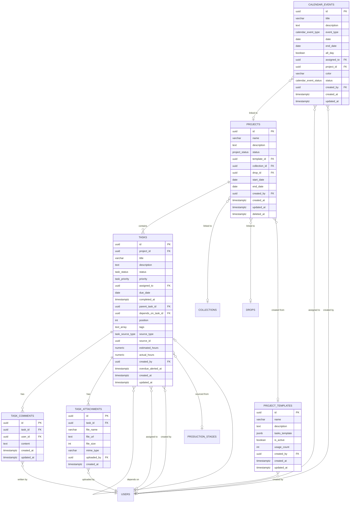

# Gestao de Tarefas e Projetos — Module Spec

> **Module:** Gestao de Tarefas e Projetos
> **Schema:** `tarefas`
> **Route prefix:** `/api/v1/tarefas`
> **Admin UI route group:** `(admin)/tarefas/*`
> **Version:** 1.0
> **Date:** March 2026
> **Status:** Approved
> **Priority:** HIGH — core team productivity tool, daily use by all 9 members
> **Replaces:** Monday.com + Trello (currently split across both tools with no integration to production or content pipeline)
> **References:** [DATABASE.md](../../architecture/DATABASE.md), [API.md](../../architecture/API.md), [AUTH.md](../../architecture/AUTH.md), [NOTIFICATIONS.md](../../platform/NOTIFICATIONS.md), [GLOSSARY.md](../../dev/GLOSSARY.md), [PCP spec](../operations/pcp.md), [Marketing Intel spec](../growth/marketing-intel.md)

---

## 1. Purpose & Scope

The Gestao de Tarefas e Projetos module is the **team productivity and project management hub** of Ambaril. It replaces the current Monday.com + Trello split by providing a unified task management system with Gantt as the primary view (Caio's preference), Kanban as an alternative, and deep integration with the PCP production pipeline. Every drop lifecycle phase (Fase 0 through Fase 5) is tracked here, every team member sees their daily workload, and every production stage automatically generates corresponding tasks.

The module also includes a **Calendar Editorial** sub-module — a content planning calendar separate from the Gantt timeline — where the creative team (Yuri, Sick) and Caio plan Instagram posts, TikTok content, email campaigns, WhatsApp broadcasts, influencer briefings, and photo shoots. This replaces the informal content planning currently done via WhatsApp messages and shared Google Sheets.

**Core responsibilities:**

| Capability | Description |
|-----------|-------------|
| **Gantt View (primary)** | Horizontal timeline showing all tasks grouped by project, color-coded by status, with drag-to-resize/move, dependency arrows, and milestone markers for drop dates. Default landing page for Tarefas module (Caio's preference). |
| **Kanban View (alternative)** | Column-based board (Todo, In Progress, Review, Done) with draggable cards showing title, assignee avatar, due date, and priority badge. User preference saved — each user chooses their default view. |
| **Task Assignment** | Assign tasks to any of the 9 team members. Tasks can have subtasks (parent/child tree), dependencies (task B cannot start until task A is done), priorities, tags, and estimated/actual hours. |
| **"My Day" View** | Personal daily view filtered to the current user, showing today's due tasks plus overdue items as a simple checkbox list. Designed for quick daily standup reference. |
| **Project Templates** | Reusable templates for recurring drop workflows. Instantiating a template from a start date auto-calculates all task due dates using relative day offsets. Drop lifecycle template covers Fase 0 (Conceito) through Fase 5 (Pos-lancamento). |
| **PCP Integration** | Bidirectional sync with PCP production stages. When a `pcp.production_stage` is created, a corresponding task is auto-generated and assigned to Tavares. When the PCP stage is completed/delayed, the linked task updates automatically. |
| **Calendar Editorial** | Monthly/weekly calendar for content planning. Events are typed (Instagram post, TikTok, email campaign, etc.) and color-coded. Separate data model from tasks — `calendar_events` vs `tasks`. Primary users: Yuri, Sick, Caio. |
| **Comments & Attachments** | Threaded comments on tasks for discussion. File attachments stored on Cloudflare R2 (shared DAM infrastructure). |
| **Deadline Alerts** | Overdue task detection with notifications via ClawdBot to Discord `#alertas`. Daily task summary digest. |

**Primary users:**

| User | Role | Device | Primary actions |
|------|------|--------|----------------|
| **Caio** | PM | Desktop | Create projects from templates, assign tasks, view Gantt timeline, monitor all projects, plan content calendar, review overdue items |
| **Tavares** | Operations | Desktop | View PCP-generated tasks, update task status, complete production-linked tasks |
| **Yuri** | Creative | Desktop + Mobile | View own tasks and calendar events, plan content calendar, mark tasks complete |
| **Sick** | Creative | Desktop | View own tasks and calendar events, manage design-related tasks |
| **Marcus** | Admin | Desktop | Full access, view overdue tasks on dashboard, monitor team productivity |
| **Ana Clara** | Operations | Mobile | View own tasks, mark tasks complete on mobile |
| **Slimgust** | Support | Desktop | View own tasks, mark tasks complete |
| **Pedro** | Finance | Desktop | View own tasks, mark tasks complete |
| **Guilherme** | Commercial | Desktop | View own tasks, mark tasks complete |

**Out of scope:** This module does NOT manage production stages directly (that is the PCP module). It does NOT manage finished goods inventory, sales orders, or customer-facing workflows. It does NOT own the Discord bot logic (that is ClawdBot/Pulse — Tarefas emits Flare events that ClawdBot consumes). It does NOT replace the Dashboard/Beacon module for executive KPI views — Tarefas focuses on operational task tracking.

---

## 2. User Stories

### 2.1 Project Management (Caio / PM)

| # | As a... | I want to... | So that... | Acceptance Criteria |
|---|---------|-------------|-----------|-------------------|
| US-01 | PM (Caio) | Create a new project from a drop template with a start date | All tasks for the drop lifecycle are auto-created with calculated due dates | Template selected from dropdown; start_date entered; tasks generated with titles, descriptions, assigned roles, priorities, and due dates based on relative_day_offset; project appears in project list with task count and date range |
| US-02 | PM (Caio) | View all projects in a Gantt timeline as the default landing page | I can see the full team workload, dependencies, and drop deadlines at a glance | Gantt chart renders task bars grouped by project, color-coded by status (green=done, blue=in_progress, yellow=review, gray=todo); dependency arrows drawn between linked tasks; drop date milestones as diamond markers; drag to resize/move tasks updates due dates |
| US-03 | PM (Caio) | Assign a task to any team member | The right person is responsible for each deliverable | Assignee dropdown shows all 9 team members with avatar and role; selecting assigns the task and triggers `task.assigned` Flare event; assignee sees task in their "My Day" when due |
| US-04 | PM (Caio) | Create a manual project without a template | I can track ad-hoc initiatives that don't follow the drop lifecycle | Create project form with name, description, start_date, end_date (optional), linked collection/drop (optional); tasks added manually afterward |
| US-05 | PM (Caio) | Switch between Gantt and Kanban views | I can use whichever visualization fits my current workflow | View toggle button in toolbar; user preference saved to localStorage; last-used view persists across sessions |
| US-06 | PM (Caio) | Filter tasks by project, assignee, status, priority, and tags | I can focus on specific subsets of the workload | Filter bar with multi-select dropdowns for each dimension; filters applied in real-time; URL query params updated for shareable filtered views |
| US-07 | PM (Caio) | See overdue tasks highlighted with a red badge across all views | I can immediately identify bottlenecks requiring intervention | Tasks where `due_date < today AND status != done` show red overdue badge; overdue count shown in project summary; overdue tasks sort to top in "My Day" |

### 2.2 Task Management (All Team Members)

| # | As a... | I want to... | So that... | Acceptance Criteria |
|---|---------|-------------|-----------|-------------------|
| US-08 | Team member | See my "My Day" view with today's tasks and overdue items | I know exactly what to work on today | Filtered list showing tasks where `assigned_to = me AND (due_date = today OR (due_date < today AND status != done))`; checkbox to mark complete; overdue tasks show red badge with days overdue |
| US-09 | Team member | Drag a task between Kanban columns to update its status | I can quickly update progress without opening the task detail | Drag-and-drop from Todo -> In Progress -> Review -> Done; status updates in real-time; animation confirms the transition |
| US-10 | Team member | Open a task detail panel with description, subtasks, comments, and attachments | I have all context needed to complete the task | Slide-over panel (sheet) with: title (editable), description (rich text), status dropdown, priority dropdown, assignee, due date picker, subtask checklist, dependency link, tags, comments thread, attachments list, activity log |
| US-11 | Team member | Add a comment to a task | I can discuss the task with teammates without leaving Ambaril | Comment input with text area; submit posts comment with user avatar and timestamp; all task participants notified via `task.comment` Flare event |
| US-12 | Team member | Upload an attachment to a task | I can share relevant files (mockups, photos, documents) directly on the task | Drag-and-drop or file picker; upload to R2 via presigned URL; attachment card shows filename, size, thumbnail (for images); max 25MB per file |
| US-13 | Team member | Create subtasks within a parent task | I can break down large tasks into smaller, trackable steps | "Add subtask" button creates child task with inherited project and parent_task_id; subtasks shown as checklist in parent task detail; parent auto-completes when all subtasks are done |
| US-14 | Team member | Set a dependency between two tasks | Dependent tasks cannot start prematurely | "Depends on" selector shows tasks in same project; dependent task shows blocked badge until dependency is done; Gantt view draws arrow from dependency to dependent |

### 2.3 PCP Integration (Tavares / Operations)

| # | As a... | I want to... | So that... | Acceptance Criteria |
|---|---------|-------------|-----------|-------------------|
| US-15 | Tavares (operations) | See PCP-generated tasks in my task list with a "PCP" badge | I know which tasks are linked to production stages and which are manual | Tasks with `source_type = pcp_auto` show a PCP badge with linked OP name; clicking badge navigates to PCP production order detail |
| US-16 | Tavares | See my tasks automatically updated when PCP stages are completed | I don't have to manually close tasks that correspond to finished production stages | When `pcp.production_stage.status` changes to `completed`, linked task status auto-updates to `done`; `completed_at` set automatically |
| US-17 | Tavares | See task due dates adjusted when PCP stage deadlines change | My task deadlines reflect the actual production schedule, not stale original dates | When `pcp.production_stage.planned_end` is updated, linked task `due_date` auto-updates; notification sent if new deadline is earlier than original |
| US-18 | System | Automatically create a task when a new PCP production stage is created | Every production stage has a corresponding trackable task without manual creation | On `pcp.production_stage` INSERT: create `tarefas.tasks` with `title = "[OP Name] - [Stage Name]"`, `assigned_to = Tavares`, `due_date = stage.planned_end`, `source_type = pcp_auto`, `source_id = stage.id`, `project_id` linked to collection project if exists |

### 2.4 Calendar Editorial (Yuri, Sick, Caio)

| # | As a... | I want to... | So that... | Acceptance Criteria |
|---|---------|-------------|-----------|-------------------|
| US-19 | PM (Caio) | Plan content on a monthly calendar with event types (Instagram, TikTok, email, etc.) | The team has a visual content roadmap aligned with drop dates | Monthly calendar grid; click date to create event; event_type dropdown with color coding; events displayed as colored chips on calendar dates; week view toggle available |
| US-20 | Creative (Yuri) | See only my assigned calendar events and content tasks | I can focus on my content responsibilities without clutter from other roles | Calendar filtered to `assigned_to = me` by default; toggle to show all events; events I'm assigned to highlighted differently from others |
| US-21 | Creative (Sick) | Create a calendar event for a photo shoot linked to a project | The creative timeline is visible alongside the production timeline | Create event with `event_type = photo_shoot`, date, description, optional project_id link; event appears on calendar and optionally as a milestone on the Gantt |
| US-22 | PM (Caio) | View the calendar editorial alongside the Gantt timeline | I can ensure content planning aligns with production deadlines and drop dates | Split view or tab navigation between Calendar Editorial and Gantt; drop date milestones visible on both views; calendar events are separate data (not tasks) |

### 2.5 Templates & Automation

| # | As a... | I want to... | So that... | Acceptance Criteria |
|---|---------|-------------|-----------|-------------------|
| US-23 | PM (Caio) | Create and edit project templates with task structures | I can standardize recurring workflows for drops | Template builder: add tasks with title, description, relative_day_offset, assigned_role (not specific user — resolved at instantiation), priority, tags, subtasks; save template; template list with usage count |
| US-24 | PM (Caio) | Instantiate a template and see all tasks auto-created | Drop project setup takes seconds instead of hours | Select template, enter project name and start_date; system creates project and generates all tasks with calculated dates (start_date + relative_day_offset); assigned_role mapped to current team members |
| US-25 | System | Send daily task summary to ClawdBot at 08:00 BRT | The team sees a morning digest of today's tasks and overdue items in Discord | ClawdBot posts to `#tarefas-diario`: "Bom dia! Tarefas de hoje: [count]. Atrasadas: [count]. [list of overdue with assignee and days overdue]" |
| US-26 | System | Emit `task.overdue` Flare event when a task becomes overdue | Overdue tasks trigger alerts to ClawdBot #alertas and in-app notifications | Hourly background job checks for tasks where `due_date < today AND status != done AND overdue_alerted_at IS NULL`; emits event; sets `overdue_alerted_at` to prevent re-alerting |

---

## 3. Data Model

### 3.1 Entity Relationship Diagram



### 3.2 Enums

```sql
CREATE TYPE tarefas.project_status AS ENUM ('active', 'completed', 'archived');

CREATE TYPE tarefas.task_status AS ENUM ('todo', 'in_progress', 'review', 'done');

CREATE TYPE tarefas.task_priority AS ENUM ('low', 'medium', 'high', 'urgent');

CREATE TYPE tarefas.task_source_type AS ENUM ('manual', 'pcp_auto', 'template');

CREATE TYPE tarefas.calendar_event_type AS ENUM (
    'drop_date', 'instagram_post', 'tiktok_post',
    'email_campaign', 'whatsapp_campaign', 'influencer_briefing',
    'creative_deadline', 'photo_shoot', 'other'
);

CREATE TYPE tarefas.calendar_event_status AS ENUM ('planned', 'confirmed', 'completed', 'cancelled');
```

### 3.3 Table Definitions

#### 3.3.1 tarefas.projects

| Column | Type | Constraints | Description |
|--------|------|-------------|-------------|
| id | UUID | PK, DEFAULT gen_random_uuid() | UUID v7 |
| name | VARCHAR(255) | NOT NULL | Project name (e.g., "Drop 13 - Inverno 2026") |
| description | TEXT | NULL | Project description and goals |
| status | tarefas.project_status | NOT NULL DEFAULT 'active' | active, completed, archived |
| template_id | UUID | NULL, FK tarefas.project_templates(id) | Template this project was created from (NULL if manual) |
| collection_id | UUID | NULL, FK pcp.collections(id) | Linked PCP collection (NULL if not production-related) |
| drop_id | UUID | NULL, FK pcp.drops(id) | Linked PCP drop (NULL if not drop-specific) |
| start_date | DATE | NOT NULL | Project start date |
| end_date | DATE | NULL | Project end date (NULL if open-ended) |
| created_by | UUID | NOT NULL, FK global.users(id) | Who created this project |
| created_at | TIMESTAMPTZ | NOT NULL DEFAULT NOW() | |
| updated_at | TIMESTAMPTZ | NOT NULL DEFAULT NOW() | |
| deleted_at | TIMESTAMPTZ | NULL | Soft delete |

**Indexes:**

```sql
CREATE INDEX idx_tarefas_projects_status ON tarefas.projects (status);
CREATE INDEX idx_tarefas_projects_collection ON tarefas.projects (collection_id) WHERE collection_id IS NOT NULL;
CREATE INDEX idx_tarefas_projects_drop ON tarefas.projects (drop_id) WHERE drop_id IS NOT NULL;
CREATE INDEX idx_tarefas_projects_template ON tarefas.projects (template_id) WHERE template_id IS NOT NULL;
CREATE INDEX idx_tarefas_projects_created_by ON tarefas.projects (created_by);
CREATE INDEX idx_tarefas_projects_active ON tarefas.projects (status, start_date) WHERE status = 'active' AND deleted_at IS NULL;
```

#### 3.3.2 tarefas.tasks

| Column | Type | Constraints | Description |
|--------|------|-------------|-------------|
| id | UUID | PK, DEFAULT gen_random_uuid() | UUID v7 |
| project_id | UUID | NOT NULL, FK tarefas.projects(id) ON DELETE CASCADE | Parent project |
| title | VARCHAR(500) | NOT NULL | Task title (e.g., "Finalizar modelagem Camiseta Preta Basic") |
| description | TEXT | NULL | Detailed task description, instructions, acceptance criteria |
| status | tarefas.task_status | NOT NULL DEFAULT 'todo' | todo, in_progress, review, done |
| priority | tarefas.task_priority | NOT NULL DEFAULT 'medium' | low, medium, high, urgent |
| assigned_to | UUID | NULL, FK global.users(id) | Team member responsible. NULL = unassigned. |
| due_date | DATE | NULL | Deadline for this task. NULL = no deadline. |
| completed_at | TIMESTAMPTZ | NULL | When the task was marked done. NULL if not yet completed. |
| parent_task_id | UUID | NULL, FK tarefas.tasks(id) ON DELETE CASCADE | Parent task (for subtask tree). NULL = top-level task. |
| depends_on_task_id | UUID | NULL, FK tarefas.tasks(id) ON DELETE SET NULL | Dependency: this task cannot start until the referenced task is done. NULL = no dependency. |
| position | INTEGER | NOT NULL DEFAULT 0 | Sort order within the project (for Kanban column ordering and Gantt row ordering) |
| tags | TEXT[] | NOT NULL DEFAULT '{}' | Free-form tags (e.g., `{'design', 'urgente', 'drop-13'}`). Used for filtering. |
| source_type | tarefas.task_source_type | NULL | How the task was created: `manual` (user), `pcp_auto` (PCP integration), `template` (template instantiation). NULL for legacy/unknown. |
| source_id | UUID | NULL | Reference to source entity: `pcp.production_stages(id)` if `source_type = pcp_auto`. NULL otherwise. |
| estimated_hours | NUMERIC(6,2) | NULL | Estimated effort in hours. NULL = not estimated. |
| actual_hours | NUMERIC(6,2) | NULL | Actual hours spent. NULL = not tracked. |
| created_by | UUID | NOT NULL, FK global.users(id) | Who created this task |
| overdue_alerted_at | TIMESTAMPTZ | NULL | When the overdue alert was sent. NULL = not yet alerted. Prevents duplicate alerts. |
| created_at | TIMESTAMPTZ | NOT NULL DEFAULT NOW() | |
| updated_at | TIMESTAMPTZ | NOT NULL DEFAULT NOW() | |

**Indexes:**

```sql
CREATE INDEX idx_tarefas_tasks_project ON tarefas.tasks (project_id);
CREATE INDEX idx_tarefas_tasks_status ON tarefas.tasks (status);
CREATE INDEX idx_tarefas_tasks_assigned ON tarefas.tasks (assigned_to) WHERE assigned_to IS NOT NULL;
CREATE INDEX idx_tarefas_tasks_due_date ON tarefas.tasks (due_date) WHERE due_date IS NOT NULL;
CREATE INDEX idx_tarefas_tasks_priority ON tarefas.tasks (priority) WHERE priority IN ('high', 'urgent');
CREATE INDEX idx_tarefas_tasks_parent ON tarefas.tasks (parent_task_id) WHERE parent_task_id IS NOT NULL;
CREATE INDEX idx_tarefas_tasks_depends ON tarefas.tasks (depends_on_task_id) WHERE depends_on_task_id IS NOT NULL;
CREATE INDEX idx_tarefas_tasks_source ON tarefas.tasks (source_type, source_id) WHERE source_type IS NOT NULL;
CREATE INDEX idx_tarefas_tasks_tags ON tarefas.tasks USING GIN (tags);
CREATE INDEX idx_tarefas_tasks_overdue ON tarefas.tasks (due_date, status) WHERE status != 'done' AND due_date IS NOT NULL;
CREATE INDEX idx_tarefas_tasks_my_day ON tarefas.tasks (assigned_to, due_date, status) WHERE assigned_to IS NOT NULL AND status != 'done';
CREATE INDEX idx_tarefas_tasks_position ON tarefas.tasks (project_id, position);
```

#### 3.3.3 tarefas.task_comments

| Column | Type | Constraints | Description |
|--------|------|-------------|-------------|
| id | UUID | PK, DEFAULT gen_random_uuid() | UUID v7 |
| task_id | UUID | NOT NULL, FK tarefas.tasks(id) ON DELETE CASCADE | Parent task |
| user_id | UUID | NOT NULL, FK global.users(id) | Comment author |
| content | TEXT | NOT NULL | Comment text. Max 4096 chars. |
| created_at | TIMESTAMPTZ | NOT NULL DEFAULT NOW() | |
| updated_at | TIMESTAMPTZ | NOT NULL DEFAULT NOW() | |

**Indexes:**

```sql
CREATE INDEX idx_tarefas_tc_task ON tarefas.task_comments (task_id, created_at ASC);
CREATE INDEX idx_tarefas_tc_user ON tarefas.task_comments (user_id);
```

#### 3.3.4 tarefas.task_attachments

| Column | Type | Constraints | Description |
|--------|------|-------------|-------------|
| id | UUID | PK, DEFAULT gen_random_uuid() | UUID v7 |
| task_id | UUID | NOT NULL, FK tarefas.tasks(id) ON DELETE CASCADE | Parent task |
| file_name | VARCHAR(255) | NOT NULL | Display filename (e.g., "mockup-camiseta-v2.psd") |
| file_url | TEXT | NOT NULL | R2 storage URL (presigned for download) |
| file_size | INTEGER | NOT NULL, CHECK (file_size > 0 AND file_size <= 26214400) | File size in bytes. Max 25MB (26214400 bytes). |
| mime_type | VARCHAR(100) | NOT NULL | MIME type (e.g., "image/png", "application/pdf") |
| uploaded_by | UUID | NOT NULL, FK global.users(id) | Who uploaded the file |
| created_at | TIMESTAMPTZ | NOT NULL DEFAULT NOW() | |

**Indexes:**

```sql
CREATE INDEX idx_tarefas_ta_task ON tarefas.task_attachments (task_id);
CREATE INDEX idx_tarefas_ta_uploaded_by ON tarefas.task_attachments (uploaded_by);
```

#### 3.3.5 tarefas.project_templates

| Column | Type | Constraints | Description |
|--------|------|-------------|-------------|
| id | UUID | PK, DEFAULT gen_random_uuid() | UUID v7 |
| name | VARCHAR(255) | NOT NULL | Template name (e.g., "Drop Lifecycle - Completo") |
| description | TEXT | NULL | What this template is for |
| tasks_template | JSONB | NOT NULL | Array of task definitions. See JSONB structure below. |
| is_active | BOOLEAN | NOT NULL DEFAULT TRUE | Inactive templates do not appear in the template selector |
| usage_count | INTEGER | NOT NULL DEFAULT 0 | Number of times this template has been instantiated. Incremented on each use. |
| created_by | UUID | NOT NULL, FK global.users(id) | Who created this template |
| created_at | TIMESTAMPTZ | NOT NULL DEFAULT NOW() | |
| updated_at | TIMESTAMPTZ | NOT NULL DEFAULT NOW() | |

**tasks_template JSONB structure:**

```json
[
  {
    "title": "Briefing de colecao",
    "description": "Definir tema, paleta de cores, referencias visuais",
    "relative_day_offset": 0,
    "duration_days": 3,
    "assigned_role": "pm",
    "priority": "high",
    "tags": ["conceito", "fase-0"],
    "subtasks": [
      {
        "title": "Definir paleta de cores",
        "relative_day_offset": 0,
        "assigned_role": "creative"
      },
      {
        "title": "Montar moodboard",
        "relative_day_offset": 1,
        "assigned_role": "creative"
      }
    ]
  },
  {
    "title": "Desenvolvimento de modelagem",
    "description": "Criar moldes para todas as pecas da colecao",
    "relative_day_offset": 7,
    "duration_days": 14,
    "assigned_role": "operations",
    "priority": "high",
    "tags": ["desenvolvimento", "fase-1"],
    "subtasks": []
  }
]
```

**Indexes:**

```sql
CREATE INDEX idx_tarefas_pt_active ON tarefas.project_templates (is_active) WHERE is_active = TRUE;
CREATE INDEX idx_tarefas_pt_usage ON tarefas.project_templates (usage_count DESC);
```

#### 3.3.6 tarefas.calendar_events

| Column | Type | Constraints | Description |
|--------|------|-------------|-------------|
| id | UUID | PK, DEFAULT gen_random_uuid() | UUID v7 |
| title | VARCHAR(255) | NOT NULL | Event title (e.g., "Post Instagram - Drop 13 teaser") |
| description | TEXT | NULL | Event details, notes, content brief |
| event_type | tarefas.calendar_event_type | NOT NULL | drop_date, instagram_post, tiktok_post, email_campaign, whatsapp_campaign, influencer_briefing, creative_deadline, photo_shoot, other |
| date | DATE | NOT NULL | Event date (start date for multi-day events) |
| end_date | DATE | NULL | End date for multi-day events (NULL = single-day). Must be >= date. |
| all_day | BOOLEAN | NOT NULL DEFAULT TRUE | Whether this is an all-day event. Currently always true (no time-of-day granularity). |
| assigned_to | UUID | NULL, FK global.users(id) | Team member responsible for this event. NULL = unassigned. |
| project_id | UUID | NULL, FK tarefas.projects(id) ON DELETE SET NULL | Linked project (NULL if standalone event) |
| color | VARCHAR(7) | NULL | Custom hex color override (e.g., "#FF6B6B"). NULL = auto-colored by event_type. |
| status | tarefas.calendar_event_status | NOT NULL DEFAULT 'planned' | planned, confirmed, completed, cancelled |
| created_by | UUID | NOT NULL, FK global.users(id) | Who created this event |
| created_at | TIMESTAMPTZ | NOT NULL DEFAULT NOW() | |
| updated_at | TIMESTAMPTZ | NOT NULL DEFAULT NOW() | |

**Indexes:**

```sql
CREATE INDEX idx_tarefas_ce_date ON tarefas.calendar_events (date);
CREATE INDEX idx_tarefas_ce_date_range ON tarefas.calendar_events (date, end_date) WHERE end_date IS NOT NULL;
CREATE INDEX idx_tarefas_ce_type ON tarefas.calendar_events (event_type);
CREATE INDEX idx_tarefas_ce_assigned ON tarefas.calendar_events (assigned_to) WHERE assigned_to IS NOT NULL;
CREATE INDEX idx_tarefas_ce_project ON tarefas.calendar_events (project_id) WHERE project_id IS NOT NULL;
CREATE INDEX idx_tarefas_ce_status ON tarefas.calendar_events (status);
CREATE INDEX idx_tarefas_ce_month ON tarefas.calendar_events (date) WHERE status != 'cancelled';
```

### 3.4 Cross-schema References

```
tarefas.projects.collection_id          ──► pcp.collections(id)
tarefas.projects.drop_id                ──► pcp.drops(id)
tarefas.projects.created_by             ──► global.users(id)
tarefas.tasks.assigned_to               ──► global.users(id)
tarefas.tasks.created_by                ──► global.users(id)
tarefas.tasks.source_id                 ──► pcp.production_stages(id) (when source_type = pcp_auto)
tarefas.task_comments.user_id           ──► global.users(id)
tarefas.task_attachments.uploaded_by    ──► global.users(id)
tarefas.calendar_events.assigned_to     ──► global.users(id)
tarefas.calendar_events.created_by      ──► global.users(id)
tarefas.calendar_events.project_id      ──► tarefas.projects(id)
tarefas.project_templates.created_by    ──► global.users(id)
```

---

## 4. Screens & Wireframes

All screens follow the Ambaril Design System: dark mode default, DM Sans, HeroUI components, Lucide React. Tarefas uses blue accent for in-progress items, green for completed, yellow for review, gray for todo, and red for overdue badges.

### 4.1 Gantt View (Primary — Default Landing)

```
+------------------------------------------------------------------------------+
|  Ambaril Admin > Tarefas                  [+ Novo Projeto] [Vista: Gantt | Kanban]|
+------------------------------------------------------------------------------+
|                                                                              |
|  Filtros: [Projeto v] [Responsavel v] [Status v] [Prioridade v] [Tags v]  |
|                                                                              |
|  Resumo: [  Total: 47  ] [  Em progresso: 12  ] [  Atrasadas: 3  ]         |
|                                                                              |
|  TIMELINE                    Mar 10   Mar 17   Mar 24   Mar 31   Abr 07    |
|  ========================      |        |        |        |        |        |
|                                         |                                    |
|  > DROP 13 - INVERNO 2026              |                                    |
|  |                                      |                                    |
|  | Briefing de colecao                  |                                    |
|  | [###########]..........................  Caio         CONCLUIDO           |
|  |                                      |                                    |
|  | Desenvolvimento de modelagem         |                                    |
|  | .......[###############]..............  Tavares      CONCLUIDO           |
|  |                                      |                                    |
|  | [PCP] OP-001 - Conceito              |                                    |
|  | .......[#########]....................  Tavares      CONCLUIDO           |
|  |                   |                  |                                    |
|  |                   v (dep)            |                                    |
|  | [PCP] OP-001 - Modelagem             |                                    |
|  | .............[>>>>>>>>>]...............  Tavares     EM ANDAMENTO        |
|  |                                      |                                    |
|  | Criar KV campanha                    |                                    |
|  | ..................[          ]..........  Sick        TODO                |
|  |                                      |                                    |
|  | Briefing influenciadores             |                                    |
|  | .....................[       ]..........  Yuri       TODO                 |
|  |                                      |                                    |
|  |                               [!] Atrasadas: 1                           |
|  | Aprovar amostras                     |                                    |
|  | .....[!!!!!!!!].......................  Caio         [ATRASADO 2d]        |
|  |                                      |                                    |
|  |                                  <> Drop 13 lancamento (25/04)           |
|  |                                                                           |
|  > MARKETING Q1 2026                                                        |
|  |                                                                           |
|  | Campanha pre-lancamento              |                                    |
|  | [>>>>>>>>]............................  Yuri         EM ANDAMENTO         |
|  |                                                                           |
+------ Legend ----------------------------------------------------------------+
|  [####] green = completed  [>>>>] blue = in progress  [    ] gray = todo    |
|  [!!!!] red = overdue      <> = milestone (drop date)                       |
|  --> = dependency arrow     (dep) = blocked by predecessor                   |
+------------------------------------------------------------------------------+
```

### 4.2 Kanban View (Alternative)

```
+------------------------------------------------------------------------------+
|  Ambaril Admin > Tarefas                  [+ Nova Tarefa] [Vista: Gantt | Kanban]|
+------------------------------------------------------------------------------+
|                                                                              |
|  Projeto: [Drop 13 - Inverno 2026  v]  Responsavel: [Todos v]              |
|                                                                              |
|  +-- TODO (5) ---------+  +-- EM PROGRESSO (3) -+  +-- REVISAO (2) ------+ |
|  |                      |  |                      |  |                      | |
|  | +------------------+ |  | +------------------+ |  | +------------------+ | |
|  | | Criar KV campanha| |  | | [PCP] OP-001     | |  | | Textos p/ email  | | |
|  | | Sick       [alta]| |  | | Modelagem        | |  | | campanha         | | |
|  | | 28/03            | |  | | Tavares   [media]| |  | | Yuri      [media]| | |
|  | | [design][drop-13]| |  | | 20/03   [PCP]    | |  | | 22/03            | | |
|  | +------------------+ |  | +------------------+ |  | +------------------+ | |
|  |                      |  |                      |  |                      | |
|  | +------------------+ |  | +------------------+ |  | +------------------+ | |
|  | | Briefing         | |  | | Campanha pre-    | |  | | Mockup embalagem | | |
|  | | influenciadores  | |  | | lancamento       | |  | | Sick      [media]| | |
|  | | Yuri      [media]| |  | | Yuri      [alta] | |  | | 24/03            | | |
|  | | 30/03            | |  | | 25/03            | |  | +------------------+ | |
|  | +------------------+ |  | +------------------+ |  |                      | |
|  |                      |  |                      |  +----------------------+ |
|  | +------------------+ |  | +------------------+ |                          |
|  | | [!!] Aprovar     | |  | | Fotos lookbook   | |  +-- CONCLUIDO (12) ---+ |
|  | | amostras         | |  | | Sick       [alta]| |  |                      | |
|  | | Caio    [urgente]| |  | | 23/03            | |  | +------------------+ | |
|  | | 15/03  ATRASADO  | |  | +------------------+ |  | | Briefing colecao | | |
|  | | [drop-13]        | |  |                      |  | | Caio      [alta] | | |
|  | +------------------+ |  +----------------------+ |  | | 10/03    [v]     | | |
|  |                      |                           |  | +------------------+ | |
|  | + 2 mais...          |                           |  |                      | |
|  +----------------------+                           |  | + 11 mais...         | |
|                                                     |  +----------------------+ |
|                                                                              |
|  Drag cards between columns to update status                                 |
|  Cards show: title, assignee avatar, due date, priority badge, tags         |
|  [!!] = overdue badge (red)    [PCP] = auto-generated from PCP             |
+------------------------------------------------------------------------------+
```

### 4.3 Task Detail (Side Panel / Sheet)

```
+------------------------------------------------------+
|  Tarefa: Criar KV campanha Drop 13              [X]  |
+------------------------------------------------------+
|                                                       |
|  Projeto: Drop 13 - Inverno 2026                     |
|                                                       |
|  Status:       [Todo           v]                    |
|  Prioridade:   [Alta           v]                    |
|  Responsavel:  [Sick (Creative) v]                   |
|  Prazo:        [28/03/2026]                          |
|  Estimativa:   [8__] horas                           |
|  Horas reais:  [___] horas                           |
|                                                       |
|  Tags: [design] [drop-13] [kv] [+]                  |
|                                                       |
|  -  -  -  -  -  -  -  -  -  -  -  -  -  -  -  -    |
|                                                       |
|  DESCRICAO                                           |
|  Criar key visual principal para a campanha do       |
|  Drop 13. Formato: 1080x1080 (feed) + 1080x1920     |
|  (stories). Usar paleta definida no briefing.        |
|  Entregar PSD + PNG exportado.                       |
|                                                       |
|  -  -  -  -  -  -  -  -  -  -  -  -  -  -  -  -    |
|                                                       |
|  SUBTAREFAS (2/4)                                    |
|  [x] Criar rascunho inicial               Sick      |
|  [x] Revisao com Caio                     Caio      |
|  [ ] Ajustes pos-revisao                  Sick      |
|  [ ] Exportar versoes finais              Sick      |
|  [+ Adicionar subtarefa]                             |
|                                                       |
|  -  -  -  -  -  -  -  -  -  -  -  -  -  -  -  -    |
|                                                       |
|  DEPENDENCIA                                          |
|  Depende de: Briefing de colecao [CONCLUIDO]         |
|                                                       |
|  -  -  -  -  -  -  -  -  -  -  -  -  -  -  -  -    |
|                                                       |
|  ANEXOS (2)                                          |
|  [img] moodboard-drop13.png      2.4 MB  [Baixar]   |
|  [doc] briefing-kv.pdf           450 KB  [Baixar]   |
|  [+ Anexar arquivo]  (max 25MB)                      |
|                                                       |
|  -  -  -  -  -  -  -  -  -  -  -  -  -  -  -  -    |
|                                                       |
|  COMENTARIOS (3)                                     |
|                                                       |
|  [Caio] 15/03 14:30                                  |
|  Priorizar a versao feed primeiro. Stories pode      |
|  ser adaptacao.                                      |
|                                                       |
|  [Sick] 15/03 16:00                                  |
|  Beleza, vou comecar pelo 1080x1080. Referencia     |
|  da paleta ta no moodboard que anexei.               |
|                                                       |
|  [Yuri] 16/03 09:00                                  |
|  Lembra de deixar espaco pro texto do copy na        |
|  versao stories!                                     |
|                                                       |
|  [Escrever comentario...]              [Enviar]      |
|                                                       |
|  -  -  -  -  -  -  -  -  -  -  -  -  -  -  -  -    |
|                                                       |
|  ATIVIDADE                                           |
|  17/03 10:00  Sick alterou status: todo              |
|  15/03 14:30  Caio adicionou comentario              |
|  14/03 11:00  Caio criou tarefa                      |
|  14/03 11:00  Caio atribuiu a Sick                   |
+------------------------------------------------------+
```

### 4.4 "My Day" View

```
+------------------------------------------------------------------------------+
|  Ambaril Admin > Tarefas > Meu Dia                       Ola, Tavares! 17/03   |
+------------------------------------------------------------------------------+
|                                                                              |
|  ATRASADAS (2)                                                [!] vermelho   |
|  +------------------------------------------------------------------------+ |
|  | [ ] [PCP] OP-002 - Aprovacao de amostra       ATRASADO 2 dias          | |
|  |     Drop 13 - Inverno 2026    Prioridade: CRITICA   [PCP]              | |
|  +------------------------------------------------------------------------+ |
|  | [ ] Revisar custos OP-003                     ATRASADO 1 dia           | |
|  |     Drop 14                   Prioridade: ALTA                          | |
|  +------------------------------------------------------------------------+ |
|                                                                              |
|  HOJE (4)                                                                    |
|  +------------------------------------------------------------------------+ |
|  | [ ] [PCP] OP-001 - Corte                      Prazo: 17/03             | |
|  |     Drop 13 - Inverno 2026    Prioridade: ALTA     [PCP]               | |
|  +------------------------------------------------------------------------+ |
|  | [ ] Confirmar entrega tecido Tecelagem Nordeste  Prazo: 17/03          | |
|  |     Drop 13 - Inverno 2026    Prioridade: MEDIA                        | |
|  +------------------------------------------------------------------------+ |
|  | [ ] Atualizar planilha fornecedores            Prazo: 17/03            | |
|  |     Operacional                Prioridade: BAIXA                        | |
|  +------------------------------------------------------------------------+ |
|  | [ ] Reuniao status producao com Caio           Prazo: 17/03            | |
|  |     Drop 13 - Inverno 2026    Prioridade: MEDIA                        | |
|  +------------------------------------------------------------------------+ |
|                                                                              |
|  ESTA SEMANA (3)                                                             |
|  +------------------------------------------------------------------------+ |
|  | [ ] [PCP] OP-001 - Costura                    Prazo: 21/03             | |
|  | [ ] Negociar preco lote 500 un com Silva      Prazo: 19/03             | |
|  | [ ] Revisar grade OP-004                      Prazo: 22/03             | |
|  +------------------------------------------------------------------------+ |
|                                                                              |
|  Marcar checkbox = status -> done, completed_at = NOW()                     |
|  Click tarefa = abre painel de detalhe                                      |
+------------------------------------------------------------------------------+
```

#### 4.4.1 Modo Foco (Focus Mode)

Each team member (or their manager) can designate **1 task as "Foco da Semana"** (Focus of the Week). This feature implements radical prioritization: among all tasks, one is the single most important deliverable for the week.

```
+------------------------------------------------------------------------------+
|  Ambaril Admin > Tarefas > Meu Dia                       Ola, Tavares! 17/03   |
+------------------------------------------------------------------------------+
|                                                                              |
|  +======================================================================+   |
|  ||  FOCO DA SEMANA                                          [Alterar]  ||   |
|  ||                                                                      ||   |
|  ||  [PCP] OP-001 - Corte                                               ||   |
|  ||  Drop 13 - Inverno 2026    Prioridade: ALTA     [PCP]               ||   |
|  ||  Prazo: 17/03   Estimativa: 8h                                      ||   |
|  ||                                                                      ||   |
|  ||  [Abrir tarefa]                              [Marcar como concluida] ||   |
|  +======================================================================+   |
|                                                                              |
|  ATRASADAS (2)                                     [!] vermelho  (opacity) |
|  +- - - - - - - - - - - - - - - - - - - - - - - - - - - - - - - - - - -+ |
|  | [ ] [PCP] OP-002 - Aprovacao de amostra       ATRASADO 2 dias        | |
|  | [ ] Revisar custos OP-003                     ATRASADO 1 dia         | |
|  +- - - - - - - - - - - - - - - - - - - - - - - - - - - - - - - - - - -+ |
|                                                                              |
|  HOJE (3)                                          (opacity reduzida)       |
|  +- - - - - - - - - - - - - - - - - - - - - - - - - - - - - - - - - - -+ |
|  | [ ] Confirmar entrega tecido                  Prazo: 17/03           | |
|  | [ ] Atualizar planilha fornecedores           Prazo: 17/03           | |
|  | [ ] Reuniao status producao com Caio          Prazo: 17/03           | |
|  +- - - - - - - - - - - - - - - - - - - - - - - - - - - - - - - - - - -+ |
|                                                                              |
|  Foco da Semana: tarefa destacada com borda e fundo acentuado (Moonstone)     |
|  Demais tarefas: opacidade reduzida (60%) para de-enfatizar visualmente    |
|  Gantt: barra da tarefa foco com cor destacada (Moonstone accent)              |
+------------------------------------------------------------------------------+
```

**Focus Mode rules:**
- Only **1 focus task per user per week**. Setting a new focus replaces the previous one.
- The focus resets automatically every **Monday at 00:00 BRT** (or can be changed manually at any time during the week).
- Users with `admin` or `pm` role can set the focus for **any team member**. Other roles can only set their own focus.
- Focus Mode is **optional** — toggled per-user in settings (`tarefas_focus_mode_enabled: boolean`, default `true`). When disabled, "My Day" renders in the standard layout without the focus card.
- In the **Gantt view**, the focus task bar uses a highlighted color (Moonstone accent) to stand out from other task bars.
- Focus task stored as `tarefas.user_focus` (user_id UNIQUE, task_id FK, week_start DATE, set_by UUID FK, created_at, updated_at). One row per user at a time.

**Ref:** Pandora96 principle — radical prioritization, 1 focus at a time.

### 4.5 Project List

```
+------------------------------------------------------------------------------+
|  Ambaril Admin > Tarefas > Projetos                            [+ Novo Projeto] |
+------------------------------------------------------------------------------+
|                                                                              |
|  Status: [Todos v]    Buscar: [_________________________________]           |
|                                                                              |
|  +------+----------------------------+--------+----------+----------+------+ |
|  | #    | Nome                       | Status | Progresso| Tarefas  | Prazo| |
|  +------+----------------------------+--------+----------+----------+------+ |
|  | P-01 | Drop 13 - Inverno 2026     | Ativo  | [=====>] | 12/20    |25/04 | |
|  |      |                            |        | 60%      | 3 atras. |      | |
|  +------+----------------------------+--------+----------+----------+------+ |
|  | P-02 | Drop 14 - Inverno 2026     | Ativo  | [==>   ] | 4/18     |15/05 | |
|  |      |                            |        | 22%      | 1 atras. |      | |
|  +------+----------------------------+--------+----------+----------+------+ |
|  | P-03 | Marketing Q1 2026          | Ativo  | [======>]| 8/10     |31/03 | |
|  |      |                            |        | 80%      | 0 atras. |      | |
|  +------+----------------------------+--------+----------+----------+------+ |
|  | P-04 | Campanha Carnaval          | Concl. | [=======]| 15/15    |05/03 | |
|  |      |                            |        | 100%     |          |      | |
|  +------+----------------------------+--------+----------+----------+------+ |
|                                                                              |
|  Progresso = (tarefas concluidas / total tarefas) * 100                     |
|  Click row = abrir projeto (Gantt/Kanban filtrado)                          |
+------------------------------------------------------------------------------+
```

### 4.6 Project Template Manager

```
+------------------------------------------------------------------------------+
|  Ambaril Admin > Tarefas > Templates                        [+ Novo Template]   |
+------------------------------------------------------------------------------+
|                                                                              |
|  +------+-------------------------------+---------+-------+------+---------+ |
|  | #    | Nome                          | Tarefas | Usos  | Ativo| Acoes   | |
|  +------+-------------------------------+---------+-------+------+---------+ |
|  | T-01 | Drop Lifecycle - Completo     | 24      | 5     | Sim  | [E] [D] | |
|  |      | Fases 0-5 com subtarefas      |         |       |      |         | |
|  +------+-------------------------------+---------+-------+------+---------+ |
|  | T-02 | Mini Drop (sem producao)      | 8       | 2     | Sim  | [E] [D] | |
|  |      | Apenas marketing + lancamento |         |       |      |         | |
|  +------+-------------------------------+---------+-------+------+---------+ |
|  | T-03 | Campanha Marketing            | 12      | 3     | Sim  | [E] [D] | |
|  |      | Planejamento + execucao mkt   |         |       |      |         | |
|  +------+-------------------------------+---------+-------+------+---------+ |
|                                                                              |
|  [E] = Editar template    [D] = Desativar                                   |
|  [P] = Playbook (templates com framework estruturado)                       |
|                                                                              |
|  EDITOR DE TEMPLATE (ao clicar Editar)                                      |
|  +------------------------------------------------------------------+       |
|  | Nome: [Drop Lifecycle - Completo_____________________]            |       |
|  | Descricao: [Todas as fases do lancamento de um drop__]            |       |
|  |                                                                    |       |
|  | TAREFAS DO TEMPLATE                                                |       |
|  | +---+---------------------------+------+-----------+---------+    |       |
|  | | # | Titulo                    | Dia  | Role      | Prior.  |    |       |
|  | +---+---------------------------+------+-----------+---------+    |       |
|  | | 1 | Briefing de colecao       | +0   | pm        | alta    |    |       |
|  | |   |  > Definir paleta         | +0   | creative  | media   |    |       |
|  | |   |  > Montar moodboard       | +1   | creative  | media   |    |       |
|  | | 2 | Desenvolver modelagem     | +7   | operations| alta    |    |       |
|  | | 3 | Producao de amostras      | +14  | operations| alta    |    |       |
|  | | 4 | Aprovacao de amostras     | +21  | pm        | urgente |    |       |
|  | | 5 | Criar KV campanha         | +21  | creative  | alta    |    |       |
|  | | 6 | Briefing influenciadores  | +28  | pm        | media   |    |       |
|  | | 7 | Fotos lookbook            | +28  | creative  | alta    |    |       |
|  | | ...                          |      |           |         |    |       |
|  | +---+---------------------------+------+-----------+---------+    |       |
|  |                                                                    |       |
|  | [+ Adicionar tarefa]                           [Salvar Template]  |       |
|  +------------------------------------------------------------------+       |
|                                                                              |
|  PLAYBOOK FRAMEWORK (templates com campos estruturados)                      |
|  Templates marcados como "Playbook" armazenam 6 campos de metadata          |
|  alem da lista de tarefas. Ao instanciar, os campos aparecem como           |
|  card resumo no topo da visao do projeto.                                    |
|                                                                              |
|  +------------------------------------------------------------------+       |
|  | PLAYBOOK: Drop Launch                                     [Edit] |       |
|  +------------------------------------------------------------------+       |
|  |                                                                  |       |
|  |  O que?              Lancamento completo de uma colecao/drop     |       |
|  |  Para quem?          Clientes DTC + seguidores IG + base WA     |       |
|  |  Resultado esperado? Faturamento > R$ 40k no D0-D7              |       |
|  |  Custo estimado?     R$ 8.000 (producao + ads + influencers)    |       |
|  |  Quem executa?       Caio (PM) + Yuri/Sick (criativo) +         |       |
|  |                      Tavares (producao)                          |       |
|  |  Como?               24 tarefas em 5 fases (template abaixo)    |       |
|  |                                                                  |       |
|  +------------------------------------------------------------------+       |
|                                                                              |
|  Playbooks pre-configurados:                                                 |
|  T-PB01  "Drop Launch"          -- lancamento completo de colecao           |
|  T-PB02  "Campaign Creator"     -- campanha com creators/influencers        |
|  T-PB03  "Collab Release"       -- colecao colaborativa com parceiro        |
|  T-PB04  "Restock Campaign"     -- reabastecimento + comunicacao retorno    |
|                                                                              |
|  Ref: Pandora96 -- playbooks estruturados garantem que toda campanha        |
|  responde 6 perguntas antes da execucao.                                    |
+------------------------------------------------------------------------------+
```

#### 4.6.1 Playbook Framework

Templates can optionally be marked as **Playbooks** — structured templates that include 6 strategic metadata fields in addition to the standard task list. The playbook fields ensure every project created from the template has a clear objective, audience, expected result, budget, responsible team, and approach defined upfront.

**Playbook metadata fields (stored in `project_templates.playbook_metadata JSONB`):**

| # | Field | Label (PT-BR) | Description |
|---|-------|---------------|-------------|
| 1 | `objective` | O que? | The objective or deliverable of the project |
| 2 | `target_audience` | Para quem? | Target audience or persona this project serves |
| 3 | `expected_result` | Resultado esperado? | Measurable outcome or success metric |
| 4 | `estimated_cost` | Custo estimado? | Budget allocation in BRL |
| 5 | `executors` | Quem executa? | Assignee(s) or team responsible |
| 6 | `approach` | Como? | Step-by-step approach or methodology |

**Behavior:**
- When a template has `is_playbook = true`, the 6 fields are stored in `playbook_metadata` JSONB on the `project_templates` table.
- On instantiation, the playbook metadata is copied to the project record (`projects.playbook_metadata JSONB`).
- In the project detail view (Gantt or Kanban), a **Playbook Summary Card** renders at the top of the page showing all 6 fields as a structured grid.
- Playbook metadata is editable per-project after instantiation (the template provides defaults, the PM can customize per-project).

**Pre-built playbook templates:**

| ID | Name | Objective | Use case |
|----|------|-----------|----------|
| T-PB01 | **Drop Launch** | Full collection/drop launch lifecycle | Every new drop (Fase 0-5) |
| T-PB02 | **Campaign Creator** | Creator/influencer campaign planning and execution | Campaigns with Creators module integration |
| T-PB03 | **Collab Release** | Collaborative collection with external partner | Co-branded releases (e.g., partners, artists) |
| T-PB04 | **Restock Campaign** | Restock communication and demand capture | When popular items return to stock |

**Ref:** Pandora96 uses structured playbooks to ensure every campaign answers 6 fundamental questions before any execution begins.

### 4.7 Calendar Editorial

```
+------------------------------------------------------------------------------+
|  Ambaril Admin > Tarefas > Calendario Editorial         [+ Novo Evento] [Mes|Sem]|
+------------------------------------------------------------------------------+
|                                                                              |
|  Filtros: [Tipo v] [Responsavel v] [Status v]            < Marco 2026 >    |
|                                                                              |
|  +------+------+------+------+------+------+------+                         |
|  | Seg  | Ter  | Qua  | Qui  | Sex  | Sab  | Dom  |                         |
|  +------+------+------+------+------+------+------+                         |
|  |  2   |  3   |  4   |  5   |  6   |  7   |  8   |                         |
|  |      |      |      |      |      |      |      |                         |
|  +------+------+------+------+------+------+------+                         |
|  |  9   | 10   | 11   | 12   | 13   | 14   | 15   |                         |
|  |      | [IG] | [TK] |      | [IG] |      |      |                         |
|  |      | Post | Reel |      | Post |      |      |                         |
|  |      | Yuri | Yuri |      | Yuri |      |      |                         |
|  +------+------+------+------+------+------+------+                         |
|  | 16   | 17   | 18   | 19   | 20   | 21   | 22   |                         |
|  | [EM] |      | [IG] | [WA] | [FT] |      |      |                         |
|  | Email|      | Caro | Disp | Photo|      |      |                         |
|  | camp.| HOJE | ssel | aro  | shoot|      |      |                         |
|  | Caio |      | Yuri | Caio | Sick |      |      |                         |
|  +------+------+------+------+------+------+------+                         |
|  | 23   | 24   | 25   | 26   | 27   | 28   | 29   |                         |
|  | [IG] | [TK] | [DR] | [IB] |      | [IG] |      |                         |
|  | Post | Reel | DROP | Brief|      | Post |      |                         |
|  | teas | bts  | 13!! | influ|      | lanc |      |                         |
|  | Yuri | Yuri | MILE | Caio |      | Yuri |      |                         |
|  |      |      | STONE|      |      |      |      |                         |
|  +------+------+------+------+------+------+------+                         |
|  | 30   | 31   |      |      |      |      |      |                         |
|  | [EM] |      |      |      |      |      |      |                         |
|  | Pos- |      |      |      |      |      |      |                         |
|  | lanc |      |      |      |      |      |      |                         |
|  | Caio |      |      |      |      |      |      |                         |
|  +------+------+------+------+------+------+------+                         |
|                                                                              |
|  Legenda cores:                                                              |
|  [IG] roxo = Instagram    [TK] rosa = TikTok    [EM] azul = Email          |
|  [WA] verde = WhatsApp    [FT] amarelo = Photo   [DR] vermelho = Drop date |
|  [IB] laranja = Influencer briefing   [CD] cinza = Creative deadline        |
|                                                                              |
|  Click event = abrir detalhe/editar    Click empty date = criar evento      |
+------------------------------------------------------------------------------+
```

### 4.8 PCP Integration View

```
+------------------------------------------------------------------------------+
|  Ambaril Admin > Tarefas > Tarefas PCP                                         |
+------------------------------------------------------------------------------+
|                                                                              |
|  Tarefas geradas automaticamente a partir do PCP (somente leitura de        |
|  origem — status sincronizado bidirecionalmente)                             |
|                                                                              |
|  Colecao: [Inverno 2026 v]     Status: [Todos v]                           |
|                                                                              |
|  +------------------------------------------------------------------------+ |
|  | [PCP] OP-001 - Conceito                                CONCLUIDO      | |
|  | Drop 13 | Camiseta Preta Basic P | Tavares | 01/03-05/03              | |
|  | Origem: pcp.production_stages #abc123      [Ir para OP ->]            | |
|  +------------------------------------------------------------------------+ |
|  | [PCP] OP-001 - Modelagem                               CONCLUIDO      | |
|  | Drop 13 | Camiseta Preta Basic P | Tavares | 06/03-10/03              | |
|  | Origem: pcp.production_stages #def456      [Ir para OP ->]            | |
|  +------------------------------------------------------------------------+ |
|  | [PCP] OP-001 - Corte                                   EM ANDAMENTO   | |
|  | Drop 13 | Camiseta Preta Basic P | Tavares | 29/03-05/04              | |
|  | Origem: pcp.production_stages #ghi789      [Ir para OP ->]            | |
|  +------------------------------------------------------------------------+ |
|  | [PCP] OP-002 - Graduacao                               [ATRASADO 2d]  | |
|  | Drop 13 | Moletom Oversized M    | Tavares | 15/03-18/03              | |
|  | Origem: pcp.production_stages #jkl012      [Ir para OP ->]            | |
|  +------------------------------------------------------------------------+ |
|                                                                              |
|  Badge [PCP] indica tarefa auto-gerada. Nao pode ser deletada manualmente. |
|  Status sincronizado com PCP: completar no PCP = completa aqui.            |
|  [Ir para OP ->] navega para a tela de detalhe da OP no modulo PCP.        |
+------------------------------------------------------------------------------+
```

---

## 5. API Endpoints

All endpoints follow the patterns defined in [API.md](../../architecture/API.md). Dates in ISO 8601. Auth via session cookie.

### 5.1 Admin Endpoints (Auth Required)

Route prefix: `/api/v1/tarefas`

#### 5.1.1 Projects

| Method | Path | Auth | Description | Request Body / Query | Response |
|--------|------|------|-------------|---------------------|----------|
| GET | `/projects` | Internal | List projects (paginated, filterable) | `?cursor=&limit=25&status=active&collection_id=&drop_id=&search=` | `{ data: Project[], meta: Pagination }` |
| GET | `/projects/:id` | Internal | Get project detail with summary (task counts, progress %) | `?include=summary` | `{ data: Project }` |
| POST | `/projects` | Internal | Create a new project | `{ name, description?, start_date, end_date?, collection_id?, drop_id? }` | `201 { data: Project }` |
| PATCH | `/projects/:id` | Internal | Update project fields | `{ name?, description?, status?, start_date?, end_date? }` | `{ data: Project }` |
| DELETE | `/projects/:id` | Internal | Soft-delete project (sets deleted_at) | -- | `204` |
| POST | `/projects/from-template` | Internal | Instantiate project from template | `{ template_id, name, start_date, collection_id?, drop_id? }` | `201 { data: Project }` (with all tasks created) |

#### 5.1.2 Tasks

| Method | Path | Auth | Description | Request Body / Query | Response |
|--------|------|------|-------------|---------------------|----------|
| GET | `/projects/:id/tasks` | Internal | List tasks for a project (flat or tree) | `?status=&assigned_to=&priority=&tags=&tree=false&sort=position` | `{ data: Task[] }` |
| GET | `/tasks/:id` | Internal | Get task detail with comments, attachments, subtasks | `?include=comments,attachments,subtasks,activity` | `{ data: Task }` |
| POST | `/projects/:id/tasks` | Internal | Create a new task | `{ title, description?, priority?, assigned_to?, due_date?, parent_task_id?, depends_on_task_id?, tags?, estimated_hours? }` | `201 { data: Task }` |
| PATCH | `/tasks/:id` | Internal | Update task fields | `{ title?, description?, status?, priority?, assigned_to?, due_date?, position?, tags?, estimated_hours?, actual_hours? }` | `{ data: Task }` |
| DELETE | `/tasks/:id` | Internal | Delete task (hard delete for manual tasks; blocked for PCP tasks) | -- | `204` |
| POST | `/tasks/:id/actions/complete` | Internal | Mark task as done | `{ actual_hours? }` | `{ data: Task }` (status=done, completed_at=NOW()) |
| POST | `/tasks/:id/actions/assign` | Internal | Assign task to team member | `{ assigned_to }` | `{ data: Task }` |
| POST | `/tasks/:id/actions/reorder` | Internal | Update task position (for drag-and-drop) | `{ position, status? }` | `{ data: Task }` |
| GET | `/tasks/my-day` | Internal | Get current user's tasks for "My Day" view | `?date=today` | `{ data: { overdue: Task[], today: Task[], this_week: Task[] } }` |
| GET | `/tasks/overdue` | Internal | Get all overdue tasks across all projects | `?assigned_to=&project_id=` | `{ data: Task[] }` |
| GET | `/tasks/gantt` | Internal | Get tasks optimized for Gantt rendering | `?project_id=&dateFrom=&dateTo=` | `{ data: GanttTask[] }` (includes dependency links, milestone markers) |

#### 5.1.3 Comments

| Method | Path | Auth | Description | Request Body / Query | Response |
|--------|------|------|-------------|---------------------|----------|
| GET | `/tasks/:id/comments` | Internal | List comments for a task (chronological) | `?cursor=&limit=50` | `{ data: Comment[] }` |
| POST | `/tasks/:id/comments` | Internal | Add a comment to a task | `{ content }` | `201 { data: Comment }` |
| PATCH | `/comments/:id` | Internal | Edit own comment | `{ content }` | `{ data: Comment }` |
| DELETE | `/comments/:id` | Internal | Delete own comment | -- | `204` |

#### 5.1.4 Attachments

| Method | Path | Auth | Description | Request Body / Query | Response |
|--------|------|------|-------------|---------------------|----------|
| GET | `/tasks/:id/attachments` | Internal | List attachments for a task | -- | `{ data: Attachment[] }` |
| POST | `/tasks/:id/attachments/presign` | Internal | Get presigned R2 upload URL | `{ file_name, mime_type, file_size }` | `{ upload_url, file_url }` |
| POST | `/tasks/:id/attachments` | Internal | Confirm attachment after upload to R2 | `{ file_name, file_url, file_size, mime_type }` | `201 { data: Attachment }` |
| DELETE | `/attachments/:id` | Internal | Delete attachment (R2 file + record) | -- | `204` |

#### 5.1.5 Templates

| Method | Path | Auth | Description | Request Body / Query | Response |
|--------|------|------|-------------|---------------------|----------|
| GET | `/templates` | Internal | List all active templates | `?search=` | `{ data: Template[] }` |
| GET | `/templates/:id` | Internal | Get template detail with task structure | -- | `{ data: Template }` |
| POST | `/templates` | Internal | Create a new template | `{ name, description?, tasks_template }` | `201 { data: Template }` |
| PATCH | `/templates/:id` | Internal | Update template | `{ name?, description?, tasks_template?, is_active? }` | `{ data: Template }` |
| DELETE | `/templates/:id` | Internal | Deactivate template (soft: sets is_active=false) | -- | `204` |

#### 5.1.6 Calendar Events

| Method | Path | Auth | Description | Request Body / Query | Response |
|--------|------|------|-------------|---------------------|----------|
| GET | `/calendar` | Internal | List calendar events for a date range | `?dateFrom=&dateTo=&event_type=&assigned_to=&status=&project_id=` | `{ data: CalendarEvent[] }` |
| GET | `/calendar/:id` | Internal | Get calendar event detail | -- | `{ data: CalendarEvent }` |
| POST | `/calendar` | Internal | Create a calendar event | `{ title, description?, event_type, date, end_date?, assigned_to?, project_id?, color?, status? }` | `201 { data: CalendarEvent }` |
| PATCH | `/calendar/:id` | Internal | Update calendar event | `{ title?, description?, event_type?, date?, end_date?, assigned_to?, project_id?, color?, status? }` | `{ data: CalendarEvent }` |
| DELETE | `/calendar/:id` | Internal | Delete calendar event (hard delete) | -- | `204` |

### 5.2 Internal Endpoints (Module-to-Module)

Route prefix: `/api/v1/tarefas/internal`

| Method | Path | Auth | Description | Request Body / Query | Response |
|--------|------|------|-------------|---------------------|----------|
| POST | `/tasks/from-pcp` | Service | Create task from PCP production stage | `{ production_order_id, production_stage_id, op_name, stage_name, assigned_to, due_date, project_id? }` | `201 { data: Task }` |
| PATCH | `/tasks/by-source/:source_id` | Service | Update PCP-linked task (status sync, due date change) | `{ status?, due_date? }` | `{ data: Task }` |
| GET | `/tasks/by-source/:source_id` | Service | Get task by PCP source ID | -- | `{ data: Task }` |
| GET | `/tasks/overdue/summary` | Service | Get overdue tasks summary for ClawdBot/Dashboard | -- | `{ data: { total_overdue, by_assignee: [{user, count}], tasks: [{title, assignee, days_overdue}] } }` |

---

## 6. Business Rules

### 6.1 View & Navigation Rules

| # | Rule | Detail |
|---|------|--------|
| R1 | **Gantt is primary view** | The Gantt timeline is the default landing page for the Tarefas module. This is Caio's preference as PM. The URL `/tarefas` loads Gantt view unless the user has saved a different preference. |
| R2 | **Kanban is alternative view** | Each user can toggle between Gantt and Kanban. The preference is saved per-user in localStorage: `tarefas_default_view: 'gantt' | 'kanban'`. Both views show the same underlying data. |
| R3 | **Calendar Editorial is separate** | The Calendar Editorial is a distinct sub-page (`/tarefas/calendario`), NOT a tab within Gantt/Kanban. It uses different data (`calendar_events` table) from tasks. Navigation: sidebar sub-item under Tarefas. |
| R3b | **Focus Mode is optional per-user** | Focus Mode ("Modo Foco") is enabled by default but can be toggled per-user in Tarefas settings (`tarefas_focus_mode_enabled`). When enabled, the "My Day" view renders the focus task prominently at the top with highlighted styling, and all other tasks appear with reduced opacity (secondary styling). When disabled, "My Day" renders in the standard flat layout. Managers (`admin`, `pm`) can set the focus task for any team member; other roles can only set their own. |

### 6.2 Task Status Rules

| # | Rule | Detail |
|---|------|--------|
| R4 | **Task status flow** | Valid transitions: `todo` -> `in_progress` -> `review` -> `done`. Shortcut allowed: `todo` -> `in_progress` -> `done` (skip review). Also allowed: `in_progress` -> `todo` (reset), `review` -> `in_progress` (needs rework), `done` -> `todo` (reopen). Invalid transitions return 409 Conflict. |
| R5 | **Overdue detection** | A task is overdue when `due_date < CURRENT_DATE AND status != 'done'`. Overdue tasks display a red badge with the number of days overdue (`CURRENT_DATE - due_date`). |
| R6 | **Overdue alert** | When a task becomes overdue AND `overdue_alerted_at IS NULL`, the system emits a `task.overdue` Flare event with `{ task_id, title, assignee_name, project_name, days_overdue }`. Sets `overdue_alerted_at = NOW()` to prevent re-alerting. Notification sent to assignee (in-app) + pm (in-app + Discord #alertas). |
| R7 | **Completion timestamp** | When `status` changes to `done`, `completed_at` is set to `NOW()`. When `status` changes away from `done` (reopen), `completed_at` is set to `NULL`. |

### 6.3 PCP Integration Rules

| # | Rule | Detail |
|---|------|--------|
| R8 | **PCP auto-task creation** | When a `pcp.production_stage` is created (INSERT), the system auto-creates a `tarefas.tasks` record with: `title = "[OP Name] - [Stage Name]"` (e.g., "OP-001 Camiseta Preta - Corte"), `source_type = 'pcp_auto'`, `source_id = stage.id`, `assigned_to = Tavares (operations user)`, `due_date = stage.planned_end`, `priority = OP priority mapped`. If a project exists for the OP's collection, the task is assigned to that project. Otherwise, a default "PCP - [Collection Name]" project is auto-created. |
| R9 | **PCP stage completion sync** | When `pcp.production_stage.status` changes to `completed`, the linked task (found by `source_type = 'pcp_auto' AND source_id = stage.id`) automatically transitions to `status = 'done'` with `completed_at = NOW()`. This happens via Flare event listener, not direct DB mutation. |
| R10 | **PCP stage delay sync** | When `pcp.production_stage.planned_end` is updated, the linked task's `due_date` is updated to match. If the new due_date is earlier than the original and the task is not yet done, a notification is sent to the assignee: "Prazo antecipado: [task title] agora vence em [new date]." |
| R11 | **PCP tasks are protected** | Tasks with `source_type = 'pcp_auto'` cannot be deleted manually (DELETE returns 403). They can be reassigned, have comments/attachments added, and have their description edited, but `title`, `source_type`, `source_id`, and `project_id` are immutable. Status changes are allowed only via PCP sync or manual completion by the assignee. |

### 6.4 Template Rules

| # | Rule | Detail |
|---|------|--------|
| R12 | **Template instantiation** | When a template is instantiated with a `start_date`, each task is created with `due_date = start_date + relative_day_offset + duration_days`. The `assigned_role` is resolved to the current user with that role (e.g., `pm` -> Caio, `operations` -> Tavares, `creative` -> first creative user or unassigned if multiple). Subtasks are created with `parent_task_id` linking. Template `usage_count` is incremented. |
| R13 | **Drop lifecycle template** | The default drop lifecycle template covers: Fase 0 - Conceito (day 0-7): briefing, moodboard, paleta. Fase 1 - Desenvolvimento (day 7-21): modelagem, amostras, aprovacao. Fase 2 - Producao (day 21-42): insumos, corte, costura, acabamento, QC. Fase 3 - Pre-lancamento (day 42-56): fotos, KV, conteudo, briefing influencers. Fase 4 - Lancamento (day 56-63): publicacao, disparos, Drop War Room. Fase 5 - Pos-lancamento (day 63-70): analise vendas, feedback, reposicao. |

### 6.5 Subtask & Dependency Rules

| # | Rule | Detail |
|---|------|--------|
| R14 | **Subtask auto-completion of parent** | When all subtasks of a parent task have `status = 'done'`, the parent task automatically transitions to `status = 'done'` with `completed_at = NOW()`. If a subtask is reopened (status changed from done), the parent reverts to its previous non-done status (default: `in_progress`). |
| R15 | **Dependency blocking** | A task with `depends_on_task_id` set cannot transition to `in_progress` until the dependency task has `status = 'done'`. Attempting to set status to `in_progress` while the dependency is incomplete returns 409 Conflict with message: "Esta tarefa depende de '[dependency title]' que ainda nao foi concluida." The Gantt view draws a dependency arrow from the dependency to the dependent task. |

### 6.6 Creative Role Restrictions

| # | Rule | Detail |
|---|------|--------|
| R16 | **Creative sees only own work** | Users with `creative` role (Yuri, Sick) see ONLY: (1) tasks assigned to them (`assigned_to = user.id`), (2) calendar events assigned to them (`assigned_to = user.id`), (3) calendar events they created. They cannot see other team members' tasks. They can see project-level info (name, dates) for context but not other members' task details. This is enforced at the API level (query filter), not just the UI. |

### 6.7 Notification Rules

| # | Rule | Detail |
|---|------|--------|
| R17 | **Task assignment notification** | When `assigned_to` is set or changed, emit `task.assigned` Flare event with `{ task_id, title, assignee_id, assigner_name, project_name, due_date }`. In-app notification to the assignee. |
| R18 | **Comment notification** | When a comment is added, emit `task.comment` Flare event with `{ task_id, title, comment_author, comment_preview }`. Notify: task assignee + all previous commenters on the task (task participants). Do not notify the comment author. |
| R19 | **Overdue notification to PM** | Overdue alerts go to both the task assignee AND users with `pm` role (Caio). Discord `#alertas` receives a formatted message via ClawdBot: "Tarefa atrasada: [title] - responsavel: [assignee] - [X] dias de atraso". |

### 6.8 Attachment & File Rules

| # | Rule | Detail |
|---|------|--------|
| R20 | **Attachment storage** | All task attachments are stored on Cloudflare R2 using the shared DAM infrastructure. Upload flow: (1) client requests presigned URL via `/attachments/presign`, (2) client uploads directly to R2, (3) client confirms upload via POST `/attachments` with file metadata. This avoids file data passing through the API server. |
| R21 | **Attachment limits** | Maximum file size: 25MB per file. No limit on number of attachments per task. Supported MIME types: images (jpg, png, webp, gif), documents (pdf, doc, docx, xls, xlsx), design (psd, ai, svg), video (mp4, mov — but recommend using DAM for large video files). |

### 6.9 Calendar Editorial Rules

| # | Rule | Detail |
|---|------|--------|
| R22 | **Calendar is content-focused** | Calendar events are for content planning (social posts, campaigns, shoots), NOT for task management. A content plan entry (e.g., "Post Instagram teaser Drop 13") is a calendar_event, not a task. If the content creation work needs tracking (e.g., "Design Instagram post"), that is a separate task in the Kanban/Gantt. The two are linkable via `project_id` but are distinct entities. |
| R23 | **Event type color coding** | Each `event_type` has a default color: `instagram_post` = purple (#8B5CF6), `tiktok_post` = pink (#EC4899), `email_campaign` = blue (#3B82F6), `whatsapp_campaign` = green (#22C55E), `photo_shoot` = yellow (#EAB308), `influencer_briefing` = orange (#F97316), `drop_date` = red (#EF4444), `creative_deadline` = gray (#6B7280), `other` = neutral (#94A3B8). Custom `color` field overrides the default. |

---

## 7. Integrations

### 7.1 PCP Module (Bidirectional Production Sync)

| Property | Value |
|----------|-------|
| **Purpose** | Auto-create tasks from production stages and keep status synchronized bidirectionally |
| **Integration pattern** | Flare event listeners + internal API calls |
| **PCP -> Tarefas** | On `production_stage.created` event: call `/internal/tasks/from-pcp` to create linked task. On `production_stage.completed` event: call `/internal/tasks/by-source/:id` PATCH to complete linked task. On `production_stage.deadline_changed` event: update linked task due_date. |
| **Tarefas -> PCP** | Manual task completion for PCP-linked tasks does NOT back-propagate to PCP. PCP is the source of truth for production stages. Completing a PCP-linked task in Tarefas sets the task to done but does not advance the PCP stage. (One-way authority: PCP owns stage status.) |

**Flows:**

| Flow | Direction | Trigger | Action |
|------|-----------|---------|--------|
| **Stage created** | PCP -> Tarefas | `pcp.production_stage` INSERT | Auto-create task with `source_type=pcp_auto` |
| **Stage completed** | PCP -> Tarefas | `production_stage.completed` Flare event | Auto-complete linked task |
| **Stage delayed** | PCP -> Tarefas | `production_stage.deadline_changed` Flare event | Update linked task `due_date` |
| **Stage skipped** | PCP -> Tarefas | `production_stage.skipped` Flare event | Mark linked task as `done` with note: "Estagio pulado no PCP" |

### 7.2 ClawdBot / Pulse (Discord Reports & Alerts)

| Property | Value |
|----------|-------|
| **Purpose** | Post overdue task alerts to Discord `#alertas` and daily task summaries to `#tarefas-diario` |
| **Data source** | Internal API `/tasks/overdue/summary` |
| **Alert channel** | Discord `#alertas` — triggered by `task.overdue` Flare event |
| **Daily digest** | Discord `#tarefas-diario` — triggered by `tarefas:daily-summary` background job at 08:00 BRT |

**Daily digest format:**

```
Bom dia, equipe! Resumo de tarefas para 17/03/2026:

Tarefas para hoje: 12
Atrasadas: 3

Atrasadas:
- "[PCP] OP-002 - Aprovacao de amostra" (Tavares) — 2 dias de atraso
- "Aprovar amostras Drop 13" (Caio) — 2 dias de atraso
- "Revisar custos OP-003" (Tavares) — 1 dia de atraso

Boa produtividade!
```

### 7.3 Dashboard / Beacon (Tasks Panel)

| Interaction | Direction | Mechanism | Description |
|------------|-----------|-----------|-------------|
| Overdue count | Tarefas -> Dashboard | Internal API `/tasks/overdue/summary` | Dashboard displays overdue task count as a KPI card |
| Tasks by status | Tarefas -> Dashboard | Internal API `/projects/:id/tasks?status=` with aggregation | Dashboard shows task distribution chart (todo/in_progress/review/done) |
| My tasks | Tarefas -> Dashboard | Internal API `/tasks/my-day` | Dashboard "My Tasks" widget for the logged-in user |

### 7.4 Flare (Notification Events)

Events emitted by the Tarefas module to the Flare notification system. See [NOTIFICATIONS.md](../../platform/NOTIFICATIONS.md).

| Event Key | Trigger | Channels | Recipients | Priority |
|-----------|---------|----------|------------|----------|
| `task.assigned` | Task assigned to a user | In-app | Assignee | Medium |
| `task.overdue` | Task due_date passed without completion | In-app, Discord `#alertas` | Assignee, `pm` | High |
| `task.completed` | Task marked as done | In-app | Project creator, `pm` | Low |
| `task.comment` | New comment added to a task | In-app | Task assignee + previous commenters | Medium |
| `task.deadline_approaching` | Task due_date is tomorrow and status != done | In-app | Assignee | Medium |
| `calendar.event_tomorrow` | Calendar event is scheduled for tomorrow | In-app | Event assignee | Low |

### 7.5 DAM Module (Attachment Storage)

| Property | Value |
|----------|-------|
| **Purpose** | Task attachments use the same Cloudflare R2 infrastructure as the DAM module |
| **Integration** | Shared R2 bucket with different path prefix: `tarefas/attachments/{task_id}/{filename}` |
| **Upload** | Presigned URL generation follows the same pattern as DAM uploads |
| **No DAM record** | Task attachments do NOT create `dam.assets` records. They are standalone files in R2. |

---

## 8. Background Jobs

All jobs run via PostgreSQL job queue (`FOR UPDATE SKIP LOCKED`) + Vercel Cron. No Redis/BullMQ.

| Job Name | Queue | Schedule / Trigger | Priority | Description |
|----------|-------|--------------------|----------|-------------|
| `tarefas:overdue-check` | `tarefas` | Every 1 hour | High | Find tasks where `due_date < CURRENT_DATE AND status != 'done' AND overdue_alerted_at IS NULL`. For each: emit `task.overdue` Flare event, set `overdue_alerted_at = NOW()`. Idempotent: the `overdue_alerted_at` check prevents re-alerting. |
| `tarefas:deadline-approaching` | `tarefas` | Daily 18:00 BRT | Medium | Find tasks where `due_date = CURRENT_DATE + 1 AND status != 'done'`. Emit `task.deadline_approaching` Flare event for each. Idempotent: runs once per day, events deduplicated by task_id + date. |
| `tarefas:daily-summary` | `tarefas` | Daily 08:00 BRT | Medium | Query overdue tasks summary and today's task counts. Format digest message. Post to Discord `#tarefas-diario` via ClawdBot integration. |
| `tarefas:calendar-reminder` | `tarefas` | Daily 18:00 BRT | Low | Find calendar events where `date = CURRENT_DATE + 1 AND status IN ('planned', 'confirmed')`. Emit `calendar.event_tomorrow` Flare event for each assigned user. |
| `tarefas:parent-auto-complete` | `tarefas` | On task status change (event-driven) | Medium | When a subtask's status changes to `done`, check if all sibling subtasks are also `done`. If yes, auto-complete the parent task. When a subtask is reopened, revert the parent to `in_progress` if it was auto-completed. |

---

## 9. Permissions

From [AUTH.md](../../architecture/AUTH.md).

Format: `{module}:{resource}:{action}`

| Permission | admin | pm | creative | operations | support | finance | commercial |
|-----------|-------|-----|----------|-----------|---------|---------|-----------|
| `tarefas:projects:read` | Y | Y | Own | Y | Y | Y | Y |
| `tarefas:projects:write` | Y | Y | -- | -- | -- | -- | -- |
| `tarefas:tasks:read` | Y | Y | Own | Y | Y | Y | Y |
| `tarefas:tasks:write` | Y | Y | Own | Own | Own | Own | Own |
| `tarefas:tasks:assign` | Y | Y | -- | -- | -- | -- | -- |
| `tarefas:tasks:delete` | Y | Y | -- | -- | -- | -- | -- |
| `tarefas:comments:read` | Y | Y | Own | Y | Y | Y | Y |
| `tarefas:comments:write` | Y | Y | Own | Y | Y | Y | Y |
| `tarefas:attachments:read` | Y | Y | Own | Y | Y | Y | Y |
| `tarefas:attachments:write` | Y | Y | Own | Y | Y | Y | Y |
| `tarefas:templates:read` | Y | Y | -- | -- | -- | -- | -- |
| `tarefas:templates:write` | Y | Y | -- | -- | -- | -- | -- |
| `tarefas:calendar:read` | Y | Y | Own | -- | -- | -- | -- |
| `tarefas:calendar:write` | Y | Y | Own | -- | -- | -- | -- |

**Notes:**
- `Own` = can only read/write resources where `assigned_to = user.id` (for tasks/events) or `created_by = user.id` (for comments/attachments). This is enforced at the API level with query filters, not just UI hiding.
- `admin` (Marcus) has full unrestricted access to all Tarefas resources.
- `pm` (Caio) has full access including project/template management and task assignment.
- `creative` (Yuri, Sick) can only see and modify their own tasks and calendar events (R16). They cannot view other team members' tasks. They cannot create/edit projects or templates.
- `operations`, `support`, `finance`, `commercial` can see all tasks (for context) and modify their own assigned tasks, but cannot create projects, manage templates, or access the calendar editorial.
- Template management is restricted to `admin` and `pm` only.
- Calendar Editorial is restricted to `admin`, `pm`, and `creative` — these are the roles involved in content planning.

---

## 10. Testing Checklist

Following the testing strategy from [TESTING.md](../../platform/TESTING.md).

### 10.1 Unit Tests

- [ ] Task status FSM validation (all valid transitions accepted, all invalid transitions rejected with 409)
- [ ] Overdue detection logic (`due_date < today AND status != done`)
- [ ] Template instantiation: date calculation (`start_date + relative_day_offset + duration_days`)
- [ ] Template instantiation: role resolution (`pm` -> Caio, `operations` -> Tavares, etc.)
- [ ] Subtask auto-completion: parent completes when all children are done
- [ ] Subtask auto-completion: parent reverts when child reopened
- [ ] Dependency blocking: task cannot start if dependency not done
- [ ] PCP task creation: title format, assigned_to, due_date, source_type/source_id
- [ ] PCP task protection: DELETE blocked for `source_type = pcp_auto`
- [ ] Calendar event date validation: `end_date >= date`
- [ ] Permission filtering: creative role sees only own tasks
- [ ] Gantt data endpoint: correct dependency link generation
- [ ] "My Day" query: correct filtering by assigned_to, due_date, status

### 10.2 Integration Tests

- [ ] Create project from template -> all tasks generated with correct dates, roles, subtasks
- [ ] PCP stage created -> task auto-created in Tarefas with correct linking
- [ ] PCP stage completed -> linked task auto-completed
- [ ] PCP stage deadline changed -> linked task due_date updated
- [ ] PCP stage skipped -> linked task marked done with skip note
- [ ] Task assigned -> `task.assigned` Flare event emitted, in-app notification delivered
- [ ] Task overdue -> `task.overdue` Flare event emitted, Discord alert sent via ClawdBot
- [ ] Comment added -> `task.comment` Flare event emitted, participants notified
- [ ] Attachment upload via presigned URL flow (presign -> upload to R2 -> confirm)
- [ ] Kanban drag-and-drop -> status updated, position updated
- [ ] Calendar event CRUD -> events appear on calendar, filters work
- [ ] Daily summary job -> correct message posted to Discord
- [ ] Overdue check job -> correct tasks detected, events emitted, `overdue_alerted_at` set

### 10.3 E2E Tests (Critical Path)

- [ ] **Drop project from template:** Caio creates project from "Drop Lifecycle" template with start_date -> 24 tasks created with correct dates -> tasks appear in Gantt with dependency arrows -> drop milestone visible
- [ ] **PCP full cycle:** Tavares creates OP in PCP -> 11 stages created -> 11 tasks auto-appear in Tarefas -> Tavares advances stages in PCP -> tasks auto-complete in Tarefas -> project progress reaches 100%
- [ ] **Kanban daily workflow:** Tavares opens "My Day" -> sees today's tasks -> drags task to "In Progress" -> adds comment -> uploads attachment -> drags to "Done" -> task completed_at set
- [ ] **Creative restricted view:** Yuri logs in -> sees only tasks assigned to Yuri -> cannot see Tavares' tasks -> can see calendar events assigned to Yuri -> cannot see other events
- [ ] **Overdue alert flow:** Task due_date passes -> overdue check job runs -> Flare event emitted -> Caio receives Discord alert -> task shows red badge in UI

### 10.4 Performance Tests

- [ ] Gantt view render with 100 tasks across 5 projects: < 1 second
- [ ] Kanban view load with 50 tasks per column: < 500ms
- [ ] "My Day" query (single user, 20 tasks): < 300ms
- [ ] Task list with filters (25 per page): < 500ms
- [ ] Calendar month view (30 events): < 300ms
- [ ] Template instantiation (24 tasks + subtasks): < 2 seconds
- [ ] Overdue check job (200 active tasks): < 10 seconds

### 10.5 Security Tests

- [ ] Creative role cannot access other users' tasks via direct API call (verify 403)
- [ ] Non-admin/pm cannot create projects or templates (verify 403)
- [ ] PCP auto-generated tasks cannot be deleted (verify 403)
- [ ] Attachment presigned URL scoped to correct R2 path
- [ ] Comment edit/delete restricted to comment author (except admin)
- [ ] Task assignment restricted to admin and pm roles (verify 403 for others)

---

## 11. Migration Path

### 11.1 Current State

CIENA currently uses Monday.com for project management and Trello for ad-hoc task tracking. The two tools are not integrated — Monday handles production timelines while Trello handles marketing and creative tasks. There is no integration between either tool and the production pipeline (managed via spreadsheets), no "My Day" view, and no automated alerts for overdue tasks.

### 11.2 Migration Plan

| Phase | Action | Timeline | Risk |
|-------|--------|----------|------|
| 1. Build | Develop Tarefas module with Gantt, Kanban, templates, and calendar | Weeks 1-3 | None (parallel to current tools) |
| 2. Template creation | Create drop lifecycle template and marketing campaign template based on current Monday.com workflows | Week 3 | Low — manual configuration by Caio |
| 3. Data migration | Export active projects and tasks from Monday.com and Trello. Import into Tarefas via bulk API or seed script. Map assignees, statuses, and due dates. | Week 3-4 | Medium — requires data mapping and validation |
| 4. PCP integration | Enable PCP -> Tarefas auto-task creation. Verify bidirectional sync. | Week 4 | Medium — requires PCP module to be live |
| 5. Cutover | Team switches to Tarefas module. Monday.com and Trello accounts deactivated after 2-week parallel run. | Week 5 | Low — team familiar with both Gantt and Kanban paradigms |

### 11.3 Data Migration

| Source | Data | Target | Notes |
|--------|------|--------|-------|
| Monday.com | Active boards + items | `tarefas.projects` + `tarefas.tasks` | Map Monday columns to task fields. Status mapping: "Working on it" -> in_progress, "Done" -> done, "Stuck" -> todo (with tag "bloqueado"). |
| Monday.com | Timeline view data | `tarefas.tasks` (due_date, position) | Gantt dates mapped to task due_dates |
| Trello | Active boards + cards | `tarefas.projects` + `tarefas.tasks` | Map Trello lists to task status: "To Do" -> todo, "Doing" -> in_progress, "Done" -> done. Card descriptions -> task descriptions. Card comments -> task comments. |
| Trello | Labels | `tarefas.tasks` (tags) | Trello labels mapped to task tags |

### 11.4 Rollback Plan

If the Tarefas module has critical issues within the first two weeks:
1. Re-activate Monday.com and Trello accounts (subscriptions paused, not cancelled, during cutover)
2. Export any tasks created exclusively in Ambaril to spreadsheet for manual re-entry
3. Risk is low — Monday.com/Trello are the known fallback, team can revert immediately

---

## 12. Open Questions

| # | Question | Owner | Status | Notes |
|---|----------|-------|--------|-------|
| OQ-1 | Should we support time tracking (start/stop timer on tasks) beyond manual estimated/actual hours? | Caio | Open | Would provide more accurate time data for project planning. Adds UI complexity (timer widget). Could be Phase 2. |
| OQ-2 | Should the Calendar Editorial support recurring events (e.g., "Post Instagram every Tuesday")? | Yuri / Caio | Open | Currently all events are one-off. Recurring events would reduce manual creation for regular content cadence. Adds complexity to the data model and UI. |
| OQ-3 | How should we handle multi-assignee tasks (e.g., a task that requires both Yuri and Sick)? | Caio | Open | Current spec: single assignee per task. Options: (1) create duplicate tasks, (2) add `additional_assignees UUID[]` column, (3) use subtasks for each person's portion. Option 3 is cleanest. |
| OQ-4 | Should the Gantt view support resource leveling (detecting over-allocation when a team member has too many tasks on the same dates)? | Caio | Open | Would be very useful for PM but adds significant complexity. Could be Phase 2 enhancement. |
| OQ-5 | Should we integrate with Google Calendar for calendar event sync (two-way)? | Yuri | Open | Yuri currently uses Google Calendar for personal scheduling. Syncing CIENA calendar events would avoid double-entry. Requires Google Calendar API integration. |
| OQ-6 | Should PCP task completion in Tarefas back-propagate to PCP (advance the PCP stage)? | Tavares / Caio | Open | Current spec: PCP is source of truth, one-way authority. Back-propagation could cause confusion if Tavares completes in Tarefas but didn't actually finish the PCP stage. Recommend keeping one-way for V1. |
| OQ-7 | Should we support task priority auto-escalation (e.g., a task approaching its deadline auto-escalates from medium to high priority)? | Caio | Open | Would reduce manual priority management. Risk: too many high-priority tasks dilutes the signal. |

---

*This module spec is the source of truth for Gestao de Tarefas e Projetos implementation. All development, review, and QA should reference this document. Changes require review from Caio (PM) or Marcus (admin).*
